# `flux\pkg\registry\cache\memcached\memcached.go` 详细设计文档

这是一个基于memcached的图像数据库缓存实现，通过SRV记录动态获取memcached服务器列表，并基于刷新截止日期设置缓存项的过期时间，提供缓存的存取和后台定期更新服务器列表的功能。

## 整体流程

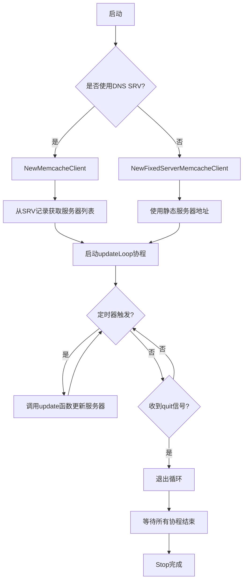

## 类结构

```
MemcacheClient (memcached客户端封装)
└── MemcacheConfig (配置结构体)
```

## 全局变量及字段


### `MinExpiry`
    
缓存项的最小过期时间（1小时）

类型：`time.Duration`
    


### `MemcacheClient.client`
    
memcache客户端实例

类型：`*memcache.Client`
    


### `MemcacheClient.serverList`
    
服务器列表

类型：`*memcache.ServerList`
    


### `MemcacheClient.hostname`
    
主机名，用于SRV记录查询

类型：`string`
    


### `MemcacheClient.service`
    
服务名，用于SRV记录查询

类型：`string`
    


### `MemcacheClient.logger`
    
日志记录器

类型：`log.Logger`
    


### `MemcacheClient.quit`
    
退出信号通道

类型：`chan struct{}`
    


### `MemcacheClient.wait`
    
等待组，用于协程同步

类型：`sync.WaitGroup`
    


### `MemcacheConfig.Host`
    
memcached服务的主机名

类型：`string`
    


### `MemcacheConfig.Service`
    
memcached服务名称

类型：`string`
    


### `MemcacheConfig.Timeout`
    
超时时间

类型：`time.Duration`
    


### `MemcacheConfig.UpdateInterval`
    
更新间隔

类型：`time.Duration`
    


### `MemcacheConfig.Logger`
    
日志记录器

类型：`log.Logger`
    


### `MemcacheConfig.MaxIdleConns`
    
最大空闲连接数

类型：`int`
    
    

## 全局函数及方法


### `NewMemcacheClient`

基于SRV记录创建memcache客户端，并启动定期更新服务器列表的后台goroutine。该函数初始化MemcacheClient实例，配置memcache客户端参数，首次尝试通过DNS SRV记录解析服务器地址，并启动定时更新机制以保持服务器列表的最新状态。

参数：

- `config`：`MemcacheConfig`，包含memcache客户端的配置信息，包括Host（SRV记录的主机名）、Service（服务名）、Timeout（超时时间）、UpdateInterval（更新间隔）、Logger（日志记录器）和MaxIdleConns（最大空闲连接数）

返回值：`*MemcacheClient`，返回初始化后的MemcacheClient指针，用于与memcache服务器交互

#### 流程图

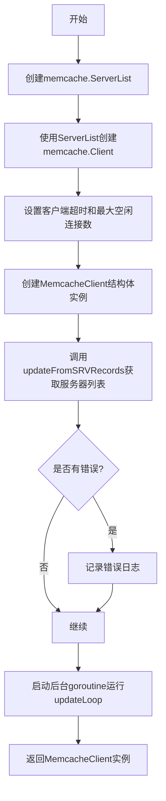

#### 带注释源码

```go
// NewMemcacheClient 基于SRV记录创建memcache客户端，并启动定期更新服务器列表的后台goroutine
// 参数config包含连接memcache所需的所有配置信息
// 返回初始化完成的MemcacheClient指针
func NewMemcacheClient(config MemcacheConfig) *MemcacheClient {
	// 1. 创建空的memcache服务器列表
	var servers memcache.ServerList
	
	// 2. 从ServerList创建memcache客户端（此时服务器列表为空）
	client := memcache.NewFromSelector(&servers)
	
	// 3. 配置客户端超时时间
	client.Timeout = config.Timeout
	
	// 4. 配置最大空闲连接数
	client.MaxIdleConns = config.MaxIdleConns

	// 5. 初始化MemcacheClient结构体
	newClient := &MemcacheClient{
		client:     client,              // memcache客户端实例
		serverList: &servers,            // 服务器列表引用
		hostname:   config.Host,         // SRV记录查询的主机名
		service:    config.Service,      // SRV记录查询的服务名
		logger:     config.Logger,       // 日志记录器
		quit:       make(chan struct{}), // 停止信号通道
	}

	// 6. 首次从SRV记录更新服务器列表
	err := newClient.updateFromSRVRecords()
	if err != nil {
		// 如果首次更新失败，记录错误但继续运行
		// 客户端将使用空的服务器列表，直到下次更新成功
		config.Logger.Log("err", errors.Wrapf(err, "Error setting memcache servers to '%v'", config.Host))
	}

	// 7. 启动后台goroutine，定期更新服务器列表
	newClient.wait.Add(1)
	go newClient.updateLoop(config.UpdateInterval, newClient.updateFromSRVRecords)
	
	// 8. 返回初始化完成的客户端
	return newClient
}
```


### `NewFixedServerMemcacheClient`

使用静态服务器列表创建 Memcache 客户端，不依赖 DNS 查询，适用于已知服务器地址的场景。

参数：

- `config`：`MemcacheConfig`，客户端配置，包含主机、服务、超时时间、更新间隔、日志记录器和最大空闲连接数等参数
- `addresses`：`...string`，可变参数，表示静态的 memcache 服务器地址列表（如 "server1:11211", "server2:11211"）

返回值：`*MemcacheClient`，返回新创建的 MemcacheClient 实例，用于与静态服务器列表交互

#### 流程图

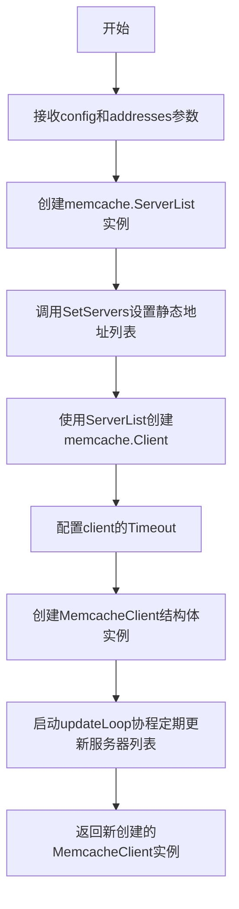

#### 带注释源码

```go
// Does not use DNS, accepts static list of servers.
// 创建不使用DNS的静态服务器列表memcache客户端
func NewFixedServerMemcacheClient(config MemcacheConfig, addresses ...string) *MemcacheClient {
	// 创建memcache.ServerList用于管理服务器列表
	var servers memcache.ServerList
	// 将传入的静态地址列表设置到ServerList中
	servers.SetServers(addresses...)
	
	// 使用ServerList作为选择器创建memcache客户端
	client := memcache.NewFromSelector(&servers)
	// 设置客户端超时时间
	client.Timeout = config.Timeout

	// 构造MemcacheClient结构体实例
	newClient := &MemcacheClient{
		client:     client,           // memcache客户端实例
		serverList: &servers,         // 服务器列表引用
		hostname:   config.Host,      // 主机名（用于SRV记录的备用场景）
		service:    config.Service,   // 服务名
		logger:     config.Logger,    // 日志记录器
		quit:       make(chan struct{}), // 退出信号通道
	}

	// 启动后台协程，定期更新服务器列表
	// 虽然这里是静态地址，但仍然保留更新机制以便动态修改地址
	go newClient.updateLoop(config.UpdateInterval, func() error {
		return servers.SetServers(addresses...)
	})
	
	// 返回新创建的MemcacheClient实例
	return newClient
}
```


### `MemcacheClient.GetKey`

获取缓存数据方法，根据指定的缓存键从Memcached中检索数据，并返回缓存的值及其刷新截止时间。

参数：

- `k`：`cache.Keyer`，缓存键接口，用于生成实际的缓存键名

返回值：

- `[]byte`：缓存的值数据（去除了4字节的截止时间头部）
- `time.Time`：缓存数据的刷新截止时间
- `error`：执行过程中的错误信息，若成功则返回nil

#### 流程图

```mermaid
flowchart TD
    A[Start: GetKey] --> B[Call c.client.Get k.Key()]
    B --> C{Error?}
    C -->|No Error| D[Extract deadline from first 4 bytes using BigEndian]
    C -->|Cache Miss| E[Return cache.ErrNotCached]
    C -->|Other Error| F[Log error with errors.Wrap]
    D --> G[Return value[4:], deadlineTime, nil]
    E --> H[Return empty bytes, zero time, cache.ErrNotCached]
    F --> I[Return empty bytes, zero time, err]
    G --> J[End]
    H --> J
    I --> J
```

#### 带注释源码

```go
// GetKey gets the value and its refresh deadline from the cache.
// 从缓存中获取值及其刷新截止时间
// 参数: k cache.Keyer - 缓存键接口
// 返回: []byte - 缓存值, time.Time - 截止时间, error - 错误信息
func (c *MemcacheClient) GetKey(k cache.Keyer) ([]byte, time.Time, error) {
    // 使用memcached客户端获取缓存项
    cacheItem, err := c.client.Get(k.Key())
    if err != nil {
        // 处理缓存未命中情况
        if err == memcache.ErrCacheMiss {
            // 缓存未命中不记录日志，直接返回特定错误
            return []byte{}, time.Time{}, cache.ErrNotCached
        } else {
            // 其他错误记录日志并返回错误
            c.logger.Log("err", errors.Wrap(err, "Fetching tag from memcache"))
            return []byte{}, time.Time{}, err
        }
    }
    // 从缓存值的前4字节提取截止时间（BigEndian编码的Unix时间戳）
    deadlineTime := binary.BigEndian.Uint32(cacheItem.Value)
    // 返回跳过前4字节的实际缓存值、解析后的截止时间、以及nil错误
    return cacheItem.Value[4:], time.Unix(int64(deadlineTime), 0), nil
}
```


### `MemcacheClient.SetKey`

设置缓存数据，将值及其刷新截止时间存储到缓存中。注意键的过期时间设置为比截止时间更长，以提供刷新值的宽限期。

参数：

- `k`：`cache.Keyer`，缓存键接口，提供键名
- `refreshDeadline`：`time.Time`，刷新截止时间，用于计算缓存过期时间
- `v`：`[]byte`，要缓存的字节数据

返回值：`error`，如果设置成功则返回 nil，否则返回错误信息

#### 流程图

```mermaid
flowchart TD
    A[开始 SetKey] --> B[计算过期时间: expiry = refreshDeadline.Sub(time.Now()) * 2]
    B --> C{expiry < MinExpiry}
    C -->|是| D[expiry = MinExpiry]
    C -->|否| E[继续]
    D --> E
    E --> F[创建4字节数组 deadlineBytes]
    F --> G[将 refreshDeadline 转为大端序uint32写入 deadlineBytes]
    G --> H[拼接数据: append(deadlineBytes, v...)]
    H --> I[调用 client.Set 设置缓存项]
    I --> J{有错误?}
    J -->|是| K[记录错误日志]
    K --> L[返回 error]
    J -->|否| M[返回 nil]
    L --> N[结束]
    M --> N
```

#### 带注释源码

```go
// SetKey sets the value and its refresh deadline at a key. NB the key
// expiry is set _longer_ than the deadline, to give us a grace period
// in which to refresh the value.
// SetKey 设置缓存值及其刷新截止时间。注意键的过期时间设置为比截止时间更长，
// 以提供刷新值的宽限期。
func (c *MemcacheClient) SetKey(k cache.Keyer, refreshDeadline time.Time, v []byte) error {
	// 计算过期时间：截止时间到当前时间的差值乘以2
	// 这样可以确保在需要垃圾回收之前，缓存项已经过期
	expiry := refreshDeadline.Sub(time.Now()) * 2
	
	// 如果计算出的过期时间小于最小过期时间（1小时），则使用最小过期时间
	// 这确保了缓存项至少保留1小时
	if expiry < MinExpiry {
		expiry = MinExpiry
	}

	// 创建一个4字节的切片，用于存储截止时间的Unix时间戳
	// 使用大端序（BigEndian）编码
	deadlineBytes := make([]byte, 4, 4)
	
	// 将截止时间的Unix时间戳转换为uint32，并使用大端序写入字节数组
	binary.BigEndian.PutUint32(deadlineBytes, uint32(refreshDeadline.Unix()))
	
	// 调用 memcached 客户端的 Set 方法设置缓存项
	// 值由4字节的截止时间戳 + 实际数据组成
	if err := c.client.Set(&memcache.Item{
		Key:        k.Key(),                                  // 缓存键名
		Value:      append(deadlineBytes, v...),              // 截止时间戳+值
		Expiration: int32(expiry.Seconds()),                  // 过期时间（秒）
	}); err != nil {
		// 如果设置失败，记录错误日志并返回错误
		c.logger.Log("err", errors.Wrap(err, "storing in memcache"))
		return err
	}
	
	// 设置成功，返回 nil
	return nil
}
```


### `MemcacheClient.Stop`

停止memcache客户端，关闭用于信号退出的通道并等待所有后台goroutine安全完成。

参数：

- （无参数）

返回值：（无返回值），该方法不返回任何值，用于停止客户端并清理资源。

#### 流程图

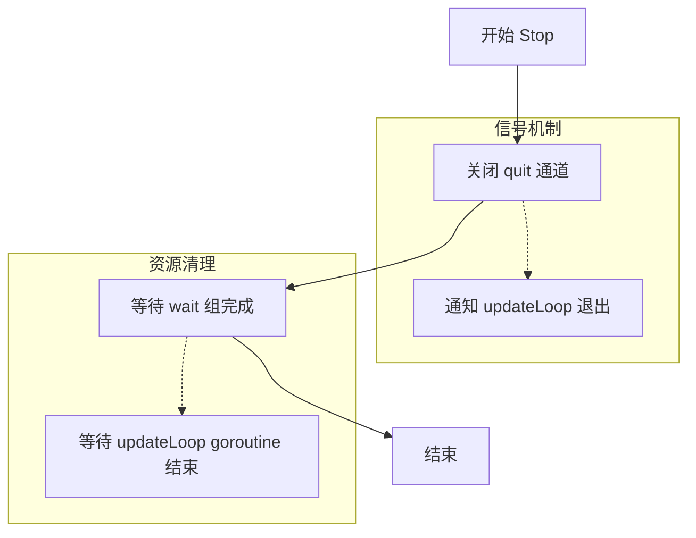

#### 带注释源码

```go
// Stop the memcache client.
// 停止memcache客户端。
// 该方法执行两项关键操作：
// 1. 关闭 quit 通道，向所有监听该通道的 goroutine 发送退出信号
// 2. 等待 wait 组中的所有 goroutine 完成，确保优雅关闭
func (c *MemcacheClient) Stop() {
	// 关闭 quit 通道
	// 这会向 updateLoop 中的 <-c.quit case 发送信号，使其退出循环
	close(c.quit)
	
	// 等待所有通过 wait.Add 增加的 goroutine 完成
	// 在此代码中，这会等待 updateLoop goroutine 完成其 defer c.wait.Done() 调用
	c.wait.Wait()
}
```


### `MemcacheClient.updateLoop`

该方法是一个后台运行的定期更新循环，通过定时器定期调用传入的更新函数来刷新 memcache 服务器列表，同时监听退出信号以支持优雅关闭。

参数：

- `updateInterval`：`time.Duration`，指定定时更新操作的时间间隔
- `update`：`func() error`，具体的更新操作函数，返回错误信息

返回值：`无`（`void`），该方法没有返回值

#### 流程图

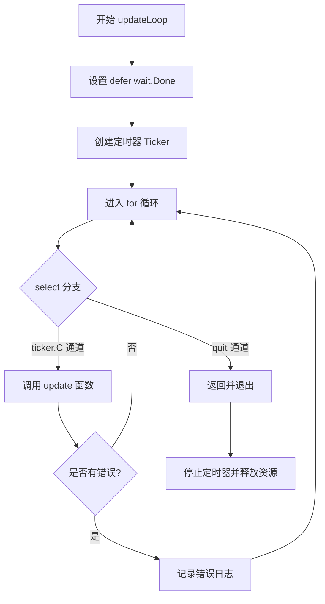

#### 带注释源码

```go
// updateLoop 定期更新 memcache 服务器列表的后台循环
// 参数：
//   - updateInterval: time.Duration，定时更新间隔
//   - update: func() error，更新操作函数
func (c *MemcacheClient) updateLoop(updateInterval time.Duration, update func() error) {
	// defer 确保退出时标记等待组完成
	defer c.wait.Done()
	
	// 创建定时器，每隔 updateInterval 触发一次
	ticker := time.NewTicker(updateInterval)
	
	// defer 确保在函数退出时停止定时器，释放资源
	defer ticker.Stop()
	
	// 无限循环，持续运行直到收到退出信号
	for {
		select {
		// 定时器通道：定期执行更新操作
		case <-ticker.C:
			// 调用传入的更新函数
			if err := update(); err != nil {
				// 更新失败时记录错误日志
				c.logger.Log("err", errors.Wrap(err, "error updating memcache servers"))
			}
		// 退出信号通道：收到信号时优雅退出
		case <-c.quit:
			return
		}
	}
}
```


### `MemcacheClient.updateFromSRVRecords`

该方法通过查询DNS SRV记录来更新Memcache服务器列表，解析服务的主机名和端口，并将其设置为Memcache客户端的服务器列表，同时对服务器地址进行排序以保证一致性。

参数：
- （无参数）

返回值：`error`，如果成功则返回nil，否则返回DNS查询或服务器列表设置过程中的错误信息。

#### 流程图

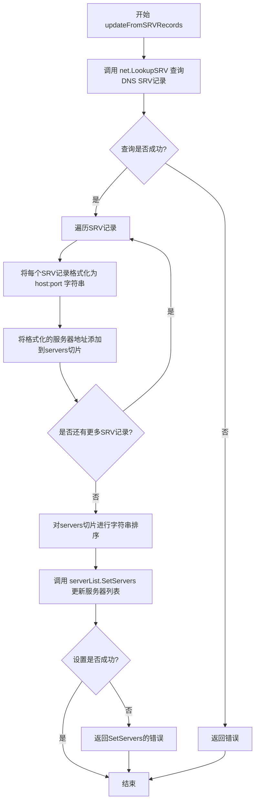

#### 带注释源码

```go
// updateMemcacheServers sets a memcache server list from SRV records. SRV
// priority & weight are ignored.
// updateMemcacheServers从SRV记录设置memcache服务器列表。SRV记录的优先级和权重将被忽略。
func (c *MemcacheClient) updateFromSRVRecords() error {
	// 使用net.LookupSRV查询DNS SRV记录
	// 参数: service(服务名), protocol(协议), host(主机名)
	// 返回: cname(规范名), addrs(SRV记录切片), err(错误)
	_, addrs, err := net.LookupSRV(c.service, "tcp", c.hostname)
	
	// 如果DNS查询失败,直接返回错误
	if err != nil {
		return err
	}
	
	// 创建一个字符串切片来存储服务器地址
	var servers []string
	
	// 遍历所有返回的SRV记录
	for _, srv := range addrs {
		// 将每个SRV记录格式化为 "host:port" 字符串格式
		// srv.Target 是主机名, srv.Port 是端口号
		servers = append(servers, fmt.Sprintf("%s:%d", srv.Target, srv.Port))
	}
	
	// ServerList deterministically maps keys to _index_ of the server list.
	// Since DNS returns records in different order each time, we sort to
	// guarantee best possible match between nodes.
	// 由于DNS每次返回的记录顺序可能不同,而ServerList会将键映射到服务器列表的索引
	// 为了保证节点间的最佳匹配一致性,我们对服务器地址进行排序
	sort.Strings(servers)
	
	// 更新Memcache服务器的列表
	// 将排序后的服务器地址列表设置到serverList中
	return c.serverList.SetServers(servers...)
}
```


### `NewMemcacheClient`

基于提供的配置和DNS SRV记录创建并返回一个MemcacheClient实例，该客户端定期从DNS SRV记录中更新其服务器列表。

参数：

- `config`：`MemcacheConfig`，包含创建MemcacheClient所需的配置信息，包括主机名、服务名、超时设置、更新间隔、日志记录器和最大空闲连接数

返回值：`*MemcacheClient`，返回一个初始化好的MemcacheClient指针，该客户端已启动后台goroutine定期更新服务器列表

#### 流程图

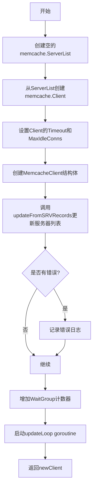

#### 带注释源码

```go
// NewMemcacheClient 根据配置创建一个基于DNS SRV记录的新型MemcacheClient
// config: 包含连接memcached所需的各种配置参数
// 返回: 初始化好的MemcacheClient指针
func NewMemcacheClient(config MemcacheConfig) *MemcacheClient {
	// 1. 创建一个空的memcache.ServerList用于存储服务器地址
	var servers memcache.ServerList
	
	// 2. 使用ServerList创建一个memcache.Client实例
	client := memcache.NewFromSelector(&servers)
	
	// 3. 设置客户端超时时间
	client.Timeout = config.Timeout
	
	// 4. 设置最大空闲连接数
	client.MaxIdleConns = config.MaxIdleConns

	// 5. 构造MemcacheClient结构体，初始化各个字段
	newClient := &MemcacheClient{
		client:     client,                      // memcache客户端实例
		serverList: &servers,                     // 服务器列表引用
		hostname:   config.Host,                  // 用于SRV记录查询的主机名
		service:    config.Service,               // 服务名称（用于SRV记录查询）
		logger:     config.Logger,                // 日志记录器
		quit:       make(chan struct{}),          // 退出信号通道
	}

	// 6. 首次初始化时从DNS SRV记录获取服务器列表
	err := newClient.updateFromSRVRecords()
	if err != nil {
		// 如果获取失败，记录错误但继续运行（可能临时不可用）
		config.Logger.Log("err", errors.Wrapf(err, "Error setting memcache servers to '%v'", config.Host))
	}

	// 7. 启动后台goroutine，定期更新服务器列表
	newClient.wait.Add(1)
	// 启动定期更新循环，间隔由UpdateInterval指定
	go newClient.updateLoop(config.UpdateInterval, newClient.updateFromSRVRecords)
	
	// 8. 返回创建好的客户端
	return newClient
}
```


### `NewFixedServerMemcacheClient`

基于静态服务器地址创建一个 Memcache 客户端实例，与 DNS SRV 记录方式不同，该方法直接使用传入的地址列表初始化服务器列表，适用于地址固定不变的场景。

#### 参数

- `config`：`MemcacheConfig`，客户端配置，包含主机、服务、超时时间等参数
- `addresses`：`...string`（可变参数），静态服务器地址列表，格式为 "host:port"

#### 返回值

- `*MemcacheClient`，返回新创建的 MemcacheClient 实例

#### 流程图

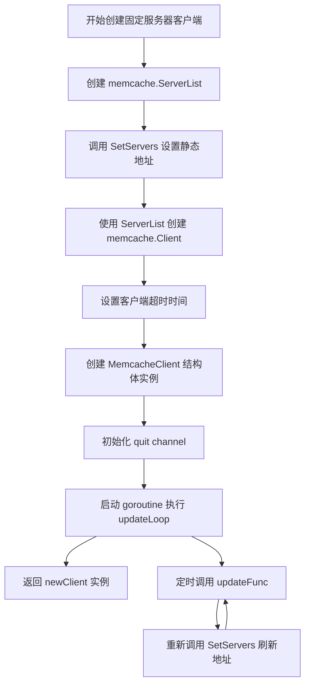

#### 带注释源码

```go
// Does not use DNS, accepts static list of servers.
// 不使用 DNS，接受静态服务器地址列表
func NewFixedServerMemcacheClient(config MemcacheConfig, addresses ...string) *MemcacheClient {
	// 1. 创建 memcache 服务器列表对象
	var servers memcache.ServerList
	// 2. 使用传入的静态地址列表初始化服务器列表
	servers.SetServers(addresses...)
	// 3. 从服务器选择器创建 memcache 客户端
	client := memcache.NewFromSelector(&servers)
	// 4. 设置客户端超时时间
	client.Timeout = config.Timeout

	// 5. 构造 MemcacheClient 实例
	newClient := &MemcacheClient{
		client:     client,                      // memcache 客户端实例
		serverList: &servers,                    // 服务器列表引用
		hostname:   config.Host,                  // 主机名（用于其他方法）
		service:    config.Service,               // 服务名（用于其他方法）
		logger:     config.Logger,                // 日志记录器
		quit:       make(chan struct{}),          // 退出信号通道
	}

	// 6. 启动后台 goroutine，定期更新服务器列表
	// 虽然地址是静态的，但通过 updateLoop 可以定期刷新连接
	go newClient.updateLoop(config.UpdateInterval, func() error {
		return servers.SetServers(addresses...)
	})
	// 7. 返回创建的客户端实例
	return newClient
}
```


### `MemcacheClient.GetKey`

从缓存中获取指定键对应的值及其刷新截止时间。如果缓存未命中（miss），则返回特定的缓存未命中错误；否则解析缓存数据中的截止时间并返回对应的值和时间。

参数：

- `k`：`cache.Keyer`，缓存键接口，用于生成缓存的实际键名

返回值：

- `[]byte`：缓存存储的字节值（已去除4字节的截止时间前缀）
- `time.Time`：刷新截止时间（Unix时间戳转换而来）
- `error`：操作过程中的错误信息，包括缓存未命中错误或其他获取失败错误

#### 流程图

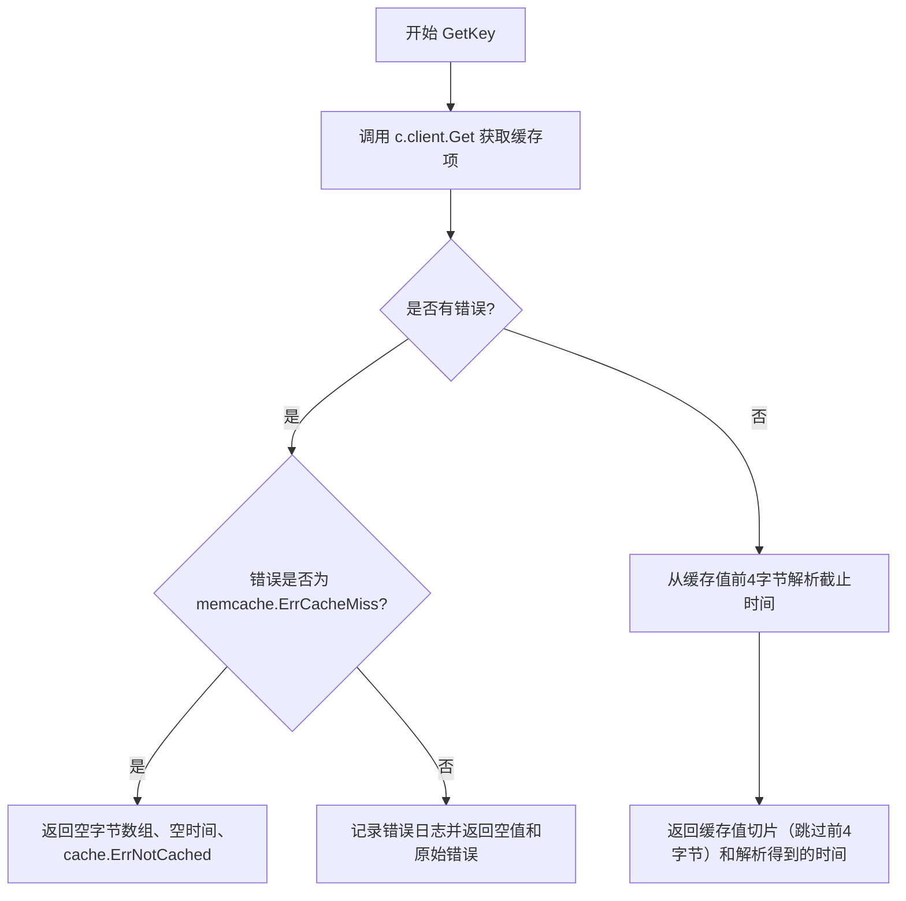

#### 带注释源码

```go
// GetKey gets the value and its refresh deadline from the cache.
func (c *MemcacheClient) GetKey(k cache.Keyer) ([]byte, time.Time, error) {
    // 使用memcached客户端根据键名获取缓存项
    cacheItem, err := c.client.Get(k.Key())
    if err != nil {
        // 处理获取缓存时的错误
        if err == memcache.ErrCacheMiss {
            // 缓存未命中属于正常情况，不记录日志
            // 返回空字节数组、空时间结构和缓存未命中专用错误
            return []byte{}, time.Time{}, cache.ErrNotCached
        } else {
            // 对于其他错误（如网络问题、服务器错误等），记录错误日志
            c.logger.Log("err", errors.Wrap(err, "Fetching tag from memcache"))
            // 返回空值和原始错误
            return []byte{}, time.Time{}, err
        }
    }
    // 缓存命中，从缓存值的前4个字节解析截止时间（使用大端字节序）
    // 缓存值的结构为：[4字节截止时间][实际数据]
    deadlineTime := binary.BigEndian.Uint32(cacheItem.Value)
    // 返回实际数据部分（跳过前4字节的截止时间）和解析出的截止时间
    return cacheItem.Value[4:], time.Unix(int64(deadlineTime), 0), nil
}
```


### `MemcacheClient.SetKey`

设置缓存值和刷新截止时间。该方法接收一个缓存键、刷新截止时间和要缓存的值，计算合理的过期时间（截止时间的2倍，最少1小时），将截止时间作为4字节前缀附加到值前面，然后存储到memcached中。

#### 参数

- `k`：`cache.Keyer`，缓存键接口，定义了缓存的键名
- `refreshDeadline`：`time.Time`，刷新截止时间，用于计算过期时间和存储在缓存值中
- `v`：`[]byte`，要缓存的字节数据

#### 返回值

- `error`：如果设置成功返回 nil，如果存储失败返回错误信息

#### 流程图

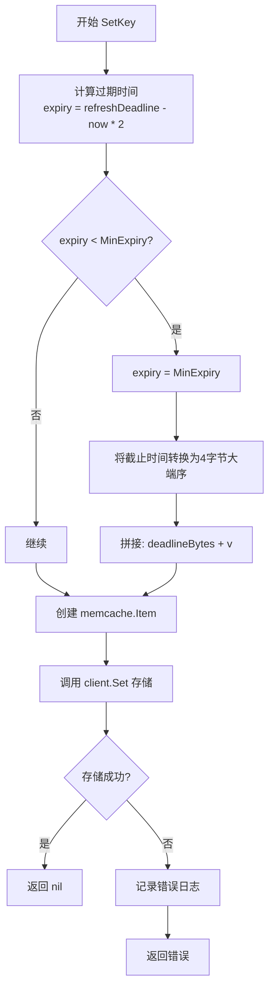

#### 带注释源码

```go
// SetKey sets the value and its refresh deadline at a key. NB the key
// expiry is set _longer_ than the deadline, to give us a grace period
// in which to refresh the value.
// SetKey 设置缓存值和刷新截止时间。注意：键的过期时间设置为比截止时间更长，
// 以提供一个宽限期来刷新值。
func (c *MemcacheClient) SetKey(k cache.Keyer, refreshDeadline time.Time, v []byte) error {
	// 计算过期时间：截止时间与当前时间的差值乘以2
	// 这样可以确保在截止时间过后，缓存项仍然保留一段时间，
	// 为刷新值提供宽限期
	expiry := refreshDeadline.Sub(time.Now()) * 2
	
	// 如果计算的过期时间小于最小过期时间，则使用最小过期时间
	// 最小过期时间定义为1小时，确保缓存项至少保留足够长的时间
	if expiry < MinExpiry {
		expiry = MinExpiry
	}

	// 创建4字节的切片用于存储截止时间的Unix时间戳
	// 使用大端序（BigEndian）确保跨平台一致性
	deadlineBytes := make([]byte, 4, 4)
	binary.BigEndian.PutUint32(deadlineBytes, uint32(refreshDeadline.Unix()))

	// 将截止时间（4字节）追加到值的前面
	// 这样在读取时可以解析出截止时间，用于判断是否需要刷新
	// memcached会存储完整的字节序列
	if err := c.client.Set(&memcache.Item{
		Key:        k.Key(),                                      // 缓存键
		Value:      append(deadlineBytes, v...),                  // 值=截止时间+实际数据
		Expiration: int32(expiry.Seconds()),                      // 过期时间（秒）
	}); err != nil {
		// 如果存储失败，记录错误日志并返回错误
		c.logger.Log("err", errors.Wrap(err, "storing in memcache"))
		return err
	}
	// 存储成功，返回nil
	return nil
}
```


### `MemcacheClient.Stop`

停止 memcache 客户端，关闭内部通信通道并等待所有后台 goroutine 安全退出。

参数： 无

返回值： 无（`void`），该方法无返回值

#### 流程图

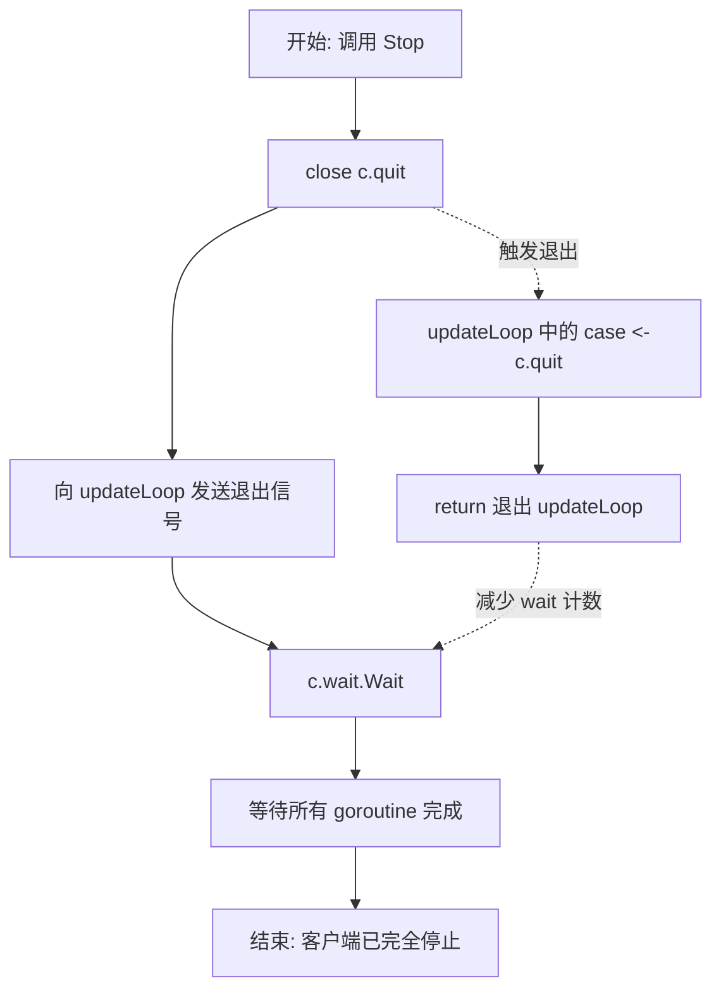

#### 带注释源码

```go
// Stop the memcache client.
// 停止 memcache 客户端。
// 该方法执行两步操作来确保干净地停止客户端：
// 1. 关闭 quit 通道，向所有监听该通道的 goroutine 发送退出信号
// 2. 等待 wait group 中的所有 goroutine 完成（主要是 updateLoop）
func (c *MemcacheClient) Stop() {
	// 关闭 quit 通道，这将触发 updateLoop 中的 <-c.quit case
	// 导致 updateLoop goroutine 返回，从而使其 wait.Done() 被调用
	close(c.quit)
	
	// 等待所有通过 wait.Add(1) 添加的 goroutine 完成
	// 在本例中，这会等待 updateLoop 完全退出
	// 确保在方法返回前，客户端的所有后台活动都已停止
	c.wait.Wait()
}
```


### `MemcacheClient.updateLoop`

定期更新服务器列表的循环方法，通过定时器周期性调用更新函数来刷新 memcached 服务器列表，同时监听退出信号以优雅停止。

参数：

- `updateInterval`：`time.Duration`，定期更新服务器列表的时间间隔
- `update`：`func() error`，实际执行服务器列表更新的函数回调

返回值：无返回值（`void`），该方法通过通道和日志进行状态通知

#### 流程图

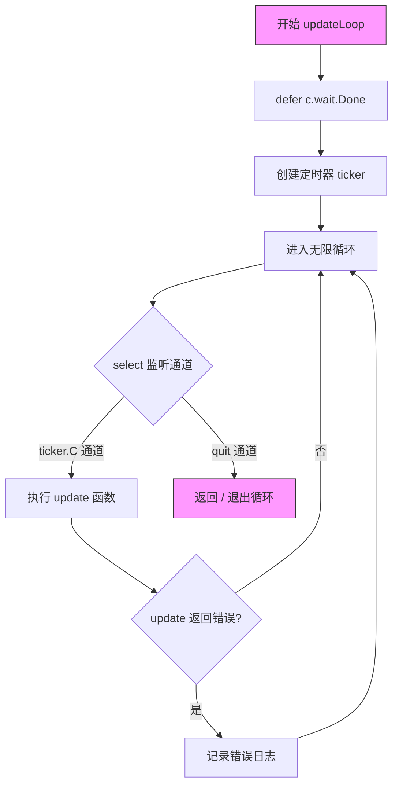

#### 带注释源码

```go
// updateLoop 定期更新服务器列表的循环方法
// 参数:
//   - updateInterval: time.Duration, 定期更新间隔
//   - update: func() error, 实际执行更新的函数
func (c *MemcacheClient) updateLoop(updateInterval time.Duration, update func() error) {
	// 延迟执行，确保 goroutine 退出时通知 wait group
	defer c.wait.Done()
	
	// 创建定时器，按指定间隔触发
	ticker := time.NewTicker(updateInterval)
	defer ticker.Stop()
	
	// 无限循环，持续监听定时器和退出信号
	for {
		select {
		// 定时器通道：定期执行更新操作
		case <-ticker.C:
			// 调用更新函数
			if err := update(); err != nil {
				// 更新失败时记录错误日志
				c.logger.Log("err", errors.Wrap(err, "error updating memcache servers"))
			}
		// 退出信号通道：收到信号时退出循环
		case <-c.quit:
			return
		}
	}
}
```


### `MemcacheClient.updateFromSRVRecords`

从 SRV DNS 记录中查询服务对应的服务器列表，提取目标主机和端口，经过排序后更新内部的 memcache 服务器列表。

参数：无（方法接收者 `c *MemcacheClient` 不计入参数）

返回值：`error`，如果 DNS 查询或设置服务器列表时发生错误则返回错误，否则返回 nil

#### 流程图

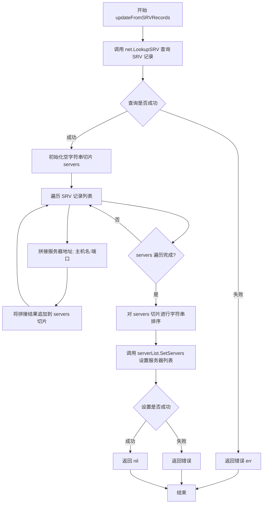

#### 带注释源码

```go
// updateFromSRVRecords 从 SRV 记录更新服务器列表
// 该方法执行 DNS 查询获取指定服务的 SRV 记录，
// 提取服务器地址和端口，排序后设置到 ServerList 中
func (c *MemcacheClient) updateFromSRVRecords() error {
	// 使用 net.LookupSRV 查询 SRV 记录
	// 参数: 服务名称("memcache"), 协议("tcp"), 域名(c.hostname)
	// 返回: cname 字符串, SRV 记录切片, 错误
	_, addrs, err := net.LookupSRV(c.service, "tcp", c.hostname)
	
	// 如果 DNS 查询失败,直接返回错误
	if err != nil {
		return err
	}
	
	// 初始化用于存储服务器地址的切片
	var servers []string
	
	// 遍历查询到的 SRV 记录
	for _, srv := range addrs {
		// 拼接服务器地址: 目标主机名:端口号
		// srv.Target 是 SRV 记录的目标主机
		// srv.Port 是 SRV 记录的端口号
		servers = append(servers, fmt.Sprintf("%s:%d", srv.Target, srv.Port))
	}
	
	// 对服务器列表进行排序
	// 原因: memcache.ServerList 会将键映射到服务器列表的索引
	// 由于 DNS 返回的记录顺序每次可能不同,排序可以确保
	// 相同的键始终映射到相同的服务器,保证一致性
	sort.Strings(servers)
	
	// 设置服务器列表并返回结果
	// 如果设置失败会返回错误,成功则返回 nil
	return c.serverList.SetServers(servers...)
}
```

## 关键组件


### MemcacheClient 结构体
MemcacheClient 是核心缓存客户端结构体，负责管理与 memcached 服务器的连接、服务器列表更新以及缓存操作。包含客户端实例、服务器列表、主机名、服务名、日志记录器、退出通道和等待组等字段。

### MemcacheConfig 配置结构体
MemcacheConfig 定义了构建 MemcacheClient 所需的配置参数，包括主机地址、服务名称、连接超时时间、更新间隔、日志记录器和最大空闲连接数。

### NewMemcacheClient 函数
NewMemcacheClient 根据配置创建一个支持 SRV 记录动态发现 memcached 服务器的客户端实例。它初始化客户端、启动后台更新循环来定期刷新服务器列表，并返回配置好的 MemcacheClient 指针。

### NewFixedServerMemcacheClient 函数
NewFixedServerMemcacheClient 创建一个使用静态服务器地址列表的 memcached 客户端，不依赖 DNS SRV 记录查询，适用于服务器地址固定不变的部署场景。

### GetKey 方法
GetKey 方法从缓存中获取指定键对应的值和刷新截止时间。它从 memcached 读取完整的缓存项，解析前 4 字节作为大端序的 Unix 时间戳作为截止时间，返回剩余字节数据、截止时间以及可能的错误。

### SetKey 方法
SetKey 方法将值及其刷新截止时间存储到缓存中。它计算过期时间为截止时间与当前时间差的两倍（最短为 1 小时），将截止时间以大端序 4 字节格式追加到值前面，然后设置到 memcached 服务器。

### Stop 方法
Stop 方法优雅地停止 memcached 客户端，关闭退出通道并等待所有后台goroutine完成。

### updateLoop 方法
updateLoop 方法是后台运行的定期更新循环，按照指定间隔周期性地调用更新函数来刷新 memcached 服务器列表，同时监听退出信号以支持优雅关闭。

### updateFromSRVRecords 方法
updateFromSRVRecords 方法通过 DNS SRV 记录查询获取服务对应的所有 memcached 服务器地址，对地址列表排序以保证服务器映射的一致性，然后更新内部服务器列表。

### 缓存键设计组件
缓存键设计组件负责将缓存键（cache.Keyer）转换为字符串格式，用于 memcached 的键值存储和检索，是缓存系统的核心抽象接口。

### 过期时间管理组件
过期时间管理组件实现了基于刷新截止时间的智能过期策略，确保缓存项的过期时间晚于刷新截止时间，从而为缓存刷新提供宽限期，同时满足最小过期时间约束。

### 错误处理与日志组件
错误处理与日志组件封装了与 memcached 通信过程中的错误处理和日志记录逻辑，包括缓存未命中、服务器更新失败、存储失败等情况的处理。


## 问题及建议


### 已知问题

- **goroutine泄漏风险**：`NewFixedServerMemcacheClient` 函数未调用 `newClient.wait.Add(1)`，导致 `updateLoop` 中启动的 goroutine 无法被正确等待，造成 goroutine 泄漏
- **错误被吞没**：`NewMemcacheClient` 中 `updateFromSRVRecords()` 的错误仅被记录但未向上返回，调用者无法感知初始连接失败
- **返回值语义不明确**：`GetKey` 在缓存未命中时返回空字节切片 `[]byte{}` 和空时间 `time.Time{}`，而非直接返回 `cache.ErrNotCached`，可能误导调用者
- **内存分配冗余**：`SetKey` 中 `make([]byte, 4, 4)` 显式指定容量为 4 是多余的，应简化为 `make([]byte, 4)`
- **资源竞争风险**：`serverList.SetServers` 在 `updateLoop` goroutine 中被调用，而主流程可能同时读取，但 `memcache.ServerList` 本身非线程安全
- **缺少连接健康检查**：客户端未实现对 memcached 服务器连接的有效性验证，DNS 更新失败时可能长时间使用失效节点

### 优化建议

- 修复 `NewFixedServerMemcacheClient`：在启动 goroutine 前添加 `newClient.wait.Add(1)`
- 优化错误传播：若初始 SRV 记录解析失败，应返回错误或使用默认服务器列表，而非静默继续
- 统一缓存未命中处理：`GetKey` 建议直接返回 `cache.ErrNotCached`，避免返回空值导致调用方误判
- 简化内存分配：将 `make([]byte, 4, 4)` 改为 `make([]byte, 4)`
- 添加同步机制：对 `serverList` 的并发访问使用互斥锁保护，或在调用 `SetServers` 前后确保无竞争
- 增强可观测性：为关键操作添加更细粒度的日志，记录缓存命中率、服务器变更事件等指标

## 其它


### 设计目标与约束

设计目标：
- 提供一个可靠的分布式图像缓存层，使用 memcached 作为存储后端
- 支持动态服务发现（通过 SRV 记录）和静态服务器配置两种模式
- 实现基于刷新截止日期的智能过期机制，确保缓存项在需要刷新时才过期
- 提供线程安全的客户端实现，支持并发访问

约束：
- 依赖外部 memcached 服务，必须保证网络连通性
- 最小过期时间限制为 1 小时（MinExpiry）
- 缓存过期时间设置为刷新截止日期的 2 倍，以提供刷新宽限期
- 使用 Go 语言标准库和指定的第三方库

### 错误处理与异常设计

缓存未命中（ErrCacheMiss）：
- 当缓存中不存在请求的键时，返回 cache.ErrNotCached 错误
- 不记录日志，避免日志噪声

网络错误：
- 所有 memcached 操作错误均被记录并返回上层处理
- 使用 errors.Wrap 包装错误，保留错误链

SRV 记录查询失败：
- 在初始化时如果 SRV 记录查询失败，记录错误但继续运行（使用空服务器列表）
- 在定期更新时如果失败，仅记录错误而不中断服务

服务器列表更新失败：
- 定期更新服务器列表失败时记录错误，但保持之前的服务器列表不变
- 不阻塞主业务逻辑

### 数据流与状态机

数据读取流程：
1. 调用 GetKey 方法，传入 cache.Keyer 接口
2. 通过 memcached 客户端获取缓存项
3. 解析缓存值：前 4 字节为截止日期（Unix 时间戳），剩余字节为实际数据
4. 返回数据、截止日期和可能的错误

数据写入流程：
1. 调用 SetKey 方法，传入 cache.Keyer、refreshDeadline 和值
2. 计算过期时间：截止日期 - 当前时间，如果小于 MinExpiry 则使用 MinExpiry
3. 将截止日期转换为 4 字节大端序整数，并追加到值前面
4. 调用 memcached 客户端设置缓存项

服务器列表更新流程（仅 NewMemcacheClient）：
1. 启动时立即执行一次 SRV 记录更新
2. 启动后台 goroutine 定期执行更新
3. 更新间隔由 UpdateInterval 配置决定

### 外部依赖与接口契约

主要依赖：
- github.com/bradfitz/gomemcache/memcache：memcached 客户端库
- github.com/go-kit/kit/log：日志接口
- github.com/pkg/errors：错误包装
- github.com/fluxcd/flux/pkg/registry/cache：缓存键接口定义

接口契约：
- cache.Keyer 接口：必须实现 Key() string 方法
- 返回的时间：time.Time 类型，表示缓存项的刷新截止时间
- 返回的字节切片：图像数据
- 错误：标准 Go 错误类型

### 并发控制与线程安全性

- MemcacheClient 结构体包含 sync.WaitGroup 用于管理后台 goroutine
- 使用无缓冲的 quit channel 用于停止后台更新goroutine
- 所有公共方法（GetKey、SetKey、Stop）可以安全并发调用
- memcached.Client 本身是线程安全的

### 性能考虑与优化建议

当前设计：
- 使用连接池（MaxIdleConns 配置）减少连接开销
- 定期更新服务器列表避免 DNS 查询开销
- 排序服务器列表保证一致的键到服务器映射

潜在优化：
- 考虑添加连接超时配置
- 考虑实现连接重试机制
- 考虑添加批量操作支持（MultiGet/MultiSet）
- 考虑添加压缩支持以减少网络传输

### 监控与可观测性

当前实现：
- 使用结构化日志记录错误和关键事件
- 日志包含 "err" 字段用于错误分类

建议添加：
- 缓存命中率监控
- 响应时间指标
- 服务器列表更新频率监控
- 内存使用情况监控

### 配置管理

必需配置：
- Host：SRV 记录查询的主机名
- Service：SRV 记录查询的服务名
- Timeout：memcached 操作超时时间
- UpdateInterval：服务器列表更新间隔
- Logger：日志记录器
- MaxIdleConns：最大空闲连接数

默认值建议：
- Timeout：建议默认 100ms
- UpdateInterval：建议默认 30 秒
- MaxIdleConns：建议默认 2

    