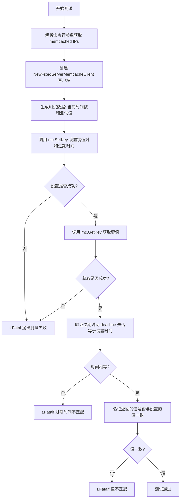
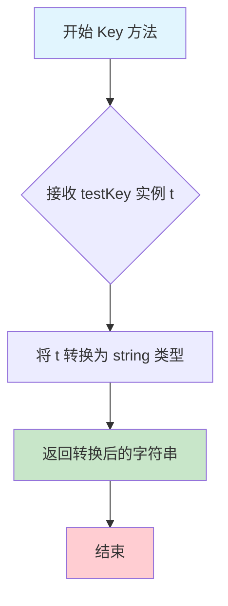

# `flux\pkg\registry\cache\memcached\memcached_test.go` 详细设计文档

这是一个 Go 语言的 memcached 集成测试文件，用于测试 memcached 客户端的键值过期读写功能，验证在设置带有过期时间的键值对后，能够正确读取数据并确认过期时间戳的准确性。

## 整体流程



## 类结构

```
测试文件 (无类结构)
└── 全局变量和函数
    ├── 全局变量: memcachedIPs, val, key
    ├── 类型: testKey
    └── 测试函数: TestMemcache_ExpiryReadWrite
```

## 全局变量及字段


### `memcachedIPs`
    
flag 参数，存储以空格分隔的 memcached 主机:端口地址列表

类型：`*string`
    


### `val`
    
测试用的字节数组，值为 "test bytes"

类型：`[]byte`
    


### `key`
    
测试用的键，值为 "test"

类型：`testKey`
    


    

## 全局函数及方法


### `testKey.Key()`

返回 testKey 的字符串形式，实现键的序列化方法，用于将自定义键类型转换为 memcached 所要求的字符串键格式。

参数：
- （无参数）

返回值：`string`，返回 testKey 实例的字符串表示形式

#### 流程图



#### 带注释源码

```go
// testKey 是 string 的类型别名，用于定义测试用的键类型
type testKey string

// Key 是 testKey 类型的序列化方法
// 该方法实现了键的序列化接口，使 testKey 可以作为 memcached 的键使用
// 参数：无
// 返回值：string - testKey 的字符串形式
func (t testKey) Key() string {
    // 将 testKey 类型转换为 string 并返回
    // 这里利用了 Go 语言的类型转换语法 string(t)
    return string(t)
}
```

#### 设计意图说明

| 项目 | 说明 |
|------|------|
| **设计目标** | 提供一种自定义键类型，使其能够被序列化 为 memcached 所要求的字符串键格式 |
| **实现方式** | 利用 Go 语言的方法定义语法，为自定义类型添加 Key() 方法 |
| **接口契约** | 该方法的存在表明 testKey 类型实现了某种键序列化接口（可能是项目内部定义的 Keyable 或类似接口） |
| **技术债务** | 当前实现仅做了简单的类型转换，如果未来需要键的前缀处理、哈希或编码，应在此方法中扩展 |


### `TestMemcache_ExpiryReadWrite`

这是一个集成测试函数，用于验证 memcached 的过期时间读写功能。测试通过设置一个带有当前时间作为过期时间的键值对，然后立即读取该键，检查返回的值和过期时间是否与设置的一致，从而确保 memcached 客户端正确处理键的过期时间。

参数：
- `t`：`*testing.T`，Go 测试框架的测试实例，用于报告测试失败和控制测试流程。

返回值：无返回值（测试函数通过 `testing.T` 实例的方法报告错误，而非直接返回值）。

#### 流程图

```mermaid
flowchart TD
    A([开始]) --> B[创建 Memcache 客户端: mc]
    B --> C[设置键值对: key, now, val]
    C --> D[获取键值: cached, deadline, err]
    D --> E{err != nil?}
    E -->|是| F[t.Fatal err]
    E -->|否| G{deadline.Equal(now)?}
    G -->|否| H[t.Fatalf 过期时间不匹配]
    G -->|是| I{string(cached) == string(val)?}
    I -->|否| J[t.Fatalf 缓存值不匹配]
    I -->|是| K([测试通过])
```

#### 带注释源码

```go
// TestMemcache_ExpiryReadWrite 是集成测试函数，测试 memcached 的过期读写功能。
// 它验证客户端能否正确设置和获取带有过期时间的键值对。
func TestMemcache_ExpiryReadWrite(t *testing.T) {
	// 创建 Memcache 客户端，配置超时为 1 秒，更新间隔为 1 分钟，使用标准日志输出。
	mc := NewFixedServerMemcacheClient(MemcacheConfig{
		Timeout:        time.Second,
		UpdateInterval: 1 * time.Minute,
		Logger:         log.With(log.NewLogfmtLogger(os.Stderr), "component", "memcached"),
	}, strings.Fields(*memcachedIPs)...)

	// 获取当前时间并四舍五入到秒，作为过期时间。
	now := time.Now().Round(time.Second)
	// 设置键值对，键为 "test"，值为 "test bytes"，过期时间为 now。
	err := mc.SetKey(key, now, val)
	if err != nil {
		// 如果设置失败，测试致命错误并停止。
		t.Fatal(err)
	}

	// 获取键对应的值和过期时间。
	cached, deadline, err := mc.GetKey(key)
	if err != nil {
		// 如果获取失败，测试致命错误并停止。
		t.Fatal(err)
	}
	// 验证返回的过期时间是否与设置的时间一致。
	if !deadline.Equal(now) {
		t.Fatalf("Deadline should be %s, but is %s", now.String(), deadline.String())
	}

	// 验证返回的值是否与设置的值一致。
	if string(cached) != string(val) {
		t.Fatalf("Should have returned %q, but got %q", string(val), string(cached))
	}
}
```

## 关键组件


### testKey 类型

自定义的键类型，实现 Key() 方法用于返回键的字符串表示。

### NewFixedServerMemcacheClient 函数

用于创建配置好的 memcache 客户端，接受配置参数和 memcached 服务器地址列表，返回可用于操作 memcached 的客户端实例。

### MemcacheConfig 配置结构体

包含 Timeout 和 UpdateInterval 时间配置，以及 Logger 用于日志记录，用于配置 memcache 客户端的行为。

### TestMemcache_ExpiryReadWrite 测试函数

集成测试函数，验证 memcached 客户端的键值对过期时间读写功能是否正确，测试设置键、获取键及验证过期时间一致性。

### mc.SetKey 方法

将键值对及其过期时间写入 memcached，接收键、过期时间和字节值作为参数。

### mc.GetKey 方法

从 memcached 读取键对应的值和过期时间，返回缓存数据、过期截止时间和可能的错误。

### flag 命令行参数解析

使用 flag 包解析 memcached-ips 命令行参数，支持指定多个 memcached 服务器地址，默认为本地 11211 端口。

### go-kit/log 日志组件

使用 go-kit 的日志库创建带组件标识的日志记录器，用于输出 memcached 操作的日志信息。


## 问题及建议


### 已知问题

-   **测试隔离性不足**：使用固定key "test"进行测试，多个测试并行运行时可能产生数据竞争和相互干扰
-   **缺少前置条件检查**：未验证memcached服务是否可用即开始测试，可能导致测试因外部依赖失败而非代码问题
-   **全局状态依赖**：val和key定义为全局变量，降低了测试的可维护性和可移植性
-   **硬编码测试数据**：测试数据和key值硬编码，缺乏灵活性和可配置性
-   **错误处理粒度过粗**：使用t.Fatal立即终止测试，未对错误类型进行区分判断
-   **缺少测试清理**：测试后未清理memcached中的数据，可能影响后续测试或产生副作用
-   **资源管理不规范**：MemcacheClient未显式关闭，依赖GC可能导致连接泄漏
-   **未使用table-driven模式**：单一测试场景写法，缺乏可扩展性和代码复用

### 优化建议

-   **使用唯一性key**：通过UUID或时间戳生成唯一key，或在测试前后使用随机前缀
-   **添加服务可用性检查**：在测试开始前ping memcached服务，不可用时跳过测试(t.Skip)
-   **采用table-driven测试**：重构为标准Go测试模式，提高测试覆盖度和可维护性
-   **显式资源清理**：使用defer确保client.Close()执行，或实现test fixtures
-   **分离测试数据和逻辑**：将testKey类型和全局变量移至辅助函数或测试结构体中
-   **增强错误断言**：区分不同错误类型，添加更详细的失败信息
-   **添加超时保护**：为整个测试操作设置总超时，避免外部服务 hang 导致测试阻塞

## 其它


### 设计目标与约束

验证Memcache客户端在设置和获取键值对时正确处理过期时间，确保GetKey返回的deadline与SetKey设置的deadline一致。约束是测试依赖外部运行的memcached服务器实例，且使用固定的测试键值，可能污染数据。

### 错误处理与异常设计

测试中使用`t.Fatal`立即终止测试，任何错误（如网络中断、memcached协议错误、超时）都会导致测试失败。异常设计遵循Go错误传播模式，无自定义异常，所有错误来自memcached客户端库。

### 数据流与状态机

数据流：客户端通过`SetKey`设置键值对和过期时间，然后通过`GetKey`获取值和过期时间，最后验证值和deadline是否正确。状态机：初始状态 -> 调用`SetKey` -> 调用`GetKey` -> 验证并结束。

### 外部依赖与接口契约

外部依赖：memcached服务器（通过`memcached-ips`配置，默认`127.0.0.1:11211`）。接口契约：`NewFixedServerMemcacheClient`接受`MemcacheConfig`和可变数量地址；`SetKey`接受`testKey`、过期时间`time.Time`和值`[]byte`，返回`error`；`GetKey`接受`testKey`，返回`[]byte`、`time.Time`和`error`。

### 性能要求与基准

代码未包含性能基准测试，但配置了`Timeout`为1秒，可能影响请求响应时间；`UpdateInterval`为1分钟，影响连接池更新频率。未设定具体性能指标。

### 安全性考虑

代码仅用于集成测试，无安全特性。生产环境中memcached通信应使用SASL认证或TLS加密，以确保数据安全。

### 配置管理

通过Go标准库`flag`配置memcached服务器地址（`memcached-ips`）；其他配置如`Timeout`、`UpdateInterval`和`Logger`在代码中硬编码，可通过修改代码调整。

### 部署模型

作为集成测试部署，需要memcached服务先期启动。测试使用固定键`"test"`，可能与其他数据冲突，建议在隔离环境运行。

### 监控与日志

使用go-kit的log组件，带有`component`标签（值为"memcached"）的logger将日志输出到标准错误，用于调试测试行为。

### 兼容性考虑

依赖memcached二进制协议，需确保memcached服务器版本兼容（通常兼容广泛）。客户端库应兼容Go 1.x版本。

### 测试策略

集成测试，依赖外部memcached实例。测试覆盖基本的Set和Get操作以及过期时间处理。未包含压力测试或故障恢复测试。

### 备份与恢复

不适用，测试数据无需备份。生产环境中memcached数据应定期持久化或使用备份方案。

### 扩展性设计

代码为测试用例，扩展性体现在配置参数化（如可变数量memcached地址），但无动态扩展能力。客户端库本身可能支持集群，但测试未覆盖。

### 命名约定和编码规范

遵循Go语言惯例：驼峰命名（`TestMemcache_ExpiryReadWrite`）、导入分组（标准库、外部库）、错误检查（if err != nil）。测试函数以`Test`开头。

### 文档维护计划

作为代码库的一部分，随代码一起维护。文档应更新以反映配置变更或接口修改。
    