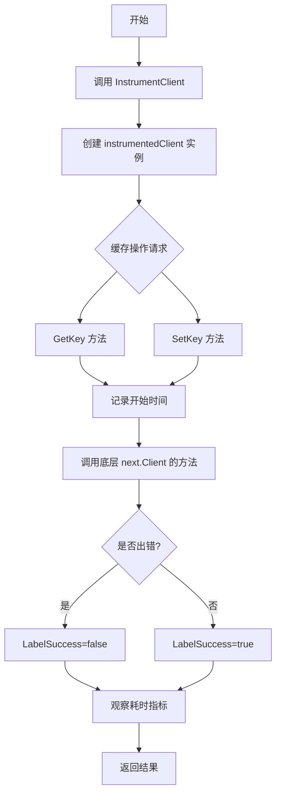
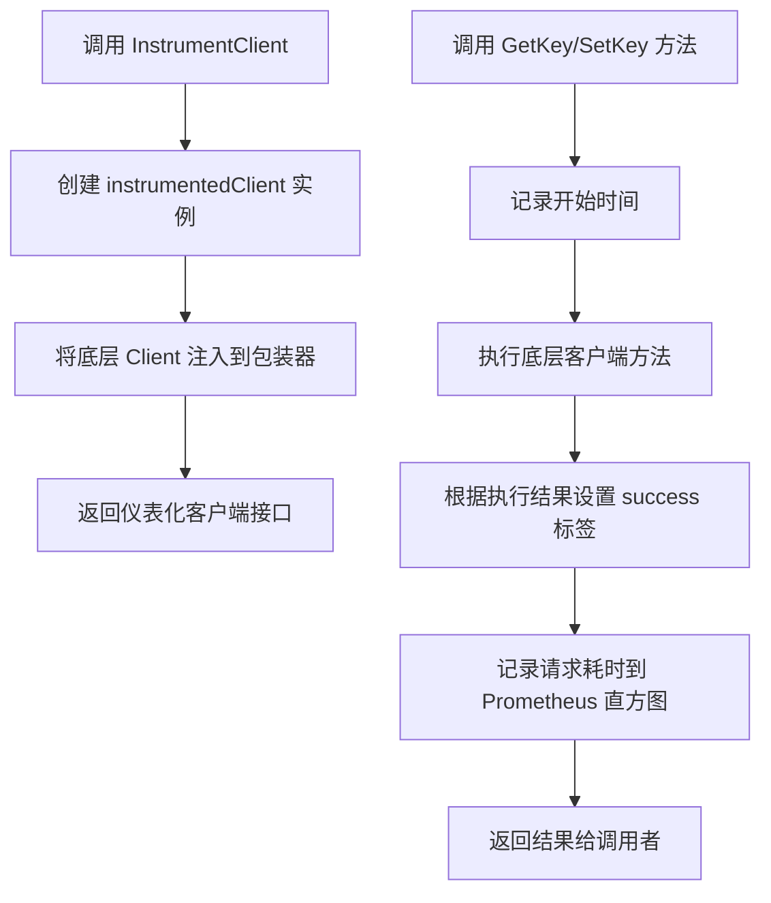
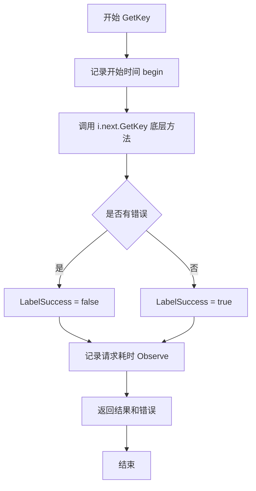

# `flux\pkg\registry\cache\monitoring.go` 详细设计文档

这是一个缓存 instrumentation 包，通过装饰器模式为缓存客户端添加 Prometheus 指标监控功能，自动记录缓存请求的成功与否及耗时。

## 整体流程



## 类结构

```
Client (接口)
└── instrumentedClient (实现类)
    └── next: Client (依赖)
```

## 全局变量及字段


### `cacheRequestDuration`
    
用于记录缓存请求持续时间的Prometheus直方图指标，包含方法名和成功与否标签

类型：`prometheus.Histogram`
    


### `instrumentedClient.next`
    
被装饰的原始缓存客户端，用于实际缓存操作

类型：`Client`
    
    

## 全局函数及方法


### InstrumentClient

该函数是一个缓存客户端的仪表化包装器，通过装饰器模式为原有缓存客户端添加Prometheus指标监控功能，记录缓存请求的耗时和成功率。

参数：

- `c`：`Client`，被仪表化的底层缓存客户端接口

返回值：`Client`，返回包装后的仪表化缓存客户端接口

#### 流程图



#### 带注释源码

```go
// InstrumentClient 创建一个仪表化的缓存客户端包装器
// 参数 c: 底层缓存客户端实现
// 返回: 包装了Prometheus指标监控功能的客户端接口
func InstrumentClient(c Client) Client {
    // 创建并返回仪表化客户端实例，将原始客户端作为内部委托
    return &instrumentedClient{
        next: c,
    }
}

// instrumentedClient 是缓存客户端的装饰器
// 内部委托给 next 指向的客户端执行实际缓存操作
type instrumentedClient struct {
    next Client // 底层缓存客户端
}
```


### `instrumentedClient.GetKey`

该方法是装饰器模式的具体实现，通过在调用底层缓存客户端前后添加 Prometheus 指标监控逻辑，记录缓存 GetKey 请求的成功与否以及耗时情况，用于监控缓存层的性能和可用性。

参数：

- `k`：`Keyer`，缓存键的接口类型，用于构建缓存查询的键

返回值：

- `[]byte`：缓存中存储的字节值，如果键不存在则可能为空
- `time.Time`：缓存项的过期时间
- `error`：执行过程中的错误信息，成功时为 nil

#### 流程图



#### 带注释源码

```go
// GetKey 从缓存中获取指定键对应的值和过期时间
// 参数 k: Keyer 接口，实现缓存键的序列化
// 返回值:
//   - []byte: 缓存的字节值
//   - time.Time: 过期时间
//   - error: 执行错误
func (i *instrumentedClient) GetKey(k Keyer) (_ []byte, ex time.Time, err error) {
	// 使用 defer 确保指标记录在方法返回前执行
	defer func(begin time.Time) {
		// 构造监控标签：方法名为 GetKey，成功与否通过 err == nil 判断
		cacheRequestDuration.With(
			fluxmetrics.LabelMethod, "GetKey",                  // 标签：缓存操作方法名
			fluxmetrics.LabelSuccess, fmt.Sprint(err == nil),   // 标签：是否成功（"true" 或 "false"）
		).Observe(time.Since(begin).Seconds())                  // 记录请求耗时（秒）
	}(time.Now()) // 记录方法开始执行的时间
	
	// 委托给下一个客户端（被装饰的原始缓存客户端）执行实际获取逻辑
	return i.next.GetKey(k)
}
```


### `instrumentedClient.SetKey`

该方法是装饰器模式的具体实现，通过拦截 `SetKey` 操作并记录 Prometheus 指标（请求持续时间和成功与否）来为缓存客户端添加可观测性，同时将实际操作委托给下一个客户端执行。

参数：

- `k`：`Keyer`，用于标识缓存条目的键对象
- `d`：`time.Time`，缓存条目的过期时间
- `v`：`[]byte`，要存储在缓存中的值

返回值：`error`，如果设置键值对时发生错误则返回错误；否则返回 nil

#### 流程图

```mermaid
flowchart TD
    A[SetKey 方法开始] --> B[记录当前时间 begin]
    B --> C[调用 i.next.SetKey 设置缓存]
    C --> D{是否有错误}
    D -->|是| E[LabelSuccess = "false"]
    D -->|否| F[LabelSuccess = "true"]
    E --> G[记录请求持续时间到 Prometheus]
    F --> G
    G --> H[返回 error 结果]
    H --> I[方法结束]
```

#### 带注释源码

```go
// SetKey 设置缓存键值对，并记录请求指标
// 参数 k: 缓存键标识符
// 参数 d: 过期时间点
// 参数 v: 要缓存的字节数据
// 返回值: 如果操作成功返回 nil，否则返回错误信息
func (i *instrumentedClient) SetKey(k Keyer, d time.Time, v []byte) (err error) {
	// 使用 defer 在方法返回时记录请求持续时间
	defer func(begin time.Time) {
		// 通过 Prometheus 指标记录方法调用信息
		cacheRequestDuration.With(
			fluxmetrics.LabelMethod, "SetKey",           // 标记方法名为 SetKey
			fluxmetrics.LabelSuccess, fmt.Sprint(err == nil), // 根据是否有错误标记成功状态
		).Observe(time.Since(begin).Seconds()) // 记录请求耗时（秒）
	}(time.Now()) // 记录方法开始执行的时间点
	
	// 将实际缓存操作委托给下一个客户端（装饰器链中的下一环）
	return i.next.SetKey(k, d, v)
}
```

## 关键组件


### instrumentedClient

一个包装器结构体，实现 Client 接口，为缓存操作添加 Prometheus 指标监控功能，包含一个被包装的 next 客户端引用。

### InstrumentClient

工厂函数，接收一个基础 Client 并返回包装后的 instrumentedClient 实例，用于为现有缓存客户端添加监控能力。

### GetKey

缓存读取方法，委托给底层客户端执行，同时使用 Prometheus 直方图记录请求持续时间，并标记方法名和成功/失败状态。

### SetKey

缓存写入方法，委托给底层客户端执行，同时使用 Prometheus 直方图记录请求持续时间，并标记方法名和成功/失败状态。

### cacheRequestDuration

Prometheus 直方图指标，用于记录缓存请求耗时（秒），包含方法和成功状态标签，用于监控缓存性能。


## 问题及建议


### 已知问题

- **指标标签基数问题**：使用`fmt.Sprint(err == nil)`作为`LabelSuccess`标签值会创建"true"和"false"两个字符串标签，当错误类型多样化时可能导致高基数问题，影响Prometheus性能
- **缺少日志记录**：仅依赖Prometheus指标监控，缺少结构化日志，当指标不足以排查问题时难以追踪
- **无超时控制**：装饰器未对底层客户端调用添加超时机制，可能导致请求无限期阻塞
- **无重试机制**：底层客户端失败时没有重试逻辑，降低了系统的容错能力
- **错误信息丢失**：仅记录成功/失败布尔值，未记录具体错误类型或错误消息，限制了问题诊断能力
- **无健康检查接口**：装饰器未暴露检查底层客户端健康状态的方法
- **未使用的导入**：代码中导入了`time`包但在部分场景下使用方式可以更高效

### 优化建议

- 将`LabelSuccess`改为预定义的常量"true"/"false"，避免字符串格式化开销
- 添加结构化日志记录，记录请求参数、耗时和错误详情
- 为`InstrumentClient`函数添加可选的`InstrumentationOption`配置参数，支持自定义指标名称、标签和超时设置
- 在装饰器中添加可选的重试机制，使用指数退避策略
- 记录具体错误类型或错误码到额外的指标标签或日志字段
- 添加`HealthCheck`方法或接口，委托给底层客户端的健康检查
- 考虑使用`time.Since(begin)`在defer之前计算，避免在闭包中多次调用
- 添加对底层客户端类型的断言，获取更具体的指标如缓存命中率等

## 其它


### 设计目标与约束

该代码的设计目标是为缓存客户端提供透明的指标监控能力，通过装饰器模式在不影响原有业务逻辑的前提下收集缓存操作的性能指标。约束包括：必须实现 Client 接口以保证兼容性，指标收集不能阻塞主业务逻辑，使用 Prometheus 作为指标存储后端。

### 错误处理与异常设计

由于该模块是装饰器层，主要职责是透传底层 Client 的错误，不额外引入新的错误类型。GetKey 方法返回的 error 会直接传递给调用方，同时在指标中通过 LabelSuccess 标记请求是否成功。SetKey 方法同样透传底层错误，并在 defer 中记录操作结果。

### 数据流与状态机

数据流为：调用方 -> instrumentedClient 方法 -> 计时开始 -> 调用底层 next.Client 同名方法 -> 计时结束 -> 记录指标 -> 返回结果。该模块本身不维护状态机，状态由底层 Client 管理和维护。

### 外部依赖与接口契约

主要依赖包括：go-kit/kit 的 metrics/prometheus 用于创建 Histogram，prometheus/client_golang 用于 Prometheus 客户端，fluxcd/flux 的 metrics 包提供标签常量。必须满足的接口契约是实现了 Client 接口（包含 GetKey 和 SetKey 方法），且 Client 接口的语义与 Go kit 装饰器模式一致。

### 性能考虑

指标记录使用 defer 闭包方式，会引入轻微的性能开销（函数调用和标签查询）。Histogram 的 Buckets 使用标准配置，适合大多数缓存操作延迟分布。对于高频场景，可考虑异步批量提交指标以减少开销。

### 并发安全性

该模块本身不持有可变状态，指标采集通过 Prometheus 库的并发安全接口完成。底层 Client 的并发安全性由其自身实现保证，instrumentedClient 不会改变并发语义。

### 兼容性考虑

依赖的 Prometheus 指标命名空间为 "flux"，子系统为 "cache"，遵循 Prometheus 指标命名规范。接口实现保持与原始 Client 接口完全一致，确保可以透明替换未 instrumented 的客户端。

### 测试策略

应包含单元测试验证指标记录的正确性，包括：验证各方法调用时指标标签正确（方法名和成功状态），验证时间观察行为，验证错误透传。由于依赖 Prometheus，需要使用相同的标签键进行断言。

    