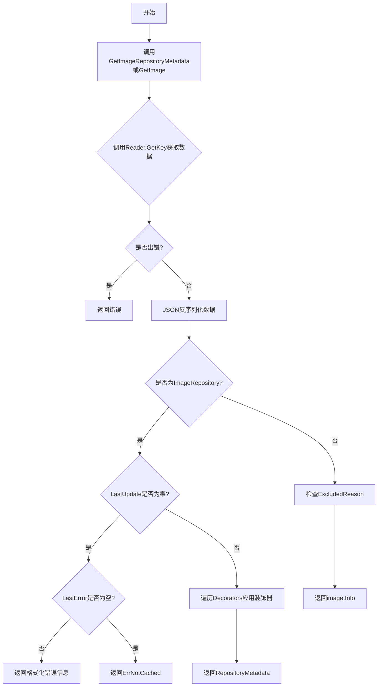
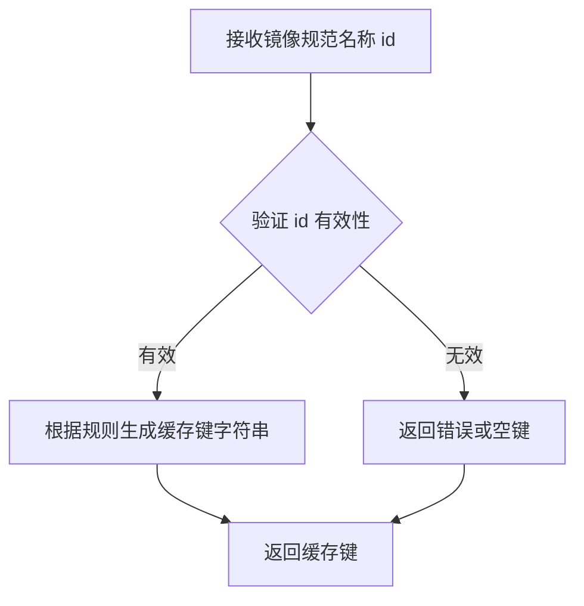
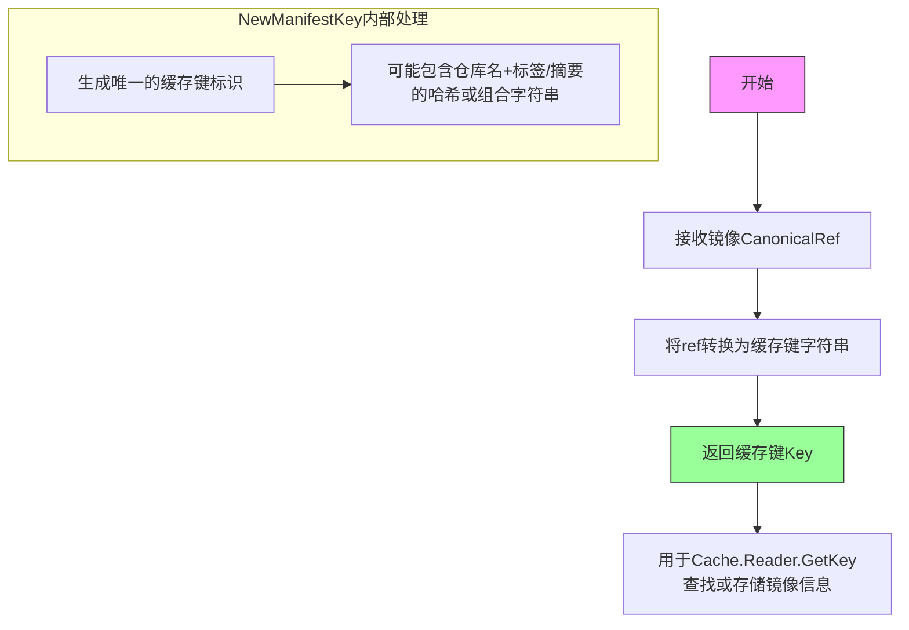
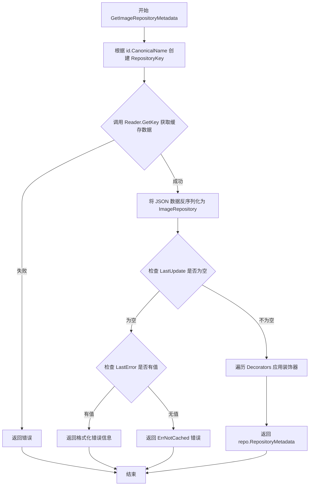
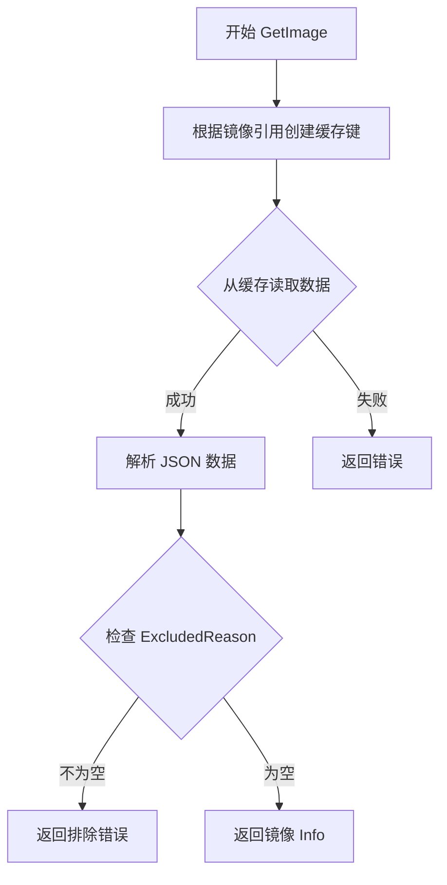
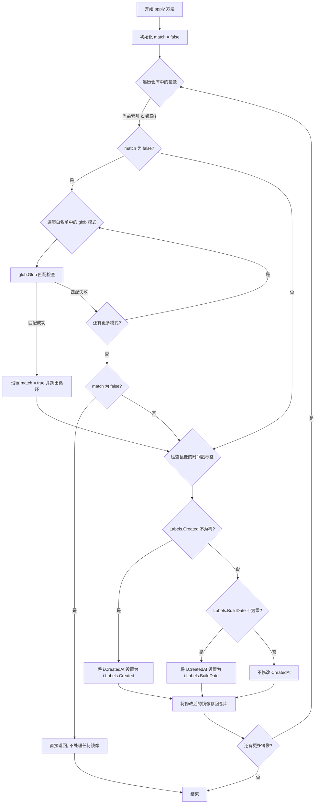

# `flux\pkg\registry\cache\registry.go` 详细设计文档

该代码实现了一个本地镜像元数据缓存系统，用于从本地缓存中检索镜像仓库和镜像的元数据信息，支持装饰器模式来修改返回的镜像仓库数据，并包含错误处理和缓存未命中时的友好错误提示。

## 整体流程



## 类结构

```
cache package
├── Cache (主缓存类)
├── Decorator (装饰器接口)
├── TimestampLabelWhitelist (时间戳标签白名单类型)
└── ImageRepository (镜像仓库数据结构)
```

## 全局变量及字段


### `ErrNotCached`
    
缓存未命中错误

类型：`error`
    


### `Cache.Reader`
    
缓存读取器接口

类型：`Reader`
    


### `Cache.Decorators`
    
装饰器列表

类型：`[]Decorator`
    


### `ImageRepository.RepositoryMetadata`
    
镜像仓库元数据

类型：`image.RepositoryMetadata`
    


### `ImageRepository.LastError`
    
上次错误信息

类型：`string`
    


### `ImageRepository.LastUpdate`
    
上次更新时间

类型：`time.Time`
    
    

## 全局函数及方法


### NewRepositoryKey

创建仓库缓存键（外部依赖函数），用于根据镜像的规范名称生成对应的缓存键，以便从缓存中检索仓库元数据。

参数：

- `id`：`image.Name`，镜像的规范名称（Canonical Name），用于生成唯一的缓存键

返回值：`string`，返回生成的缓存键字符串，用于在缓存中标识和检索特定的镜像仓库元数据

#### 流程图



#### 带注释源码

```
// NewRepositoryKey 是外部依赖函数，根据传入的镜像规范名称生成缓存键
// 在代码中的调用方式如下：
repoKey := NewRepositoryKey(id.CanonicalName())
bytes, _, err := c.Reader.GetKey(repoKey)

// 参数说明：
//   - id: image.Name 类型，表示镜像的规范名称（如 "docker.io/library/nginx:latest"）
//
// 返回值：
//   - string: 生成的缓存键，用于在缓存中唯一标识该镜像仓库
//
// 注意：此函数的具体实现未在当前代码文件中展示，属于外部依赖
```


### `NewManifestKey`

创建清单缓存键，用于在缓存系统中唯一标识一个镜像清单（manifest）条目。

参数：
- `ref`：`image.CanonicalRef`，镜像的标准引用（Canonical Reference），通常包含仓库名称和标签/摘要等唯一标识信息

返回值：`cache.Key`，缓存键类型，用于在缓存存储中唯一标识和检索镜像清单数据

#### 流程图



#### 带注释源码

```go
// NewManifestKey 根据镜像的标准引用创建缓存键
// 这是一个外部依赖函数，在本文件中被调用但未在此处定义
// 实际实现可能在cache包的key.go或其他相关文件中
//
// 使用示例（来自GetImage方法）：
func (c *Cache) GetImage(id image.Ref) (image.Info, error) {
    // 使用NewManifestKey将镜像的CanonicalRef转换为缓存键
    key := NewManifestKey(id.CanonicalRef())
    
    // 使用缓存键从Reader获取镜像数据
    val, _, err := c.Reader.GetKey(key)
    if err != nil {
        return image.Info{}, err
    }
    
    // 反序列化获取镜像信息
    var img registry.ImageEntry
    err = json.Unmarshal(val, &img)
    if err != nil {
        return image.Info{}, err
    }
    
    // 检查镜像是否被排除
    if img.ExcludedReason != "" {
        return image.Info{}, errors.New(img.ExcludedReason)
    }
    
    return img.Info, nil
}

// NewManifestKey 函数签名推断：
// func NewManifestKey(ref image.CanonicalRef) Key
// 参数说明：
//   - ref: image.Ref的CanonicalRef()方法返回值，代表镜像的规范引用
//     包含仓库地址、镜像名、标签或摘要等唯一标识信息
// 返回值：
//   - Key: 缓存系统使用的键类型，用于唯一标识缓存条目
//
// 此函数的核心作用：
//   1. 将镜像引用转换为确定性的缓存键
//   2. 确保相同镜像引用总是生成相同的缓存键
//   3. 支持缓存的查询和存储操作
```

---

> **备注**：由于 `NewManifestKey` 是外部依赖函数（在代码中调用但未在本文件中定义），其完整实现位于 cache 包的其他源文件（如 `keys.go` 或类似文件）中。上述源码基于其在 `GetImage` 方法中的使用方式进行推断和注释。


### `Cache.GetImageRepositoryMetadata`

获取镜像仓库的元数据信息，是 Cache 类的核心方法之一。该方法通过缓存键查找镜像仓库的元数据，检查数据有效性（如是否成功更新过），并通过装饰器模式对镜像仓库数据进行后处理，最终返回 `image.RepositoryMetadata` 或相应的错误信息。

参数：

- `id`：`image.Name`，目标镜像仓库的名称（通常为规范化的镜像仓库标识，如 "docker.io/fluxcd/flux"）

返回值：`image.RepositoryMetadata, error`，成功时返回镜像仓库的元数据（包括镜像列表、标签等信息），失败时返回错误信息

#### 流程图



#### 带注释源码

```go
// GetImageRepositoryMetadata returns the metadata from an image
// repository (e.g,. at "docker.io/fluxcd/flux")
// GetImageRepositoryMetadata 返回镜像仓库的元数据（例如，"docker.io/fluxcd/flux"）
func (c *Cache) GetImageRepositoryMetadata(id image.Name) (image.RepositoryMetadata, error) {
    // Step 1: 根据镜像名称的规范名构建缓存键
    // 根据镜像名称的规范名创建 RepositoryKey，用于在缓存中查找对应的数据
	repoKey := NewRepositoryKey(id.CanonicalName())
    
    // Step 2: 从缓存读取数据
    // 使用 Reader 获取与 repoKey 对应的缓存数据（字节形式）
	bytes, _, err := c.Reader.GetKey(repoKey)
	if err != nil {
        // 如果读取失败，直接返回错误
		return image.RepositoryMetadata{}, err
	}
    
    // Step 3: 反序列化缓存数据
    // 将 JSON 格式的字节数据反序列化为 ImageRepository 结构体
	var repo ImageRepository
	if err = json.Unmarshal(bytes, &repo); err != nil {
        // 反序列化失败，返回错误
		return image.RepositoryMetadata{}, err
	}

	// Step 4: 检查数据有效性
    // 只有在成功更新过的情况下才认为数据有效
    // 如果 LastUpdate 为零值，说明从未成功更新过
	// We only care about the error if we've never successfully
	// updated the result.
	if repo.LastUpdate.IsZero() {
        // 如果存在上次错误信息，返回格式化错误
		if repo.LastError != "" {
			return image.RepositoryMetadata{}, fmt.Errorf("item not in cache, last error: %s", repo.LastError)
		}
        // 如果没有错误信息，返回通用的未缓存错误
		return image.RepositoryMetadata{}, ErrNotCached
	}

	// Step 5: 应用装饰器（可选）
    // 遍历所有装饰器，对镜像仓库数据进行后处理
    // 例如：TimestampLabelWhitelist 装饰器可以根据标签覆盖创建时间
	// (Maybe) decorate the image repository.
	for _, d := range c.Decorators {
		d.apply(&repo)
	}

    // Step 6: 返回元数据
    // 返回 ImageRepository 中嵌入的 RepositoryMetadata
	return repo.RepositoryMetadata, nil
}
```


### `Cache.GetImage`

获取特定镜像的清单信息，通过镜像引用从本地缓存中检索镜像元数据。

#### 参数

- `id`：`image.Ref`，目标镜像的引用标识，包含镜像的仓库和标签信息

#### 返回值

- `image.Info`：镜像的详细信息结构体，包含镜像的元数据
- `error`：执行过程中的错误信息，可能来自缓存读取、JSON 解析或镜像被排除的情况

#### 流程图



#### 带注释源码

```go
// GetImage gets the manifest of a specific image ref, from its
// registry.
func (c *Cache) GetImage(id image.Ref) (image.Info, error) {
	// 步骤1: 根据镜像引用的规范化引用构建缓存键
	// 用于在缓存中唯一标识该镜像的清单数据
	key := NewManifestKey(id.CanonicalRef())

	// 步骤2: 通过 Reader 接口从缓存存储中获取键对应的字节数据
	// 返回值包括: val(字节数据), nothing(缓存内容元数据), err(读取错误)
	val, _, err := c.Reader.GetKey(key)
	if err != nil {
		// 缓存读取失败时，直接向上传递错误
		return image.Info{}, err
	}

	// 步骤3: 将获取的字节数据反序列化为 ImageEntry 结构体
	// ImageEntry 包含镜像的详细信息和排除原因等字段
	var img registry.ImageEntry
	err = json.Unmarshal(val, &img)
	if err != nil {
		// JSON 解析失败时，返回解析错误
		return image.Info{}, err
	}

	// 步骤4: 检查镜像是否被故意排除
	// 如果 ExcludedReason 不为空，说明该镜像被标记为不应返回
	if img.ExcludedReason != "" {
		return image.Info{}, errors.New(img.ExcludedReason)
	}

	// 步骤5: 所有检查通过，返回镜像的详细信息
	return img.Info, nil
}
```


### `TimestampLabelWhitelist.apply`

检查图像仓库中的每个图像是否匹配白名单中的 glob 模式。如果匹配且图像包含有效的时间戳标签（Created 或 BuildDate），则用标签中的时间戳替换仓库中图像的 `CreatedAt` 字段。

参数：

- `r`：`*ImageRepository`，指向图像仓库的指针，用于应用装饰器逻辑

返回值：`无`（`void`），该方法就地修改 ImageRepository 对象，无返回值

#### 流程图

```mermaid
flowchart TD
    A[开始 apply 方法] --> B{遍历图像仓库中的图像}
    B -->|当前图像索引 k| C[初始化 match = false]
    C --> D{遍历白名单中的 glob 模式}
    D --> E{glob.Glob 匹配检查}
    E -->|匹配成功| F[设置 match = true]
    E -->|匹配失败| G[继续下一个模式]
    F --> H{break 退出模式循环}
    G --> D
    H --> I{match 为 false?}
    I -->|是| J[return 退出方法]
    I -->|否| K{检查 Labels.Created 不为零?}
    K -->|是| L[设置 i.CreatedAt = i.Labels.Created]
    K -->|否| M{检查 Labels.BuildDate 不为零?}
    M -->|是| N[设置 i.CreatedAt = i.Labels.BuildDate]
    M -->|否| O[保持原 CreatedAt 不变]
    L --> P[更新仓库中的图像: r.Images[k] = i]
    N --> P
    O --> P
    P --> B
    B -->|遍历完成| Q[结束]
    J --> Q
```

#### 带注释源码

```go
// apply checks if any of the canonical image references from the
// repository matches a glob pattern from the list. If it does, and the
// image record has a valid timestamp label, it will replace the Created
// field with the value from the label for all images in the repository.
func (l TimestampLabelWhitelist) apply(r *ImageRepository) {
	var match bool                                                      // 标记是否匹配了任意一个 glob 模式
	for k, i := range r.Images {                                       // 遍历仓库中的所有图像
		if !match {                                                     // 如果当前图像还未匹配到白名单模式
			for _, exp := range l {                                    // 遍历白名单中的所有 glob 模式
				if glob.Glob(exp, i.ID.CanonicalName().String()) {     // 检查图像的规范名称是否匹配当前 glob 模式
					match = true                                       // 找到匹配，设置 match 为 true
					break                                              // 退出内层循环，无需继续检查其他模式
				}
			}
			if !match {                                                 // 遍历完所有模式后仍未匹配
				return                                                 // 直接返回，不处理当前图像
			}
		}

		switch {                                                        // 根据标签中的时间戳类型决定如何设置 CreatedAt
		case !i.Labels.Created.IsZero():                               // 如果 Created 标签存在且不为零
			i.CreatedAt = i.Labels.Created                            // 使用 Created 标签的值
		case !i.Labels.BuildDate.IsZero():                             // 否则如果 BuildDate 标签存在且不为零
			i.CreatedAt = i.Labels.BuildDate                          // 使用 BuildDate 标签的值
			// 默认情况下保持原有的 CreatedAt 不变
		}
		r.Images[k] = i                                                 // 将更新后的图像放回仓库
	}
}
```


### `TimestampLabelWhitelist.apply`

该方法检查镜像仓库中的镜像是否匹配时间戳标签白名单（glob模式），如果匹配且镜像记录包含有效的时间戳标签（Created或BuildDate），则用标签中的时间戳值替换镜像的CreatedAt字段。

参数：

- `r`：`*ImageRepository`，指向要应用时间戳标签规则的镜像仓库对象的指针

返回值：`无`（该方法修改了传入的ImageRepository对象的Images切片，没有返回值）

#### 流程图



#### 带注释源码

```go
// apply 检查镜像仓库中的镜像是否匹配白名单中的 glob 模式，
// 如果匹配且有有效的时间戳标签，则用标签值替换 CreatedAt 字段
// 参数 r: 指向 ImageRepository 的指针，包含要处理的镜像列表
func (l TimestampLabelWhitelist) apply(r *ImageRepository) {
	// match 标志位：首次匹配成功后，对所有后续镜像都应用时间戳替换
	// 注意：这种设计假设白名单匹配基于仓库级别，一旦仓库中任意镜像
	// 的规范名称匹配成功，该仓库所有镜像都将应用时间戳规则
	var match bool

	// 遍历仓库中的所有镜像
	for k, i := range r.Images {
		// 只有在尚未匹配成功时才进行白名单检查
		// 这样可以避免对每个镜像重复进行 glob 模式匹配
		if !match {
			// 遍历白名单中的所有 glob 模式
			for _, exp := range l {
				// 使用 glob 进行模式匹配，支持通配符如 "*", "?"
				// 比较白名单表达式与镜像的规范名称
				if glob.Glob(exp, i.ID.CanonicalName().String()) {
					// 匹配成功，设置标志位并跳出内层循环
					match = true
					break
				}
			}

			// 如果没有匹配任何白名单模式，直接返回，不处理任何镜像
			// 注意：这意味着只有仓库中第一个镜像参与白名单匹配检查
			if !match {
				return
			}
		}

		// 匹配成功后，对每个镜像应用时间戳替换逻辑
		// 优先使用 Labels.Created，其次使用 Labels.BuildDate
		switch {
		// 检查 Labels.Created 是否设置了有效时间戳
		case !i.Labels.Created.IsZero():
			// 使用创建标签的时间戳覆盖 CreatedAt
			i.CreatedAt = i.Labels.Created
		// 如果没有创建标签，尝试使用构建日期标签
		case !i.Labels.BuildDate.IsZero():
			// 使用构建日期标签的时间戳覆盖 CreatedAt
			i.CreatedAt = i.Labels.BuildDate
		}

		// 将修改后的镜像存回仓库的 Images 切片中
		// 注意：使用索引 k 确保原位更新
		r.Images[k] = i
	}
}
```

## 关键组件


### Cache 结构体

本地镜像元数据缓存，负责存储和检索镜像仓库及镜像的信息，支持装饰器模式扩展功能。

### Decorator 接口

用于在返回 ImageRepository 之前对其进行装饰的接口，通过 apply 方法修改仓库数据。

### TimestampLabelWhitelist 类型

字符串切片的 glob 模式列表，用于匹配 canonical 镜像引用，优先使用标签中的创建时间覆盖注册表时间。

### GetImageRepositoryMetadata 方法

根据镜像名称获取镜像仓库的元数据，包含 JSON 反序列化、错误处理和装饰器应用逻辑。

### GetImage 方法

根据镜像引用获取特定镜像的清单信息，验证排除原因并返回镜像详情。

### ImageRepository 结构体

存储镜像仓库的元数据，包括最后的更新时间、标签、镜像列表及最后的错误信息。


## 问题及建议


### 已知问题

-   **TimestampLabelWhitelist.apply() 逻辑错误**：match 变量一旦设为 true 后，所有后续镜像都会应用时间戳标签，而正确的逻辑应该是每个镜像独立进行 glob 匹配判断。此外，一旦检测到不匹配就立即 return，导致只有第一个镜像被检查。
-   **错误处理不一致**：`GetImage` 使用 `errors.New(img.ExcludedReason)` 动态创建错误，而其他位置使用预定义的 `ErrNotCached`，缺乏统一的错误类型体系。
-   **缺乏并发安全保证**：Cache 结构体和 Reader 接口都没有并发控制机制，在多线程环境下访问可能产生数据竞争。
-   **JSON 反序列化开销**：每次调用 `GetImageRepositoryMetadata` 和 `GetImage` 都会进行 JSON 解析，对于大型镜像仓库（包含大量镜像）性能较差。
-   **缓存键生成逻辑未暴露**：代码依赖 `NewRepositoryKey` 和 `NewManifestKey` 函数，但其实现未在当前文件中展示，导致无法完整理解数据存储结构。
-   **Reader 接口未定义**：代码直接使用 `Reader` 类型，但该接口的具体定义缺失，影响代码的可测试性和模块化。
-   **缺少缓存大小和过期策略**：没有实现缓存容量限制或 TTL 机制，可能导致内存持续增长。

### 优化建议

-   **重构 TimestampLabelWhitelist.apply()**：将 match 变量的作用域改为每个镜像独立判断，移除提前 return，确保每个镜像都进行白名单匹配检查。
-   **统一错误类型**：引入自定义错误类型或错误工厂方法，避免直接使用 `errors.New` 动态创建错误，提升错误可追溯性。
-   **为 Cache 添加并发控制**：使用 sync.RWMutex 保护共享资源，或重新设计为无状态服务。
-   **引入缓存层**：在 JSON 反序列化前增加内存缓存，使用 sync.Map 或自研 LRU 缓存减少重复解析开销。
-   **提取 Reader 接口定义**：将 Reader 接口移到当前包中，明确其职责（GetKey 方法签名），便于单元测试和 mock。
-   **补充缓存策略**：实现缓存大小限制（如 LRU）和过期时间清理机制，防止无限增长。
-   **增加日志记录**：在关键路径（缓存未命中、错误发生）添加日志，便于问题排查和监控。


## 其它


### 设计目标与约束

设计目标：
- 提供本地镜像元数据缓存，加速镜像仓库查询
- 支持Decorator模式，允许在返回镜像仓库前进行自定义处理
- 通过白名单机制支持从容器标签获取创建时间戳

约束：
- 依赖JSON序列化/反序列化
- Reader接口必须实现键值存储语义
- 镜像仓库必须包含LastUpdate时间戳才视为有效缓存

### 错误处理与异常设计

- ErrNotCached：缓存未命中错误，带有友好的帮助信息
- GetImageRepositoryMetadata返回错误场景：
  - Reader.GetKey失败
  - JSON反序列化失败
  - 缓存项无LastUpdate且有LastError
- GetImage返回错误场景：
  - Reader.GetKey失败
  - JSON反序列化失败
  - 镜像被排除（ExcludedReason非空）
- 所有错误均直接传递，不进行包装（除格式化为用户友好消息外）

### 数据流与状态机

数据流：
1. GetImageRepositoryMetadata流程：
   - 构建RepositoryKey → Reader.GetKey → JSON反序列化 → 检查LastUpdate → 应用Decorators → 返回RepositoryMetadata
   
2. GetImage流程：
   - 构建ManifestKey → Reader.GetKey → JSON反序列化 → 检查ExcludedReason → 返回ImageInfo

状态机：
- ImageRepository有效状态：LastUpdate非零
- ImageRepository无效状态：LastUpdate为零
- 错误状态：LastError非空

### 外部依赖与接口契约

外部依赖：
- github.com/pkg/errors：错误处理
- github.com/ryanuber/go-glob：glob模式匹配
- github.com/fluxcd/flux/pkg/errors：Flux错误类型
- github.com/fluxcd/flux/pkg/image：镜像相关类型
- github.com/fluxcd/flux/pkg/registry：注册表相关类型

接口契约：
- Reader.GetKey(key interface{}) (value []byte, ttl time.Duration, error)
- Decorator.apply(*ImageRepository)

### 性能考虑

- 缓存命中时直接返回，无额外网络开销
- Decorator应用为内存操作，O(n)复杂度
- 每次GetImageRepositoryMetadata都会进行JSON反序列化，考虑在Reader层实现缓存

### 线程安全/并发考虑

- 代码本身不包含并发控制机制
- 线程安全完全依赖Reader接口的实现
- Decorators的应用无锁保护

### 安全性考虑

- 无敏感信息处理
- 依赖外部输入（image.Name, image.Ref）需确保可信
- ExcludedReason字段用于阻止显示被排除的镜像

### 配置要求

- TimestampLabelWhitelist需配置glob模式列表
- Decorators可注入自定义实现
- Reader实现需提供键值存储

### 使用示例

```go
cache := &cache.Cache{
    Reader:     myReader,
    Decorators: []cache.Decorator{cache.TimestampLabelWhitelist{"*"}},
}
repoMeta, err := cache.GetImageRepositoryMetadata(imageName)
imgInfo, err := cache.GetImage(imageRef)
```

### 测试策略

- 单元测试：Decorator的glob匹配逻辑
- 集成测试：Reader实现与Cache的配合
- 错误场景测试：缓存未命中、JSON解析失败、ExcludedReason处理

    