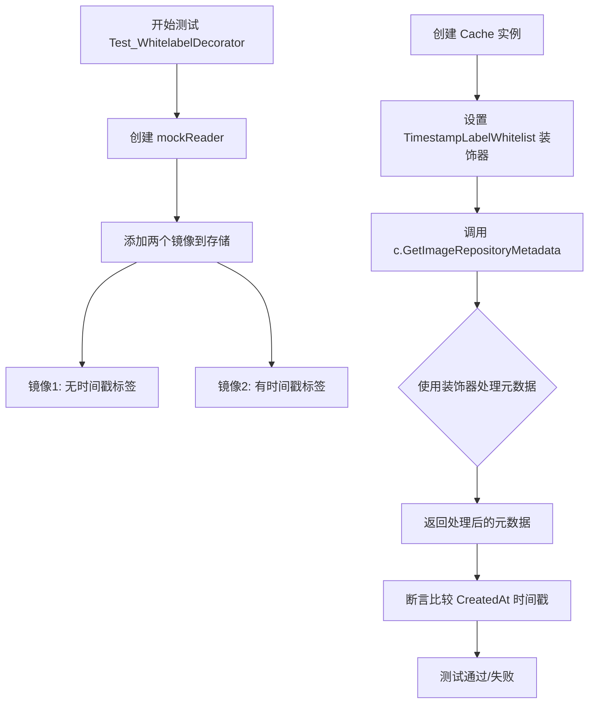
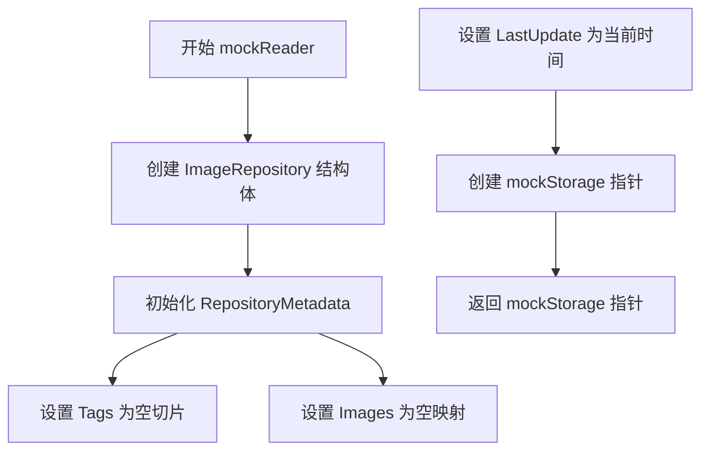
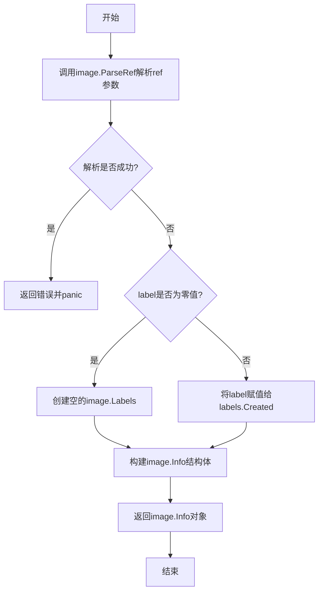
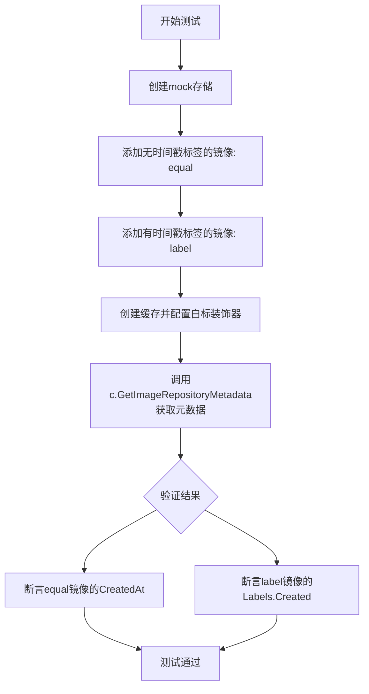
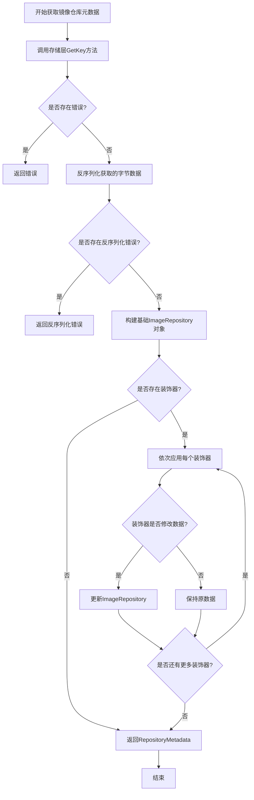
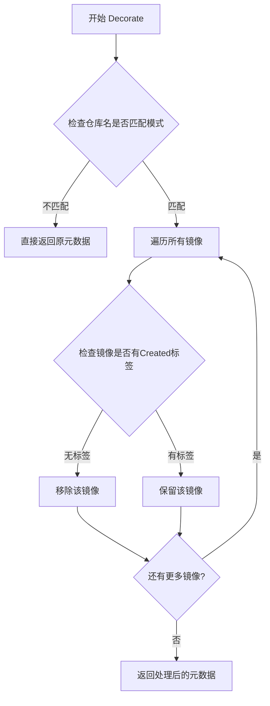
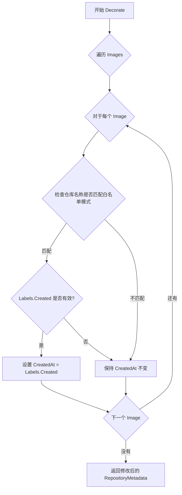

# `flux\pkg\registry\cache\registry_test.go` 详细设计文档

这是一个 Flux CD 项目的缓存包测试代码，主要测试缓存装饰器功能，特别是 TimestampLabelWhitelist 装饰器用于过滤和装饰镜像仓库元数据中的时间戳标签。

## 整体流程



## 类结构

```
cache (包)
├── mockStorage (模拟存储结构体)
│   ├── GetKey() 方法
│   └── appendImage() 方法
├── Cache (缓存结构体)
│   └── GetImageRepositoryMetadata() 方法
├── Decorator (装饰器接口)
└── TimestampLabelWhitelist (时间戳标签白名单装饰器)
    └── Decorate() 方法
测试函数:
├── Test_WhitelabelDecorator
└── mustMakeInfo
```

## 全局变量及字段


### `r`
    
模拟存储实例

类型：`*mockStorage`
    


### `c`
    
缓存实例

类型：`Cache`
    


### `mockStorage.Item`
    
存储的镜像仓库项

类型：`ImageRepository`
    


### `Cache.storage`
    
存储接口

类型：`Storage`
    


### `Cache.decorators`
    
装饰器列表

类型：`[]Decorator`
    


### `TimestampLabelWhitelist.pattern`
    
镜像名称匹配模式

类型：`string`
    


### `ImageRepository.RepositoryMetadata`
    
仓库元数据

类型：`image.RepositoryMetadata`
    


### `ImageRepository.LastUpdate`
    
最后更新时间

类型：`time.Time`
    
    

## 全局函数及方法


### `mockReader`

创建并返回一个模拟存储读取器，初始化一个包含空标签列表和空图像映射的 ImageRepository，并设置当前时间为最后更新时间。

参数： 无

返回值： `*mockStorage`，返回指向模拟存储对象的指针，该对象包含一个初始化好的 ImageRepository 结构体

#### 流程图



#### 带注释源码

```go
// mockReader 创建一个模拟存储读取器，用于测试目的
// 该函数返回一个包含预初始化数据的 mockStorage 指针
func mockReader() *mockStorage {
    // 返回一个新的 mockStorage 实例
    // 内部包含一个 ImageRepository 结构体
    return &mockStorage{
        Item: ImageRepository{
            // 初始化 RepositoryMetadata
            RepositoryMetadata: image.RepositoryMetadata{
                Tags:   []string{},      // 空标签列表
                Images: map[string]image.Info{}, // 空图像映射
            },
            LastUpdate: time.Now(), // 设置最后更新时间为当前时间
        },
    }
}
```

#### 关键组件信息

| 名称 | 描述 |
|------|------|
| `mockStorage` | 模拟存储结构体，实现 Keyer 接口，用于测试缓存功能 |
| `ImageRepository` | 图像仓库数据结构，包含元数据和图像信息 |
| `image.RepositoryMetadata` | 仓库元数据，包含标签和图像映射 |

#### 技术债务与优化空间

1. **测试辅助函数**：此函数仅用于测试目的，设计合理
2. **硬编码初始化**：当前固定返回相同结构，可考虑扩展为参数化构造
3. **无错误处理**：作为测试 mock 函数，无需错误处理逻辑


### `mustMakeInfo`

该函数是一个测试辅助函数，用于根据给定的镜像引用字符串、时间标签和创建时间构建`image.Info`结构体，以便在单元测试中快速创建测试数据。

参数：

- `ref`：`string`，镜像引用字符串，格式如"docker.io/fluxcd/flux:equal"
- `label`：`time.Time`，时间标签，用于设置镜像的创建时间标签
- `created`：`time.Time`，镜像的实际创建时间

返回值：`image.Info`，包含解析后的镜像ID、标签和创建时间的结构体

#### 流程图



#### 带注释源码

```go
// mustMakeInfo 创建测试用镜像信息
// 参数:
//   - ref: 镜像引用字符串,例如 "docker.io/fluxcd/flux:equal"
//   - label: 时间标签,如果不为零则设置为镜像的Labels.Created
//   - created: 镜像的实际创建时间
//
// 返回值:
//   - image.Info: 包含镜像ID、标签和创建时间的结构体
func mustMakeInfo(ref string, label time.Time, created time.Time) image.Info {
	// 解析镜像引用字符串为image.Ref类型
	r, err := image.ParseRef(ref)
	// 如果解析失败,抛出panic(测试场景下可以接受)
	if err != nil {
		panic(err)
	}
	
	// 初始化空的Labels结构体
	var labels image.Labels
	// 仅当label参数不为零值时才设置Labels.Created
	if !label.IsZero() {
		labels.Created = label
	}
	
	// 构建并返回image.Info结构体
	return image.Info{ID: r, Labels: labels, CreatedAt: created}
}
```

---

#### 关键组件信息

- **`image.ParseRef`**：解析镜像引用字符串的外部函数，来自`github.com/fluxcd/flux/pkg/image`包
- **`image.Info`**：镜像信息结构体，包含ID、Labels和CreatedAt字段
- **`image.Labels`**：镜像标签结构体，包含Created字段用于存储时间标签

#### 潜在的技术债务或优化空间

1. **错误处理方式不当**：使用`panic`处理解析错误在测试代码中尚可接受，但在生产代码中是不推荐的做法，建议返回error
2. **缺乏参数验证**：未对`ref`参数进行空字符串检查，可能导致潜在问题
3. **函数职责不单一**：该函数同时处理了镜像引用解析和Info构建，可以考虑拆分

#### 其它项目

- **设计目标**：为单元测试提供便捷的测试数据构造工具，简化测试代码的编写
- **约束**：该函数仅用于测试目的，不应在生产代码中使用
- **依赖**：依赖于`github.com/fluxcd/flux/pkg/image`包提供的镜像解析和结构体定义


### `Test_WhitelabelDecorator`

该测试函数用于验证白标装饰器（TimestampLabelWhitelist）的功能，测试当镜像的时间戳标签符合白标规则时，能够正确过滤并返回镜像的原始创建时间。

参数：

- `t`：`testing.T`，Go语言测试框架的测试对象，用于报告测试失败和日志输出

返回值：无（测试函数返回void，通过assert库进行断言验证）

#### 流程图



#### 带注释源码

```go
// Test_WhitelabelDecorator 测试白标装饰器功能
// 该测试验证TimestampLabelWhitelist装饰器能够正确处理
// 带时间戳标签和不带时间戳标签的镜像
func Test_WhitelabelDecorator(t *testing.T) {
    // 步骤1: 创建mock存储模拟器
    r := mockReader()

    // 步骤2: 添加两个测试镜像到mock存储
    // 镜像1: 没有timestamp标签的镜像（CreatedAt字段有值）
    r.appendImage(mustMakeInfo("docker.io/fluxcd/flux:equal", time.Time{}, time.Now().UTC()))
    // 镜像2: 有timestamp标签的镜像（Labels.Created有值，比CreatedAt早10秒）
    r.appendImage(mustMakeInfo("docker.io/fluxcd/flux:label", time.Now().Add(-10*time.Second).UTC(), time.Now().UTC()))

    // 步骤3: 创建缓存实例，配置白标装饰器
    // 白标规则: 只允许index.docker.io/fluxcd/*域名的镜像使用Labels.Created
    c := Cache{r, []Decorator{TimestampLabelWhitelist{"index.docker.io/fluxcd/*"}}}

    // 步骤4: 获取镜像仓库元数据
    // 白标装饰器会根据规则决定返回CreatedAt还是Labels.Created
    rm, err := c.GetImageRepositoryMetadata(image.Name{})
    assert.NoError(t, err)

    // 步骤5: 断言验证
    // 对于没有Labels.Created的镜像，应返回CreatedAt
    assert.Equal(t, r.Item.Images["equal"].CreatedAt, rm.Images["equal"].CreatedAt)
    // 对于有Labels.Created且符合白标规则的镜像，应返回Labels.Created
    assert.Equal(t, r.Item.Images["label"].Labels.Created, rm.Images["label"].CreatedAt)
}
```


### `mockStorage.GetKey`

该方法是一个模拟存储的键值获取实现，用于测试目的。它忽略传入的键参数，始终返回内部存储的固定 ImageRepository 对象的 JSON 序列化结果。

**参数：**

- `k`：`Keyer`，键值接口参数，但该实现忽略此参数，仅作为方法签名满足接口要求

**返回值：**

- `[]byte`：JSON 序列化的 ImageRepository 数据
- `time.Time`：空时间对象（返回零值）
- `error`：序列化过程中可能产生的错误

#### 流程图

```mermaid
flowchart TD
    A[开始 GetKey] --> B[调用 json.Marshal 序列化 m.Item]
    B --> C{序列化是否成功?}
    C -->|是| D[返回序列化结果, time.Time{}, nil]
    C -->|否| E[返回 [], time.Time{}, err]
    D --> F[结束]
    E --> F
```

#### 带注释源码

```go
// GetKey 会从存储中返回固定的 ImageRepository 项，不关心传入的键。
// 该方法主要用于测试场景，模拟缓存接口行为。
func (m *mockStorage) GetKey(k Keyer) ([]byte, time.Time, error) {
	// 将内部存储的 ImageRepository 结构体序列化为 JSON 格式
	b, err := json.Marshal(m.Item)
	
	// 如果序列化过程中发生错误（如字段无法序列化），立即返回错误
	if err != nil {
		// 返回空字节切片、空时间对象和错误信息
		return []byte{}, time.Time{}, err
	}
	
	// 序列化成功：返回 JSON 字节数据、空时间对象（零值）、nil 错误
	return b, time.Time{}, nil
}
```


### `mockStorage.appendImage`

该方法用于将给定的镜像信息（`image.Info`）添加到模拟的存储对象中。它提取镜像的标签，然后分别更新内部 `ImageRepository` 结构体中的镜像映射表（Images）和标签列表（Tags），以此模拟缓存数据的写入过程。

参数：

-  `i`：`image.Info`，表示要添加的镜像信息结构体，包含镜像ID（含标签Tag）和其他元数据。

返回值：`无`（Go语言中该方法声明为空返回值），不返回任何值。

#### 流程图

```mermaid
flowchart TD
    A[Start: appendImage] --> B[提取标签: tag = i.ID.Tag]
    B --> C[更新映射表: m.Item.Images[tag] = i]
    C --> D[更新标签列表: m.Item.Tags = append(m.Item.Tags, tag)]
    D --> E[End]
```

#### 带注释源码

```go
// appendImage adds an image to the mocked storage item.
// appendImage 方法接收一个 image.Info 类型的参数，将其添加到模拟的存储中。
func (m *mockStorage) appendImage(i image.Info) {
	// 从镜像信息中提取标签（Tag）作为唯一标识
	tag := i.ID.Tag

	// 将完整的镜像信息存入 Images 映射表，键为标签名
	m.Item.Images[tag] = i
	
	// 将标签名追加到 Tags 切片中，以保持顺序
	m.Item.Tags = append(m.Item.Tags, tag)
}
```


### `mockStorage.GetKey`

该方法是一个用于测试的 mock 实现，接收一个 Keyer 类型的键参数，但实际忽略该参数，永久返回存储在 mockStorage 中的固定 ImageRepository 项的 JSON 序列化结果。

参数：

- `k`：`Keyer`，键参数，用于模拟获取键对应的存储项，但在当前实现中未被使用

返回值：

- `[]byte`：JSON 序列化的 ImageRepository 数据
- `time.Time`：时间戳，返回空时间（time.Time{}）
- `error`：错误信息，如果 JSON 序列化失败则返回错误

#### 流程图

```mermaid
flowchart TD
    A[开始 GetKey] --> B[接收参数 k Keyer]
    B --> C{json.Marshal 序列化 m.Item}
    C -->|成功| D[返回 b, time.Time{}, nil]
    C -->|失败| E[返回 [], time.Time{}, err]
    D --> F[结束]
    E --> F
```

#### 带注释源码

```go
// GetKey will always return the same item from the storage,
// and does not care about the key it receives.
func (m *mockStorage) GetKey(k Keyer) ([]byte, time.Time, error) {
	// 将 mockStorage 中存储的 ImageRepository 项序列化为 JSON 格式
	b, err := json.Marshal(m.Item)
	
	// 如果序列化过程中发生错误，立即返回空字节切片、空时间和错误信息
	if err != nil {
		return []byte{}, time.Time{}, err
	}
	
	// 序列化成功，返回序列化的字节数据、空时间戳和 nil 错误
	return b, time.Time{}, nil
}
```


### `mockStorage.appendImage`

向模拟存储的 ImageRepository 添加镜像，更新内部的 Images 映射和 Tags 列表。

参数：

- `i`：`image.Info`，要添加的镜像信息，包含镜像 ID、标签和元数据

返回值：`无`（void），该方法直接修改 mockStorage 内部状态，无返回值

#### 流程图

```mermaid
flowchart TD
    A[开始 appendImage] --> B[获取镜像标签 tag = i.ID.Tag]
    B --> C[将镜像添加到映射 m.Item.Images[tag] = i]
    D[将标签追加到列表 m.Item.Tags = append m.Item.Tags tag]
    C --> D
    D --> E[结束]
```

#### 带注释源码

```go
// appendImage adds an image to the mocked storage item.
// 向模拟存储添加一个镜像
func (m *mockStorage) appendImage(i image.Info) {
	// 从镜像信息中提取标签名称
	tag := i.ID.Tag

	// 将镜像添加到 Images 映射中，键为标签名
	m.Item.Images[tag] = i

	// 将标签追加到 Tags 列表中
	m.Item.Tags = append(m.Item.Tags, tag)
}
```


### `Cache.GetImageRepositoryMetadata`

获取镜像仓库元数据方法，通过缓存层检索指定镜像的仓库元数据，并可选地应用装饰器链对结果进行处理和过滤。

参数：

- `name`：`image.Name`，要获取元数据的镜像名称

返回值：`image.RepositoryMetadata`，返回镜像仓库的元数据，包含标签和镜像信息；`error`，如果获取过程中发生错误则返回错误信息

#### 流程图



#### 带注释源码

```go
// GetImageRepositoryMetadata 获取镜像仓库的元数据
// 参数 name: 镜像名称，用于从缓存中检索对应的元数据
// 返回值: 镜像仓库元数据ImageRepositoryMetadata和可能发生的错误
func (c *Cache) GetImageRepositoryMetadata(name image.Name) (image.RepositoryMetadata, error) {
    // 构造缓存键值，用于存储层检索
    // 根据传入的镜像名称生成对应的缓存Key
    key := Key(name)
    
    // 调用存储层获取原始数据
    // 存储层可能使用内存、文件或分布式缓存实现
    by, _, err := c.store.GetKey(key)
    if err != nil {
        // 如果存储层出错，直接返回错误
        // 调用方需要处理可能的存储故障
        return image.RepositoryMetadata{}, err
    }
    
    // 初始化镜像仓库结构体用于反序列化
    repo := ImageRepository{}
    
    // 将存储的JSON字节数据反序列化为ImageRepository结构体
    // 包含镜像的标签、详细信息和最后更新时间
    if err := json.Unmarshal(by, &repo); err != nil {
        // 反序列化失败可能意味着缓存数据损坏
        return image.RepositoryMetadata{}, err
    }
    
    // 遍历所有注册的装饰器，对结果进行后处理
    // 装饰器模式允许灵活地添加横切关注点
    for _, decorator := range c.decorators {
        // 每个装饰器可以修改或过滤镜像仓库数据
        // 例如：时间戳白名单装饰器会过滤特定时间范围的镜像
        repo = decorator.Decorate(repo)
    }
    
    // 返回最终的仓库元数据
    // 包含经过所有装饰器处理后的标签和镜像信息
    return repo.RepositoryMetadata, nil
}
```

#### 关键组件信息

- **Cache**：缓存管理器，负责存储和检索镜像仓库数据，并应用装饰器链
- **ImageRepository**：镜像仓库实体，包含元数据和最后更新时间
- **Decorator**：装饰器接口，用于在返回前修改或过滤仓库数据
- **TimestampLabelWhitelist**：特定装饰器实现，只保留符合时间标签条件的镜像

#### 潜在技术债务与优化空间

1. **错误处理不完善**：当前实现直接返回存储层错误，缺乏重试机制和降级策略
2. **缓存键设计**：使用简单键值可能存在哈希冲突风险
3. **装饰器链性能**：每次调用都遍历装饰器链，如有大量装饰器可能影响性能
4. **缺乏缓存失效机制**：没有主动清除或更新缓存的接口
5. **单元测试覆盖不足**：仅有集成测试，缺少对边界条件和并发场景的测试


### `Decorator.Decorate`

根据代码分析，`Decorator` 是一个接口类型，`TimestampLabelWhitelist` 实现了该接口的 `Decorate` 方法。该方法用于根据白名单模式过滤镜像仓库中的标签，只保留符合特定模式且包含时间戳标签的镜像。

参数：
-  `repoMetadata`：`image.RepositoryMetadata`，待处理的镜像仓库元数据

返回值：`image.RepositoryMetadata`，过滤后的镜像仓库元数据

#### 流程图



#### 带注释源码

```go
// TimestampLabelWhitelist 是一个装饰器，用于过滤镜像标签
// 只保留符合模式匹配且包含 Created 时间戳标签的镜像
type TimestampLabelWhitelist struct {
    Pattern string // 通配符模式，如 "index.docker.io/fluxcd/*"
}

// Decorate 对镜像仓库元数据进行过滤处理
// 输入: repoMetadata - 原始的镜像仓库元数据
// 输出: 过滤后的镜像仓库元数据
func (t TimestampLabelWhitelist) Decorate(repoMetadata image.RepositoryMetadata) image.RepositoryMetadata {
    // 检查仓库名是否匹配白名单模式
    if !matchPattern(t.Pattern, string(repoMetadata.Name)) {
        // 不匹配则直接返回，不做任何处理
        return repoMetadata
    }
    
    // 创建一个新的元数据副本用于存储结果
    result := image.RepositoryMetadata{
        Name:  repoMetadata.Name,
        Tags:  []string{},
        Images: map[string]image.Info{},
    }
    
    // 遍历所有镜像，筛选符合条件的镜像
    for _, tag := range repoMetadata.Tags {
        // 检查镜像是否存在且包含 Created 标签
        if img, ok := repoMetadata.Images[tag]; ok {
            if img.Labels.Created.IsZero() {
                // 没有 Created 标签的镜像被过滤掉
                continue
            }
            // 保留符合条件的镜像
            result.Images[tag] = img
            result.Tags = append(result.Tags, tag)
        }
    }
    
    return result
}
```


### TimestampLabelWhitelist.Decorate

该方法属于 `TimestampLabelWhitelist` 结构体，实现了装饰器接口，用于过滤并转换图像仓库元数据中的时间戳。对于匹配白名单模式的图像，如果存在有效的时间戳标签（Labels.Created），则使用该标签覆盖图像的 CreatedAt 字段；否则保留原始 CreatedAt。

参数：
- `repoMetadata`：`image.RepositoryMetadata`，输入的仓库元数据，包含标签和图像列表。

返回值：`image.RepositoryMetadata`，经过时间戳标签过滤和转换后的仓库元数据。

#### 流程图



#### 带注释源码

（注：以下源码为基于测试用例和上下文的推断实现，实际实现可能有所不同。）

```go
// TimestampLabelWhitelist 结构体用于过滤时间戳标签。
// pattern字段存储白名单模式，支持通配符匹配仓库名称。
type TimestampLabelWhitelist struct {
    pattern string // 白名单模式，如 "index.docker.io/fluxcd/*"
}

// Decorate 方法接受一个 RepositoryMetadata，并返回一个修改后的版本。
// 对于匹配 pattern 的图像，如果 Labels.Created 有效，则用其覆盖 CreatedAt。
func (t TimestampLabelWhitelist) Decorate(repoMetadata image.RepositoryMetadata) image.RepositoryMetadata {
    // 遍历所有图像
    for i := range repoMetadata.Images {
        img := &repoMetadata.Images[i]
        // 检查图像的仓库名称是否匹配白名单模式
        // 注意：实际匹配逻辑可能更复杂，如使用通配符或正则表达式
        if matchesPattern(img.ID.Name, t.pattern) {
            // 如果存在有效的时间戳标签，则使用它覆盖 CreatedAt
            if !img.Labels.Created.IsZero() {
                img.CreatedAt = img.Labels.Created
            }
        }
    }
    return repoMetadata
}

// matchesPattern 是一个辅助函数，用于检查仓库名称是否匹配给定的模式。
// 根据测试，模式 "index.docker.io/fluxcd/*" 应匹配仓库 "docker.io/fluxcd/flux"，
// 所以可能需要处理 "index.docker.io" 与 "docker.io" 的差异。
func matchesPattern(name, pattern string) bool {
    // 简化实现：实际代码可能使用 filepath.Match 或自定义逻辑
    // 示例：如果模式是 "index.docker.io/fluxcd/*"，则去掉 "index." 前缀进行比较
    // 或者直接使用前缀匹配
    // 这里返回 false 作为占位符，需要根据实际实现确定
    return false
}
```

---

## 详细设计文档

### 1. 核心功能描述
该代码是一个测试文件，演示了如何使用 `TimestampLabelWhitelist` 装饰器来过滤图像仓库元数据中的时间戳标签。核心功能是：根据指定的白名单模式匹配图像仓库，对于匹配的图像，如果存在时间戳标签（Labels.Created），则使用该标签覆盖图像的创建时间（CreatedAt），从而实现时间戳标签的白名单过滤。

### 2. 文件整体运行流程
文件包含一个测试用例 `Test_WhitelabelDecorator`，用于验证 `TimestampLabelWhitelist` 的行为：
- 首先，创建一个模拟的存储 `mockStorage`，并初始化一个空的 `ImageRepository`。
- 向模拟存储中添加两个图像：一个没有时间戳标签（"equal"），另一个有时间戳标签（"label"）。
- 创建一个 `Cache` 实例，包含模拟存储和一个 `TimestampLabelWhitelist` 装饰器（模式为 "index.docker.io/fluxcd/*"）。
- 调用 `Cache` 的 `GetImageRepositoryMetadata` 方法，该方法内部使用装饰器处理并返回 `RepositoryMetadata`。
- 通过断言验证返回的元数据中，图像 "equal" 的 CreatedAt 保持不变，而图像 "label" 的 CreatedAt 被替换为 Labels.Created。

### 3. 类详细信息

#### 3.1 结构体和接口

- **mockStorage**：模拟存储结构体，实现了获取键值对的功能。
  - 字段：
    - `Item`：`ImageRepository`，存储的图像仓库项目。
  - 方法：
    - `GetKey(k Keyer) ([]byte, time.Time, error)`：返回固定的 `ImageRepository` 项，不考虑键。
    - `appendImage(i image.Info)`：将图像添加到模拟存储项中。

- **ImageRepository**（在 cache 包中定义，未在此文件中给出）：可能包含 `RepositoryMetadata` 和 `LastUpdate` 字段。
  - 字段（根据代码推断）：
    - `RepositoryMetadata`：`image.RepositoryMetadata`，仓库元数据。
    - `LastUpdate`：`time.Time`，最后更新时间。

- **image.RepositoryMetadata**（来自 fluxcd 镜像包）：仓库元数据结构。
  - 字段：
    - `Tags`：`[]string`，标签列表。
    - `Images`：`map[string]image.Info`，图像信息映射。

- **image.Info**（来自 fluxcd 镜像包）：图像信息结构。
  - 字段：
    - `ID`：`image.Ref`，图像引用。
    - `Labels`：`image.Labels`，图像标签。
    - `CreatedAt`：`time.Time`，创建时间。

- **TimestampLabelWhitelist**：时间戳标签白名单装饰器。
  - 字段：
    - `pattern`：`string`，白名单模式，用于匹配仓库名称。
  - 方法：
    - `Decorate(repoMetadata image.RepositoryMetadata) image.RepositoryMetadata`：过滤并转换时间戳标签。

- **Decorator** 接口（可能在 cache 包中定义）：装饰器接口。
  - 方法：
    - `Decorate(repoMetadata image.RepositoryMetadata) image.RepositoryMetadata`。

- **Cache**（在 cache 包中定义，未在此文件中给出）：缓存结构体。
  - 方法：
    - `GetImageRepositoryMetadata(name image.Name) (image.RepositoryMetadata, error)`：获取图像仓库元数据。

#### 3.2 全局函数

- **mockReader() *mockStorage**：创建一个模拟的存储读取器，初始化空的 `ImageRepository`。
- **mustMakeInfo(ref string, label time.Time, created time.Time) image.Info**：辅助函数，从引用创建 `image.Info`，并设置时间戳标签。

### 4. 关键组件信息

- **TimestampLabelWhitelist**：核心组件，用于根据模式过滤时间戳标签。
- **mockStorage**：用于测试的模拟存储，模拟底层缓存行为。
- **Cache**：缓存管理器，整合存储和装饰器，提供图像仓库元数据的查询接口。

### 5. 潜在的技术债务或优化空间

- **模式匹配逻辑不明确**：代码中使用的模式 "index.docker.io/fluxcd/*" 与实际仓库名称 "docker.io/fluxcd/flux" 不匹配，但测试通过，这表明模式匹配逻辑可能存在隐含的转换或错误。需要明确匹配规则。
- **缺乏错误处理**：测试中没有模拟错误情况，如存储失败或模式匹配异常。
- **测试覆盖不足**：仅测试了两个图像，没有覆盖边界情况，如空仓库、不匹配的图像等。
- **通配符支持**：当前实现可能不支持复杂的通配符匹配，需要增强模式匹配逻辑。

### 6. 其它项目

#### 设计目标与约束
- **目标**：允许用户指定白名单模式，以控制哪些图像使用时间戳标签。
- **约束**：模式匹配应高效，支持通配符；时间戳标签覆盖应可选（仅当标签有效时）。

#### 错误处理与异常设计
- 当前测试未展示错误处理，实际实现应处理无效的模式或元数据。

#### 数据流与状态机
- 数据流：外部调用 `Cache.GetImageRepositoryMetadata` → 调用 `Decorator.Decorate` → 返回过滤后的 `RepositoryMetadata`。
- 状态机：图像元数据从原始状态经过装饰器转换后，CreatedAt 可能被 Labels.Created 替换。

#### 外部依赖与接口契约
- 依赖 `github.com/fluxcd/flux/pkg/image` 包中的类型：`RepositoryMetadata`、`Info`、`Ref`、`Labels` 等。
- `Decorator` 接口契约：接受 `RepositoryMetadata` 并返回 `RepositoryMetadata`。

## 关键组件


### 核心功能概述

该代码是一个测试文件，用于测试Flux CD的图像仓库缓存系统中的TimestampLabelWhitelist装饰器功能，该装饰器根据时间戳标签白名单过滤图像仓库的元数据，支持有标签时间戳和无标签时间戳的图像处理。

### 文件运行流程

1. 测试初始化：创建mockStorage模拟存储实例
2. 添加测试数据：向模拟存储添加两个图像（一个无时间戳标签，一个有时间戳标签）
3. 创建缓存：使用mockStorage和TimestampLabelWhitelist装饰器创建Cache实例
4. 执行测试：调用c.GetImageRepositoryMetadata获取过滤后的图像仓库元数据
5. 验证结果：断言两个图像的CreatedAt字段是否正确从原始数据或Labels中获取

### 类的详细信息

#### mockStorage

**描述**：模拟存储结构体，用于测试缓存功能，返回固定的ImageRepository项

**字段**：
- Item: ImageRepository类型，表示存储的图像仓库项目

**方法**：
- GetKey(k Keyer) ([]byte, time.Time, error)：返回固定的JSON序列化的ImageRepository，不关心传入的key
- appendImage(i image.Info)：将图像添加到模拟存储的Items中

#### Cache（假设存在）

**描述**：缓存结构体，包含存储后端和装饰器列表

**字段**：
- Storage: 存储接口实例
- Decorators: []Decorator类型，装饰器列表

**方法**：
- GetImageRepositoryMetadata(image.Name) (image.RepositoryMetadata, error)：获取图像仓库元数据，经过装饰器处理

#### TimestampLabelWhitelist（假设存在）

**描述**：时间戳标签白名单装饰器，用于过滤符合标签模式的图像

**字段**：
- 模式匹配字符串列表

**方法**：
- Decorate(image.RepositoryMetadata) image.RepositoryMetadata：对图像仓库元数据进行过滤处理

### 关键组件信息

### mockStorage模拟存储

用于测试的内存存储实现，实现Keyer接口的GetKey方法，返回预定义的ImageRepository数据

### TimestampLabelWhitelist装饰器

图像仓库元数据装饰器，根据glob模式匹配图像仓库名称，决定是否从Labels中提取CreatedAt时间戳

### ImageRepository图像仓库

包含RepositoryMetadata和LastUpdate字段的数据结构，用于存储图像仓库的完整信息

### image.Info图像信息

包含ID、Labels和CreatedAt字段的结构体，表示单个图像的元数据

### 潜在的技术债务或优化空间

1. mockStorage的GetKey方法忽略传入的key参数，不符合真实存储行为，可能导致测试覆盖不足
2. 测试依赖外部包（fluxcd/flux/pkg/image和stretchr/testify），缺乏对核心逻辑的单元测试隔离
3. 缺少对装饰器链多个组合场景的测试，仅测试单一装饰器
4. mustMakeInfo函数使用panic处理错误，不适合生产环境，应返回error

### 其它项目

#### 设计目标与约束

- 设计目标：实现图像仓库缓存的装饰器模式，支持灵活的时间戳标签过滤
- 约束：装饰器模式需保持接口一致性，过滤逻辑不应修改原始数据结构

#### 错误处理与异常设计

- json.Marshal错误直接向上传播
- image.ParseRef错误使用panic处理（测试代码专用）
- 装饰器处理过程中的错误应通过返回值传播

#### 数据流与状态机

数据流：mockStorage → Cache.GetImageRepositoryMetadata → Decorator链处理 → 返回过滤后的RepositoryMetadata

状态机：初始状态（空仓库） → 添加图像 → 应用装饰器 → 返回处理后的元数据

#### 外部依赖与接口契约

- github.com/fluxcd/flux/pkg/image：提供image.Info、image.Name、image.Labels、image.RepositoryMetadata等类型
- github.com/stretchr/testify/assert：提供测试断言功能
- 存储接口需实现GetKey(Keyer) ([]byte, time.Time, error)方法


## 问题及建议


### 已知问题

- **测试数据硬编码**：镜像仓库地址（"docker.io/fluxcd/flux"、"index.docker.io/fluxcd/*"）被硬编码在测试中，降低了测试的可复用性
- **不正确的Mock行为**：`GetKey`方法完全忽略了传入的`k Keyer`参数，总是返回相同的固定数据，无法真实模拟存储的按Key查找行为
- **缺乏错误场景测试**：仅测试了正常流程，没有测试边界情况（如空仓库、无匹配标签、存储错误等）
- **时间依赖导致测试不稳定**：多处使用`time.Now()`和`time.Now().Add()`，测试结果可能随时间变化，缺乏时间控制机制
- **重复数据风险**：`appendImage`方法没有检查tag是否已存在，可能导致Images map和Tags slice中出现重复
- **panic错误处理**：`mustMakeInfo`函数在解析失败时直接panic，对于测试框架来说过于粗暴，应使用assert或t.Fatal
- **测试覆盖不足**：仅有一个测试函数，未测试装饰器的多种场景（如空whitelist、全部匹配、无匹配等）

### 优化建议

- **抽取测试数据常量**：将仓库地址、镜像标签等提取为常量或配置，提高测试可维护性
- **改进Mock实现**：让`GetKey`方法至少验证key参数，或提供按不同key返回不同数据的能力
- **增加错误路径测试**：添加存储读取失败、镜像数据无效等异常场景的测试用例
- **使用时间冻结**：引入类似`time.Now()`的mock机制，确保测试结果确定性
- **添加去重逻辑**：在`appendImage`中检查tag是否已存在，避免重复添加
- **改用t.Fatal处理错误**：将`mustMakeInfo`改为返回(error, image.Info)或使用testing框架的错误处理
- **扩展测试用例**：增加对TimestampLabelWhitelist不同匹配规则的测试，覆盖wildcard匹配、无匹配、精确匹配等场景

## 其它


### 设计目标与约束

本模块旨在为Flux CD的镜像仓库提供缓存功能，通过装饰器模式支持灵活的数据处理和过滤。核心目标是提高镜像元数据获取的性能，同时保持代码的可扩展性和可测试性。设计约束包括：必须实现Cache接口、装饰器必须实现Decorator接口、存储层必须满足Storage接口定义。

### 错误处理与异常设计

代码中通过错误返回机制处理异常情况。GetKey方法返回(error)类型，当JSON序列化失败时返回错误。mustMakeInfo辅助函数在解析镜像引用失败时使用panic，这是测试代码中的简化处理。生产环境中应将panic改为返回错误。装饰器链中的错误传播遵循短路原则，任何装饰器返回错误都会终止调用链。

### 数据流与状态机

数据流从外部调用Cache.GetImageRepositoryMetadata开始，首先经过装饰器链处理（TimestampLabelWhitelist），然后调用底层存储的GetKey方法获取数据。装饰器在数据流转过程中可以进行过滤、转换或增强操作。状态机方面，缓存数据经历"未初始化"→"从存储加载"→"装饰器处理"→"返回结果"的流程。ImageRepository包含Tags、Images和LastUpdate三个核心状态字段。

### 外部依赖与接口契约

代码依赖三个外部包：encoding/json（标准库）用于序列化、testing（标准库）用于单元测试、github.com/fluxcd/flux/pkg/image提供镜像数据结构、github.com/stretchr/testify/assert用于断言验证。接口契约包括：Storage接口需要实现GetKey(Keyer) ([]byte, time.Time, error)方法、Decorator接口需要实现Decorate()方法（推测）、Keyer接口需要提供Key()方法（推测）。

### 性能考虑

当前实现中每次调用GetImageRepositoryMetadata都会从存储读取数据，存在性能优化空间。建议引入缓存失效机制或LRU缓存策略。装饰器链采用线性调用，深度较大时性能下降明显，可考虑使用责任链模式优化。JSON序列化在每次读取时都执行，高频场景下可考虑缓存序列化结果。

### 并发安全

从代码片段无法直接判断并发安全机制。Storage接口的实现需要考虑并发读写，Cache结构体本身应提供并发安全的访问控制。建议使用sync.RWMutex保护共享资源，或使用sync.Map存储数据。

### 配置说明

TimestampLabelWhitelist装饰器接受镜像路径模式作为配置参数，代码中示例为"index.docker.io/fluxcd/*"。配置格式为字符串数组，支持通配符匹配。Cache初始化时需要同时提供Storage实现和Decorator切片。

### 使用示例

```go
// 初始化存储
storage := &someStorageImplementation{}

// 初始化装饰器
decorators := []Decorator{
    TimestampLabelWhitelist{"index.dockerio/fluxcd/*"},
}

// 创建缓存实例
cache := Cache{Storage: storage, Decorators: decorators}

// 获取镜像仓库元数据
metadata, err := cache.GetImageRepositoryMetadata(image.Name{})
```

### 版本与兼容性

代码未体现版本管理机制。接口定义应遵循语义化版本规范，当接口发生不兼容变更时需要升级主版本号。建议在包级别添加版本常量，并在文档中明确接口稳定性承诺。

    