# `flux\pkg\registry\cache\repocachemanager.go` 详细设计文档

这是一个容器镜像仓库缓存管理器，用于管理Docker镜像的缓存。它负责从远程仓库获取镜像标签和清单（manifest），将其缓存以提高性能，并处理并发请求、缓存过期和速率限制等问题。

## 整体流程

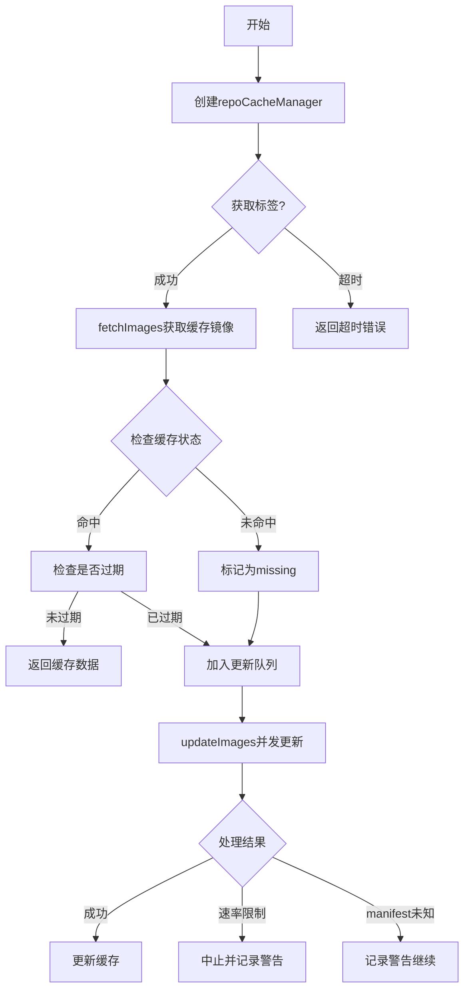

## 类结构

```
repoCacheManager (缓存管理器)
├── imageToUpdate (镜像更新信息)
└── fetchImagesResult (获取结果)
```

## 全局变量及字段


### `imageToUpdate.ref`
    
镜像引用

类型：`image.Ref`
    


### `imageToUpdate.previousDigest`
    
上次摘要

类型：`string`
    


### `imageToUpdate.previousRefresh`
    
上次刷新间隔

类型：`time.Duration`
    


### `repoCacheManager.now`
    
当前时间

类型：`time.Time`
    


### `repoCacheManager.repoID`
    
仓库名称

类型：`image.Name`
    


### `repoCacheManager.client`
    
仓库客户端

类型：`registry.Client`
    


### `repoCacheManager.clientTimeout`
    
客户端超时时间

类型：`time.Duration`
    


### `repoCacheManager.burst`
    
并发burst限制

类型：`int`
    


### `repoCacheManager.trace`
    
是否启用追踪

类型：`bool`
    


### `repoCacheManager.logger`
    
日志记录器

类型：`log.Logger`
    


### `repoCacheManager.cacheClient`
    
缓存客户端

类型：`Client`
    


### `repoCacheManager.sync.Mutex`
    
互斥锁

类型：`sync.Mutex`
    


### `fetchImagesResult.imagesFound`
    
找到的镜像

类型：`map[string]image.Info`
    


### `fetchImagesResult.imagesToUpdate`
    
需要更新的镜像

类型：`[]imageToUpdate`
    


### `fetchImagesResult.imagesToUpdateRefreshCount`
    
因过期需要更新的数量

类型：`int`
    


### `fetchImagesResult.imagesToUpdateMissingCount`
    
因缺失需要更新的数量

类型：`int`
    
    

## 全局函数及方法


### `newRepoCacheManager`

该函数是 `repoCacheManager` 类型的构造函数，通过客户端工厂为特定的镜像仓库创建一个缓存管理器实例，负责管理镜像仓库的缓存操作，包括镜像标签和清单的获取、更新和存储。

参数：

- `now`：`time.Time`，当前时间，用于缓存的时间戳计算
- `repoID`：`image.Name`，镜像仓库名称，标识要管理的镜像仓库
- `clientFactory`：`registry.ClientFactory`，客户端工厂，用于创建与镜像仓库通信的客户端
- `creds`：`registry.Credentials`，认证凭证，用于访问私有镜像仓库
- `repoClientTimeout`：`time.Duration`，客户端超时时间，限制远程请求的最大等待时间
- `burst`：`int`，突发限制，控制并发获取镜像的最大数量
- `trace`：`bool`，跟踪标志，启用后将输出详细的调试日志
- `logger`：`log.Logger`，日志记录器，用于输出操作日志
- `cacheClient`：`Client`，缓存客户端，负责存储和检索缓存数据

返回值：`*repoCacheManager, error`，成功时返回新创建的缓存管理器实例，失败时返回 nil 和错误信息

#### 流程图

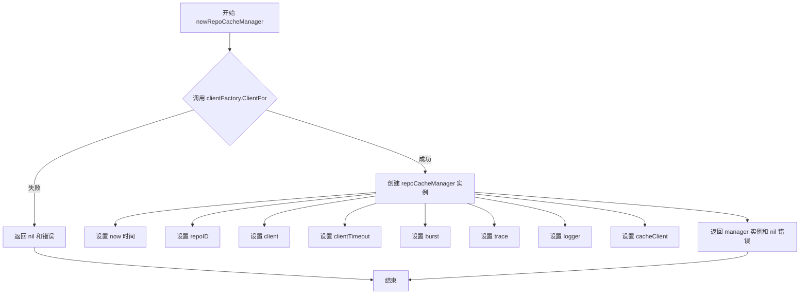

#### 带注释源码

```go
// newRepoCacheManager 创建一个新的 repoCacheManager 实例
// 参数：
//   - now: 当前时间，用于缓存过期计算
//   - repoID: 镜像仓库名称
//   - clientFactory: 客户端工厂，用于创建 registry 客户端
//   - creds: 认证凭证
//   - repoClientTimeout: 远程客户端请求超时时间
//   - burst: 并发获取限制
//   - trace: 是否启用跟踪日志
//   - logger: 日志记录器
//   - cacheClient: 缓存客户端接口
//
// 返回值：
//   - *repoCacheManager: 新创建的缓存管理器
//   - error: 如果创建客户端失败则返回错误
func newRepoCacheManager(now time.Time,
	repoID image.Name, clientFactory registry.ClientFactory, creds registry.Credentials, repoClientTimeout time.Duration,
	burst int, trace bool, logger log.Logger, cacheClient Client) (*repoCacheManager, error) {
	
	// 使用客户端工厂为指定仓库创建客户端
	client, err := clientFactory.ClientFor(repoID.CanonicalName(), creds)
	if err != nil {
		// 创建失败，返回错误
		return nil, err
	}
	
	// 初始化 repoCacheManager 结构体
	manager := &repoCacheManager{
		now:           now,                       // 当前时间
		repoID:        repoID,                    // 镜像仓库ID
		client:        client,                    // registry 客户端
		clientTimeout: repoClientTimeout,         // 客户端超时设置
		burst:         burst,                     // 并发限制
		trace:         trace,                     // 跟踪标志
		logger:        logger,                    // 日志记录器
		cacheClient:   cacheClient,                // 缓存客户端
	}
	
	// 返回创建成功的管理器和空错误
	return manager, nil
}
```


### `repoCacheManager.fetchRepository`

该方法从缓存中获取镜像仓库的元数据信息，通过构建仓库键值从缓存客户端检索数据，并将其反序列化为 `ImageRepository` 结构体返回。

参数：
- （无参数）

返回值：
- `ImageRepository`：从缓存中获取的镜像仓库信息
- `error`：获取或反序列化失败时返回错误

#### 流程图

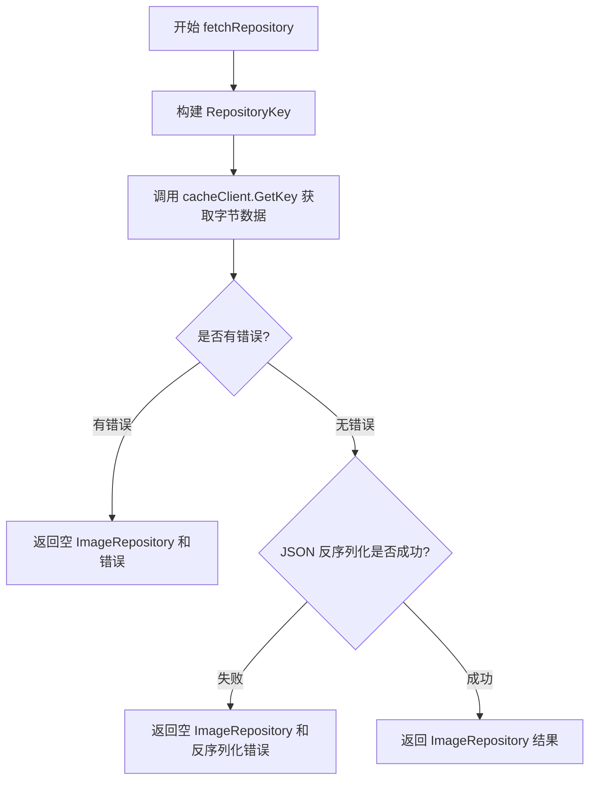

#### 带注释源码

```go
// fetchRepository 从缓存中获取镜像仓库信息
func (c *repoCacheManager) fetchRepository() (ImageRepository, error) {
    var result ImageRepository // 用于存储反序列化后的仓库数据
    
    // 使用仓库的规范名称创建缓存键
    repoKey := NewRepositoryKey(c.repoID.CanonicalName())
    
    // 从缓存客户端获取键对应的值
    // 返回: bytes(缓存的字节数据), _(deadline, 此处不需要), err(错误信息)
    bytes, _, err := c.cacheClient.GetKey(repoKey)
    if err != nil {
        // 缓存获取失败时，直接返回空结果和错误
        return ImageRepository{}, err
    }
    
    // 将缓存的字节数据反序列化为 ImageRepository 结构体
    if err = json.Unmarshal(bytes, &result); err != nil {
        // 反序列化失败时，返回空结果和反序列化错误
        return ImageRepository{}, err
    }
    
    // 成功获取并反序列化后，返回结果
    return result, nil
}
```


### `repoCacheManager.getTags`

获取镜像仓库的所有标签

参数：

- `ctx`：`context.Context`，上下文对象，用于控制超时和取消操作

返回值：

- `[]string`，返回仓库中的所有标签列表
- `error`，如果获取标签失败返回错误信息

#### 流程图

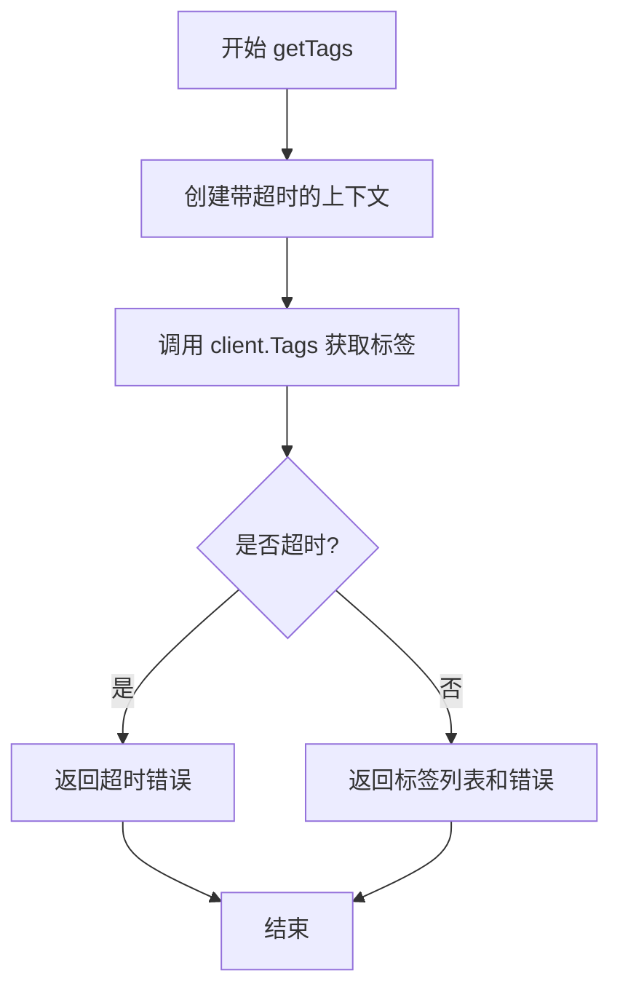

#### 带注释源码

```go
// getTags gets the tags from the repository
// 获取仓库的所有标签
func (c *repoCacheManager) getTags(ctx context.Context) ([]string, error) {
	// 创建一个带有客户端超时时间的上下文
	// 使用 c.clientTimeout 作为超时限制
	ctx, cancel := context.WithTimeout(ctx, c.clientTimeout)
	// 确保在函数返回时取消上下文，释放资源
	defer cancel()
	
	// 调用客户端的 Tags 方法获取标签列表
	tags, err := c.client.Tags(ctx)
	
	// 检查是否发生了超时错误
	// 如果是 DeadlineExceeded，则返回自定义的超时错误信息
	if ctx.Err() == context.DeadlineExceeded {
		return nil, c.clientTimeoutError()
	}
	
	// 返回标签列表和可能的错误
	return tags, err
}
```


### `repoCacheManager.storeRepository`

将 ImageRepository 对象序列化为 JSON 并存储到缓存中，使用仓库的规范名称作为缓存键，并设置适当的过期时间。

参数：

- `repo`：`ImageRepository`，要存储的镜像仓库对象，包含仓库的标签和镜像信息

返回值：`error`，如果序列化或存储过程中发生错误则返回错误，否则返回 nil

#### 流程图

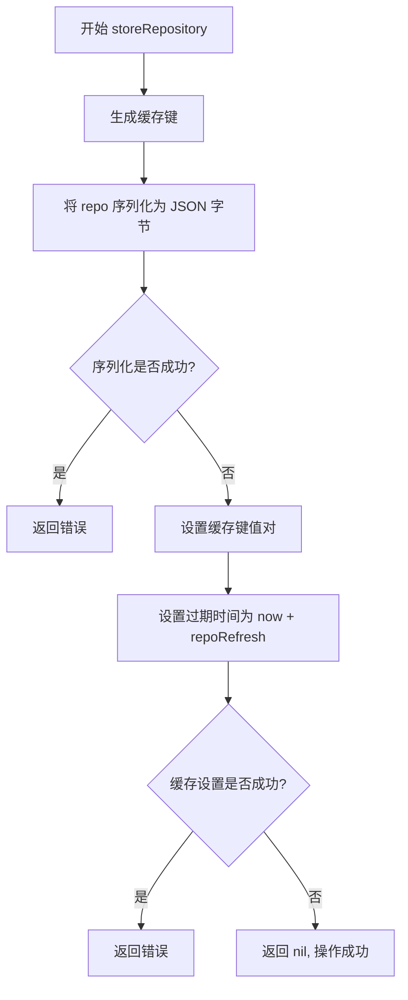

#### 带注释源码

```go
// storeRepository 将镜像仓库信息存入缓存
// 参数: repo ImageRepository - 要缓存的镜像仓库对象
// 返回: error - 缓存操作错误
func (c *repoCacheManager) storeRepository(repo ImageRepository) error {
	// 1. 使用仓库的规范名称创建缓存键
	repoKey := NewRepositoryKey(c.repoID.CanonicalName())
	
	// 2. 将 ImageRepository 结构体序列化为 JSON 字节数组
	bytes, err := json.Marshal(repo)
	if err != nil {
		// 序列化失败，返回错误
		return err
	}
	
	// 3. 使用缓存客户端设置键值对
	// 过期时间 = 当前时间 + repoRefresh (预定义的刷新间隔)
	return c.cacheClient.SetKey(repoKey, c.now.Add(repoRefresh), bytes)
}
```


### `repoCacheManager.fetchImages`

该方法从缓存中获取指定标签的镜像信息，区分缓存命中（返回现有信息）和缓存未命中/过期（标记为需要更新），并统计因缺失和过期而需要更新的镜像数量。

参数：

- `tags`：`[]string`，要获取的镜像标签列表

返回值：`fetchImagesResult, error`，返回包含已找到镜像、需要更新的镜像列表及更新原因的结构体，若标签为空则返回错误

#### 流程图

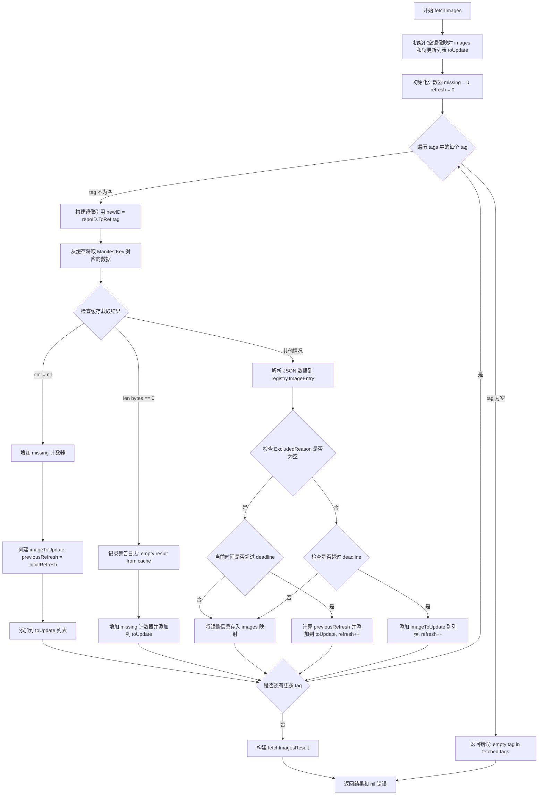

#### 带注释源码

```go
// fetchImages attempts to fetch the images with the provided tags from the cache.
// It returns the images found, those which require updating and details about
// why they need to be updated.
func (c *repoCacheManager) fetchImages(tags []string) (fetchImagesResult, error) {
	// 用于存储从缓存中找到的镜像信息，key 为 tag，value 为镜像详情
	images := map[string]image.Info{}

	// 创建一个待更新镜像的列表
	var toUpdate []imageToUpdate

	// 用于统计处理结果的计数器
	var missing, refresh int

	// 遍历每个标签进行缓存查询
	for _, tag := range tags {
		// 校验标签有效性，空标签直接返回错误
		if tag == "" {
			return fetchImagesResult{}, fmt.Errorf("empty tag in fetched tags")
		}

		// 根据 tag 构建完整的镜像引用对象
		newID := c.repoID.ToRef(tag)
		// 创建缓存键，用于查询 Manifest 缓存
		key := NewManifestKey(newID.CanonicalRef())
		// 从缓存客户端获取键值对，包含缓存数据和过期时间 deadline
		bytes, deadline, err := c.cacheClient.GetKey(key)

		// 处理缓存查询的三种结果：出错、空数据、正常数据
		switch {
		// 情况1: 缓存查询出错（可能是缓存未命中或其他错误）
		case err != nil:
			// 除了 ErrNotCached 之外的其他错误需要记录警告日志
			if err != ErrNotCached {
				c.logger.Log("warning", "error from cache", "err", err, "ref", newID)
			}
			missing++ // 缺失计数 +1
			// 添加到待更新列表，使用初始刷新间隔
			toUpdate = append(toUpdate, imageToUpdate{ref: newID, previousRefresh: initialRefresh})

		// 情况2: 缓存返回空字节数组
		case len(bytes) == 0:
			c.logger.Log("warning", "empty result from cache", "ref", newID)
			missing++
			toUpdate = append(toUpdate, imageToUpdate{ref: newID, previousRefresh: initialRefresh})

		// 情况3: 缓存命中，解析缓存数据
		default:
			var entry registry.ImageEntry
			// 尝试将缓存字节反序列化为 ImageEntry 结构
			if err := json.Unmarshal(bytes, &entry); err == nil {
				// 如果启用追踪模式，记录找到缓存清单的详细信息
				if c.trace {
					c.logger.Log("trace", "found cached manifest", "ref", newID,
						"last_fetched", entry.LastFetched.Format(time.RFC3339),
						"deadline", deadline.Format(time.RFC3339))
				}

				// 检查镜像是否被排除（不被纳入自动更新范围）
				if entry.ExcludedReason == "" {
					// 未被排除，将镜像信息存入结果映射
					images[tag] = entry.Info
					// 检查缓存是否已过期（当前时间超过截止时间）
					if c.now.After(deadline) {
						// 计算上一次的刷新间隔作为本次的参考
						previousRefresh := minRefresh
						lastFetched := entry.Info.LastFetched
						if !lastFetched.IsZero() {
							previousRefresh = deadline.Sub(lastFetched)
						}
						// 添加到待更新列表，包含之前的摘要信息
						toUpdate = append(toUpdate, imageToUpdate{
							ref:             newID,
							previousRefresh: previousRefresh,
							previousDigest:  entry.Info.Digest,
						})
						refresh++ // 因刷新而需要更新的计数 +1
					}
				} else {
					// 镜像被排除，检查是否需要刷新
					if c.trace {
						c.logger.Log("trace", "excluded in cache", "ref", newID, "reason", entry.ExcludedReason)
					}
					if c.now.After(deadline) {
						// 被排除的镜像使用特殊的刷新间隔
						toUpdate = append(toUpdate, imageToUpdate{ref: newID, previousRefresh: excludedRefresh})
						refresh++
					}
				}
			}
		}
	}

	// 构建最终返回结果，包含已找到的镜像、待更新列表及分类统计
	result := fetchImagesResult{
		imagesFound:                images,
		imagesToUpdate:             toUpdate,
		imagesToUpdateRefreshCount: refresh,   // 因缓存过期需要更新的数量
		imagesToUpdateMissingCount: missing,   // 因缺失需要更新的数量
	}

	return result, nil
}
```


### `repoCacheManager.updateImages`

该方法刷新传入图像列表的缓存条目，使用信号量模式限制并发数量，处理超时、速率限制和manifest未知等错误情况，返回成功缓存的图像映射、成功更新的图像数量以及manifest未知的图像数量。

参数：

- `ctx`：`context.Context`，调用上下文中包含取消信号和超时控制
- `images`：`[]imageToUpdate`，需要更新的图像列表，每项包含图像引用、之前的digest和刷新时长

返回值：

- `map[string]image.Info`：成功缓存的图像信息映射，键为标签名
- `int`：成功更新的图像数量
- `int`：manifest未在仓库中找到的图像数量

#### 流程图

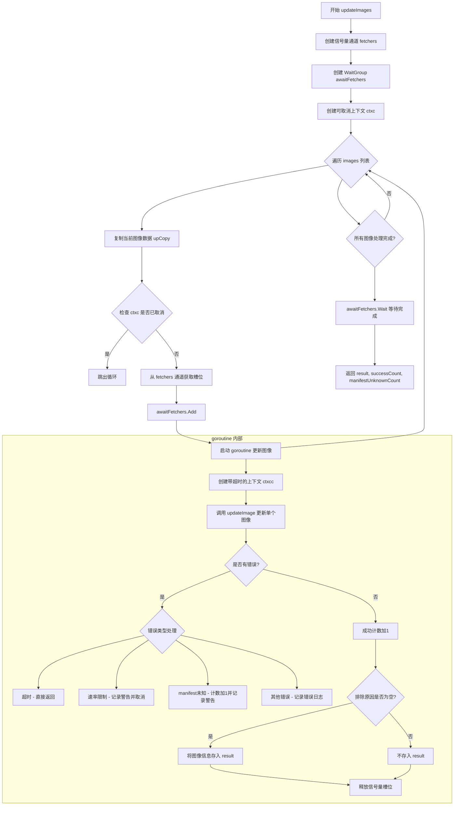

#### 带注释源码

```go
// updateImages refreshes the cache entries for the images passed. It may not succeed for all images.
// It returns the values stored in cache, the number of images it succeeded for and the number
// of images whose manifest wasn't found in the registry.
func (c *repoCacheManager) updateImages(ctx context.Context, images []imageToUpdate) (map[string]image.Info, int, int) {
	// The upper bound for concurrent fetches against a single host is
	// w.Burst, so limit the number of fetching goroutines to that.
	// 创建带缓冲的信号量通道，限制并发数量为 burst 值
	fetchers := make(chan struct{}, c.burst)
	// WaitGroup 用于等待所有 goroutine 完成
	awaitFetchers := &sync.WaitGroup{}

	// 创建可取消的上下文，用于在发生速率限制时中止所有 goroutine
	ctxc, cancel := context.WithCancel(ctx)
	defer cancel()

	// 初始化计数器
	var successCount int                      // 成功更新的图像数量
	var manifestUnknownCount int              // manifest 未找到的图像数量
	var result = map[string]image.Info{}      // 成功缓存的图像结果
	var warnAboutRateLimit sync.Once          // 确保速率限制警告只记录一次

updates:
	// 遍历所有需要更新的图像
	for _, up := range images {
		// to avoid race condition, when accessing it in the go routine
		// 复制当前迭代变量，避免 goroutine 中的竞态条件
		upCopy := up
		select {
		// 检查上下文是否已取消
		case <-ctxc.Done():
			break updates
		// 从信号量通道获取槽位，控制并发数量
		case fetchers <- struct{}{}:
		}
		// 增加 WaitGroup 计数器
		awaitFetchers.Add(1)
		// 启动 goroutine 并发更新图像
		go func() {
			// defer 确保 goroutine 完成后释放信号量槽位并减少 WaitGroup 计数
			defer func() { awaitFetchers.Done(); <-fetchers }()
			
			// 为每个 goroutine 创建独立的超时上下文
			ctxcc, cancel := context.WithTimeout(ctxc, c.clientTimeout)
			defer cancel()
			
			// 调用 updateImage 执行实际的图像更新
			entry, err := c.updateImage(ctxcc, upCopy)
			if err != nil {
				// 判断是否为网络超时错误
				if err, ok := errors.Cause(err).(net.Error); (ok && err.Timeout()) || ctxcc.Err() == context.DeadlineExceeded {
					// This was due to a context timeout, don't bother logging
					return
				}
				switch {
				case strings.Contains(err.Error(), "429"), strings.Contains(err.Error(), "toomanyrequests"):
					// abort the image tags fetching if we've been rate limited
					// 如果发生速率限制，记录警告并取消整个操作
					warnAboutRateLimit.Do(func() {
						c.logger.Log("warn", "aborting image tag fetching due to rate limiting, will try again later")
						cancel()
					})
				case strings.Contains(err.Error(), "manifest unknown"):
					// Registry is corrupted, keep going, this manifest may not be relevant for automatic updates
					// 如果 manifest 不存在，增加计数但继续处理其他图像
					c.Lock()
					manifestUnknownCount++
					c.Unlock()
					c.logger.Log("warn", fmt.Sprintf("manifest for tag %s missing in repository %s", up.ref.Tag, up.ref.Name),
						"impact", "flux will fail to auto-release workloads with matching images, ask the repository administrator to fix the inconsistency")
				default:
					// 其他错误，记录错误日志
					c.logger.Log("err", err, "ref", up.ref)
				}
				return
			}
			// 更新成功计数
			c.Lock()
			successCount++
			// 只有未被排除的图像才加入结果映射
			if entry.ExcludedReason == "" {
				result[upCopy.ref.Tag] = entry.Info
			}
			c.Unlock()
		}()
	}
	// 等待所有 goroutine 完成
	awaitFetchers.Wait()
	// 返回结果映射、成功计数和 manifest 未知计数
	return result, successCount, manifestUnknownCount
}
```


### `repoCacheManager.updateImage`

该方法负责更新单个镜像的缓存条目，从远程仓库获取最新的镜像清单（manifest），根据镜像是否存在、摘要是否变化等条件动态调整缓存刷新时间，并将更新后的镜像信息写入缓存。

参数：

- `ctx`：`context.Context`，调用上下，用于控制请求超时和取消操作
- `update`：`imageToUpdate`，包含待更新镜像的引用（ref）、之前的摘要（previousDigest）和刷新时间（previousRefresh）

返回值：`registry.ImageEntry`，更新后的镜像条目，包含镜像信息和排除原因；若发生错误则返回error

#### 流程图

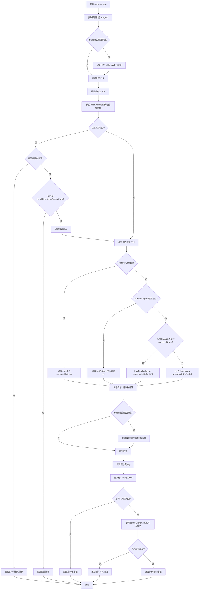

#### 带注释源码

```go
// updateImage 更新单个镜像的缓存条目
// 参数 ctx: 上下文对象，用于控制超时和取消
// 参数 update: 包含镜像引用、之前摘要和刷新时间的结构体
// 返回: 更新后的镜像条目和可能的错误
func (c *repoCacheManager) updateImage(ctx context.Context, update imageToUpdate) (registry.ImageEntry, error) {
	// 从update结构体中提取镜像引用
	imageID := update.ref

	// 如果启用trace模式，记录刷新manifest的日志
	if c.trace {
		c.logger.Log("trace", "refreshing manifest", "ref", imageID, "previous_refresh", update.previousRefresh.String())
	}

	// 创建一个带超时的上下文，超时时间由clientTimeout决定
	ctx, cancel := context.WithTimeout(ctx, c.clientTimeout)
	defer cancel()

	// 调用远程仓库客户端获取镜像清单（manifest）
	entry, err := c.client.Manifest(ctx, imageID.Tag)
	if err != nil {
		// 处理上下文超时错误
		if ctx.Err() == context.DeadlineExceeded {
			return registry.ImageEntry{}, c.clientTimeoutError()
		}
		// 如果不是标签时间戳格式错误，则直接返回错误
		// 这种特定错误会记录但继续处理流程
		if _, ok := err.(*image.LabelTimestampFormatError); !ok {
			return registry.ImageEntry{}, err
		}
		// 记录格式错误日志，但继续处理
		c.logger.Log("err", err, "ref", imageID)
	}

	// 根据不同情况计算新的刷新时间
	refresh := update.previousRefresh
	reason := "" // 用于日志记录的原因描述
	switch {
	// 情况1: 镜像被排除（不可用于自动更新）
	case entry.ExcludedReason != "":
		c.logger.Log("excluded", entry.ExcludedReason, "ref", imageID)
		refresh = excludedRefresh
		reason = "image is excluded"

	// 情况2: 没有先前的缓存条目（首次加载）
	case update.previousDigest == "":
		entry.Info.LastFetched = c.now
		refresh = update.previousRefresh
		reason = "no prior cache entry for image"

	// 情况3: 镜像摘要相同（镜像未更新）
	case entry.Info.Digest == update.previousDigest:
		entry.Info.LastFetched = c.now
		// 翻倍刷新间隔，减少不必要的网络请求
		refresh = clipRefresh(refresh * 2)
		reason = "image digest is same"

	// 情况4: 镜像摘要不同（标签指向了新镜像）
	default: // i.e., not excluded, but the digests differ -> the tag was moved
		entry.Info.LastFetched = c.now
		// 减半刷新间隔，更频繁地检查变化
		refresh = clipRefresh(refresh / 2)
		reason = "image digest is different"
	}

	// 如果启用trace模式，记录缓存操作的详细信息
	if c.trace {
		c.logger.Log("trace", "caching manifest", "ref", imageID, "last_fetched", c.now.Format(time.RFC3339), "refresh", refresh.String(), "reason", reason)
	}

	// 构建缓存键（使用镜像的规范引用）
	key := NewManifestKey(imageID.CanonicalRef())

	// 将镜像条目序列化为JSON格式
	val, err := json.Marshal(entry)
	if err != nil {
		return registry.ImageEntry{}, err
	}

	// 写入缓存，设置过期时间为 now + refresh
	err = c.cacheClient.SetKey(key, c.now.Add(refresh), val)
	if err != nil {
		return registry.ImageEntry{}, err
	}

	// 返回更新后的镜像条目
	return entry, nil
}
```


### `repoCacheManager.clientTimeoutError`

该方法是一个错误生成辅助函数，用于在客户端操作超时时创建格式化的错误信息，包含具体的超时时长。

参数：

- （无参数）

返回值：`error`，返回一个包含客户端超时时长信息的错误对象

#### 流程图

```mermaid
flowchart TD
    A[开始] --> B[执行 fmt.Errorf]
    B --> C[格式化错误信息: client timeout ({clientTimeout}) exceeded]
    C --> D[返回 error 对象]
```

#### 带注释源码

```go
// clientTimeoutError 创建并返回一个客户端超时错误
// 该方法在检测到客户端操作超过配置的 clientTimeout 时被调用
// 参数：
//   - 无参数
// 返回值：
//   - error: 格式化的错误信息，包含具体的超时时长
func (r *repoCacheManager) clientTimeoutError() error {
    // 使用 fmt.Errorf 创建带有超时时长信息的错误消息
    // 错误消息格式: "client timeout (XXX) exceeded"
    // 其中 XXX 为 repoCacheManager.clientTimeout 的值
    return fmt.Errorf("client timeout (%s) exceeded", r.clientTimeout)
}
```


### `repoCacheManager.newRepoCacheManager`

该函数是 `repoCacheManager` 类型的构造函数，用于创建并初始化一个仓库缓存管理器实例。它首先通过客户端工厂为指定的镜像仓库创建客户端，然后返回一个配置完整的 `repoCacheManager` 实例。

参数：

- `now`：`time.Time`，当前时间，用于缓存过期计算
- `repoID`：`image.Name`，镜像仓库的名称标识
- `clientFactory`：`registry.ClientFactory`，用于创建 registry 客户端的工厂接口
- `creds`：`registry.Credentials`，访问镜像仓库所需的凭证信息
- `repoClientTimeout`：`time.Duration`，客户端操作的超时时间
- `burst`：`int`，并发请求的突发限制数量
- `trace`：`bool`，是否启用追踪日志
- `logger`：`log.Logger`，日志记录器实例
- `cacheClient`：`Client`，缓存客户端，用于存储和检索缓存数据

返回值：`*repoCacheManager`，成功时返回指向新创建的 `repoCacheManager` 实例的指针；`error`，如果创建客户端失败则返回错误信息。

#### 流程图

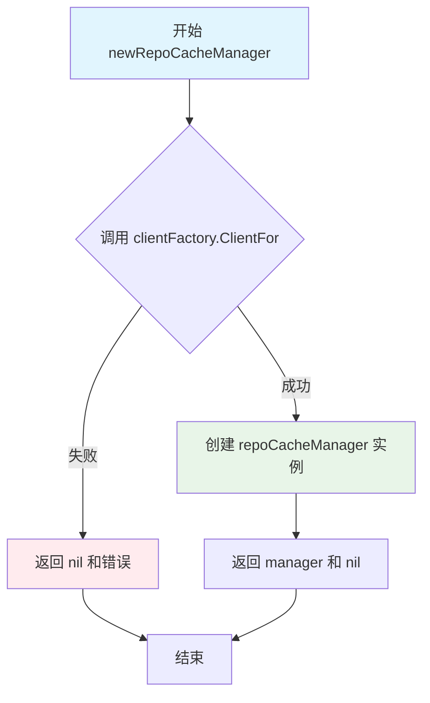

#### 带注释源码

```go
// newRepoCacheManager 创建并初始化一个 repoCacheManager 实例
// 参数说明：
//   - now: 当前时间，用于计算缓存过期时间
//   - repoID: 镜像仓库的名称
//   - clientFactory: 用于创建 registry 客户端的工厂
//   - creds: 访问仓库所需的凭证
//   - repoClientTimeout: 客户端操作超时时间
//   - burst: 控制并发请求的突发数量
//   - trace: 是否启用追踪日志
//   - logger: 日志记录器
//   - cacheClient: 缓存客户端接口
func newRepoCacheManager(now time.Time,
	repoID image.Name, clientFactory registry.ClientFactory, creds registry.Credentials, repoClientTimeout time.Duration,
	burst int, trace bool, logger log.Logger, cacheClient Client) (*repoCacheManager, error) {
	// 使用客户端工厂为指定仓库创建客户端
	client, err := clientFactory.ClientFor(repoID.CanonicalName(), creds)
	// 如果创建客户端失败，直接返回错误
	if err != nil {
		return nil, err
	}
	// 构造 repoCacheManager 实例
	manager := &repoCacheManager{
		now:           now,                      // 当前时间
		repoID:        repoID,                   // 仓库标识
		client:        client,                   // registry 客户端
		clientTimeout: repoClientTimeout,        // 客户端超时时间
		burst:         burst,                    // 并发突发限制
		trace:         trace,                    // 追踪标志
		logger:        logger,                   // 日志记录器
		cacheClient:   cacheClient,               // 缓存客户端
	}
	return manager, nil
}
```


### `repoCacheManager.fetchRepository`

该方法是 `repoCacheManager` 类的成员方法，用于从缓存中获取仓库（Repository）的镜像信息。它通过构建缓存键，从缓存客户端检索数据，并将 JSON 格式的字节数据反序列化为 `ImageRepository` 结构体返回。

参数：  
无参数

返回值：  
- `ImageRepository`：从缓存中获取的镜像仓库信息，如果发生错误则返回空结构
- `error`：如果在获取缓存或反序列化过程中发生错误，则返回该错误

#### 流程图

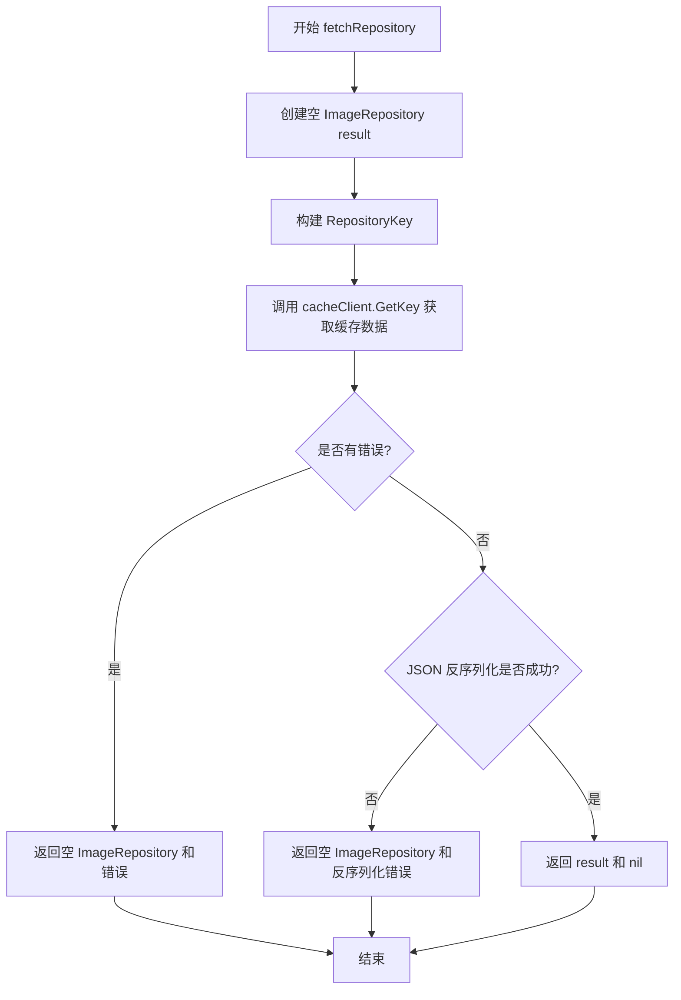

#### 带注释源码

```go
// fetchRepository 从缓存中获取仓库的镜像信息
// 返回值：
//   - ImageRepository: 从缓存中获取的镜像仓库数据
//   - error: 获取或反序列化过程中发生的错误
func (c *repoCacheManager) fetchRepository() (ImageRepository, error) {
    // 1. 声明一个空的 ImageRepository 用于存储结果
    var result ImageRepository
    
    // 2. 使用仓库ID的规范名称创建缓存键
    repoKey := NewRepositoryKey(c.repoID.CanonicalName())
    
    // 3. 从缓存客户端获取键对应的值
    //    返回：缓存的字节数据、过期时间（此处忽略）、以及可能的错误
    bytes, _, err := c.cacheClient.GetKey(repoKey)
    
    // 4. 如果获取缓存失败，直接返回空结果和错误
    if err != nil {
        return ImageRepository{}, err
    }
    
    // 5. 将缓存的 JSON 字节数据反序列化为 ImageRepository 结构
    if err = json.Unmarshal(bytes, &result); err != nil {
        return ImageRepository{}, err
    }
    
    // 6. 成功获取并反序列化后，返回结果
    return result, nil
}
```


### `repoCacheManager.getTags`

获取镜像仓库的所有标签（Tags）

参数：

- `ctx`：`context.Context`，调用上下文，用于传递超时和取消信号

返回值：`([]string, error)`，返回镜像仓库的标签列表，如果发生错误则返回错误信息

#### 流程图

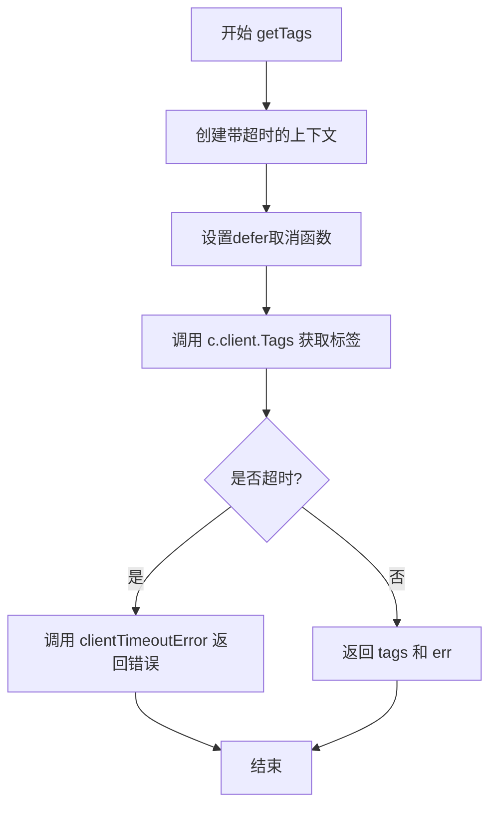

#### 带注释源码

```go
// getTags 获取镜像仓库的所有标签
// 参数 ctx: 上下文对象，用于控制超时和取消操作
// 返回值: 标签字符串切片和可能发生的错误
func (c *repoCacheManager) getTags(ctx context.Context) ([]string, error) {
	// 使用客户端超时时间创建带超时的上下文
	// 确保请求不会无限期等待
	ctx, cancel := context.WithTimeout(ctx, c.clientTimeout)
	
	// defer 确保函数返回时取消上下文，释放资源
	defer cancel()
	
	// 调用客户端的 Tags 方法获取镜像仓库的所有标签
	tags, err := c.client.Tags(ctx)
	
	// 检查是否因为超时导致失败
	// 如果是，则返回客户端超时错误
	if ctx.Err() == context.DeadlineExceeded {
		return nil, c.clientTimeoutError()
	}
	
	// 返回获取到的标签和可能发生的错误
	return tags, err
}
```


### `repoCacheManager.storeRepository`

该方法用于将镜像仓库对象序列化并存储到缓存中，通过为仓库数据设置过期时间来实现缓存更新策略。

参数：

- `repo`：`ImageRepository`，要存储的镜像仓库对象

返回值：`error`，如果序列化或存储过程中发生错误则返回错误，否则返回 nil

#### 流程图

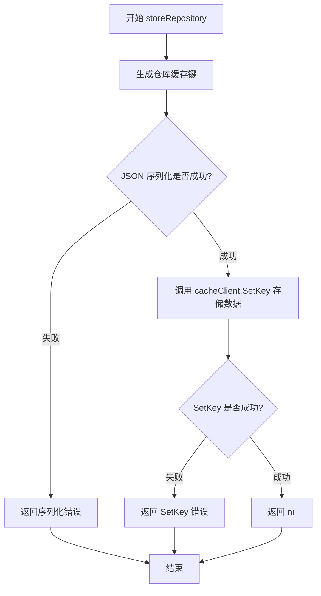

#### 带注释源码

```go
// storeRepository 将仓库信息存储到缓存中
func (c *repoCacheManager) storeRepository(repo ImageRepository) error {
	// 使用仓库的规范名称创建缓存键
	repoKey := NewRepositoryKey(c.repoID.CanonicalName())
	
	// 将 ImageRepository 结构体序列化为 JSON 字节数组
	bytes, err := json.Marshal(repo)
	if err != nil {
		// 序列化失败时返回错误
		return err
	}
	
	// 使用当前时间加上刷新间隔作为过期时间，调用缓存客户端设置键值
	return c.cacheClient.SetKey(repoKey, c.now.Add(repoRefresh), bytes)
}
```


### `repoCacheManager.fetchImages`

该方法从缓存中获取与给定标签列表对应的镜像信息，区分已缓存的镜像、需要因缓存过期而刷新的镜像以及缓存缺失的镜像，并返回这些镜像的分类结果供后续处理。

参数：

- `tags`：`[]string`，要获取的镜像标签列表

返回值：

- `fetchImagesResult`，包含已找到的镜像映射、需要更新的镜像列表、因缓存过期而刷新的数量、因缓存缺失而需刷新的数量
- `error`，处理过程中的错误信息，例如空标签错误

#### 流程图

```mermaid
flowchart TD
    A[开始 fetchImages] --> B[初始化 images map 和 toUpdate slice]
    B --> C[初始化 missing 和 refresh 计数器]
    C --> D{遍历 tags 列表}
    D -->|tag 为空| E[返回错误: 空标签]
    D -->|tag 非空| F[构建 image.Ref 和缓存 key]
    F --> G[调用 cacheClient.GetKey 获取缓存]
    G --> H{缓存错误判断}
    H -->|ErrNotCached| I[missing++, 添加到 toUpdate initialRefresh]
    H -->|其他错误| J[记录警告日志]
    J --> I
    H -->|无错误| K{bytes 长度是否为 0}
    K -->|是| L[missing++, 添加到 toUpdate initialRefresh]
    K -->|否| M[json.Unmarshal 解析 ImageEntry]
    M --> N{解析是否成功}
    N -->|失败| D
    N -->|成功| O{trace 模式开启?}
    O -->|是| P[记录 trace 日志]
    O -->|否| Q{ExcludedReason 是否为空}
    Q -->|是| R{当前时间是否超过 deadline?}
    R -->|是| S[计算 previousRefresh, 添加到 toUpdate, refresh++]
    R -->|否| T[images[tag] = entry.Info]
    Q -->|否| U{当前时间是否超过 deadline?}
    U -->|是| V[添加 toUpdate excludedRefresh, refresh++]
    U -->|否| D
    S --> D
    T --> D
    V --> D
    I --> D
    L --> D
    P --> Q
    D --> W[构建 fetchImagesResult]
    W --> X[返回 result, nil]
```

#### 带注释源码

```go
// fetchImages attempts to fetch the images with the provided tags from the cache.
// It returns the images found, those which require updating and details about
// why they need to be updated.
func (c *repoCacheManager) fetchImages(tags []string) (fetchImagesResult, error) {
	// 用于存储从缓存中找到的镜像信息，key 为 tag，value 为 image.Info
	images := map[string]image.Info{}

	// 创建一个列表，用于记录需要更新的镜像
	var toUpdate []imageToUpdate

	// 计数器：记录缺失和需要刷新的镜像数量
	var missing, refresh int

	// 遍历每个 tag
	for _, tag := range tags {
		// 检查 tag 是否为空，空标签属于非法输入
		if tag == "" {
			return fetchImagesResult{}, fmt.Errorf("empty tag in fetched tags")
		}

		// 根据 tag 构建镜像引用对象
		newID := c.repoID.ToRef(tag)
		// 构建缓存 key（用于 memcached 等缓存系统）
		key := NewManifestKey(newID.CanonicalRef())
		// 从缓存客户端获取数据，返回 bytes 数据和过期时间 deadline
		bytes, deadline, err := c.cacheClient.GetKey(key)

		// 错误处理分支：包括缓存未命中和各种错误情况
		switch {
		case err != nil:
			// 除了 ErrNotCached 之外的其他错误需要记录警告日志
			if err != ErrNotCached {
				c.logger.Log("warning", "error from cache", "err", err, "ref", newID)
			}
			// 标记为缺失，添加到待更新列表，使用 initialRefresh 策略
			missing++
			toUpdate = append(toUpdate, imageToUpdate{ref: newID, previousRefresh: initialRefresh})

		// 空字节数组情况：可能是缓存损坏或异常
		case len(bytes) == 0:
			c.logger.Log("warning", "empty result from cache", "ref", newID)
			missing++
			toUpdate = append(toUpdate, imageToUpdate{ref: newID, previousRefresh: initialRefresh})

		// 成功从缓存获取到数据
		default:
			// 尝试解析 JSON 为 registry.ImageEntry 结构
			var entry registry.ImageEntry
			if err := json.Unmarshal(bytes, &entry); err == nil {
				// 如果开启了 trace 模式，记录缓存命中的详细信息
				if c.trace {
					c.logger.Log("trace", "found cached manifest", "ref", newID, "last_fetched", entry.LastFetched.Format(time.RFC3339), "deadline", deadline.Format(time.RFC3339))
				}

				// 根据排除原因（ExcludedReason）分别处理
				if entry.ExcludedReason == "" {
					// 正常镜像：添加到结果映射
					images[tag] = entry.Info
					// 检查当前时间是否超过缓存 deadline（过期）
					if c.now.After(deadline) {
						// 计算上次刷新间隔，作为本次刷新间隔的参考
						previousRefresh := minRefresh
						lastFetched := entry.Info.LastFetched
						if !lastFetched.IsZero() {
							previousRefresh = deadline.Sub(lastFetched)
						}
						// 添加到待更新列表，包含之前摘要信息用于优化刷新策略
						toUpdate = append(toUpdate, imageToUpdate{ref: newID, previousRefresh: previousRefresh, previousDigest: entry.Info.Digest})
						refresh++
					}
				} else {
					// 被排除的镜像：仅记录 trace 日志
					if c.trace {
						c.logger.Log("trace", "excluded in cache", "ref", newID, "reason", entry.ExcludedReason)
					}
					// 如果已过期，仍需刷新但使用 excludedRefresh 策略
					if c.now.After(deadline) {
						toUpdate = append(toUpdate, imageToUpdate{ref: newID, previousRefresh: excludedRefresh})
						refresh++
					}
				}
			}
		}
	}

	// 构建返回结果结构体，包含所有分类信息
	result := fetchImagesResult{
		imagesFound:                images,
		imagesToUpdate:             toUpdate,
		imagesToUpdateRefreshCount: refresh,
		imagesToUpdateMissingCount: missing,
	}

	return result, nil
}
```


### `repoCacheManager.updateImages`

该方法负责并发刷新缓存中多个镜像条目的manifest信息，通过限制并发数（burst）避免对registry造成过大压力，同时处理超时、速率限制和manifest不存在等异常情况，最终返回成功缓存的镜像信息、成功更新数量及manifest未找到数量。

参数：

- `ctx`：`context.Context`，调用上下文，用于控制超时和取消操作
- `images`：`[]imageToUpdate`，需要更新的镜像列表，包含镜像引用、之前的digest和刷新时长

返回值：`map[string]image.Info, int, int`，返回成功缓存的镜像信息映射（key为tag）、成功更新的镜像数量、manifest未找到的镜像数量

#### 流程图

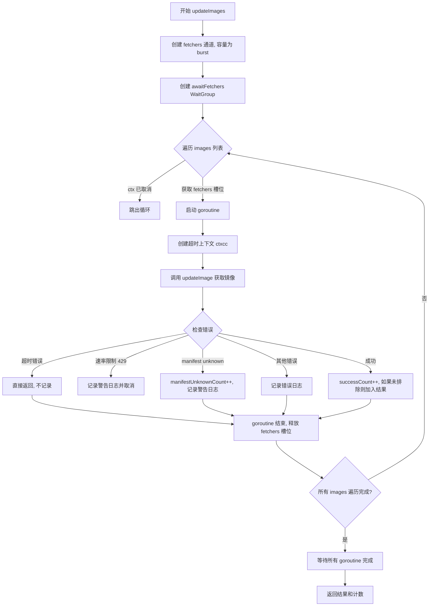

#### 带注释源码

```go
// updateImages 刷新传入镜像列表的缓存条目。不一定所有镜像都能成功更新。
// 返回缓存中的值、成功更新的镜像数量以及manifest未在registry中找到的镜像数量
func (c *repoCacheManager) updateImages(ctx context.Context, images []imageToUpdate) (map[string]image.Info, int, int) {
	// 针对单个主机的并发获取上限是 w.Burst，因此将获取goroutine数量限制在该值以内
	fetchers := make(chan struct{}, c.burst)
	awaitFetchers := &sync.WaitGroup{}

	// 创建可取消的上下文，用于在遇到速率限制时中止所有正在进行的请求
	ctxc, cancel := context.WithCancel(ctx)
	defer cancel()

	var successCount int               // 成功更新的镜像计数
	var manifestUnknownCount int       // manifest未找到的计数
	var result = map[string]image.Info{} // 成功获取的镜像信息结果
	var warnAboutRateLimit sync.Once   // 确保速率限制警告只记录一次
updates:
	// 遍历所有需要更新的镜像
	for _, up := range images {
		// 为避免goroutine中的竞态条件，复制当前要更新的镜像对象
		upCopy := up
		select {
		// 检查上下文是否已取消
		case <-ctxc.Done():
			break updates
		// 获取一个fetchers槽位，控制并发数量
		case fetchers <- struct{}{}:
		}
		// 标记有一个goroutine正在等待完成
		awaitFetchers.Add(1)
		// 启动goroutine并发获取镜像
		go func() {
			// defer中释放fetchers槽位并标记goroutine完成
			defer func() { awaitFetchers.Done(); <-fetchers }()
			
			// 为该镜像创建单独的带超时上下文
			ctxcc, cancel := context.WithTimeout(ctxc, c.clientTimeout)
			defer cancel()
			
			// 调用updateImage获取镜像信息
			entry, err := c.updateImage(ctxcc, upCopy)
			if err != nil {
				// 检查是否为网络超时错误
				if err, ok := errors.Cause(err).(net.Error); (ok && err.Timeout()) || ctxcc.Err() == context.DeadlineExceeded {
					// 这是上下文超时导致的，不需要记录日志
					return
				}
				switch {
				case strings.Contains(err.Error(), "429"), strings.Contains(err.Error(), "toomanyrequests"):
					// 如果遇到速率限制，中止镜像标签获取
					warnAboutRateLimit.Do(func() {
						c.logger.Log("warn", "aborting image tag fetching due to rate limiting, will try again later")
						cancel() // 取消上下文以中止其他goroutine
					})
				case strings.Contains(err.Error(), "manifest unknown"):
					// Registry损坏，继续处理，该manifest可能与自动更新无关
					c.Lock()
					manifestUnknownCount++
					c.Unlock()
					c.logger.Log("warn", fmt.Sprintf("manifest for tag %s missing in repository %s", up.ref.Tag, up.ref.Name),
						"impact", "flux will fail to auto-release workloads with matching images, ask the repository administrator to fix the inconsistency")
				default:
					c.logger.Log("err", err, "ref", up.ref)
				}
				return
			}
			
			// 成功获取镜像，增加计数
			c.Lock()
			successCount++
			// 只有未被排除的镜像才加入结果
			if entry.ExcludedReason == "" {
				result[upCopy.ref.Tag] = entry.Info
			}
			c.Unlock()
		}()
	}
	// 等待所有goroutine完成
	awaitFetchers.Wait()
	return result, successCount, manifestUnknownCount
}
```


### `repoCacheManager.updateImage`

该方法负责从远程仓库获取指定镜像的 Manifest 信息，更新缓存条目，并根据镜像的变更情况动态调整下次刷新时间。

参数：

-  `ctx`：`context.Context`，用于控制请求的超时和取消
-  `update`：`imageToUpdate`，包含待更新镜像的引用（`ref`）、前一次摘要（`previousDigest`）和刷新间隔（`previousRefresh`）

返回值：`registry.ImageEntry`，返回从远程获取并缓存的镜像条目；若发生错误则返回 `error`。

#### 流程图

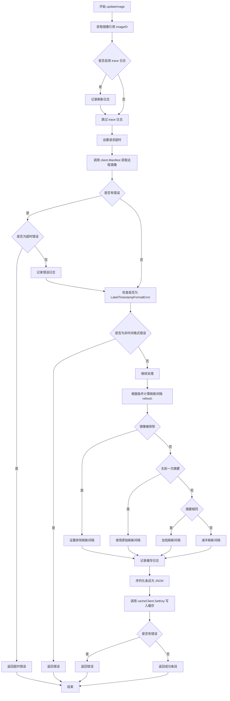

#### 带注释源码

```go
// updateImage 更新指定镜像的缓存条目，从远程仓库获取最新 Manifest
// 参数 ctx 用于控制请求超时，update 包含镜像引用和历史刷新信息
func (c *repoCacheManager) updateImage(ctx context.Context, update imageToUpdate) (registry.ImageEntry, error) {
	// 从 update 结构体中提取镜像引用
	imageID := update.ref

	// 如果启用 trace 模式，记录刷新操作的详细信息
	// 包括镜像引用和前一次刷新间隔
	if c.trace {
		c.logger.Log("trace", "refreshing manifest", "ref", imageID, "previous_refresh", update.previousRefresh.String())
	}

	// 为当前操作设置超时控制，使用 manager 配置的客户端超时时间
	ctx, cancel := context.WithTimeout(ctx, c.clientTimeout)
	// 确保函数返回时取消上下文，释放资源
	defer cancel()

	// 从远程镜像仓库获取指定标签的 Manifest 信息
	entry, err := c.client.Manifest(ctx, imageID.Tag)
	if err != nil {
		// 检查是否为上下文超时错误
		if ctx.Err() == context.DeadlineExceeded {
			// 超时则返回专用的超时错误信息
			return registry.ImageEntry{}, c.clientTimeoutError()
		}
		// 检查错误是否为标签时间戳格式错误
		// 如果不是这类可恢复的错误，则直接返回错误
		if _, ok := err.(*image.LabelTimestampFormatError); !ok {
			return registry.ImageEntry{}, err
		}
		// 若是标签时间戳格式错误，记录日志后继续处理
		c.logger.Log("err", err, "ref", imageID)
	}

	// 根据不同的缓存状态计算新的刷新间隔
	refresh := update.previousRefresh
	reason := ""
	switch {
	// 情况1：镜像被排除（不符合自动更新条件）
	case entry.ExcludedReason != "":
		c.logger.Log("excluded", entry.ExcludedReason, "ref", imageID)
		refresh = excludedRefresh
		reason = "image is excluded"
	// 情况2：没有前一次缓存摘要（首次获取）
	case update.previousDigest == "":
		entry.Info.LastFetched = c.now
		refresh = update.previousRefresh
		reason = "no prior cache entry for image"
	// 情况3：镜像摘要未变化（镜像内容未更新）
	case entry.Info.Digest == update.previousDigest:
		entry.Info.LastFetched = c.now
		// 翻倍刷新间隔，减少频繁检查
		refresh = clipRefresh(refresh * 2)
		reason = "image digest is same"
	// 情况4：镜像摘要发生变化（标签指向了新镜像）
	default:
		entry.Info.LastFetched = c.now
		// 减半刷新间隔，更频繁地检查更新
		refresh = clipRefresh(refresh / 2)
		reason = "image digest is different"
	}

	// 如果启用 trace，记录缓存操作的详细信息
	if c.trace {
		c.logger.Log("trace", "caching manifest", "ref", imageID, "last_fetched", c.now.Format(time.RFC3339), "refresh", refresh.String(), "reason", reason)
	}

	// 构建缓存键，使用镜像的规范引用
	key := NewManifestKey(imageID.CanonicalRef())

	// 将镜像条目序列化为 JSON 格式
	val, err := json.Marshal(entry)
	if err != nil {
		return registry.ImageEntry{}, err
	}

	// 计算过期时间：当前时间加上刷新间隔
	// 将结果写入缓存
	err = c.cacheClient.SetKey(key, c.now.Add(refresh), val)
	if err != nil {
		return registry.ImageEntry{}, err
	}

	// 返回更新后的缓存条目
	return entry, nil
}
```


### `repoCacheManager.clientTimeoutError`

该方法是一个错误构造方法，用于生成客户端超时的错误信息。当客户端操作超过指定的超时时间时，会调用此方法返回一个格式化的错误描述。

参数：

- （无参数）

返回值：`error`，返回表示客户端超时的错误信息

#### 流程图

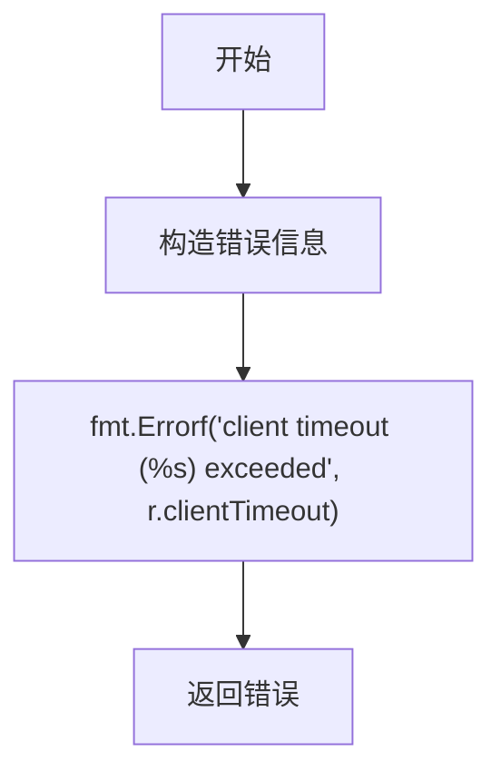

#### 带注释源码

```
// clientTimeoutError returns an error indicating that the client timeout was exceeded.
// It formats the error message using the configured clientTimeout duration.
// 
// Parameters: None
// 
// Returns:
//   error - A formatted error message describing the client timeout
func (r *repoCacheManager) clientTimeoutError() error {
    // 使用 fmt.Errorf 构造错误信息，包含具体的超时时间值
    // 例如: "client timeout (30s) exceeded"
    return fmt.Errorf("client timeout (%s) exceeded", r.clientTimeout)
}
```

## 关键组件


### repoCacheManager

核心缓存管理器类，负责容器镜像仓库的镜像缓存生命周期管理，包括从缓存获取镜像列表、更新过期或缺失的镜像manifest、实现基于指数退避的刷新策略以优化缓存命中率。

### imageToUpdate

表示需要更新的镜像数据结构，包含镜像引用、之前的摘要值和刷新间隔，用于跟踪哪些镜像需要从远程仓库重新拉取。

### fetchImagesResult

获取镜像操作的结果封装，包含缓存中已找到的镜像、需要更新的镜像列表、以及因过期和缺失需要更新的计数。

### 张量索引与惰性加载

代码通过标签（tag）作为索引键惰性加载镜像manifest，只有当缓存miss或过期时才从远程仓库拉取，实现按需加载避免不必要的网络请求。

### 反量化支持

根据镜像的不同状态（缺失、排除、摘要相同、摘要不同）动态计算不同的刷新间隔，支持排除标记的镜像使用特殊刷新策略。

### 量化策略

实现自适应刷新间隔算法：当镜像摘要未变化时指数增长刷新间隔（clipRefresh * 2），当镜像更新时减半间隔（clipRefresh / 2），平衡缓存新鲜度与网络开销。

### 速率限制处理

在并发更新镜像时检测429错误和toomanyrequests响应，自动中止当前批次更新并记录警告，防止触发registry的速率限制。

### 错误恢复机制

对manifest unknown错误采用宽容处理，记录警告但不中断其他镜像的更新流程，体现容错设计。


## 问题及建议


### 已知问题

- **错误处理不一致**：在 `updateImages` 方法中，使用 `sync.Once` 只记录一次速率限制警告，之后的错误会被静默忽略，可能导致重要错误信息丢失
- **并发控制效率低下**：在 `updateImages` 的循环中频繁对 `manifestUnknownCount` 和 `successCount` 进行加锁解锁操作，高并发场景下可能导致锁竞争
- **缓存刷新策略硬编码**：`storeRepository` 使用固定的 `repoRefresh` 周期，没有根据实际使用模式动态调整的能力
- **上下文取消处理不当**：`updateImages` 中使用 `context.WithCancel` 但在速率限制时调用 `cancel()`，这会导致已启动的 goroutine 可能在工作完成前被中断
- **未使用的结构体字段**：`repoCacheManager` 中的 `sync.Mutex` 被嵌入但没有明确命名，导致锁的作用域不清晰，容易误用
- **资源泄露风险**：在 `updateImages` 的 goroutine 中，如果发生错误可能导致某些资源未正确释放
- **缺乏重试机制**：对于临时性错误（如网络超时），没有实现重试逻辑，可能导致缓存更新失败
- **日志级别使用不当**：部分错误使用 `warning` 级别但实际应该使用 `error` 级别，可能导致重要问题被忽略

### 优化建议

- **改进错误处理**：移除 `sync.Once` 限制，为每次速率限制错误记录日志；考虑使用错误通道或回调机制来汇总错误信息
- **优化并发计数**：使用原子操作（`sync/atomic`）替代频繁的锁操作来更新计数器
- **动态缓存策略**：实现自适应缓存刷新机制，根据镜像更新频率动态调整 `repoRefresh` 值
- **改进取消逻辑**：使用独立的信号 channel 来通知 goroutine 停止，而不是直接调用 `cancel()` 中断正在进行的请求
- **添加重试机制**：为临时性错误实现指数退避重试，提高缓存更新的成功率
- **明确锁的使用**：为 `sync.Mutex` 字段添加明确的命名，并审查所有加锁操作确保锁的粒度合理
- **增加监控指标**：添加缓存命中率、更新成功/失败率等关键指标，便于运维监控
- **统一错误处理**：创建统一的错误处理和日志记录函数，确保错误级别和使用方式一致

## 其它


### 设计目标与约束

本模块旨在为Flux CD的镜像仓库提供高效的缓存管理机制，通过缓存镜像清单和仓库信息减少对远程仓库的网络请求，提升系统响应速度并降低API调用成本。核心约束包括：单实例缓存管理器负责单一仓库的缓存操作，缓存键基于镜像的规范名称生成，支持并发更新但需控制并发数量以避免触发仓库的速率限制。

### 错误处理与异常设计

代码采用多层次的错误处理策略。对于缓存未命中和超时错误，采用日志记录但不中断流程；对于速率限制（429错误），立即中止后续标签获取并记录警告；对于清单未知错误，增加计数器并记录警告但不中断其他镜像的处理；对于超时错误，根据上下文判断是否为截止时间超时并选择性地记录日志。所有严重错误均通过返回值传播，调用方负责决定是否重试或向上传递。

### 数据流与状态机

缓存管理器的工作流程分为三个主要阶段：首先是初始化阶段，通过clientFactory创建远程客户端并初始化缓存客户端；其次是查询阶段，依次获取仓库信息和镜像标签，然后从缓存中获取已存在的镜像清单，筛选出需要更新的镜像列表；最后是更新阶段，对需要更新的镜像并行发起远程请求，根据返回结果计算下一次刷新间隔并将新数据写入缓存。镜像的刷新间隔采用指数退避算法，初始为5分钟，成功获取相同digest时翻倍，digest变化时减半。

### 外部依赖与接口契约

模块依赖三个主要外部接口：registry.ClientFactory用于创建与远程仓库通信的客户端；registry.Client提供获取镜像标签和清单的具体实现；cache.Client定义缓存存储的GetKey和SetKey方法。输入参数包括镜像仓库名称、凭证、客户端超时时间、突发限制数和日志记录器。输出结果为镜像信息映射和更新统计。cache.Client需要实现GetKey返回字节数组、截止时间和错误，SetKey接收键、过期时间和值并返回错误。

### 并发控制与线程安全

repoCacheManager通过sync.Mutex保护共享状态的访问，主要包括manifestUnknownCount计数器和result映射。并发更新使用带缓冲的channel（fetchers）限制同时运行的goroutine数量，默认为burst参数指定的值。更新循环中使用select语句监听上下文取消信号，确保能够及时响应超时或外部中断。每个goroutine创建镜像副本（upCopy）以避免循环变量共享导致的竞态条件。

### 缓存策略与过期机制

缓存采用TTL机制管理过期时间，仓库信息和镜像清单分别使用不同的键前缀。刷新间隔根据镜像状态动态调整：初次获取使用initialRefresh（1分钟），被排除的镜像使用excludedRefresh（24小时），成功获取且digest未变时翻倍但上限为24小时，digest变化时减半但下限为1分钟。缓存键使用镜像的规范引用生成，确保不同格式的镜像引用能够正确匹配同一缓存条目。

### 性能考虑与优化点

代码通过批量处理标签列表和并行获取镜像清单提升吞吐量，但burst参数限制了单主机的并发请求数。缓存命中时直接返回存储的Info对象，避免重复解析。超时控制使用context机制，支持调用方取消长时间运行的操作。trace标志用于在开发调试时输出详细的缓存命中率和网络请求日志，生产环境应关闭以减少日志量。当前实现中每次fetchImages都会遍历所有标签，对于大型仓库可能存在优化空间。

### 配置参数说明

newRepoCacheManager函数接收以下配置参数：now用于设置当前时间便于测试；repoID指定目标镜像仓库；clientFactory用于创建远程客户端；creds提供仓库访问凭证；repoClientTimeout设置单个网络请求的超时时间；burst限制并发请求数；trace启用详细日志；cacheClient指定缓存后端实现。这些参数中timeout和burst需要根据目标仓库的API限制合理配置，建议值分别为30秒和3。

### 日志与追踪设计

日志采用go-kit/log框架，支持结构化日志输出。关键操作包括：缓存未命中记录warning级别日志包含错误详情；速率限制时记录warn并中止后续请求；清单未知时记录warn并包含影响说明；成功更新时根据trace标志选择性记录trace级别日志包含上次获取时间和截止时间。所有日志均包含操作上下文（ref、tag等）便于问题排查。

### 安全性考虑

代码不直接处理凭证存储，通过registry.Credentials接口传递认证信息。网络请求使用context超时机制防止资源耗尽。敏感信息（如凭证）不应出现在日志输出中，当前实现仅记录镜像引用和错误信息，符合安全要求。缓存数据包含镜像元信息，需确保缓存后端的访问控制。

### 潜在优化空间

当前实现每次调用fetchImages都会完整遍历所有标签，可考虑引入分页或增量获取机制；缓存键设计未考虑版本兼容性，客户端升级可能导致缓存失效；错误处理中部分场景（如网络波动）未实现自动重试逻辑；burst参数静态配置，可考虑根据运行时错误率动态调整；可添加缓存预热机制在服务启动时主动填充热点数据。

    