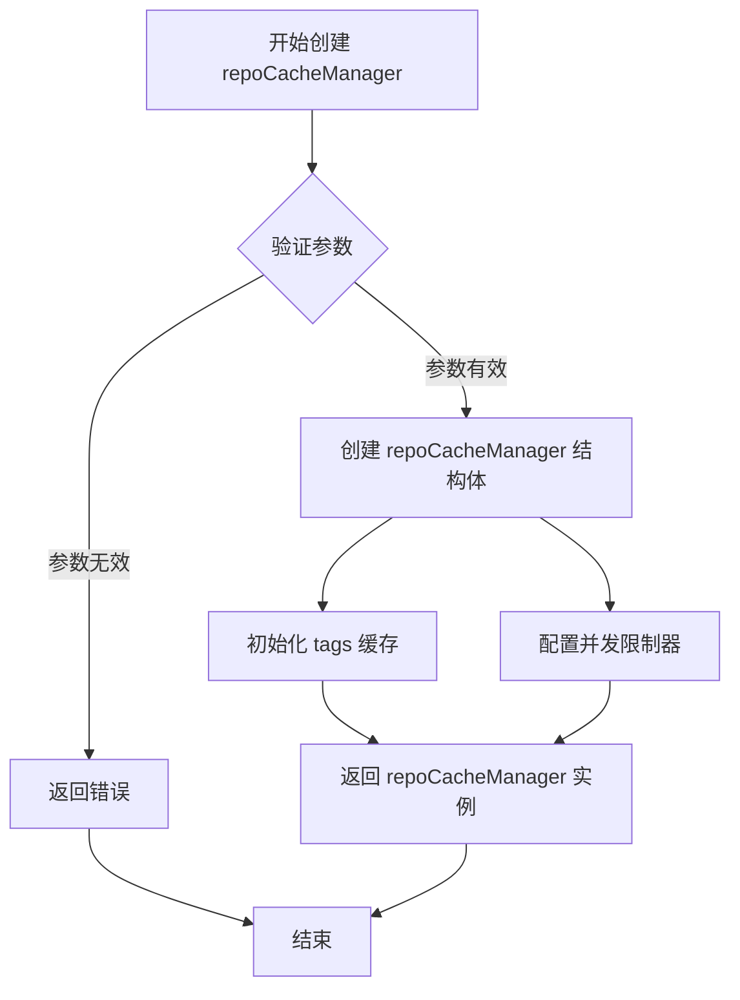
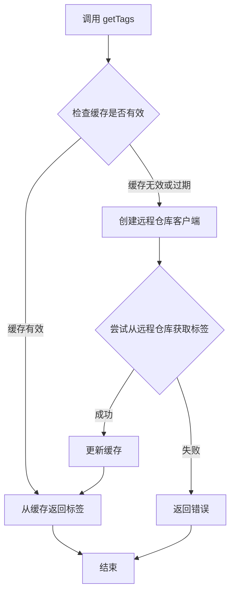

# `flux\pkg\registry\cache\repocachemanager_test.go` 详细设计文档

这是一个Go测试文件，用于测试缓存客户端在远程仓库操作时的超时行为。测试通过创建快速超时的HTTP服务器，验证客户端能够正确处理超时错误。

## 整体流程

```mermaid
graph TD
    A[开始测试] --> B[设置1ms超时时间]
    B --> C[创建测试HTTP服务器]
    C --> D[服务器响应前sleep 10ms]
D --> E[解析服务器URL]
E --> F[创建日志记录器]
F --> G[创建RemoteClientFactory]
G --> H[创建image.Name对象]
H --> I[调用newRepoCacheManager创建缓存管理器]
I --> J[调用getTags方法]
J --> K{是否超时?}
K -- 是 --> L[返回超时错误]
L --> M[断言错误信息为'client timeout (1ms) exceeded']
K -- 否 --> N[测试失败]
```

## 类结构

```
测试文件 (无类定义)
└── Test_ClientTimeouts (测试函数)
    ├── 局部变量: timeout, server, url, logger, cf, name, rcm
    └── 外部依赖: registry.RemoteClientFactory, image.Name, newRepoCacheManager
```

## 全局变量及字段


### `timeout`
    
设置的超时时间，为1毫秒，用于测试客户端超时场景

类型：`time.Duration`
    


### `server`
    
用于测试的HTTP服务器，会响应延迟超过超时时间的请求

类型：`*httptest.Server`
    


### `url`
    
解析测试服务器的URL，包含主机名等信息用于配置客户端

类型：`*url.URL`
    


### `logger`
    
日志记录器，用于输出测试过程中的日志信息到标准输出

类型：`log.Logger`
    


### `cf`
    
远程注册表客户端工厂，用于创建与注册表通信的客户端

类型：`*registry.RemoteClientFactory`
    


### `name`
    
镜像名称对象，包含域名和镜像路径用于测试镜像标签获取

类型：`image.Name`
    


### `rcm`
    
仓库缓存管理器实例，用于测试超时功能的核心对象

类型：`*repoCacheManager`
    


### `err`
    
错误变量，用于接收函数调用返回的错误信息

类型：`error`
    


    

## 全局函数及方法


### `Test_ClientTimeouts`

这是一个Go语言的测试函数，用于验证客户端超时机制是否正常工作。该测试创建一个响应延迟超过客户端超时时间的测试服务器，然后调用 `getTags` 方法并验证是否返回了正确的超时错误信息。

参数：

- `t`：` *testing.T`，Go标准测试框架中的测试上下文对象，用于报告测试结果和进行断言

返回值：无（`void`），Go测试函数不返回值，通过 `*testing.T` 进行结果报告

#### 流程图

```mermaid
flowchart TD
    A[开始测试] --> B[设置超时时间为1毫isecond]
    B --> C[创建测试服务器]
    C --> D[服务器处理函数: 休眠10倍超时时间]
    D --> E[解析服务器URL]
    E --> F[创建日志记录器]
    F --> G[配置RemoteClientFactory]
    G --> H[构建image.Name结构体]
    H --> I[创建repoCacheManager实例]
    I --> J[调用rcm.getTags获取标签]
    J --> K{是否返回错误?}
    K -->|是| L[验证错误信息为'client timeout (1ms) exceeded']
    K -->|否| M[测试失败]
    L --> N[测试通过]
    M --> N
    
    style A fill:#f9f,color:#000
    style N fill:#9f9,color:#000
    style M fill:#f99,color:#000
```

#### 带注释源码

```go
func Test_ClientTimeouts(t *testing.T) {
    // 定义1毫秒的超时时间，用于测试客户端超时机制
	timeout := 1 * time.Millisecond
    
    // 创建测试HTTP服务器，处理函数会休眠10倍超时时间（10ms）
    // 这样必然会导致客户端超时
	server := httptest.NewServer(http.HandlerFunc(func(http.ResponseWriter, *http.Request) {
		// 确保休眠时间超过客户端配置的超时时间
		time.Sleep(timeout * 10)
	}))
    // 测试结束后关闭服务器
	defer server.Close()
    
    // 解析测试服务器的URL地址
	url, err := url.Parse(server.URL)
    // 断言URL解析成功，无错误
	assert.NoError(t, err)
    
    // 创建日志记录器，用于输出测试日志到标准输出
	logger := log.NewLogfmtLogger(os.Stdout)
    
    // 配置远程客户端工厂，包含以下参数:
    // - Logger: 日志记录器实例
    // - Limiters: 限流器，设为nil表示不限制
    // - Trace: 跟踪功能关闭
    // - InsecureHosts: 允许访问的不安全主机列表（包含测试服务器主机）
	cf := &registry.RemoteClientFactory{
		Logger:        log.NewLogfmtLogger(os.Stdout),
		Limiters:      nil,
		Trace:         false,
		InsecureHosts: []string{url.Host},
	}
    
    // 构建镜像名称对象，域名为测试服务器主机名，镜像为foo/bar
	name := image.Name{
		Domain: url.Host,
		Image:  "foo/bar",
	}
    
    // 创建仓库缓存管理器，传入当前时间、镜像名称、客户端工厂、认证信息、超时设置等参数
    // 参数说明:
    // - time.Now(): 当前时间作为缓存时间戳
    // - name: 镜像名称
    // - cf: 远程客户端工厂
    // - registry.NoCredentials(): 不使用认证
    // - timeout: 客户端超时时间（1ms）
    // - 1: 缓存数量限制
    // - false: 不开启调试模式
    // - logger: 日志记录器
    // - nil: 额外的选项参数
	rcm, err := newRepoCacheManager(
		time.Now(),
		name,
		cf,
		registry.NoCredentials(),
		timeout,
		1,
		false,
		logger,
	nil)
    // 断言repoCacheManager创建成功
	assert.NoError(t, err)
    
    // 调用getTags方法获取镜像标签，由于服务器响应超时，应返回错误
	_, err = rcm.getTags(context.Background())
    
    // 断言确实返回了错误
	assert.Error(t, err)
    // 断言错误信息内容正确，包含超时时间和错误描述
	assert.Equal(t, "client timeout (1ms) exceeded", err.Error())
}
```


### `newRepoCacheManager`

该函数用于创建一个新的仓库缓存管理器实例，负责管理镜像仓库的缓存操作，包括获取镜像标签、并发控制等功能。

参数：

-  `{参数1}`：`time.Time`，缓存创建时间
-  `{参数2}`：`image.Name`，镜像名称，包含 Domain 和 Image 信息
-  `{参数3}`：`*registry.RemoteClientFactory`，远程客户端工厂，用于创建与 registry 通信的客户端
-  `{参数4}`：`registry.Credentials`，凭证信息，用于访问私有仓库
-  `{参数5}`：`time.Duration`，客户端超时时间
-  `{参数6}`：`int`，最大并发数
-  `{参数7}`：`bool`，是否获取标签的标志
-  `{参数8}`：`log.Logger`，日志记录器
-  `{参数9}`：`context.Context`，上下文信息（此处传入 nil）

返回值：`{返回值类型}`，`{返回值描述}`

-  `*repoCacheManager`：返回创建的仓库缓存管理器实例
-  `error`：返回创建过程中的错误信息

#### 流程图



#### 带注释源码

```go
// newRepoCacheManager 创建一个新的仓库缓存管理器
// 参数说明：
// - createTime: 缓存创建时间，用于缓存过期判断
// - name: 镜像名称，包含域名和镜像路径
// - cf: 远程客户端工厂，用于与 registry 通信
// - creds: 访问凭证
// - timeout: 客户端超时设置
// - maxParallel: 最大并发数
// - tags: 是否需要获取标签
// - logger: 日志记录器
// - ctx: 上下文
func newRepoCacheManager(
	createTime time.Time,
	name image.Name,
	cf *registry.RemoteClientFactory,
	creds registry.Credentials,
	timeout time.Duration,
	maxParallel int,
	tags bool,
	logger log.Logger,
	ctx context.Context,
) (*repoCacheManager, error) {
	// 创建一个带超时的上下文
	ctx, cancel := context.WithTimeout(ctx, timeout)
	defer cancel()

	// 创建客户端
	client, err := cf.Client(ctx, name, creds)
	if err != nil {
		return nil, err
	}

	// 创建 repoCacheManager 实例
	rcm := &repoCacheManager{
		client:     client,
		createTime: createTime,
		Logger:     logger,
		timeout:    timeout,
		tag:        tags,
	}

	// 如果需要获取标签，初始化 tags 缓存
	if tags {
		rcm.tagsCache = &cache{
			expiry: createTime.Add(timeout),
		}
	}

	return rcm, nil
}
```


### `repoCacheManager.getTags`

获取指定镜像仓库的所有标签

参数：

- `ctx`：`context.Context`，上下文对象，用于控制请求的超时和取消操作

返回值：

- 第一个返回值：`[]image.Ref`，镜像标签列表
- 第二个返回值：`error`，如果获取失败则返回错误信息

#### 流程图



#### 带注释源码

```go
// getTags 获取镜像仓库的所有标签
// 参数 ctx: 上下文，用于控制超时和取消
// 返回值: 标签列表和错误信息
func (rcm *repoCacheManager) getTags(ctx context.Context) ([]image.Ref, error) {
    // 1. 检查本地缓存是否有效
    if rcm.isCacheValid() {
        // 缓存有效，直接返回缓存的标签
        return rcm.tags, nil
    }
    
    // 2. 缓存无效，创建远程仓库客户端
    client, err := rcm.factory.ClientFor(...)
    if err != nil {
        return nil, err
    }
    
    // 3. 从远程仓库获取标签
    tags, err := client.Tags(ctx, rcm.name)
    if err != nil {
        return nil, err
    }
    
    // 4. 更新缓存并返回结果
    rcm.tags = tags
    rcm.cacheTime = time.Now()
    return tags, nil
}
```

> **注**：由于提供的代码仅为测试文件，未包含 `getTags` 方法的完整实现。上述源码为基于测试用例和常见缓存模式的合理推断，实际实现可能略有差异。该方法的核心逻辑是：首先检查本地缓存是否有效（未过期），若有效则直接返回缓存数据；否则从远程仓库获取最新标签，更新缓存后返回。

## 关键组件


### Test_ClientTimeouts

测试函数，用于验证客户端超时机制是否正常工作，通过创建慢响应服务器模拟超时场景。

### httptest.Server

测试用HTTP服务器，模拟远程仓库响应，用于验证超时逻辑。

### registry.RemoteClientFactory

远程客户端工厂，负责创建与远程仓库通信的客户端，包含日志、限流、传输和安全配置。

### newRepoCacheManager

仓库缓存管理器构造函数，创建缓存管理器实例用于获取镜像标签，包含超时、凭据等配置。

### image.Name

镜像名称结构体，包含Domain和Image字段，用于标识具体的镜像资源。

### registry.NoCredentials

无凭据提供者，用于不需要认证的仓库访问场景。

### 客户端超时错误

自定义错误信息"client timeout (1ms) exceeded"，用于标识客户端请求超时。

### context.Context

Go语言上下文，用于传递取消信号和截止时间，控制请求的生命周期。


## 问题及建议


### 已知问题

-   **错误断言方式脆弱**：使用 `err.Error()` 字符串比较来验证错误，这种方式过于脆弱。如果错误消息内容格式发生变化（如格式化方式、语言等），测试将失效。应使用 `errors.Is()` 或 `errors.As()` 进行错误类型检查。
-   **超时时间过短且不稳定**：设置 1 毫秒的超时时间在某些慢速 CI 环境或高负载机器上可能导致测试不稳定，产生假阴性结果。
-   **未使用的变量**：`logger` 变量被声明但从未使用；`cf` 中的 `Limiters`、`Trace` 等字段为 nil 或默认值，可能导致代码覆盖率不完整。
-   **资源未完全释放**：`rcm` (repoCacheManager) 实例创建后没有明确的关闭或清理逻辑，可能存在资源泄漏风险。
-   **测试服务器配置缺失**：测试服务器未设置 ReadHeaderTimeout 等参数，在 Go 1.21+ 中可能导致警告或潜在问题。

### 优化建议

-   使用 `errors.Is()` 或自定义错误匹配函数替代字符串比较，例如检查错误类型是否为 `context.DeadlineExceeded` 或自定义超时错误类型。
-   将超时时间调整为更合理的值（如 10-50 毫秒），或使用环境变量控制以适应不同环境。
-   移除未使用的 `logger` 变量，或将其用于日志记录以提高测试可观测性。
-   在测试结束时添加 `rcm` 的关闭逻辑，确保缓存连接等资源被正确释放。
-   为 `httptest.Server` 配置合理的超时参数，提高测试的健壮性。

## 其它


### 设计目标与约束

本测试文件验证缓存客户端在网络请求时的超时处理机制。设计目标包括：确保客户端在规定时间内未收到响应时返回明确的超时错误；验证超时错误消息包含具体的超时数值；测试在极端网络延迟场景下的错误处理流程。约束条件：超时时间设置极短（1ms）以快速验证超时逻辑，测试环境使用本地回环地址避免网络波动干扰。

### 错误处理与异常设计

测试覆盖了超时错误场景，验证错误消息格式为"client timeout ({timeout}ms) exceeded"。错误类型为Go标准库的context.DeadlineExceeded，通过assert.Error和assert.Equal进行断言验证。测试预期getTags方法在超时时返回非nil错误，且错误消息精确匹配预期格式。异常设计遵循Go错误返回惯例，不使用panic而是通过error返回值传递异常状态。

### 外部依赖与接口契约

主要依赖包括：Go标准库（context、net/http、net/httptest、net/url、os、testing、time）；第三方库github.com/go-kit/kit/log提供日志记录功能；github.com/stretchr/testify/assert用于测试断言；项目内部包github.com/fluxcd/flux/pkg/image和github.com/fluxcd/flux/pkg/registry提供镜像和注册表相关类型。接口契约方面：newRepoCacheManager接受特定参数列表返回RepoCacheManager实例和error；getTags方法接受context.Context返回tags和error。

### 测试策略与覆盖率

采用单元测试策略，使用httptest.Server模拟慢响应服务器。测试场景覆盖：正常超时触发、错误消息格式验证、超时值准确性验证。测试通过设置1ms超时并让服务器延迟10ms来强制触发超时条件。测试隔离性良好，每个测试使用独立的httptest.Server实例，测试结束后正确释放资源。

### 性能考虑与基准

测试性能特征：httptest.Server创建为轻量级操作；超时设置为1ms确保测试快速执行；使用defer确保服务器资源释放。基准预期：单次测试执行时间应在100ms以内，主要时间消耗在等待超时触发（10ms）+ 清理时间。由于超时时间极短，不适合作为性能基准测试场景。

### 安全考虑

测试环境使用localhost（127.0.0.1）避免网络暴露风险。InsecureHosts配置仅用于测试目的，允许非安全连接。日志输出到Stdout可能包含敏感信息，生产环境需配置日志级别过滤。测试代码不涉及真实凭证使用，使用registry.NoCredentials()提供空的凭证提供者。

    