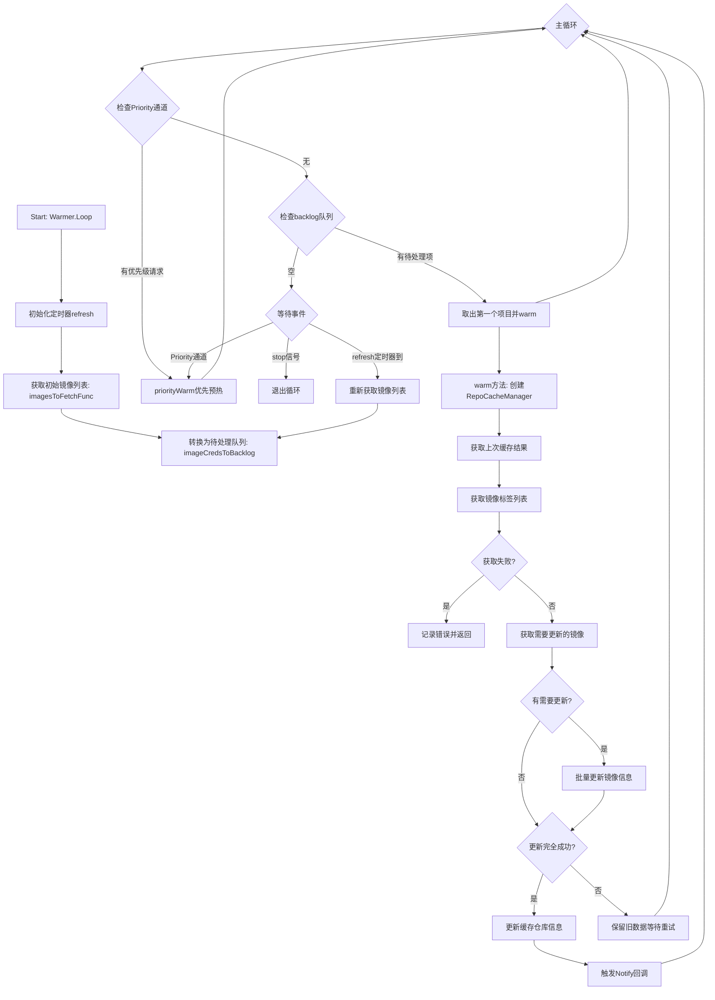
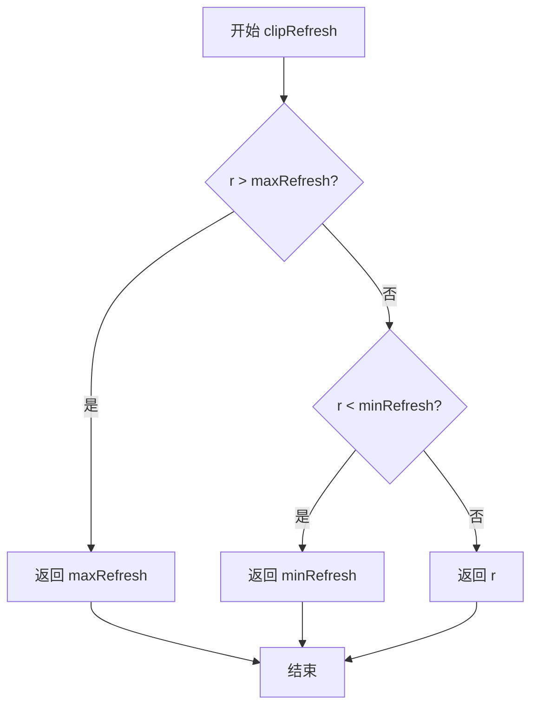
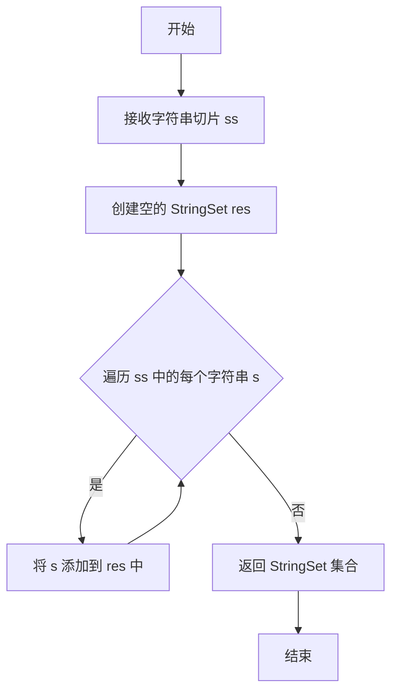
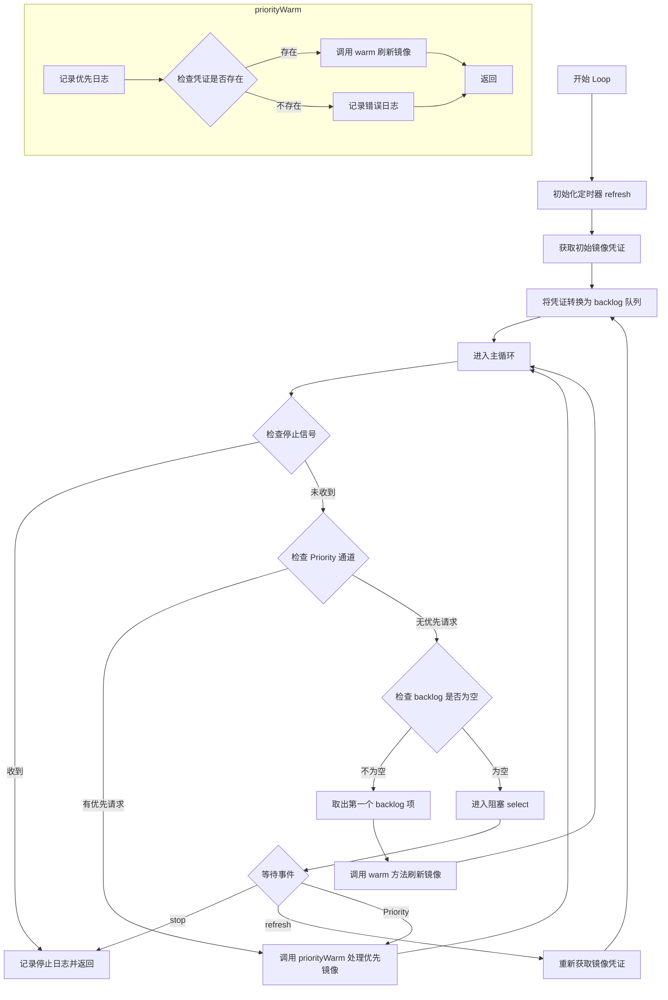
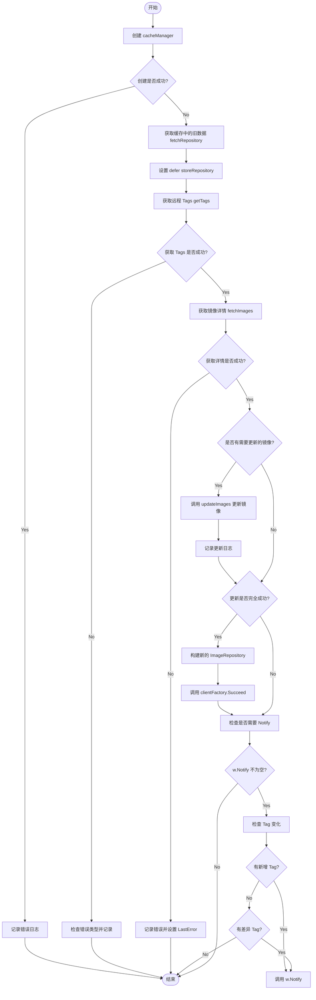
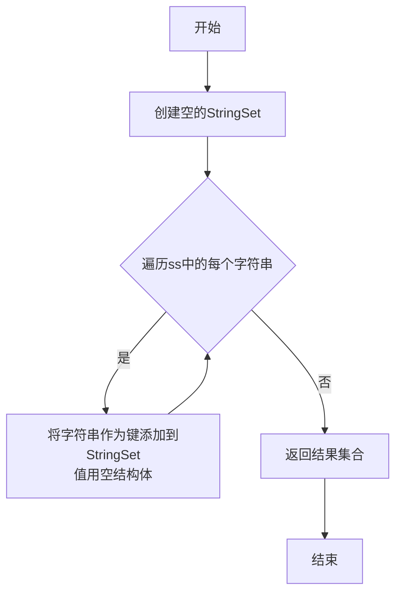
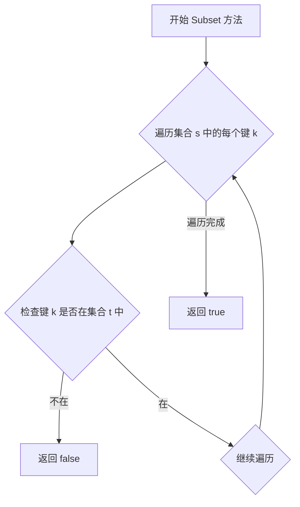

# `flux\pkg\registry\cache\warming.go` 详细设计文档

这是一个容器镜像缓存预热组件，通过定期从远程容器仓库（如Docker Hub、 Quay.io等）获取最新的镜像元数据（标签、摘要信息等），并维护本地缓存，以提升FluxCD在镜像更新检测和依赖解析时的性能。Warmer使用优先级队列机制，优先处理集群中正在使用的镜像，并通过可配置的burst参数控制并发预热速度。

## 整体流程



## 类结构

```
cache (包)
├── 常量定义
│   ├── askForNewImagesInterval
│   ├── initialRefresh
│   ├── minRefresh
│   ├── maxRefresh
│   ├── excludedRefresh
│   └── repoRefresh
├── 全局函数
│   ├── clipRefresh
│   └── imageCredsToBacklog
├── 类型定义
│   ├── Warmer (缓存预热器核心类)
│   ├── backlogItem (待处理项目)
│   └── StringSet (字符串集合工具类)
```

## 全局变量及字段


### `askForNewImagesInterval`
    
定期请求新镜像的时间间隔，默认为1分钟

类型：`time.Duration`
    


### `initialRefresh`
    
首次发现镜像时的初始刷新时间，设置为1小时

类型：`time.Duration`
    


### `minRefresh`
    
镜像标签刷新的最小时间间隔，设置为5分钟，防止过快刷新

类型：`time.Duration`
    


### `maxRefresh`
    
镜像刷新的最大时间上限，设置为7天

类型：`time.Duration`
    


### `excludedRefresh`
    
排除的镜像刷新时间间隔，设置为24小时

类型：`time.Duration`
    


### `repoRefresh`
    
仓库整体刷新时间间隔，设置为最大刷新时间，用于减少垃圾回收概率

类型：`time.Duration`
    


### `Warmer.clientFactory`
    
用于创建仓库客户端的工厂

类型：`registry.ClientFactory`
    


### `Warmer.cache`
    
本地缓存客户端接口

类型：`Client`
    


### `Warmer.burst`
    
并发预热burst数量，控制并发速度

类型：`int`
    


### `Warmer.Trace`
    
是否开启详细追踪日志

类型：`bool`
    


### `Warmer.Priority`
    
优先级通道，接收需要优先处理的镜像名

类型：`chan image.Name`
    


### `Warmer.Notify`
    
缓存更新后的回调函数

类型：`func()`
    


### `backlogItem.Name`
    
镜像名称

类型：`image.Name`
    


### `backlogItem.Credentials`
    
镜像仓库认证凭证

类型：`registry.Credentials`
    
    

## 全局函数及方法


### `clipRefresh`

该函数用于将任意的刷新时间间隔限制在最小值和最大值之间，确保缓存刷新间隔不会过短（浪费资源）也不会过长（导致数据过时），是缓存刷新策略的核心边界控制函数。

参数：

- `r`：`time.Duration`，输入的刷新时间间隔

返回值：`time.Duration`，限制后的刷新时间间隔

#### 流程图



#### 带注释源码

```go
// clipRefresh 将刷新时间间隔限制在 [minRefresh, maxRefresh] 范围内
// 参数 r: 输入的刷新时间间隔
// 返回值: 限制后的刷新时间间隔
func clipRefresh(r time.Duration) time.Duration {
	// 如果传入的间隔大于最大允许值，返回最大值
	// maxRefresh = 7 * 24 * time.Hour (7天)
	if r > maxRefresh {
		return maxRefresh
	}
	// 如果传入的间隔小于最小允许值，返回最小值
	// minRefresh = 5 * time.Minute (5分钟)
	if r < minRefresh {
		return minRefresh
	}
	// 如果在合理范围内，直接返回原始值
	return r
}
```


### `imageCredsToBacklog`

该函数负责将图像凭证映射（`registry.ImageCreds`）转换为待处理的后备列表（`[]backlogItem`），以便后续从远程镜像仓库获取镜像信息并填充缓存。它遍历输入的凭证映射，提取每个镜像名称及其对应的凭证，构建用于缓存预热的项目列表。

参数：

- `imageCreds`：`registry.ImageCreds`，输入的镜像名称到凭证的映射关系

返回值：`[]backlogItem`，返回构建好的后备项目列表，用于后续缓存预热流程

#### 流程图

```mermaid
flowchart TD
    A[开始 imageCredsToBacklog] --> B[创建长度为 len<br/>imageCreds 的 backlogItem 切片]
    B --> C[初始化索引变量 i = 0]
    C --> D{遍历 imageCreds 映射}
    D -->|每次迭代| E[获取当前镜像名称 name<br/>和凭证 cred]
    E --> F[创建 backlogItem<br/>{Name: name, Credentials: cred}]
    F --> G[将 backlogItem 存入切片<br/>backlog[i] 位置]
    G --> H[i++]
    H --> D
    D -->|遍历完成| I[返回 backlog 切片]
    I --> J[结束]
```

#### 带注释源码

```go
// imageCredsToBacklog 将镜像凭证映射转换为后备项目切片
// 用于将需要预热的镜像及其凭证组织成待处理队列
func imageCredsToBacklog(imageCreds registry.ImageCreds) []backlogItem {
	// 创建一个与输入映射长度相同的 backlogItem 切片
	// 预分配切片容量以提高性能，避免后续追加时的内存重分配
	backlog := make([]backlogItem, len(imageCreds))
	
	// 使用索引变量手动控制切片填充位置
	var i int
	
	// 遍历镜像凭证映射，将每个镜像及其凭证转换为 backlogItem
	for name, cred := range imageCreds {
		// 为当前镜像创建对应的后备项目条目
		backlog[i] = backlogItem{name, cred}
		
		// 移动到下一个位置
		i++
	}
	
	// 返回构建完成的后备项目列表
	return backlog
}
```


### `NewStringSet`

创建一个包含给定字符串切片的 StringSet 集合。

参数：

- `ss`：`[]string`，要转换为集合的字符串切片

返回值：`StringSet`，包含所有给定字符串的集合

#### 流程图



#### 带注释源码

```go
// NewStringSet returns a StringSet containing exactly the strings
// given as arguments.
// NewStringSet 返回一个包含给定参数中所有字符串的 StringSet
func NewStringSet(ss []string) StringSet {
    // 创建一个空的 StringSet（map[string]struct{}）
    res := StringSet{}
    
    // 遍历输入的字符串切片
    for _, s := range ss {
        // 将每个字符串作为键添加到 map 中，值为空结构体
        res[s] = struct{}{}
    }
    
    // 返回填充好的 StringSet
    return res
}
```


### Warmer.Loop

这是一个持续运行的循环方法，用于定期从远程镜像仓库刷新缓存数据。它维护一个优先级队列，优先处理来自 Priority 通道的镜像请求，然后定期处理回退队列中的镜像。

参数：

- `logger`：`log.Logger`，日志记录器，用于输出运行日志
- `stop`：`<-chan struct{}`，停止信号通道，用于接收停止信号
- `wg`：`*sync.WaitGroup`，等待组，用于同步协程完成
- `imagesToFetchFunc`：`func() registry.ImageCreds`，获取镜像凭证的函数，返回需要获取的镜像及其凭证

返回值：无返回值

#### 流程图



#### 带注释源码

```go
// Loop continuously gets the images to populate the cache with,
// and populate the cache with them.
// Loop 方法持续获取镜像以填充缓存，并将其填充到缓存中。
func (w *Warmer) Loop(logger log.Logger, stop <-chan struct{}, wg *sync.WaitGroup, imagesToFetchFunc func() registry.ImageCreds) {
	// 标记 WaitGroup 完成
	defer wg.Done()

	// 创建定时器，每隔 askForNewImagesInterval (1分钟) 触发一次
	refresh := time.Tick(askForNewImagesInterval)
	// 调用函数获取当前需要获取的镜像凭证
	imageCreds := imagesToFetchFunc()
	// 将镜像凭证转换为待处理的 backlog 队列
	backlog := imageCredsToBacklog(imageCreds)

	// We have some fine control over how long to spend on each fetch
	// operation, since they are given a `context`. For now though,
	// just rattle through them one by one, however long they take.
	// 我们对每个获取操作的时间有很好的控制，因为它们都提供了一个 `context`。
	// 不过目前，我们只是依次遍历它们，不管它们需要多长时间。
	ctx := context.Background()

	// NB the implicit contract here is that the prioritised
	// image has to have been running the last time we
	// requested the credentials.
	// 注意：这里的隐含契约是优先镜像必须是我们上次请求凭证时正在运行的镜像。
	priorityWarm := func(name image.Name) {
		logger.Log("priority", name.String())
		// 如果凭证存在，则立即刷新该镜像
		if creds, ok := imageCreds[name]; ok {
			w.warm(ctx, time.Now(), logger, name, creds)
		} else {
			// 凭证不可用，记录错误
			logger.Log("priority", name.String(), "err", "no creds available")
		}
	}

	// This loop acts keeps a kind of priority queue, whereby image
	// names coming in on the `Priority` channel are looked up first.
	// If there are none, images used in the cluster are refreshed;
	// but no more often than once every `askForNewImagesInterval`,
	// since there is no effective back-pressure on cache refreshes
	// and it would spin freely otherwise.
	// 这个循环充当一种优先级队列，来自 `Priority` 通道的镜像名称会被优先处理。
	// 如果没有优先请求，集群中使用的镜像会被刷新；但每 `askForNewImagesInterval` 
	// 不超过一次，因为缓存刷新没有有效的背压，否则它会自由旋转。
	for {
		select {
		case <-stop:
			// 收到停止信号，记录日志并退出
			logger.Log("stopping", "true")
			return
		case name := <-w.Priority:
			// 收到优先请求，处理后继续循环
			priorityWarm(name)
			continue
		default:
			// 默认分支：如果没有阻塞，直接继续
		}

		// 检查 backlog 是否有待处理项
		if len(backlog) > 0 {
			// 取出第一个待处理项
			im := backlog[0]
			// 移除已处理的项目
			backlog = backlog[1:]
			// 刷新该镜像
			w.warm(ctx, time.Now(), logger, im.Name, im.Credentials)
		} else {
			// backlog 为空，进入阻塞等待状态
			select {
			case <-stop:
				logger.Log("stopping", "true")
				return
			case <-refresh:
				// 定时器触发，重新获取镜像凭证并更新 backlog
				imageCreds = imagesToFetchFunc()
				backlog = imageCredsToBacklog(imageCreds)
			case name := <-w.Priority:
				// 收到优先请求
				priorityWarm(name)
			}
		}
	}
}
```


### `Warmer.warm`

该方法负责从远程镜像仓库获取指定的镜像元数据（Tags 和 Image Info），根据获取结果更新本地缓存，并在发现新内容或完成更新时触发通知回调。

参数：

- `ctx`：`context.Context`，控制请求超时和取消的上下文。
- `now`：`time.Time`，当前时间，用于创建缓存管理器和设置缓存的时间戳。
- `logger`：`log.Logger`，用于记录预热过程中的日志信息。
- `id`：`image.Name`，需要预热的镜像名称。
- `creds`：`registry.Credentials`，访问该镜像仓库所需的凭据信息。

返回值：`void`（无返回值，方法内部通过日志记录错误或通过回调函数通知结果）。

#### 流程图



#### 带注释源码

```go
// warm 预热指定镜像的缓存数据
func (w *Warmer) warm(ctx context.Context, now time.Time, logger log.Logger, id image.Name, creds registry.Credentials) {
	// 创建一个带有上下文的 logger，包含 canonical name 和 auth 信息
	errorLogger := log.With(logger, "canonical_name", id.CanonicalName(), "auth", creds)

	// 1. 初始化缓存管理器
	cacheManager, err := newRepoCacheManager(now, id, w.clientFactory, creds, time.Minute, w.burst, w.Trace, errorLogger, w.cache)
	if err != nil {
		errorLogger.Log("err", err.Error())
		return
	}

	// 2. 获取缓存中之前的结果（如果存在）
	// This is what we're going to write back to the cache
	var repo ImageRepository
	repo, err = cacheManager.fetchRepository()
	if err != nil && err != ErrNotCached {
		errorLogger.Log("err", errors.Wrap(err, "fetching previous result from cache"))
		return
	}
	// 保存旧镜像列表用于后续比较
	oldImages := repo.Images

	// 3. 设置 defer 函数，确保无论成功或失败，最终都会将结果写回缓存
	defer func() {
		if err := cacheManager.storeRepository(repo); err != nil {
			errorLogger.Log("err", errors.Wrap(err, "writing result to cache"))
		}
	}()

	// 4. 获取远程仓库的标签列表
	tags, err := cacheManager.getTags(ctx)
	if err != nil {
		// 如果不是超时或取消错误，才记录为 LastError
		if !strings.Contains(err.Error(), context.DeadlineExceeded.Error()) && !strings.Contains(err.Error(), "net/http: request canceled") {
			errorLogger.Log("err", errors.Wrap(err, "requesting tags"))
			repo.LastError = err.Error()
		}
		return
	}

	// 5. 根据标签获取镜像详细信息
	fetchResult, err := cacheManager.fetchImages(tags)
	if err != nil {
		logger.Log("err", err, "tags", tags)
		repo.LastError = err.Error()
		return // abort and let the error be written
	}
	newImages := fetchResult.imagesFound

	var successCount int
	var manifestUnknownCount int

	// 6. 如果有待更新的镜像，则并行获取这些镜像的元数据
	if len(fetchResult.imagesToUpdate) > 0 {
		logger.Log("info", "refreshing image", "image", id, "tag_count", len(tags),
			"to_update", len(fetchResult.imagesToUpdate),
			"of_which_refresh", fetchResult.imagesToUpdateRefreshCount, "of_which_missing", fetchResult.imagesToUpdateMissingCount)
		var images map[string]image.Info
		// 更新镜像信息
		images, successCount, manifestUnknownCount = cacheManager.updateImages(ctx, fetchResult.imagesToUpdate)
		for k, v := range images {
			newImages[k] = v
		}
		logger.Log("updated", id.String(), "successful", successCount, "attempted", len(fetchResult.imagesToUpdate))
	}

	// 7. 判断更新是否完全成功，如果是，则更新 repo 结构体
	if successCount+manifestUnknownCount == len(fetchResult.imagesToUpdate) {
		repo = ImageRepository{
			LastUpdate: time.Now(),
			RepositoryMetadata: image.RepositoryMetadata{
				Images: newImages,
				Tags:   tags,
			},
		}
		// 如果没有遇到 429 错误，增加速率限制
		w.clientFactory.Succeed(id.CanonicalName())
	}

	// 8. 通知逻辑：检查是否有新的 Tag
	if w.Notify != nil {
		cacheTags := StringSet{}
		for t := range oldImages {
			cacheTags[t] = struct{}{}
		}

		// 如果远程Tags数量比缓存的多，说明有新增
		if len(cacheTags) < len(tags) {
			w.Notify()
			return
		}
		// 否则，检查 fetched tags 中是否有缓存中没有的
		tagSet := NewStringSet(tags)
		if !tagSet.Subset(cacheTags) {
			w.Notify()
		}
	}
}
```


### `NewStringSet`

创建一个包含给定字符串切片的 StringSet 集合。

参数：

- `ss`：`[]string`，要放入集合中的字符串切片

返回值：`StringSet`，包含所有给定字符串的集合

#### 流程图



#### 带注释源码

```go
// NewStringSet returns a StringSet containing exactly the strings
// given as arguments.
// NewStringSet 返回一个 StringSet，其中恰好包含作为参数给出的字符串。
func NewStringSet(ss []string) StringSet {
	// 初始化一个空的 StringSet（本质上是 map[string]struct{}）
	res := StringSet{}
	
	// 遍历输入的字符串切片
	for _, s := range ss {
		// 将每个字符串作为键添加到 map 中，值使用空结构体（零内存占用）
		res[s] = struct{}{}
	}
	
	// 返回填充好的 StringSet
	return res
}
```

---

#### 补充说明

| 项目 | 说明 |
|------|------|
| **类型定义** | `type StringSet map[string]struct{}` - 使用 map 实现集合，struct{} 作为值类型以节省内存 |
| **使用场景** | 在代码中用于将标签列表转换为集合，以便进行集合操作（如 Subset 判断） |
| **时间复杂度** | O(n)，其中 n 为输入字符串切片的长度 |
| **空间复杂度** | O(n)，需要存储 n 个唯一字符串 |
| **设计特点** | 利用 Go 语言 map 的键唯一性特性实现集合功能；使用空结构体作为值是因为不需要存储任何数据，仅利用 map 的键特性 |


### `StringSet.Subset`

判断当前字符串集合（`s`）是否是目标字符串集合（`t`）的子集，即 `s` 中的所有元素是否都存在于 `t` 中。

参数：

- `t`：`StringSet`，用于比较的目标字符串集合

返回值：`bool`，如果当前集合 `s` 是目标集合 `t` 的子集（包括两者成员相同的情况）则返回 `true`，否则返回 `false`

#### 流程图



#### 带注释源码

```go
// Subset returns true if `s` is a subset of `t` (including the case
// of having the same members).
// Subset 方法用于判断当前字符串集合 s 是否为目标集合 t 的子集
// 子集定义：s 中的所有元素都存在于 t 中（包含 s 与 t 成员完全相同的情况）
func (s StringSet) Subset(t StringSet) bool {
    // 遍历当前集合 s 中的所有键（元素）
    for k := range s {
        // 检查当前键 k 是否存在于目标集合 t 中
        // 如果不存在，则 s 不是 t 的子集，立即返回 false
        if _, ok := t[k]; !ok {
            return false
        }
    }
    // 遍历完成所有键都没有提前返回，说明 s 中的所有元素都在 t 中
    // 此时 s 是 t 的子集，返回 true
    return true
}
```

## 关键组件


### Warmer

缓存预热器核心结构体，负责从远程仓库定期刷新镜像信息到本地缓存，支持优先级队列和并发控制。

### Loop

主循环方法，持续运行并从远程仓库获取镜像信息，通过优先级通道实现优先处理特定镜像，同时维护待处理镜像的backlog队列。

### warm

单个镜像缓存刷新方法，执行完整的镜像元数据获取流程，包括获取标签、获取镜像信息、更新缓存，并处理错误和通知逻辑。

### backlogItem

待处理镜像条目结构体，包含镜像名称和对应的凭证信息，用于构建待处理队列。

### StringSet

字符串集合类型，基于map实现，用于高效管理标签集合，支持子集判断操作。

### imageCredsToBacklog

图像凭证转backlog函数，将镜像凭证映射转换为线性backlog队列，供Loop方法逐个处理。

### clipRefresh

刷新时间裁剪函数，确保刷新间隔在最小值(minRefresh)和最大值(maxRefresh)之间，防止过度频繁或过少刷新。

### RepoCacheManager

仓库缓存管理器(在warm方法中实例化)，负责单个仓库的标签获取、镜像获取和缓存读写操作。

### fetchRepository

从缓存获取之前存储的仓库元数据方法，用于实现增量刷新和比较。

### getTags

获取远程仓库标签列表方法，带有超时控制和错误处理。

### fetchImages

批量获取镜像信息方法，根据标签列表获取对应的镜像元数据。

### updateImages

更新镜像信息方法，对需要更新的镜像进行批量获取和缓存写入。

### Notify回调

缓存更新通知机制，当检测到新标签或标签变化时触发通知。


## 问题及建议


### 已知问题

-   **并发安全问题**：在`Loop`方法中，`imageCreds`变量在循环内部被重新赋值，但没有同步机制保护`imagesToFetchFunc()`的调用，可能导致竞态条件
-   **backlog性能问题**：使用切片作为队列，每次`backlog = backlog[1:]`操作都会创建新切片，时间复杂度为O(n)，在大队列情况下性能较差，建议使用标准库的container/list或自己实现链表
-   **错误处理不一致**：`warm`方法中部分错误仅记录日志后直接返回，没有区分可恢复和不可恢复错误，可能导致缓存状态不一致
-   **魔法数字和硬编码**：多处使用硬编码值如`time.Minute`、`time.Hour`等，且某些超时值未作为可配置参数暴露
-   **日志可能泄露敏感信息**：使用`log.With(logger, "auth", creds)`将凭证信息记录到日志中，存在安全风险
-   **缺少输入验证**：`NewWarmer`方法中仅做了基本的nil检查和burst>0检查，但未验证其他参数的合理性（如burst值是否过大）
-   **资源泄漏风险**：`cacheManager`在错误情况下可能未正确释放资源
-   **优先级通道未设置缓冲区**：`Priority`通道没有缓冲区，可能导致发送方阻塞
-   **未使用的通知触发逻辑**：在`warm`方法的最后，通知逻辑只在特定条件下触发，可能遗漏某些更新场景

### 优化建议

-   **使用并发安全的数据结构**：将`backlog`替换为线程安全的队列实现，或使用sync.Mutex保护共享状态
-   **完善错误恢复机制**：区分临时性错误（如网络超时）和永久性错误，针对不同错误类型采取不同处理策略
-   **配置化常量**：将硬编码的常量值（如刷新间隔、超时时间）通过配置或构造函数参数传入，提高灵活性
-   **敏感信息脱敏**：移除或加密日志中的凭证信息，避免敏感数据泄露
-   **添加通道缓冲区**：为`Priority`通道设置合理的缓冲区大小，避免阻塞
-   **增加超时控制**：在`context.Background()`基础上添加超时context，防止单个镜像刷新操作无限等待
-   **提取通用逻辑**：将`imageCredsToBacklog`等重复逻辑抽象为可复用的工具函数
-   **添加metrics监控**：记录缓存刷新成功率、耗时等指标，便于运维监控
-   **考虑使用context.WithCancel**：更好地管理goroutine生命周期，避免goroutine泄漏


## 其它


### 设计目标与约束

本代码的核心设计目标是实现一个高效的镜像缓存预热机制，通过定期从远程Docker注册表拉取镜像元数据（标签、摘要等）来保持本地缓存的实时性。设计约束包括：1) 必须支持优先级机制，允许优先处理特定镜像；2) 必须实现速率限制（burst参数）以防止对注册表造成过大压力；3) 刷新间隔必须控制在minRefresh（5分钟）到maxRefresh（7天）之间；4) 必须支持凭据管理以访问私有镜像仓库。

### 错误处理与异常设计

代码采用分层错误处理策略。对于可恢复错误（如HTTP 429 Too Many Requests），通过clientFactory.Succeed()回调通知工厂降低请求速率；对于不可恢复错误（如网络超时、认证失败），记录错误日志并将错误信息存储到ImageRepository.LastError字段，供后续查询使用。关键函数wrap使用github.com/pkg/errors包提供上下文堆栈信息，便于问题排查。context.Context用于控制请求超时，区分DeadlineExceeded和Cancel两种取消原因。backlog为空时的优雅降级机制确保系统不会因临时故障而停止服务。

### 数据流与状态机

缓存预热流程分为五个状态：1) Idle状态——等待askForNewImagesInterval周期或Priority通道输入；2) Priority状态——处理优先级镜像请求，优先于普通backlog；3) Backlog状态——按队列顺序处理普通镜像；4) Warming状态——实际执行镜像元数据拉取，包括fetchRepository、getTags、fetchImages、updateImages四个子步骤；5) Complete状态——将结果写回缓存并触发Notify回调。状态转换由select多路复用器驱动，支持stop信号即时退出。

### 外部依赖与接口契约

代码依赖三个主要外部包：1) github.com/go-kit/kit/log提供结构化日志接口；2) github.com/pkg/errors提供错误包装功能；3) github.com/fluxcd/flux/pkg/image和registry包提供镜像和注册表客户端抽象。核心接口契约包括：registry.ClientFactory用于创建注册表客户端，必须实现Succeed(canonicalName string)方法；registry.ImageCreds类型映射镜像名称到凭据；cache.Client接口由cacheManager内部使用。Notify回调函数为可选扩展点，签名固定为func()，调用方需自行处理幂等性。

### 并发模型与线程安全性

Warmer.Loop方法运行在独立的goroutine中，通过sync.WaitGroup管理生命周期。Priority通道作为优先级队列入口，实现无锁优先处理。backlog切片采用单生产者单消费者模式，无需额外同步。w.warm方法内部创建的repoCacheManager是线程不安全的，但每个warm调用独立创建，不存在共享状态。写回缓存使用defer确保即使发生panic也能执行。clientFactory的Succeed方法可能涉及共享状态调用，需要外部实现保证线程安全。

### 资源管理与限流策略

burst参数控制并发拉取的最大并行数，通过bucket token算法实现限流。initialRefresh设置为1小时，假设新发现的镜像通常在此时长内可能发生变化；excludedRefresh设置为24小时，适用于架构特定镜像等低频更新场景；repoRefresh设置为7天，兼顾缓存命中率与GC压力。clipRefresh函数确保刷新间隔不会突破边界值。imageCredsToBacklog函数每次调用都会分配新的切片，内存使用与待处理镜像数量成正比。

### 配置参数说明

NewWarmer的三个参数分别为：cf（ClientFactory实例，负责创建注册表客户端）、cacheClient（缓存客户端接口，用于存储/读取镜像仓库数据）、burst（正整数，控制并发拉取速率）。Loop方法的参数包括：logger（日志记录器）、stop（停止信号通道）、wg（WaitGroup用于协调退出）、imagesToFetchFunc（返回当前需要处理的镜像凭据映射的函数）。Notify为可选回调，当检测到新标签时触发。Trace字段启用详细调试日志。

### 监控与可观测性

代码在关键路径注入结构化日志：1) "priority"日志记录优先级镜像处理；2) "info"日志记录镜像刷新统计（标签数量、待更新数量、刷新/缺失计数）；3) "updated"日志记录实际更新结果；4) "err"日志记录各阶段错误。日志包含"canonical_name"和"auth"上下文字段，便于关联分析。LastError字段持久化到缓存，供后续审计。


    