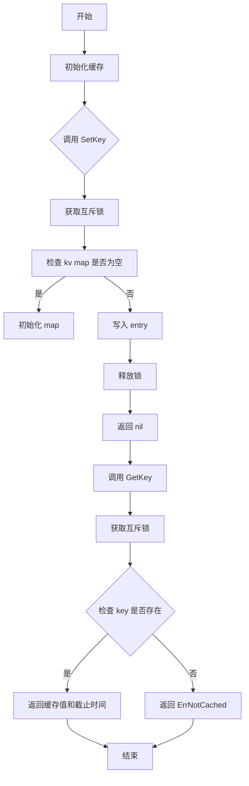
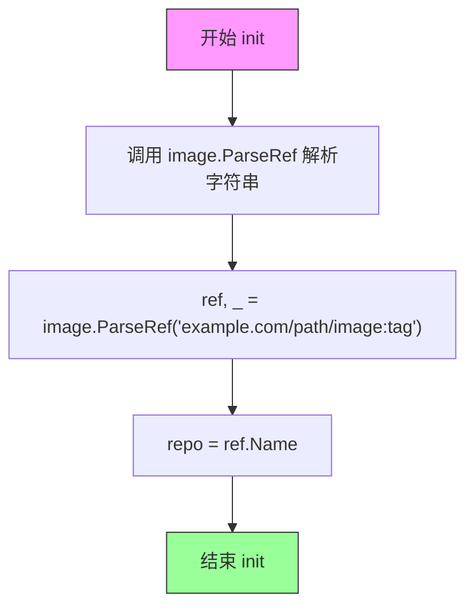
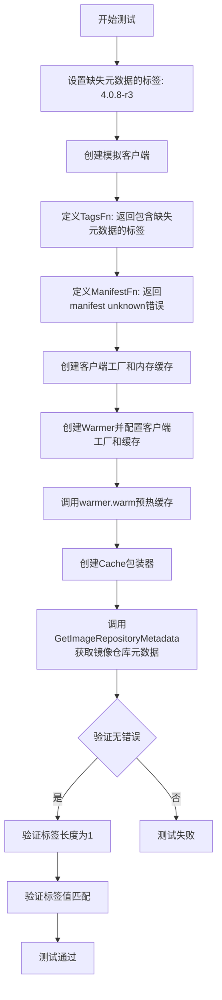
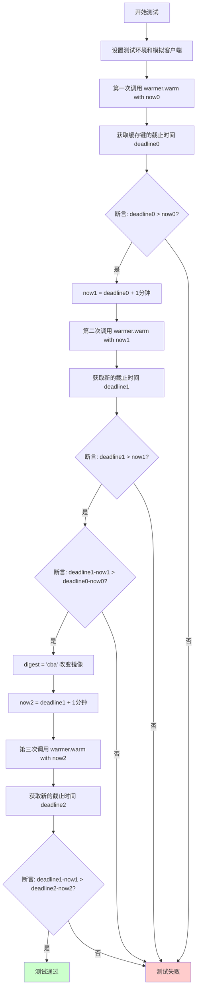
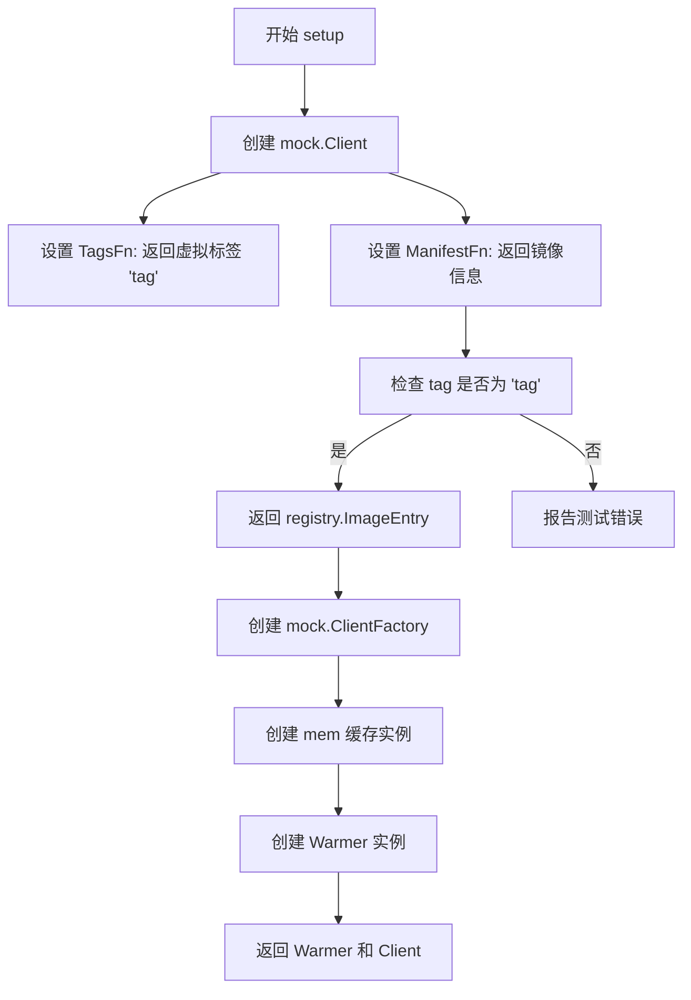
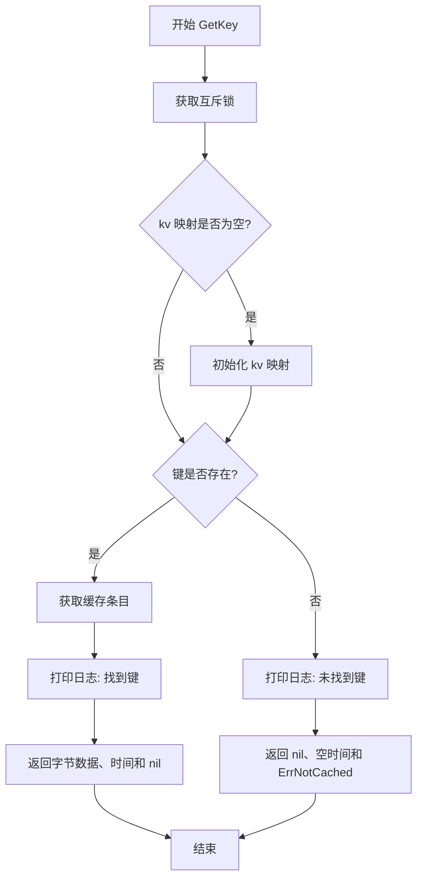
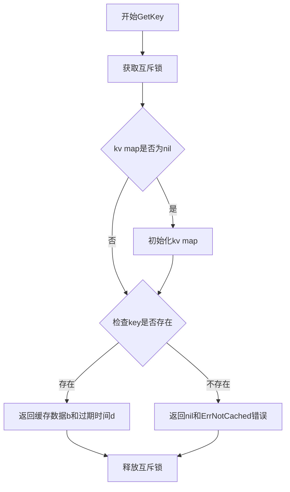

# `flux\pkg\registry\cache\warming_test.go` 详细设计文档

这是一个用于镜像仓库的内存缓存实现，提供了键值存储功能，支持缓存预热、查询和自动刷新机制，主要用于优化 Fluxcd 中镜像元数据的获取性能。

## 整体流程



## 类结构

```
entry (缓存条目结构体)
├── b []byte (缓存数据)
└── d time.Time (截止时间)

mem (内存缓存实现)
├── kv map[string]entry (键值存储)
└── mx sync.Mutex (互斥锁)

测试函数
├── TestWarmThenQuery
├── TestWarmManifestUnknown
├── TestRefreshDeadline
└── setup
```

## 全局变量及字段


### `ref`
    
示例镜像引用

类型：`image.Ref`
    


### `repo`
    
镜像仓库名称

类型：`image.Name`
    


### `entry.b`
    
缓存的字节数据

类型：`[]byte`
    


### `entry.d`
    
缓存的截止时间

类型：`time.Time`
    


### `mem.kv`
    
键值对映射表

类型：`map[string]entry`
    


### `mem.mx`
    
线程安全互斥锁

类型：`sync.Mutex`
    
    

## 全局函数及方法


### `init`

初始化全局变量 `ref` 和 `repo`，将示例镜像引用解析为 `image.Ref` 对象并提取其仓库名称。

参数：無（init 函数不接受显式参数）

返回值：無（init 函数不返回任何值）

#### 流程图



#### 带注释源码

```go
// init 函数在包初始化时自动执行
// 用于设置测试所需的全局变量 ref 和 repo
func init() {
	// 解析镜像引用字符串为 image.Ref 对象
	// 示例: "example.com/path/image:tag" -> image.Ref
	ref, _ = image.ParseRef("example.com/path/image:tag")
	
	// 从解析后的 ref 中提取仓库名称
	// 例如: image.Ref{Name: "example.com/path/image", Tag: "tag"} -> "example.com/path/image"
	repo = ref.Name
}
```

---

### 补充说明

| 项目 | 说明 |
|------|------|
| **函数类型** | 包级别初始化函数 (init) |
| **全局变量依赖** | `ref` (image.Ref), `repo` (image.Name) |
| **执行时机** | 在包首次被导入时自动执行，通常早于 `main` 函数 |
| **错误处理** | 忽略 `image.ParseRef` 的错误返回，这在测试场景下是可接受的硬编码假设 |
| **设计意图** | 为测试用例提供预定义的镜像引用，避免重复解析 |


### `TestWarmThenQuery`

该测试函数用于验证缓存预热机制与注册表功能是否协同工作，具体流程为：先通过 Warmer 从远程仓库获取镜像信息并填充缓存，然后通过 Cache 注册表查询已缓存的数据，确认缓存的数据符合预期。

参数：

- `t`：`testing.T`，Go 语言标准测试框架的测试实例指针，用于报告测试失败和日志输出

返回值：无（Go 语言测试函数不显式返回值，通过 `*testing.T` 参数进行断言）

#### 流程图

```mermaid
flowchart TD
    A[TestWarmThenQuery 开始] --> B[设置 digest = "abc"]
    B --> C[调用 setup 创建 warmer 和 cache]
    C --> D[创建 NopLogger]
    D --> E[调用 warmer.warm 预热缓存]
    E --> F[创建 Cache 实例]
    F --> G[调用 GetImageRepositoryMetadata 查询元数据]
    G --> H{查询是否成功?}
    H -->|是| I[验证 tags 长度为 1]
    I --> J[验证镜像 ID 与 ref.String 相等]
    H -->|否| K[测试失败]
    J --> L[测试通过]
    K --> L
    
    subgraph 预热流程 [warmer.warm 内部]
        E1[获取远程仓库标签] --> E2[遍历标签获取清单]
        E2 --> E3[构建 ImageEntry]
        E3 --> E4[调用 cache.SetKey 存入缓存]
    end
    
    subgraph 查询流程 [GetImageRepositoryMetadata 内部]
        G1[调用 cache.GetKey] --> G2{缓存是否命中?}
        G2 -->|是| G3[返回缓存的元数据]
        G2 -->|否| G4[返回 ErrNotCached]
    end
```

#### 带注释源码

```go
// TestWarmThenQuery 测试缓存预热后查询功能
// 该测试验证 cache.Warmer 和 cache.Registry 是否能正确协同工作：
// 1. 通过 Warmer 获取远程镜像信息并填充缓存
// 2. 通过 Registry 查询已缓存的镜像元数据
// 3. 验证缓存中的数据与预期一致
func TestWarmThenQuery(t *testing.T) {
    // 定义测试用的镜像摘要值，用于模拟远程仓库返回的镜像标识
    digest := "abc"
    
    // 调用 setup 函数初始化 Warmer 和内存缓存
    // setup 会创建一个 mock.Client，模拟远程仓库行为
    warmer, cache := setup(t, &digest)
    
    // 创建一个无操作的日志记录器，不输出任何日志
    // 这是测试中的常见做法，避免日志输出干扰测试结果
    logger := log.NewNopLogger()
    
    // 记录当前时间作为缓存的截止时间
    now := time.Now()
    
    // 调用 warmer.warm 方法执行缓存预热
    // 内部会遍历仓库的所有标签，获取每个标签对应的镜像清单信息
    // 并将这些信息存入 cache 中
    // 参数说明：
    //   - context.TODO(): 临时上下文，后续可能被取消
    //   - now: 缓存过期截止时间
    //   - logger: 日志记录器
    //   - repo: 镜像仓库名称（从 init() 中初始化）
    //   - registry.NoCredentials(): 不使用认证凭证
    warmer.warm(context.TODO(), now, logger, repo, registry.NoCredentials())
    
    // 创建一个 Cache 注册表实例，Reader 为前面创建的内存缓存
    // Cache 实现了 registry.Reader 接口
    registry := &Cache{Reader: cache}
    
    // 通过注册表查询指定镜像仓库的元数据
    // 如果缓存预热成功，这里应该能获取到之前缓存的数据
    // 参数 ref.Name 为镜像仓库的完整名称
    repoInfo, err := registry.GetImageRepositoryMetadata(ref.Name)
    
    // 断言查询操作成功，无错误发生
    assert.NoError(t, err)
    
    // 断言返回的标签列表长度为 1
    // 因为 mock.Client 只返回一个标签 "tag"
    assert.Len(t, repoInfo.Tags, 1)
    
    // 断言镜像 ID 与预期值相等
    // repoInfo.Images 是一个 map，键为标签名，值为 image.Info
    // 这里验证缓存中存储的镜像 ID 与我们预期的 ref 字符串一致
    assert.Equal(t, ref.String(), repoInfo.Images[repoInfo.Tags[0]].ID.String())
}
```


### `TestWarmManifestUnknown`

测试 manifest 未知情况的函数，验证当远程仓库返回"manifest unknown"错误时，缓存系统能够正确处理并返回空的镜像仓库元数据。

参数：

- `t`：`*testing.T`，Go 测试框架的标准参数，用于表示测试用例

返回值：无（Go 测试函数无显式返回值）

#### 流程图



#### 带注释源码

```go
// TestWarmManifestUnknown 测试当 manifest 未知时的缓存行为
// 该测试验证当远程仓库返回 manifest unknown 错误时，
// 缓存系统能够正确处理并返回包含该标签的元数据（即使没有详细信息）
func TestWarmManifestUnknown(t *testing.T) {
    // 定义一个标签，该标签的 manifest 元数据在远程仓库中不可用
    tagWithMissingMetadata := "4.0.8-r3"
    
    // 创建模拟客户端，模拟远程仓库的行为
    client := &mock.Client{
        // TagsFn: 返回包含缺失元数据的标签列表
        TagsFn: func() ([]string, error) {
            println("asked for tags")
            return []string{tagWithMissingMetadata}, nil
        },
        // ManifestFn: 当请求该标签的 manifest 时，返回 manifest unknown 错误
        ManifestFn: func(tag string) (registry.ImageEntry, error) {
            println("asked for manifest", tag)
            // 构建错误码集合，包含 manifest unknown 错误
            err := errcode.Errors{
                errcode.Error{
                    Code:    1012, // Docker registry 错误码，表示 manifest unknown
                    Message: "manifest unknown",
                    Detail: map[string]interface{}{
                        "Name":     "bitnami/redis",
                        "Revision": "sha256:9c7f4a0958280a55a4337d74c22260bc338c26a0a2de493a8ad69dd73fd5c290",
                    },
                },
            }
            // 返回空的 ImageEntry 和错误
            return registry.ImageEntry{}, err
        },
    }
    
    // 创建模拟客户端工厂，用于创建上面的模拟客户端
    factory := &mock.ClientFactory{Client: client}
    
    // 创建内存缓存实现
    cache := &mem{}
    
    // 创建 Warmer 实例，配置客户端工厂、缓存和突发容量
    // Warmer 负责预热缓存，从远程仓库获取镜像元数据
    warmer := &Warmer{
        clientFactory: factory,
        cache:         cache,
        burst:         10, // 突发容量，控制并发预热数量
    }

    // 创建日志记录器（这里使用 NopLogger，表示不输出日志）
    logger := log.NewNopLogger()

    // 记录当前时间作为起始时间
    now := time.Now()
    
    // 解析镜像引用和仓库名称
    redisRef, _ := image.ParseRef("bitnami/redis:5.0.2")
    repo := redisRef.Name
    
    // 调用 warmer 的 warm 方法进行缓存预热
    // 传入上下文、时间、Logger、仓库凭证等信息
    warmer.warm(context.TODO(), now, logger, repo, registry.NoCredentials())

    // 创建 Cache 包装器，将内存缓存包装为 Registry 接口
    registry := &Cache{Reader: cache}
    
    // 获取镜像仓库元数据
    repoInfo, err := registry.GetImageRepositoryMetadata(repo)
    
    // 断言：应该没有错误返回
    // 即使 manifest unknown，也应该返回部分信息（标签列表）
    assert.NoError(t, err)

    // 断言：标签列表应该包含一个元素
    assert.Len(t, repoInfo.Tags, 1)
    
    // 断言：标签值应该与缺失元数据的标签匹配
    assert.Equal(t, tagWithMissingMetadata, repoInfo.Tags[0])
}
```


### `TestRefreshDeadline`

该测试函数用于验证缓存的截止时间刷新逻辑：首次 warmed 后设置较长的刷新截止时间；当再次刷新且镜像未变化时，延长截止时间；当镜像发生变化（digest 改变）时，缩短截止时间以加速新镜像的同步。

参数：

- `t`：`testing.T`，Go 测试框架的标准参数，表示当前测试用例的上下文

返回值：无（`void`），该函数为测试函数，通过断言验证逻辑正确性

#### 流程图



#### 带注释源码

```go
// TestRefreshDeadline 测试缓存截止时间的刷新逻辑
// 验证三种场景：
// 1. 首次 warmed 后应设置较长的刷新截止时间
// 2. 镜像未变化时刷新，应延长截止时间
// 3. 镜像变化（digest不同）时刷新，应缩短截止时间
func TestRefreshDeadline(t *testing.T) {
    // 设置测试用的 digest 值和模拟缓存客户端
    digest := "abc"
    warmer, cache := setup(t, &digest)
    logger := log.NewNopLogger()

    // 第一次 warm 操作：使用当前时间 now0
    now0 := time.Now()
    warmer.warm(context.TODO(), now0, logger, repo, registry.NoCredentials())

    // 创建缓存键用于查询 manifest 的截止时间
    k := NewManifestKey(ref.CanonicalRef())
    
    // 从缓存获取截止时间
    _, deadline0, err := cache.GetKey(k)
    assert.NoError(t, err)
    
    // 断言：首次设置的截止时间应在当前时间之后（即尚未过期）
    assert.True(t, deadline0.After(now0))

    // 快速-forward 到截止时间之后：now1 = deadline0 + 1分钟
    now1 := deadline0.Add(time.Minute)
    
    // 第二次 warm 操作：镜像未变化（digest 仍为 "abc"）
    warmer.warm(context.TODO(), now1, logger, repo, registry.NoCredentials())
    
    // 获取新的截止时间
    _, deadline1, err := cache.GetKey(k)
    assert.NoError(t, err)
    
    // 断言：新的截止时间应在 now1 之后
    assert.True(t, deadline1.After(now1))
    
    // 断言：第二次刷新后，刷新周期应比首次更长（鼓励继续使用缓存）
    // 即：(deadline1 - now1) > (deadline0 - now0)
    assert.True(t, deadline0.Sub(now0) < deadline1.Sub(now1), 
        "%s < %s", deadline0.Sub(now0), deadline1.Sub(now1))

    // 第三次测试：修改 digest，模拟镜像发生变化
    digest = "cba" // <-- 这意味着 manifest 指向了不同的镜像
    now2 := deadline1.Add(time.Minute)
    
    // 第三次 warm 操作：镜像已变化
    warmer.warm(context.TODO(), now2, logger, repo, registry.NoCredentials())
    
    // 获取新的截止时间
    _, deadline2, err := cache.GetKey(k)
    assert.NoError(t, err)
    
    // 断言：当镜像变化时，刷新周期应比之前更短（加速新镜像同步）
    // 即：(deadline2 - now2) < (deadline1 - now1)
    assert.True(t, deadline1.Sub(now1) > deadline2.Sub(now2), 
        "%s > %s", deadline1.Sub(now1), deadline2.Sub(now2))
}
```


### `setup`

`setup` 是一个测试辅助函数，用于创建 mock 客户端和内存缓存，以便在测试中模拟镜像仓库的交互和缓存行为。

参数：

- `t`：`testing.T`，测试框架提供的测试上下文，用于报告测试错误
- `digest`：`string` 指针，指向镜像摘要字符串，用于在 mock 的 ManifestFn 中返回特定的镜像 Digest 值

返回值：`*Warmer`，返回创建的缓存预热器实例，用于填充缓存

返回值：返回内存缓存客户端 `Client`，用于验证缓存中的数据

#### 流程图



#### 带注释源码

```go
// setup 是一个测试辅助函数，用于创建 mock 客户端和缓存
// 参数 t 是测试框架提供的测试上下文
// 参数 digest 是指向字符串的指针，用于模拟镜像的 digest 值
func setup(t *testing.T, digest *string) (*Warmer, Client) {
	// 创建一个 mock 客户端，模拟镜像仓库的行为
	client := &mock.Client{
		// TagsFn 定义获取标签列表的行为
		TagsFn: func() ([]string, error) {
			println("asked for tags")
			return []string{"tag"}, nil // 返回一个虚拟标签 "tag"
		},
		// ManifestFn 定义获取镜像元数据的行为
		ManifestFn: func(tag string) (registry.ImageEntry, error) {
			println("asked for manifest", tag)
			// 验证请求的 tag 是否符合预期
			if tag != "tag" {
				t.Errorf("remote client was asked for %q instead of %q", tag, "tag")
			}
			// 返回镜像条目，包含镜像信息和 digest
			return registry.ImageEntry{
				Info: image.Info{
					ID:        ref,                // 镜像引用
					CreatedAt: time.Now(),        // 创建时间
					Digest:    *digest,           // 使用传入的 digest 值
				},
			}, nil
		},
	}
	// 创建 mock 客户端工厂，用于 Warmer 创建客户端实例
	factory := &mock.ClientFactory{Client: client}
	// 创建内存缓存实例
	c := &mem{}
	// 创建缓存预热器，配置客户端工厂、缓存和突发容量
	warmer := &Warmer{clientFactory: factory, cache: c, burst: 10}
	// 返回预热器和缓存客户端，供测试使用
	return warmer, c
}
```


### `mem.SetKey`

设置缓存键值对，将指定的键和值存储到内存缓存中，并设置过期时间。

参数：

- `k`：`Keyer`，键接口，提供了获取键的方法
- `deadline`：`time.Time`，缓存过期时间
- `v`：`[]byte`，要缓存的字节数组值

返回值：`error`，如果设置成功返回 `nil`，否则返回错误信息

#### 流程图

```mermaid
flowchart TD
    A[开始 SetKey] --> B[获取锁 c.mx.Lock]
    B --> C{c.kv 是否为空}
    C -->|是| D[初始化 make map[string]entry]
    C -->|否| E[直接继续]
    D --> F[存储键值对 c.kv[k.Key()] = entry{v, deadline}]
    E --> F
    F --> G[释放锁 c.mx.Unlock]
    G --> H[返回 nil]
```

#### 带注释源码

```go
// SetKey 设置缓存键值对
// 参数：
//   - k: Keyer 接口，提供键的获取方法
//   - deadline: 过期时间点
//   - v: 要缓存的字节数组值
func (c *mem) SetKey(k Keyer, deadline time.Time, v []byte) error {
	// 打印调试信息，记录设置的键和过期时间
	println("set key", k.Key(), deadline.Format(time.RFC3339))
	
	// 获取互斥锁，保证并发安全
	c.mx.Lock()
	// defer 确保函数返回前释放锁
	defer c.mx.Unlock()
	
	// 延迟初始化：如果 map 为 nil，则创建新的 map
	if c.kv == nil {
		c.kv = make(map[string]entry)
	}
	
	// 存储键值对到缓存，使用键的字符串形式作为 map 的 key
	// 值为 entry 结构体，包含字节数组和过期时间
	c.kv[k.Key()] = entry{v, deadline}
	
	// 返回 nil 表示设置成功
	return nil
}
```


### `mem.GetKey`

获取缓存键值对的方法，从内存缓存中检索指定键对应的字节数据和时间戳。如果键不存在，则返回 `ErrNotCached` 错误。

参数：

-  `k`：`Keyer`，用于生成缓存键的键接口，通过调用 `k.Key()` 方法获取实际的键字符串

返回值：

-  `[]byte`：缓存中存储的字节数据，如果键不存在则返回 `nil`
-  `time.Time`：缓存条目的过期截止时间，如果键不存在则返回空时间 `time.Time{}`
-  `error`：操作错误，如果成功则返回 `nil`，如果键不存在则返回 `ErrNotCached`

#### 流程图



#### 带注释源码

```go
// GetKey 从内存缓存中获取键对应的值和过期时间
// 参数 k: Keyer 接口，实现 Key() 方法返回缓存键字符串
// 返回: (字节数据, 过期时间, 错误)
//   - 成功时返回缓存的字节数组、过期时间戳和 nil 错误
//   - 键不存在时返回 nil、空时间戳和 ErrNotCached 错误
func (c *mem) GetKey(k Keyer) ([]byte, time.Time, error) {
    // 获取互斥锁，确保并发安全
    c.mx.Lock()
    // 方法返回时释放锁
    defer c.mx.Unlock()
    
    // 延迟初始化：如果 kv 映射为 nil，则创建新的映射
    if c.kv == nil {
        c.kv = make(map[string]entry)
    }

    // 尝试从缓存中获取键对应的条目
    if e, ok := c.kv[k.Key()]; ok {
        // 打印调试日志：键名和过期时间
        println("get key", k.Key(), e.d.Format(time.RFC3339))
        // 找到缓存项，返回字节数据、过期时间和 nil 错误
        return e.b, e.d, nil
    }
    
    // 缓存中未找到该键，打印调试日志
    println("get key", k.Key(), "nil")
    // 返回空值和缓存未命中错误
    return nil, time.Time{}, ErrNotCached
}
```

## 关键组件


### 核心功能概述

这是一个用于Flux CD镜像仓库的内存缓存系统，通过预热器（Warmer）从远程Docker仓库获取镜像元数据（标签、清单摘要等），并存储在内存缓存（mem）中供后续查询使用，同时支持缓存过期时间动态调整机制。

### 文件整体运行流程

1. **初始化阶段**：在init()函数中解析示例镜像引用和仓库名称
2. **缓存预热阶段**：调用Warmer.warm()方法，该方法通过clientFactory创建远程客户端，获取镜像标签和清单信息，并将数据写入缓存
3. **缓存查询阶段**：通过Cache.GetImageRepositoryMetadata()方法查询缓存中的镜像仓库元数据
4. **缓存过期处理**：缓存条目包含过期时间（deadline），预热时会根据镜像摘要是否变化动态调整过期时间

### 类详细信息

#### 1. entry 结构体

**描述**：缓存条目结构，存储镜像元数据的字节内容及其过期时间

**字段**：

| 字段名 | 类型 | 描述 |
|--------|------|------|
| b | []byte | 缓存的镜像元数据内容（JSON格式） |
| d | time.Time | 缓存条目的过期时间截止点 |

**方法**：无

#### 2. mem 结构体

**描述**：内存缓存的具体实现，使用Go的map存储键值对，并通过sync.Mutex保证并发安全

**字段**：

| 字段名 | 类型 | 描述 |
|--------|------|------|
| kv | map[string]entry | 存储缓存键值对的map，键为字符串，值为entry结构 |
| mx | sync.Mutex | 互斥锁，用于保护kv map的并发访问 |

**方法**：

| 方法名 | 参数 | 参数类型 | 参数描述 | 返回值类型 | 返回值描述 |
|--------|------|----------|----------|------------|------------|
| SetKey | k | Keyer | 缓存键接口 | error | 设置错误信息，nil表示成功 |
| SetKey | deadline | time.Time | 缓存过期时间点 | | |
| SetKey | v | []byte | 要缓存的字节数据 | | |
| GetKey | k | Keyer | 缓存键接口 | ([]byte, time.Time, error) | 返回缓存数据、过期时间和错误 |
| GetKey | | | | | |

**mermaid流程图（GetKey方法）**：


**带注释源码**：
```go
func (c *mem) SetKey(k Keyer, deadline time.Time, v []byte) error {
	println("set key", k.Key(), deadline.Format(time.RFC3339)) // 打印调试信息
	c.mx.Lock()           // 获取互斥锁，保证并发安全
	defer c.mx.Unlock()   // 函数返回时释放锁
	if c.kv == nil {
		c.kv = make(map[string]entry) // 延迟初始化map
	}
	c.kv[k.Key()] = entry{v, deadline} // 存储缓存条目
	return nil
}

func (c *mem) GetKey(k Keyer) ([]byte, time.Time, error) {
	c.mx.Lock()
	defer c.mx.Unlock()
	if c.kv == nil {
		c.kv = make(map[string]entry)
	}

	if e, ok := c.kv[k.Key()]; ok {
		println("get key", k.Key(), e.d.Format(time.RFC3339))
		return e.b, e.d, nil
	}
	println("get key", k.Key(), "nil")
	return nil, time.Time{}, ErrNotCached
}
```

#### 3. Warmer 类型

**描述**：缓存预热器，负责从远程Docker仓库获取镜像元数据并写入缓存

**字段**：

| 字段名 | 类型 | 描述 |
|--------|------|------|
| clientFactory | ClientFactory | 远程仓库客户端工厂，用于创建获取镜像元数据的客户端 |
| cache | Client | 缓存接口实现，用于存储预热的数据 |
| burst | int | 突发限制，控制并发预热的数量 |

**方法**：

| 方法名 | 参数 | 参数类型 | 参数描述 | 返回值类型 | 返回值描述 |
|--------|------|----------|----------|------------|------------|
| warm | ctx | context.Context | Go上下文，用于控制超时和取消 | 无 | 无 |
| warm | deadline | time.Time | 预热截止时间 | | |
| warm | logger | log.Logger | 日志记录器 | | |
| warm | repo | image.Name | 镜像仓库名称 | | |
| warm | creds | registry.Credentials | 仓库认证凭证 | | |

#### 4. Cache 类型

**描述**：缓存读取器封装，嵌入Reader接口以提供镜像仓库元数据查询功能

**字段**：

| 字段名 | 类型 | 描述 |
|--------|------|------|
| Reader | Client | 底层缓存客户端 |

**方法**：

| 方法名 | 参数 | 参数类型 | 参数描述 | 返回值类型 | 返回值描述 |
|--------|------|----------|----------|------------|------------|
| GetImageRepositoryMetadata | repo | image.Name | 镜像仓库名称 | (image.RepoMetadata, error) | 返回镜像仓库元数据和错误信息 |

#### 5. 全局变量

| 变量名 | 类型 | 描述 |
|--------|------|------|
| ref | image.Ref | 示例镜像引用，初始化为"example.com/path/image:tag" |
| repo | image.Name | 示例镜像仓库名称，从ref派生 |

### 关键组件信息

#### 组件1：内存缓存（mem）

使用Go map和互斥锁实现的线程安全内存缓存，支持键值存储和过期时间管理

#### 组件2：缓存预热器（Warmer）

负责从远程Docker registry获取镜像标签和清单信息，并根据镜像摘要变化动态调整缓存过期时间

#### 组件3：缓存读取器（Cache）

封装底层缓存客户端，提供统一的镜像仓库元数据查询接口

#### 组件4：过期时间动态调整机制

根据镜像摘要是否发生变化调整缓存TTL——摘要不变时延长过期时间，变化时缩短过期时间

### 潜在的技术债务或优化空间

1. **缺少连接池管理**：clientFactory每次调用都创建新客户端，高并发场景下性能受限
2. **调试print语句残留**：代码中存在大量println调试输出，应替换为结构化日志
3. **错误处理不完善**：GetKey在map为nil时初始化但未返回错误，可能掩盖潜在问题
4. **缺乏缓存大小限制**：mem缓存无容量上限和淘汰策略，可能导致内存膨胀
5. **测试覆盖不足**：缺少对并发访问、缓存穿透、缓存击穿等场景的测试

### 其他项目

#### 设计目标与约束

- **目标**：为Flux CD提供高效的镜像仓库元数据缓存，减少远程API调用
- **约束**：缓存存储在内存中，重启后数据丢失；仅支持单节点部署

#### 错误处理与异常设计

- 缓存未命中返回ErrNotCached错误
- 远程仓库返回"manifest unknown"错误时仍保留标签信息
- 使用context.Context支持超时控制和取消

#### 数据流与状态机

预热流程：获取标签列表 → 并发获取每个标签的清单 → 计算摘要 → 写入缓存
查询流程：接收仓库名称 → 构建缓存键 → 查询内存缓存 → 返回元数据

#### 外部依赖与接口契约

- 依赖`github.com/fluxcd/flux/pkg/registry`提供镜像仓库操作接口
- 依赖`github.com/fluxcd/flux/pkg/image`提供镜像解析功能
- 依赖`github.com/docker/distribution/registry/api/errcode`处理registry错误码


## 问题及建议


### 已知问题

- **全局变量状态共享**：`ref` 和 `repo` 作为包级全局变量在 `init()` 中初始化，存在测试间状态污染风险，`TestRefreshDeadline` 中修改 `digest` 指针会影响其他测试
- **并发性能瓶颈**：使用普通 `sync.Mutex` 保护所有读写操作，在读多写少场景下应使用 `sync.RWMutex` 提升并发读性能
- **内存泄漏风险**：`mem.kv` map 无容量限制且无过期条目清理机制，随着使用时间增长会持续占用内存
- **重复初始化代码**：`GetKey` 和 `SetKey` 方法中重复检查 `c.kv == nil` 并创建新 map，违反 DRY 原则
- **测试日志不规范**：使用 `println` 而非正式的日志框架进行调试输出
- **错误处理不完整**：`SetKey` 返回 error 但始终返回 nil，未对非法输入进行校验
- **Keyer 接口依赖不明确**：`Keyer` 接口定义未在本文件中体现，代码可读性受限
- **时间比较隐患**：`TestRefreshDeadline` 中使用 `time.Now()` 进行时间比较测试，可能受系统时间漂移影响

### 优化建议

- 将全局变量 `ref` 和 `repo` 改为在测试函数内部局部初始化，或使用表驱动测试模式隔离状态
- 将 `mem.mx sync.Mutex` 改为 `sync.RWMutex`，`GetKey` 使用 `RLock()/RUnlock()` 提升读并发性能
- 实现缓存过期清理机制，例如启动后台 goroutine 定期清理过期 entry 或设置最大缓存条目数量
- 提取 `ensureMap()` 辅助方法复用 map 初始化逻辑
- 替换 `println` 为 `testing.T.Log()` 或正式的日志库
- 在 `SetKey` 中添加参数校验，返回有意义的错误信息
- 添加关键方法的文档注释，提升代码可维护性
- 使用固定时间点（如 `time.Date(2024, 1, 1, 0, 0, 0, 0, time.UTC)`）替代 `time.Now()` 增强测试稳定性

## 其它


### 设计目标与约束

该代码实现了一个内存缓存系统，用于缓存Docker镜像的元数据（tags、manifest信息）。设计目标包括：(1) 提供并发安全的键值缓存读写操作；(2) 支持缓存预热（warm）机制，将远程registry的镜像信息预先加载到缓存中；(3) 实现缓存过期和刷新策略，基于不同的镜像digest赋予不同的过期时间。约束条件包括：仅支持内存存储、不支持持久化、缓存上限受内存限制。

### 错误处理与异常设计

错误处理主要通过`ErrNotCached`全局错误标识缓存未命中情况。在`GetKey`方法中，当缓存键不存在时返回`ErrNotCached`错误。测试用例`TestWarmManifestUnknown`验证了对远程manifest未知错误的处理：当远程返回"manifest unknown"错误码(1012)时，系统仍能正常返回tags信息，体现了容错设计。异常场景包括：缓存未初始化(nil map)、并发访问冲突(通过mutex保护)、远程仓库不可用等。

### 数据流与状态机

数据流主要分为两条路径：(1) **缓存读取路径**：客户端调用`GetImageRepositoryMetadata` → `Cache.GetImageRepositoryMetadata` → `mem.GetKey` → 返回缓存的镜像元数据或`ErrNotCached`；(2) **缓存预热路径**：调用`warmer.warm` → 远程获取tags → 对每个tag获取manifest → 调用`mem.SetKey`写入缓存。状态转换：初始状态kv为nil → 首次写入时初始化map → 后续读写操作。

### 外部依赖与接口契约

关键外部依赖包括：`github.com/fluxcd/flux/pkg/image`提供镜像引用和名称解析；`github.com/fluxcd/flux/pkg/registry`定义ImageEntry、ClientFactory等接口；`github.com/fluxcd/flux/pkg/registry/mock`提供测试用mock客户端；`github.com/go-kit/kit/log`提供日志接口；`github.com/docker/distribution/registry/api/errcode`定义registry错误码。接口契约：Cache结构体需要Reader接口（实现SetKey/GetKey方法），Warmer需要clientFactory和cache接口。

### 并发控制机制

使用`sync.Mutex`保护内存缓存的并发访问。在`mem`结构体中嵌入了`mx sync.Mutex`字段，所有读写操作(SetKey/GetKey)都先获取锁、完成后释放锁(通过defer)。这种设计确保了在高并发场景下map读写的安全性，避免数据竞争。burst参数(值为10)控制预热并发速率。

### 测试覆盖与验证策略

测试覆盖了三个核心场景：(1) `TestWarmThenQuery`验证预热后缓存可用且数据正确；(2) `TestWarmManifestUnknown`验证部分镜像manifest未知时的容错能力；(3) `TestRefreshDeadline`验证不同digest对应不同过期时间策略。测试使用mock.Client模拟远程仓库行为，通过assert验证预期结果。

### 关键组件信息

**mem类型**：内存缓存实现，封装map[string]entry和互斥锁，提供SetKey/GetKey方法。**Warmer类型**：缓存预热器，从远程registry拉取镜像元数据并写入缓存，控制预热速率(burst参数)。**Cache类型**：带缓存的registry包装器，实现GetImageRepositoryMetadata方法，先查询缓存再返回结果。

### 潜在技术债务与优化空间

(1) **无持久化**：缓存数据仅存于内存，进程重启后数据丢失，可考虑引入磁盘持久化或分布式缓存；(2) **缓存容量无上限**：map可能无限增长，缺乏淘汰策略(LRU/LFU)，生产环境需添加容量限制和淘汰机制；(3) **错误处理粗糙**：仅区分"未缓存"和"已缓存"，缺乏细粒度错误分类；(4) **日志使用**：使用println调试打印，生产环境应替换为结构化日志；(5) **测试隔离**：全局变量ref和repo在init中初始化，多测试用例可能相互影响。

### 全局变量与全局函数

**全局变量**：ref (image.Ref类型，解析后的镜像引用example.com/path/image:tag)；repo (image.Name类型，镜像仓库名称)；**全局函数**：init() (初始化全局变量ref和repo)；无其他全局函数。

### 类字段与类方法

**entry结构体**：字段b ([]byte，缓存的镜像元数据)、d (time.Time，过期截止时间)。**mem结构体**：字段kv (map[string]entry，缓存键值对)、mx (sync.Mutex，并发控制)。**方法SetKey**：参数k (Keyer，缓存键接口)、deadline (time.Time，过期时间)、v ([]byte，要缓存的数据)，返回error，流程为获取锁→初始化map→写入数据→释放锁。**方法GetKey**：参数k (Keyer，缓存键接口)，返回([]byte, time.Time, error)，流程为获取锁→初始化map→查询键→返回数据或ErrNotCached错误。

    