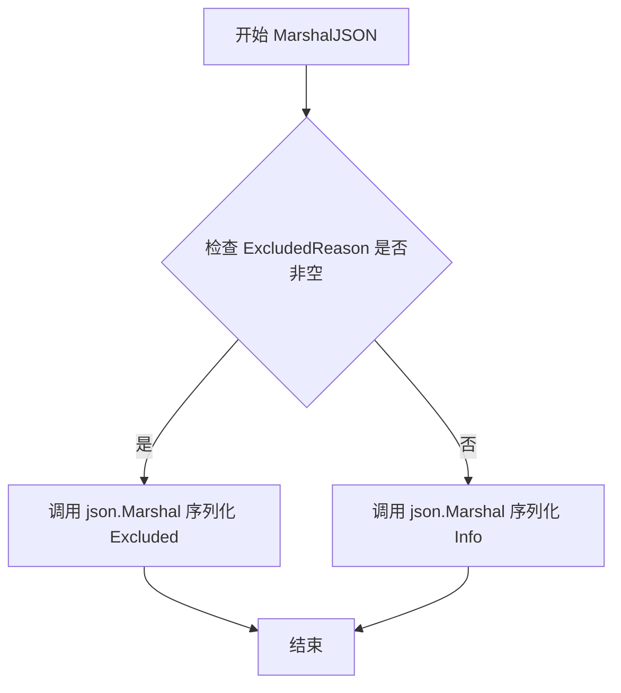
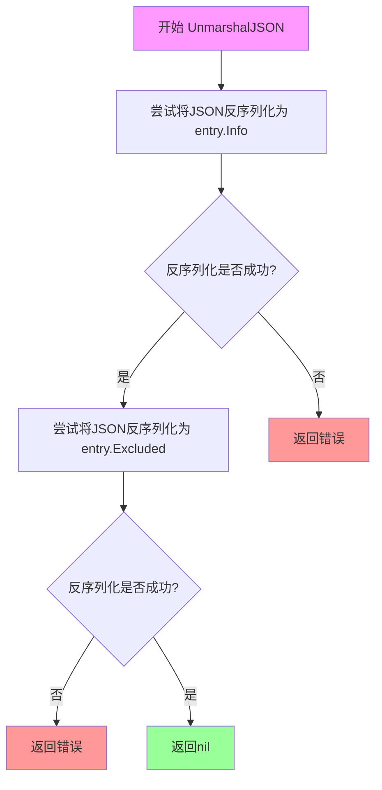
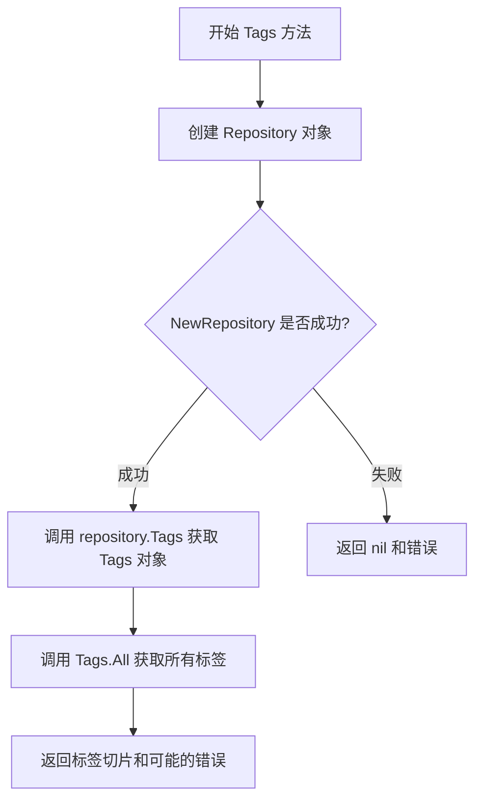
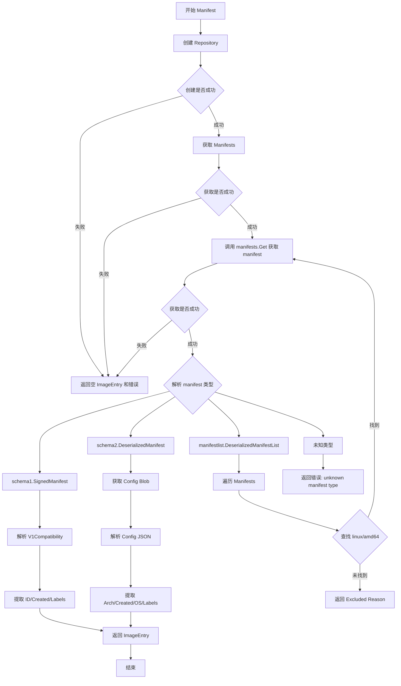
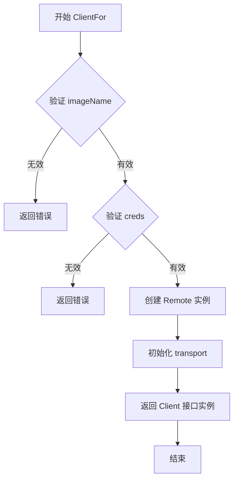
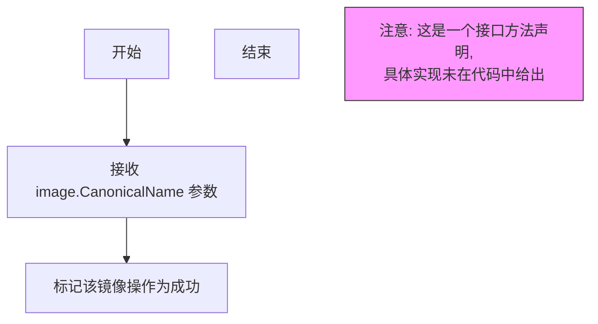
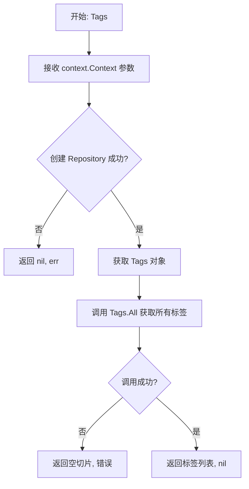
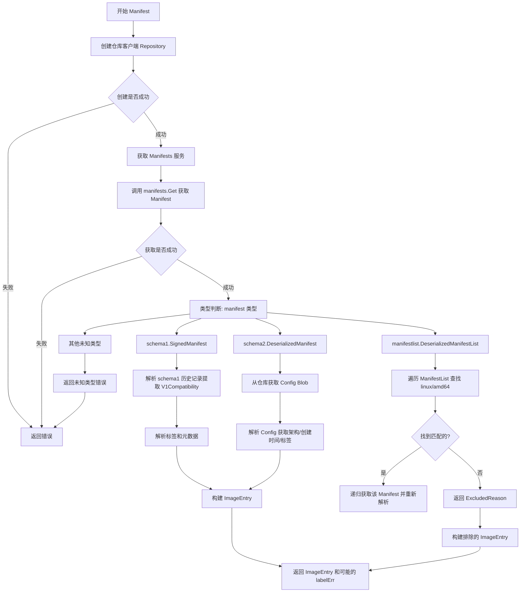
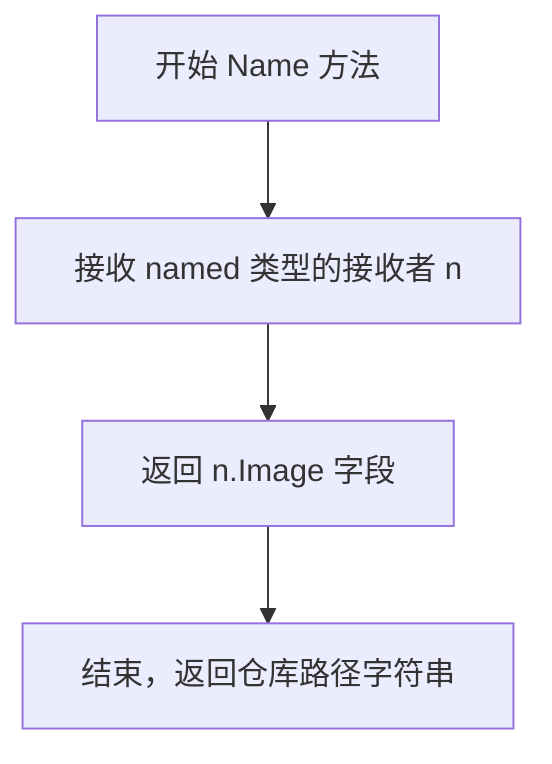

# `flux\pkg\registry\client.go` 详细设计文档

这是一个 Flux CD 项目的远程 Docker registry 客户端包，实现了与 Docker 仓库交互的核心功能，能够获取镜像仓库的标签列表和镜像 manifest 元数据信息，支持解析 schema1、schema2 和 manifestlist 三种 manifest 格式，并提取镜像 ID、创建时间、操作系统/架构信息以及自定义标签。

## 整体流程

```mermaid
graph TD
    A[开始] --> B[创建 Remote 实例]
    B --> C{调用方法}
    C --> D[Tags]
    C --> E[Manifest]
    D --> F[NewRepository]
    F --> G[repository.Tags.All]
    G --> H[返回 []string]
    E --> I[NewRepository]
    I --> J[repository.Manifests.Get]
    J --> K{解析 Manifest 类型}
    K --> L[schema1.SignedManifest]
    K --> M[schema2.DeserializedManifest]
    K --> N[manifestlist.DeserializedManifestList]
    L --> O[解析 V1Compatibility]
    M --> P[获取 Config Blob]
    N --> Q[遍历 Manifests 查找 linux/amd64]
    O --> R[提取 ImageID/CreatedAt/Labels]
    P --> R
    Q --> R
    R --> S[返回 ImageEntry]
```

## 类结构

```
Client (接口)
├── Remote (实现类)
ClientFactory (接口)
named (适配器结构体)
Excluded (结构体)
ImageEntry (结构体)
    ├── image.Info (嵌入)
    └── Excluded (嵌入)
```

## 全局变量及字段


### `Excluded.ExcludedReason`
    
镜像被排除的原因

类型：`string`
    


### `ImageEntry.Info`
    
镜像信息（嵌入）

类型：`image.Info`
    


### `ImageEntry.Excluded`
    
排除信息（嵌入）

类型：`Excluded`
    


### `Remote.transport`
    
HTTP 传输层

类型：`http.RoundTripper`
    


### `Remote.repo`
    
镜像仓库名称

类型：`image.CanonicalName`
    


### `Remote.base`
    
registry 基础 URL

类型：`string`
    


### `named.CanonicalName`
    
镜像规范名称（嵌入）

类型：`image.CanonicalName`
    
    

## 全局函数及方法


### `ImageEntry.MarshalJSON`

该方法实现自定义 JSON 序列化，针对 ImageEntry 的 either-or 特性进行处理：当存在排除原因（ExcludedReason 非空）时，序列化 Excluded 部分；否则序列化嵌入的 image.Info 部分。这是因为 ImageEntry 嵌入了自定义 MarshalJSON 的 image.Info 类型，需要避免其默认序列化逻辑被直接使用。

参数：此方法无额外参数（仅包含隐式接收者 `entry ImageEntry`）

返回值：
- `[]byte`：JSON 格式的字节数组
- `error`：序列化过程中可能发生的错误（如 json.Marshal 返回的错误）

#### 流程图



#### 带注释源码

```go
// MarshalJSON does custom JSON marshalling for ImageEntry values. We
// need this because the struct embeds the image.Info type, which has
// its own custom marshaling, which would get used otherwise.
func (entry ImageEntry) MarshalJSON() ([]byte, error) {
	// We can only do it this way because it's explicitly an either-or
	// -- I don't know of a way to inline all the fields when one of
	// the things you're inlining defines its own MarshalJSON.
	// 判断是否为排除状态：若 ExcludedReason 非空，则表示该镜像被排除
	if entry.ExcludedReason != "" {
		// 序列化 Excluded 结构体（包含 ExcludedReason 字段）
		return json.Marshal(entry.Excluded)
	}
	// 否则序列化 image.Info 部分
	return json.Marshal(entry.Info)
}
```


### `ImageEntry.UnmarshalJSON`

自定义 JSON 反序列化方法，用于将 JSON 数据反序列化为 ImageEntry 结构体，处理嵌入的 image.Info 和 Excluded 两种可能的数据结构。

参数：

- `bytes`：`[]byte`，要反序列化的 JSON 字节数据

返回值：`error`，反序列化过程中发生的错误（如有）

#### 流程图



#### 带注释源码

```go
// UnmarshalJSON does custom JSON unmarshalling for ImageEntry values.
// ImageEntry 结构体嵌入了 image.Info 和 Excluded 两种类型，
// 该方法尝试将 JSON 数据同时反序列化到这两种类型中，
// 以支持"二选一"的语义（即要么是有效的 image.Info，要么是 ExcludedReason）
func (entry *ImageEntry) UnmarshalJSON(bytes []byte) error {
	// 首先尝试将 JSON 数据反序列化为嵌入的 image.Info 类型
	// image.Info 有自己的自定义 MarshalJSON 方法
	if err := json.Unmarshal(bytes, &entry.Info); err != nil {
		// 如果反序列化失败，立即返回错误
		return err
	}
	// 然后尝试将相同的 JSON 数据反序列化为 Excluded 类型
	// Excluded 类型包含一个可选的 ExcludedReason 字段
	if err := json.Unmarshal(bytes, &entry.Excluded); err != nil {
		// 如果反序列化失败，立即返回错误
		return err
	}
	// 如果两者都成功（或者至少没有返回错误），则返回 nil
	// 注意：这里的设计假设 JSON 数据可以同时满足两种结构
	return nil
}
```

---

### 补充说明

#### 设计目标与约束

- **设计目标**：支持 ImageEntry 结构体的自定义 JSON 反序列化，该结构体包含嵌入的 image.Info 类型（有自己的自定义 marshaling）和 Excluded 类型，形成"either-or"语义
- **约束**：由于 image.Info 包含自定义的 MarshalJSON 方法，无法使用内联字段的方式直接 marshalling，必须通过自定义 UnmarshalJSON 来处理

#### 潜在技术债务

1. **逻辑缺陷**：当前实现尝试将同一个 JSON 数据同时反序列化为 Info 和 Excluded 两者，这在语义上是矛盾的。根据代码注释，ImageEntry 应该是"either-or"结构——要么是有效的 image.Info，要么是 ExcludedReason。当前实现无法正确区分这两种情况，因为即使 JSON 只包含 ExcludedReason，反序列化到 Info 时也可能部分成功
2. **错误处理不完善**：方法没有明确区分"JSON 数据不匹配"和"真正的解析错误"两种情况

#### 优化建议

应该先检测 JSON 数据中是否包含 `ExcludedReason` 字段，再决定反序列化为哪种类型。可以参考 MarshalJSON 的逻辑：先检查 ExcludedReason 是否非空，再决定使用哪种结构进行反序列化。


### `Remote.Tags`

获取镜像仓库的所有标签列表。

参数：

- `ctx`：`context.Context`，上下文对象，用于控制请求的截止时间和取消操作

返回值：`([]string, error)`，返回仓库中的所有标签名称切片，如果发生错误则返回错误信息

#### 流程图



#### 带注释源码

```go
// Return the tags for this repository.
// 返回指定镜像仓库的所有标签
func (a *Remote) Tags(ctx context.Context) ([]string, error) {
	// 使用 client.NewRepository 创建远程仓库连接
	// 参数包括：命名对象、基础URL、传输层
	repository, err := client.NewRepository(named{a.repo}, a.base, a.transport)
	if err != nil {
		// 如果创建仓库对象失败，直接返回错误
		return nil, err
	}
	// 获取 Tags 服务对象并调用 All 方法获取所有标签
	// repository.Tags(ctx) 返回 Tags 接口
	// .All(ctx) 执行实际的网络请求获取标签列表
	return repository.Tags(ctx).All(ctx)
}
```


### `Remote.Manifest`

获取指定镜像引用的 manifest 和元数据。该方法通过 Docker Distribution 客户端库查询镜像仓库，解析不同版本的 manifest（schema1、schema2、manifestlist），提取镜像 ID、创建时间、架构、操作系统和标签等元数据信息，并返回包含镜像信息或排除原因的 `ImageEntry` 结构。

参数：

- `ctx`：`context.Context`，用于控制请求超时和取消的上下文对象
- `ref`：`string`，镜像引用，可以是镜像标签或 digest

返回值：`ImageEntry, error`，返回包含镜像元数据的 `ImageEntry` 结构体；如果发生错误则返回 error

#### 流程图



#### 带注释源码

```go
// Manifest fetches the metadata for an image reference; currently
// assumed to be in the same repo as that provided to `NewRemote(...)`
// Manifest 获取指定镜像引用的元数据
func (a *Remote) Manifest(ctx context.Context, ref string) (ImageEntry, error) {
	// 步骤1: 创建 Repository 对象
	// 使用仓库名称、基础 URL 和传输层创建 Docker Distribution 客户端的 Repository 实例
	repository, err := client.NewRepository(named{a.repo}, a.base, a.transport)
	if err != nil {
		return ImageEntry{}, err
	}
	
	// 步骤2: 获取 Manifests 操作接口
	// 通过 Repository 获取 Manifests 服务，用于查询和获取镜像 manifest
	manifests, err := repository.Manifests(ctx)
	if err != nil {
		return ImageEntry{}, err
	}
	
	// 步骤3: 声明 manifestDigest 变量用于接收返回的 digest
	var manifestDigest digest.Digest
	// 配置获取选项: 返回内容的同时返回 manifest 的 digest
	digestOpt := client.ReturnContentDigest(&manifestDigest)
	// 步骤4: 获取 manifest
	// 使用 ref 作为 digest 或 tag 调用 Get 方法获取 manifest
	// digest.Digest(ref) 将 ref 转换为 digest 格式
	// distribution.WithTagOption{ref} 用于指定 tag（当 ref 是 tag 时使用）
	manifest, fetchErr := manifests.Get(ctx, digest.Digest(ref), digestOpt, distribution.WithTagOption{ref})

interpret:
	// 步骤5: 错误处理
	// 如果获取失败直接返回空 ImageEntry 和错误
	if fetchErr != nil {
		return ImageEntry{}, fetchErr
	}

	// 初始化 labelErr 用于记录标签解析错误（不影响主流程）
	var labelErr error
	// 创建基础 image.Info 对象
	// 使用 repo.ToRef(ref) 构建镜像引用，Digest 使用返回的 manifestDigest
	info := image.Info{ID: a.repo.ToRef(ref), Digest: manifestDigest.String()}

	// 步骤6: 根据 manifest 类型进行不同的解析
	// TODO(michael): can we type switch? Not sure how dependable the
	// underlying types are.
	switch deserialised := manifest.(type) {
	// case 1: 处理 Docker Manifest Schema v1 (schema1)
	case *schema1.SignedManifest:
		var man schema1.Manifest = deserialised.Manifest
		// For decoding the v1-compatibility entry in schema1 manifests
		// Ref: https://docs.docker.com/registry/spec/manifest-v2-1/
		// Ref (spec): https://github.com/moby/moby/blob/master/image/spec/v1.md#image-json-field-descriptions
		var v1 struct {
			ID      string    `json:"id"`       // 镜像 ID
			Created time.Time `json:"created"` // 创建时间
			OS      string    `json:"os"`      // 操作系统
			Arch    string    `json:"architecture"` // 架构
		}
		// 从 History[0].V1Compatibility 解析基础镜像信息
		if err = json.Unmarshal([]byte(man.History[0].V1Compatibility), &v1); err != nil {
			return ImageEntry{}, err
		}

		// 单独解析标签配置
		var config struct {
			Config struct {
				Labels image.Labels `json:"labels"` // 镜像标签
			} `json:"config"`
		}
		// We need to unmarshal the labels separately as the validation error
		// that may be returned stops the unmarshalling which would result
		// in no data at all for the image.
		// 需要单独 unmarshal 标签，因为验证错误会导致整个 unmarshal 失败
		if err = json.Unmarshal([]byte(man.History[0].V1Compatibility), &config); err != nil {
			// 如果是标签时间戳格式错误，记录但不中断流程
			if _, ok := err.(*image.LabelTimestampFormatError); !ok {
				return ImageEntry{}, err
			}
			labelErr = err
		}

		// This is not the ImageID that Docker uses, but assumed to
		// identify the image as it's the topmost layer.
		// 注意: 这不是 Docker 使用的 ImageID，但用于标识镜像（最顶层 layer）
		info.ImageID = v1.ID
		info.CreatedAt = v1.Created
		info.Labels = config.Config.Labels

	// case 2: 处理 Docker Manifest Schema v2 (schema2)
	case *schema2.DeserializedManifest:
		var man schema2.Manifest = deserialised.Manifest
		// 从仓库获取 config blob
		configBytes, err := repository.Blobs(ctx).Get(ctx, man.Config.Digest)
		if err != nil {
			return ImageEntry{}, err
		}

		// Ref: https://github.com/docker/distribution/blob/master/docs/spec/manifest-v2-2.md
		var config struct {
			Arch            string    `json:"architecture"` // 架构
			Created         time.Time `json:"created"`     // 创建时间
			OS              string    `json:"os"`           // 操作系统
		}
		// 解析 config blob 获取基础信息
		if err = json.Unmarshal(configBytes, &config); err != nil {
			return ImageEntry{}, nil
		}

		// Ref: https://github.com/moby/moby/blob/39e6def2194045cb206160b66bf309f486bd7e64/image/image.go#L47
		var container struct {
			ContainerConfig struct {
				Labels image.Labels `json:"labels"` // 容器配置中的标签
			} `json:"container_config"`
		}
		// 单独解析标签（同样处理验证错误）
		if err = json.Unmarshal(configBytes, &container); err != nil {
			if _, ok := err.(*image.LabelTimestampFormatError); !ok {
				return ImageEntry{}, err
			}
			labelErr = err
		}

		// This _is_ what Docker uses as its Image ID.
		// 这就是 Docker 使用的 Image ID
		info.ImageID = man.Config.Digest.String()
		info.CreatedAt = config.Created
		info.Labels = container.ContainerConfig.Labels

	// case 3: 处理 OCI Manifest List / Docker Multi-arch Manifest List
	case *manifestlist.DeserializedManifestList:
		var list manifestlist.ManifestList = deserialised.ManifestList
		// TODO(michael): is it valid to just pick the first one that matches?
		// 遍历 manifest list 查找 linux/amd64 平台
		for _, m := range list.Manifests {
			if m.Platform.OS == "linux" && m.Platform.Architecture == "amd64" {
				// 找到后递归获取该 manifest（使用 goto interpret）
				manifest, fetchErr = manifests.Get(ctx, m.Digest, digestOpt)
				goto interpret
			}
		}
		// 未找到合适的 manifest，返回排除原因
		entry := ImageEntry{}
		entry.ExcludedReason = "no suitable manifest (linux amd64) in manifestlist"
		return entry, nil

	// default: 未知 manifest 类型
	default:
		t := reflect.TypeOf(manifest)
		return ImageEntry{}, errors.New("unknown manifest type: " + t.String())
	}
	// 返回 ImageEntry 和可能的标签解析错误
	return ImageEntry{Info: info}, labelErr
}
```


### ClientFactory.ClientFor()

为指定镜像仓库创建并返回一个可操作该仓库的 Client 实例。

参数：

-  `imageName`：`image.CanonicalName`，目标镜像仓库的规范名称
-  `creds`：`Credentials`，访问镜像仓库所需的凭证信息（类型在当前代码片段中未定义）

返回值：`(Client, error)`
- `Client`：用于与远程镜像仓库交互的客户端实例
- `error`：创建客户端过程中发生的错误（如连接失败、凭证无效等）

#### 流程图



#### 带注释源码

```go
// ClientFactory 接口定义了创建客户端的工厂方法
// 该接口允许注入伪造实现用于测试
type ClientFactory interface {
	// ClientFor 方法为指定的镜像仓库创建 Client 实例
	// 参数 imageName: 目标镜像仓库的规范名称（包含仓库路径和域名信息）
	// 参数 creds: 访问仓库所需的凭证信息
	// 返回值: 成功时返回实现了 Client 接口的实例，失败时返回错误
	ClientFor(image.CanonicalName, Credentials) (Client, error)
	
	// Succeed 方法用于标记某个镜像仓库的客户端创建为成功状态
	// 通常用于测试或监控目的
	Succeed(image.CanonicalName)
}

// 注意：当前代码片段仅包含 ClientFactory 接口定义，
// 具体的 ClientFor 实现位于其他文件中。
// 从代码结构推断，实现可能包含以下逻辑：
// 1. 验证 imageName 和 creds 的有效性
// 2. 根据凭证创建相应的认证 transport
// 3. 创建并返回 *Remote 结构体实例（该结构体实现了 Client 接口）
```


### `ClientFactory.Succeed()`

标记操作成功，记录已成功处理的镜像信息。

参数：

-  `img`：`image.CanonicalName`，要标记为成功的镜像名称

返回值：`无`（该方法没有返回值）

#### 流程图



#### 带注释源码

```go
// ClientFactory 接口定义了用于创建 Registry 客户端的工厂方法
type ClientFactory interface {
    // ClientFor 方法用于为指定的镜像仓库创建客户端实例
    ClientFor(image.CanonicalName, Credentials) (Client, error)
    
    // Succeed 方法用于标记某个镜像操作成功
    // 参数 img: image.CanonicalName 类型，表示已成功处理的镜像
    // 返回值: 无返回值 (void)
    Succeed(image.CanonicalName)
}
```

---

**注意**：提供的代码片段中仅包含 `ClientFactory` 接口的声明，`Succeed()` 方法是一个接口方法，其具体实现并未在当前代码文件中给出。该方法的设计目的是在镜像操作成功时进行标记或记录，具体实现可能涉及指标记录、状态更新或审计日志等功能。


### `Remote.Tags`

获取指定镜像仓库的所有标签名称列表。该方法通过 Docker Distribution 客户端库与远程 registry 交互，返回仓库中存在的所有标签。

参数：

- `ctx`：`context.Context`，用于传递上下文信息（如超时、取消信号等），确保请求可以在必要时被取消或超时控制

返回值：`([]string, error)`，返回标签名称的字符串切片，若发生错误则返回 error

#### 流程图



#### 带注释源码

```go
// Return the tags for this repository.
// 返回该仓库的所有标签
func (a *Remote) Tags(ctx context.Context) ([]string, error) {
	// 使用 client.NewRepository 创建仓库实例
	// 参数: named 类型（适配 docker distribution 的 reference.Named 接口），
	//       base URL（仓库基础路径），transport（HTTP 传输层）
	repository, err := client.NewRepository(named{a.repo}, a.base, a.transport)
	
	// 如果创建仓库实例失败，直接返回错误
	if err != nil {
		return nil, err
	}
	
	// 获取 Tags 对象（Docker Distribution 的 Tags 方法）
	// 调用 All 方法获取所有标签列表
	return repository.Tags(ctx).All(ctx)
}
```


### `Remote.Manifest`

该方法从远程镜像仓库获取指定引用的镜像 manifest，解析其内容并提取镜像元数据（如镜像 ID、创建时间、标签、架构等），同时处理不同版本的 manifest 格式（schema1、schema2 及 manifestlist），返回包含镜像信息或排除原因的 `ImageEntry` 结构。

**参数：**

- `ctx`：`context.Context`，用于控制请求超时和取消的上下文
- `ref`：`string`，镜像引用，可以是标签（tag）或摘要（digest）

**返回值：** `(ImageEntry, error)`，返回解析后的镜像信息结构体及可能出现的错误

#### 流程图



#### 带注释源码

```go
// Manifest fetches the metadata for an image reference; currently
// assumed to be in the same repo as that provided to `NewRemote(...)`
func (a *Remote) Manifest(ctx context.Context, ref string) (ImageEntry, error) {
	// 步骤1: 创建仓库客户端
	// 使用 Docker Distribution 的 client 包创建与远程仓库的连接
	repository, err := client.NewRepository(named{a.repo}, a.base, a.transport)
	if err != nil {
		return ImageEntry{}, err
	}
	
	// 步骤2: 获取 Manifest 服务
	// 从仓库获取 manifest 操作接口，用于查询镜像清单
	manifests, err := repository.Manifests(ctx)
	if err != nil {
		return ImageEntry{}, err
	}
	
	// 步骤3: 准备接收 manifest digest
	// 使用选项来获取并返回 manifest 的 digest 值
	var manifestDigest digest.Digest
	digestOpt := client.ReturnContentDigest(&manifestDigest)
	
	// 步骤4: 获取 Manifest
	// 根据 ref (tag 或 digest) 获取对应的 manifest
	// digest.Digest(ref) 会尝试将 ref 作为 digest 处理，如果失败则使用 tag
	manifest, fetchErr := manifests.Get(ctx, digest.Digest(ref), digestOpt, distribution.WithTagOption{ref})

interpret:
	// 标签用于处理 manifestlist 的循环跳转
	if fetchErr != nil {
		return ImageEntry{}, fetchErr
	}

	// 初始化标签解析错误
	var labelErr error
	// 创建基础 image.Info，包含仓库引用和 manifest digest
	info := image.Info{ID: a.repo.ToRef(ref), Digest: manifestDigest.String()}

	// 步骤5: 根据不同 manifest 类型进行解析
	// 使用类型断言处理不同的 manifest schema 版本
	switch deserialised := manifest.(type) {
	case *schema1.SignedManifest:
		// 处理 Docker Schema 1 格式的 manifest
		var man schema1.Manifest = deserialised.Manifest
		// 从 schema1 的 history 中提取 V1 兼容性信息
		var v1 struct {
			ID      string    `json:"id"`
			Created time.Time `json:"created"`
			OS      string    `json:"os"`
			Arch    string    `json:"architecture"`
		}
		// 解析 V1Compatibility JSON 字段
		if err = json.Unmarshal([]byte(man.History[0].V1Compatibility), &v1); err != nil {
			return ImageEntry{}, err
		}

		// 单独解析标签，因为验证错误会阻止完整的 JSON 解析
		var config struct {
			Config  struct {
				Labels image.Labels `json:"labels"`
			} `json:"config"`
		}
		if err = json.Unmarshal([]byte(man.History[0].V1Compatibility), &config); err != nil {
			// 如果是标签时间格式错误，仍然继续但记录错误
			if _, ok := err.(*image.LabelTimestampFormatError); !ok {
				return ImageEntry{}, err
			}
			labelErr = err
		}

		// 设置镜像信息 - Schema1 使用顶层 layer 的 ID 作为 ImageID
		info.ImageID = v1.ID
		info.CreatedAt = v1.Created
		info.Labels = config.Config.Labels
		
	case *schema2.DeserializedManifest:
		// 处理 Docker Schema 2 格式的 manifest
		var man schema2.Manifest = deserialised.Manifest
		
		// 从仓库获取 config blob，这是镜像的配置信息
		configBytes, err := repository.Blobs(ctx).Get(ctx, man.Config.Digest)
		if err != nil {
			return ImageEntry{}, err
		}

		// 解析 config 获取架构、创建时间等基本信息
		var config struct {
			Arch            string    `json:"architecture"`
			Created         time.Time `json:"created"`
			OS              string    `json:"os"`
		}
		if err = json.Unmarshal(configBytes, &config); err != nil {
			return ImageEntry{}, nil
		}

		// 解析 container config 获取标签信息
		var container struct {
			ContainerConfig struct {
				Labels image.Labels `json:"labels"`
			} `json:"container_config"`
		}
		if err = json.Unmarshal(configBytes, &container); err != nil {
			// 允许标签解析错误继续处理
			if _, ok := err.(*image.LabelTimestampFormatError); !ok {
				return ImageEntry{}, err
			}
			labelErr = err
		}

		// Schema2 使用 config digest 作为 Docker 的 ImageID
		info.ImageID = man.Config.Digest.String()
		info.CreatedAt = config.Created
		info.Labels = container.ContainerConfig.Labels
		
	case *manifestlist.DeserializedManifestList:
		// 处理多架构 manifest 列表 (OCI Image Index)
		var list manifestlist.ManifestList = deserialised.ManifestList
		// 遍历列表查找符合 linux/amd64 平台的 manifest
		for _, m := range list.Manifests {
			if m.Platform.OS == "linux" && m.Platform.Architecture == "amd64" {
				// 找到后递归获取该具体架构的 manifest
				manifest, fetchErr = manifests.Get(ctx, m.Digest, digestOpt)
				goto interpret  // 跳转到类型解析处重新处理
			}
		}
		// 未找到合适的 manifest 时，返回排除原因
		entry := ImageEntry{}
		entry.ExcludedReason = "no suitable manifest (linux amd64) in manifestlist"
		return entry, nil
		
	default:
		// 处理未知 manifest 类型
		t := reflect.TypeOf(manifest)
		return ImageEntry{}, errors.New("unknown manifest type: " + t.String())
	}
	// 返回解析后的镜像信息，可能带有标签解析警告
	return ImageEntry{Info: info}, labelErr
}
```


### `named.Name()`

该方法实现了 `distribution.reference.Named` 接口，返回仓库的路径名称（不包含域名），用于 docker distribution 客户端包构建 API URL。

参数：无

返回值：`string`，返回仓库的路径名称（不含域名）

#### 流程图



#### 带注释源码

```go
// Adapt to docker distribution `reference.Named`.
// 适配 Docker Distribution 的 reference.Named 接口
type named struct {
	image.CanonicalName
}

// Name returns the name of the repository. These values are used by
// the docker distribution client package to build API URLs, and (it
// turns out) are _not_ expected to include a domain (e.g.,
// quay.io). Hence, the implementation here just returns the path.
// Name 返回仓库的名称。这些值由 Docker Distribution 客户端包用于构建 API URL，
// 并且（事实证明）不需要包含域名（例如 quay.io）。因此，这里的实现直接返回路径。
func (n named) Name() string {
	return n.Image
}
```

## 关键组件


### ImageEntry 结构体

表示镜像仓库查询的结果，包含镜像信息或排除原因，支持自定义JSON序列化处理"二选一"的语义

### Excluded 结构体

存储镜像被排除的原因，当镜像不适用时（如架构不匹配）返回排除原因而非镜像信息

### Client 接口

远程仓库客户端的抽象定义，提供了Tags和Manifest两个核心方法，用于获取镜像标签和元数据

### ClientFactory 接口

客户端工厂模式接口，用于创建特定仓库的Client实例，支持凭证管理和客户端成功状态的记录

### Remote 结构体

具体的远程仓库客户端实现，封装了HTTP transport、仓库名称和基础URL，用于与Docker registry交互

### named 类型适配器

实现了docker distribution的reference.Named接口，将image.CanonicalName适配为仓库名称，用于构建API请求URL

### Manifest 方法多类型处理

支持schema1、schema2和manifestlist三种manifest格式的解析，通过类型switch处理不同版本的镜像元数据提取

### 镜像标签与兼容性解析

从不同版本的manifest中提取镜像ID、创建时间、操作系统、架构和标签等元数据，处理v1兼容性和config blob的分别解析

### manifestlist 平台过滤

在多平台manifest列表中筛选符合linux/amd64条件的manifest，实现架构相关的镜像选择逻辑


## 问题及建议


### 已知问题

-   **UnmarshalJSON 逻辑缺陷**：`UnmarshalJSON` 方法在解析 JSON 时，无论 `entry.Info` 是否解析成功，都会继续尝试解析 `Excluded`，且第二个解析的错误会被覆盖第一个错误，导致数据解析状态不明确
-   **使用 goto 语句**：代码中使用了 `goto interpret` 跳转，控制流复杂难懂，违反了结构化编程原则，降低了代码可维护性
-   **TODO 未完成**：存在未完成的 TODO 注释 "can we type switch? Not sure how dependable the underlying types are"，表明对类型处理的不确定性
-   **重复代码模式**：schema1 和 schema2 的标签提取逻辑高度重复，包括错误处理模式（单独处理 LabelTimestampFormatError），未抽取为通用函数
-   **硬编码平台选择**：manifest list 处理时硬编码了 `linux` 和 `amd64`，缺乏灵活性，无法支持其他平台
-   **异常处理不一致**：部分错误直接返回，部分错误存入 `labelErr` 变量最后返回，错误处理逻辑不统一
- **缺少日志记录**：代码中没有任何日志输出，难以在生产环境中追踪问题和进行调试
- **context 未设置超时**：虽然接收 context 参数，但在网络请求过程中未设置超时或截止时间，可能导致请求无限期等待
- **错误的潜在忽略**：在某些错误路径中（如 schema2 解析），`err` 被检查但可能返回空的 ImageEntry 而不返回错误

### 优化建议

-   **重构 UnmarshalJSON**：改进 JSON 解析逻辑，先尝试解析一种类型，失败后再尝试另一种，避免覆盖错误
-   **消除 goto 语句**：将 manifest list 处理逻辑重构为循环或递归，消除 goto 控制流
-   **抽取通用函数**：将 schema1 和 schema2 的标签提取逻辑抽取为共享函数，减少重复
-   **配置化平台选择**：将目标平台（OS/Arch）作为配置或参数，而非硬编码
- **统一错误处理**：建立一致的错误处理模式，明确哪些错误直接返回，哪些作为警告存储
- **添加日志记录**：引入结构化日志，记录关键操作和错误信息
- **添加请求超时**：使用 `context.WithTimeout` 为远程请求添加合理的超时限制
- **完善错误返回**：确保所有错误路径都正确返回错误信息，避免静默失败


## 其它


### 设计目标与约束

本模块旨在为Flux CD提供从Docker registry获取镜像元数据的客户端能力，支持多种镜像清单格式（schema1、schema2、manifestlist），并提供统一的image.Info结构输出。设计约束包括：仅支持Linux/amd64平台筛选、依赖docker/distribution v2库、要求传入有效的http.RoundTripper进行HTTP传输层配置。

### 错误处理与异常设计

错误处理采用Go标准错误返回模式，主要错误场景包括：网络连接失败（client.NewRepository返回错误）、manifest获取失败（manifests.Get返回错误）、JSON解析失败（json.Unmarshal相关错误）、不支持的manifest类型（default分支抛出errors.New）。特殊处理：LabelTimestampFormatError被单独捕获但不阻断流程，标记为labelErr继续返回部分有效数据。

### 数据流与状态机

数据流从Client.Tags()或Client.Manifest()调用开始，经过HTTP层获取原始数据，反序列化manifest，根据schema类型分别处理：schema1解析V1Compatibility历史字段、schema2获取config blob、manifestlist遍历选择linux/amd64条目，最终组装ImageEntry{Info}或ImageEntry{Excluded}返回。状态转换：初始化→仓库连接→manifest获取→类型判断→字段提取→结果返回。

### 外部依赖与接口契约

核心依赖包括：github.com/docker/distribution（manifest解析）、github.com/docker/distribution/registry/client（仓库客户端）、github.com/opencontainers/go-digest（摘要计算）、github.com/fluxcd/flux/pkg/image（镜像领域模型）。接口契约：Client接口要求实现Tags()和Manifest()方法、ClientFactory接口要求提供ClientFor()和Succeed()方法、Remote类型需配置transport、repo、base三个字段。

### 性能考虑

Manifest获取使用client.ReturnContentDigest选项避免重复计算digest，Labels解析采用独立json.Unmarshal避免验证错误阻断整体流程。建议优化点：可增加缓存层减少重复网络请求、可考虑并行获取多个tag的manifest信息。

### 并发与线程安全

Remote类型本身不保存状态，方法调用间无共享可变状态。但http.RoundTripper通常非线程安全，需由调用方确保transport实例的单线程使用或使用线程安全的transport实现（如http.DefaultTransport）。

### 安全性考虑

依赖外部registry传输层安全由调用方配置的http.RoundTripter保证，建议生产环境使用https。Credentials敏感信息通过ClientFactory接口传递，不在本模块存储和处理。镜像digest用于完整性校验需确保registry返回的digest可信。

### 测试策略

建议测试覆盖：mock Client接口实现测试业务逻辑、schema1/schema2/manifestlist三种manifest格式的解析测试、错误场景（网络失败、非法JSON、未知类型）测试、LabelTimestampFormatError特殊处理测试、linux/amd64平台筛选逻辑测试。

### 配置说明

使用Remote类型需配置：transport（HTTP传输层，如http.DefaultTransport）、repo（image.CanonicalName类型仓库名）、base（registry基础URL如docker.io）。ClientFactory实现需提供有效的凭证机制传递给ClientFor方法。

### 使用示例

```go
transport := &http.Transport{}
remote := &Remote{
    transport: transport,
    repo:      image.CanonicalName{Namespace: "fluxcd", Image: "flux"},
    base:      "registry-1.docker.io",
}
tags, _ := remote.Tags(ctx)
entry, _ := remote.Manifest(ctx, "v1.0.0")
```

    