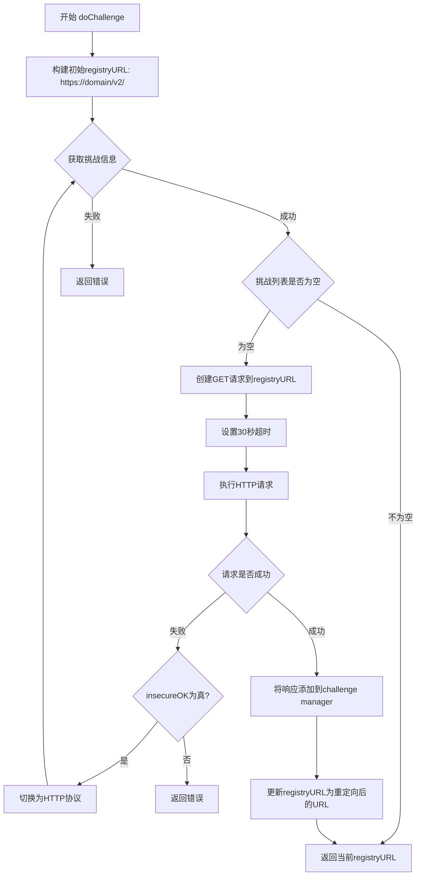
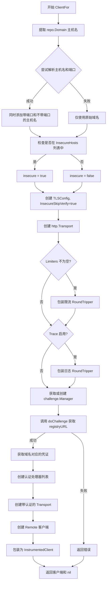
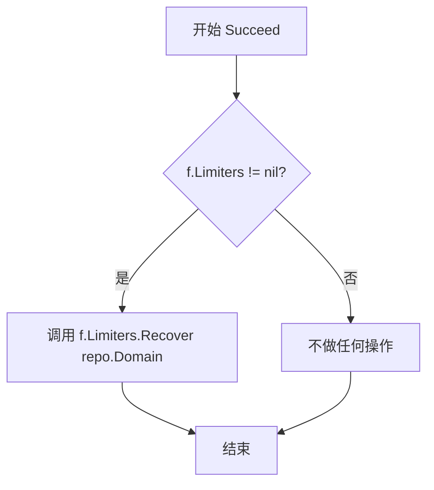
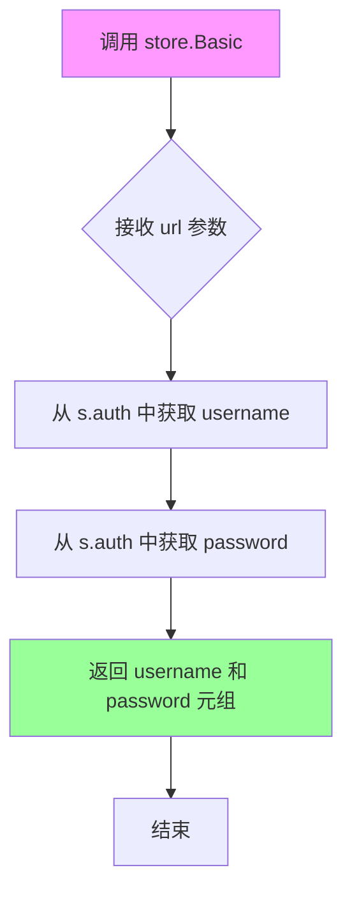
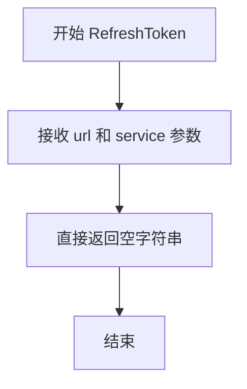
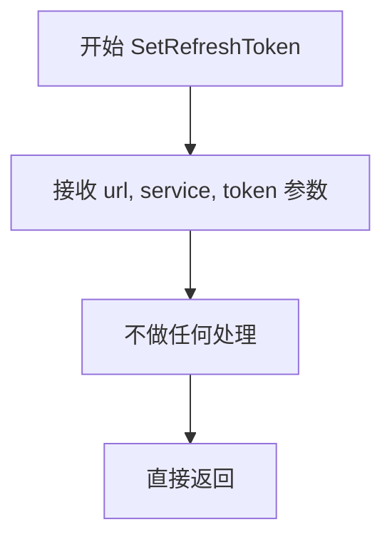

# `flux\pkg\registry\client_factory.go` 详细设计文档

This file implements a `RemoteClientFactory` for creating HTTP clients tailored for Docker registries. It handles TLS configuration (including insecure fallbacks), rate limiting, request logging, and crucially, discovers and handles authentication challenges (Basic/Ticket) by probing the registry endpoint, ultimately returning an instrumented client for image operations.

## 整体流程

```mermaid
graph TD
    Start[ClientFor(repo, creds)] --> BuildHostList[Build repoHosts list from Domain]
    BuildHostList --> CheckInsecure{Is Host in InsecureHosts?}
    CheckInsecure -- Yes --> SetInsecure[Set insecure = true]
    CheckInsecure -- No --> CreateTLS[Create TLS Config]
    SetInsecure --> CreateTLS
    CreateTLS --> BuildTransport[Create Base HTTP Transport]
    BuildTransport --> WrapLimiter{Limiters != nil?}
    WrapLimiter -- Yes --> ApplyLimiter[Wrap with RateLimiter]
    WrapLimiter -- No --> WrapLogger{Trace == true?}
    ApplyLimiter --> WrapLogger
    WrapLogger -- Yes --> ApplyLogger[Wrap with Logging transport]
    WrapLogger -- No --> GetChallengeMgr[Get/Create ChallengeManager]
    ApplyLogger --> GetChallengeMgr
    GetChallengeMgr --> DoChallenge[Call doChallenge to ping /v2/]
    DoChallenge --> SetupAuth[Create Auth Handlers (Token, Basic)]
    SetupAuth --> WrapAuth[Wrap Transport with Authorizer]
    WrapAuth --> CreateRemote[Create Remote Client]
    CreateRemote --> WrapInstrument[Wrap with InstrumentedClient]
    WrapInstrument --> ReturnClient[Return Client]
```

## 类结构

```
RemoteClientFactory (工厂类，负责创建Registry客户端)
├── logging (日志装饰器)
└── store (凭证存储适配器)
```

## 全局变量及字段


### `RemoteClientFactory.Logger`
    
日志实例，用于记录操作信息

类型：`log.Logger`
    


### `RemoteClientFactory.Limiters`
    
速率限制器，用于控制请求频率

类型：`*middleware.RateLimiters`
    


### `RemoteClientFactory.Trace`
    
是否开启请求日志，记录HTTP请求和响应状态

类型：`bool`
    


### `RemoteClientFactory.InsecureHosts`
    
允许非HTTPS的主机列表，用于配置可信的非安全连接

类型：`[]string`
    


### `RemoteClientFactory.mu`
    
线程安全锁，用于保护challengeManager的并发访问

类型：`sync.Mutex`
    


### `RemoteClientFactory.challengeManager`
    
认证挑战管理器，用于处理Docker Registry的认证挑战

类型：`challenge.Manager`
    


### `logging.logger`
    
日志实例，用于记录HTTP请求和响应信息

类型：`log.Logger`
    


### `logging.transport`
    
底层传输层，用于执行实际的HTTP请求

类型：`http.RoundTripper`
    


### `store.auth`
    
凭证对象，存储用于认证的用户名和密码

类型：`creds`
    
    

## 全局函数及方法


### RemoteClientFactory.doChallenge

该方法是远程客户端工厂的核心方法，负责发现并处理Docker Registry的认证挑战（Challenge）。它首先尝试从challenge manager获取已知的认证挑战信息，如果不存在，则向registry端点发送HTTP请求以获取挑战，并处理可能的HTTP到HTTPS的重定向，最终返回实际的registry访问URL。

参数：

- `manager`：`challenge.Manager`，用于管理和存储认证挑战信息的管理器
- `tx`：`http.RoundTripper`，HTTP传输层，用于执行实际的HTTP请求
- `domain`：`string`，要访问的Docker Registry的域名
- `insecureOK`：`bool`，是否允许使用不安全的连接（HTTP或跳过TLS验证）

返回值：`*url.URL`，成功时返回经过重定向处理后的最终registry URL；`error`，发生错误时返回错误信息

#### 流程图



#### 带注释源码

```go
func (f *RemoteClientFactory) doChallenge(manager challenge.Manager, tx http.RoundTripper, domain string, insecureOK bool) (*url.URL, error) {
	// 初始化registry URL，使用HTTPS协议和/v2/路径
	registryURL := url.URL{
		Scheme: "https",
		Host:   domain,
		Path:   "/v2/",
	}

	// 在知道如何授权之前，需要确定主机将发送哪些授权挑战
	// 首先检查之前是否已经获取过挑战信息
attemptChallenge:
	// 从challenge manager获取该registry URL对应的认证挑战列表
	cs, err := manager.GetChallenges(registryURL)
	if err != nil {
		// 获取挑战失败，返回错误
		return nil, err
	}
	
	// 如果没有已知的挑战，需要向registry端点发起请求获取挑战
	if len(cs) == 0 {
		// 没有先前的挑战；尝试ping registry端点以获取挑战
		// http.Client 会跟随重定向，所以即使我们认为是HTTP不安全主机，
		// 最终可能会请求HTTPS
		req, err := http.NewRequest("GET", registryURL.String(), nil)
		if err != nil {
			return nil, err
		}
		// 设置30秒超时上下文
		ctx, cancel := context.WithTimeout(req.Context(), 30*time.Second)
		defer cancel()
		
		// 执行HTTP请求
		res, err := (&http.Client{
			Transport: tx,
		}).Do(req.WithContext(ctx))
		if err != nil {
			// 请求失败，如果允许不安全连接，则回退到HTTP
			if insecureOK {
				registryURL.Scheme = "http"
				insecureOK = false
				goto attemptChallenge  // 重新尝试获取挑战
			}
			return nil, err
		}
		defer res.Body.Close()
		
		// 将响应添加到challenge manager以解析其中的认证挑战信息
		if err = manager.AddResponse(res); err != nil {
			return nil, err
		}
		
		// 更新registryURL为重定向后的URL（可能是HTTP->HTTPS）
		registryURL = *res.Request.URL
	}
	// 返回最终的registry URL（经过重定向处理）
	return &registryURL, nil
}
```


### RemoteClientFactory.ClientFor

创建并返回一个配置好的远程仓库客户端实例，包含TLS设置、认证处理、限流和监控装饰。

参数：

- `repo`：`image.CanonicalName`，镜像仓库的规范名称，包含域名和镜像路径
- `creds`：`Credentials`，用于访问仓库的凭证信息（用户名、密码等）

返回值：`Client`，远程仓库客户端接口；`error`，创建过程中的错误信息

#### 流程图



#### 带注释源码

```go
// ClientFor 为指定的仓库和凭证创建并返回一个配置好的客户端实例
// 参数：
//   - repo: image.CanonicalName，镜像仓库的规范名称
//   - creds: Credentials，访问仓库所需的凭证
// 返回值：
//   - Client: 配置好的远程仓库客户端
//   - error: 创建过程中的错误信息
func (f *RemoteClientFactory) ClientFor(repo image.CanonicalName, creds Credentials) (Client, error) {
	// 1. 从仓库域名构建主机列表，支持带端口和不带端口两种形式
	repoHosts := []string{repo.Domain}
	// 尝试解析主机名和端口，如果成功则同时添加不带端口的主机名
	repoHostWithoutPort, _, err := net.SplitHostPort(repo.Domain)
	if err == nil {
		// 解析成功说明原域名包含端口，添加不含端口的版本以便匹配
		repoHosts = append(repoHosts, repoHostWithoutPort)
	}

	// 2. 检查目标主机是否在允许非安全连接的主机列表中
	insecure := false
insecureCheckLoop:
	// 遍历不安全主机列表与仓库主机列表进行匹配
	for _, h := range f.InsecureHosts {
		for _, repoHost := range repoHosts {
			if h == repoHost {
				insecure = true
				break insecureCheckLoop
			}
		}
	}

	// 3. 配置 TLS，InsecureSkipVerify 根据 insecure 标志设置
	tlsConfig := &tls.Config{
		InsecureSkipVerify: insecure,
	}
	// 4. 创建 HTTP Transport，配置连接池参数以控制资源使用
	// 由于每个扫描都会创建新实例，需要严格控制空闲连接数
	var tx http.RoundTripper = &http.Transport{
		TLSClientConfig: tlsConfig,
		MaxIdleConns:    10,        // 最多保持10个空闲连接
		IdleConnTimeout: 10 * time.Second, // 空闲连接10秒后关闭
		Proxy:           http.ProxyFromEnvironment, // 支持环境变量代理
	}

	// 5. 如果配置了限流器，则包装 Transport 以实现速率限制
	if f.Limiters != nil {
		tx = f.Limiters.RoundTripper(tx, repo.Domain)
	}

	// 6. 如果启用了 Trace，则包装日志记录 Transport
	if f.Trace {
		tx = &logging{f.Logger, tx}
	}

	// 7. 获取或创建 Challenge Manager，用于处理认证挑战
	f.mu.Lock()
	if f.challengeManager == nil {
		f.challengeManager = challenge.NewSimpleManager()
	}
	manager := f.challengeManager
	f.mu.Unlock()

	// 8. 执行 Challenge 流程，确定认证方式和获取 registry URL
	registryURL, err := f.doChallenge(manager, tx, repo.Domain, insecure)
	if err != nil {
		return nil, err
	}

	// 9. 获取该域名对应的认证凭证
	cred := creds.credsFor(repo.Domain)
	// 10. 记录认证信息日志（仅在 Trace 模式下）
	if f.Trace {
		f.Logger.Log("repo", repo.String(), "auth", cred.String(), "api", registryURL.String())
	}

	// 11. 配置认证处理器列表：Token 认证和 Basic 认证
	authHandlers := []auth.AuthenticationHandler{
		// Token 处理器用于拉取镜像
		auth.NewTokenHandler(tx, &store{cred}, repo.Image, "pull"),
		// Basic 认证作为后备方案
		auth.NewBasicHandler(&store{cred}),
	}
	// 12. 创建带认证的 Transport
	tx = transport.NewTransport(tx, auth.NewAuthorizer(manager, authHandlers...))

	// 13. 创建基础 Remote 客户端，仅包含 scheme 和 host
	registryURL.Path = ""
	client := &Remote{transport: tx, repo: repo, base: registryURL.String()}

	// 14. 返回仪表化包装后的客户端，用于监控和限流恢复
	return NewInstrumentedClient(client), nil
}
```


### `RemoteClientFactory.Succeed`

该方法用于在仓库元数据成功获取后恢复速率限制，允许客户端在成功请求后提升对特定仓库的请求速率限制。

参数：

- `repo`：`image.CanonicalName`，镜像仓库的规范名称，包含仓库的域名和镜像名称信息

返回值：`无`（void），该方法仅执行副作用操作，不返回任何值

#### 流程图



#### 带注释源码

```go
// Succeed exists merely so that the user of the ClientFactory can
// bump rate limits up if a repo's metadata has successfully been
// fetched.
// Succeed 方法的存在是为了让 ClientFactory 的使用者能够在
// 仓库的元数据成功获取后提升速率限制
func (f *RemoteClientFactory) Succeed(repo image.CanonicalName) {
	// 仅当 Limiters 存在时才执行恢复操作
	// 这样可以在没有配置速率限制器时安全调用此方法
	if f.Limiters != nil {
		// 调用 Limiters 的 Recover 方法，传入仓库的域名
		// 以恢复该域名对应的速率限制
		f.Limiters.Recover(repo.Domain)
	}
}
```


### `logging.RoundTrip(req)`

该方法是HTTP RoundTripper中间件，拦截并记录HTTP请求及其响应状态或错误信息，用于调试和追踪HTTP通信过程。

参数：

- `req`：`*http.Request`，传入的HTTP请求对象，包含了请求的URL、方法、头部等信息

返回值：

- `*http.Response`：底层transport处理后返回的HTTP响应对象
- `error`：如果请求过程中发生错误，则返回错误信息；否则返回nil

#### 流程图

```mermaid
flowchart TD
    A[开始 RoundTrip] --> B[调用 t.transport.RoundTrip(req)]
    B --> C{err == nil?}
    C -->|是| D[记录日志: URL + status]
    C -->|否| E[记录日志: URL + err]
    D --> F[返回 res, nil]
    E --> G[返回 res, err]
    F --> H[结束]
    G --> H
```

#### 带注释源码

```go
// RoundTrip 实现 http.RoundTripper 接口
// 拦截每个 HTTP 请求/响应并记录日志
func (t *logging) RoundTrip(req *http.Request) (*http.Response, error) {
	// 1. 调用底层 transport 执行实际的 HTTP 请求
	res, err := t.transport.RoundTrip(req)
	
	// 2. 判断请求是否成功
	if err == nil {
		// 请求成功，记录 URL 和响应状态码
		t.logger.Log("url", req.URL.String(), "status", res.Status)
	} else {
		// 请求失败，记录 URL 和错误信息
		t.logger.Log("url", req.URL.String(), "err", err.Error())
	}
	
	// 3. 返回原始响应和错误（让调用方决定如何处理）
	return res, err
}
```

---

### 补充说明

#### 关键组件信息

| 组件名称 | 一句话描述 |
|---------|-----------|
| `logging` | HTTP传输层中间件，用于日志记录HTTP请求/响应 |
| `RemoteClientFactory` | 远程仓库客户端工厂，管理HTTP客户端创建和认证挑战处理 |
| `Remote` | 远程镜像仓库的客户端实现 |

#### 设计目标与约束

- **装饰器模式**：通过实现`http.RoundTripper`接口，以装饰器模式包装底层传输层
- **非侵入性**：不影响原有HTTP请求流程，仅做日志记录
- **条件启用**：通过`RemoteClientFactory.Trace`字段控制是否启用日志记录功能

#### 潜在技术债务或优化空间

1. **日志格式统一性**：当前日志输出依赖`go-kit/log`库，建议定义结构化日志格式规范
2. **敏感信息过滤**：未对请求URL中的敏感信息（如token参数）进行脱敏处理
3. **性能考量**：在高并发场景下，日志记录可能成为性能瓶颈，可考虑采样或异步日志

#### 错误处理设计

- 本方法采用**透明传递**策略：不吞没错误，仅记录后原样返回
- 错误日志记录使用`err.Error()`转换，避免nil指针问题

#### 数据流

```
HTTP请求 → logging.RoundTrip() 
         → t.transport.RoundTrip() (实际请求)
         → 记录日志 (成功/失败)
         → 返回响应和错误
```


### `store.Basic`

实现 `auth.CredentialsStore` 接口的 Basic 方法，用于从预选的凭据集中获取用户名和密码。该方法接收一个 URL 参数（实现接口所需），返回存储的用户名和密码字符串元组。

参数：

- `url`：`*url.URL`，目标 registry 的 URL 地址（虽然当前实现中未使用，但为满足 `auth.CredentialsStore` 接口而保留）

返回值：`(string, string)`，第一个字符串为用户名，第二个字符串为密码

#### 流程图



#### 带注释源码

```go
// store adapts a set of pre-selected creds to be an
// auth.CredentialsStore
// store 结构体用于将一组预选的凭据适配为 auth.CredentialsStore 接口
type store struct {
	auth creds // 存储凭据的结构体，包含 username 和 password 字段
}

// Basic 是实现 auth.CredentialsStore 接口的方法
// 用于获取基本的认证凭据（用户名和密码）
// 参数 url 虽然在接口定义中需要，但当前实现中未使用
func (s *store) Basic(url *url.URL) (string, string) {
	// 返回存储的用户名和密码
	return s.auth.username, s.auth.password
}
```


### `store.RefreshToken`

这是 `store` 类型的一个方法，用于实现 `auth.CredentialsStore` 接口的 `RefreshToken` 方法。当前实现为空，直接返回空字符串，表示不提供刷新令牌功能。

参数：

- `url`：`*url.URL`，需要认证的 registry URL
- `service`：`string`，服务名称

返回值：`string`，刷新令牌（当前实现返回空字符串）

#### 流程图



#### 带注释源码

```go
// RefreshToken 实现 auth.CredentialsStore 接口
// 用于获取与给定 URL 和服务关联的刷新令牌
// 当前为空实现，返回空字符串
func (s *store) RefreshToken(url *url.URL, service string) string {
    // 该方法用于 OAuth2 认证流程中的刷新令牌获取
    // 当前未实现具体逻辑，直接返回空字符串
    // 在需要支持令牌刷新的场景下，应从 s.auth 中获取对应的刷新令牌
    return ""
}
```


### `store.SetRefreshToken`

该方法是一个空实现，用于满足 `auth.CredentialsStore` 接口的约定，但实际上并不存储刷新令牌（Refresh Token）。在当前实现中，刷新令牌功能未被使用，方法直接返回而不执行任何操作。

参数：

- 第一个参数（隐式）：`*url.URL`，目标服务的URL地址
- 第二个参数：`string`，服务标识符（未使用）
- 第三个参数：`string`，刷新令牌值（未使用）

返回值：无（`void`），该方法不返回任何值

#### 流程图



#### 带注释源码

```go
// SetRefreshToken 是 auth.CredentialsStore 接口的实现方法
// 该方法用于在获取新的访问令牌时存储刷新令牌，以便后续使用
// 当前实现为空操作，不存储任何刷新令牌信息
//
// 参数:
//   - url: *url.URL, 目标服务的URL地址
//   - service: string, 服务标识符（当前未使用）
//   - token: string, 刷新令牌字符串（当前未使用）
func (s *store) SetRefreshToken(*url.URL, string, string) {
	return // 空实现，直接返回，不执行任何操作
}
```

## 关键组件


### RemoteClientFactory

远程客户端工厂类，负责创建与Docker registry交互的客户端实例。核心功能是封装TLS配置、速率限制、认证挑战处理和授权流程，支持安全连接和多种认证方式。

### logging

HTTP传输日志包装器，实现了http.RoundTripper接口，用于记录每个HTTP请求的URL和响应状态或错误信息，便于调试和跟踪registry通信。

### doChallenge

认证挑战处理方法，负责与registry服务器建立初始连接以获取认证挑战信息。自动处理HTTP/HTTPS重定向，支持不安全连接回退，并返回最终的registry URL。

### ClientFor

客户端创建方法，根据给定的仓库名称和凭证创建完整的HTTP客户端。包含TLS配置、速率限制包装、认证处理链构建，并返回带仪表化的客户端实例。

### Succeed

速率限制恢复方法，当仓库元数据成功获取后调用，用于恢复该仓库域名的速率限制配额。

### store

凭证存储适配器结构体，实现了auth.CredentialsStore接口，提供Basic认证的用户名密码获取以及Token相关的存根实现。

### Credentials

代码中引用的凭证类型（cred.credsFor方法），用于提供仓库认证所需的username和password信息。

### middleware.RateLimiters

速率限制器组件，通过RoundTripper包装HTTP传输，实现对各仓库域名的请求速率控制。

### challenge.Manager

认证挑战管理器，负责解析和存储registry返回的认证挑战信息，用于后续授权决策。


## 问题及建议


### 已知问题

-   **使用 goto 语句**：在 `doChallenge` 方法中使用了 `goto attemptChallenge` 进行控制流跳转，这种做法降低了代码的可读性和可维护性，是结构化编程中的不良实践
-   **硬编码的魔法数字**：代码中多处使用硬编码值，如 `30*time.Second`（30秒超时）、`MaxIdleConns: 10`、`IdleConnTimeout: 10 * time.Second`，这些值应该作为配置参数提取出来
-   **凭据信息可能泄露**：在 `ClientFor` 方法中，当 `f.Trace` 为 true 时，会通过 `f.Logger.Log("repo", repo.String(), "auth", cred.String(), ...)` 打印凭据信息，这可能导致敏感凭据数据被记录到日志中
-   **资源泄露风险**：在 `doChallenge` 方法中，`res.Body.Close()` 没有检查返回的错误，如果关闭失败可能导致资源泄露
-   **不安全的 HTTP 回退**：当 HTTPS 请求失败时，代码会自动降级到 HTTP（`registryURL.Scheme = "http"`），这在生产环境中可能带来安全风险
-   **TLS 配置不完善**：`tls.Config` 仅设置了 `InsecureSkipVerify`，缺少对密码套件、协议版本等安全参数的配置
-   **缺乏连接池管理**：每个 `ClientFor` 调用都创建新的 `http.Transport`，没有复用 transport，可能导致连接资源浪费

### 优化建议

-   **消除 goto 语句**：将 `doChallenge` 方法重构为使用循环结构，消除 `goto` 语句以提高代码可读性
-   **配置化**：将硬编码的超时时间、连接池参数等提取为 `RemoteClientFactory` 的可配置字段或配置结构体
-   **凭据日志脱敏**：在日志输出时对凭据进行脱敏处理，避免敏感信息泄露，例如只记录凭据类型而不记录实际值
-   **完善错误处理**：确保 `res.Body.Close()` 使用 `defer` 并检查错误，或使用 `ioutil.NopCloser` 忽略不重要的关闭错误
-   **安全强化**：添加对 HTTP 回退的警告或限制，配置更严格的 TLS 选项（如设置 `MinVersion`、`CipherSuites` 等）
-   **连接池优化**：考虑在 `RemoteClientFactory` 级别复用 transport 和 TLS 配置，或使用连接池管理
-   **增加单元测试**：为关键方法（特别是 `doChallenge` 和 `ClientFor`）添加单元测试，确保各种边界条件和错误场景的正确处理
-   **接口分离**：考虑将 `RemoteClientFactory` 抽象为接口，便于单元测试和依赖注入


## 其它


### 设计目标与约束

**目标**：为FluxCD提供与Docker镜像仓库交互的远程客户端创建能力，支持多种认证方式（Basic Auth、Token Auth），处理TLS连接和授权挑战，并提供速率限制功能。

**约束**：
- 依赖Docker Distribution的认证和传输层库
- 必须支持HTTP/HTTPS切换（当HTTPS失败时降级到HTTP）
- 连接池限制：最多10个空闲连接，空闲超时10秒
- 请求超时：30秒
- 线程安全：通过sync.Mutex保护challengeManager的初始化

### 错误处理与异常设计

**错误分类**：
1. 网络错误：registry连接失败、超时（30秒超时控制）
2. 认证错误：凭据无效、Token获取失败
3. TLS错误：证书验证失败（可通过InsecureSkipVerify绕过）
4. 挑战解析错误：无法解析WWW-Authenticate头

**异常处理策略**：
- `doChallenge`方法中，当HTTPS请求失败且`insecureOK=true`时，降级到HTTP并重试
- 授权挑战为空时，主动发送GET请求触发挑战
- 资源响应体必须使用`defer`关闭
- 所有错误通过`log.Logger`记录

### 数据流与状态机

**主要数据流**：
1. 创建Client流程：ClientFor → doChallenge → 获取挑战 → 创建transport → 返回InstrumentedClient
2. 认证流程：先获取挑战 → 根据挑战类型选择TokenHandler或BasicHandler
3. 请求流程：RoundTrip → logging记录 → 速率限制 → 认证 → 发送请求

**状态转换**：
- TLS状态：HTTPS（默认）→ HTTP（降级）
- 挑战状态：空挑战 → 获取挑战 → 缓存挑战
- 连接状态：新建 → 活跃 → 空闲（可能被关闭）

### 外部依赖与接口契约

**关键依赖**：
- `github.com/docker/distribution/registry/client/auth`：认证处理器
- `github.com/docker/distribution/registry/client/auth/challenge`：挑战管理
- `github.com/docker/distribution/registry/client/transport`：传输层组装
- `github.com/go-kit/kit/log`：日志接口
- `github.com/fluxcd/flux/pkg/image`：镜像名称抽象
- `github.com/fluxcd/flux/pkg/registry/middleware`：速率限制

**接口契约**：
- `ClientFor(repo image.CanonicalName, creds Credentials) (Client, error)`：返回客户端实例
- `NewInstrumentedClient(client Client) Client`：包装已有客户端添加仪表化功能
- `Credentials`接口：需提供`credsFor(domain string)`方法返回具体凭据

### 性能考虑与限制

**连接管理**：
- HTTP Transport配置：MaxIdleConns=10, IdleConnTimeout=10s
- 每个仓库扫描都会创建新的ClientFactory实例，需注意资源清理

**速率限制**：
- 支持通过`middleware.RateLimiters`进行请求速率控制
- `Succeed`方法用于在成功获取仓库元数据后恢复速率限制配额

**并发安全**：
- `challengeManager`使用互斥锁保护初始化
- `InsecureHosts`检查存在竞态条件可能（遍历和赋值非原子操作）

### 安全性设计

**TLS安全**：
- 支持自定义TLS配置
- `InsecureSkipVerify`选项允许跳过证书验证（仅用于测试或内部网络）
- 支持通过`InsecureHosts`列表配置可信的非安全主机

**凭据管理**：
- 凭据通过`Credentials`接口抽象
- `store`结构体将凭据适配为Docker Distribution所需的`auth.CredentialsStore`接口
- 支持Basic Auth和Token Auth两种方式

### 并发模型与线程安全

**线程安全**：
- `challengeManager`的读写通过`sync.Mutex`保护
- `Limiters`的访问未加锁（假设在调用前已完成初始化）

**潜在竞态**：
- `InsecureHosts`的遍历和`insecure`标志的设置非原子操作
- `repoHosts`切片构建过程中可能存在竞态

### 配置管理

**配置项**：
- `Logger`：日志记录器
- `Limiters`：速率限制器（可选）
- `Trace`：是否启用请求追踪
- `InsecureHosts`：允许非安全连接的主机列表

### 资源生命周期管理

**资源创建**：
- 每次调用`ClientFor`创建新的HTTP Client和Transport
- challengeManager在首次使用时初始化

**资源释放**：
- HTTP响应体必须关闭
- Transport的空闲连接会在IdleConnTimeout后自动关闭

### 测试策略建议

**单元测试**：
- `doChallenge`方法的挑战处理逻辑
- `ClientFor`的凭据构建和传输链组装
- `store`结构体的凭据适配

**集成测试**：
- 与真实registry的连接测试
- 多种认证场景（Basic、Token、无认证）
- TLS/HTTPS降级场景

    