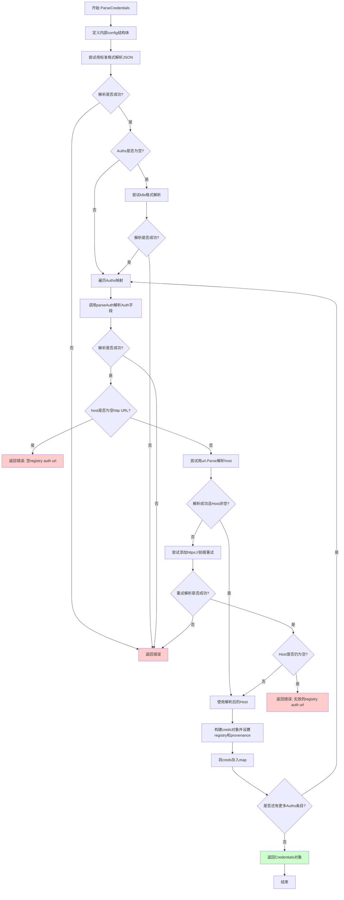
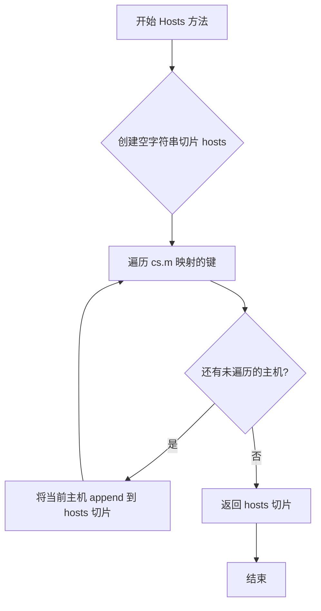

# `flux\pkg\registry\credentials.go` 详细设计文档

该代码实现了一个Docker registry凭证管理模块，核心功能是解析和管理多种Docker registry（如Docker Hub、GCR、Google Artifact Registry、Azure Container Registry等）的认证凭证，支持从JSON配置文件读取凭证、处理URL规范化、并为特定镜像仓库提供OAuth或AAD认证支持。

## 整体流程

```mermaid
graph TD
    A[开始] --> B{解析JSON配置}
B --> C{检查Auths字段}
C -->|有数据| D[遍历Auths映射]
C -->|无数据| E[尝试k8s格式解析]
D --> F[调用parseAuth解析base64]
F --> G{解析成功?}
G -->|否| H[返回错误]
G -->|是| I{host是否为空?}
I -->|是| J[规范化URL处理]
I -->|否| K[提取host]
J --> L{规范化成功?}
L -->|否| M[返回错误]
L -->|是| K
K --> N[构建creds对象]
N --> O[存储到map并返回]
E --> D
O --> P[结束]

graph TD
    Q[ImageCredsWithDefaults调用] --> R{读取配置文件}
R --> S{文件存在?}
S -->|否| T[返回nil错误]
S -->|是| U[ParseCredentials验证]
U --> V{验证成功?}
V -->|否| W[返回错误]
V -->|是| X[返回闭包函数]
X --> Y{闭包被调用}
Y --> Z[读取并解析配置文件]
Z --> AA[获取lookup的ImageCreds]
AA --> AB[遍历镜像凭证]
AB --> AC[合并默认值]
AC --> AD[返回合并后的凭证]
```

## 类结构

```
creds (内部结构体)
└── 字段: username, password, registry, provenance
Credentials (公开结构体)
└── 字段: m map[string]creds
```

## 全局变量及字段


### `config`
    
用于解析Docker配置文件JSON的结构体

类型：`struct { Auths map[string]struct { Auth string } }`
    


### `creds.username`
    
Docker registry用户名

类型：`string`
    


### `creds.password`
    
Docker registry密码

类型：`string`
    


### `creds.registry`
    
registry主机地址

类型：`string`
    


### `creds.provenance`
    
凭证来源标识

类型：`string`
    


### `Credentials.m`
    
存储多个registry主机凭证的映射

类型：`map[string]creds`
    
    

## 全局函数及方法


### NoCredentials()

该函数用于创建一个空的、可用的 Credentials 对象，以便在未提供任何凭证时作为默认值或初始状态使用。

参数： 无

返回值： `Credentials`，返回一个空的凭证对象，其内部映射表初始化为空 map，可安全用于后续的凭证查找和合并操作。

#### 流程图

```mermaid
flowchart TD
    A[开始 NoCredentials] --> B[创建空的 map[string]creds]
    B --> C[初始化 Credentials 结构体]
    C --> D[返回 Credentials 对象]
```

#### 带注释源码

```go
// NoCredentials returns a usable but empty credentials object.
// 该函数返回一个可用的但为空的凭证对象，用于在没有凭证或作为默认凭证的场景。
// 返回的 Credentials 对象包含一个空的 map，可以安全地进行查询和合并操作。
func NoCredentials() Credentials {
	return Credentials{
		m: map[string]creds{},
	}
}
```

### Credentials 结构体

#### 类字段

| 字段名称 | 类型 | 描述 |
|---------|------|------|
| m | map[string]creds | 存储 registry 主机名到凭证的映射关系 |

#### 类方法（部分相关）

| 方法名称 | 功能描述 |
|---------|----------|
| Merge() | 合并另一个 Credentials 对象的凭证到当前对象 |
| Hosts() | 返回所有已配置的 registry 主机列表 |
| credsFor() | 根据主机名获取对应的凭证，支持 GCR、Azure 等云_registry 特殊处理 |
| String() | 返回 Credentials 的字符串表示形式 |

### 关键组件信息

| 组件名称 | 描述 |
|---------|------|
| creds | 内部凭证结构体，存储 username、password、registry、provenance 等信息 |
| Credentials | 对外暴露的凭证容器，管理多个 registry 的凭证映射 |
| NoCredentials() | 工厂函数，创建空的 Credentials 实例作为默认值 |

### 潜在技术债务与优化空间

1. **空凭证判断方式**：当前使用 `(creds{}) == c` 判断是否为空凭证，这种基于值比较的方式在某些边界情况下可能不够健壮
2. **错误处理**：NoCredentials 函数本身无错误处理，但调用方应考虑空凭证与无效凭证的区分
3. **并发安全**：Credentials 结构体的 map 操作非线程安全，高并发场景下可能需要加锁或使用 sync.Map

### 其他项目说明

- **设计目标**：提供一种安全、默认的凭证状态，避免使用 nil map 导致的空指针异常
- **使用场景**：初始化配置、作为默认凭证 fallback、测试环境等
- **外部依赖**：无外部依赖，仅依赖标准库和内部类型


### parseAuth

该函数是凭据解析的核心逻辑，接收一个Base64编码的认证字符串（如 `username:password`），首先对其进行Base64解码，然后按冒号分割以提取用户名和密码，最后封装成 `creds` 结构体返回。如果解码失败或格式不正确，则返回相应的错误。

参数：

-  `auth`：`string`，Base64编码的认证字符串。

返回值：

-  `creds`：包含用户名和密码的凭据结构体。
-  `error`：如果发生解码错误或格式错误（缺少冒号分隔符），则返回错误；否则返回 nil。

#### 流程图

```mermaid
graph TD
    A[Start parseAuth] --> B[Base64 Decode auth]
    B --> C{Decode Error?}
    C -->|Yes| D[Return Error]
    C -->|No| E[Split String by ':' (limit 2)]
    E --> F{Count == 2?}
    F -->|No| G[Return Error: Invalid format]
    F -->|Yes| H[Initialize creds struct]
    H --> I[Return creds, nil]
    D --> I
```

#### 带注释源码

```go
// parseAuth 解析一个base64编码的认证字符串
// auth: 格式为 "username:password" 的base64编码字符串
// 返回解析后的 creds 结构体和可能的错误
func parseAuth(auth string) (creds, error) {
	// 步骤1: 使用标准Base64编码解码字符串
	decodedAuth, err := base64.StdEncoding.DecodeString(auth)
	if err != nil {
		// 如果解码失败（例如不是有效的Base64），立即返回错误
		return creds{}, err
	}

	// 步骤2: 将解码后的字符串按冒号分割
	// 使用 SplitN 限制分割为2部分，这样如果密码本身包含冒号，
	// 剩余的部分也会被保留在第二项中 (authParts[1])
	authParts := strings.SplitN(string(decodedAuth), ":", 2)

	// 步骤3: 验证分割结果
	// 必须恰好有用户名(第0项)和密码(第1项)
	if len(authParts) != 2 {
		return creds{},
			fmt.Errorf("decoded credential has wrong number of fields (expected 2, got %d)", len(authParts))
	}

	// 步骤4: 构造并返回凭据结构体
	return creds{
		username: authParts[0],
		password: authParts[1],
	}, nil
}
```


### `ParseCredentials`

从JSON字节数组解析凭证配置，支持标准Docker配置文件格式和Kubernetes配置格式，处理各种URL格式并规范化主机名。

参数：

- `from`：`string`，配置来源标识，通常为配置文件路径，用于记录凭证的来源
- `b`：`[]byte`，JSON格式的凭证配置字节数组，包含Auths映射

返回值：`Credentials`，解析成功时返回包含所有解析后凭证的Credentials对象；`error`，解析过程中发生的任何错误

#### 流程图



#### 带注释源码

```go
// ParseCredentials 从JSON字节数组解析凭证配置
// 支持标准Docker配置文件格式和Kubernetes配置格式
// from: 配置来源标识（通常为配置文件路径）
// b: JSON格式的凭证配置字节数组
func ParseCredentials(from string, b []byte) (Credentials, error) {
	// 定义内部结构体用于解析JSON
	// Auths映射的值为嵌套结构体，只包含Auth字段
	var config struct {
		Auths map[string]struct {
			Auth string
		}
	}
	
	// 第一次尝试：标准Docker配置文件格式
	// JSON结构为 {"auths": {"hostname": {"auth": "base64(user:pass)"}}}
	if err := json.Unmarshal(b, &config); err != nil {
		return Credentials{}, err
	}
	
	// 如果是Kubernetes格式，不包含外层"Auths"包装
	// 尝试直接解析为Auths映射
	// Kubernetes格式: {"gcr.io": {"auth": "base64(user:pass)"}}
	if len(config.Auths) == 0 {
		if err := json.Unmarshal(b, &config.Auths); err != nil {
			return Credentials{}, err
		}
	}
	
	// 创建用于存储解析后凭证的map
	m := map[string]creds{}
	
	// 遍历所有认证条目
	for host, entry := range config.Auths {
		// 解析base64编码的认证信息
		creds, err := parseAuth(entry.Auth)
		if err != nil {
			return Credentials{}, err
		}

		// 验证：检查host是否为空的HTTP/HTTPS协议前缀
		if host == "http://" || host == "https://" {
			return Credentials{}, errors.New("Empty registry auth url")
		}

		// 处理用户可能传入的各种URL格式:
		// - http://docker.io
		// - http://docker.io/v1/
		// - 仅IP地址
		// - IP:端口格式
		// 需要提取纯粹的host部分
		u, err := url.Parse(host)

		// 如果解析失败或host为空，尝试添加https://前缀
		if err != nil || u.Host == "" {
			u, err = url.Parse(fmt.Sprintf("https://%s/", host))
			if err != nil {
				return Credentials{}, err
			}
		}

		// 二次验证：确保host不为空，否则配置无效
		if u.Host == "" {
			return Credentials{}, errors.New("Invalid registry auth url. Must be a valid http address (e.g. https://gcr.io/v1/)")
		}

		// 使用规范化后的host（不含路径）
		host = u.Host

		// 设置凭证的registry和provenance属性
		creds.registry = host
		creds.provenance = from
		m[host] = creds
	}
	
	// 返回包含所有解析后凭证的Credentials对象
	return Credentials{m: m}, nil
}
```


### `ImageCredsWithDefaults`

该函数接收一个用于查找镜像凭据的回调函数和配置文件路径，返回一个包装后的闭包函数。该闭包函数在执行时会将配置文件中的默认凭据与通过lookup函数获取的镜像凭据进行合并，为每个镜像提供默认凭据支持。

参数：

- `lookup`：`func() ImageCreds`，一个无参数、返回ImageCreds的函数，用于获取原始镜像凭据映射
- `configPath`：`string`，Docker/Container registry配置文件路径（通常是`~/.docker/config.json`或Kubernetes的`imagePullSecrets`配置）

返回值：

- `func() ImageCreds`：返回合并了默认凭据后的闭包函数
- `error`：预检查失败或配置文件解析错误时返回错误信息

#### 流程图

```mermaid
flowchart TD
    A[开始 ImageCredsWithDefaults] --> B[读取配置文件]
    B --> C{读取成功?}
    C -->|是| D[解析凭据]
    C -->|否| E{错误是否表示文件不存在?}
    E -->|否| F[返回 nil, err]
    E -->|是| G[跳过解析继续]
    D --> H{解析成功?}
    H -->|否| F
    H -->|是| I[返回闭包函数, nil]
    G --> I
    
    J[闭包函数被调用] --> K[重新读取配置文件]
    K --> L{读取成功?}
    L -->|是| M[解析默认凭据]
    L -->|否| N[defaults保持为空]
    M --> O[调用lookup获取镜像凭据]
    N --> O
    O --> P{遍历imageCreds}
    P -->|每个k, v| Q[创建新凭据对象]
    Q --> R[合并defaults]
    R --> S[合并v到新凭据]
    S --> T[更新imageCreds[k]]
    P -->|遍历完成| U[返回合并后的imageCreds]
```

#### 带注释源码

```go
// ImageCredsWithDefaults 返回一个闭包函数，该函数将默认凭据与lookup函数返回的镜像凭据合并
// 参数:
//   - lookup: func() ImageCreds - 用于获取镜像凭据的回调函数
//   - configPath: string - Docker配置文件路径
// 返回值:
//   - func() ImageCreds: 合并了默认凭据的闭包函数
//   - error: 预检查失败时返回错误
func ImageCredsWithDefaults(lookup func() ImageCreds, configPath string) (func() ImageCreds, error) {
	// 预检查：在返回闭包前先验证配置文件是否可读且格式正确
	// 这样可以尽早发现配置错误，而不是等到闭包实际执行时才失败
	bs, err := ioutil.ReadFile(configPath)
	if err == nil {
		// 尝试解析凭据，验证文件格式是否正确
		_, err = ParseCredentials(configPath, bs)
	}
	// 如果预检查失败，直接返回错误，闭包不会被返回
	if err != nil {
		return nil, err
	}

	// 返回闭包函数，该函数会在实际需要凭据时被调用
	return func() ImageCreds {
		var defaults Credentials
		// 每次闭包执行时都重新读取配置文件
		// 这样可以支持配置文件热更新，无需重启应用
		bs, err := ioutil.ReadFile(configPath)
		if err == nil {
			// 解析默认凭据，忽略错误（如果解析失败，使用空默认凭据）
			defaults, _ = ParseCredentials(configPath, bs)
		}
		
		// 调用原始lookup函数获取镜像凭据映射
		imageCreds := lookup()
		
		// 遍历每个镜像的凭据，将默认凭据合并进去
		for k, v := range imageCreds {
			// 创建新的空凭据对象
			newCreds := NoCredentials()
			// 先合并默认凭据
			newCreds.Merge(defaults)
			// 再合并当前镜像的特定凭据（特定凭据会覆盖默认凭据）
			newCreds.Merge(v)
			// 更新映射中的凭据
			imageCreds[k] = newCreds
		}
		
		// 返回合并后的凭据
		return imageCreds
	}, nil
}
```


### `creds.String()`

返回凭证的字符串表示形式，用于调试和日志输出。如果凭证是零值（空结构体），返回特定的占位符字符串；否则返回包含用户名、注册表和来源信息的格式化字符串。

参数：此方法没有显式参数（接收者为值类型 `creds`）

返回值：`string`，凭证的字符串表示形式

#### 流程图

```mermaid
flowchart TD
    A[开始 String 方法] --> B{检查是否为零值 creds}
    B -->|是| C[返回 "<zero creds>"]
    B -->|否| D[构建格式化字符串]
    D --> E[返回包含 username, registry, provenance 的字符串]
    C --> F[结束]
    E --> F
```

#### 带注释源码

```go
// String 返回凭证的字符串表示形式，用于调试和日志输出
// 如果凭证是空结构体（零值），返回特定的占位符字符串
// 否则返回包含用户名、注册表地址和来源的格式化描述
func (c creds) String() string {
	// 检查凭证是否为空结构体（未初始化状态）
	if (creds{}) == c {
		// 返回占位符，表示没有有效凭证
		return "<zero creds>"
	}
	// 格式化输出凭证信息，包含：用户名@注册表地址, 来源
	// 格式: <registry creds for {username}@{registry}, from {provenance}>
	return fmt.Sprintf("<registry creds for %s@%s, from %s>", c.username, c.registry, c.provenance)
}
```

---

#### 关联信息

**所属结构体 `creds` 的完整字段：**

| 字段名 | 类型 | 描述 |
|--------|------|------|
| `username` | `string` | 认证用户名 |
| `password` | `string` | 认证密码 |
| `registry` | `string` | 镜像仓库地址（主机名） |
| `provenance` | `string` | 凭证来源（如配置文件路径） |

**设计意图：**
- 提供人类可读的凭证描述，便于日志记录和调试
- 零值检查用于区分"未设置凭证"和"已设置但可能为空用户名的情况"
- 隐藏敏感密码信息，只暴露非敏感的 registry 和 provenance

**潜在优化空间：**
- 当前密码字段未在 String() 中输出，但结构体本身没有敏感信息保护机制（如日志脱敏）
- 如果后续需要支持更详细的调试模式，可考虑添加选项控制是否显示敏感字段


### `Credentials.String()`

返回Credentials的字符串表示，用于实现`fmt.Stringer`接口，便于调试和日志输出。

参数：
- （无显式参数，接收者 `cs` 为 `Credentials` 类型）

返回值：`string`，返回Credentials结构体中map的字符串表示，格式为`{...}`。

#### 流程图

```mermaid
flowchart TD
    A[开始 String] --> B{接收者cs是否为空}
    B -->|是| C[返回 {map[string]creds}]
    B -->|否| D[使用fmt.Sprintf格式化cs.m]
    C --> E[返回字符串]
    D --> E
```

#### 带注释源码

```go
// String 返回Credentials的字符串表示，实现fmt.Stringer接口
// 接收者: cs Credentials - Credentials结构体的实例
// 返回值: string - map的字符串表示，格式为 "{...}"
func (cs Credentials) String() string {
	// 使用fmt.Sprintf将内部map字段m格式化字符串
	// m的类型是map[string]creds，会被格式化为map的默认字符串形式
	return fmt.Sprintf("{%v}", cs.m)
}
```

---

### 补充说明

**设计意图**：
- 该方法实现了Go语言的`fmt.Stringer`接口，使得`Credentials`类型可以在打印时获得友好的字符串表示
- 用于调试、日志输出等场景，让开发者能够快速查看Credentials对象的内容

**关联类型**：
- `Credentials`：包含`m map[string]creds`字段的包装类型
- `creds`：内部结构体，存储单个registry的认证信息（username, password, registry, provenance）

**注意事项**：
- 该实现仅返回map的字符串表示，不会暴露敏感的username/password信息
- 如果需要更详细的调试信息，可以参考`creds`类型的`String()`方法，它会返回类似`<registry creds for username@registry, from provenance>`的格式


### Credentials.Hosts()

该方法遍历内部凭证映射 `cs.m` 的所有键（主机名），并将它们收集到一个字符串切片中返回，提供了获取所有已配置 Docker registry 主机列表的简单接口。

参数：此方法无参数。

返回值：`[]string`，返回所有已配置的可用的 registry 主机名列表。

#### 流程图



#### 带注释源码

```go
// Hosts returns all of the hosts available in these credentials.
// 返回所有已配置凭证中可用的主机列表
func (cs Credentials) Hosts() []string {
	// 初始化一个空字符串切片用于存储主机名
	hosts := []string{}
	// 遍历凭证映射 cs.m（类型为 map[string]creds）的键（即主机名）
	for host := range cs.m {
		// 将每个主机名追加到 hosts 切片中
		hosts = append(hosts, host)
	}
	// 返回包含所有主机名的字符串切片
	return hosts
}
```


### `Credentials.Merge`

该方法用于将另一个 `Credentials` 实例中的凭据合并到当前实例中。其核心逻辑是遍历传入凭据的 Map，并将其键值对覆盖写入当前实例的 Map 中。

参数：

-  `c`：`Credentials`，要合并进来的凭据对象。

返回值：`void`（无返回值）。

#### 流程图

```mermaid
graph TD
    A([Start Merge]) --> B{遍历传入凭据 c 的 Map (c.m)}
    B -->|获取键 k 和值 v| C[将当前实例 Map 对应键设为值 v<br>cs.m[k] = v]
    C --> B
    B -->|遍历结束| D([End])
    
    style C fill:#f9f,stroke:#333,stroke-width:2px
```

#### 带注释源码

```go
// Merge 将参数 c 中的凭据合并到接收者 cs 中。
// 如果两者包含相同的 Registry Host，c 中的凭据将覆盖 cs 中的凭据。
// 注意：虽然接收者是值类型 (Credentials)，但由于 Go 中 Map 是引用类型，
// 修改 cs.m 实际上会影响到调用者共享的底层数据结构。
func (cs Credentials) Merge(c Credentials) {
	// 遍历传入凭据 c 的内部 map
	for k, v := range c.m {
		// 将键值对写入当前实例的 map 中
		// 这里直接覆盖，如果 k 已存在，则用 v 替换旧值
		cs.m[k] = v
	}
}
```


### `Credentials.credsFor`

该方法根据给定的主机名返回对应的注册表凭证，如果本地存储中找不到，则尝试从云服务（GCP或Azure）获取相应的OAuth或AAD令牌，如果均无匹配则返回空凭证结构。

参数：

- `host`：`string`，需要获取凭证的目标主机名（例如 `gcr.io`、`registry.example.com`）

返回值：`creds`，返回与指定主机关联的凭证对象，若找不到任何凭证则返回零值凭证结构。

#### 流程图

```mermaid
flowchart TD
    A[开始 credsFor] --> B{检查本地凭证映射 cs.m[host]}
    B -->|找到| C[返回本地凭证]
    B -->|未找到| D{检查是否为 gcr.io 或相关域名}
    D -->|是| E[调用 GetGCPOauthToken 获取 GCP 令牌]
    E -->|成功| F[返回 GCP 凭证]
    E -->|失败| G{检查是否为 Azure 容器注册表}
    D -->|否| G
    F --> H[结束]
    G -->|是| I[调用 getAzureCloudConfigAADToken 获取 Azure AAD 令牌]
    I -->|成功| J[返回 Azure 凭证]
    I -->|失败| K[返回空凭证]
    J --> H
    K --> H
```

#### 带注释源码

```go
// credsFor yields an authenticator for a specific host.
// 该方法接收一个主机名字符串，返回该主机对应的凭证对象
// 如果本地映射中没有该主机名，会尝试从云提供商的认证服务获取令牌
func (cs Credentials) credsFor(host string) creds {
    // 第一步：在内部映射中查找是否有该主机名的缓存凭证
    if cred, found := cs.m[host]; found {
        return cred // 直接返回找到的凭证
    }

    // 第二步：检查是否是 Google Container Registry (GCR) 或 Google Artifact Registry
    // gcr.io 是 Google 官方容器注册表
    // *.gcr.io 是 GCR 的子域名格式
    // *-docker.pkg.dev 是 Google Artifact Registry 的域名格式
    if host == "gcr.io" || strings.HasSuffix(host, ".gcr.io") || strings.HasSuffix(host, "-docker.pkg.dev") {
        // 尝试获取 GCP OAuth 令牌（用于访问 GCR/GAR）
        if cred, err := GetGCPOauthToken(host); err == nil {
            return cred // 返回 GCP 认证凭证
        }
    }

    // 第三步：检查是否是 Azure Container Registry
    // 如果是，则尝试获取 Azure Active Directory 令牌
    if hostIsAzureContainerRegistry(host) {
        if cred, err := getAzureCloudConfigAADToken(host); err == nil {
            return cred // 返回 Azure AAD 认证凭证
        }
    }

    // 第四步：所有尝试均失败，返回空凭证结构
    // 空凭证的 String() 方法会返回 "<zero creds>"
    return creds{}
}
```

## 关键组件


### 凭据解析模块

负责解析Docker/Container registry配置文件中的认证信息，支持标准格式和Kubernetes格式，将base64编码的用户名密码转换为结构化凭据。

### GCP OAuth令牌集成

针对Google Container Registry (gcr.io) 和 Google Artifact Registry 提供OAuth令牌自动获取和认证支持。

### Azure AAD令牌集成

针对Azure Container Registry提供Azure Active Directory (AAD) 令牌自动获取和认证支持。

### 凭据合并机制

提供凭据合并功能，允许将默认凭据与特定镜像凭据进行合并，形成最终的认证信息。

### 主机规范化处理

对registry主机名进行规范化处理，支持多种格式输入（如完整URL、IP:Port等），并自动补全https://前缀。

### 默认凭据加载器

提供惰性加载的默认凭据读取功能，支持在运行时动态加载配置文件并应用于镜像凭据查询。


## 问题及建议


### 已知问题

- **错误处理不一致**：在 `ParseCredentials` 函数中，当首次 `json.Unmarshal` 失败后尝试第二次 unmarshal 时，错误被直接忽略（没有返回）；在 `ImageCredsWithDefaults` 函数的内部闭包中，`ParseCredentials` 的错误同样被忽略（使用 `_` 接收），可能导致静默失败
- **敏感信息泄露风险**：`creds` 结构体的 `String()` 方法会直接输出 username 和 password（通过 `%s` 格式化），在日志中打印凭证对象时可能造成敏感信息泄露
- **性能问题**：`ImageCredsWithDefaults` 返回的闭包每次被调用都会读取并解析配置文件，没有实现任何缓存机制，对于高频调用场景性能开销较大
- **外部依赖未定义**：`GetGCPOauthToken`、`hostIsAzureContainerRegistry`、`getAzureCloudConfigAADToken`、`ImageCreds` 等函数和类型在代码中被使用但未在本文件中定义，接口契约不完整
- **边界条件处理不足**：`parseAuth` 函数在解析 `username:password` 时假设格式一定包含冒号，但如果 password 本身包含冒号会解析错误；同时没有对空的 username 或 password 做校验
- **URL 解析逻辑重复**：在 `ParseCredentials` 中对 host 的处理（尝试添加 https:// 前缀）逻辑分散在多处，且错误处理分支较多，可读性较差

### 优化建议

- **改进错误处理**：移除所有使用 `_` 忽略错误的地方，确保错误能够正确传播；为 `ParseCredentials` 的第二次 unmarshal 失败添加适当的错误返回
- **敏感信息脱敏**：修改 `String()` 方法，避免直接输出 password，或添加一个 `Redact()` 方法用于日志输出
- **添加缓存机制**：在 `ImageCredsWithDefaults` 中实现凭证的缓存，避免每次调用都读取文件，可以考虑使用 sync.Once 或 sync.Mutex
- **完善接口文档**：为关键函数添加注释，说明参数、返回值和可能的错误；将外部依赖的接口定义在代码头部或单独的接口文件中声明
- **增强输入校验**：在 `parseAuth` 中添加对 username/password 为空的校验；对包含特殊字符的 password 进行更健壮的解析
- **简化 URL 解析逻辑**：提取 URL 解析和规范化逻辑为独立的辅助函数，提高代码可读性和可测试性

## 其它


### 设计目标与约束

本模块旨在提供统一的Docker Registry凭证管理能力，支持从配置文件解析认证信息，并为不同类型的registry（Docker Hub、GCR、Azure Container Registry等）提供凭证查询和OAuth令牌获取功能。设计约束包括：仅支持base64编码的JSON格式认证配置；要求配置文件符合Docker/OCI镜像认证规范；对于GCR和ACR支持OAuth动态令牌获取。

### 错误处理与异常设计

错误处理采用Go语言惯用的error返回模式。关键错误场景包括：配置文件格式不正确时返回json.Unmarshal相关错误；registry URL为空或无效时返回"Empty registry auth url"和"Invalid registry auth url"错误；base64解码失败或认证字段格式错误时返回相应解析错误。严重错误（如配置文件读取失败）会中断流程并向上传递，而非静默忽略。

### 外部依赖与接口契约

核心依赖包括：标准库encoding/json、encoding/base64、net/url、io/ioutil、fmt、strings；外部包github.com/pkg/errors用于错误包装。外部接口包括：GetGCPOauthToken(host string) (creds, error)用于获取GCP OAuth令牌；getAzureCloudConfigAADToken(host string) (creds, error)用于获取Azure AD令牌；ImageCreds类型需实现map[string]Credentials接口。

### 安全性考虑

密码和令牌以明文存储在内存的map中，未加密；凭证字符串输出时进行脱敏处理（如String()方法隐藏密码）；支持从Kubernetes secret格式和标准Docker config.json格式两种方式读取；应避免在日志中输出完整凭证信息。

### 性能考虑

ParseCredentials函数在每次调用时都会完整解析JSON并遍历所有registry条目，适合初始化场景；ImageCredsWithDefaults返回的闭包每次调用都会读取并解析配置文件，存在重复IO操作，当前实现通过文件缓存优化；凭证查询（credsFor方法）时间复杂度为O(1)的map查找。

### 配置说明

配置文件支持两种格式：标准Docker config.json格式（Auths对象包含各registry的Auth字段）；Kubernetes secret格式（直接以registry URL为键）。Auth字段值为base64编码的"username:password"字符串。支持的registry URL格式包括：完整URL（https://gcr.io/v1/）、仅主机名（gcr.io）、带端口的IP（localhost:5000）。

### 使用示例

```go
// 从Docker配置文件读取凭证
data, _ := ioutil.ReadFile("/home/user/.docker/config.json")
creds, err := ParseCredentials("~/.docker/config.json", data)

// 查询特定registry凭证
auth := creds.credsFor("gcr.io")

// 合并默认凭证与镜像特定凭证
lookup := func() ImageCreds {
    return map[string]Credentials{
        "myimage": creds,
    }
}
mergedLookup, _ := ImageCredsWithDefaults(lookup, "/path/to/config.json")
```

### 并发安全性

Credentials结构体本身不包含并发控制机制，暴露的m字段为私有但可被外部代码通过指针传递修改。多个goroutine同时访问同一Credentials实例时需要外部加锁保护。建议在使用时进行深拷贝或使用sync.RWMutex保护。

### 测试策略建议

应覆盖的测试场景包括：标准Docker config.json解析、Kubernetes secret格式解析、非法JSON格式处理、非法base64编码处理、缺少Auth字段处理、空registry URL处理、带端口的registry URL解析、GCP/ACR OAuth令牌获取失败时的fallback逻辑、多个registry合并场景。


    