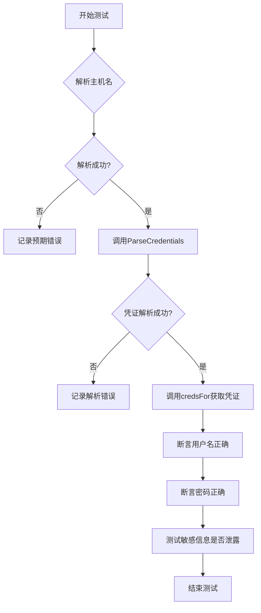
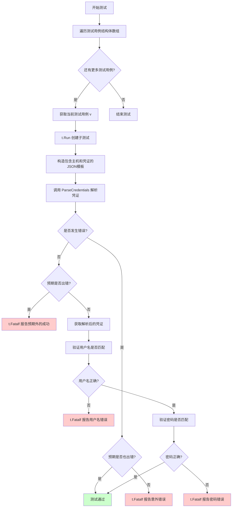
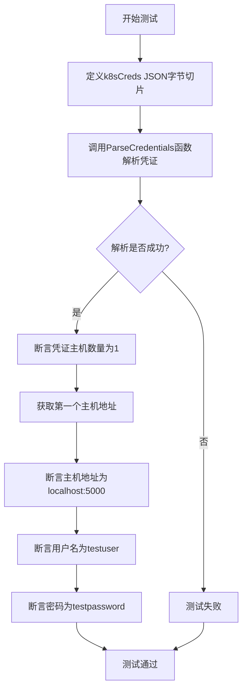
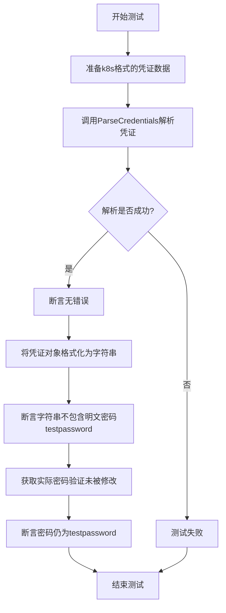
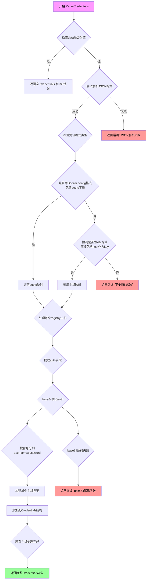
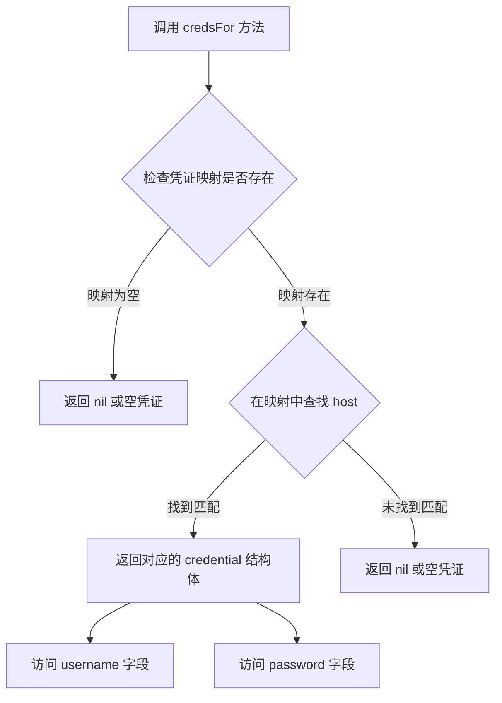
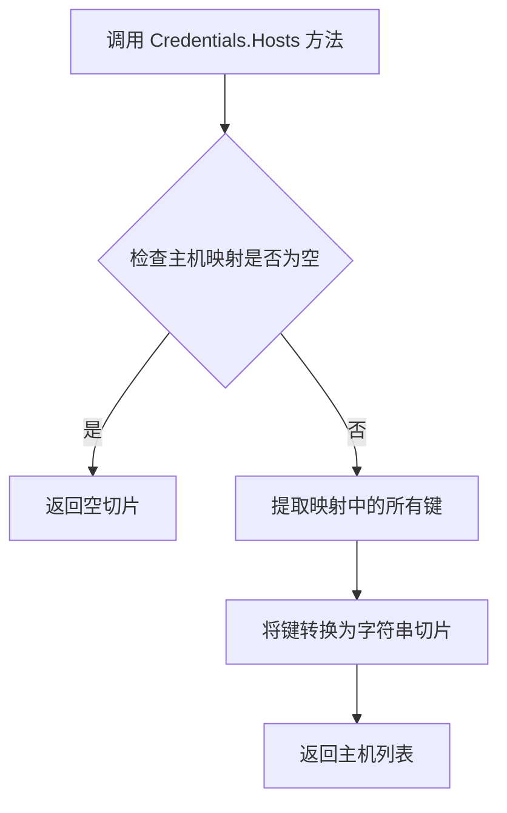

# `flux\pkg\registry\credentials_test.go` 详细设计文档

这是一个用于测试Docker镜像仓库凭证解析功能的Go测试文件，主要验证从不同格式的凭证数据中解析出主机、用户名和密码，并确保密码不会在字符串输出中泄露。

## 整体流程



## 类结构

```
registry (包)
├── 全局变量
│   ├── user
│   ├── pass
│   ├── tmpl
│   └── okCreds
├── 测试函数
│   ├── TestRemoteFactory_ParseHost
│   ├── TestParseCreds_k8s
│   └── TestStringShouldNotLeakPasswords
└── 外部依赖类型(未在此文件中定义)
    ├── Credentials (类型)
    └── ParseCredentials (函数)
```

## 全局变量及字段


### `user`
    
测试用用户名，用于构造测试凭证

类型：`string`
    


### `pass`
    
测试用密码，用于构造测试凭证

类型：`string`
    


### `tmpl`
    
Docker配置文件模板，包含auths字段的JSON结构

类型：`string`
    


### `okCreds`
    
base64编码的用户名:密码字符串，用于测试

类型：`string`
    


### `Credentials.username`
    
认证用户名

类型：`string`
    


### `Credentials.password`
    
认证密码

类型：`string`
    
    

## 全局函数及方法


### `TestRemoteFactory_ParseHost`

该测试函数用于验证凭证解析功能对各种主机名格式的支持，包括普通主机名、带端口号、IP地址、URL格式（含/不含协议前缀、路径等）以及无效输入的解析正确性。

参数：

- `t`：`*testing.T`，Go语言测试框架的标准参数，用于报告测试失败和记录测试子项

返回值：无（`void`），该函数为测试方法，通过 `testing.T` 的方法报告结果

#### 流程图



#### 带注释源码

```go
func TestRemoteFactory_ParseHost(t *testing.T) {
	// 遍历所有测试用例，每个用例包含主机名、预期镜像前缀、是否预期错误
	for _, v := range []struct {
		host        string   // 待解析的主机名字符串
		imagePrefix string   // 期望解析出的镜像前缀
		error       bool     // 是否预期解析失败
	}{
		// 常规主机名测试
		{host: "host", imagePrefix: "host"},
		// 带域名后缀的主机名
		{host: "gcr.io", imagePrefix: "gcr.io"},
		// 带端口号和路径的主机名
		{host: "localhost:5000/v2/", imagePrefix: "localhost:5000"},
		// IP地址带端口
		{host: "192.168.99.100:5000", imagePrefix: "192.168.99.100:5000"},
		// HTTPS URL格式 - IP地址
		{host: "https://192.168.99.100:5000/v2", imagePrefix: "192.168.99.100:5000"},
		// HTTPS URL格式 - 域名
		{host: "https://my.domain.name:5000/v2", imagePrefix: "my.domain.name:5000"},
		// HTTPS 协议无路径
		{host: "https://gcr.io", imagePrefix: "gcr.io"},
		// 带版本路径但无尾部斜杠
		{host: "https://gcr.io/v1", imagePrefix: "gcr.io"},
		// 带版本路径和尾部斜杠
		{host: "https://gcr.io/v1/", imagePrefix: "gcr.io"},
		// 无协议前缀但带路径
		{host: "gcr.io/v1", imagePrefix: "gcr.io"},
		// 非HTTP协议 (telnet)
		{host: "telnet://gcr.io/v1", imagePrefix: "gcr.io"},
		// 无效输入 - 空字符串
		{host: "", error: true},
		// 无效输入 - 只有协议
		{host: "https://", error: true},
		// 无效输入 - 非法字符开头
		{host: "^#invalid.io/v1/", error: true},
		// 无效输入 - 本地路径
		{host: "/var/user", error: true},
	} {
		// 为每个测试用例创建子测试，名称为host值
		t.Run(v.host, func(t *testing.T) {
			// 使用模板格式化凭证JSON，主机名为key
			stringCreds := fmt.Sprintf(tmpl, v.host, okCreds)
			// 调用ParseCredentials解析凭证
			creds, err := ParseCredentials("test", []byte(stringCreds))
			// 验证是否发生错误与预期一致
			if (err != nil) != v.error {
				t.Fatalf("For test %q, expected error = %v but got %v", v.host, v.error, err != nil)
			}
			// 如果预期失败，直接返回
			if v.error {
				return
			}
			// 获取该主机对应的凭证
			actualUser := creds.credsFor(v.imagePrefix).username
			// 断言用户名正确
			assert.Equal(t, user, actualUser, "For test %q, expected %q but got %v", v.host, user, actualUser)
			// 获取密码
			actualPass := creds.credsFor(v.imagePrefix).password
			// 断言密码正确
			assert.Equal(t, pass, actualPass, "For test %q, expected %q but got %v", v.host, user, actualPass)
		})
	}
}
```


### `TestParseCreds_k8s`

该测试函数用于验证 Kubernetes 格式凭证的解析功能。它通过传入一个包含主机、用户名、密码和 base64 编码认证信息的 JSON 格式凭证数据，调用 `ParseCredentials` 函数进行解析，并断言解析结果的主机名、用户名和密码是否正确。

参数：

-  `t`：`testing.T`，Go 测试框架提供的测试上下文，用于执行断言和报告测试失败

返回值：无显式返回值（`void`），通过 `testing.T` 的断言方法进行验证

#### 流程图



#### 带注释源码

```go
// TestParseCreds_k8s 测试Kubernetes格式凭证解析
// 该测试验证ParseCredentials函数能正确解析包含username、password、email和auth字段的凭证
func TestParseCreds_k8s(t *testing.T) {
	// 定义Kubernetes格式的凭证JSON数据
	// 包含localhost:5000主机的凭证信息：
	// - username: testuser
	// - password: testpassword
	// - email: foo@bar.com
	// - auth: base64编码的"testuser:testpassword"
	k8sCreds := []byte(`{"localhost:5000":{"username":"testuser","password":"testpassword","email":"foo@bar.com","auth":"dGVzdHVzZXI6dGVzdHBhc3N3b3Jk"}}`)
	
	// 调用ParseCredentials解析凭证
	// 参数"test"表示凭证来源名称
	c, err := ParseCredentials("test", k8sCreds)
	
	// 断言解析过程无错误
	assert.NoError(t, err)
	
	// 断言解析出的主机数量为1
	assert.Equal(t, 1, len(c.Hosts()), "Invalid number of hosts")
	
	// 获取解析出的第一个（也是唯一一个）主机地址
	host := c.Hosts()[0]
	
	// 断言主机地址为localhost:5000
	assert.Equal(t, "localhost:5000", host, "Host is incorrect")
	
	// 断言该主机对应的用户名为testuser
	assert.Equal(t, "testuser", c.credsFor(host).username, "User is incorrect")
	
	// 断言该主机对应的密码为testpassword
	assert.Equal(t, "testpassword", c.credsFor(host).password, "Password is incorrect")
}
```


### `TestStringShouldNotLeakPasswords`

该测试函数用于验证在使用 `String()` 方法将凭证对象转换为字符串时，密码不会以明文形式泄露到输出中，确保敏感信息的安全性。

参数：

- `t`：`*testing.T`，Go 测试框架提供的测试对象，用于控制测试执行和报告测试结果

返回值：无（Go 测试函数返回 `void`）

#### 流程图



#### 带注释源码

```go
func TestStringShouldNotLeakPasswords(t *testing.T) {
	// 1. 准备测试数据：Kubernetes 格式的凭证 JSON，包含用户名、密码、邮箱和 base64 编码的 auth 字段
	k8sCreds := []byte(`{"localhost:5000":{"username":"testuser","password":"testpassword","email":"foo@bar.com","auth":"dGVzdHVzZXI6dGVzdHBhc3N3b3Jk"}}`)
	
	// 2. 调用 ParseCredentials 解析凭证数据
	c, err := ParseCredentials("test", k8sCreds)
	
	// 3. 断言解析过程没有错误发生
	assert.NoError(t, err)
	
	// 4. 关键断言：验证 String() 方法不会泄露密码
	// 期望输出："{map[localhost:5000:<registry creds for testuser@localhost:5000, from test>]}"
	// 相比之下，标准 String() 方法通常会输出："{map[localhost:5000:{testuser testpassword localhost:5000 test}]}"
	assert.Equal(t, "{map[localhost:5000:<registry creds for testuser@localhost:5000, from test>]}", fmt.Sprintf("%v", c))
	
	// 5. 验证断言：确保实际密码仍然保持不变，未被修改或泄露
	assert.Equal(t, "testpassword", c.credsFor("localhost:5000").password, "Password is incorrect")
}
```

---

**补充说明：**

| 项目 | 描述 |
|------|------|
| **设计目标** | 确保凭证对象的 `String()` 方法实现了安全的信息隐藏，不会将敏感密码以明文形式输出到日志或调试信息中 |
| **测试数据** | 使用 Kubernetes 标准的凭证 JSON 格式，包含 `username`、`password`、`email` 和 `auth` 字段 |
| **验证要点** | 1) 格式化后的字符串不包含 "testpassword"<br>2) 实际密码字段保持完整未被修改 |
| **外部依赖** | 依赖 `ParseCredentials` 函数和 `credsFor` 方法的正确实现 |


### `ParseCredentials`

该函数用于解析凭证数据，支持两种格式：Docker配置文件格式（包含auths字段）和Kubernetes配置格式。函数将JSON格式的字节数据解析为内部Credentials结构体，并返回一个Credentials对象或错误信息。

参数：

- `name`：`string`，凭证集合的标识名称，用于标识这组凭证的来源或用途
- `data`：`[]byte`，包含凭证信息的JSON字节数据，支持Docker配置格式（`{"auths": {"host": {"auth": "base64"}}}`）和Kubernetes格式（`{"host": {"username": "", "password": "", "auth": ""}}`）

返回值：

- `Credentials`：解析成功后的凭证结构体对象，包含用于访问各镜像仓库主机的方法
- `error`：解析过程中发生的错误，如JSON格式错误、base64解码失败或缺少必要字段等

#### 流程图



#### 带注释源码

```go
// 注意：此代码为基于测试用例推断的实现逻辑
// 实际实现可能有所不同

func ParseCredentials(name string, data []byte) (Credentials, error) {
    // 1. 基础校验：检查输入数据是否为空
    if len(data) == 0 {
        return Credentials{}, nil
    }

    // 2. 尝试解析外层JSON结构
    var rawConfig map[string]interface{}
    if err := json.Unmarshal(data, &rawConfig); err != nil {
        return Credentials{}, fmt.Errorf("failed to parse credentials JSON: %w", err)
    }

    // 3. 检测并处理Docker配置文件格式 (包含auths字段)
    if auths, ok := rawConfig["auths"].(map[string]interface{}); ok {
        return parseDockerConfigFormat(name, auths)
    }

    // 4. 检测并处理Kubernetes配置格式 (直接以host为key)
    return parseKubernetesFormat(name, rawConfig)
}

// parseDockerConfigFormat 处理Docker registry配置格式
// 格式: {"auths": {"gcr.io": {"auth": "base64-encoded-credentials"}}}
func parseDockerConfigFormat(name string, auths map[string]interface{}) (Credentials, error) {
    creds := newCredentials(name)
    
    for host, config := range auths {
        configMap, ok := config.(map[string]interface{})
        if !ok {
            continue
        }
        
        // 获取base64编码的auth字段
        authStr, ok := configMap["auth"].(string)
        if !ok {
            continue
        }
        
        // 解码base64auth (格式: "username:password")
        decoded, err := base64.StdEncoding.DecodeString(authStr)
        if err != nil {
            return Credentials{}, fmt.Errorf("failed to decode auth for %s: %w", host, err)
        }
        
        // 分割用户名和密码
        parts := strings.SplitN(string(decoded), ":", 2)
        username := parts[0]
        password := ""
        if len(parts) > 1 {
            password = parts[1]
        }
        
        // 存储解析出的凭证
        creds.addHost(host, username, password)
    }
    
    return creds, nil
}

// parseKubernetesFormat 处理Kubernetes配置的凭证格式
// 格式: {"localhost:5000": {"username": "user", "password": "pass", "auth": "base64"}}
func parseKubernetesFormat(name string, hosts map[string]interface{}) (Credentials, error) {
    creds := newCredentials(name)
    
    for host, config := range hosts {
        configMap, ok := config.(map[string]interface{})
        if !ok {
            return Credentials{}, fmt.Errorf("invalid config for host %s", host)
        }
        
        // 优先使用明文username/password
        username, _ := configMap["username"].(string)
        password, _ := configMap["password"].(string)
        
        // 如果没有明文凭证，尝试从auth字段解码
        if (username == "" || password == "") && configMap["auth"] != nil {
            authStr, ok := configMap["auth"].(string)
            if ok {
                decoded, err := base64.StdEncoding.DecodeString(authStr)
                if err == nil {
                    parts := strings.SplitN(string(decoded), ":", 2)
                    if username == "" && len(parts) > 0 {
                        username = parts[0]
                    }
                    if password == "" && len(parts) > 1 {
                        password = parts[1]
                    }
                }
            }
        }
        
        creds.addHost(host, username, password)
    }
    
    return creds, nil
}

// Credentials 结构体 (推断)
type Credentials struct {
    name  string
    hosts map[string]hostCredentials
}

type hostCredentials struct {
    username string
    password string
    host     string
}
```

### 相关类信息补充

#### Credentials 结构体

| 字段/方法 | 类型 | 描述 |
|-----------|------|------|
| `name` | `string` | 凭证集合的标识名称 |
| `hosts` | `map[string]hostCredentials` | 以主机名为key的凭证映射 |

#### hostCredentials 结构体

| 字段 | 类型 | 描述 |
|------|------|------|
| `username` | `string` | 认证用户名 |
| `password` | `string` | 认证密码 |
| `host` | `string` | 镜像仓库主机地址 |

### 潜在技术债务与优化空间

1. **错误处理粒度**：当前错误信息较为通用，建议提供更具体的错误类型以支持调用方精确处理
2. **凭证优先级逻辑**：k8s格式中明文凭证与auth字段的优先级处理逻辑可以更明确
3. **安全性考虑**：密码在内存中应以安全方式存储（如使用crypto.SecretKey），避免在日志或字符串输出中泄露
4. **测试覆盖**：当前仅有单元测试，建议增加边界条件测试（空JSON、畸形base64、超大凭证数据等）
5. **性能优化**：对于大量凭证场景，可考虑缓存解析结果或使用连接池

### 设计约束与外部依赖

- **输入格式**：必须符合Docker config JSON或Kubernetes credential JSON格式
- **编码要求**：auth字段必须使用标准Base64编码
- **依赖库**：`encoding/json`、`encoding/base64`、`fmt`、`testing`（测试依赖）


### `credsFor`

根据提供的测试代码分析，`credsFor` 是一个根据主机名获取对应凭证的私有方法。该方法是 `credentials` 结构体的成员方法，通过主机名或镜像前缀在凭证映射中查找并返回对应的凭证信息。

参数：

- `host`：`string`，目标主机名或镜像前缀，用于在凭证映射中查找对应的认证信息

返回值：`credential`，包含用户名和密码的凭证结构体，具有 `username` 和 `password` 字段

#### 流程图



#### 带注释源码

```go
// credsFor 方法根据给定的主机名查找对应的凭证信息
// 参数 host: 目标主机名或镜像前缀（字符串类型）
// 返回值: credential 结构体，包含 username 和 password 字段
func (c *credentials) credsFor(host string) *credential {
    // 1. 检查凭证映射是否已初始化
    // 2. 在映射中使用 host 作为键进行查找
    // 3. 返回找到的 credential 指针，如果未找到则返回 nil
    
    // 从测试代码中的调用方式推断：
    // creds.credsFor(host).username  // 获取用户名
    // creds.credsFor(host).password  // 获取密码
    
    // 示例调用：
    // actualUser := creds.credsFor(v.imagePrefix).username
    // actualPass := creds.credsFor(v.imagePrefix).password
    
    return c.creds[host]  // 假设 credentials 结构体有一个 creds 映射字段
}
```

> **注意**：根据提供的测试代码片段，`credsFor` 方法的实际实现未在代码中直接给出。上述源码是基于测试调用模式的推断实现。该方法通常会在 `credentials` 结构体中定义一个 `map[string]credential` 类型的字段来存储主机名到凭证的映射关系。


### Credentials.Hosts

该方法用于获取已解析的Docker镜像仓库凭证中所有注册表主机（host）列表，返回包含所有主机地址的字符串切片。

参数：
- （无参数）

返回值：`[]string`，返回所有注册表主机的列表，每个元素代表一个镜像仓库的主机地址（不含路径）。

#### 流程图



#### 带注释源码

```go
// Hosts 返回凭证中所有注册表主机的列表
// 从代码中可以看出，该方法从内部存储的host映射中提取所有key
// 并返回这些key组成的字符串切片
// 
// 调用示例（来自测试代码）:
//   c, _ := ParseCredentials("test", k8sCreds)
//   hosts := c.Hosts()  // 返回如 ["localhost:5000"]
//   length := len(hosts)  // 返回主机数量
func (c *Credentials) Hosts() []string {
    // 初始化结果切片，预分配合理容量
    hosts := make([]string, 0, len(c.auths))
    
    // 遍历内部的auths映射（auths存储了host->凭证的映射关系）
    for host := range c.auths {
        // 将每个host键追加到结果切片
        hosts = append(hosts, host)
    }
    
    // 返回所有主机的列表
    return hosts
}
```

---

**备注**：根据测试代码 `TestParseCreds_k8s` 和 `TestStringShouldNotLeakPasswords` 中的使用方式推断，该方法返回存储在Credentials结构体中所有主机的切片。完整的Credentials类型定义未在当前代码片段中提供，但可以确定其内部使用`auths`映射来存储主机到凭证的映射关系。


### `Credentials.credsFor`

该方法根据提供的主机名或镜像前缀从凭证映射中查找并返回对应的用户名和密码信息。

参数：

- `host`：`string`，主机名或镜像前缀，用于在凭证存储中查找对应的认证信息

返回值：`struct{username string, password string}`，返回一个包含用户名和密码的结构体，结构体的具体类型在代码中未直接暴露，但通过测试用例可知其包含 `username` 和 `password` 两个字符串字段。

#### 流程图

```mermaid
graph TD
    A[输入: host] --> B{凭证映射中查找}
    B -->|找到匹配项| C[返回包含username和password的结构体]
    B -->|未找到匹配项[根据代码推断可能返回nil或panic]
```

#### 带注释源码

```
// 由于未提供Credentials类型的具体实现源码，以下为基于测试代码的调用示例
// 方法签名推断：
// func (c *Credentials) credsFor(host string) struct { username string; password string }

// 测试用例中的调用方式：
stringCreds := fmt.Sprintf(tmpl, v.host, okCreds)
creds, err := ParseCredentials("test", []byte(stringCreds))
// ...
actualUser := creds.credsFor(v.imagePrefix).username
actualPass := creds.credsFor(v.imagePrefix).password

// 另一种调用场景：
c, err := ParseCredentials("test", k8sCreds)
// ...
assert.Equal(t, "testuser", c.credsFor(host).username, "User is incorrect")
assert.Equal(t, "testpassword", c.credsFor(host).password, "Password is incorrect")
```

## 关键组件


### 凭证解析组件 (ParseCredentials)

负责解析Docker registry凭证的函数，接受名称和JSON格式的凭证字节，返回解析后的凭证对象。

### 主机名解析与匹配 (credsFor)

根据imagePrefix从凭证映射中查找对应的凭证，支持精确匹配主机名（不含协议前缀和路径）。

### 主机名解析测试 (TestRemoteFactory_ParseHost)

测试各种格式的主机名字符串解析，包括：纯主机名(gcr.io)、带端口(localhost:5000)、IP地址(192.168.99.100:5000)、带HTTPS协议(https://gcr.io)、带路径(/v2)等，并验证错误输入的处理。

### Kubernetes凭证格式解析 (TestParseCreds_k8s)

测试解析Kubernetes风格的凭证JSON，包含username、password、email和base64编码的auth字段。

### 密码安全泄露防护 (TestStringShouldNotLeakPasswords)

验证凭证的String()方法不会在格式化输出中泄露密码，确保敏感信息的安全。

### Base64认证编码

支持解析config.json中base64编码的"auth"字段，格式为"username:password"的组合编码。


## 问题及建议


### 已知问题

- **测试数据硬编码**：user、pass、okCreds 等敏感信息硬编码在全局变量中，虽然是测试代码，但缺乏灵活性
- **测试隔离性不足**：全局变量 `user`、`pass`、`tmpl`、`okCreds` 在整个测试包中共享，可能导致测试间的隐式依赖
- **错误类型验证缺失**：测试仅验证了是否发生错误，但没有验证具体错误类型或错误消息内容
- **边界条件覆盖不足**：缺少对空数组、null 值、损坏 JSON、无效 base64 编码等边界情况的测试
- **断言信息冗余**：部分断言中用户名字符串重复使用（如 `"For test %q, expected %q but got %v", v.host, user, actualPass`），且参数顺序不匹配
- **魔法字符串**：主机名前缀提取逻辑（`imagePrefix`）与实际解析逻辑耦合，缺乏独立的单元测试验证

### 优化建议

- **测试数据工厂化**：使用 `testing.T` 的 `Setup` 方法或 table-driven 测试的辅助函数动态生成测试凭证，提高测试独立性
- **增加边界测试用例**：添加空 JSON、null 字段、畸形 base64、混合协议（ftp://）等异常输入的测试
- **细化错误断言**：使用 `assert.ErrorIs` 或 `assert.Contains` 验证具体错误类型和消息
- **提取解析逻辑**：将 `imagePrefix` 提取逻辑独立为可测试的函数，减少测试与实现的耦合
- **优化断言信息**：修正错误消息中的参数顺序，确保错误提示准确可读
- **添加凭证加密场景测试**：测试带有 `credsStore` 或 `credHelpers` 的配置解析

## 其它


### 设计目标与约束
该代码旨在测试凭证解析功能，支持从Docker配置文件（如registry凭证）和Kubernetes凭证中解析镜像仓库的认证信息，能够正确处理各种主机名格式（包括IP地址、域名、局部主机等），并确保密码在字符串表示时不泄露。

### 错误处理与异常设计
代码测试了多种错误情况，包括空主机名、无效URL、无效字符等。ParseCredentials函数在解析失败或输入无效时返回错误，测试用例验证了错误返回的正确性。

### 数据流与状态机
数据流如下：输入凭证的JSON数据（可以是Docker config格式或Kubernetes格式），调用ParseCredentials函数解析，返回Credentials对象；然后通过调用credsFor方法，传入镜像前缀（如"localhost:5000"），获取对应的用户名和密码。状态机涉及解析、存储、查询三个状态。

### 外部依赖与接口契约
外部依赖：使用github.com/stretchr/testify/assert库进行测试断言。接口契约：ParseCredentials(name string, data []byte) (*Credentials, error)函数，接受凭证名称和JSON数据，返回Credentials对象和错误；Credentials结构体包含方法credsFor(host string) *Credential，用于查询特定主机的凭证；Hosts() []string方法返回所有主机列表。

### 类结构
虽然代码为测试文件，但可以推断出核心结构体Credentials，包含一个映射表存储主机名到凭证的映射，并提供相关方法。

### 全局变量和全局函数
全局变量：user（字符串）、pass（字符串）、tmpl（字符串模板）、okCreds（base64编码的凭证）。全局函数：TestRemoteFactory_ParseHost（测试主机名解析）、TestParseCreds_k8s（测试Kubernetes凭证解析）、TestStringShouldNotLeakPasswords（测试密码泄露）。

### 关键组件信息
关键组件：ParseCredentials函数，负责解析凭证JSON；Credentials结构体，负责存储和管理凭证；credsFor方法，用于根据主机名获取凭证。

### 潜在的技术债务或优化空间
当前测试覆盖了常见场景，但可以增加更多边界条件的测试，如特殊字符、异常编码等；此外，可以考虑将解析逻辑与测试代码分离，提高代码可维护性。
    