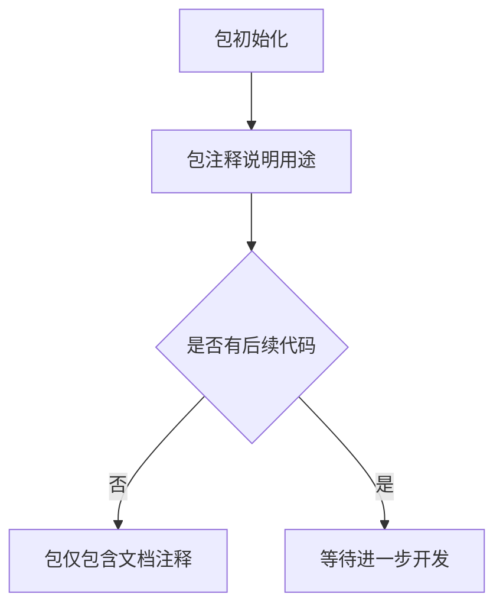

# `flux\pkg\registry\doc.go` 详细设计文档

这是一个用于处理镜像注册表（Image Registry）相关类型定义的Go语言包，目前仅定义了包级别的文档注释，用于说明该包将用于处理如quay.io、DockerHub、Google Container Registry等容器镜像注册表的类型支持，但尚未实现具体的类型或函数。

## 整体流程



## 类结构

```
registry (Go包)
└── 当前为空白包，仅包含包级文档注释
```

## 全局变量及字段


    

## 全局函数及方法


## 关键组件


### 概述

该代码是一个用于处理容器镜像注册表（如 quay.io、DockerHub、Google Container Registry 等）的空包，仅包含包声明和文档注释，没有实际实现代码。

### 整体运行流程

由于该包仅包含包声明而无实际代码，不存在可执行的运行流程。

### 类详细信息

无类定义。

### 全局变量和全局函数

无全局变量或全局函数定义。

### 关键组件信息

由于代码中无实际实现，无法识别具体的组件信息。根据包文档注释，该包的预期设计目标是提供镜像注册表相关的数据类型定义，但当前仅有包声明。

### 潜在技术债务或优化空间

由于缺乏实现代码，无法评估技术债务或优化空间。

### 其他项目

**设计目标与约束**：根据包注释，目标是提供处理各类容器镜像注册表的类型定义，但当前仅为占位声明。

**错误处理与异常设计**：无实现代码，无法设计错误处理机制。

**数据流与状态机**：无实现代码，无法定义数据流或状态机。

**外部依赖与接口契约**：无实现代码，无法定义接口契约。


## 问题及建议


### 已知问题

- 包为空的，未实现任何类型或功能，仅有包声明和注释
- 缺乏任何实际的镜像注册表类型定义
- 没有任何错误类型、常量或配置结构
- 缺少与镜像注册表交互的接口或函数定义

### 优化建议

- 根据包注释描述的目标，定义核心数据结构（如 Registry、Image、Tag 等）
- 添加镜像仓库认证相关类型（Credentials、AuthConfig 等）
- 定义错误类型以统一处理注册表操作异常
- 实现镜像拉取、推送、列表查询等基础功能接口
- 添加配置结构体以支持不同注册表的连接参数

## 其它


### 设计目标与约束
该包旨在定义通用的镜像仓库（Registry）数据类型，以支持 Docker Hub、Quay.io、Google Container Registry 等多种镜像仓库。目标是提供统一的结构体（如 Registry、Image、Tag）供业务层使用，并保持最小化依赖、仅包含类型与基础解析函数，不实现网络 I/O。约束：兼容 Go 1.18+；遵循 Go 命名与文档规范；仅作为轻量级数据模型库。

### 错误处理与异常设计
当前未实现业务逻辑，暂无错误处理需求。后续若加入网络请求，建议定义自定义错误类型，例如 `ErrRegistryUnsupported`、`ErrImageNotFound`、`ErrAuthFailed`，并实现 `error` 接口的 `Is`/`As` 方法，以便调用方进行精确的错误检查与区分。所有错误应携带足够的上下文信息（如仓库地址、镜像名称），便于日志与调试。

### 数据流与状态机
该包仅提供数据结构，数据流为：外部配置或命令行参数 → 解析得到 `Registry`、`Image`、`Tag` 结构体 → 传递给业务层（如镜像拉取/推送）使用。状态机不在本包实现，可由调用方自行维护（例如 Registry 的状态：Ready、Connecting、Authenticated、Error），本包仅负责数据的序列化和反序列化。

### 外部依赖与接口契约
目前该包不依赖任何第三方库，后续若实现 HTTP 客户端，可引入 `net/http` 或第三方客户端（如 `docker/client`、`google.golang.org/api`）。对外暴露的接口包括：
- 结构体：`Registry`、`Image`、`Tag`
- 可能的函数：`NewRegistry`、`ParseImageName`
使用方若需要自定义网络行为，可实现 `http.RoundTripper` 接口并注入。

### 性能与可扩展性
设计上采用值类型或指针，避免不必要的内存拷贝；若需要大规模镜像列表，可通过迭代器或分页方式流式读取。接口抽象允许替换底层 HTTP 实现，以满足高并发和低延迟需求。

### 安全与合规性
当前无安全敏感操作。后续实现网络请求时必须使用 HTTPS，遵循 TLS 1.2+；如需认证，采用官方推荐的 OAuth2、Token 或 Basic Auth 方式，并妥善保管凭证。遵守容器镜像安全扫描与合规要求（如 CIS Docker Benchmark）。

### 可维护性与可测试性
包结构简洁，所有导出类型均附带完整的 Go 文档注释。测试应覆盖结构体的序列化/反序列化（JSON、YAML）以及边界条件，推荐使用 `testify` 框架和 `gock` 进行 HTTP mock，确保可维护性与可测试性。

### 版本控制与发布策略
采用语义化版本（SemVer），当前版本 v0.1.0。发布时通过 Go Modules 管理依赖，确保可重复构建。每次重大更改需更新 CHANGELOG 并打标签。

### 文档与注释规范
所有导出标识符需提供完整的文档注释，说明用途、参数、返回值及使用示例。遵守 Go doc 规范，使用 `//` 注释风格。包顶部已有概述注释，供 `go doc` 使用。

### 部署与运维注意事项
该包为库，不直接部署。使用方在容器编排平台或 CI/CD 环境中使用时应确保网络可达目标镜像仓库，并根据需要配置镜像拉取策略（私有仓库认证、镜像加速器等）。如作为独立服务运行，需监控网络延迟与错误率。

### 待办事项与风险
- 实现 `Registry`、`Image`、`Tag` 结构体及其方法  
- 实现镜像名称解析函数 `ParseImageName`  
- 引入 HTTP 客户端并实现基本的镜像列表、拉取接口  
- 完成认证模块（Token、OAuth）  
- 编写完整单元测试与集成测试  

潜在风险包括：外部 API 变更导致兼容性问题、依赖库安全漏洞、网络不稳定导致的超时与重试需求。

    