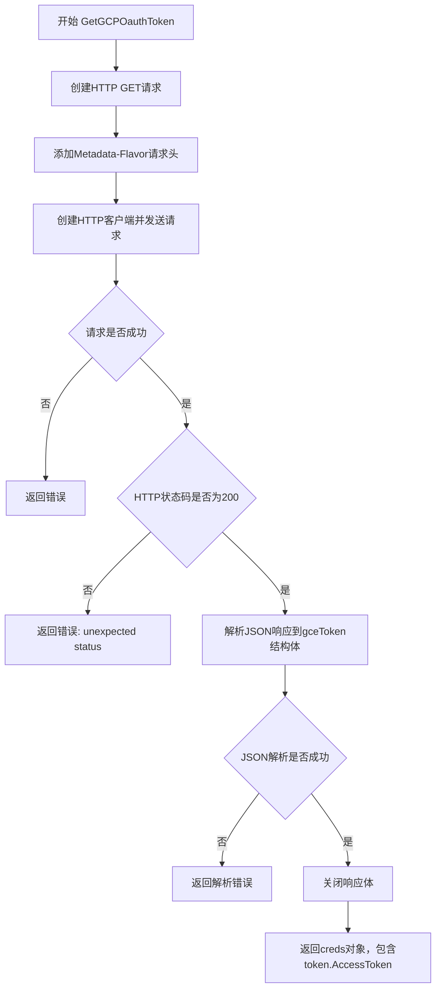
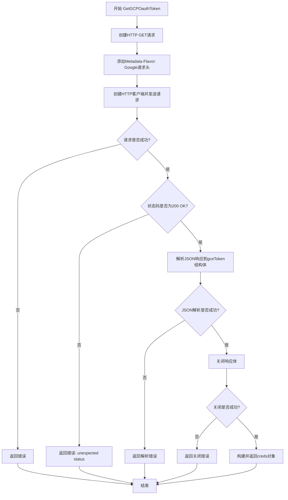

# `flux\pkg\registry\gcp.go` 详细设计文档

该代码是一个Go语言包，用于从Google Compute Engine (GCE) 元数据服务获取OAuth访问令牌，通过HTTP请求到GCE内部元数据端点，解析返回的JSON令牌信息，并构造包含访问令牌的凭据对象返回给调用者。

## 整体流程



## 类结构

```
registry包 (GCP OAuth令牌获取模块)
└── GetGCPOauthToken (主函数)
    ├── 常量: gcpDefaultTokenURL
    └── 类型: gceToken (结构体)
```

## 全局变量及字段


### `gcpDefaultTokenURL`
    
GCE元数据服务的默认令牌获取URL常量

类型：`string (const)`
    


### `gceToken.AccessToken`
    
OAuth访问令牌

类型：`string`
    


### `gceToken.ExpiresIn`
    
令牌过期时间（秒）

类型：`int`
    


### `gceToken.TokenType`
    
令牌类型

类型：`string`
    
    

## 全局函数及方法


### `GetGCPOauthToken`

获取GCP OAuth访问令牌。该函数通过GCE元数据服务获取OAuth2访问令牌，并将其封装为凭据对象返回，供registry认证使用。

参数：

- `host`：`string`，目标注册表主机地址，将被设置为返回凭据的registry字段

返回值：`creds, error`，成功时返回包含OAuth访问令牌的凭据对象，失败时返回错误信息

#### 流程图



#### 带注释源码

```go
// GetGCPOauthToken 获取GCP OAuth访问令牌
// 参数host用于指定目标注册表地址
// 返回凭据对象和可能的错误
func GetGCPOauthToken(host string) (creds, error) {
	// 1. 创建HTTP GET请求，访问GCE元数据服务的默认服务账号token端点
	request, err := http.NewRequest("GET", gcpDefaultTokenURL, nil)
	if err != nil {
		// 请求创建失败，返回错误
		return creds{}, err
	}

	// 2. 添加必需的元数据 flavor 头，表明这是GCE元数据服务器请求
	request.Header.Add("Metadata-Flavor", "Google")

	// 3. 创建HTTP客户端并发送请求
	client := &http.Client{}
	response, err := client.Do(request)
	if err != nil {
		// 网络请求失败，返回错误
		return creds{}, err
	}

	// 4. 检查HTTP响应状态码是否为200 OK
	if response.StatusCode != http.StatusOK {
		// 元数据服务返回非正常状态，返回格式化错误信息
		return creds{}, fmt.Errorf("unexpected status from metadata service: %s", response.Status)
	}

	// 5. 定义token结构体用于接收JSON响应
	var token gceToken
	// 6. 创建JSON解码器并解析响应体
	decoder := json.NewDecoder(response.Body)
	if err := decoder.Decode(&token); err != nil {
		// JSON解析失败，返回错误
		return creds{}, err
	}

	// 7. 关闭响应体以释放资源
	if err := response.Body.Close(); err != nil {
		// 关闭失败，返回错误
		return creds{}, err
	}

	// 8. 成功构建凭据对象并返回
	// registry: 目标主机地址
	// provenance: 来源标识（空字符串）
	// username: OAuth2访问令牌的用户名标识
	// password: 实际获取的访问令牌
	return creds{
		registry:   host,
		provenance: "",
		username:   "oauth2accesstoken",
		password:   token.AccessToken}, nil
}
```

## 关键组件


### GCP元数据服务Token端点

gcpDefaultTokenURL常量定义了GCP元数据服务的OAuth令牌获取URL，用于从GCE元数据服务器获取访问令牌。

### GCE令牌响应结构体

gceToken结构体定义了从GCP元数据服务返回的OAuth令牌数据结构，包含访问令牌、过期时间和令牌类型字段。

### OAuth令牌获取函数

GetGCPOauthToken函数是核心组件，负责构建HTTP请求、调用GCP元数据服务、解析令牌响应，并构建registry凭据对象返回给调用者。


## 问题及建议


### 已知问题

-   **硬编码的Metadata服务URL**：使用常量 `gcpDefaultTokenURL` 硬编码了GCP元数据服务地址，缺乏灵活性，无法适配不同的GCE环境或模拟测试场景。
-   **缺少Context支持**：函数未接受 `context.Context` 参数，无法实现超时控制、取消操作或链路追踪，影响在生产环境中的可用性。
-   **无超时设置**：使用默认的 `http.Client{}` 没有任何超时配置，可能导致请求无限期等待，造成Goroutine泄漏和系统资源耗尽。
-   **未使用Token元数据**：`gceToken` 结构体解析了 `ExpiresIn` 和 `TokenType` 字段但在返回的 `creds` 中未使用，导致获取的令牌过期时间信息丢失，调用方无法判断令牌有效性。
-   **HTTP客户端未复用**：每次调用都创建新的 `http.Client{}`，未复用连接池，增加了连接建立的开销和内存占用。
-   **错误信息不够具体**：当 `response.StatusCode` 非200时，仅返回状态码字符串，缺少响应body内容，不利于问题排查。
-   **未处理Body读取错误**：`response.Body` 被读取后未检查是否完全读取成功，可能导致数据不完整。
-   **缺少重试机制**：网络请求失败时直接返回错误，缺乏重试逻辑，在瞬时网络抖动场景下可靠性不足。

### 优化建议

-   **参数化Metadata URL**：将 `gcpDefaultTokenURL` 作为可选参数或从环境变量/配置中读取，支持自定义URL以适配测试环境。
-   **引入Context**：为函数添加 `context.Context` 参数，并在HTTP请求中使用 `req.WithContext(ctx)` 实现超时和取消支持。
-   **配置HTTP客户端超时**：创建具有合理超时（如5-10秒）的 `http.Client`，并作为参数传入或使用全局单例客户端。
-   **返回Token过期信息**：在 `creds` 结构中添加 `expiresAt` 或类似字段，在解析Token时计算并返回过期时间。
-   **复用HTTP客户端**：建议调用方传入配置好的 `*http.Client`，或使用全局客户端实例以复用连接池。
-   **增强错误信息**：在非200状态码时，尝试读取并包含响应body内容到错误信息中。
-   **添加重试逻辑**：使用指数退避策略对临时性错误（如5xx、连接超时）进行重试，提高函数可靠性。
-   **添加日志和监控**：在关键路径（请求前、响应后、错误时）添加结构化日志，便于运维监控和问题定位。
-   **提取接口抽象**：将Token获取逻辑抽象为接口，支持单元测试时mock，提升代码可测试性。


## 其它


### 设计目标与约束

本模块旨在为容器注册表客户端提供GCP OAuth令牌获取能力，使得客户端能够通过GCP元数据服务进行身份验证。设计约束包括：仅支持GCP环境（需要能访问metadata.google.internal）、使用HTTP GET方法获取令牌、令牌类型固定为Bearer token。

### 错误处理与异常设计

错误处理采用Go标准的error返回模式。可能的错误场景包括：HTTP请求创建失败（http.NewRequest错误）、HTTP请求执行失败（client.Do错误）、元数据服务返回非200状态码、JSON解析失败、响应体关闭失败。当发生错误时，函数返回空的creds对象和对应的error，调用方需进行错误处理。

### 外部依赖与接口契约

外部依赖包括：GCP元数据服务（http://metadata.google.internal/computeMetadata/v1/instance/service-accounts/default/token）、Go标准库net/http、Go标准库encoding/json。接口契约方面，GetGCECToken函数接收host字符串参数，返回凭据结构体和错误信息。host参数用于指定注册表主机地址，函数内部不使用，仅透传到返回的creds.registry字段。

### 安全性考虑

代码存在安全风险：硬编码的token URL（gcpDefaultTokenURL）应可通过配置指定；HTTP客户端未设置超时，可能导致请求无限期挂起；未验证TLS证书（虽然GCP元数据服务通常可信）；凭据（AccessToken）可能通过日志泄露。改进建议：添加HTTP客户端超时配置、考虑使用安全的HTTPS连接（当前使用HTTP）、避免在日志中输出敏感信息。

### 性能考虑

当前实现每次调用都会创建新的HTTP客户端（&http.Client{}），未复用连接。性能优化方向：建议使用全局或池化的HTTP客户端以支持连接复用；可添加简单的缓存机制避免频繁请求令牌（虽然当前实现未处理令牌过期时间）。

### 并发处理

当前实现为同步阻塞调用，无并发保护需求。但GetGCPOauthToken函数本身可被并发调用，需确保其访问的全局变量（如有）是线程安全的。当前实现无全局状态变量，并发安全。

### 配置管理

硬编码配置项（gcpDefaultTokenURL）应提取到配置文件中或作为环境变量。当前代码中token URL为常量，建议支持通过配置或环境变量覆盖默认URL以增强灵活性。

### 监控和日志

代码缺少日志记录，建议添加：请求开始时的日志（包含目标URL）、响应状态的日志、错误发生时的日志（包含错误详情）、成功获取令牌后的日志（注意不要记录令牌本身）。可考虑添加指标收集：请求成功率、请求耗时、错误类型统计。

### 测试策略

当前代码缺乏测试用例。测试策略应包括：单元测试（mock HTTP响应测试JSON解析）、集成测试（需要GCP环境或mock元数据服务）、错误场景测试（模拟网络错误、错误响应码、无效JSON等）。建议使用httptest包进行HTTP handler的mock测试。

### 兼容性考虑

代码依赖于GCP元数据服务的API响应格式（gceToken结构体）。若GCP元数据服务API变更，可能导致兼容性问题。建议在JSON解析时使用更宽松的字段处理，或添加版本兼容性检查。

### 部署配置

运行时需要：GCP环境（Compute Engine、Cloud Run、GKE等支持元数据服务的环境）、网络访问权限（能访问metadata.google.internal）、正确的IAM权限（service-account默认具有metadata读取权限）。

### 版本管理

当前代码未标注版本号，建议遵循语义化版本控制（SemVer）。API变更应记录在CHANGELOG中。


    