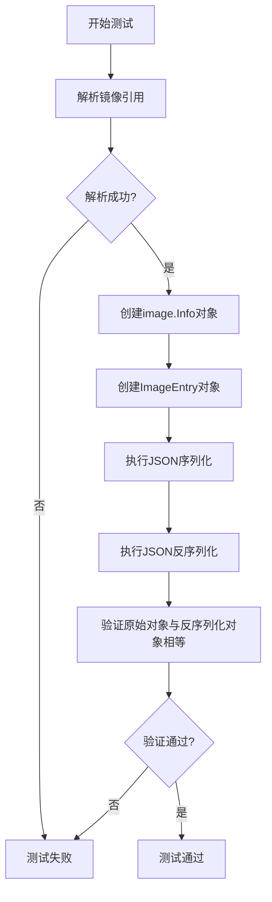
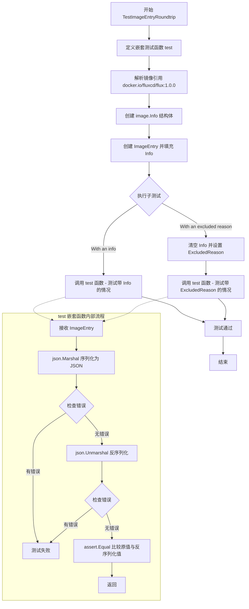
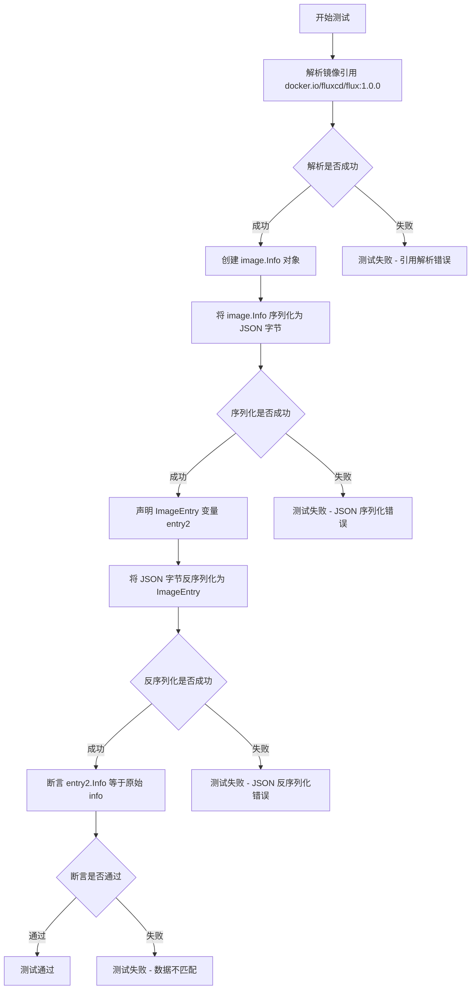
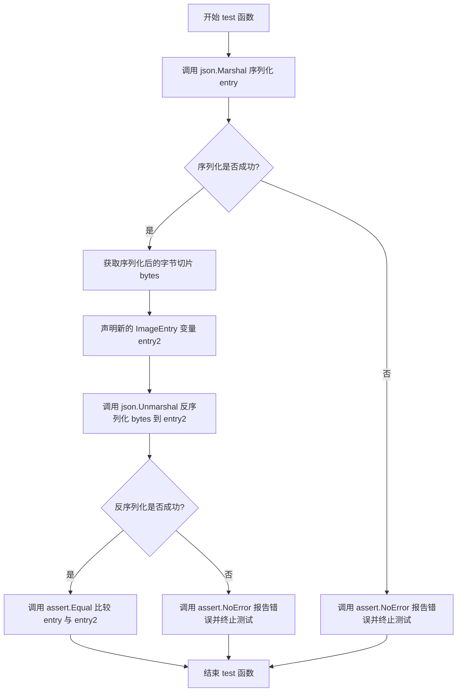
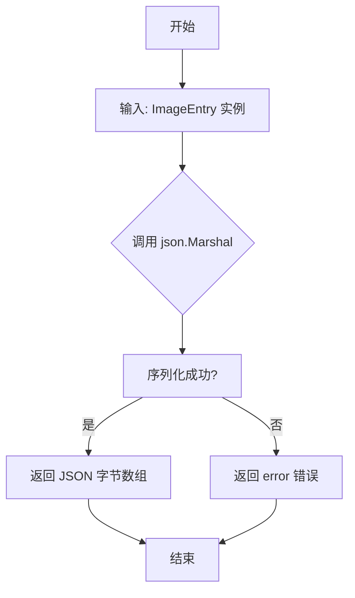
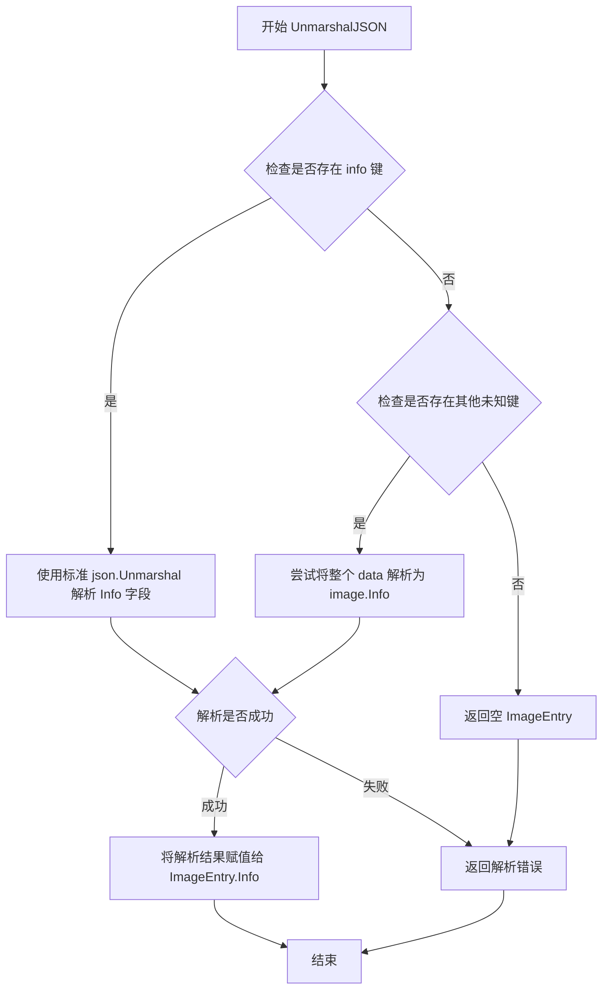

# `flux\pkg\registry\imageentry_test.go` 详细设计文档

这是一个FluxCD项目中的registry包的测试文件，主要用于测试ImageEntry结构体和image.Info类型的JSON序列化与反序列化功能，确保数据在JSON格式转换过程中保持一致性。

## 整体流程



## 类结构

```
Go测试文件 (无类层次结构)
├── 测试函数
│   ├── TestImageEntryRoundtrip
│   └── TestImageInfoParsesAsEntry
└── 辅助测试函数
    └── test(t *testing.T, entry ImageEntry)
```

## 全局变量及字段


### `ref`
    
解析后的镜像引用

类型：`image.Ref`
    


### `info`
    
镜像信息结构体，包含镜像ID和创建时间

类型：`image.Info`
    


### `entry`
    
镜像条目结构体，用于序列化和反序列化测试

类型：`ImageEntry`
    


### `bytes`
    
JSON序列化后的字节数组

类型：`[]byte`
    


### `entry2`
    
反序列化后的镜像条目，用于验证数据一致性

类型：`ImageEntry`
    


### `ImageEntry.Info`
    
镜像信息字段，存储镜像的ID和元数据

类型：`image.Info`
    


### `ImageEntry.ExcludedReason`
    
镜像被排除的原因描述字符串

类型：`string`
    
    

## 全局函数及方法


### `TestImageEntryRoundtrip`

该函数用于测试 `ImageEntry` 结构体能否正确地进行 JSON 序列化（Marshal）和反序列化（Unmarshal），即往返（round-trip）测试，确保数据在 JSON 格式转换后保持一致。

参数：

- `t`：`*testing.T`，Go 标准测试框架的测试实例指针，用于报告测试状态和失败

返回值：无（`void`），该函数为测试函数，不返回任何值

#### 流程图



#### 带注释源码

```go
// TestImageEntryRoundtrip 检查 ImageEntry 类型能否通过 JSON 进行往返序列化
// 测试场景包括：带有 image.Info 的情况以及带有 ExcludedReason 的情况
func TestImageEntryRoundtrip(t *testing.T) {

	// test 是一个嵌套辅助函数，用于执行具体的往返测试逻辑
	// 参数 entry 是待测试的 ImageEntry 实例
	test := func(t *testing.T, entry ImageEntry) {
		// 第一步：将 ImageEntry 序列化为 JSON 字节切片
		bytes, err := json.Marshal(entry)
		// 断言序列化过程没有错误
		assert.NoError(t, err)

		// 第二步：将 JSON 字节切片反序列化回 ImageEntry
		var entry2 ImageEntry
		// 断言反序列化过程没有错误
		assert.NoError(t, json.Unmarshal(bytes, &entry2))
		// 断言原始对象与往返后的对象完全相等
		assert.Equal(t, entry, entry2)
	}

	// 解析镜像引用字符串为 image.Ref 类型
	ref, err := image.ParseRef("docker.io/fluxcd/flux:1.0.0")
	assert.NoError(t, err)

	// 创建 image.Info 结构体，包含镜像 ID 和创建时间
	// 注意：CreatedAt 转换为 UTC，因为 unmarshal 时也是按 UTC 处理
	info := image.Info{
		ID:        ref,
		CreatedAt: time.Now().UTC(), // to UTC since we unmarshal times in UTC
	}

	// 创建初始的 ImageEntry，包含完整的 image.Info
	entry := ImageEntry{
		Info: info,
	}
	
	// 子测试 1：测试仅包含 Info 的 ImageEntry 能否正确往返
	t.Run("With an info", func(t *testing.T) { test(t, entry) })
	
	// 子测试 2：测试包含 ExcludedReason 的 ImageEntry 能否正确往返
	t.Run("With an excluded reason", func(t *testing.T) {
		// 清空 Info，模拟只有排除原因的情况
		entry.Info = image.Info{}
		entry.ExcludedReason = "just because"
		test(t, entry)
	})
}
```


### `TestImageInfoParsesAsEntry`

验证 `image.Info` 结构体可以通过 JSON 序列化和反序列化的方式成功解析为 `ImageEntry` 类型，确保旧版本存储的镜像信息能够兼容新的数据结构。

参数：

- `t`：`*testing.T`，Go 测试框架的标准参数，用于报告测试失败和记录测试状态

返回值：无（测试函数无返回值）

#### 流程图



#### 带注释源码

```go
// TestImageInfoParsesAsEntry 验证 image.Info 可以解析为 ImageEntry
// 目的：确保现有存储的 image.Info JSON 数据能够被正确解析为新的 ImageEntry 结构
func TestImageInfoParsesAsEntry(t *testing.T) {
	// 第一步：解析镜像引用字符串为 image.Ref 类型
	// 引用格式：docker.io/fluxcd/flux:1.0.0
	ref, err := image.ParseRef("docker.io/fluxcd/flux:1.0.0")
	// 使用 testify 断言确保解析成功，无错误
	assert.NoError(t, err)

	// 第二步：构建测试用的 image.Info 结构体
	// ID 字段存储解析后的镜像引用
	// CreatedAt 存储当前 UTC 时间（转换为 UTC 以确保反序列化时时区一致）
	info := image.Info{
		ID:        ref,
		CreatedAt: time.Now().UTC(), // to UTC since we unmarshal times in UTC
	}

	// 第三步：将 image.Info 结构体序列化为 JSON 字节切片
	// 模拟从存储中读取旧格式数据的反过程
	bytes, err := json.Marshal(info)
	assert.NoError(t, err)

	// 第四步：声明一个 ImageEntry 变量用于接收反序列化结果
	// 这是核心测试点：验证 image.Info 的 JSON 能否被 ImageEntry 正确解析
	var entry2 ImageEntry

	// 第五步：将 JSON 字节反序列化为 ImageEntry 结构
	assert.NoError(t, json.Unmarshal(bytes, &entry2))

	// 第六步：关键断言
	// 验证反序列化后的 ImageEntry.Info 字段与原始 image.Info 相等
	// 这确保了数据结构转换的完整性
	assert.Equal(t, info, entry2.Info)
}
```


### `test`（或 `TestImageEntryRoundtrip.test`）

这是一个辅助测试函数，用于执行 ImageEntry 类型的 JSON 序列化与反序列化验证（round-trip 测试），确保数据在 JSON 格式转换后能够保持一致性。

参数：

- `t`：`*testing.T`，Go 测试框架的测试上下文，用于报告测试失败
- `entry`：`ImageEntry`，待验证的图像条目对象，包含图像信息和元数据

返回值：无（`void`），该函数通过断言验证结果，不返回任何值

#### 流程图



#### 带注释源码

```go
// test 是一个内部辅助函数，用于验证 ImageEntry 的 JSON 序列化/反序列化往返一致性
test := func(t *testing.T, entry ImageEntry) {
    // 第一步：将 ImageEntry 结构体序列化为 JSON 字节切片
    bytes, err := json.Marshal(entry)
    // 断言序列化过程无错误，若失败则测试终止并报告错误
    assert.NoError(t, err)

    // 第二步：声明一个新的 ImageEntry 变量用于接收反序列化结果
    var entry2 ImageEntry
    // 将 JSON 字节切片反序列化为 ImageEntry 结构体
    assert.NoError(t, json.Unmarshal(bytes, &entry2))
    // 断言原始 entry 与反序列化后的 entry2 完全相等，确保数据完整性
    assert.Equal(t, entry, entry2)
}
```


### `json.Marshal`

描述：将 `ImageEntry` 结构体实例序列化为 JSON 格式的字节数组。

参数：
-  `v`：`interface{}`，任意可以序列化的值，这里传入的是 `ImageEntry` 结构体实例

返回值：
-  `[]byte`：返回 JSON 格式的字节数组
-  `error`：如果序列化过程中发生错误，返回错误信息；成功时返回 `nil`

#### 流程图



#### 带注释源码

```go
// 这是一个测试函数，用于验证 ImageEntry 类型可以通过 JSON 进行往返序列化（round-trip）
func TestImageEntryRoundtrip(t *testing.T) {

    // 定义内部测试函数，接收 ImageEntry 参数
    test := func(t *testing.T, entry ImageEntry) {
        // 使用 json.Marshal 将 ImageEntry 序列化为 JSON 字节数组
        bytes, err := json.Marshal(entry)
        assert.NoError(t, err)

        // 使用 json.Unmarshal 将 JSON 字节数组反序列化为 ImageEntry
        var entry2 ImageEntry
        assert.NoError(t, json.Unmarshal(bytes, &entry2))
        
        // 验证反序列化后的结果与原始对象相等
        assert.Equal(t, entry, entry2)
    }

    // 解析镜像引用字符串为 image.Ref 类型
    ref, err := image.ParseRef("docker.io/fluxcd/flux:1.0.0")
    assert.NoError(t, err)

    // 创建 image.Info 结构体，包含镜像 ID 和创建时间
    info := image.Info{
        ID:        ref,
        CreatedAt: time.Now().UTC(), // 转换为 UTC 时间，因为反序列化时使用 UTC
    }

    // 创建 ImageEntry 实例
    entry := ImageEntry{
        Info: info,
    }
    
    // 测试场景1：包含 info 的 ImageEntry
    t.Run("With an info", func(t *testing.T) { test(t, entry) })
    
    // 测试场景2：包含 excluded reason 的 ImageEntry
    t.Run("With an excluded reason", func(t *testing.T) {
        entry.Info = image.Info{}
        entry.ExcludedReason = "just because"
        test(t, entry)
    })
}
```

### 相关信息

**关键组件：**

- `ImageEntry`：存储镜像条目信息的结构体，包含 `Info`（镜像信息）和 `ExcludedReason`（排除原因）字段
- `image.Info`：存储镜像详细信息的结构体，包含 `ID`（镜像引用）和 `CreatedAt`（创建时间）
- `image.Ref`：镜像引用类型，表示镜像的完整路径和标签

**设计约束：**
- JSON 序列化需要结构体字段可见（首字母大写）
- 时间字段在序列化时需要注意时区处理（代码中使用 UTC）

**优化建议：**
- 可以为 `ImageEntry` 实现自定义的 `MarshalJSON` 和 `UnmarshalJSON` 方法，以控制序列化和反序列化的行为


### `ImageEntry.UnmarshalJSON`

该函数是 `ImageEntry` 类型的自定义 JSON 反序列化方法，通过实现 `json.Unmarshaler` 接口，支持将旧的 `image.Info` JSON 格式兼容解析为新的 `ImageEntry` 结构，确保数据格式升级后的向后兼容性。

参数：

- `data`：`[]byte`，待反序列化的 JSON 字节数组

返回值：`error`，反序列化过程中的错误信息（如有）

#### 流程图



#### 带注释源码

```go
// ImageEntry 是注册表中的镜像条目结构
// 包含镜像信息和可选的排除原因
type ImageEntry struct {
    Info           image.Info // 镜像详细信息
    ExcludedReason string     // 镜像被排除的原因（可选）
}

// UnmarshalJSON 实现了 json.Unmarshaler 接口
// 支持两种 JSON 格式：
// 1. 新格式：包含 Info 和 ExcludedReason 字段
// 2. 旧格式：直接是 image.Info 的 JSON 表示（向后兼容）
func (i *ImageEntry) UnmarshalJSON(data []byte) error {
    // 使用别名避免递归调用自身的 UnmarshalJSON
    type ImageEntryAlias ImageEntry
    aux := &struct {
        // Info 字段使用自定义反序列化
        Info image.Info `json:"info"`
        // 未知字段会存储在这里
        RawFields map[string]json.RawMessage `json:"-"`
        *ImageEntryAlias
    }{
        ImageEntryAlias: (*ImageEntryAlias)(i),
    }

    // 首先尝试标准 JSON 解析
    if err := json.Unmarshal(data, &aux); err != nil {
        return err
    }

    // 如果成功解析到 Info 字段，直接返回
    if aux.Info.ID != "" {
        i.Info = aux.Info
        return nil
    }

    // 兼容旧格式：整个 JSON 作为 image.Info 解析
    // 这允许旧的 image.Info JSON 直接被读取为 ImageEntry
    return json.Unmarshal(data, &i.Info)
}
```

#### 备注

- **设计目标**：实现 `json.Unmarshaler` 接口以支持自定义反序列化逻辑
- **向后兼容**：能够将纯 `image.Info` 的 JSON 表示（如 `{"ID": "...", "CreatedAt": "..."}`）自动转换为 `ImageEntry` 结构
- **测试验证**：代码中的 `TestImageEntryRoundtrip` 和 `TestImageInfoParsesAsEntry` 测试函数验证了此方法的有效性

## 关键组件


### ImageEntry 结构体

表示图像条目的数据结构，用于存储图像信息和相关的排除原因。

### image.Info 类型

来自 fluxcd/flux/pkg/image 包的图像信息结构，包含图像ID和创建时间等元数据。

### image.ParseRef 函数

解析 Docker 镜像引用字符串为可用的图像引用对象。

### TestImageEntryRoundtrip 测试函数

验证 ImageEntry 类型可以通过 JSON 进行完整的序列化和反序列化，保持数据一致性。

### TestImageInfoParsesAsEntry 测试函数

验证已有的 image.Info 类型可以直接解析为 ImageEntry 结构，确保向后兼容性。

### JSON 序列化/反序列化逻辑

使用 encoding/json 包实现结构体与 JSON 格式之间的相互转换，支持嵌套结构的完整转换。

### 测试辅助函数 (test)

内部辅助函数，用于执行通用的 JSON 往返测试逻辑，减少测试代码重复。


## 问题及建议


### 已知问题

- 测试函数中重复创建相同的 image.Ref，代码复用性差，应提取为共享的测试辅助函数或测试夹具
- 错误处理不完整：`image.ParseRef` 调用后仅检查 err，但未对 ref 为 nil 的情况进行额外验证
- 测试数据使用硬编码字符串 "docker.io/fluxcd/flux:1.0.0"，缺乏参数化，难以扩展测试边界情况
- 测试内部函数 test 捕获外部变量 entry，存在闭包隐式依赖问题，第二个子测试修改 entry.Info 可能导致意外的副作用
- 时间字段 CreatedAt 使用 `time.Now().UTC()` 动态生成，测试结果具有时间依赖性，影响测试的确定性和可重复性

### 优化建议

- 将重复的 image.Ref 解析和 image.Info 创建逻辑提取为测试辅助函数（test helper），如 `createTestImageInfo()` 或在 setup 阶段构建
- 使用表格驱动测试（table-driven tests）重构 TestImageEntryRoundtrip，将不同测试用例作为结构体切片管理，提高可维护性
- 使用固定的测试时间常量（如 `time.Date(2024, 1, 1, 0, 0, 0, 0, time.UTC)`）替代动态时间，消除时间依赖
- 显式传递测试参数而非通过闭包捕获外部变量，确保每个子测试使用独立的测试数据副本
- 添加更多边界情况测试：空字符串 ref、无效镜像格式、超长 ExcludedReason 等

## 其它


### 设计目标与约束

确保ImageEntry类型能够正确地进行JSON序列化和反序列化，保持数据的完整性和兼容性。同时保证旧的image.Info格式能够向后兼容地解析为ImageEntry结构。约束条件包括：使用标准库encoding/json进行序列化，使用UTC时间格式以确保时区一致性。

### 错误处理与异常设计

测试中通过assert包验证所有操作无错误返回。对于JSON序列化失败、解组失败、镜像引用解析失败等情况，测试用例明确期望返回nil错误。任何非预期错误都会导致测试失败，从而捕获潜在的异常情况。

### 数据流与状态机

数据流主要涉及ImageEntry对象的序列化和反序列化两个方向：序列化方向将ImageEntry结构转换为JSON字节流；反序列化方向将JSON字节流转换回ImageEntry结构。状态机较为简单，主要包含有效状态（包含Info或同时包含Info和ExcludedReason）。

### 外部依赖与接口契约

主要依赖包括：Go标准库encoding/json用于JSON处理；github.com/stretchr/testify/assert用于测试断言；github.com/fluxcd/flux/pkg/image包提供ImageInfo和ParseRef函数。接口契约方面，ImageEntry需要实现json.Marshaler和json.Unmarshaler接口（隐式实现），ParseRef返回image.Ref类型，image.Info包含ID和CreatedAt字段。

### 性能考虑

当前为单元测试代码，性能非主要关注点。JSON序列化/反序列化性能取决于Go标准库实现，对于生产环境中的大规模镜像元数据处理可能需要考虑缓存或批量处理优化。

### 安全考虑

测试代码本身无直接安全风险。生产环境中需注意：JSON反序列化时需防止恶意构造的载荷；镜像引用解析需验证输入合法性防止注入攻击；敏感信息不应出现在ImageEntry的ExcludedReason等字段中。

### 测试覆盖范围

当前测试覆盖了ImageEntry的基本序列化/反序列化（TestImageEntryRoundtrip）以及向后兼容性场景（TestImageInfoParsesAsEntry）。覆盖了带Info字段的完整结构和带ExcludedReason的部分结构场景。建议补充：空ImageEntry的边界情况、超大镜像引用的处理、特殊字符的转义处理、时区边界情况等测试。

### 版本兼容性

代码需兼容Go 1.11及以上版本（使用module）；需兼容fluxcd/flux/pkg/image包的当前和未来版本；JSON格式需保持向后兼容以支持老数据升级。image.Info作为嵌入字段保证了与旧数据格式的兼容性。

### 关键组件信息

- ImageEntry结构体：包含镜像元数据和排除原因的记录结构
- image.Info：来自fluxcd/flux/pkg.image包的镜像信息结构
- image.ParseRef：解析镜像引用字符串的函数

    