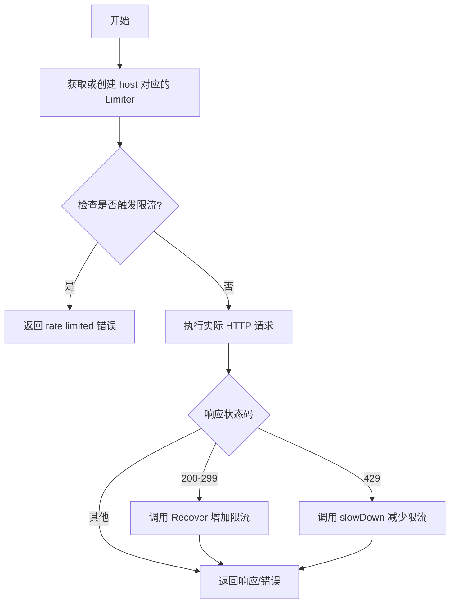
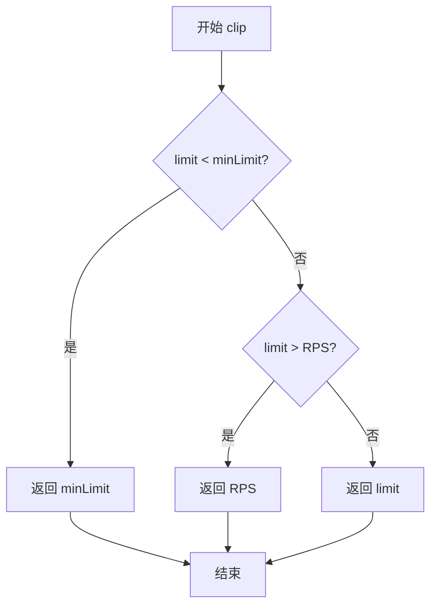
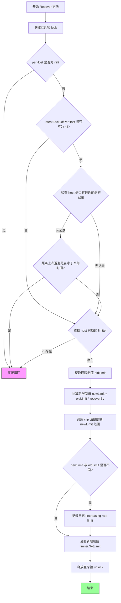
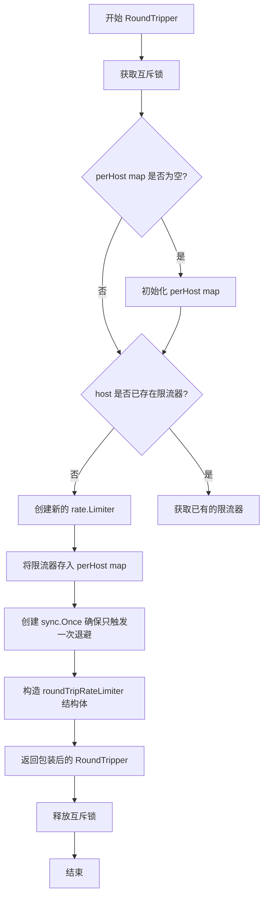
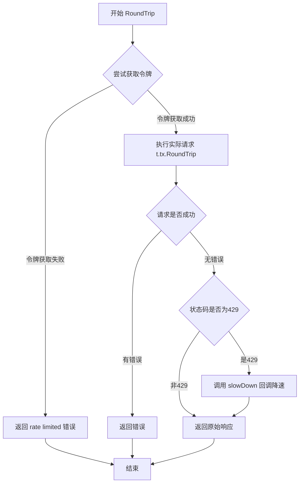

# `flux\pkg\registry\middleware\rate_limiter.go` 详细设计文档

这是一个基于主机限流的中间件，通过维护每个主机的 rate limiter，实现请求速率限制。该中间件能够响应 HTTP 429 状态码自动降低对应主机的限流阈值，并在请求成功后逐步恢复限流速率，支持突发流量和冷却机制。

## 整体流程



## 类结构

```
RateLimiters (限流器管理器)
└── roundTripRateLimiter (内部实现)
```

## 全局变量及字段


### `minLimit`
    
最小速率限制值，防止限流阈值降得过低

类型：`float64`
    


### `backOffBy`
    
退避系数，用于在收到429时降低限流阈值

类型：`float64`
    


### `recoverBy`
    
恢复系数，用于在请求成功后逐步提升限流阈值

类型：`float64`
    


### `coolDownInSeconds`
    
冷却时间（秒），退避后需要等待的时间才允许恢复

类型：`int`
    


### `RateLimiters.RPS`
    
每秒请求数上限，初始化时设置的理想速率

类型：`float64`
    


### `RateLimiters.Burst`
    
突发请求数上限，允许的突发流量大小

类型：`int`
    


### `RateLimiters.Logger`
    
日志记录器，用于输出限流相关的日志信息

类型：`log.Logger`
    


### `RateLimiters.perHost`
    
每个主机的限流器映射，维护不同主机的独立限流器

类型：`map[string]*rate.Limiter`
    


### `RateLimiters.latestBackOffPerHost`
    
每主机上次退避时间，用于判断是否在冷却期内

类型：`map[string]time.Time`
    


### `RateLimiters.mu`
    
互斥锁，保证并发访问时的线程安全

类型：`sync.Mutex`
    


### `roundTripRateLimiter.rl`
    
速率限制器实例，用于控制请求速率

类型：`*rate.Limiter`
    


### `roundTripRateLimiter.tx`
    
实际传输层，负责执行真实的HTTP请求

类型：`http.RoundTripper`
    


### `roundTripRateLimiter.slowDown`
    
降速回调函数，在收到429状态码时触发限流降低

类型：`func()`
    
    

## 全局函数及方法


### RateLimiters.clip

该方法用于将传入的 limit 值限制在 minLimit（0.1）和 RPS（RateLimiters 的 RPS 字段）之间，确保速率限制值始终在合法范围内。

参数：

- `limit`：`float64`，需要被限制的速率值

返回值：`float64`，限制后的速率值，确保在 minLimit 和 RPS 之间

#### 流程图



#### 带注释源码

```go
// clip 限制 limit 在 minLimit 和 RPS 之间
// 参数 limit: 需要被限制的速率值
// 返回值: 限制后的速率值，确保在 [minLimit, RPS] 范围内
func (limiters *RateLimiters) clip(limit float64) float64 {
	// 如果 limit 小于最小限制，则返回最小限制值
	if limit < minLimit {
		return minLimit
	}
	// 如果 limit 大于 RPS，则返回 RPS 作为上限
	if limit > limiters.RPS {
		return limiters.RPS
	}
	// limit 在有效范围内，直接返回
	return limit
}
```


### `RateLimiters.backOff`

该方法用于显式降低指定主机的速率限制阈值。当检测到服务端返回 HTTP 429（请求过多）时，此方法会被调用，通过将当前限制值除以退避系数（`backOffBy`，通常为2.0）来动态减小限流窗口，从而缓解对目标服务的压力。

参数：
- `host`：`string`，需要降低限流阈值的目标主机标识（主机名或IP）。

返回值：`void`（无返回值），该方法直接修改 `RateLimiters` 内部维护的 `perHost` 映射中对应主机的 `rate.Limiter` 状态。

#### 流程图

```mermaid
flowchart TD
    A([Start: backOff]) --> B[Lock limiters.mu]
    B --> C{perHost map is nil?}
    C -->|Yes| D[Initialize perHost map]
    C -->|No| E{host exists in perHost?}
    D --> E
    E -->|No| F[Create new Limiter with default RPS/Burst]
    F --> G[Store Limiter in perHost]
    E -->|Yes| H[Get existing Limiter]
    G --> I
    H --> I[Get current Limit]
    I --> J[Calculate New Limit: oldLimit / backOffBy]
    J --> K[Clip New Limit: ensure between minLimit and RPS]
    K --> L{Limit Changed?}
    L -->|Yes| M[Log: 'reducing rate limit']
    L -->|No| N
    M --> N[Set Limiter LimitAt current time]
    N --> O[Update latestBackOffPerHost[host]]
    O --> P[Unlock limiters.mu]
    P --> Q([End])
```

#### 带注释源码

```go
// backOff can be called to explicitly reduce the limit for
// a particular host. Usually this isn't necessary since a RoundTripper
// obtained for a host will respond to `HTTP 429` by doing this for
// you.
func (limiters *RateLimiters) backOff(host string) {
	// 获取互斥锁，确保并发安全地修改共享资源
	limiters.mu.Lock()
	defer limiters.mu.Unlock()

	var limiter *rate.Limiter
	// 初始化 perHost 映射
	if limiters.perHost == nil {
		limiters.perHost = map[string]*rate.Limiter{}
	}
	// 检查该主机是否已有对应的限流器
	if rl, ok := limiters.perHost[host]; ok {
		limiter = rl
	} else {
		// 如果没有，则创建一个新的默认限流器
		limiter = rate.NewLimiter(rate.Limit(limiters.RPS), limiters.Burst)
		limiters.perHost[host] = limiter
	}

	// 获取旧限流阈值
	oldLimit := float64(limiter.Limit())
	// 计算新阈值：除以退避系数 (2.0)
	newLimit := limiters.clip(oldLimit / backOffBy)
	
	// 如果阈值发生变化且日志记录器存在，记录日志
	if oldLimit != newLimit && limiters.Logger != nil {
		limiters.Logger.Log("info", "reducing rate limit", "host", host, "limit", strconv.FormatFloat(newLimit, 'f', 2, 64))
	}
	
	// 获取当前时间并更新限流器的速率限制
	backOffTime := time.Now()
	limiter.SetLimitAt(backOffTime, rate.Limit(newLimit))
	
	// 记录该主机最近一次进行退避的时间，用于冷却逻辑
	if limiters.latestBackOffPerHost == nil {
		limiters.latestBackOffPerHost = map[string]time.Time{}
	}
	limiters.latestBackOffPerHost[host] = backOffTime
}
```


### `RateLimiters.Recover`

当使用 RoundTripper 成功完成请求后调用此方法，以将速率限制阈值适度增加回接近理想值。该方法实现了一个冷却机制，防止在短时间内频繁调整限制。

参数：

- `host`：`string`，目标主机地址，用于标识需要恢复限流阈值的特定主机

返回值：`无`（方法无返回值），通过直接修改内部 limiter 的限流值来达到恢复效果

#### 流程图



#### 带注释源码

```go
// Recover should be called when a use of a RoundTripper has
// succeeded, to bump the limit back up again.
// Recover 应该在 RoundTripper 使用成功后调用，以将限制值提高回来。
func (limiters *RateLimiters) Recover(host string) {
	// 获取互斥锁，保证线程安全
	limiters.mu.Lock()
	// 方法结束时释放锁
	defer limiters.mu.Unlock()
	
	// 如果从未创建过任何 limiter，直接返回
	if limiters.perHost == nil {
		return
	}
	
	// 检查是否存在退避记录冷却机制
	if limiters.latestBackOffPerHost != nil {
		// 如果该 host 有过退避记录且仍在冷却期内，则不进行恢复
		if t, ok := limiters.latestBackOffPerHost[host]; ok && time.Since(t) < coolDownInSeconds*time.Second {
			return
		}
	}
	
	// 查找该 host 对应的 rate limiter
	if limiter, ok := limiters.perHost[host]; ok {
		// 获取当前限制值
		oldLimit := float64(limiter.Limit())
		// 计算新限制值: 旧值 * 1.5 (recoverBy)
		newLimit := limiters.clip(oldLimit * recoverBy)
		
		// 如果限制值发生变化且存在日志记录器，记录日志
		if newLimit != oldLimit && limiters.Logger != nil {
			limiters.Logger.Log("info", "increasing rate limit", "host", host, "limit", strconv.FormatFloat(newLimit, 'f', 2, 64))
		}
		
		// 应用新的限制值到 limiter
		limiter.SetLimit(rate.Limit(newLimit))
	}
}
```


### RateLimiters.RoundTripper

获取一个为特定主机实现速率限制的 HTTP RoundTripper。该方法会为每个主机维护独立的限流器，并将传入的 RoundTripper 包装成具有限流和退避功能的 RoundTripper。

参数：

- `rt`：`http.RoundTripper`，要包装的底层 HTTP 传输器
- `host`：`string`，要进行速率限制的目标主机名

返回值：`http.RoundTripper`，包装了速率限制功能的 HTTP 传输器

#### 流程图



#### 带注释源码

```go
// RoundTripper returns a RoundTripper for a particular host.
// We expect to do a number of requests to a particular host at a time.
func (limiters *RateLimiters) RoundTripper(rt http.RoundTripper, host string) http.RoundTripper {
	// 加锁保证线程安全，防止并发访问 map
	limiters.mu.Lock()
	defer limiters.mu.Unlock()

	// 初始化 perHost map（延迟初始化）
	if limiters.perHost == nil {
		limiters.perHost = map[string]*rate.Limiter{}
	}
	
	// 如果该 host 还没有限流器，则创建一个新的
	// rate.Limiter 使用 RPS（每秒请求数）和 Burst（突发容量）配置
	if _, ok := limiters.perHost[host]; !ok {
		rl := rate.NewLimiter(rate.Limit(limiters.RPS), limiters.Burst)
		limiters.perHost[host] = rl
	}
	
	// 使用 sync.Once 确保在并发情况下，收到 429 时只触发一次退避
	// 防止多个并发请求同时触发限流降低
	var reduceOnce sync.Once
	
	// 返回包装后的 roundTripRateLimiter
	// 它会在每次请求前检查限流，收到 429 时调用 slowDown 回调
	return &roundTripRateLimiter{
		rl: limiters.perHost[host],       // 该主机的限流器
		tx: rt,                            // 下游的真实传输器
		slowDown: func() {                 // 退避回调函数
			// 只执行一次 backOff，避免重复降低限流
			reduceOnce.Do(func() { limiters.backOff(host) })
		},
	}
}
```


### `roundTripRateLimiter.RoundTrip`

该方法是限流HTTP客户端的核心实现，通过令牌桶算法对请求进行预emptive限流，并在收到 HTTP 429 响应时自动触发降速回调，实现自适应的速率控制。

参数：

- `r`：`*http.Request`，输入的 HTTP 请求对象，用于获取上下文以判断是否超时，并传递给底层 Transport 执行

返回值：`*http.Response`，返回原始的 HTTP 响应；`error`，返回执行过程中的错误（限流超时或请求执行错误）

#### 流程图



#### 带注释源码

```go
func (t *roundTripRateLimiter) RoundTrip(r *http.Request) (*http.Response, error) {
    // Wait 会检查请求上下文中的截止时间，如果无法在期限内获得令牌则立即返回错误
    // 这是一种 pre-emptive 限流策略，而非等待整个令牌填充周期
    if err := t.rl.Wait(r.Context()); err != nil {
        // 封装错误并返回，告知调用方请求被限流
        return nil, errors.Wrap(err, "rate limited")
    }
    
    // 令牌获取成功，执行实际的 HTTP 请求
    resp, err := t.tx.RoundTrip(r)
    
    // 如果请求执行本身失败，直接返回错误
    if err != nil {
        return nil, err
    }
    
    // 检查响应状态码，如果是 429 Too Many Requests
    if resp.StatusCode == http.StatusTooManyRequests {
        // 调用 slowDown 回调，该回调会在首次调用后自动失效（通过 sync.Once）
        // 以防止并发请求重复触发降速
        t.slowDown()
    }
    
    // 返回响应和可能的错误
    return resp, err
}
```

## 关键组件


### 速率限制器管理组件 (RateLimiters)

核心结构体，负责管理所有主机的速率限制状态。包含RPS（每秒请求数）配置、Burst容量、perHost映射表（存储每个主机的限流器）、latestBackOffPerHost（记录每个主机的退避时间用于冷却）、以及互斥锁保护并发访问。

### 按主机限流器 (perHost map[string]*rate.Limiter)

使用Go标准库golang.org/x/time/rate实现的令牌桶算法限流器。每个主机独立维护一个限流器，支持Burst突发容量，允许在限制范围内突发处理请求。

### 动态限流调整机制

包含backOff方法（收到429时降低限流）和Recover方法（成功响应后提升限流）。通过backOffBy（2.0倍）和recoverBy（1.5倍）系数动态调整，配合coolDownInSeconds（1200秒）冷却期避免频繁调整。

### 限流RoundTripper包装器 (roundTripRateLimiter)

包装原始http.RoundTripper，在请求发送前执行令牌等待（t.rl.Wait），检测到429状态码时触发限流降低，使用sync.Once确保只降低一次。

### 限流值裁剪函数 (clip)

确保限流值在minLimit（0.1）和配置的RPS之间，防止限流值过小导致完全阻塞或过大失去限流效果。

### 主机构建方法 (RoundTripper)

为指定主机创建或复用限流器，返回包装后的roundTripRateLimiter，实现http.RoundTripper接口供http.Client使用。


## 问题及建议


### 已知问题

- **内存泄漏风险**：`perHost`和`latestBackOffPerHost`两个map会无限增长，没有清理机制。当请求的host数量很多时，会导致内存持续增长
- **并发安全隐患**：在`backOff`方法中，先检查`perHost`是否存在host，再创建新的limiter，这两步之间没有原子性保证，可能导致竞态条件
- **资源未正确释放**：当收到429响应时，直接返回响应但没有关闭响应体，可能导致HTTP连接泄漏
- **降级逻辑不完善**：检测到429后只是调用`slowDown()`降速，但仍然返回原始响应，调用者无法区分是限流响应还是正常响应
- **性能瓶颈**：每次请求`RoundTripper`都需要获取锁，在高并发场景下可能成为性能瓶颈
- **冷却时间过于刚性**：`coolDownInSeconds`是固定值，对所有host统一对待，不够灵活
- **缺少重试机制**：遇到限流时没有实现自动重试逻辑，调用者需要自己处理
- **错误处理不规范**：使用`errors.Wrap`包装错误，但没有区分错误类型，调用者难以针对性处理

### 优化建议

- **实现map清理机制**：添加定时任务或基于LRU策略清理不活跃的host对应的limiter，避免内存无限增长
- **优化并发安全**：使用`sync.Map`或改进锁的粒度，减少锁竞争
- **完善资源管理**：收到429响应时，关闭响应体或提供选项让调用者处理
- **增加重试支持**：提供可选的重试装饰器，支持指数退避重试
- **改进配置灵活性**：允许为不同host设置不同的RPS和冷却时间
- **添加指标监控**：集成prometheus等指标库，暴露限流相关的度量数据
- **优化锁策略**：考虑使用读写锁，或为每个host使用独立的limiter减少锁竞争
- **规范化错误处理**：定义具体的错误类型，如`ErrRateLimited`，便于调用者区分处理
- **添加上下文支持**：支持通过context传递限流配置，实现更精细的控制
</think>

## 其它


### 设计目标与约束

该中间件的设计目标是为HTTP客户端提供基于每个主机（per-host）的速率限制能力，防止对目标服务器造成过大压力。核心约束包括：1）使用token bucket算法实现速率限制；2）支持自动降级（响应429时）和自动恢复（请求成功时）；3）并发安全，支持多goroutine同时访问；4）最小速率限制为0.1 RPS，最大不超过配置的RPS值；5）冷却期为1200秒，期间不会增加速率限制。

### 错误处理与异常设计

错误处理主要体现在以下几个方面：1）速率限制超时时返回带"rate limited"包装的错误，使用github.com/pkg/errors进行错误封装；2）当请求上下文超时或取消时，rl.Wait()会返回错误，此时直接返回错误而不继续请求；3）网络错误（t.tx.RoundTrip返回）直接透传；4）对于429响应不返回错误，而是触发slowDown回调降低速率限制；5）日志记录仅在Logger不为nil时执行，避免空指针panic。

### 数据流与状态机

速率限制器的状态转换如下：1）初始状态：每个host的limiter以配置的RPS和Burst初始化；2）降级状态：当收到HTTP 429响应时，调用backOff方法将速率限制降低为原来的1/2（backOffBy=2.0），并记录降级时间；3）恢复状态：调用Recover方法且冷却期（1200秒）已过时，将速率限制提高为原来的1.5倍（recoverBy=1.5）；4）边界状态：通过clip方法确保速率限制始终在[minLimit, RPS]范围内。

### 外部依赖与接口契约

主要外部依赖包括：1）golang.org/x/time/rate - 提供token bucket速率限制实现；2）github.com/go-kit/log - 提供日志接口；3）github.com/pkg/errors - 提供错误包装功能；4）net/http - 标准库HTTP相关接口。对外接口契约：RateLimiters结构体需配置RPS（float64）、Burst（int）、Logger（log.Logger）字段；RoundTripper方法接收http.RoundTripper和host字符串，返回包装后的http.RoundTripper；Recover方法接收host字符串用于恢复该host的速率限制；backOff方法接收host字符串用于主动降级。

### 并发与线程安全设计

并发安全通过以下机制保证：1）使用sync.Mutex保护所有共享状态（perHost map、latestBackOffPerHost map）；2）使用sync.Once确保降级操作只执行一次（reduceOnce），避免并发请求同时触发backOff;3）RateLimiters的公开方法（RoundTripper、Recover、backOff）都自行加锁；4）roundTripRateLimiter的RoundTrip方法调用时已经在外层方法的锁保护范围内。

### 配置与可扩展性

配置参数通过RateLimiters结构体字段提供：1）RPS - 期望的每秒请求数，作为速率上限；2）Burst - 突发容量，允许的突发请求数；3）Logger - 日志记录器接口。内部常量可调整：minLimit（最小速率限制）、backOffBy（降级因子）、recoverBy（恢复因子）、coolDownInSeconds（冷却期秒数）。当前设计为每主机独立限制，未提供跨主机全局限制或动态配置热更新能力。

### 性能考虑

性能优化点：1）使用sync.Mutex而非RWMutex，因为写操作（降级/恢复）不频繁，读写比例接近；2）sync.Once确保降级回调只执行一次，避免重复计算；3）map预分配：在perHost为nil时才创建map，避免空map开销；4）使用deferUnlock确保锁释放。潜在性能瓶颈：1）每次请求都需要加锁获取limiter，高并发下可能有锁竞争；2）日志使用Logger.Log可能有一定开销。

### 安全性考虑

安全方面：1）未对host参数进行验证，可能接受任意字符串作为key；2）未对RPS、Burst参数进行范围校验，负数或极值可能导致异常行为；3）速率限制本身是一种DoS防护机制，但该实现依赖客户端主动调用，存在客户端不遵守的风险；4）敏感信息未在日志中泄露。

### 使用示例与集成指南

典型使用流程：1）创建RateLimiters实例并配置参数；2）调用RoundTripper方法获取针对特定host的限速transport；3）将返回的RoundTripper配置到HTTP客户端的Transport；4）在请求成功后调用Recover方法更新限制；5）HTTP 429响应会自动触发降级。示例代码：
```go
limiters := &middleware.RateLimiters{
    RPS:    10.0,
    Burst:  20,
    Logger: log.NewNopLogger(), // 生产环境使用真实logger
}
client := &http.Client{
    Transport: limiters.RoundTripper(http.DefaultTransport, "api.example.com"),
}
// 请求后恢复
resp, err := client.Do(req)
if err == nil && resp.StatusCode < 400 {
    limiters.Recover("api.example.com")
}
```


    