# `flux\pkg\registry\mock\mock.go` 详细设计文档

这是一个用于测试的 mock 包，提供了 Client、ClientFactory 和 Registry 三个结构体的模拟实现，用于在无需真实registry的情况下模拟镜像仓库的客户端操作，支持获取镜像清单、标签列表、仓库元数据和镜像信息等功能，主要用于 fluxcd 项目的单元测试。

## 整体流程

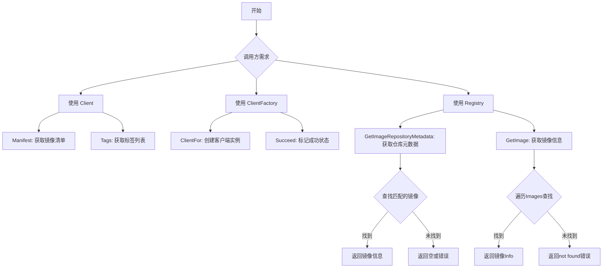

## 类结构

```
mock 包
├── Client (实现 registry.Client 接口)
│   └── 方法: Manifest, Tags
├── ClientFactory (实现 registry.ClientFactory 接口)
方法: ClientFor
Succeed
└── Registry (实现 registry.Registry 接口)
    └── 方法: GetImageRepositoryMetadata, GetImage
```

## 全局变量及字段


### `var _ registry.Client = &Client{}`
    
编译时接口实现检查，确保Client实现了registry.Client接口

类型：`compile-time interface check`
    


### `var _ registry.ClientFactory = &ClientFactory{}`
    
编译时接口实现检查，确保ClientFactory实现了registry.ClientFactory接口

类型：`compile-time interface check`
    


### `var _ registry.Registry = &Registry{}`
    
编译时接口实现检查，确保Registry实现了registry.Registry接口

类型：`compile-time interface check`
    


### `Client.ManifestFn`
    
用于模拟获取镜像清单的函数

类型：`func(ref string) (registry.ImageEntry, error)`
    


### `Client.TagsFn`
    
用于模拟获取标签列表的函数

类型：`func() ([]string, error)`
    


### `ClientFactory.Client`
    
模拟的客户端实例

类型：`registry.Client`
    


### `ClientFactory.Err`
    
模拟返回的错误

类型：`error`
    


### `Registry.Images`
    
模拟的镜像列表

类型：`[]image.Info`
    


### `Registry.Err`
    
模拟返回的错误

类型：`error`
    
    

## 全局函数及方法


### `(m *Client) Manifest`

该方法是一个 Mock 客户端的 Manifest 方法，用于通过调用用户自定义的 `ManifestFn` 函数获取指定镜像标签的清单信息，并返回 `registry.ImageEntry` 和可能的错误。这是 Fluxcd 项目中用于测试目的的模拟客户端实现。

参数：

- `ctx`：`context.Context`，上下文信息，用于控制请求的生命周期（在此实现中未直接使用）
- `tag`：`string`，镜像标签，用于查询对应的镜像清单

返回值：`registry.ImageEntry, error`，返回镜像清单条目和可能的错误信息

#### 流程图

```mermaid
flowchart TD
    A[开始调用 Manifest 方法] --> B[接收 ctx 和 tag 参数]
    B --> C{检查 ManifestFn 是否为 nil}
    C -->|ManifestFn 不为 nil| D[调用 m.ManifestFn(tag)]
    C -->|ManifestFn 为 nil| E[返回零值 ImageEntry 和 nil 错误]
    D --> F[返回 ImageEntry 和 error]
    E --> F
    F[结束调用]
```

#### 带注释源码

```go
// Manifest 获取指定标签的镜像清单信息
// 参数 ctx 为上下文对象（在此实现中未使用）
// 参数 tag 为镜像标签字符串
// 返回 registry.ImageEntry 镜像清单条目和 error 错误信息
func (m *Client) Manifest(ctx context.Context, tag string) (registry.ImageEntry, error) {
    // 直接调用 Client 结构体中存储的 ManifestFn 函数
    // 这种设计允许在测试时注入自定义的 mock 行为
    return m.ManifestFn(tag)
}
```


### `(*Client).Tags`

获取镜像标签列表的核心方法，通过调用 `TagsFn` 函数字段获取标签并返回。

#### 参数

- `ctx`：`context.Context`，上下文对象，用于传递请求范围的取消信号和截止时间（虽然当前实现中未使用，但为满足 `registry.Client` 接口而保留）

#### 返回值

- `[]string`，标签名称列表
- `error`，获取标签过程中发生的错误（如 `TagsFn` 返回的错误）

#### 流程图

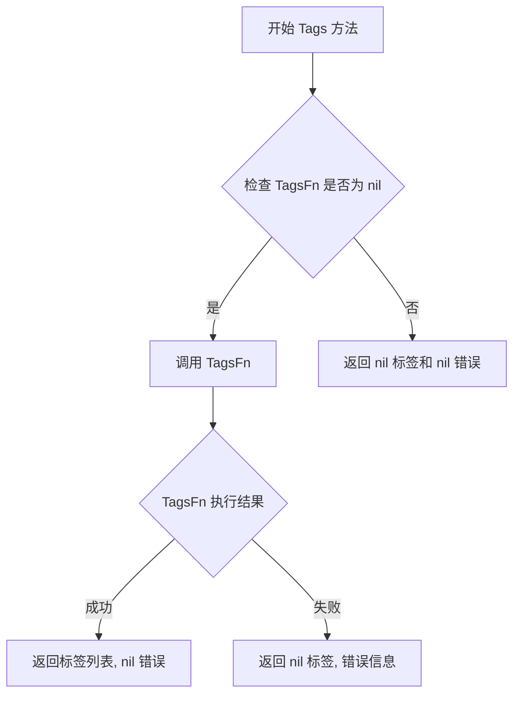

#### 带注释源码

```go
// Tags 获取镜像的所有标签名称
// 参数 ctx 为上下文信息，当前实现中未使用此参数
// 返回值:
//   - []string: 标签名称列表
//   - error: 执行过程中的错误信息
func (m *Client) Tags(context.Context) ([]string, error) {
    // 直接调用客户端持有的 TagsFn 函数字段
    // TagsFn 是由调用方注入的模拟函数，用于返回预定义的标签列表
    return m.TagsFn()
}
```


### `ClientFactory.ClientFor`

该方法用于在测试场景中返回预设的 `Client` 实例和 `Err` 错误，实现 `registry.ClientFactory` 接口的模拟行为。

**参数：**

- `repository`：`image.CanonicalName`，目标镜像仓库的规范名称
- `creds`：`registry.Credentials`，访问仓库所需的凭证信息

**返回值：**

- `registry.Client`：预设的客户端实例
- `error`：预设的错误值，若无错误则为 `nil`

#### 流程图

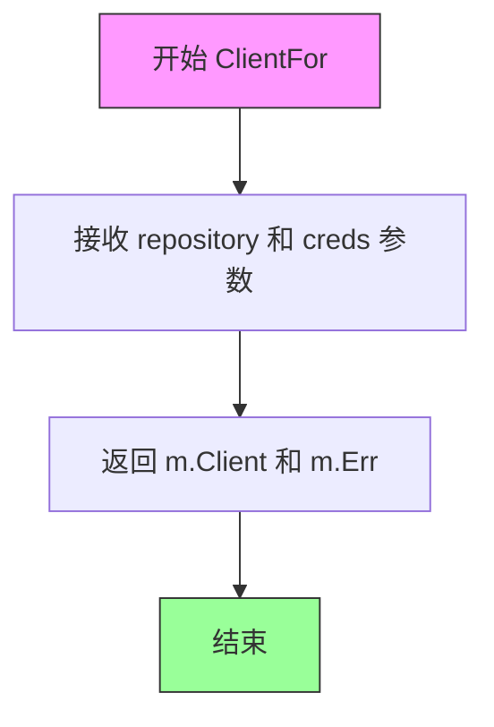

#### 带注释源码

```go
// ClientFor 返回预设的 Client 实例和错误
// 用于测试场景中模拟 ClientFactory 的行为
// 参数:
//   - repository: 镜像仓库的规范名称
//   - creds: 仓库访问凭证
//
// 返回值:
//   - registry.Client: 预设的客户端实例
//   - error: 预设的错误,若无错误则为 nil
func (m *ClientFactory) ClientFor(repository image.CanonicalName, creds registry.Credentials) (registry.Client, error) {
    // 直接返回结构体中预设的 Client 和 Err 值
    return m.Client, m.Err
}
```

---

#### 关键组件信息

| 名称 | 描述 |
|------|------|
| `ClientFactory` | 模拟 `registry.ClientFactory` 接口的测试辅助结构体 |
| `Client` | 实现了 `registry.Client` 接口的模拟客户端 |
| `Registry` | 实现了 `registry.Registry` 接口的模拟注册表 |

#### 潜在技术债务与优化空间

1. **无参数验证**：方法未对 `repository` 和 `creds` 参数进行有效性检查
2. **硬编码返回逻辑**：直接返回字段值，缺少更复杂的模拟逻辑支持
3. **缺少日志记录**：在测试场景中可能需要记录调用次数或参数以辅助调试


### ClientFactory.Succeed

空方法，用于标记成功状态。

参数：

- `_`：`image.CanonicalName`，第一个参数未命名，类型为 image.CanonicalName

返回值：无

#### 流程图

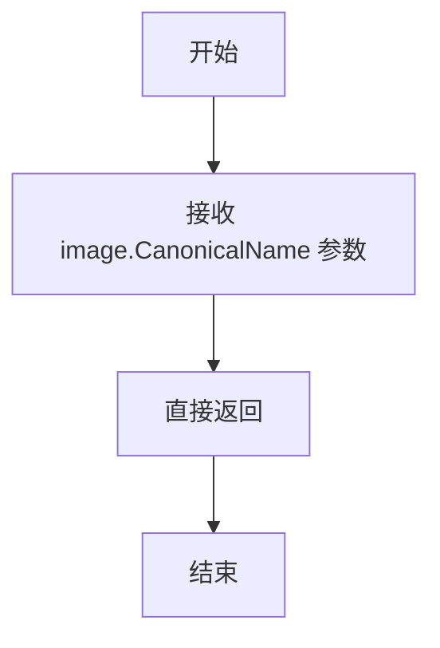

#### 带注释源码

```go
// Succeed 是一个空方法，用于标记成功状态
// 参数:
//   - _ image.CanonicalName: 接收一个 image.CanonicalName 类型的参数，但未使用
//
// 返回值:
//   - 无返回值
func (_ *ClientFactory) Succeed(_ image.CanonicalName) {
	return
}
```


### `Registry.GetImageRepositoryMetadata`

该方法用于在模拟的注册表中查找并返回指定镜像仓库的元数据信息，包括所有可用的标签和对应的镜像详情。

参数：

- `id`：`image.Name`，目标镜像仓库的名称

返回值：`image.RepositoryMetadata, error`，返回包含所有标签和镜像信息的仓库元数据，以及可能的错误信息

#### 流程图

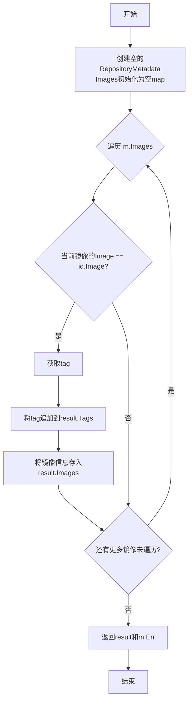

#### 带注释源码

```
// GetImageRepositoryMetadata 查找并返回仓库元数据
// 参数 id: image.Name - 目标镜像仓库的名称
// 返回值: image.RepositoryMetadata - 包含Tags和Images的元数据; error - 可能的错误
func (m *Registry) GetImageRepositoryMetadata(id image.Name) (image.RepositoryMetadata, error) {
	// 初始化返回结果，创建一个空的RepositoryMetadata结构
	// Images字段初始化为空map，用于存储tag到镜像信息的映射
	result := image.RepositoryMetadata{
		Images: map[string]image.Info{},
	}
	// 遍历Registry中所有的镜像信息
	for _, i := range m.Images {
		// 仅当镜像的Image字段与目标id的Image字段匹配时才处理
		// 这样确保只返回同一仓库的镜像
		if i.ID.Image == id.Image {
			// 获取当前镜像的tag
			tag := i.ID.Tag
			// 将tag添加到结果标签列表中
			result.Tags = append(result.Tags, tag)
			// 将完整的镜像信息存入Images映射，key为tag
			result.Images[tag] = i
		}
	}
	// 返回构建好的元数据结果和可能的错误
	// 如果m.Err不为nil，错误会被返回
	return result, m.Err
}
```


### `Registry.GetImage`

根据给定的镜像引用（`id`）在模拟的镜像列表中查找并返回对应的镜像详情。如果列表中存在匹配的镜像，则返回该镜像信息；否则返回一个空的镜像结构体和一个表示“未找到”的错误。

#### 参数

- `id`：`image.Ref`，目标镜像的引用，包含了镜像的完整名称（Repository:Tag）和标识。

#### 返回值

- `image.Info`：如果找到匹配的镜像，返回该镜像的详细信息（包含 ID、创建时间、元数据等）。
- `error`：如果遍历完所有镜像均未找到匹配的 ID，则返回错误；否则返回 `nil`。

#### 流程图

```mermaid
flowchart TD
    A([开始 GetImage]) --> B[输入参数: id (image.Ref)]
    B --> C{遍历 m.Images 切片}
    C --> D{当前镜像 i.ID == id?}
    D -- 是 --> E[返回镜像 i, nil]
    D -- 否 --> C
    C -- 遍历结束未找到 --> F[返回空 image.Info, errors.New]
    E --> G([结束])
    F --> G
```

#### 带注释源码

```go
// GetImage 根据镜像引用查找镜像信息
// 参数 id: image.Ref 类型的镜像引用
// 返回值: 找到的 image.Info 和 error
func (m *Registry) GetImage(id image.Ref) (image.Info, error) {
	// 遍历 Registry 中存储的所有模拟镜像
	for _, i := range m.Images {
		// 将当前镜像的 ID 转换为字符串与目标引用字符串进行比较
		if i.ID.String() == id.String() {
			// 匹配成功，返回找到的镜像信息和空错误
			return i, nil
		}
	}
	// 循环结束未发现匹配项，返回空的镜像信息结构体和错误提示
	return image.Info{}, errors.New("not found")
}
```


### `Client.Manifest`

该方法是 `Client` 类型的成员方法，作为镜像仓库的 Manifest 获取接口，通过委托给 `Client` 结构体中的 `ManifestFn` 函数字段来实现功能，支持通过标签获取镜像的清单信息。

参数：

- `ctx`：`context.Context`，上下文对象，用于传递请求作用域的截止时间、取消信号等
- `tag`：`string`，镜像标签，用于指定要获取 Manifest 的镜像版本

返回值：`registry.ImageEntry`，返回包含镜像元数据的条目对象；`error`，如果获取失败则返回错误信息

#### 流程图

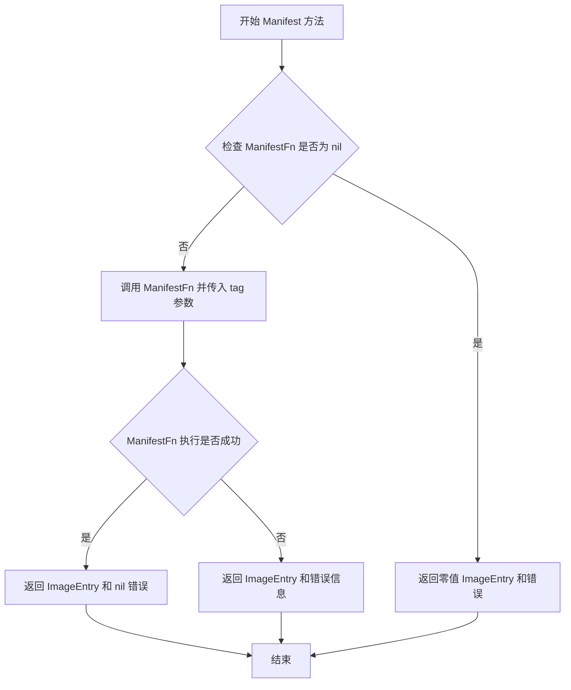

#### 带注释源码

```go
// Manifest 获取指定标签的镜像 Manifest 信息
// 参数 ctx 用于控制请求生命周期，tag 指定镜像标签
// 返回 ImageEntry 包含镜像详细信息，或 error 表示获取失败
func (m *Client) Manifest(ctx context.Context, tag string) (registry.ImageEntry, error) {
    // 委托给 ManifestFn 字段执行实际的获取逻辑
    // 这种设计允许在测试时注入自定义的 mock 行为
    return m.ManifestFn(tag)
}
```


### `Client.Tags`

该方法是一个mock实现，用于模拟registry客户端获取镜像标签列表的功能。它接收一个context.Context参数（未使用），内部委托给Client结构体中存储的TagsFn函数字段来执行实际的标签获取逻辑，并返回标签字符串切片和可能发生的错误。

参数：

- `context.Context`：`context.Context`，上下文对象，用于传递请求作用域的取消信号和截止时间（在此mock实现中未使用）

返回值：`([]string, error)`，返回镜像标签列表的字符串切片，以及可能出现的错误信息

#### 流程图

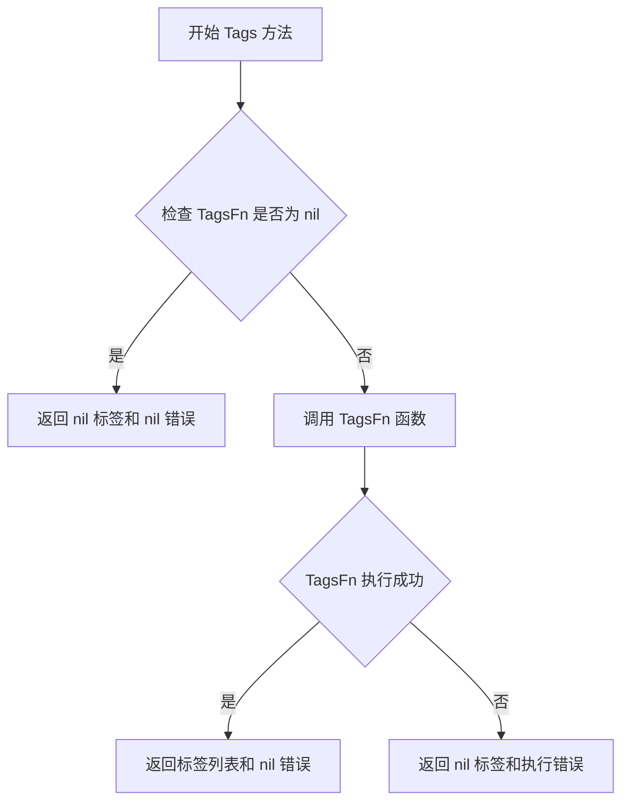

#### 带注释源码

```go
// Tags 获取镜像的标签列表
// 参数 ctx 是上下文对象，用于传递请求相关的取消信号和截止时间
// 返回值 tags 是镜像标签的字符串切片，err 表示可能发生的错误
func (m *Client) Tags(context.Context) ([]string, error) {
    // 委托给 TagsFn 函数字段执行实际的标签获取逻辑
    // 这种设计允许在测试时注入自定义的标签获取行为
    return m.TagsFn()
}
```


### `ClientFactory.ClientFor`

该方法是一个模拟工厂方法，用于根据给定的镜像仓库名称和凭证返回预设的 `registry.Client` 实例和错误。在测试场景中，它允许调用者自定义返回的客户端和错误，以便进行单元测试和集成测试。

参数：

- `repository`：`image.CanonicalName`，目标镜像仓库的规范名称
- `creds`：`registry.Credentials`，用于认证的凭证信息

返回值：`registry.Client, error`，返回预设的客户端实例和错误信息

#### 流程图

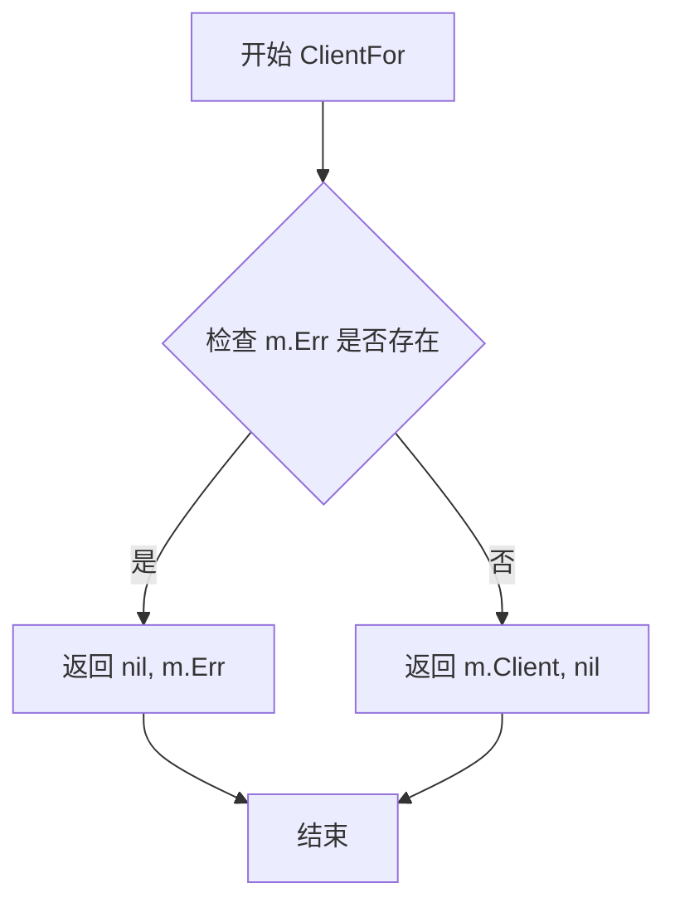

#### 带注释源码

```go
// ClientFor 根据给定的仓库名称和凭证返回对应的客户端实例和错误
// 这是一个模拟工厂方法的实现，用于测试目的
// 参数:
//   - repository: 镜像仓库的规范名称
//   - creds: 认证凭证
//
// 返回值:
//   - registry.Client: 预设的客户端实例
//   - error: 预设的错误信息（如果有）
func (m *ClientFactory) ClientFor(repository image.CanonicalName, creds registry.Credentials) (registry.Client, error) {
    // 直接返回预先设置的 Client 和 Err
    // 如果 m.Err 不为 nil，则返回错误；否则返回有效的 Client
    return m.Client, m.Err
}
```


### `ClientFactory.Succeed`

该方法是 `ClientFactory` 类型的模拟实现，用于代表一个“成功”的操作场景。在当前代码中，它是一个空实现（Stub/Passthrough），接收一个 `image.CanonicalName` 类型的参数，但内部不执行任何具体逻辑并直接返回。通常用于测试场景中，表示该工厂_mock_ 已准备好成功创建客户端。

参数：

- `_`：`image.CanonicalName`，输入的镜像仓库规范名称（在此实现中被忽略/未使用）。

返回值：`无`（Void），表示无返回值。

#### 流程图

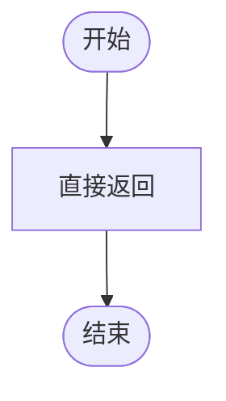

#### 带注释源码

```go
// Succeed 是一个模拟方法，用于表示操作成功。
// 参数 _ image.CanonicalName 表示接收一个镜像仓库名称，但在此处未使用（由空标识符 _ 接收）。
func (_ *ClientFactory) Succeed(_ image.CanonicalName) {
    return // 直接返回，不执行任何操作
}
```


### `Registry.GetImageRepositoryMetadata`

该方法是一个模拟（Mock）实现，用于测试目的。它接收一个 `image.Name` 类型的图像名称作为参数，遍历 Registry 中存储的所有图像，筛选出与给定图像名称匹配的图像信息，构建并返回 `image.RepositoryMetadata` 类型的仓库元数据，同时返回可能存在的错误。

**参数：**

- `id`：`image.Name`，要获取元数据的图像名称

**返回值：** `image.RepositoryMetadata, error`，包含匹配图像信息的仓库元数据，以及可能存在的错误

#### 流程图

```mermaid
flowchart TD
    A[开始] --> B[初始化结果对象 result<br/>创建空 Images map]
    B --> C{遍历 m.Images}
    C -->|遍历每个图像 i| D{i.ID.Image == id.Image?}
    D -->|是| E[提取标签 tag = i.ID.Tag]
    E --> F[result.Tags = append result.Tags tag]
    F --> G[result.Images[tag] = i]
    D -->|否| H[继续下一次循环]
    G --> C
    H --> C
    C -->|遍历结束| I[返回 result, m.Err]
    I --> J[结束]
```

#### 带注释源码

```go
// GetImageRepositoryMetadata 返回指定图像仓库的元数据
// 参数 id: image.Name 类型的图像名称，用于匹配仓库中的图像
// 返回值: image.RepositoryMetadata 包含匹配图像的标签和详细信息, error 表示可能存在的错误
func (m *Registry) GetImageRepositoryMetadata(id image.Name) (image.RepositoryMetadata, error) {
    // 初始化结果对象，创建一个空的 Images map 用于存储图像信息
    result := image.RepositoryMetadata{
        Images: map[string]image.Info{},
    }
    
    // 遍历 Registry 中存储的所有图像
    for _, i := range m.Images {
        // 只包含同一仓库（同一位置）的图像
        // 检查当前图像的 Image 部分是否与给定的 id.Image 匹配
        if i.ID.Image == id.Image {
            // 提取当前图像的标签
            tag := i.ID.Tag
            
            // 将标签添加到结果 Tags 列表中
            result.Tags = append(result.Tags, tag)
            
            // 将图像信息存入 Images map，key 为标签
            result.Images[tag] = i
        }
    }
    
    // 返回构建好的仓库元数据和可能的错误
    return result, m.Err
}
```


### `Registry.GetImage`

该方法用于在模拟的注册表中根据给定的图像引用查找对应的图像信息，遍历内部存储的图像列表并返回第一个匹配的图像，若未找到则返回错误。

参数：

- `id`：`image.Ref`，要查找的图像引用

返回值：`image.Info, error`，返回匹配的图像信息（如果找到）和 nil 错误，或者返回空的 image.Info 和 "not found" 错误（如果未找到）

#### 流程图

```mermaid
flowchart TD
    A[开始 GetImage] --> B{遍历 m.Images}
    B -->|每次迭代| C{比较 i.ID.String 与 id.String}
    C -->|相等| D[返回 i, nil]
    C -->|不相等| B
    B -->|遍历完毕| E[返回 image.Info{}, errors.New]
    
    style D fill:#90EE90
    style E fill:#FFB6C1
```

#### 带注释源码

```go
// GetImage 根据给定的图像引用在注册表中查找对应的图像信息
// 参数 id: image.Ref 类型的图像引用
// 返回值: image.Info 类型的图像信息（如果找到）和 error 类型的错误（如果未找到）
func (m *Registry) GetImage(id image.Ref) (image.Info, error) {
    // 遍历注册表中的所有图像
    for _, i := range m.Images {
        // 比较当前图像的ID字符串表示与给定引用是否匹配
        if i.ID.String() == id.String() {
            // 找到匹配的图像，返回该图像信息和 nil 错误
            return i, nil
        }
    }
    // 遍历完所有图像均未找到匹配，返回空的图像信息和 "not found" 错误
    return image.Info{}, errors.New("not found")
}
```

## 关键组件


### 概述

这是一个FluxCD项目中的mock测试包，提供了用于单元测试的模拟注册表客户端实现，包括Client（镜像清单和标签获取）、ClientFactory（客户端工厂）和Registry（元数据查询）三个核心组件，用于在测试环境中替代真实的registry交互。

### 整体运行流程

1. 测试代码创建`Registry`实例并填充模拟的镜像数据
2. 通过`ClientFactory`创建`Client`实例
3. 调用`Client.Manifest()`获取特定镜像的清单信息
4. 调用`Client.Tags()`获取镜像的所有标签
5. 调用`Registry.GetImageRepositoryMetadata()`获取仓库元数据
6. 调用`Registry.GetImage()`根据镜像引用获取镜像信息

### 类详细信息

#### Client 类

**类字段：**

| 名称 | 类型 | 描述 |
|------|------|------|
| ManifestFn | func(ref string) (registry.ImageEntry, error) | 获取镜像清单的模拟函数 |
| TagsFn | func() ([]string, error) | 获取镜像标签列表的模拟函数 |

**类方法：**

##### Manifest 方法

- **名称**：Manifest
- **参数**：
  - ctx：context.Context - 上下文对象
  - tag：string - 镜像标签
- **参数类型**：context.Context, string
- **参数描述**：ctx用于控制请求超时和取消，tag指定要查询的镜像标签
- **返回值类型**：registry.ImageEntry, error
- **返回值描述**：返回镜像条目信息和可能的错误

**mermaid流程图**：
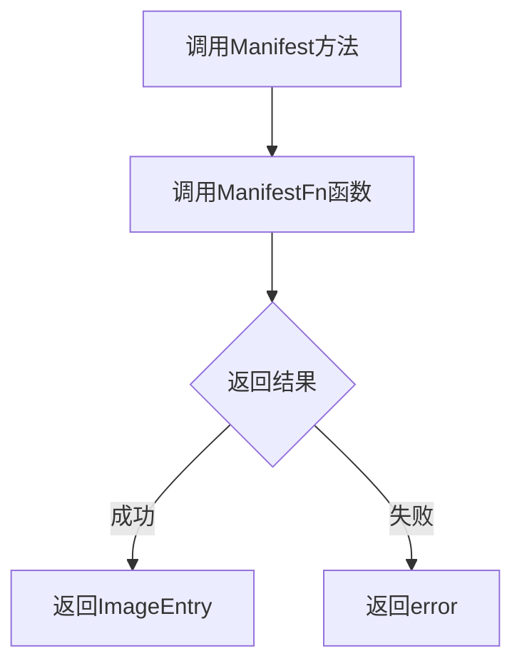

**源码**：
```go
func (m *Client) Manifest(ctx context.Context, tag string) (registry.ImageEntry, error) {
	return m.ManifestFn(tag)
}
```

##### Tags 方法

- **名称**：Tags
- **参数**：
  - context：context.Context - 上下文对象（未使用）
- **参数类型**：context.Context
- **参数描述**：ctx用于控制请求超时和取消
- **返回值类型**：[]string, error
- **返回值描述**：返回标签列表和可能的错误

**mermaid流程图**：
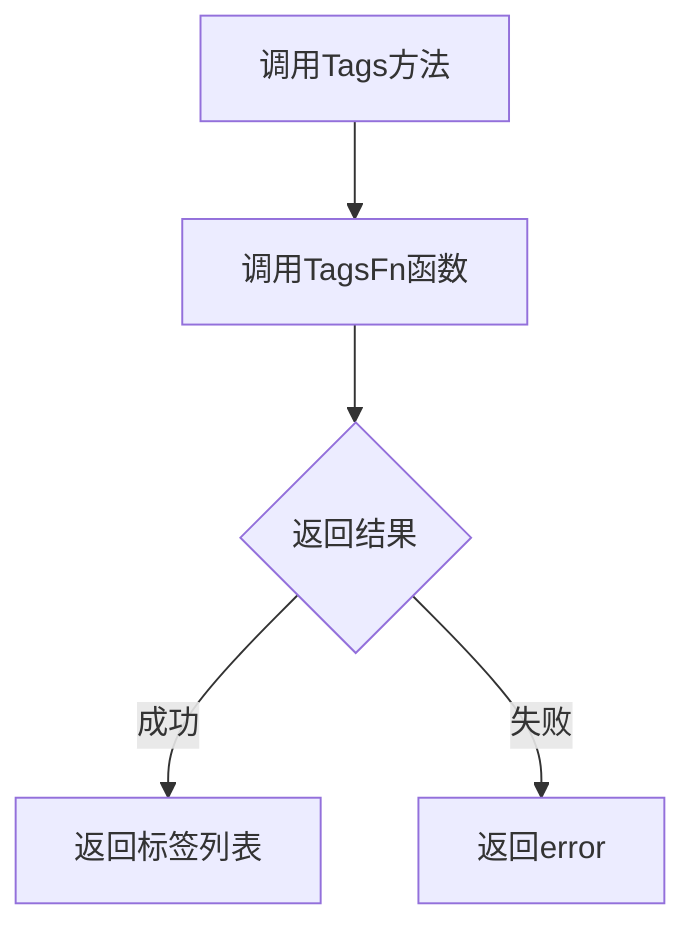

**源码**：
```go
func (m *Client) Tags(context.Context) ([]string, error) {
	return m.TagsFn()
}
```

---

#### ClientFactory 类

**类字段：**

| 名称 | 类型 | 描述 |
|------|------|------|
| Client | registry.Client | 要返回的模拟客户端实例 |
| Err | error | 模拟的客户端创建错误 |

**类方法：**

##### ClientFor 方法

- **名称**：ClientFor
- **参数**：
  - repository：image.CanonicalName - 镜像仓库名称
  - creds：registry.Credentials - 认证凭据
- **参数类型**：image.CanonicalName, registry.Credentials
- **参数描述**：repository指定目标仓库，creds提供认证信息
- **返回值类型**：registry.Client, error
- **返回值描述**：返回模拟的客户端实例和模拟的错误

**mermaid流程图**：
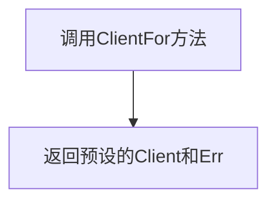

**源码**：
```go
func (m *ClientFactory) ClientFor(repository image.CanonicalName, creds registry.Credentials) (registry.Client, error) {
	return m.Client, m.Err
}
```

##### Succeed 方法

- **名称**：Succeed
- **参数**：
  - repository：image.CanonicalName - 镜像仓库名称（未使用）
- **参数类型**：image.CanonicalName
- **参数描述**：用于标记测试成功的模拟方法
- **返回值类型**：void
- **返回值描述**：无返回值

**mermaid流程图**：
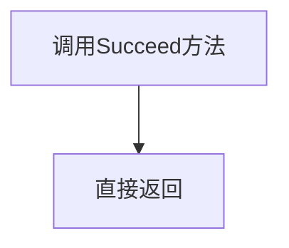

**源码**：
```go
func (_ *ClientFactory) Succeed(_ image.CanonicalName) {
	return
}
```

---

#### Registry 类

**类字段：**

| 名称 | 类型 | 描述 |
|------|------|------|
| Images | []image.Info | 模拟的镜像信息列表 |
| Err | error | 模拟的查询错误 |

**类方法：**

##### GetImageRepositoryMetadata 方法

- **名称**：GetImageRepositoryMetadata
- **参数**：
  - id：image.Name - 镜像名称
- **参数类型**：image.Name
- **参数描述**：id指定要查询的镜像名称
- **返回值类型**：image.RepositoryMetadata, error
- **返回值描述**：返回仓库元数据，包含标签和镜像信息

**mermaid流程图**：
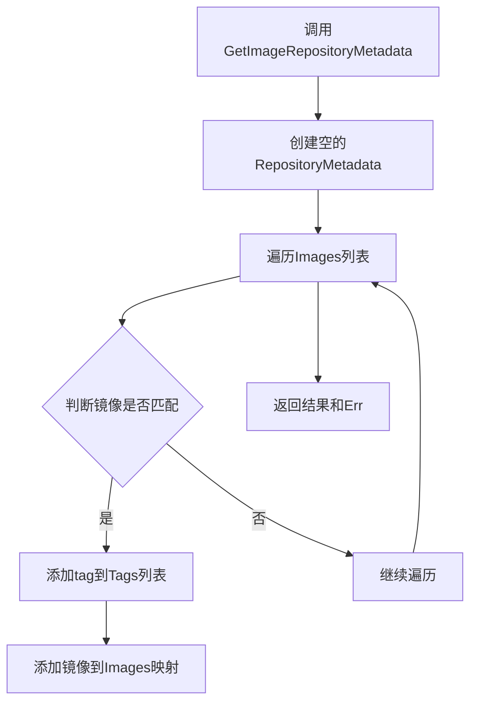

**源码**：
```go
func (m *Registry) GetImageRepositoryMetadata(id image.Name) (image.RepositoryMetadata, error) {
	result := image.RepositoryMetadata{
		Images: map[string]image.Info{},
	}
	for _, i := range m.Images {
		// include only if it's the same repository in the same place
		if i.ID.Image == id.Image {
			tag := i.ID.Tag
			result.Tags = append(result.Tags, tag)
			result.Images[tag] = i
		}
	}
	return result, m.Err
}
```

##### GetImage 方法

- **名称**：GetImage
- **参数**：
  - id：image.Ref - 镜像引用
- **参数类型**：image.Ref
- **参数描述**：id指定要查询的完整镜像引用
- **返回值类型**：image.Info, error
- **返回值描述**：返回镜像信息，未找到时返回错误

**mermaid流程图**：
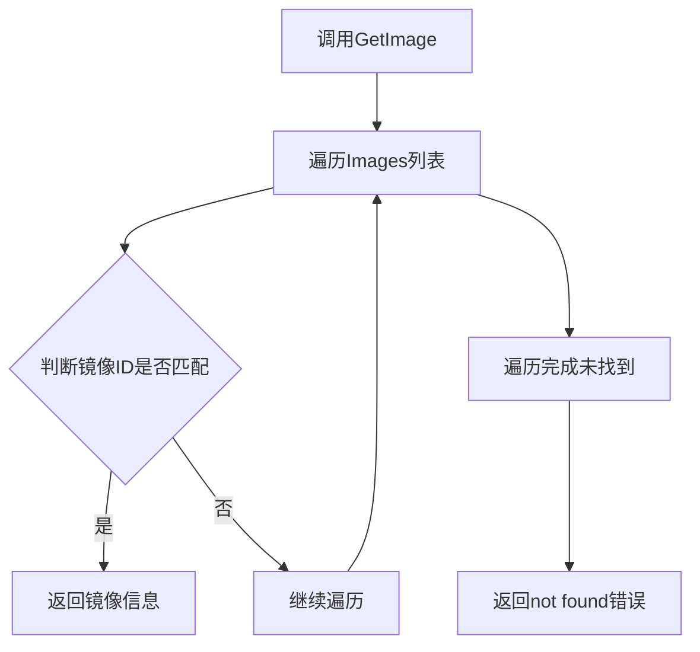

**源码**：
```go
func (m *Registry) GetImage(id image.Ref) (image.Info, error) {
	for _, i := range m.Images {
		if i.ID.String() == id.String() {
			return i, nil
		}
	}
	return image.Info{}, errors.New("not found")
}
```

---

### 全局变量

| 名称 | 类型 | 描述 |
|------|------|------|
| _ | interface{} | 编译时接口断言，确保Client实现registry.Client接口 |
| _ | interface{} | 编译时接口断言，确保ClientFactory实现registry.ClientFactory接口 |
| _ | interface{} | 编译时接口断言，确保Registry实现registry.Registry接口 |

---

### 关键组件信息

| 组件名称 | 描述 |
|----------|------|
| Client | 模拟registry.Client接口，用于测试镜像清单和标签获取功能 |
| ClientFactory | 模拟registry.ClientFactory接口，用于创建测试用的Client实例 |
| Registry | 模拟registry.Registry接口，用于测试仓库元数据和镜像查询功能 |

---

### 潜在技术债务与优化空间

1. **未使用的上下文参数**：Client.Manifest和Client.Tags方法接收context参数但未实际使用，建议在生产版本中用于超时控制和请求取消
2. **错误处理不一致**：GetImageRepositoryMetadata方法即使找到匹配也会返回m.Err，可能导致错误被掩盖；GetImage使用硬编码字符串"not found"而非errors.Wrap包装
3. **Succeed方法无实际功能**：ClientFactory.Succeed方法是空实现，在测试中没有任何作用，可考虑移除或实现真正的成功标记逻辑
4. **接口验证方式原始**：使用var _ interface{}方式进行编译时接口检查，虽然有效但不如go:generate方式优雅
5. **缺少并发安全保护**：Registry结构体中的Images切片在并发访问时可能存在竞态条件

---

### 其它项目

#### 设计目标与约束

- **设计目标**：为FluxCD的registry包提供可测试的mock实现，使单元测试无需依赖真实的容器注册表
- **约束**：必须实现registry.Client、registry.ClientFactory和registry.Registry接口

#### 错误处理与异常设计

- 使用预定义的Err字段模拟各种错误场景
- GetImage方法在未找到镜像时返回标准errors.New("not found")
- 所有错误均通过返回值传播，不使用panic

#### 数据流与状态机

- Registry存储静态镜像数据，无状态变化
- Client和ClientFactory通过函数指针实现行为注入，支持灵活的测试场景配置
- 数据流：测试代码 → ClientFactory → Client → Registry

#### 外部依赖与接口契约

- 依赖github.com/fluxcd/flux/pkg/image包：image.Info, image.Name, image.Ref, image.CanonicalName, image.RepositoryMetadata
- 依赖github.com/fluxcd/flux/pkg/registry包：registry.Client, registry.ClientFactory, registry.Registry, registry.ImageEntry, registry.Credentials
- 依赖github.com/pkg/errors包：errors.New用于创建错误对象


## 问题及建议


### 已知问题

-   **nil指针风险**：Client结构体的ManifestFn和TagsFn字段为函数类型，若未初始化直接调用对应的Manifest()或Tags()方法，会导致nil pointer dereference panic
-   **线性查找性能低**：Registry的GetImageRepositoryMetadata和GetImage方法都使用for循环遍历Images切片，时间复杂度为O(n)，当图片数量增多时性能较差
-   **未实现的Succeed方法**：ClientFactory的Succeed方法为空实现，参数使用废弃标识_，且方法功能不明确，可能是未完成的设计
-   **空返回语句**：Succeed方法中显式使用return而不是直接省略，不符合Go语言惯用写法
-   **接口一致性风险**：虽然有var _接口检查语句，但无法在编译期验证所有必需方法是否完整实现（缺少编译期验证）
-   **错误信息缺乏上下文**：GetImage方法返回的"not found"错误是硬编码字符串，缺乏具体哪个ID未找到的调试信息

### 优化建议

-   **添加nil检查保护**：在Manifest和Tags方法中检查对应函数字段是否为nil，若为nil则返回适当的错误
-   **使用map缓存**：将Images切片转换为map结构（如map[string]image.Info）存储，以空间换时间，将查询时间复杂度降至O(1)
-   **完善或移除Succeed方法**：明确该方法的设计意图并实现相应功能，或如果不需要则移除
-   **统一方法签名风格**：保持参数命名一致性，如Manifest方法参数名为tag则保持，Tags方法的context.Context参数可添加参数名或使用_明确表示废弃
-   **改进错误信息**：返回错误时包含具体的ID信息，便于调试，如errors.Errorf("image not found: %s", id)
-   **考虑添加工厂函数**：为Client、ClientFactory、Registry提供构造函数，确保字段正确初始化


## 其它


### 设计目标与约束

本代码为Flux CD的镜像仓库客户端提供测试用的mock实现，通过函数式选项模式支持灵活的测试场景配置。设计约束包括：仅用于单元测试和集成测试环境，不包含真实网络通信，完全依赖注入的函数指针实现行为模拟。

### 错误处理与异常设计

错误处理采用直接传递策略，Client和ClientFactory的Err字段允许测试代码预设错误返回值。Registry的GetImage方法使用errors.New("not found")返回标准错误，GetImageRepositoryMetadata方法返回m.Err预定义错误。所有错误均为可预期的测试场景，不包含重试或降级机制。

### 外部依赖与接口契约

本代码依赖三个外部包：github.com/pkg/errors提供错误包装，github.com/fluxcd/flux/pkg/image提供镜像数据结构，github.com/fluxcd/flux/pkg/registry提供客户端接口定义。Client需实现registry.Client接口的Manifest和Tags方法，ClientFactory需实现registry.ClientFactory接口的ClientFor和Succeed方法，Registry需实现registry.Registry接口的GetImageRepositoryMetadata和GetImage方法。代码末尾通过var _语句进行编译时接口一致性检查。

### 并发安全性

本代码不包含任何并发控制机制，所有字段和函数均为非线程安全设计。使用时需确保在单测试协程内完成操作，避免并发访问导致的竞态条件。

### 资源生命周期管理

Mock对象由测试代码负责创建和销毁，不涉及资源申请和释放操作。Client和ClientFactory的ManifestFn、TagsFn函数指针由调用方保证有效性，Registry的Images切片由调用方初始化和管理。

### 测试使用建议

建议在测试文件中通过httptest或直接实例化方式创建mock对象，通过为函数指针赋值闭包函数来实现特定测试场景。ClientFactory的Succeed方法为空实现，仅满足接口签名要求。

    