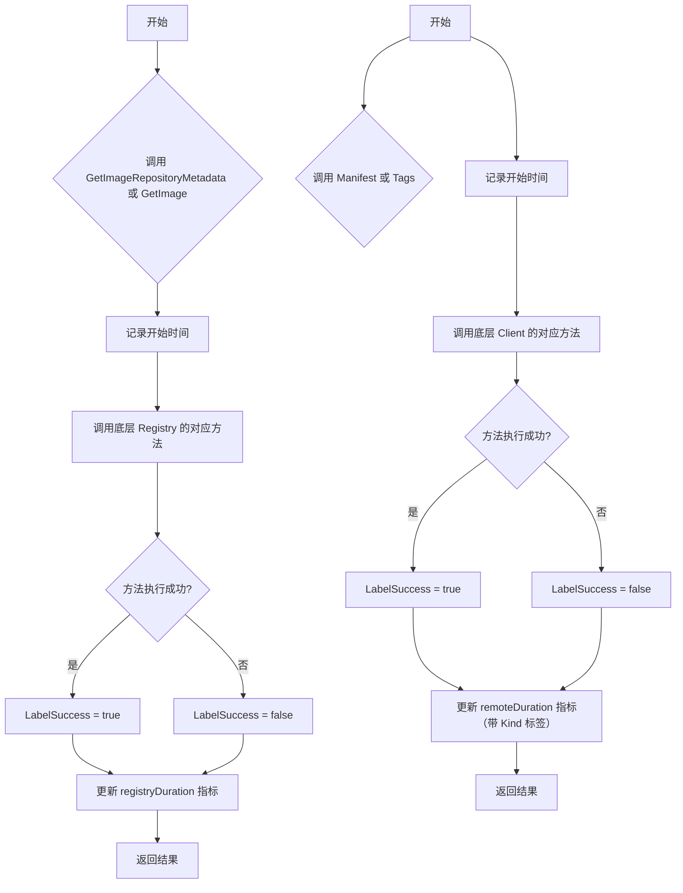
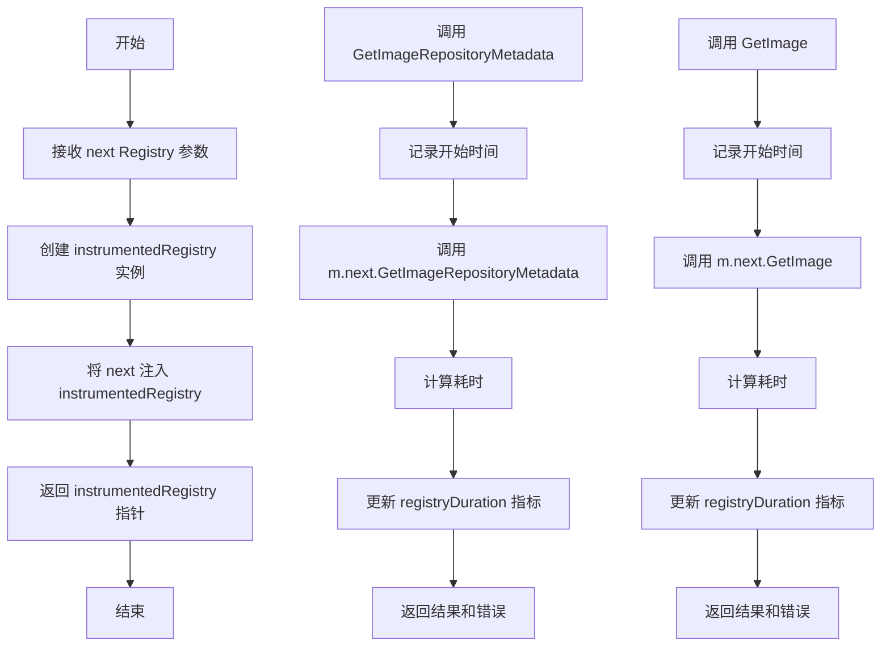
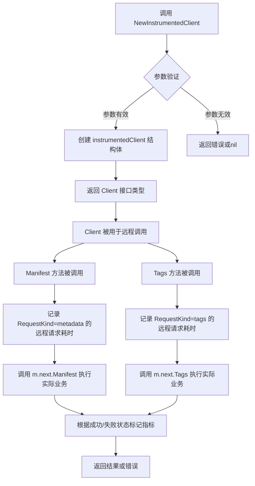
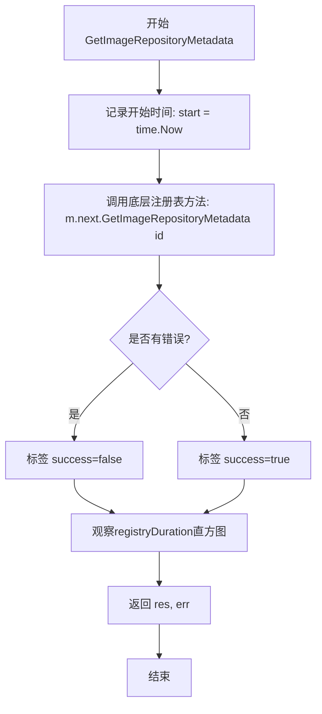
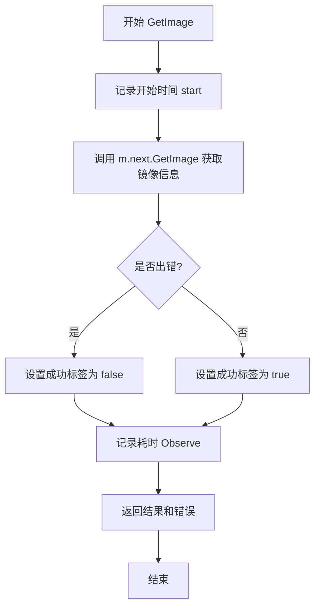

# `flux\pkg\registry\monitoring.go` 详细设计文档

该代码实现了一个监控中间件层，用于对 Flux CD 的 registry 接口进行性能指标采集。通过包装 Registry 和 Client 接口，拦截 GetImageRepositoryMetadata、GetImage、Manifest 和 Tags 方法，记录每个请求的执行时间到 Prometheus histogram 指标中，从而实现对镜像仓库操作的可观测性。

## 整体流程



## 类结构

```
Registry 监控中间件
└── instrumentedRegistry (实现 Registry 接口)
    ├── 字段: next Registry
    └── 方法:
        ├── GetImageRepositoryMetadata(id image.Name) (image.RepositoryMetadata, error)
        └── GetImage(id image.Ref) (image.Info, error)

Client 监控中间件
└── instrumentedClient (实现 Client 接口)
    ├── 字段: next Client
    └── 方法:
        ├── Manifest(ctx context.Context, ref string) (ImageEntry, error)
        └── Tags(ctx context.Context) ([]string, error)
```

## 全局变量及字段


### `registryDuration`
    
Prometheus histogram metric for measuring duration of image metadata requests from cache in seconds.

类型：`prometheus.Histogram`
    


### `remoteDuration`
    
Prometheus histogram metric for measuring duration of remote image metadata requests in seconds.

类型：`prometheus.Histogram`
    


### `instrumentedRegistry.next`
    
The underlying Registry instance being instrumented for metrics collection.

类型：`Registry`
    


### `instrumentedClient.next`
    
The underlying Client instance being instrumented for metrics collection.

类型：`Client`
    
    

## 全局函数及方法


### `NewInstrumentedRegistry`

这是一个工厂函数，用于创建带有监控（Metrics）功能的注册表装饰器。它接收一个 `Registry` 接口实现作为底层依赖，返回一个包装了监控功能的 `instrumentedRegistry` 实例，该实例同样实现了 `Registry` 接口，可以在不改变原有功能的前提下自动采集请求耗时等指标。

参数：

- `next`：`Registry`，被装饰的底层注册表接口实现，用于委托实际的注册表操作

返回值：`Registry`，返回带有监控装饰功能的注册表接口实现

#### 流程图



#### 带注释源码

```go
// NewInstrumentedRegistry 创建一个带有监控功能的注册表装饰器
// 参数 next 是被装饰的底层 Registry 接口实现
// 返回一个实现了 Registry 接口的 instrumentedRegistry 实例
// 该实例会在 GetImageRepositoryMetadata 和 GetImage 方法调用时自动记录耗时指标
func NewInstrumentedRegistry(next Registry) Registry {
    // 创建 instrumentedRegistry 实例并将底层注册表注入
    return &instrumentedRegistry{
        next: next, // 保存对底层 Registry 的引用，用于委托实际业务
    }
}

// instrumentedRegistry 是 Registry 接口的装饰器实现
// 包含一个 next 字段指向被装饰的 Registry 接口
type instrumentedRegistry struct {
    next Registry // 底层注册表接口，用于委托实际的注册表操作
}
```


### `NewInstrumentedClient`

该函数用于创建一个装饰器模式的监控客户端，通过包装原始的 `Client` 实现，为其所有远程操作（如获取清单和标签）添加 Prometheus 指标采集功能，以监控请求耗时和成功率。

参数：

- `next`：`Client`，被包装的原始客户端实例，用于执行实际的远程操作

返回值：`Client`，返回包装后的 instrumentedClient 实例，实现了监控功能

#### 流程图



#### 带注释源码

```go
// NewInstrumentedClient 创建一个带有监控功能的 Client 包装器
// 参数 next: 原始的 Client 实现，用于执行实际的远程操作
// 返回值: 实现了 Client 接口的 instrumentedClient，用于监控请求性能
func NewInstrumentedClient(next Client) Client {
    // 使用装饰器模式，将原始 client 包装在 instrumentedClient 中
    // 返回接口类型，以便调用方使用统一的 Client 接口
    return &instrumentedClient{
        next: next, // 保存原始客户端引用，用于委托实际业务逻辑
    }
}
```


### `instrumentedRegistry.GetImageRepositoryMetadata`

该函数是一个监控中间件方法，用于包装 Registry 接口的 `GetImageRepositoryMetadata` 方法，在调用底层实际注册表操作的同时，记录请求的持续时间并将其作为 Prometheus 直方图指标发布，以监控图像仓库元数据获取的性能和成功率。

参数：

- `id`：`image.Name`，用于查找镜像仓库元数据的镜像名称标识符

返回值：

- `res`：`image.RepositoryMetadata`，成功时返回的镜像仓库元数据
- `err`：`error`，执行过程中发生的任何错误

#### 流程图



#### 带注释源码

```go
// GetImageRepositoryMetadata 是 instrumentedRegistry 的方法，
// 它在调用底层注册表获取镜像仓库元数据的同时，记录请求耗时到 Prometheus 度量指标中。
// 参数 id: image.Name 类型，表示要获取元数据的镜像名称
// 返回值 res: image.RepositoryMetadata 类型，表示获取到的镜像仓库元数据
// 返回值 err: error 类型，表示执行过程中发生的错误
func (m *instrumentedRegistry) GetImageRepositoryMetadata(id image.Name) (res image.RepositoryMetadata, err error) {
    // 记录方法开始执行的时间点
    start := time.Now()
    
    // 调用被包装的 Registry 实例的同名方法，获取镜像仓库元数据
    res, err = m.next.GetImageRepositoryMetadata(id)
    
    // 根据操作是否成功（err == nil）设置成功标签，
    // 并将操作耗时（秒）记录到 Prometheus 直方图指标中
    registryDuration.With(
        fluxmetrics.LabelSuccess, strconv.FormatBool(err == nil),
    ).Observe(time.Since(start).Seconds())
    
    // 返回结果和错误
    return
}
```


### `instrumentedRegistry.GetImage`

该方法是 `instrumentedRegistry` 类的核心方法，用于获取指定镜像的元数据信息，同时通过 Prometheus 指标记录请求的耗时和成功状态，实现对 registry 操作的监控。

参数：

- `id`：`image.Ref`，镜像的引用标识符，用于指定要获取元数据的镜像

返回值：

- `res`：`image.Info`，成功时返回的镜像详细信息
- `err`：`error`，执行过程中可能出现的错误

#### 流程图



#### 带注释源码

```go
// GetImage 获取指定镜像的元数据信息，并记录监控指标
// 参数 id: 镜像引用标识符
// 返回 res: 镜像详细信息, err: 可能出现的错误
func (m *instrumentedRegistry) GetImage(id image.Ref) (res image.Info, err error) {
	// 1. 记录操作开始时间，用于计算耗时
	start := time.Now()
	
	// 2. 调用下一个 Registry 实例的 GetImage 方法获取镜像信息
	res, err = m.next.GetImage(id)
	
	// 3. 记录请求耗时到 Prometheus 直方图指标
	//    通过 LabelSuccess 标签区分请求成功或失败
	registryDuration.With(
		fluxmetrics.LabelSuccess, strconv.FormatBool(err == nil),
	).Observe(time.Since(start).Seconds())
	
	// 4. 返回查询结果和可能的错误
	return
}
```


### `instrumentedClient.Manifest`

该方法是 `instrumentedClient` 类型的成员方法，作为监控中间件封装了底层 `Client` 的 `Manifest` 方法。它在调用下一个客户端获取镜像清单的同时，记录请求的持续时间到 Prometheus 直方图指标中，用于监控远程镜像元数据请求的性能。

参数：

- `ctx`：`context.Context`，用于传递上下文信息和取消信号
- `ref`：`string`，镜像引用，指定要获取清单的镜像

返回值：`ImageEntry, error`，返回获取到的镜像条目和可能的错误

#### 流程图

```mermaid
flowchart TD
    A[开始 Manifest 方法] --> B[记录开始时间 start]
    B --> C[调用 m.next.Manifestctx, ref]
    C --> D{是否有错误?}
    D -->|是| E[err != nil]
    D -->|否| F[err == nil]
    E --> G[remoteDuration.With LabelRequestKind=Metadata, Success=false]
    F --> H[remoteDuration.With LabelRequestKind=Metadata, Success=true]
    G --> I[记录观察值: time.Since(startSeconds]
    H --> I
    I --> J[返回 res, err]
    J --> K[结束]
```

#### 带注释源码

```go
// Manifest 获取给定镜像引用的清单信息，并记录请求指标
// 参数 ctx 用于传递上下文信息
// 参数 ref 是镜像引用字符串
// 返回 ImageEntry 类型的清单信息和可能的错误
func (m *instrumentedClient) Manifest(ctx context.Context, ref string) (res ImageEntry, err error) {
	// 1. 记录方法开始执行的时间点
	start := time.Now()
	
	// 2. 调用被包装的 Client 的 Manifest 方法，获取镜像清单
	res, err = m.next.Manifest(ctx, ref)
	
	// 3. 使用 remoteDuration 直方图记录请求持续时间
	//    - LabelRequestKind 设置为 RequestKindMetadata ("metadata")，标识请求类型
	//    - fluxmetrics.LabelSuccess 根据 err 是否为 nil 来设置，标识请求是否成功
	remoteDuration.With(
		LabelRequestKind, RequestKindMetadata,           // 请求类型为元数据请求
		fluxmetrics.LabelSuccess, strconv.FormatBool(err == nil), // 格式化布尔值为 "true" 或 "false"
	).Observe(time.Since(start).Seconds())               // 记录从开始到现在的秒数
	
	// 4. 返回结果和错误
	return
}
```


### `instrumentedClient.Tags`

该方法是 `instrumentedClient` 类的监控中间件方法，用于对获取镜像标签的底层调用进行性能指标采集。它记录请求开始时间，调用下一层 Client 的 Tags 方法获取标签列表，然后测量执行耗时并通过 Prometheus 指标记录请求成功与否的状态，最后将结果返回给调用方。

参数：

- `ctx`：`context.Context`，Go 语言中的上下文对象，用于传递请求级别的取消信号、超时控制以及元数据

返回值：`[]string, error`，返回镜像的所有标签列表（字符串切片），以及可能出现的错误信息

#### 流程图

```mermaid
flowchart TD
    A[开始 Tags 方法] --> B[记录开始时间 start = time.Now]
    B --> C[调用 m.next.Tags(ctx) 获取标签列表]
    C --> D{是否有错误}
    D -->|有错误| E[构建指标标签: success=false]
    D -->|无错误| F[构建指标标签: success=true]
    E --> G[记录 remoteDuration 指标: kind=tags, success=false]
    F --> G
    G --> H[返回 res 和 err]
    H --> I[结束]
```

#### 带注释源码

```go
// Tags 获取镜像标签列表，并记录请求性能指标
// 参数 ctx: 上下文对象，用于控制请求生命周期
// 返回 res: 标签字符串切片，err: 可能出现的错误
func (m *instrumentedClient) Tags(ctx context.Context) (res []string, err error) {
	// 1. 记录方法开始执行的时间点
	start := time.Now()
	
	// 2. 调用底层 Client 的 Tags 方法执行实际业务逻辑
	res, err = m.next.Tags(ctx)
	
	// 3. 计算方法执行耗时
	elapsed := time.Since(start)
	
	// 4. 通过 Prometheus 指标记录请求信息
	//    - LabelRequestKind: 标记请求类型为 "tags"
	//    - fluxmetrics.LabelSuccess: 标记请求是否成功 (err == nil)
	remoteDuration.With(
		LabelRequestKind, RequestKindTags,            // 请求类型为 Tags
		fluxmetrics.LabelSuccess, strconv.FormatBool(err == nil), // 根据错误是否为 nil 记录成功状态
	).Observe(elapsed.Seconds()) // 记录观察值（耗时秒数）
	
	// 5. 返回业务结果和错误
	return
}
```

## 关键组件


### instrumentedRegistry

注册表监控中间件结构体，封装底层Registry接口，添加请求持续时间指标收集功能，用于监控图像仓库元数据和镜像信息的获取性能。

### instrumentedRegistry.GetImageRepositoryMetadata

获取图像仓库元数据方法，记录请求耗时并观察至registryDuration直方图指标，支持缓存命中场景的性能监控。

### instrumentedRegistry.GetImage

获取镜像信息方法，记录请求耗时并观察至registryDuration直方图指标，用于追踪镜像元数据查询性能。

### instrumentedClient

客户端监控中间件结构体，封装底层Client接口，添加远程请求持续时间指标收集功能，用于区分标签获取和清单获取的请求类型。

### instrumentedClient.Manifest

获取镜像清单方法，记录请求耗时并按RequestKindMetadata类型观察至remoteDuration直方图指标，区分元数据请求类型。

### instrumentedClient.Tags

获取镜像标签列表方法，记录请求耗时并按RequestKindTags类型观察至remoteDuration直方图指标，区分标签请求类型。

### registryDuration 指标

Prometheus直方图指标，用于记录注册表层面（缓存）的图像元数据请求耗时，单位为秒，帮助识别缓存性能问题。

### remoteDuration 指标

Prometheus直方图指标，用于记录远程客户端的图像元数据请求耗时，按请求类型（metadata/tags）和成功与否进行标签分类，帮助分析远程拉取性能。

### NewInstrumentedRegistry 工厂函数

创建instrumentedRegistry实例的工厂方法，接收底层Registry接口实现，返回带有监控能力的装饰器实例。

### NewInstrumentedClient 工厂函数

创建instrumentedClient实例的工厂方法，接收底层Client接口实现，返回带有监控能力的装饰器实例。


## 问题及建议


### 已知问题

- **代码重复**：instrumentedRegistry 和 instrumentedClient 中的监控逻辑高度相似，存在重复的计时和指标记录模式，可抽象出通用包装函数。
- **缺少错误分类**：仅通过 `err == nil` 判断成功与否，未区分不同类型的错误（如网络超时、认证失败、服务不可用等），不利于问题定位。
- **无日志记录**：仅有指标监控，没有日志输出，在指标异常时难以进行调试和问题追踪。
- **错误时仍观察时间**：即使调用失败也会记录时间，但未区分是调用本身耗时长还是错误处理耗时。
- **缺少输入验证**：未对传入的 `id`、`ref`、`ctx` 等参数进行空值或有效性检查，可能导致潜在 panic。
- **可测试性差**：直接依赖全局 prometheus 指标变量，单元测试时难以 mock 或验证指标是否正确记录。

### 优化建议

- **抽象通用监控逻辑**：提取公共的监控包装方法（如 `observeCall`），减少重复代码。
- **增加错误标签细分**：为指标添加错误类型标签（如 `timeout`、`unauthorized`、`not_found` 等），或使用不同的指标（如 `registry_errors_total`）区分错误类型。
- **添加日志记录**：在记录指标的同时输出关键操作日志，包含请求参数、耗时和错误信息。
- **增加输入验证**：在方法入口增加参数校验，如检查 `id`、`ref` 是否为空，context 是否已取消。
- **分离指标记录与业务逻辑**：将指标记录逻辑抽取为独立的 `Middleware` 或 `Observer`，提高可测试性。
- **考虑加入超时和重试监控**：记录重试次数、超时次数等额外指标，丰富监控维度。

## 其它


### 设计目标与约束

本模块的设计目标是为一组 Registry 和 Client 接口提供统一的监控和度量收集能力，通过装饰器模式在不修改原有业务逻辑的情况下，透明地记录请求的成功与否、耗时以及请求类型信息。约束条件包括：必须实现对应的 Registry 和 Client 接口，度量指标命名需遵循 Prometheus 最佳实践，且所有指标标签必须预定义以避免高基数问题。

### 错误处理与异常设计

本模块本身不进行业务错误处理，仅捕获并记录方法调用的错误状态。错误信息通过 LabelSuccess 标签以字符串形式（"true" 或 "false"）记录到 Prometheus 指标中，不额外记录错误详情。调用方错误由下游的 Registry 或 Client 实现自行处理，本模块仅透传错误返回值。

### 数据流与状态机

数据流遵循装饰器模式：请求从调用方进入 instrumentedRegistry 或 instrumentedClient -> 记录开始时间 -> 调用下一个具体实现 -> 记录结束时间并更新 Prometheus 指标 -> 返回结果。无状态机设计，仅包含简单的请求-响应流程。

### 外部依赖与接口契约

本模块依赖以下外部包：github.com/go-kit/kit/metrics/prometheus 用于创建 Prometheus 指标；github.com/prometheus/client_golang/prometheus 提供 Prometheus 客户端库；github.com/fluxcd/flux/pkg/image 提供镜像相关的数据结构；github.com/fluxcd/flux/pkg/metrics 提供标准度量标签。接口契约要求传入的 next 参数必须实现 Registry 或 Client 接口，否则在运行时可能引发 panic。

### 性能考虑

在每个方法调用中都创建了 time.Now() 和 time.Since() 对象，存在少量对象分配开销。对于高频调用场景，可考虑使用 time.Since 配合预分配的变量来减少分配。Prometheus 指标的 With() 方法每次调用都会进行标签匹配，建议在外部缓存 LabelSuccess 相关的 LabelSet 以提升性能。

### 并发安全

Prometheus 客户端库本身是线程安全的，instrumentedRegistry 和 instrumentedClient 不持有可变状态，仅代理下游实现。并发安全性主要取决于下游 Registry 和 Client 实现是否线程安全。

### 安全性考虑

本模块不涉及敏感数据处理，指标数据通过 Prometheus 暴露。需要注意不要在指标标签中记录敏感信息（如用户凭证、密码等）。当前实现仅记录请求类型和成功与否，符合安全最佳实践。

### 测试策略

建议为每个方法编写单元测试，验证指标记录的正确性。可使用 prometheus 测试工具或 mock Registry/Client 实现来验证指标是否按预期被观察。集成测试应验证在真实 Prometheus 环境中指标能够正确抓取。

### 配置说明

本模块无显式配置接口，指标配置通过全局变量在初始化时确定。Histogram 的 buckets 使用标准默认值（stdprometheus.DefBuckets），如需自定义可在创建指标时覆盖。

### 使用示例

```go
// 创建原始 registry
originalRegistry := NewBasicRegistry()

// 包装为 instrumented registry
instrumentedRegistry := NewInstrumentedRegistry(originalRegistry)

// 使用 instrumentedRegistry 进行操作会自动记录指标
metadata, err := instrumentedRegistry.GetImageRepositoryMetadata(imageName)

// 同样适用于 Client
originalClient := NewBasicClient()
instrumentedClient := NewInstrumentedClient(originalClient)
```


    