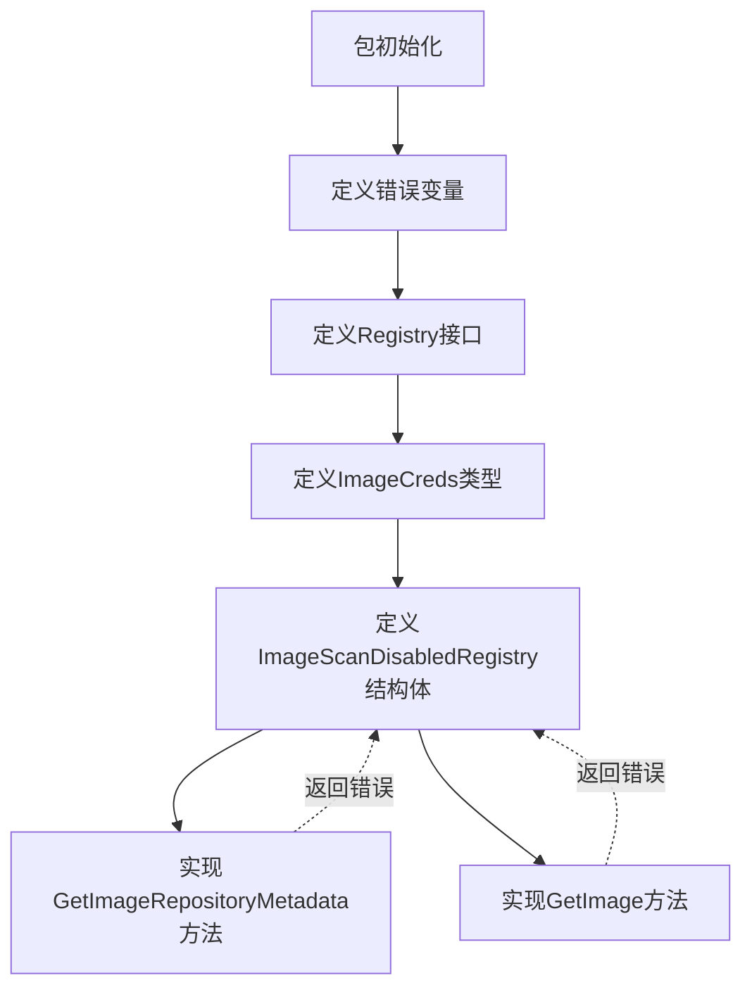
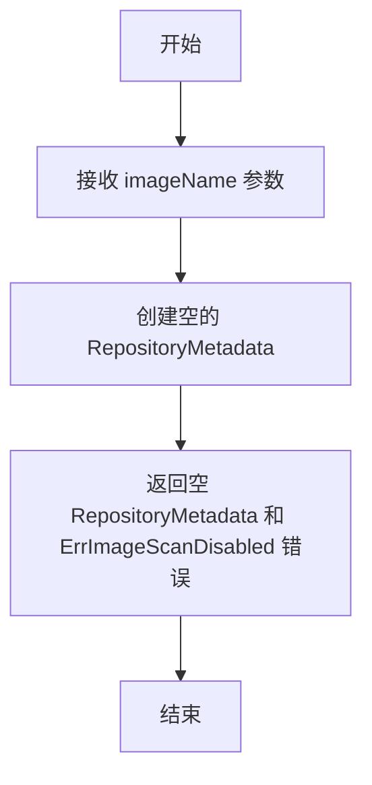
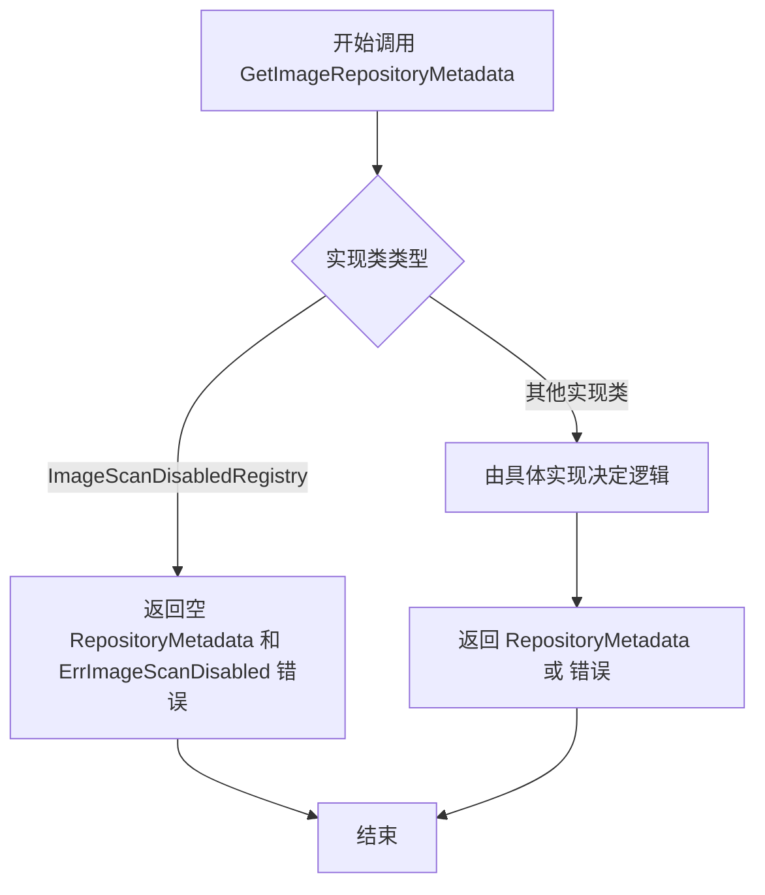
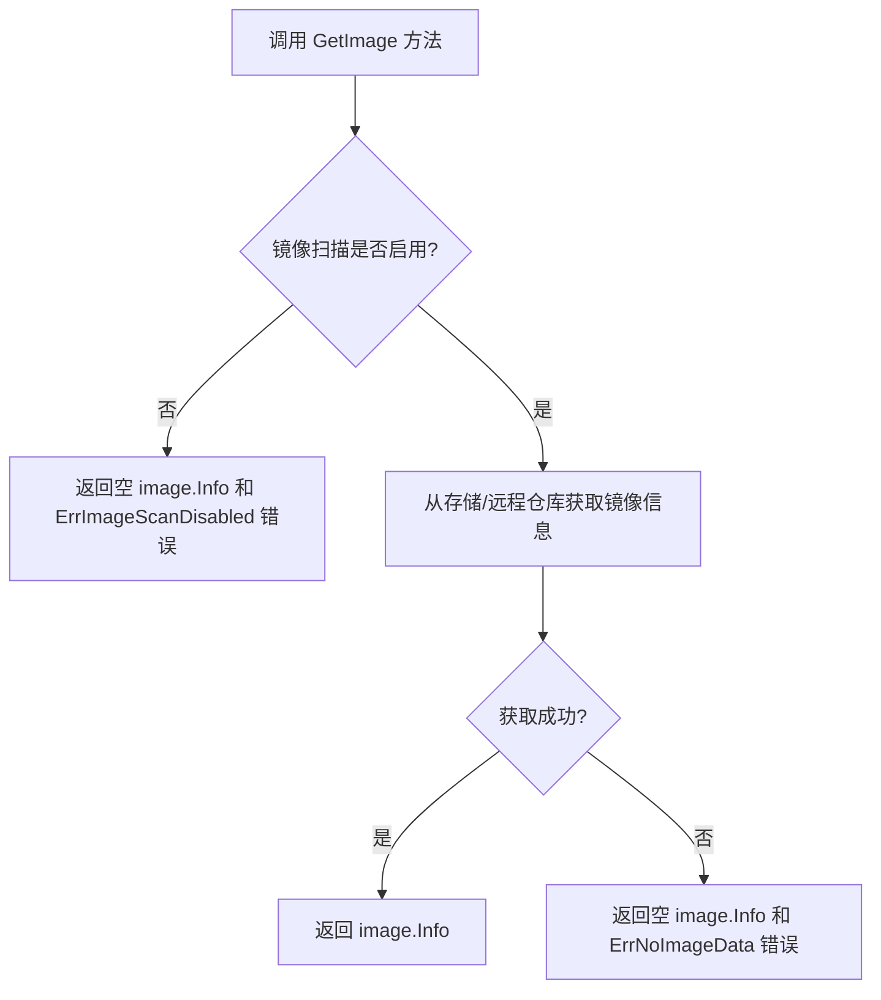
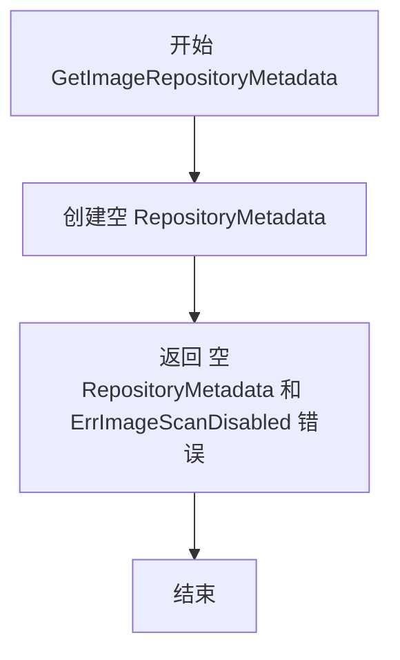
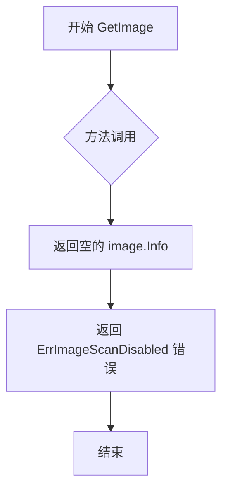

# `flux\pkg\registry\registry.go` 详细设计文档

这是一个图像注册表管理包，定义了图像元数据存储的接口规范，并提供了图像扫描禁用时的空实现，用于在集群中查询和获取容器镜像的元数据及凭证信息。

## 整体流程



## 类结构

```
Registry (接口)
└── ImageScanDisabledRegistry (结构体，实现接口)

ImageCreds (类型 - map别名)
```

## 全局变量及字段


### `ErrNoImageData`
    
表示图像数据不可用

类型：`error`
    


### `ErrImageScanDisabled`
    
表示无法执行操作，因为图像扫描被禁用

类型：`error`
    


    

## 全局函数及方法


### `ImageScanDisabledRegistry.GetImageRepositoryMetadata`

当镜像扫描功能被禁用时，此方法用于返回镜像仓库元数据。由于扫描已禁用，该方法直接返回一个空的 `RepositoryMetadata` 结构体和 `ErrImageScanDisabled` 错误，表明无法执行该操作。

参数：

- `imageName`：`image.Name`，待获取元数据的镜像名称

返回值：`(image.RepositoryMetadata, error)`，返回空的镜像仓库元数据以及表示扫描已禁用的错误信息

#### 流程图



#### 带注释源码

```go
// GetImageRepositoryMetadata 返回镜像仓库元数据，当镜像扫描被禁用时调用
// 参数 imageName: 镜像名称，用于标识要获取元数据的镜像
// 返回值: 空的 RepositoryMetadata 和 ErrImageScanDisabled 错误
func (i ImageScanDisabledRegistry) GetImageRepositoryMetadata(imageName image.Name) (image.RepositoryMetadata, error) {
    // 返回空的元数据结构体和错误，告知调用者镜像扫描已禁用
    return image.RepositoryMetadata{}, ErrImageScanDisabled
}
```


### `ImageScanDisabledRegistry.GetImage`

该方法是 `ImageScanDisabledRegistry` 结构体的实现，用于在镜像扫描功能被禁用时返回错误。它实现了 `Registry` 接口的 `GetImage` 方法，始终返回一个空的 `image.Info` 和 `ErrImageScanDisabled` 错误，表明无法执行镜像信息获取操作。

参数：

- `ref`：`image.Ref`，要获取信息的镜像引用

返回值：`image.Info, error`，第一个返回值为镜像信息（空结构），第二个返回值为错误（始终为 `ErrImageScanDisabled`）

#### 流程图

```mermaid
flowchart TD
    A[开始 GetImage] --> B[接收参数 ref: image.Ref]
    B --> C[创建空的 image.Info{}]
    C --> D[返回 image.Info{} 和 ErrImageScanDisabled]
    D --> E[结束]
    
    style A fill:#f9f,stroke:#333
    style D fill:#ff9,stroke:#333
    style E fill:#9f9,stroke:#333
```

#### 带注释源码

```go
// GetImage 是 ImageScanDisabledRegistry 的方法，用于在镜像扫描被禁用时返回错误
// 参数 ref: image.Ref - 要获取信息的镜像引用
// 返回值: (image.Info, error) - 始终返回空镜像信息和 ErrImageScanDisabled 错误
func (i ImageScanDisabledRegistry) GetImage(image.Ref) (image.Info, error) {
    // 返回空的 image.Info 和表示镜像扫描已禁用的错误
    return image.Info{}, ErrImageScanDisabled
}
```


### `Registry.GetImageRepositoryMetadata`

该方法定义在 `Registry` 接口中，用于根据给定的镜像名称获取镜像仓库的元数据信息。这是镜像注册表的核心抽象接口方法，允许调用者查询特定镜像仓库的详细信息（如标签、历史记录等），如果操作失败则返回错误。

参数：

- `Name`：`image.Name`，镜像仓库的名称标识

返回值：

- `image.RepositoryMetadata`：镜像仓库的元数据，包含镜像的标签、摘要等信息
- `error`：操作失败时返回的错误，如镜像数据不可用或镜像扫描被禁用

#### 流程图



#### 带注释源码

```go
// Registry 是镜像元数据的存储抽象接口
// 定义了获取镜像仓库元数据和镜像信息的方法
type Registry interface {
    // GetImageRepositoryMetadata 根据镜像名称获取镜像仓库的元数据
    // 参数 image.Name: 要查询的镜像仓库名称
    // 返回值:
    //   - image.RepositoryMetadata: 镜像仓库的元数据信息
    //   - error: 操作过程中的错误信息
    GetImageRepositoryMetadata(image.Name) (image.RepositoryMetadata, error)
    
    // GetImage 根据镜像引用获取镜像的详细信息
    GetImage(image.Ref) (image.Info, error)
}

// ImageScanDisabledRegistry 当镜像扫描被禁用时使用的实现
// 用于在 image scanning 功能关闭时提供空实现
type ImageScanDisabledRegistry struct{}

func (i ImageScanDisabledRegistry) GetImageRepositoryMetadata(image.Name) (image.RepositoryMetadata, error) {
    // 当镜像扫描被禁用时，返回空的元数据结构和特定错误
    return image.RepositoryMetadata{}, ErrImageScanDisabled
}

func (i ImageScanDisabledRegistry) GetImage(image.Ref) (image.Info, error) {
    return image.Info{}, ErrImageScanDisabled
}
```


### `Registry.GetImage`

获取指定镜像的详细信息，包括版本、标签等元数据。

参数：

- `ref`：`image.Ref`，镜像引用，指定要获取信息的镜像

返回值：

- `image.Info`，镜像的详细信息（包含版本、标签、创建时间等）
- `error`，操作过程中的错误信息（如镜像数据不可用、镜像扫描被禁用等）

#### 流程图



#### 带注释源码

```go
// GetImage 根据给定的镜像引用获取镜像的详细信息
// 参数:
//   - ref: image.Ref 类型，表示镜像的唯一引用（通常包含仓库和标签信息）
//
// 返回值:
//   - image.Info: 包含镜像版本、标签、元数据等信息的结构体
//   - error: 如果获取失败，返回相应的错误（如镜像扫描禁用、数据不可用等）
//
// 注意: 这是一个接口方法，具体实现由注入的 Registry 实例决定
func (i ImageScanDisabledRegistry) GetImage(image.Ref) (image.Info, error) {
    // 当镜像扫描被禁用时，返回空的 image.Info 和错误信息
    // 告知调用者当前操作无法执行
    return image.Info{}, ErrImageScanDisabled
}
```


### `ImageScanDisabledRegistry.GetImageRepositoryMetadata`

当图像扫描被禁用时，该方法用于获取图像仓库元数据。由于扫描功能被禁用，该方法始终返回空的 `RepositoryMetadata` 和 `ErrImageScanDisabled` 错误。

#### 参数

- `name`：`image.Name`，图像名称，用于标识需要获取元数据的镜像仓库

#### 返回值

- `image.RepositoryMetadata`：图像仓库元数据，返回空结构体（因为扫描被禁用）
- `error`：错误信息，始终返回 `ErrImageScanDisabled` 错误

#### 流程图



#### 带注释源码

```go
// GetImageRepositoryMetadata 返回空的 RepositoryMetadata 和扫描禁用错误
// 当镜像仓库的扫描功能被禁用时，不允许获取镜像仓库元数据
// 参数 name: image.Name 类型，表示镜像名称
// 返回值:
//   - image.RepositoryMetadata: 空结构体，因为扫描被禁用无法获取真实数据
//   - error: 始终返回 ErrImageScanDisabled 错误
func (i ImageScanDisabledRegistry) GetImageRepositoryMetadata(image.Name) (image.RepositoryMetadata, error) {
    return image.RepositoryMetadata{}, ErrImageScanDisabled
}
```

---

### 关键组件信息

| 组件名称 | 一句话描述 |
|---------|-----------|
| `ImageScanDisabledRegistry` | 当镜像扫描功能被禁用时的空实现_registry，用于返回禁用错误 |
| `ErrImageScanDisabled` | 错误变量，表示镜像扫描被禁用时无法执行操作 |
| `Registry` 接口 | 定义了镜像仓库元数据获取的标准接口 |

### 潜在的技术债务或优化空间

1. **参数命名缺失**：方法参数没有命名（`image.Name` 前面没有参数名），这在某些代码分析工具中可能导致警告，且不利于代码可读性
2. **缺乏日志记录**：没有记录任何日志信息来帮助调试为什么扫描被禁用
3. **硬编码错误返回**：所有操作都返回相同的错误，调用方无法区分具体是哪个操作被禁用

### 其它项目

**设计目标与约束**：
- 该类型实现了 `Registry` 接口，用于在镜像扫描功能被禁用时提供替代实现
- 遵循了 Go 语言的接口实现模式，提供了一个"空操作"或"拒绝操作"的实现

**错误处理与异常设计**：
- 始终返回预定义的 `ErrImageScanDisabled` 错误
- 调用方需要检查返回的错误来决定是否继续处理

**外部依赖与接口契约**：
- 依赖于 `github.com/fluxcd/flux/pkg/image` 包中的 `image.Name`、`image.RepositoryMetadata` 类型
- 实现了 `Registry` 接口，承诺提供 `GetImageRepositoryMetadata` 和 `GetImage` 两个方法


### `ImageScanDisabledRegistry.GetImage`

该方法是 `ImageScanDisabledRegistry` 类型的实现，当镜像扫描被禁用时调用此方法会返回特定的错误，表明无法执行镜像信息获取操作。

参数：

- `ref`：`image.Ref`，目标镜像的引用标识

返回值：`(image.Info, error)`，第一个返回值是镜像的基本信息（空结构），第二个返回值是错误信息，当镜像扫描被禁用时返回 `ErrImageScanDisabled` 错误

#### 流程图



#### 带注释源码

```go
// GetImage 方法实现 Registry 接口
// 当镜像扫描被禁用时，获取镜像信息将失败并返回特定错误
// 参数 ref: image.Ref 类型，表示需要获取信息的镜像引用
// 返回值: image.Info 类型的镜像信息结构体，以及 error 类型的错误对象
func (i ImageScanDisabledRegistry) GetImage(image.Ref) (image.Info, error) {
    // 返回空的 image.Info 结构体和 ErrImageScanDisabled 错误
    // ErrImageScanDisabled 表明当前环境下不允许执行镜像扫描操作
    return image.Info{}, ErrImageScanDisabled
}
```

## 关键组件


### Registry 接口

用于存储图像元数据的核心接口，定义了获取图像仓库元数据和图像信息的方法，是整个注册表功能的基础抽象。

### ImageCreds 类型

图像凭证映射表，以 image.Name 为键存储对应的 Credentials，用于管理不同镜像的认证信息。

### ImageScanDisabledRegistry 结构体

当图像扫描功能被禁用时的 Registry 接口实现，返回特定的错误信息，确保系统在扫描禁用状态下能够正常响应请求。

### ErrNoImageData 错误

表示图像数据不可用的错误常量，用于处理无法获取镜像数据的情况。

### ErrImageScanDisabled 错误

表示图像扫描被禁用的错误常量，用于在图像扫描功能关闭时阻止相关操作执行。


## 问题及建议


### 已知问题

-   错误消息拼写错误：`ErrImageScanDisabled` 中的 "cannot perfom operation" 应为 "cannot perform operation"
-   空返回值与错误同时返回：`ImageScanDisabledRegistry` 的两个方法在返回错误的同时返回空的 struct，这可能导致调用方需要同时处理错误和空值的情况，容易造成混淆
-   缺少日志记录：整个代码中没有任何日志记录机制，无法追踪关键操作和诊断问题
-   `ImageCreds` 类型定义过于简单：作为全局类型别名，没有任何验证逻辑或构造函数，无法保证数据的有效性
-   `Registry` 接口功能单一：仅定义了两个获取方法，缺少常见的操作如 `ListImages`、`UpdateImage`、`DeleteImage` 等，扩展性受限
-   错误处理粒度粗：仅使用两个预定义错误，调用方难以区分具体的失败原因（如网络超时、认证失败、资源不存在等）
-   缺少上下文支持：方法签名中没有 `context.Context` 参数，无法支持超时控制和取消操作

### 优化建议

-   修复拼写错误并将错误消息改为更明确的描述
-   考虑返回 `nil` 替代空 struct，或者使用指针类型使语义更清晰
-   为 `ImageCreds` 添加构造函数和验证方法，确保 credentials 的有效性
-   在 `Registry` 接口方法中添加 `context.Context` 参数以支持超时和取消
-   引入更丰富的错误类型层次，支持错误链和错误包装
-   添加日志记录关键操作，便于运维监控和问题排查
-   考虑扩展 `Registry` 接口，添加批量查询或列表操作方法以提升性能
-   为主流实现类添加单元测试，确保错误处理路径的正确性


## 其它


### 设计目标与约束

该代码的核心目标是定义一个镜像元数据存储的抽象接口，支持获取镜像仓库元数据和镜像信息。约束条件包括：当镜像扫描被禁用时，返回特定错误；Credentials映射使用image.Name作为键。

### 错误处理与异常设计

定义了两种错误类型：ErrNoImageData表示镜像数据不可用，ErrImageScanDisabled表示镜像扫描被禁用时的操作不允许。错误通过Go的error接口返回，调用方需要根据错误类型进行相应处理。

### 数据流与状态机

数据流主要分为两类：1) GetImageRepositoryMetadata用于获取镜像仓库的元数据信息；2) GetImage用于获取单个镜像的详细信息。ImageScanDisabledRegistry作为禁用状态下的默认实现，返回统一的错误响应。

### 外部依赖与接口契约

依赖github.com/fluxcd/flux/pkg/image包中的image.Name、image.Ref、image.RepositoryMetadata和image.Info类型。Registry接口的契约是：实现类必须提供这两个方法的并发安全实现，且在镜像扫描禁用时返回ErrImageScanDisabled错误。

### 接口调用方

该接口供fluxcd flux其他包（如sync或update相关包）使用，用于在部署过程中查询镜像的元数据和凭证信息。ImageCreds类型用于传递镜像与凭证的映射关系。

### 配置与初始化

ImageScanDisabledRegistry是一个无状态的占位实现，不需要额外配置。真正的Registry实现（如AWS ECR、GCR等）需要通过依赖注入方式提供具体实例。

### 扩展性考虑

当前接口设计简洁，但可以通过添加新方法扩展（如ListImages、GetTags等）。ImageCreds类型设计为map，支持动态添加镜像凭证。

    