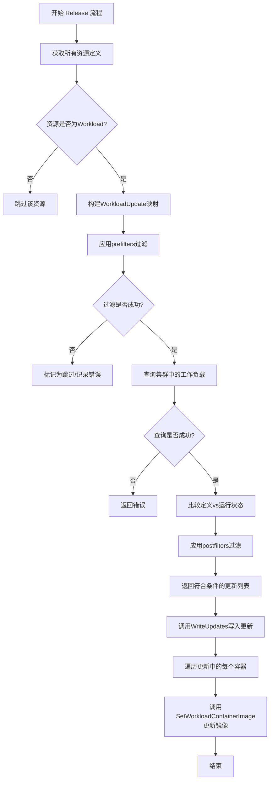
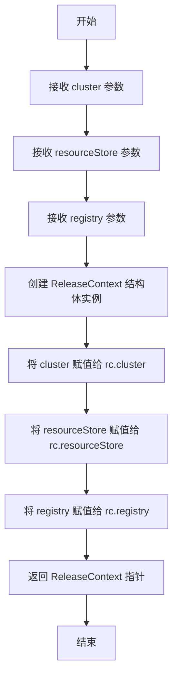
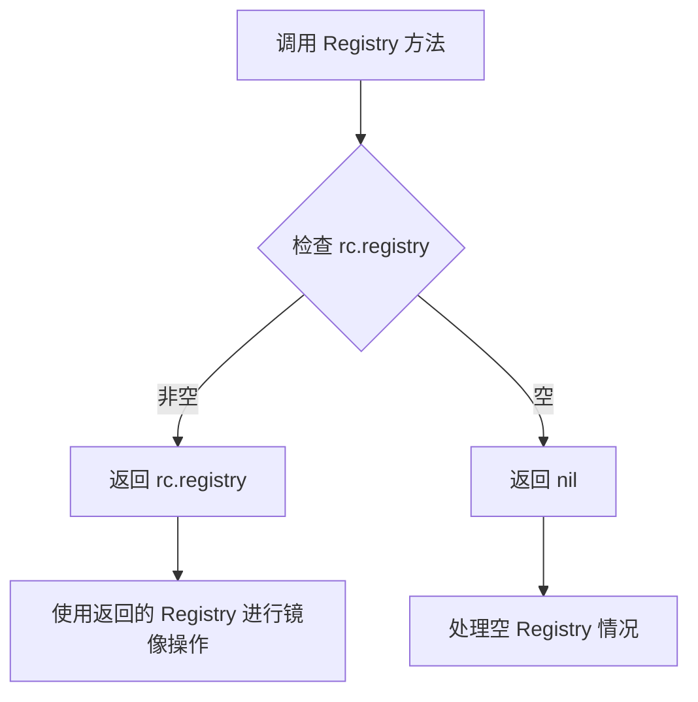
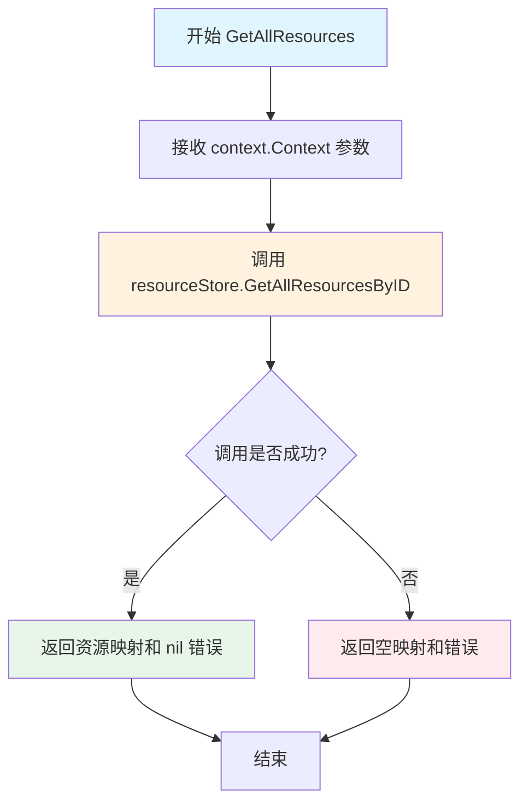
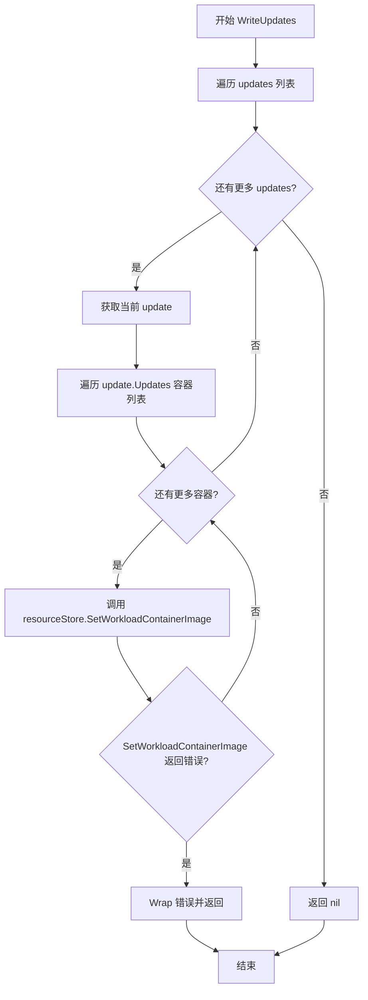
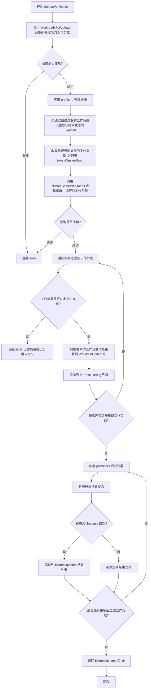
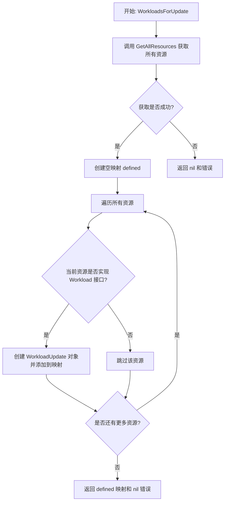

# `flux\pkg\release\context.go` 详细设计文档

Flux CD的发布管理模块，负责协调集群工作负载的更新，通过ReleaseContext管理资源存储、集群状态和镜像注册表，选择并应用需要更新的工作负载定义

## 整体流程



## 类结构

```
ReleaseContext (发布上下文管理器)
├── 字段: cluster (cluster.Cluster)
├── 字段: resourceStore (manifests.Store)
└── 字段: registry (registry.Registry)
```

## 全局变量及字段


### `ReleaseContext.cluster`
    
集群接口，用于查询工作负载状态

类型：`cluster.Cluster`
    


### `ReleaseContext.resourceStore`
    
资源存储接口，用于获取和更新资源

类型：`manifests.Store`
    


### `ReleaseContext.registry`
    
镜像注册表接口，用于镜像管理

类型：`registry.Registry`
    
    

## 全局函数及方法


### ReleaseContext.NewReleaseContext

`NewReleaseContext` 是 `ReleaseContext` 结构体的构造函数，用于创建并初始化一个 ReleaseContext 实例。该函数接收集群、资源存储和镜像仓库三个依赖组件，并将它们封装到 ReleaseContext 对象中，供后续发布流程使用。

参数：

- `cluster`：`cluster.Cluster`，集群接口，用于访问 Kubernetes 集群中的工作负载和资源
- `resourceStore`：`manifests.Store`，资源存储接口，用于获取和更新清单文件中定义的资源
- `registry`：`registry.Registry`，镜像仓库接口，用于管理容器镜像的拉取和版本信息

返回值：`*ReleaseContext`，返回新创建的 ReleaseContext 指针实例，其中包含初始化后的集群、资源存储和镜像仓库组件

#### 流程图



#### 带注释源码

```go
// NewReleaseContext 创建一个新的 ReleaseContext 实例
// 参数：
//   - cluster: 集群接口，用于与 Kubernetes 集群交互
//   - resourceStore: 资源存储接口，用于管理清单文件中的资源
//   - registry: 镜像仓库接口，用于处理容器镜像相关操作
//
// 返回值：
//   - *ReleaseContext: 初始化后的 ReleaseContext 指针
func NewReleaseContext(cluster cluster.Cluster, resourceStore manifests.Store, registry registry.Registry) *ReleaseContext {
    // 创建 ReleaseContext 结构体实例并初始化其三个核心字段
    return &ReleaseContext{
        cluster:       cluster,        // 集群接口实例
        resourceStore: resourceStore,  // 资源存储接口实例
        registry:      registry,       // 镜像仓库接口实例
    }
}
```


### `ReleaseContext.Registry`

获取 ReleaseContext 中存储的注册表实例，用于访问镜像仓库。

参数：
- （无参数）

返回值：`registry.Registry`，返回内部存储的注册表实例，用于镜像管理和操作。

#### 流程图



#### 带注释源码

```go
// Registry 返回 ReleaseContext 中存储的注册表实例
// 该方法用于获取对镜像仓库的访问能力，包括镜像的拉取、推送等操作
// 参数：无
// 返回值：registry.Registry - 注册表接口实例，用于镜像管理
func (rc *ReleaseContext) Registry() registry.Registry {
	return rc.registry
}
```

---

### 补充说明

| 项目 | 说明 |
|------|------|
| **所属类** | ReleaseContext |
| **方法类型** | getter 方法（获取器） |
| **设计意图** | 提供对内部 registry 字段的只读访问，使外部能够使用镜像注册表功能 |
| **依赖注入** | registry 在创建 ReleaseContext 时通过构造函数 NewReleaseContext 注入 |
| **并发安全性** | 该方法本身是只读访问，但返回的 registry 实例可能被多方共享，需注意并发使用时的线程安全 |
| **调用场景** | 通常在执行镜像更新、Helm Release 同步等操作时需要获取 registry 实例来访问远程镜像 |
| **潜在优化** | 如需频繁调用，可考虑缓存返回值；但由于返回的是接口引用，直接返回原值通常已足够高效 |


# ReleaseContext.GetAllResources 详细设计文档

## 1. 一句话描述

`GetAllResources` 是 `ReleaseContext` 类的核心方法，用于从资源存储中检索所有已定义的资源，并返回一个以资源ID为键、资源对象为值的映射表。

## 2. 类的详细信息

### ReleaseContext 类

`ReleaseContext` 是 Flux CD 项目中用于管理发布流程的上下文对象，协调集群、 manifests 存储和镜像仓库之间的交互。

#### 类字段

| 字段名 | 类型 | 描述 |
|--------|------|------|
| `cluster` | `cluster.Cluster` | Kubernetes 集群客户端，用于与运行中的集群交互 |
| `resourceStore` | `manifests.Store` | Manifest 存储接口，提供资源读写能力 |
| `registry` | `registry.Registry` | 镜像仓库客户端，用于管理容器镜像 |

#### 类方法

| 方法名 | 描述 |
|--------|------|
| `NewReleaseContext` | 构造函数，创建并初始化 ReleaseContext 实例 |
| `Registry()` | 返回内部的 registry 实例 |
| `GetAllResources(ctx context.Context)` | **获取所有资源（任务目标方法）** |
| `WriteUpdates(ctx context.Context, updates []*update.WorkloadUpdate)` | 将更新写入资源存储 |
| `SelectWorkloads(ctx context.Context, results update.Result, prefilters, postfilters []update.WorkloadFilter)` | 筛选需要更新的工作负载 |
| `WorkloadsForUpdate(ctx context.Context)` | 收集所有需要更新的工作负载 |

## 3. 方法详细信息

### ReleaseContext.GetAllResources

获取所有定义的资源清单。

**参数：**

- `ctx`：`context.Context`，请求上下文，用于传递取消信号和超时控制

**返回值：**

- `map[string]resource.Resource`：资源映射表，键为资源ID字符串，值为资源对象
- `error`：操作过程中的错误信息

## 4. 流程图



## 5. 带注释源码

```go
// GetAllResources 获取所有资源
// 参数 ctx: 上下文对象，用于控制请求的生命周期（超时、取消等）
// 返回值: 
//   - map[string]resource.Resource: 所有资源的映射表，键为资源ID
//   - error: 如果获取过程中发生错误，返回错误信息；成功时返回 nil
func (rc *ReleaseContext) GetAllResources(ctx context.Context) (map[string]resource.Resource, error) {
    // 委托给 resourceStore 进行实际的资源获取操作
    // rc.resourceStore 实现了 manifests.Store 接口
    // GetAllResourcesByID 是该接口的核心方法之一
    return rc.resourceStore.GetAllResourcesByID(ctx)
}
```

## 6. 关键组件信息

| 组件名称 | 描述 |
|----------|------|
| `ReleaseContext` | 发布上下文管理器，协调集群操作、资源管理和镜像仓库 |
| `resourceStore` (manifests.Store) | 资源存储抽象，屏蔽底层存储实现细节 |
| `GetAllResourcesByID` | 资源存储接口的核心方法，按ID检索所有资源 |
| `resource.Resource` | 资源抽象接口，代表 Kubernetes 资源对象 |

## 7. 潜在的技术债务或优化空间

1. **缺乏缓存机制**：`GetAllResources` 每次调用都会直接访问存储，对于频繁调用的场景可能存在性能问题。建议考虑引入缓存层或结果缓存。

2. **错误处理不够详细**：当前只是简单地将 `resourceStore` 的错误直接返回，没有添加上下文信息或重试逻辑。

3. **缺少资源过滤**：返回所有资源后，调用方通常需要进一步筛选。可以考虑在此方法中添加过滤条件参数。

4. **无资源版本控制**：返回的资源不包含版本信息，对于需要比较资源变化的场景可能不足。

## 8. 其它项目

### 设计目标与约束

- **单一职责**：该方法仅负责资源检索，不涉及资源更新或过滤
- **委托模式**：通过委托给 `resourceStore` 实现具体逻辑，符合依赖倒置原则
- **接口隔离**：依赖于 `manifests.Store` 接口而非具体实现，便于测试和替换

### 错误处理与异常设计

- 错误传播：直接将底层存储的错误向上传递，由调用者决定如何处理
- 典型错误场景：存储连接失败、资源解析错误、权限不足等

### 数据流与状态机

```
调用方 --> GetAllResources(ctx) --> resourceStore.GetAllResourcesByID(ctx) --> 返回资源映射
```

### 外部依赖与接口契约

- **依赖接口**：`manifests.Store` 接口
- **接口方法**：`GetAllResourcesByID(ctx context.Context) (map[string]resource.Resource, error)`
- **调用约束**：调用方需确保 `resourceStore` 已正确初始化且不为 nil


### `ReleaseContext.WriteUpdates`

将更新写入资源存储。该方法遍历所有工作负载更新，针对每个更新中的容器镜像变更，调用资源存储的 `SetWorkloadContainerImage` 方法将目标镜像写入资源定义文件中。

参数：

- `ctx`：`context.Context`，用于传递上下文信息（如取消信号、超时控制）
- `updates`：`[]*update.WorkloadUpdate`，待写入的工作负载更新列表，每个元素包含资源标识和容器镜像更新信息

返回值：`error`，如果所有镜像更新成功写入则返回 `nil`，否则返回包含错误原因的错误对象

#### 流程图



#### 带注释源码

```go
// WriteUpdates 将工作负载的容器镜像更新写入资源存储
// 参数:
//   - ctx: 上下文对象，用于控制超时和取消
//   - updates: 工作负载更新列表，包含资源ID和容器镜像目标版本
//
// 返回值:
//   - error: 写入过程中发生的错误，若全部成功则返回 nil
func (rc *ReleaseContext) WriteUpdates(ctx context.Context, updates []*update.WorkloadUpdate) error {
    // 使用匿名函数封装写入逻辑，便于统一错误处理
    err := func() error {
        // 遍历所有工作负载更新
        for _, update := range updates {
            // 遍历该工作负载中的所有容器更新
            for _, container := range update.Updates {
                // 调用资源存储接口，将目标镜像写入资源定义
                // 参数: ctx上下文, update.ResourceID资源标识, container.Container容器名, container.Target目标镜像
                err := rc.resourceStore.SetWorkloadContainerImage(ctx, update.ResourceID, container.Container, container.Target)
                if err != nil {
                    // 发生错误时，使用 errors.Wrapf 包装错误信息
                    // 包含资源标识和更新来源，便于问题排查
                    return errors.Wrapf(err, "updating resource %s in %s", update.ResourceID.String(), update.Resource.Source())
                }
            }
        }
        // 所有更新均成功完成
        return nil
    }()
    // 返回执行结果（可能为 nil 或 error）
    return err
}
```


### `ReleaseContext.SelectWorkloads`

该方法用于选择需要更新的工作负载。它从代码库中获取所有定义的工作负载，应用预过滤器确定需要查询集群的工作负载，然后从集群获取实际运行的工作负载，最后应用后过滤器筛选出真正需要更新的工作负载。

参数：

- `ctx`：`context.Context`，用于传递上下文信息（如取消信号、截止时间）
- `results`：`update.Result`，用于存储每个工作负载的过滤结果（状态和错误信息）
- `prefilters`：`[]update.WorkloadFilter`，在查询集群之前应用的工作负载过滤器，用于筛选需要检查的工作负载
- `postfilters`：`[]update.WorkloadFilter`，在查询集群之后应用的工作负载过滤器，用于进一步筛选需要更新的工作负载

返回值：`([]*update.WorkloadUpdate, error)`，返回通过所有过滤器的工作负载更新列表，如果发生错误则返回 error

#### 流程图



#### 带注释源码

```go
// SelectWorkloads finds the workloads that exist both in the definition
// files and the running cluster. `WorkloadFilter`s can be provided
// to filter the controllers so found, either before (`prefilters`) or
// after (`postfilters`) consulting the cluster.
// SelectWorkloads 查找在定义文件和运行集群中都存在的工作负载。
// 可以提供 WorkloadFilter 来过滤找到的控制器，
// 可以在查询集群之前（prefilters）或之后（postfilters）应用过滤器。
func (rc *ReleaseContext) SelectWorkloads(ctx context.Context, results update.Result, prefilters,
	postfilters []update.WorkloadFilter) ([]*update.WorkloadUpdate, error) {

	// Start with all the workloads that are defined in the repo.
	// 首先获取代码库中定义的所有工作负载
	allDefined, err := rc.WorkloadsForUpdate(ctx)
	if err != nil {
		return nil, err
	}

	// Apply prefilters to select the controllers that we'll ask the
	// cluster about.
	// 应用预过滤器来选择需要向集群查询的控制器
	var toAskClusterAbout []resource.ID
	for _, s := range allDefined {
		res := s.Filter(prefilters...)
		if res.Error == "" {
			// Give these a default value, in case we cannot access them
			// in the cluster.
			// 为这些工作负载设置默认值，以防无法访问集群
			results[s.ResourceID] = update.WorkloadResult{
				Status: update.ReleaseStatusSkipped,
				Error:  update.NotAccessibleInCluster,
			}
			toAskClusterAbout = append(toAskClusterAbout, s.ResourceID)
		} else {
			results[s.ResourceID] = res
		}
	}

	// Ask the cluster about those that we're still interested in
	// 向集群查询我们仍然感兴趣的工作负载
	definedAndRunning, err := rc.cluster.SomeWorkloads(ctx, toAskClusterAbout)
	if err != nil {
		return nil, err
	}

	var forPostFiltering []*update.WorkloadUpdate
	// Compare defined vs running
	// 比较定义的工作负载和运行中的工作负载
	for _, s := range definedAndRunning {
		update, ok := allDefined[s.ID]
		if !ok {
			// A contradiction: we asked only about defined
			// workloads, and got a workload that is not
			// defined.
			// 矛盾情况：我们只查询了定义的工作负载，
			// 但得到的却是未定义的工作负载
			return nil, fmt.Errorf("workload %s was requested and is running, but is not defined", s.ID)
		}
		update.Workload = s
		forPostFiltering = append(forPostFiltering, update)
	}

	var filteredUpdates []*update.WorkloadUpdate
	for _, s := range forPostFiltering {
		fr := s.Filter(postfilters...)
		results[s.ResourceID] = fr
		if fr.Status == update.ReleaseStatusSuccess || fr.Status == "" {
			filteredUpdates = append(filteredUpdates, s)
		}
	}

	return filteredUpdates, nil
}
```


### `ReleaseContext.WorkloadsForUpdate`

该方法从清单文件中收集所有定义的工作负载，并将其转换为可供后续更新处理使用的映射结构。它遍历所有资源，过滤出实现了 `resource.Workload` 接口的资源，为每个工作负载创建对应的更新对象，但不涉及任何更新逻辑的判断。

#### 参数

- `ctx`：`context.Context`，用于传递上下文信息（如取消信号、超时控制等）

#### 返回值

- `map[resource.ID]*update.WorkloadUpdate`：键为资源ID，值为工作负载更新对象的映射
- `error`：如果获取资源失败则返回错误

#### 流程图



#### 带注释源码

```go
// WorkloadsForUpdate collects all workloads defined in manifests and prepares a list of
// workload updates for each of them.  It does not consider updatability.
func (rc *ReleaseContext) WorkloadsForUpdate(ctx context.Context) (map[resource.ID]*update.WorkloadUpdate, error) {
	// 调用 resourceStore 获取所有资源
	resources, err := rc.GetAllResources(ctx)
	if err != nil {
		// 如果获取失败，返回 nil 和错误信息
		return nil, err
	}

	// 创建一个空的映射，用于存储定义的工作负载
	// 键为资源ID，值为工作负载更新对象
	var defined = map[resource.ID]*update.WorkloadUpdate{}
	
	// 遍历所有获取到的资源
	for _, res := range resources {
		// 检查当前资源是否实现了 resource.Workload 接口
		// 这是判断该资源是否为工作负载（如 Deployment、DaemonSet 等）的方式
		if wl, ok := res.(resource.Workload); ok {
			// 如果是工作负载，则创建对应的 WorkloadUpdate 对象
			// ResourceID: 资源的唯一标识
			// Resource:   工作负载本身
			defined[res.ResourceID()] = &update.WorkloadUpdate{
				ResourceID: res.ResourceID(),
				Resource:   wl,
			}
		}
	}
	
	// 返回所有定义的工作负载映射，以及 nil 错误（因为此方法本身不产生错误）
	return defined, nil
}
```

---

### 关联类信息

#### `ReleaseContext` 类

| 字段名称 | 类型 | 描述 |
|---------|------|------|
| `cluster` | `cluster.Cluster` | 集群客户端，用于与 Kubernetes 集群交互 |
| `resourceStore` | `manifests.Store` | 资源存储客户端，用于读取和修改清单文件 |
| `registry` | `registry.Registry` | 镜像仓库客户端，用于镜像版本管理 |

| 方法名称 | 功能描述 |
|---------|---------|
| `NewReleaseContext` | 构造函数，创建并初始化 ReleaseContext 实例 |
| `Registry()` | 返回内部的 registry 实例 |
| `GetAllResources()` | 获取所有资源（被 WorkloadsForUpdate 调用） |
| `WriteUpdates()` | 将更新写入资源存储 |
| `SelectWorkloads()` | 选择需要更新的工作负载（调用 WorkloadsForUpdate） |
| `WorkloadsForUpdate()` | 收集需要更新的工作负载（本任务目标） |

---

### 关键组件信息

| 组件名称 | 描述 |
|---------|------|
| `resource.Workload` | 接口类型，用于判断资源是否为工作负载 |
| `update.WorkloadUpdate` | 更新对象，包含资源ID和工作负载信息 |
| `resource.ID` | 资源唯一标识符类型 |
| `manifests.Store` | 清单存储接口，提供资源读取和更新能力 |

---

### 技术债务与优化空间

1. **空映射初始化**：当前方法在没有资源时会返回一个空的映射，可以考虑返回 `nil` 以减少内存分配
2. **错误处理**：该方法仅透传 `GetAllResources` 的错误，缺乏更细粒度的错误处理
3. **无缓存机制**：每次调用都会重新获取所有资源，在高频调用场景下可能存在性能问题
4. **接口断言开销**：使用类型断言 `res.(resource.Workload)` 在资源数量庞大时可能产生一定开销

---

### 其它说明

- **设计目标**：该方法作为 Release 流程的入口点之一，负责从静态清单文件中提取工作负载信息，为后续的集群状态比对和更新决策提供数据基础
- **数据流**：清单文件 → resourceStore → GetAllResources → 过滤 Workload → WorkloadUpdate 映射
- **外部依赖**：依赖 `manifests.Store` 接口获取资源，依赖 `resource.Workload` 接口判断资源类型
- **调用方**：`SelectWorkloads` 方法调用此函数获取初始工作负载列表

## 关键组件


### ReleaseContext（发布上下文）

发布上下文是整个模块的核心结构体，负责协调集群管理、资源存储和镜像注册表三个核心依赖，提供了获取资源和写入更新的统一入口。

### SelectWorkloads（工作负载选择器）

核心业务方法，通过预过滤和后过滤两阶段机制，从定义清单和运行集群中筛选出需要实际执行更新的工作负载，包含与集群交互、结果比对和状态更新等关键逻辑。

### WorkloadsForUpdate（工作负载更新准备器）

从所有资源清单中提取实现了Workload接口的资源，并将其转换为待更新列表的映射，为后续的更新决策提供数据基础。

### WriteUpdates（更新写入器）

遍历所有工作负载更新，将容器镜像的变更目标写入到资源存储中，实现配置与实际状态的同步。

### Prefilters/Postfilters（预过滤与后过滤机制）

工作负载筛选的两层过滤架构，预过滤在查询集群前执行以减少不必要的集群交互，后过滤在获取集群状态后执行以精细控制最终的更新范围。

### Cluster/Registry/ResourceStore三角依赖

通过依赖注入的三种核心服务，实现了解耦的架构设计，支持灵活的单元测试和不同的实现替换。


## 问题及建议


### 已知问题

-   **错误处理不完善**：`WriteUpdates` 方法的错误处理使用了立即执行函数包装，但缺少重试机制和详细的错误日志记录，在生产环境中难以追踪问题根因。
-   **类型安全不足**：使用 `map[string]resource.Resource` 而非更精确的类型，且依赖运行时类型断言 `res.(resource.Workload)` 可能导致 panic，缺乏编译时检查。
-   **并发安全风险**：`WriteUpdates` 循环更新资源时未考虑并发控制，多个更新同时执行可能导致资源竞争或不一致状态。
-   **硬编码状态判断**：使用字符串空比较 `fr.Status == ""` 判断成功状态，不够直观且容易引入错误，应使用常量或枚举。
-   **缺少日志记录**：关键操作（如选择工作负载、更新资源）均无日志输出，生产环境难以追踪执行流程和问题定位。
-   **资源清理缺失**：未实现资源清理或释放逻辑，可能导致资源泄露。
-   **测试性差**：直接依赖具体类型 `cluster.Cluster`、`manifests.Store` 而非接口，导致单元测试时难以 mock 依赖。

### 优化建议

-   **增强错误处理**：为 `WriteUpdates` 添加重试机制和详细日志记录，使用结构化日志记录每个更新操作的成功/失败状态。
-   **改进类型系统**：考虑将 `map[string]resource.Resource` 改为 `map[resource.ID]resource.Resource`，并使用更安全的类型转换方式。
-   **添加并发控制**：在 `WriteUpdates` 中使用 goroutine 和 channel 实现并发更新，同时确保线程安全。
-   **使用常量替代硬编码**：将状态判断替换为明确的常量比较，提高代码可读性和可维护性。
-   **依赖接口而非具体实现**：将 `cluster.Cluster`、`manifests.Store` 等改为接口类型，便于单元测试和依赖注入。
-   **添加上下文超时**：在调用集群和资源存储时，使用 `ctx` 的超时和取消机制，避免长时间阻塞。
-   **实现批量处理**：`SelectWorkloads` 中对集群的查询应考虑分页或批量处理，避免大量工作负载时性能下降。

## 其它


### 设计目标与约束

本模块的核心设计目标是提供一个发布上下文环境，用于协调集群资源、镜像仓库和清单存储之间的交互，实现工作负载的自动化更新。设计约束包括：依赖Flux CD的cluster.Cluster接口进行集群操作；依赖manifests.Store进行资源存储；依赖registry.Registry进行镜像管理；所有操作均需支持context.Context以实现超时和取消。

### 错误处理与异常设计

错误处理采用Go的错误返回模式，通过errors.Wrapf包装底层错误以保留调用栈信息。WriteUpdates方法在遍历更新时遇到错误会立即返回，不会继续处理后续更新。SelectWorkloads方法对无法访问的集群资源设置默认状态而非直接失败，体现了容错设计。未找到已定义工作负载时返回格式化的错误信息。

### 数据流与状态机

数据流从GetAllResources开始，获取所有资源定义；经由WorkloadsForUpdate过滤出工作负载资源；通过SelectWorkloads结合预过滤器、集群查询和后过滤器进行筛选；最终由WriteUpdates将镜像更新写入资源存储。状态转换包括：Defined -> Prefiltered -> ClusterQueried -> PostFiltered -> Written。

### 外部依赖与接口契约

主要外部依赖包括：cluster.Cluster接口（SomeWorkloads方法）、manifests.Store接口（GetAllResourcesByID、SetWorkloadContainerImage方法）、registry.Registry接口（Registry方法）、resource包（Resource、Workload、ID类型）、update包（Result、WorkloadUpdate、WorkloadFilter类型）。所有接口方法需实现上下文传播和错误返回约定。

### 性能考虑

GetAllResources可能返回大量资源数据，需考虑缓存策略。SelectWorkloads中对集群的查询使用SomeWorkloads批量获取，避免逐个查询。预过滤和后过滤的逻辑较轻量，但在大规模工作负载场景下可考虑并行化处理。

### 并发与线程安全

ReleaseContext本身不维护可变状态，其字段cluster、resourceStore、registry在创建后只读。内部方法通过context.Context传递实现并发控制，但需注意resourceStore和cluster的并发安全性由其实现类保证。

### 测试策略

建议为每个public方法编写单元测试：TestSelectWorkloads测试各种过滤组合和错误场景；TestWorkloadsForUpdate测试资源到工作负载的转换；TestWriteUpdates测试镜像更新逻辑；使用mock框架模拟cluster.Cluster和manifests.Store接口。

### 安全考虑

WriteUpdates直接修改资源存储中的镜像地址，需确保调用方的权限验证。SelectWorkloads返回的WorkloadUpdate包含集群中运行的工作负载信息，注意敏感信息不外泄。Registry()方法返回的registry实例需妥善管理认证凭证。

### 监控与可观测性

建议在关键方法入口和错误路径添加tracing span；记录WriteUpdates处理的更新数量和成功失败统计；SelectWorkloads应记录预过滤、后过滤、集群查询的结果数量；通过metrics暴露资源总数、工作负载数量、更新数量等指标。

### 部署注意事项

ReleaseContext需通过NewReleaseContext工厂函数创建，确保依赖注入正确。应在使用前验证cluster、resourceStore、registry非nil。建议与业务生命周期对齐创建和销毁，避免长时间持有资源连接。


    