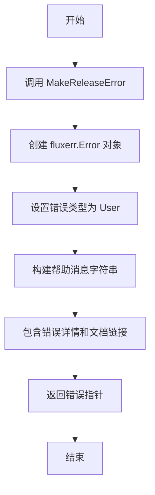
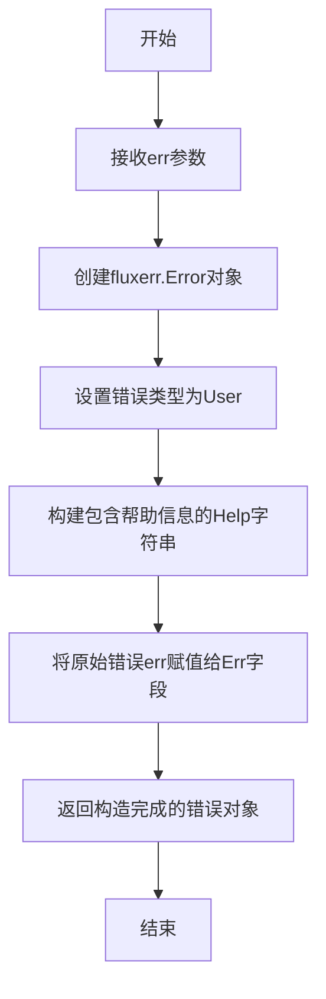

# `flux\pkg\release\errors.go` 详细设计文档

该代码定义了一个错误处理函数，用于创建用户友好的 Flux 发布过程错误信息，包含错误详情和指向文档的链接。

## 整体流程



## 类结构

```
release 包 (Go 语言包)
└── MakeReleaseError 函数 (导出函数)
```

## 全局变量及字段


### `fluxerr`
    
Flux错误处理包，提供错误类型定义和构造方法

类型：`package`
    


### `全局函数.MakeReleaseError`
    
创建包含用户友好错误消息的Flux发布错误对象

类型：`func(err error) *fluxerr.Error`
    


### `MakeReleaseError参数.err`
    
原始错误对象，包含导致发布失败的底层原因

类型：`error`
    


### `fluxerr.Error.Type`
    
错误类型标识，此处为fluxerr.User表示用户错误

类型：`fluxerr.ErrorType`
    


### `fluxerr.Error.Help`
    
面向用户的错误帮助信息，包含错误描述和解决方案链接

类型：`string`
    


### `fluxerr.Error.Err`
    
包装的原始错误，用于错误链追踪和根因分析

类型：`error`
    
    

## 全局函数及方法


### `MakeReleaseError`

该函数用于创建一个结构化的发布失败错误对象，将原始错误包装为用户友好的 Flux 错误信息，包含错误类型、帮助文档链接和原始错误详情，便于用户理解失败原因并获取排查指引。

参数：

- `err`：`error`，需要被包装的原始错误，通常是发布过程中产生的实际错误

返回值：`*fluxerr.Error`，返回一个包含用户友好错误信息的 Flux 错误对象

#### 流程图



#### 带注释源码

```go
// Package release 提供发布相关的功能
package release

// 导入 Flux 错误包，用于创建结构化错误
import (
	fluxerr "github.com/fluxcd/flux/pkg/errors"
)

// MakeReleaseError 创建一个发布失败的用户友好错误
// 参数 err 是原始的错误对象，会被包装在返回的错误中
// 返回一个 *fluxerr.Error 指针，包含错误类型、帮助信息和原始错误
func MakeReleaseError(err error) *fluxerr.Error {
	return &fluxerr.Error{
		// 设置错误类型为用户错误，便于区分系统错误和用户操作错误
		Type: fluxerr.User,
		// Help 字段包含面向用户的错误提示信息
		// 包含原始错误信息、Flux 支持的格式限制文档链接和问题反馈链接
		Help: `The release process failed, with this message:

    ` + err.Error() + `

This may be because of a limitation in the formats of file Flux can
deal with. See

    https://fluxcd.io/legacy/flux/requirements/

for those limitations.

If your files appear to meet the requirements, it may simply be a bug
in Flux. Please report it at

    https://github.com/fluxcd/flux/issues

and try to include the problematic manifest, if it can be identified.
`,
		// 保存原始错误，便于调试和日志记录
		Err: err,
	}
}
```

## 关键组件


### MakeReleaseError 函数

用于创建并返回与Flux发布流程失败相关的用户友好错误对象，封装了原始错误并提供了详细的帮助信息，指向Flux的已知限制和Bug报告地址。

### fluxerr.Error 结构体

Flux项目自定义的错误类型，包含错误类型（Type）、帮助文本（Help）和原始错误（Err）字段，用于结构化地处理和展示Flux操作过程中的错误信息。

### 错误帮助文本模板

静态字符串模板，包含用户友好的错误说明、Flux支持的文件格式限制文档链接、以及Bug报告地址，提供了错误排查的指导方向。


## 问题及建议


### 已知问题

-   **硬编码的URL链接**：帮助文档中的URL直接硬编码在字符串中（fluxcd.io和github.com链接），未来URL变更时需要修改代码，增加维护成本
-   **字符串拼接效率**：使用 `+` 运算符进行字符串拼接，在错误信息较长时可能存在轻微的性能开销
-   **缺乏错误上下文**：函数仅包装原始错误，未添加额外的上下文信息（如发生位置、相关资源等）
-   **错误消息格式问题**：动态插入的错误信息前仅有简单空格对齐，可能导致多行错误信息格式混乱
-   **无国际化支持**：错误帮助信息硬编码为英文，限制了国际化扩展能力

### 优化建议

-   **提取URL为常量或配置项**：将文档链接提取为包级别的常量或配置文件，便于未来维护和更新
-   **使用strings.Builder**：对于复杂的字符串拼接场景，可使用strings.Builder提高性能
-   **增强错误上下文**：可考虑添加额外参数（如资源类型、操作类型、时间戳等）以提供更丰富的错误上下文
-   **改进错误消息格式化**：使用模板引擎或结构化日志方式处理动态错误信息，确保格式一致性
-   **考虑国际化（i18n）设计**：预留国际化接口，支持多语言错误消息
-   **添加错误码机制**：可考虑为不同类型的释放错误定义明确错误码，便于错误分类和处理

## 其它


### 设计目标与约束

该函数的核心目标是将发布过程中的技术错误转换为用户友好的错误消息，帮助用户理解失败原因并提供解决方案。设计约束包括：1) 错误消息必须包含技术细节以便调试；2) 帮助文档需要提供Flux文档和GitHub问题跟踪链接；3) 错误类型固定为fluxerr.User级别，表示这是用户需要关注的错误。

### 错误处理与异常设计

该函数采用统一的错误转换模式，将底层技术错误封装为结构化的用户友好错误。错误类型为fluxerr.User，表示这是面向用户的错误而非系统内部错误。帮助信息包含两个关键部分：一是具体的技术错误消息，二是通用的故障排查指南链接。当错误发生时，调用方应将返回的*fluxerr.Error传递给上层处理机制。

### 外部依赖与接口契约

该函数依赖外部包github.com/fluxcd/flux/pkg/errors中的fluxerr.Error结构。输入参数为标准error接口，返回值为*fluxerr.Error指针。调用方需保证传入的err参数非nil，否则可能产生空指针异常或无意义的错误消息。

### 数据流与状态机

该函数是发布流程错误处理流水线中的一个环节。当发布过程中发生任何错误时，错误首先在底层产生，然后传递给MakeReleaseError进行封装转换，最后返回结构化错误供上层日志或UI系统展示。函数本身无状态，不涉及状态机设计。

### 安全性考虑

该函数存在潜在的安全风险：err.Error()的直接拼接可能导致敏感信息泄露（如文件路径、内部IP等）。建议在生产环境中对错误消息进行脱敏处理，移除可能的敏感技术细节。

### 性能特征

该函数性能开销极低，仅涉及字符串拼接和结构体创建，时间复杂度O(n)其中n为错误消息长度，空间复杂度同样O(n)。适合在错误处理路径上高频调用。

### 测试策略

建议编写以下测试用例：1) 传入不同类型的错误（标准错误、自定义错误、nil）验证行为；2) 验证返回的Error结构字段正确性；3) 验证错误消息格式包含必要链接；4) 性能基准测试确保字符串拼接效率。


    