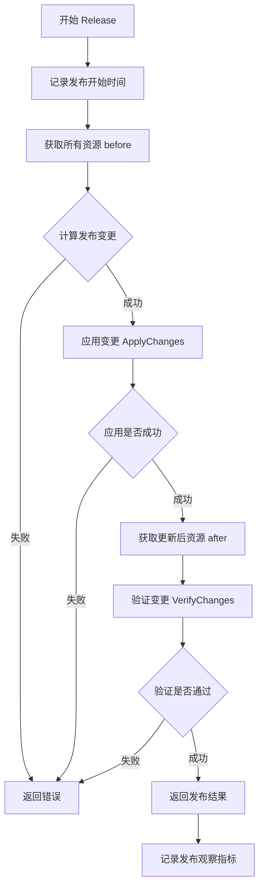
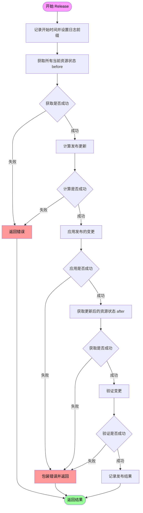
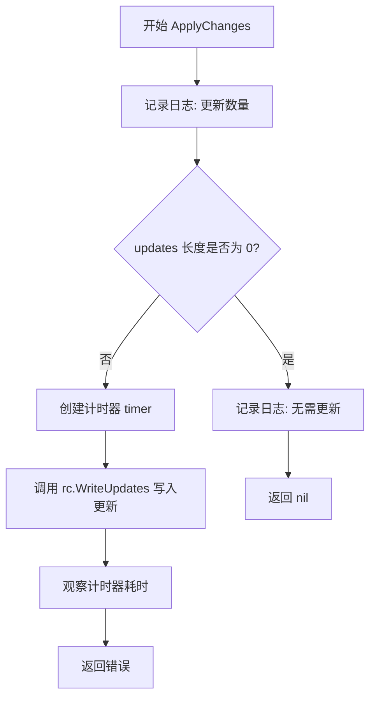
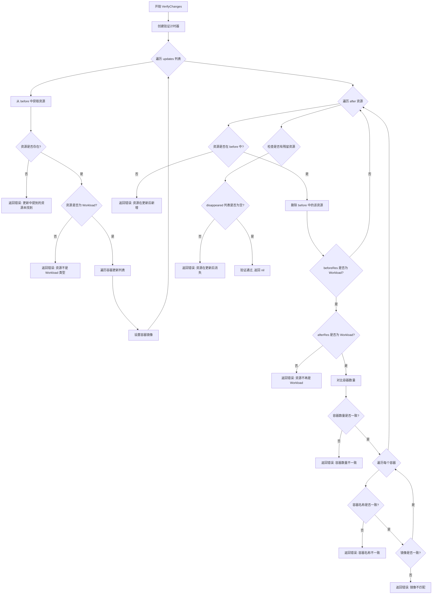
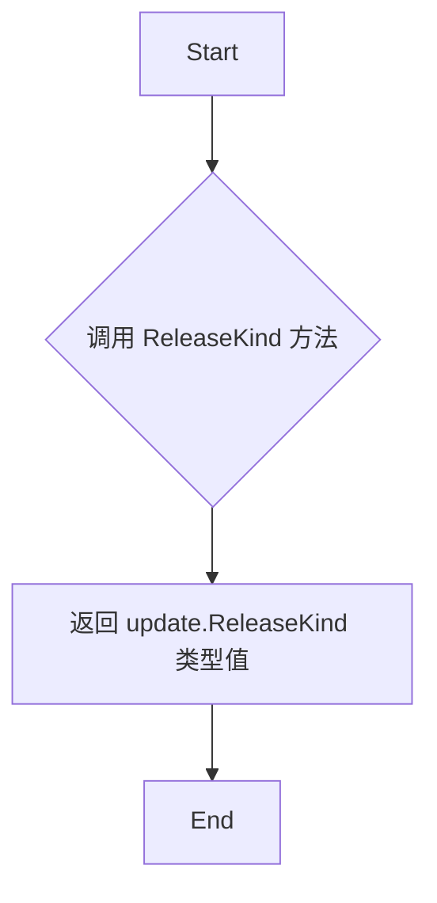
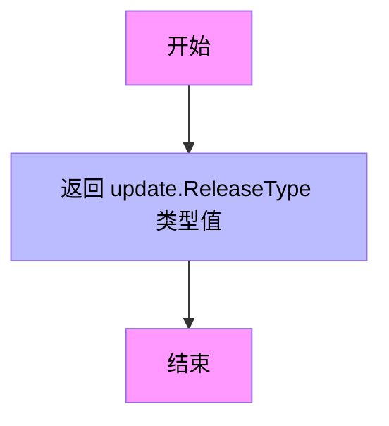
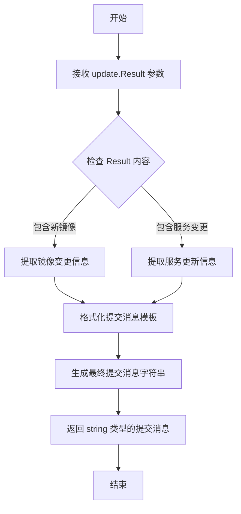

# `flux\pkg\release\releaser.go` 详细设计文档

这是一个Flux CD发布模块，核心功能是协调和管理容器编排平台（如Kubernetes）上的应用发布流程，包括计算发布内容、应用更新变更、验证更新结果等关键步骤。

## 整体流程



## 类结构

```
Changes (接口)
├── CalculateRelease() -> []*update.WorkloadUpdate, update.Result, error
├── ReleaseKind() -> update.ReleaseKind
├── ReleaseType() -> update.ReleaseType
└── CommitMessage(update.Result) -> string

ReleaseContext (外部定义，由rc引用)

包级别函数
├── Release()
├── ApplyChanges()
└── VerifyChanges()
```

## 全局变量及字段


### `ctx`
    
Go标准库的上下文对象，用于传递请求级别的取消、超时和截止信息

类型：`context.Context`
    


### `rc`
    
发布上下文的指针，包含发布所需的所有信息和状态

类型：`*ReleaseContext`
    


### `changes`
    
变更接口，负责计算发布内容、确定发布类型和生成提交信息

类型：`Changes`
    


### `logger`
    
go-kit的日志记录器，用于输出结构化日志

类型：`log.Logger`
    


### `results`
    
发布操作的结果对象，包含发布的详细状态和信息

类型：`update.Result`
    


### `err`
    
Go标准的错误接口，用于捕获和处理异常情况

类型：`error`
    


### `before`
    
更新前的资源映射，键为资源ID字符串，值为资源对象

类型：`map[string]resource.Resource`
    


### `after`
    
更新后的资源映射，键为资源ID字符串，值为资源对象

类型：`map[string]resource.Resource`
    


### `updates`
    
工作负载更新切片，包含需要应用的所有容器镜像更新

类型：`[]*update.WorkloadUpdate`
    


### `timer`
    
阶段计时器，用于测量和记录发布各阶段的执行时间

类型：`*update.StageTimer`
    


    

## 全局函数及方法


### `Release`

这是发布流程的核心入口函数，负责协调整个发布过程。它首先获取当前的资源状态，然后计算需要进行的更新，应用这些更新，最后验证更新后的资源状态是否符合预期。如果任何步骤失败，函数会返回相应的错误信息。

参数：

- `ctx`：`context.Context`，用于控制函数执行的生命周期和取消操作
- `rc`：`*ReleaseContext`，发布上下文，包含发布所需的环境信息和配置
- `changes`：`Changes`，变更计算接口，负责计算发布内容和生成发布结果
- `logger`：`log.Logger`，日志记录器，用于记录发布过程中的日志信息

返回值：`update.Result, error`，返回发布结果和可能的错误信息。如果成功，返回包含发布详情的Result对象；如果失败，返回包含错误原因的error对象。

#### 流程图



#### 带注释源码

```go
// Release 是发布流程的核心入口函数，负责协调整个发布过程
// 参数：
//   - ctx: 上下文对象，用于控制函数的执行和取消
//   - rc: 发布上下文，包含发布所需的环境信息和配置
//   - changes: 变更计算接口，负责计算发布内容和生成发布结果
//   - logger: 日志记录器，用于记录发布过程中的日志信息
//
// 返回值：
//   - results: 发布结果，包含发布的详细信息
//   - err: 错误信息，如果发布过程中出现错误则返回错误
func Release(ctx context.Context, rc *ReleaseContext, changes Changes, logger log.Logger) (results update.Result, err error) {
	// defer 语句用于在函数返回前记录发布观察指标
	defer func(start time.Time) {
		// 记录发布的耗时、成功与否、发布类型和发布种类
		update.ObserveRelease(
			start,
			err == nil,                    // 发布是否成功
			changes.ReleaseType(),         // 发布类型
			changes.ReleaseKind(),         // 发布种类
		)
	}(time.Now())

	// 为日志添加 "type"="release" 标签，便于日志分类
	logger = log.With(logger, "type", "release")

	// 1. 获取发布前的所有资源状态
	before, err := rc.GetAllResources(ctx)
	if err != nil {
		// 获取资源失败，返回错误
		return nil, err
	}

	// 2. 计算需要进行的发布更新
	//    这会根据 changes 接口的实现计算需要更新的工作负载
	updates, results, err := changes.CalculateRelease(ctx, rc, logger)
	if err != nil {
		// 计算更新失败，返回错误
		return nil, err
	}

	// 3. 应用计算出的变更
	err = ApplyChanges(ctx, rc, updates, logger)
	if err != nil {
		// 应用变更失败，包装错误信息并返回
		return nil, MakeReleaseError(errors.Wrap(err, "applying changes"))
	}

	// 4. 获取发布后的所有资源状态
	after, err := rc.GetAllResources(ctx)
	if err != nil {
		// 获取资源失败，包装错误信息并返回
		return nil, MakeReleaseError(errors.Wrap(err, "loading resources after updates"))
	}

	// 5. 验证变更是否正确应用
	err = VerifyChanges(before, updates, after)
	if err != nil {
		// 验证失败，包装错误信息并返回
		return nil, MakeReleaseError(errors.Wrap(err, "verifying changes"))
	}

	// 6. 返回发布结果
	return results, nil
}
```


### ApplyChanges

ApplyChanges 函数负责将更新应用到 ReleaseContext 中。它首先检查是否有待处理的更新，如果没有则直接返回；否则通过 ReleaseContext 的 WriteUpdates 方法写入更新，并使用计时器记录操作耗时。

参数：

- `ctx`：`context.Context`，请求上下文，用于传递取消信号和截止时间
- `rc`：`*ReleaseContext`，发布上下文，包含集群资源和配置信息，用于执行更新操作
- `updates`：`[]*update.WorkloadUpdate`，待应用的工作负载更新列表，每个元素包含资源ID和容器镜像更新信息
- `logger`：`log.Logger`，日志记录器，用于输出函数执行过程中的日志信息

返回值：`error`，如果写入更新过程中发生错误则返回错误，否则返回 nil

#### 流程图



#### 带注释源码

```go
// ApplyChanges 将更新写入到集群中
// 参数 ctx 为上下文对象，rc 为发布上下文，updates 为待应用的更新列表，logger 为日志记录器
func ApplyChanges(ctx context.Context, rc *ReleaseContext, updates []*update.WorkloadUpdate, logger log.Logger) error {
	// 记录待更新的工作负载数量
	logger.Log("updates", len(updates))
	
	// 如果没有待更新的工作负载，直接返回 nil，不执行任何操作
	if len(updates) == 0 {
		logger.Log("exit", "no images to update for services given")
		return nil
	}

	// 创建一个阶段计时器，用于记录写入更新操作的耗时
	timer := update.NewStageTimer("write_changes")
	
	// 调用 ReleaseContext 的 WriteUpdates 方法将更新写入到集群
	err := rc.WriteUpdates(ctx, updates)
	
	// 记录写入操作完成后计时器观察到的持续时间
	timer.ObserveDuration()
	
	// 返回写入过程中可能发生的错误，如果成功则返回 nil
	return err
}
```


### `VerifyChanges`

该函数用于验证 Flux 发布过程中的资源变更是否正确应用。它接收更新前的资源映射、工作负载更新列表和更新后的资源映射，通过对比更新前后资源的容器镜像配置，确保所有指定的镜像更新都已正确应用到资源中，并检测是否有资源丢失或异常新增。

参数：

- `before`：`map[string]resource.Resource`，更新前的资源映射表，以资源ID为键
- `updates`：`[]*update.WorkloadUpdate`，需要应用的工作负载更新列表，包含每个资源的容器镜像更新信息
- `after`：`map[string]resource.Resource`，更新后的资源映射表，用于与预期的更新结果进行比对验证

返回值：`error`，如果验证成功返回 nil，如果验证失败返回包含详细错误信息的错误对象

#### 流程图



#### 带注释源码

```go
// VerifyChanges checks that the `after` resources are exactly the
// `before` resources with the updates applied. It destructively
// updates `before`.
func VerifyChanges(before map[string]resource.Resource, updates []*update.WorkloadUpdate, after map[string]resource.Resource) error {
	// 创建验证阶段计时器，用于监控验证性能
	timer := update.NewStageTimer("verify_changes")
	// 确保函数返回时记录验证耗时
	defer timer.ObserveDuration()

	// 内部函数：构造验证错误信息，封装底层错误并添加上下文
	verificationError := func(msg string, args ...interface{}) error {
		return errors.Wrap(fmt.Errorf(msg, args...), "failed to verify changes")
	}

	// 第一阶段：模拟应用更新，修改 before 映射
	// 遍历每个更新，验证资源存在并将镜像设置到 before 资源中
	for _, update := range updates {
		// 根据资源ID从 before 映射中获取资源
		res, ok := before[update.ResourceID.String()]
		if !ok {
			// 错误：更新中引用的资源在当前资源列表中不存在
			return verificationError("resource %q mentioned in update not found in resources", update.ResourceID.String())
		}
		// 类型断言：验证资源是 Workload 类型（Deployment/DaemonSet等）
		wl, ok := res.(resource.Workload)
		if !ok {
			// 错误：资源不是工作负载类型，无法进行镜像更新
			return verificationError("resource %q mentioned in update is not a workload", update.ResourceID.String())
		}
		// 遍历该资源的所有容器更新
		for _, containerUpdate := range update.Updates {
			// 设置目标镜像到工作负载的指定容器
			if err := wl.SetContainerImage(containerUpdate.Container, containerUpdate.Target); err != nil {
				// 错误：容器镜像更新失败
				return verificationError("updating container %q in resource %q failed: %s", containerUpdate.Container, update.ResourceID.String(), err.Error())
			}
		}
	}

	// 第二阶段：验证更新后的资源状态
	// 遍历 after 映射中的所有资源，与修改后的 before 进行对比
	for id, afterRes := range after {
		// 检查该资源是否在更新前的资源中存在（不允许新增资源）
		beforeRes, ok := before[id]
		if !ok {
			// 错误：更新后出现了新的资源，这是不允许的
			return verificationError("resource %q is new after update")
		}
		// 从 before 映射中删除已验证的资源，剩余资源表示已消失
		delete(before, id)

		// 类型检查：before 中的资源必须是 Workload
		beforeWorkload, ok := beforeRes.(resource.Workload)
		if !ok {
			// 如果不是工作负载类型，跳过验证（非工作负载资源不检查）
			continue
		}
		// 类型检查：after 中的资源必须是 Workload
		afterWorkload, ok := afterRes.(resource.Workload)
		if !ok {
			// 错误：更新后资源不再是工作负载（如被删除或类型变更）
			return verificationError("resource %q is no longer a workload (Deployment or DaemonSet, or similar) after update", id)
		}

		// 获取更新前后的容器列表
		beforeContainers := beforeWorkload.Containers()
		afterContainers := afterWorkload.Containers()
		// 验证容器数量未发生变化
		if len(beforeContainers) != len(afterContainers) {
			return verificationError("resource %q has different set of containers after update", id)
		}
		// 逐个验证容器配置
		for i := range afterContainers {
			// 验证容器名称一致
			if beforeContainers[i].Name != afterContainers[i].Name {
				return verificationError("container in position %d of resource %q has a different name after update: was %q, now %q", i, id, beforeContainers[i].Name, afterContainers[i].Name)
			}
			// 验证容器镜像已正确更新
			if beforeContainers[i].Image != afterContainers[i].Image {
				return verificationError("the image for container %q in resource %q should be %q, but is %q", beforeContainers[i].Name, id, beforeContainers[i].Image.String(), afterContainers[i].Image.String())
			}
		}
	}

	// 第三阶段：检查是否有资源在更新后消失
	// 遍历剩余的 before 资源，这些资源在更新后被删除了
	var disappeared []string
	for id := range before {
		disappeared = append(disappeared, fmt.Sprintf("%q", id))
	}
	// 如果有消失的资源，返回错误
	if len(disappeared) > 0 {
		return verificationError("resources {%s} present before update but not after", strings.Join(disappeared, ", "))
	}

	// 所有验证通过，返回 nil 表示验证成功
	return nil
}
```


### `Changes.CalculateRelease`

该接口方法负责根据发布上下文和变更策略计算需要应用到工作负载的镜像更新，返回更新列表、发布结果和可能的错误。

参数：

- `ctx`：`context.Context`，用于传递上下文信息和取消信号
- `ReleaseContext`：包含发布所需的上下文信息（如命名空间、服务、镜像等）
- `logger`：`log.Logger`，用于记录发布过程中的日志信息

返回值：

- `[]*update.WorkloadUpdate`：需要应用到工作负载的更新列表
- `update.Result`：发布操作的结果
- `error`：如果计算过程中出现错误，则返回错误信息

#### 流程图

```mermaid
flowchart TD
    A[开始 CalculateRelease] --> B[接收 context.Context]
    B --> C[接收 update.ReleaseContext]
    C --> D[接收 log.Logger]
    D --> E{执行发布计算逻辑}
    E -->|成功| F[返回 []*update.WorkloadUpdate]
    E -->|成功| G[返回 update.Result]
    E -->|失败| H[返回 error]
    F --> I[结束]
    G --> I
    H --> I
```

#### 带注释源码

```go
// Changes 接口定义了发布变更计算的抽象行为
type Changes interface {
    // CalculateRelease 方法用于计算需要发布的更新
    // 参数 ctx: 上下文对象，用于控制超时和取消
    // 参数 ReleaseContext: 发布上下文，包含发布所需的所有信息
    // 参数 logger: 日志记录器
    // 返回值 []*update.WorkloadUpdate: 要应用的工作负载更新列表
    // 返回值 update.Result: 发布结果
    // 返回值 error: 计算过程中的错误
    CalculateRelease(context.Context, update.ReleaseContext, log.Logger) ([]*update.WorkloadUpdate, update.Result, error)
    
    // ReleaseKind 返回发布的类型（如自动发布或手动发布）
    ReleaseKind() update.ReleaseKind
    
    // ReleaseType 返回发布的资源类型
    ReleaseType() update.ReleaseType
    
    // CommitMessage 生成发布提交的提交信息
    CommitMessage(update.Result) string
}
```

> **注意**：该代码片段中仅提供了 `Changes` 接口的定义，`CalculateRelease` 方法的具体实现位于实现该接口的具体类型中。从 `Release` 函数的调用可以看出，该方法被用来生成需要应用到工作负载的镜像更新列表。


### Changes.ReleaseKind

获取发布的类型（ReleaseKind），用于标识发布的种类（如手动发布、自动发布等）。

参数：
- 无

返回值：`update.ReleaseKind`，发布的类型枚举值，用于标识本次发布的种类

#### 流程图



#### 带注释源码

```go
// ReleaseKind 是 Changes 接口的方法定义
// 该方法返回本次发布的类型（ReleaseKind）
// 在 Release 函数中通过 defer 延迟调用，观察发布结果时使用
ReleaseKind() update.ReleaseKind
```

---

### 补充说明

#### 接口定义上下文

`Changes.ReleaseKind()` 是 `Changes` 接口中定义的一个方法，该接口的完整定义如下：

```go
type Changes interface {
    CalculateRelease(context.Context, update.ReleaseContext, log.Logger) ([]*update.WorkloadUpdate, update.Result, error)
    ReleaseKind() update.ReleaseKind      // 提取的目标方法
    ReleaseType() update.ReleaseType
    CommitMessage(update.Result) string
}
```

#### 使用场景

在 `Release` 函数中，该方法被调用用于观测（observe）发布结果：

```go
defer func(start time.Time) {
    update.ObserveRelease(
        start,
        err == nil,
        changes.ReleaseType(),
        changes.ReleaseKind(),  // <-- 在此处使用
    )
}(time.Now())
```

#### 技术说明

- **返回值类型** `update.ReleaseKind`：是一个枚举类型，代表发布的种类（如 `ReleaseKind` 可能包括 `Execute`、`Plan` 等值）
- **调用频率**：在每次发布流程中调用一次（通过 `defer` 延迟执行）
- **设计意图**：将发布的"类型"（Kind）与"类型"（Type）区分开来，用于细粒度的指标统计和日志记录


### `Changes.ReleaseType`

该方法定义在 `Changes` 接口中，用于返回发布操作的类型（如自动化发布、手动发布等），帮助调用者区分不同的发布策略。

参数：
- （无参数）

返回值：`update.ReleaseType`，表示发布操作的类型枚举值

#### 流程图



#### 带注释源码

```go
// ReleaseType 返回当前发布操作的类型
// 该方法定义在 Changes 接口中，具体实现由实现该接口的类提供
// 返回值 update.ReleaseType 是一个枚举类型，用于标识发布的分类
// 例如：自动化发布、手动发布、预发布等不同类型
ReleaseType() update.ReleaseType
```

---

**补充说明：**

该方法是 `Changes` 接口的成员方法，接口定义了发布计算的核心抽象。具体实现类需要实现此方法以返回具体的发布类型。`update.ReleaseType` 通常为枚举类型，用于在发布流程中区分不同的发布策略和行为。


### Changes.CommitMessage

描述：这是 `Changes` 接口中定义的一个方法，用于根据发布结果（update.Result）生成对应的 Git 提交消息文本。该方法将发布的结果信息格式化为字符串，以便在版本控制系统中记录变更内容。

参数：

- `result`：`update.Result`，包含发布操作的结果信息，用于生成提交消息的原始数据

返回值：`string`，返回格式化后的 Git 提交消息字符串，描述了本次发布的具体变更内容

#### 流程图



#### 带注释源码

```go
// CommitMessage 是 Changes 接口的方法声明
// 参数 result: update.Result 类型，包含发布的详细结果信息
//         - 可能包含更新的镜像列表
//         - 可能包含受影响的资源列表
//         - 可能包含发布操作的成功/失败状态
// 返回值: string 类型，返回格式化的 Git 提交消息
//         - 通常包含变更的资源名称
//         - 通常包含更新的镜像版本
//         - 通常包含发布类型和发布意图的描述
CommitMessage(update.Result) string
```

#### 补充说明

由于 `CommitMessage` 是接口方法而非具体实现，其实际逻辑取决于具体的实现类。从代码上下文的 `Release` 函数可以看出，该方法在发布流程中被用于记录变更日志。实现类需要：

1. 解析 `update.Result` 中的变更信息
2. 将变更内容格式化为人类可读的字符串
3. 返回符合 Git 提交消息格式的字符串

可能的实现会使用 `update.Result` 中包含的：
- 资源 ID 和名称
- 容器镜像的变更（旧版本 → 新版本）
- 发布类型（ReleaseKind）和发布子类型（ReleaseType）

## 关键组件


### Changes 接口

定义发布计算的抽象接口，包含发布类型、发布种类计算以及提交消息生成等核心抽象方法。

### Release 函数

主发布流程函数，负责协调整个发布过程，包括获取资源、计算发布、应用变更、验证结果，并记录发布指标。

### ApplyChanges 函数

将计算出的工作负载更新写入集群的函数，负责实际执行资源更新操作，并记录写入阶段的耗时。

### VerifyChanges 函数

验证更新前后的资源一致性，检查所有更新是否正确应用，确保没有资源丢失或不一致的情况。

### ReleaseContext 类型

发布上下文管理器，提供获取资源、写入更新等与集群交互的能力，是发布操作的基础设施依赖。

### VerifyChanges 验证逻辑

包含资源存在性验证、工作负载类型验证、容器镜像更新验证、容器数量和名称一致性验证等多层验证机制。

### 错误处理机制

使用 errors.Wrap 包装错误信息，通过 MakeReleaseError 统一生成发布错误，支持上下文丰富的错误追踪。

### 发布指标观测

通过 update.ObserveRelease 记录发布成功与否、发布类型、发布种类等指标，用于运维监控。


## 问题及建议


### 已知问题

-   **未使用的变量**：`Release`函数中获取了`before`变量，但在后续的验证逻辑中并未使用，只使用了`updates`和`after`，造成资源浪费和逻辑冗余
-   **错误处理不一致**：`ApplyChanges`返回的错误在`Release`函数中没有使用`MakeReleaseError`包装，而其他错误都进行了包装，风格不统一
-   **缺少参数的错误消息**：`VerifyChanges`函数中存在格式化字符串参数缺失的错误：`return verificationError("resource %q is new after update")`缺少了id参数，会导致panic
-   **缺乏超时控制**：对`GetAllResources`、`CalculateRelease`、`WriteUpdates`等远程操作没有设置上下文超时，可能导致长时间阻塞
-   **日志信息不完整**：成功或失败时缺少具体的更新内容、资源标识等关键信息，不利于问题排查
-   **VerifyChanges函数职责过重**：该函数同时处理容器镜像更新验证、资源存在性验证、容器数量和名称验证，违反单一职责原则
-   **潜在的时序问题**：获取`before`和`after`资源之间存在时间窗口，期间其他进程可能修改资源，导致验证结果不准确

### 优化建议

-   移除`Release`函数中未使用的`before`变量，或将其用于更细粒度的变更对比
-   统一错误处理方式，对所有返回的错误使用`MakeReleaseError`进行包装
-   修复`verificationError`调用中缺失的参数，确保所有错误消息完整
-   在`context.Context`中合理设置超时，使用`context.WithTimeout`或在各操作入口添加超时控制
-   增加关键节点的日志记录，包括：具体的资源更新内容、验证失败的详细信息、操作耗时等
-   将`VerifyChanges`拆分为多个单一职责的函数：`validateContainersUpdated`、`validateResourcesExist`、`validateNoNewResources`
-   考虑在获取`before`和`after`资源时添加版本号或标签，用于更可靠的变更检测
-   为`ApplyChanges`添加重试机制，处理临时性的写入失败
-   考虑将`VerifyChanges`中的错误收集改为一次性返回所有错误，而非遇到第一个错误就返回


## 其它


### 设计目标与约束

本模块的设计目标是实现Flux CD的发布机制，确保对Kubernetes资源的更新能够原子性地应用并验证。主要约束包括：1) 必须保证更新的原子性，即要么全部成功要么全部回滚；2) 更新过程必须可观测，支持日志记录和指标统计；3) 必须支持多种发布类型（ReleaseType）和发布Kind（ReleaseKind）；4) 验证阶段采用破坏性比较（destructive update），会修改before资源对象。

### 错误处理与异常设计

错误处理采用分层设计：1) 使用`MakeReleaseError`包装底层错误，提供上下文信息；2) `VerifyChanges`内部使用`verificationError`辅助函数创建结构化错误信息；3) 关键函数通过defer捕获执行时间并记录发布是否成功；4) 错误传播遵循Go惯例，返回error类型供调用者处理。主要异常场景包括：资源不存在、资源类型不匹配、容器镜像更新失败、资源数量不一致、容器名称变化、镜像未正确更新、资源消失等。

### 数据流与状态机

数据流遵循以下状态转换：1) Init状态：获取所有资源（GetAllResources）；2) Calculate状态：通过changes.CalculateRelease计算需要更新的工作负载；3) Apply状态：调用WriteUpdates写入更新；4) Verify状态：重新获取资源并验证更新结果；5) Final状态：返回Result或错误。状态机确保每个阶段完成后才进入下一阶段，任何阶段失败都会立即返回错误。

### 外部依赖与接口契约

主要外部依赖包括：1) `github.com/go-kit/kit/log` - 日志记录；2) `github.com/pkg/errors` - 错误包装；3) `github.com/fluxcd/flux/pkg/resource` - 资源抽象；4) `github.com/fluxcd/flux/pkg/update` - 更新相关类型和指标。接口契约：Changes接口必须实现CalculateRelease、ReleaseKind、ReleaseType、CommitMessage四个方法；ReleaseContext需要提供GetAllResources、WriteUpdates方法；返回的WorkloadUpdate包含ResourceID和Updates数组。

### 性能考虑

性能优化点：1) 使用StageTimer记录各阶段耗时；2) VerifyChanges中对容器的验证采用索引遍历而非map查找；3) 资源映射使用string作为key提高查找效率；4) disappeared资源收集使用append而非预分配。潜在性能瓶颈：1) 两次GetAllResources调用可能带来较大IO开销；2) VerifyChanges中的容器比较在容器数量多时可能较慢；3) 错误处理中的字符串格式化（fmt.Errorf）有一定开销。

### 安全考虑

安全相关设计：1) 资源ID使用String()方法转换，避免直接暴露内部结构；2) 镜像比较使用Image类型的安全比较方法；3) 错误消息中包含资源标识但不泄露敏感元数据；4) 上下文（context.Context）用于传播超时和取消信号。安全建议：添加资源权限验证、检查镜像来源合法性、限制并发更新数量。

### 并发考虑

当前代码的并发处理：1) 未显式使用goroutine，流程为同步串行执行；2) 使用context进行并发控制传播；3) timer使用defer确保资源释放。并发风险：1) 多个Release调用可能同时操作同一资源，需要外部加锁；2) WriteUpdates的并发安全性依赖ReleaseContext实现；3) 验证阶段的before映射为非线程安全。

### 测试策略

建议的测试覆盖：1) 单元测试：VerifyChanges的各种边界情况（资源不存在、类型错误、容器不匹配等）；2) 集成测试：完整的Release流程，包括与mock ReleaseContext的交互；3) 模糊测试：Generate多种资源状态组合测试验证逻辑；4) 性能测试：大容器数量场景下的验证性能。

### 监控与可观测性

可观测性设计：1) ObserveRelease记录发布是否成功、发布类型、耗时；2) StageTimer记录write_changes和verify_changes阶段耗时；3) 日志记录包含updates数量、exit信息；4) 建议添加：发布的资源数量、失败的资源标识、每个阶段的详细耗时。

### 配置管理

配置相关说明：1) 无显式配置项，所有参数通过函数参数传入；2) ReleaseKind和ReleaseType决定发布行为，由Changes接口实现提供；3) 超时控制通过context参数传递。建议：可将日志级别、验证严格程度等提取为配置参数。

### 代码质量与扩展性

扩展性设计：1) Changes接口允许自定义发布策略实现；2) ReleaseContext抽象支持不同Kubernetes客户端实现；3) WorkloadUpdate结构支持细粒度容器更新。代码质量建议：1) VerifyChanges中before参数的破坏性修改容易造成误用，建议添加注释或重构为非破坏性；2) 错误消息中存在格式化问题（如"resource %q is new after update"缺少参数）；3) 建议提取重复的验证逻辑为独立函数。


    