# `flux\pkg\release\releaser_test.go` 详细设计文档

这是一个针对 Flux CD 系统中镜像发布功能（Release）的集成测试文件，主要验证了发布逻辑在处理过滤、锁定的 workloads、语义版本（semver）匹配、多文档更新以及错误校验等方面的正确性。

## 整体流程

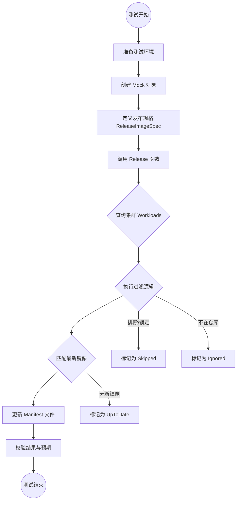

## 类结构

```
release (测试包)
├── expected (测试辅助结构体)
│   └── Result() 方法
├── badManifests (错误验证辅助结构体)
│   └── SetWorkloadContainerImage() 方法
└── 全局变量 (Mock 数据)
    ├── 容器名称定义
    ├── 镜像引用定义 (oldRef, newRef)
    ├── 工作负载定义 (hwSvc, lockedSvc)
    └── Mock 依赖 (mockRegistry, mockManifests)
```

## 全局变量及字段


### `helloContainer`
    
greeter

类型：`string`
    


### `sidecarContainer`
    
sidecar

类型：`string`
    


### `lockedContainer`
    
locked-service

类型：`string`
    


### `testContainer`
    
test-service

类型：`string`
    


### `oldImage`
    
quay.io/weaveworks/helloworld:master-a000001

类型：`string`
    


### `oldRef`
    
旧镜像引用

类型：`image.Ref`
    


### `sidecarImage`
    
weaveworks/sidecar:master-a000001

类型：`string`
    


### `sidecarRef`
    
sidecar 旧引用

类型：`image.Ref`
    


### `hwSvcID`
    
helloworld 服务的 ID

类型：`resource.ID`
    


### `hwSvc`
    
helloworld 完整工作负载对象

类型：`cluster.Workload`
    


### `testServiceRef`
    
test-service 镜像引用

类型：`image.Ref`
    


### `oldLockedImg`
    
locked-service:1

类型：`string`
    


### `newLockedImg`
    
locked-service:2

类型：`string`
    


### `lockedSvc`
    
locked-service 工作负载

类型：`cluster.Workload`
    


### `semverHwImg`
    
helloworld:3.0.0

类型：`string`
    


### `semverSvc`
    
semver 测试服务工作负载

类型：`cluster.Workload`
    


### `testSvc`
    
test-service 工作负载

类型：`cluster.Workload`
    


### `allSvcs`
    
所有服务列表

类型：`[]cluster.Workload`
    


### `newHwRef`
    
helloworld 新镜像引用

类型：`image.Ref`
    


### `newSidecarRef`
    
sidecar 新镜像引用

类型：`image.Ref`
    


### `canonSidecarRef`
    
canonical 格式的 sidecar 引用

类型：`image.Ref`
    


### `timeNow`
    
当前时间

类型：`time.Time`
    


### `timePast`
    
过去时间

类型：`time.Time`
    


### `mockRegistry`
    
模拟的镜像仓库

类型：`*registryMock.Registry`
    


### `mockManifests`
    
模拟的 Manifests 生成器

类型：`manifests.Manifests`
    


### `ignoredNotIncluded`
    
未包含状态结果

类型：`update.WorkloadResult`
    


### `ignoredNotInRepo`
    
不在仓库状态结果

类型：`update.WorkloadResult`
    


### `ignoredNotInCluster`
    
不在集群状态结果

类型：`update.WorkloadResult`
    


### `skippedLocked`
    
跳过-锁定状态

类型：`update.WorkloadResult`
    


### `skippedNotInCluster`
    
跳过-不在集群

类型：`update.WorkloadResult`
    


### `skippedNotInRepo`
    
跳过-不在仓库

类型：`update.WorkloadResult`
    


### `expected.Specific`
    
特定服务的预期结果

类型：`update.Result`
    


### `expected.Else`
    
默认的兜底结果

类型：`update.WorkloadResult`
    


### `badManifests.Manifests`
    
嵌入的接口实现，用于模拟错误的 Manifests

类型：`manifests.Manifests`
    
    

## 全局函数及方法


### `mockCluster`

创建并返回一个配置了 `AllWorkloadsFunc` 和 `SomeWorkloadsFunc` 的 mock 集群对象，用于测试环境中模拟 Kubernetes 集群的工作负载查询操作。

参数：

- `running`：`...cluster.Workload`，可变参数，表示在集群中运行的 workloads 列表

返回值：`*mock.Mock`，返回配置了 `AllWorkloadsFunc` 和 `SomeWorkloadsFunc` 的 mock 集群对象

#### 流程图

```mermaid
flowchart TD
    A[开始 mockCluster] --> B{接收 running 可变参数}
    B --> C[创建 &mock.Mock{} 实例]
    C --> D[配置 AllWorkloadsFunc]
    D --> E[配置 SomeWorkloadsFunc]
    E --> F[返回 mock.Mock 指针]
    
    subgraph AllWorkloadsFunc
    D1[接收 ctx 和 maybeNamespace] --> D2[返回 running 和 nil]
    end
    
    subgraph SomeWorkloadsFunc
    E1[接收 ctx 和 ids] --> E2{遍历 ids}
    E2 --> E3{遍历 running 查找匹配}
    E3 --> E4[将匹配的 workload 追加到结果]
    E4 --> E5[返回结果列表和 nil]
    end
```

#### 带注释源码

```go
// mockCluster 创建一个模拟的集群对象，用于测试
// 参数 running: 可变参数，传入要模拟的 cluster.Workload 列表
// 返回值: 配置了 AllWorkloadsFunc 和 SomeWorkloadsFunc 的 mock.Mock 对象
func mockCluster(running ...cluster.Workload) *mock.Mock {
	return &mock.Mock{
		// AllWorkloadsFunc 返回所有运行中的工作负载
		// 参数 ctx: 上下文对象
		// 参数 maybeNamespace: 命名空间过滤条件（此实现忽略）
		// 返回值: 传入的所有 running workloads 和 nil 错误
		AllWorkloadsFunc: func(ctx context.Context, maybeNamespace string) ([]cluster.Workload, error) {
			return running, nil
		},
		// SomeWorkloadsFunc 根据 ID 列表返回指定的工作负载
		// 参数 ctx: 上下文对象
		// 参数 ids: 要查询的资源 ID 列表
		// 返回值: 匹配 ID 的 workload 列表和 nil 错误
		SomeWorkloadsFunc: func(ctx context.Context, ids []resource.ID) ([]cluster.Workload, error) {
			var res []cluster.Workload
			// 遍历请求的 ID 列表
			for _, id := range ids {
				// 遍历运行中的工作负载，查找匹配的 ID
				for _, svc := range running {
					if id == svc.ID {
						res = append(res, svc)
					}
				}
			}
			return res, nil
		},
	}
}
```


### `NewManifestStoreOrFail`

创建一个基于 Git checkout 目录的 manifest 存储实例，用于在测试环境中访问和管理 Kubernetes 资源清单文件。该函数封装了 `manifests.NewRawFiles` 的创建过程，提供统一的测试辅助接口。

参数：

- `t`：`*testing.T`，Go 标准测试框架的测试实例指针，用于报告测试过程中的错误和失败
- `parser`：`manifests.Manifests`，manifest 解析器接口实例，负责解析和验证 Kubernetes 资源清单文件
- `checkout`：`*git.Checkout`，Git 仓库检出对象，包含仓库目录路径和文件路径信息，用于定位manifest文件位置

返回值：`manifests.Store`，manifest 存储接口，提供读取和管理 Kubernetes 资源清单的统一抽象

#### 流程图

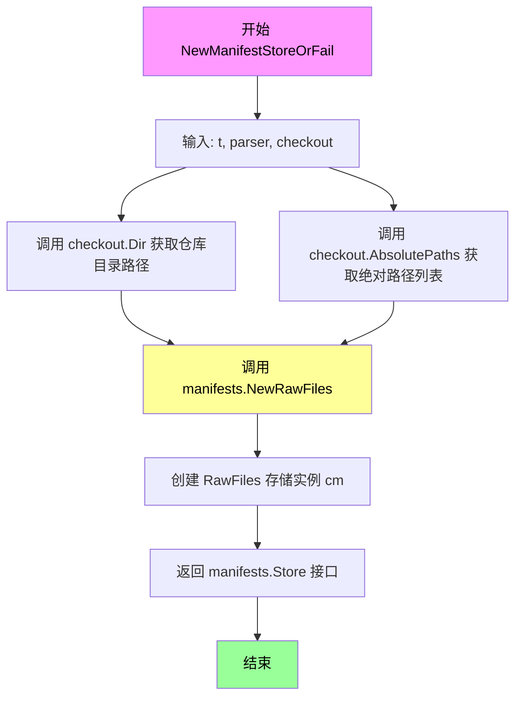

#### 带注释源码

```go
// NewManifestStoreOrFail 创建基于 Git checkout 的 manifest 存储实例
// 参数:
//   - t: *testing.T - 测试框架提供的测试实例，用于错误报告
//   - parser: manifests.Manifests - manifest 解析器，处理资源清单的解析和验证
//   - checkout: *git.Checkout - Git 检出对象，提供对特定版本仓库文件的访问
//
// 返回值:
//   - manifests.Store: manifest 存储接口，用于后续的资源读取和管理操作
func NewManifestStoreOrFail(t *testing.T, parser manifests.Manifests, checkout *git.Checkout) manifests.Store {
	// 使用 RawFiles 方式创建 manifest 存储
	// 参数说明:
	//   - checkout.Dir(): 返回 Git 仓库的本地工作目录路径
	//   - checkout.AbsolutePaths(): 返回仓库中 manifest 文件的绝对路径列表
	//   - parser: 传入的 manifest 解析器，用于解析 YAML/JSON 格式的资源定义
	cm := manifests.NewRawFiles(checkout.Dir(), checkout.AbsolutePaths(), parser)
	
	// 返回 manifests.Store 接口类型
	// RawFiles 实现了 Store 接口的读取方法
	return cm
}
```


### `setup(t *testing.T) (*git.Checkout, func())`

该函数是测试环境的初始化函数，通过调用 `gittest.Checkout(t)` 创建一个临时的 Git 仓库测试环境，并返回一个 `*git.Checkout` 对象供测试使用，同时返回一个清理函数用于测试完成后删除临时文件。

参数：

- `t`：`*testing.T`，Go 标准测试框架的测试对象，用于报告测试失败和控制测试行为

返回值：

- `*git.Checkout`：Git 仓库检出对象，包含仓库目录路径和绝对路径信息，供测试读写使用
- `func()`：清理函数，在测试结束时调用以删除临时创建的 Git 仓库目录

#### 流程图

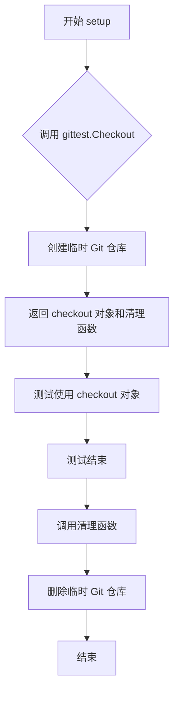

#### 带注释源码

```go
// setup 初始化 git 仓库测试环境，返回 checkout 目录和清理函数
// 参数 t: *testing.T, Go测试框架的测试对象
// 返回值: (*git.Checkout, func()) - git仓库检出对象和清理函数
func setup(t *testing.T) (*git.Checkout, func()) {
    // 调用 gittest.Checkout 创建临时Git仓库测试环境
    // 该函数内部会:
    // 1. 创建临时目录
    // 2. 初始化Git仓库
    // 3. 创建一些测试用的文件和提交
    // 4. 返回包含仓库信息的 *git.Checkout 对象
    return gittest.Checkout(t)
}
```

#### 补充说明

此函数是测试基础设施的关键组成部分，主要用于：

1. **测试环境隔离**：每次测试调用都会创建独立的临时 Git 仓库，避免测试间相互影响
2. **资源清理**：通过返回的清理函数确保测试完成后临时文件被正确删除
3. **Git 操作模拟**：为测试提供完整的 Git 仓库环境，支持 commit、push、pull 等操作

该函数被多个测试用例频繁调用（如 `Test_InitContainer`、`Test_FilterLogic` 等），是整个测试套件的基础设施函数。


### `Test_InitContainer`

该测试函数验证了 Flux CD 系统中对初始化容器（Init Container）的发布逻辑，测试当工作负载为 DaemonSet 且包含初始化容器时，系统能否正确识别并更新其容器镜像。

参数：

- `t`：`*testing.T`，Go 测试框架的标准参数，用于报告测试失败和日志输出

返回值：无（测试函数无返回值）

#### 流程图

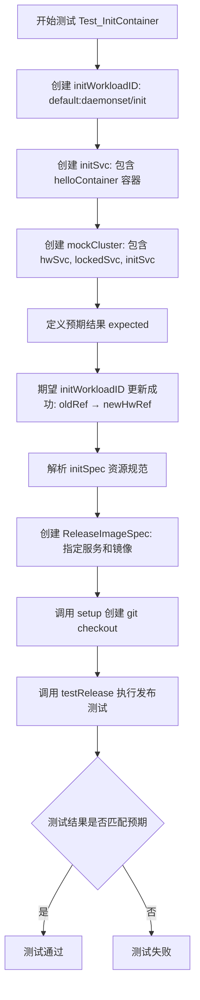

#### 带注释源码

```go
// Test_InitContainer 测试初始化容器（InitContainer）的发布逻辑
// 该测试验证当工作负载为 DaemonSet 且包含初始化容器时，
// 系统能否正确识别并更新其容器镜像
func Test_InitContainer(t *testing.T) {
    // 1. 创建初始化工作负载的 ID，类型为 DaemonSet
    initWorkloadID := resource.MustParseID("default:daemonset/init")
    
    // 2. 创建初始化服务的工作负载对象
    // 包含一个名为 helloContainer 的容器，使用旧镜像 oldRef
    initSvc := cluster.Workload{
        ID: initWorkloadID,
        Containers: cluster.ContainersOrExcuse{
            Containers: []resource.Container{
                {
                    Name:  helloContainer,    // 容器名称
                    Image: oldRef,            // 当前使用的旧镜像
                },
            },
        },
    }

    // 3. 创建模拟集群，包含三个工作负载：
    // - hwSvc: helloworld 服务
    // - lockedSvc: 被锁定的服务
    // - initSvc: 初始化容器服务（测试目标）
    mCluster := mockCluster(hwSvc, lockedSvc, initSvc)

    // 4. 定义预期测试结果
    expect := expected{
        // 针对特定工作负载的预期结果
        Specific: update.Result{
            initWorkloadID: update.WorkloadResult{
                Status: update.ReleaseStatusSuccess,  // 期望更新成功
                PerContainer: []update.ContainerUpdate{
                    {
                        Container: helloContainer,      // 容器名称
                        Current:   oldRef,              // 当前镜像
                        Target:    newHwRef,            // 目标镜像（新版本）
                    },
                },
            },
        },
        // 其他未指定的工作负载默认为"忽略"状态
        Else: ignoredNotIncluded,
    }

    // 5. 解析资源规范
    initSpec, _ := update.ParseResourceSpec(initWorkloadID.String())
    
    // 6. 创建发布镜像规范
    // - ServiceSpecs: 指定要更新的服务
    // - ImageSpec: 使用最新镜像（ImageSpecLatest）
    // - Kind: 执行发布（ReleaseKindExecute）
    spec := update.ReleaseImageSpec{
        ServiceSpecs: []update.ResourceSpec{initSpec},
        ImageSpec:    update.ImageSpecLatest,
        Kind:         update.ReleaseKindExecute,
    }

    // 7. 设置测试环境：创建 git checkout
    checkout, clean := setup(t)
    defer clean()  // 测试结束后清理资源

    // 8. 执行发布测试
    // 创建 ReleaseContext 包含：
    // - cluster: 模拟的 Kubernetes 集群
    // - resourceStore:  manifests 存储
    // - registry: 镜像仓库（包含新版本镜像）
    testRelease(t, &ReleaseContext{
        cluster:       mCluster,
        resourceStore: NewManifestStoreOrFail(t, mockManifests, checkout),
        registry:      mockRegistry,
    }, spec, expect.Result())
}
```


### `Test_FilterLogic`

测试发布时的过滤逻辑（包含、排除、特定镜像等场景），验证不同过滤条件下工作负载的处理结果是否符合预期。

参数：

-  `t`：`testing.T`，Go 测试框架的标准参数，用于报告测试失败

返回值：无（测试函数），通过 `assert` 断言验证结果

#### 流程图

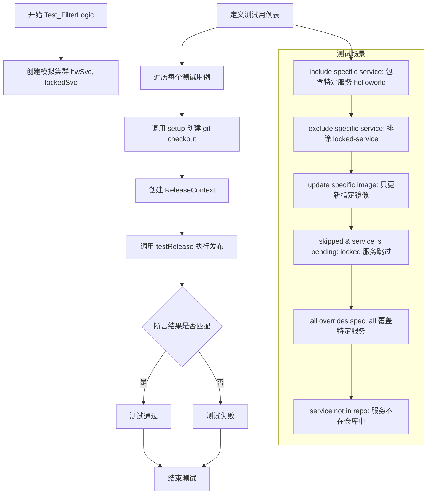

#### 带注释源码

```go
func Test_FilterLogic(t *testing.T) {
	// 创建一个模拟集群，包含 helloworld 和 locked-service 服务
	// 注意：testSvc 不在集群中，但存在于代码仓库中
	mCluster := mockCluster(hwSvc, lockedSvc)

	// 定义一个不在仓库中的服务用于测试
	notInRepoService := "default:deployment/notInRepo"
	notInRepoSpec, _ := update.ParseResourceSpec(notInRepoService)

	// 遍历所有测试用例
	for _, tst := range []struct {
		Name     string                // 测试用例名称
		Spec     update.ReleaseImageSpec  // 发布镜像规范
		Expected expected              // 期望的结果
	}{
		// 场景1: 包含特定服务
		// 规则: 如果服务被包含且不在排除列表中，则更新
		{
			Name: "include specific service",
			Spec: update.ReleaseImageSpec{
				ServiceSpecs: []update.ResourceSpec{hwSvcSpec},  // 只指定 helloworld 服务
				ImageSpec:    update.ImageSpecLatest,            // 使用最新镜像
				Kind:         update.ReleaseKindExecute,          // 执行发布
				Excludes:     []resource.ID{},                    // 不排除任何服务
			},
			Expected: expected{
				// helloworld 应该成功更新（包含在 ServiceSpecs 中）
				Specific: update.Result{
					resource.MustParseID("default:deployment/helloworld"): update.WorkloadResult{
						Status: update.ReleaseStatusSuccess,
						PerContainer: []update.ContainerUpdate{
							{Container: helloContainer, Current: oldRef, Target: newHwRef},
							{Container: sidecarContainer, Current: sidecarRef, Target: newSidecarRef},
						},
					},
				},
				// 其他服务应该被忽略（未包含）
				Else: ignoredNotIncluded,
			},
		}, {
			// 场景2: 排除特定服务
			// 规则: 更新所有服务，但排除 locked-service
			Name: "exclude specific service",
			Spec: update.ReleaseImageSpec{
				ServiceSpecs: []update.ResourceSpec{update.ResourceSpecAll}, // 所有服务
				ImageSpec:    update.ImageSpecLatest,
				Kind:         update.ReleaseKindExecute,
				Excludes:     []resource.ID{lockedSvcID}, // 排除 locked-service
			},
			Expected: expected{
				Specific: update.Result{
					resource.MustParseID("default:deployment/helloworld"): update.WorkloadResult{
						Status: update.ReleaseStatusSuccess,
						PerContainer: []update.ContainerUpdate{
							{Container: helloContainer, Current: oldRef, Target: newHwRef},
							{Container: sidecarContainer, Current: sidecarRef, Target: newSidecarRef},
						},
					},
					// locked-service 被排除，应该显示为 Ignored 状态
					resource.MustParseID("default:deployment/locked-service"): update.WorkloadResult{
						Status: update.ReleaseStatusIgnored,
						Error:  update.Excluded,
					},
				},
				// 不在集群中的服务应该被跳过
				Else: skippedNotInCluster,
			},
		}, {
			// 场景3: 更新特定镜像
			// 规则: 只更新镜像匹配的服务
			Name: "update specific image",
			Spec: update.ReleaseImageSpec{
				ServiceSpecs: []update.ResourceSpec{update.ResourceSpecAll},
				ImageSpec:    update.ImageSpecFromRef(newHwRef), // 只更新 helloworld 镜像
				Kind:         update.ReleaseKindExecute,
				Excludes:     []resource.ID{},
			},
			Expected: expected{
				Specific: update.Result{
					// helloworld 镜像匹配，应该更新
					resource.MustParseID("default:deployment/helloworld"): update.WorkloadResult{
						Status: update.ReleaseStatusSuccess,
						PerContainer: []update.ContainerUpdate{
							{Container: helloContainer, Current: oldRef, Target: newHwRef},
						},
					},
					// locked-service 镜像不匹配，应该被忽略
					resource.MustParseID("default:deployment/locked-service"): update.WorkloadResult{
						Status: update.ReleaseStatusIgnored,
						Error:  update.DifferentImage,
					},
				},
				Else: skippedNotInCluster,
			},
		}, {
			// 场景4: 跳过和服务待定
			// 规则: 如果服务被锁定或不在集群中，则跳过
			Name: "skipped & service is pending",
			Spec: update.ReleaseImageSpec{
				ServiceSpecs: []update.ResourceSpec{update.ResourceSpecAll},
				ImageSpec:    update.ImageSpecLatest,
				Kind:         update.ReleaseKindExecute,
				Excludes:     []resource.ID{},
			},
			Expected: expected{
				Specific: update.Result{
					resource.MustParseID("default:deployment/helloworld"): update.WorkloadResult{
						Status: update.ReleaseStatusSuccess,
						PerContainer: []update.ContainerUpdate{
							{Container: helloContainer, Current: oldRef, Target: newHwRef},
							{Container: sidecarContainer, Current: sidecarRef, Target: newSidecarRef},
						},
					},
					// locked-service 被锁定，应该跳过
					resource.MustParseID("default:deployment/locked-service"): update.WorkloadResult{
						Status: update.ReleaseStatusSkipped,
						Error:  update.Locked,
					},
				},
				Else: skippedNotInCluster,
			},
		}, {
			// 场景5: all 覆盖特定服务
			// 规则: 如果同时指定了特定服务和 all，all 的优先级更高
			Name: "all overrides spec",
			Spec: update.ReleaseImageSpec{
				ServiceSpecs: []update.ResourceSpec{hwSvcSpec, update.ResourceSpecAll}, // 同时指定了特定服务和 all
				ImageSpec:    update.ImageSpecLatest,
				Kind:         update.ReleaseKindExecute,
				Excludes:     []resource.ID{},
			},
			Expected: expected{
				Specific: update.Result{
					resource.MustParseID("default:deployment/helloworld"): update.WorkloadResult{
						Status: update.ReleaseStatusSuccess,
						PerContainer: []update.ContainerUpdate{
							{Container: helloContainer, Current: oldRef, Target: newHwRef},
							{Container: sidecarContainer, Current: sidecarRef, Target: newSidecarRef},
						},
					},
					resource.MustParseID("default:deployment/locked-service"): update.WorkloadResult{
						Status: update.ReleaseStatusSkipped,
						Error:  update.Locked,
					},
				},
				Else: skippedNotInCluster,
			},
		}, {
			// 场景6: 服务不在仓库中
			// 规则: 如果服务不在仓库中，应该跳过
			Name: "service not in repo",
			Spec: update.ReleaseImageSpec{
				ServiceSpecs: []update.ResourceSpec{notInRepoSpec},
				ImageSpec:    update.ImageSpecLatest,
				Kind:         update.ReleaseKindExecute,
				Excludes:     []resource.ID{},
			},
			Expected: expected{
				Specific: update.Result{
					// 不在仓库中的服务应该被跳过
					resource.MustParseID(notInRepoService): skippedNotInRepo,
				},
				Else: ignoredNotIncluded,
			},
		},
	} {
		// 运行每个测试子用例
		t.Run(tst.Name, func(t *testing.T) {
			// 设置测试环境
			checkout, cleanup := setup(t)
			defer cleanup()

			// 执行发布并验证结果
			testRelease(t, &ReleaseContext{
				cluster:       mCluster,
				resourceStore: NewManifestStoreOrFail(t, mockManifests, checkout),
				registry:      mockRegistry,
			}, tst.Spec, tst.Expected.Result())
		})
	}
}
```


### `Test_Force_lockedWorkload`

该测试函数用于验证强制更新被锁定的 workload 的场景。测试通过模拟一个包含锁定服务的集群，检验在启用 Force 标志时，系统是否能正确处理锁定服务的更新操作，包括针对特定服务和所有服务两种场景。

参数：

- `t`：`testing.T`，Go 语言测试框架的标准参数，用于报告测试失败和日志输出

返回值：无（`testing.T` 类型的方法，通过 t.Error/t.Fatal 报告错误）

#### 流程图

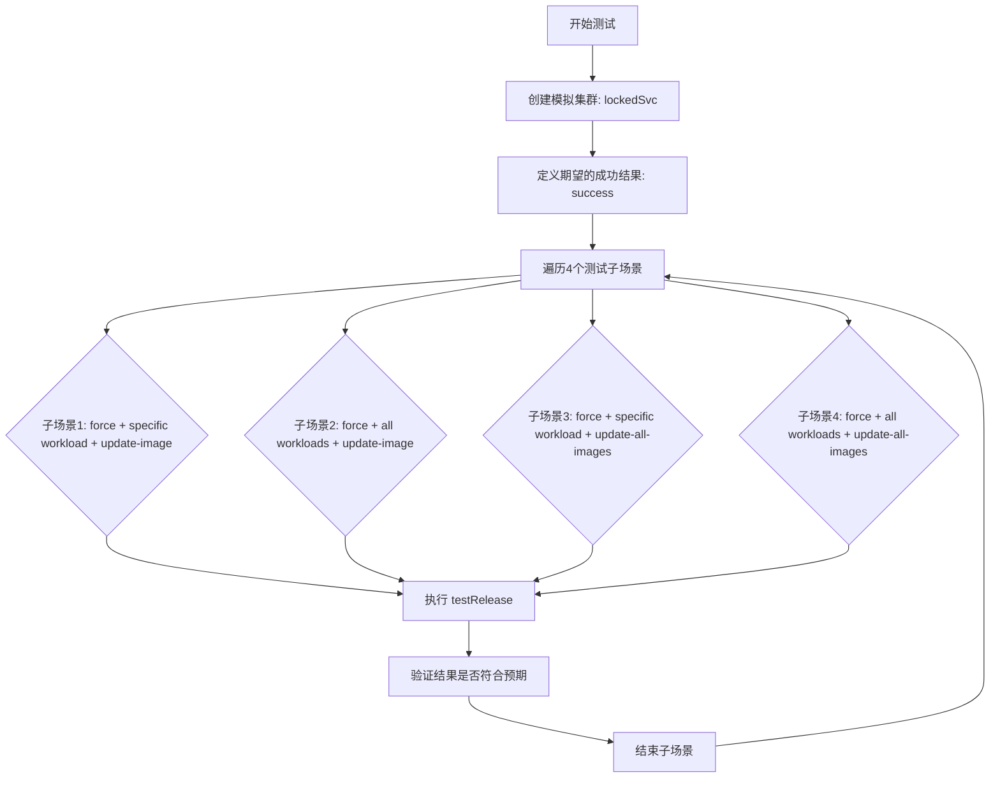

#### 带注释源码

```go
// Test_Force_lockedWorkload 测试强制更新被锁定的 workload 的场景
// 验证当 Force 标志为 true 时，系统是否正确处理锁定服务的更新
func Test_Force_lockedWorkload(t *testing.T) {
	// 创建一个只包含 lockedSvc 的模拟集群
	mCluster := mockCluster(lockedSvc)
	
	// 定义更新成功的期望结果
	// 预期状态为成功，且容器镜像从旧版本更新到新版本
	success := update.WorkloadResult{
		Status: update.ReleaseStatusSuccess,
		PerContainer: []update.ContainerUpdate{
			{
				Container: lockedContainer, // 容器名称
				Current:   oldLockedRef,    // 当前镜像引用
				Target:    newLockedRef,    // 目标镜像引用
			},
		},
	}
	
	// 定义4个测试子场景
	for _, tst := range []struct {
		Name     string                   // 测试名称
		Spec     update.ReleaseImageSpec // 发布规范
		Expected expected                 // 期望结果
	}{
		// 场景1: 强制更新特定服务的特定镜像
		// 期望: 忽略锁定，成功更新
		{
			Name: "force ignores service lock (--workload --update-image)",
			Spec: update.ReleaseImageSpec{
				ServiceSpecs: []update.ResourceSpec{lockedSvcSpec}, // 目标服务
				ImageSpec:    update.ImageSpecFromRef(newLockedRef), // 指定镜像
				Kind:         update.ReleaseKindExecute,
				Excludes:     []resource.ID{},
				Force:        true, // 强制更新，忽略锁定
			},
			Expected: expected{
				Specific: update.Result{
					resource.MustParseID("default:deployment/locked-service"): success,
				},
				Else: ignoredNotIncluded,
			},
		},
		// 场景2: 强制更新所有服务的特定镜像
		// 期望: 不忽略锁定，保持跳过状态
		{
			Name: "force does not ignore lock if updating all workloads (--all --update-image)",
			Spec: update.ReleaseImageSpec{
				ServiceSpecs: []update.ResourceSpec{update.ResourceSpecAll}, // 所有服务
				ImageSpec:    update.ImageSpecFromRef(newLockedRef),
				Kind:         update.ReleaseKindExecute,
				Excludes:     []resource.ID{},
				Force:        true,
			},
			Expected: expected{
				Specific: update.Result{
					resource.MustParseID("default:deployment/locked-service"): skippedLocked,
				},
				Else: skippedNotInCluster,
			},
		},
		// 场景3: 强制更新特定服务的最新镜像
		{
			Name: "force ignores service lock (--workload --update-all-images)",
			Spec: update.ReleaseImageSpec{
				ServiceSpecs: []update.ResourceSpec{lockedSvcSpec},
				ImageSpec:    update.ImageSpecLatest, // 最新镜像
				Kind:         update.ReleaseKindExecute,
				Excludes:     []resource.ID{},
				Force:        true,
			},
			Expected: expected{
				Specific: update.Result{
					resource.MustParseID("default:deployment/locked-service"): success,
				},
				Else: ignoredNotIncluded,
			},
		},
		// 场景4: 强制更新所有服务的最新镜像
		{
			Name: "force does not ignore lock if updating all workloads (--all --update-all-images)",
			Spec: update.ReleaseImageSpec{
				ServiceSpecs: []update.ResourceSpec{update.ResourceSpecAll},
				ImageSpec:    update.ImageSpecLatest,
				Kind:         update.ReleaseKindExecute,
				Excludes:     []resource.ID{},
				Force:        true,
			},
			Expected: expected{
				Specific: update.Result{
					resource.MustParseID("default:deployment/locked-service"): skippedLocked,
				},
				Else: skippedNotInCluster,
			},
		},
	} {
		// 使用 t.Run 为每个子场景创建命名的子测试
		t.Run(tst.Name, func(t *testing.T) {
			// 设置 git checkout 模拟
			checkout, cleanup := setup(t)
			defer cleanup()
			
			// 执行发布测试
			// 验证在 Force 模式下，系统对锁定服务的不同处理逻辑
			testRelease(t, &ReleaseContext{
				cluster:       mCluster,
				resourceStore: NewManifestStoreOrFail(t, mockManifests, checkout),
				registry:      mockRegistry,
			}, tst.Spec, tst.Expected.Result())
		})
	}
}
```


### `Test_Force_filteredContainer`

该测试函数用于验证在使用 `--force` 参数强制更新时，系统是否会忽略容器镜像的标签过滤规则（如 semver 过滤）。测试覆盖了四种场景：指定工作负载更新指定镜像、指定工作负载更新所有镜像、指定工作负载更新所有镜像（遵循 semver）、所有工作负载更新所有镜像（遵循 semver）。

参数：

- `t`：`*testing.T`，Go 标准测试框架的测试对象指针，用于报告测试失败和日志输出

返回值：无（`void`，测试函数不返回值）

#### 流程图

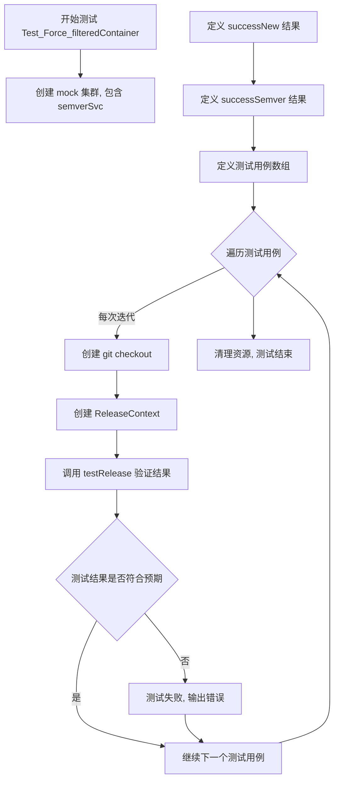

#### 带注释源码

```go
// Test_Force_filteredContainer 测试强制更新时忽略容器镜像标签过滤规则的行为
// 该测试验证当使用 --force 标志时，系统是否正确忽略镜像的 semver 标签过滤规则
func Test_Force_filteredContainer(t *testing.T) {
	// 创建一个包含 semverSvc 的 mock 集群
	// semverSvc 是一个配置了 semver 标签过滤规则的服务
	mCluster := mockCluster(semverSvc)
	
	// 定义成功更新到新镜像的结果（不遵循 semver 过滤）
	successNew := update.WorkloadResult{
		Status: update.ReleaseStatusSuccess,
		PerContainer: []update.ContainerUpdate{
			{
				Container: helloContainer,
				Current:   oldRef,
				Target:    newHwRef,
			},
		},
	}
	
	// 定义成功更新到 semver 镜像的结果（遵循 semver 过滤）
	successSemver := update.WorkloadResult{
		Status: update.ReleaseStatusSuccess,
		PerContainer: []update.ContainerUpdate{
			{
				Container: helloContainer,
				Current:   oldRef,
				Target:    semverHwRef,
			},
		},
	}
	
	// 定义四个测试用例，覆盖不同的 force 更新场景
	for _, tst := range []struct {
		Name     string
		Spec     update.ReleaseImageSpec
		Expected expected
	}{
		// 场景1: 使用 --workload --update-image 时，force 忽略容器标签模式
		{
			Name: "force ignores container tag pattern (--workload --update-image)",
			Spec: update.ReleaseImageSpec{
				ServiceSpecs: []update.ResourceSpec{semverSvcSpec},
				ImageSpec:    update.ImageSpecFromRef(newHwRef), // 不匹配过滤器的镜像
				Kind:         update.ReleaseKindExecute,
				Excludes:     []resource.ID{},
				Force:        true, // 强制更新，忽略标签过滤
			},
			Expected: expected{
				Specific: update.Result{
					resource.MustParseID("default:deployment/semver"): successNew,
				},
				Else: ignoredNotIncluded,
			},
		},
		// 场景2: 使用 --all --update-image 时，force 忽略容器标签模式
		{
			Name: "force ignores container tag pattern (--all --update-image)",
			Spec: update.ReleaseImageSpec{
				ServiceSpecs: []update.ResourceSpec{update.ResourceSpecAll},
				ImageSpec:    update.ImageSpecFromRef(newHwRef), // 不匹配过滤器的镜像
				Kind:         update.ReleaseKindExecute,
				Excludes:     []resource.ID{},
				Force:        true,
			},
			Expected: expected{
				Specific: update.Result{
					resource.MustParseID("default:deployment/semver"): successNew,
				},
				Else: skippedNotInCluster,
			},
		},
		// 场景3: 使用 --workload --update-all-image 时，force 遵守 semver 规则
		{
			Name: "force complies with semver when updating all images (--workload --update-all-image)",
			Spec: update.ReleaseImageSpec{
				ServiceSpecs: []update.ResourceSpec{semverSvcSpec},
				ImageSpec:    update.ImageSpecLatest, // 会按 semver 过滤并选择最新版本
				Kind:         update.ReleaseKindExecute,
				Excludes:     []resource.ID{},
				Force:        true,
			},
			Expected: expected{
				Specific: update.Result{
					resource.MustParseID("default:deployment/semver"): successSemver,
				},
				Else: ignoredNotIncluded,
			},
		},
		// 场景4: 使用 --all --update-all-image 时，force 遵守 semver 规则
		{
			Name: "force complies with semver when updating all images (--all --update-all-image)",
			Spec: update.ReleaseImageSpec{
				ServiceSpecs: []update.ResourceSpec{update.ResourceSpecAll},
				ImageSpec:    update.ImageSpecLatest,
				Kind:         update.ReleaseKindExecute,
				Excludes:     []resource.ID{},
				Force:        true,
			},
			Expected: expected{
				Specific: update.Result{
					resource.MustParseID("default:deployment/semver"): successSemver,
				},
				Else: skippedNotInCluster,
			},
		},
	} {
		// 使用 t.Run 为每个子测试创建命名的子测试
		t.Run(tst.Name, func(t *testing.T) {
			// 设置 git 仓库检出
			checkout, cleanup := setup(t)
			defer cleanup()
			
			// 创建发布上下文，包含集群、清单存储和注册表
			testRelease(t, &ReleaseContext{
				cluster:       mCluster,
				resourceStore: NewManifestStoreOrFail(t, mockManifests, checkout),
				registry:      mockRegistry,
			}, tst.Spec, tst.Expected.Result())
		})
	}
}
```


### `Test_ImageStatus`

测试镜像状态检测功能，验证两种场景：(1) 镜像未找到时返回 `DoesNotUseImage` 错误；(2) 镜像已是最新时返回 `ImageUpToDate` 状态。

参数：

- `t *testing.T`：Go 测试框架的标准测试参数，用于报告测试失败和记录测试步骤

返回值：无（Go 测试函数无返回值）

#### 流程图

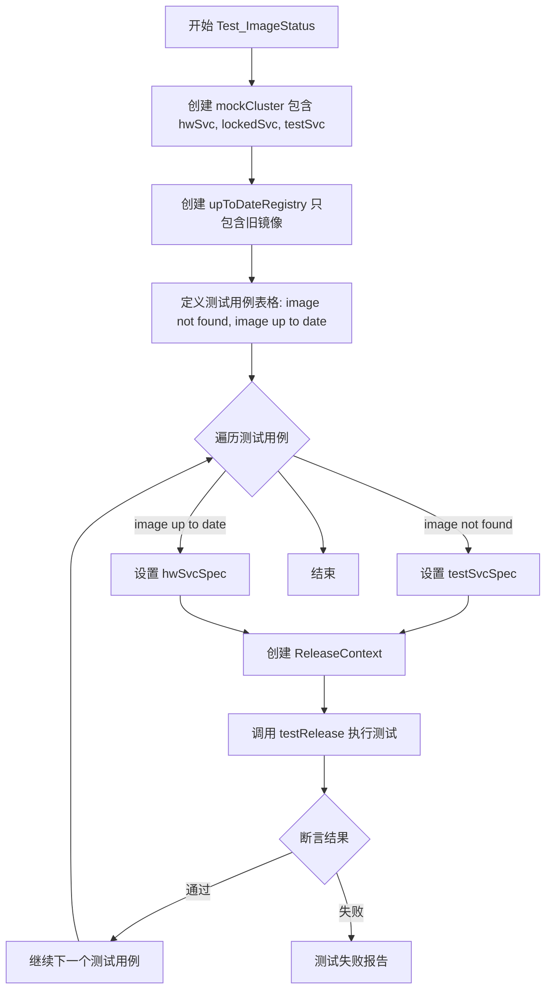

#### 带注释源码

```go
// Test_ImageStatus 测试镜像状态检测的两个场景：
// 1. 镜像未找到 - 资源使用镜像不存在
// 2. 镜像已是最新 - 镜像无需更新
func Test_ImageStatus(t *testing.T) {
	// 创建包含三个工作负载的 mock 集群：hwSvc, lockedSvc, testSvc
	mCluster := mockCluster(hwSvc, lockedSvc, testSvc)
	
	// 创建一个只包含旧镜像的注册表（模拟已是最新状态）
	// 注意：这个注册表只有 oldRef 和 sidecarRef，没有新镜像
	upToDateRegistry := &registryMock.Registry{
		Images: []image.Info{
			{
				ID:        oldRef,        // 旧版本的 hello 镜像
				CreatedAt: timeNow,       // 创建时间为当前
			},
			{
				ID:        sidecarRef,    // 旧版本的 sidecar 镜像
				CreatedAt: timeNow,
			},
		},
	}

	// 解析 testSvc 的资源规格
	testSvcSpec, _ := update.ParseResourceSpec(testSvc.ID.String())
	
	// 定义测试用例表格
	for _, tst := range []struct {
		Name     string                  // 测试用例名称
		Spec     update.ReleaseImageSpec // 发布镜像规格
		Expected expected                // 期望结果
	}{
		{
			// 场景1：镜像未找到
			// test-service 使用的镜像是 testServiceRef，不在 upToDateRegistry 中
			Name: "image not found",
			Spec: update.ReleaseImageSpec{
				ServiceSpecs: []update.ResourceSpec{testSvcSpec}, // 只发布 test-service
				ImageSpec:    update.ImageSpecLatest,              // 使用最新镜像
				Kind:         update.ReleaseKindExecute,
				Excludes:     []resource.ID{},
			},
			Expected: expected{
				// 期望结果：test-service 状态为 Ignored，错误为 DoesNotUseImage
				Specific: update.Result{
					resource.MustParseID("default:deployment/test-service"): update.WorkloadResult{
						Status: update.ReleaseStatusIgnored,
						Error:  update.DoesNotUseImage,
					},
				},
				Else: ignoredNotIncluded, // 其他工作负载默认被忽略
			},
		}, {
			// 场景2：镜像已是最新
			// helloworld 使用的镜像是 oldRef，upToDateRegistry 也只有 oldRef
			// 所以无需更新
			Name: "image up to date",
			Spec: update.ReleaseImageSpec{
				ServiceSpecs: []update.ResourceSpec{hwSvcSpec}, // 只发布 helloworld
				ImageSpec:    update.ImageSpecLatest,
				Kind:         update.ReleaseKindExecute,
				Excludes:     []resource.ID{},
			},
			Expected: expected{
				// 期望结果：helloworld 状态为 Skipped，错误为 ImageUpToDate
				Specific: update.Result{
					resource.MustParseID("default:deployment/helloworld"): update.WorkloadResult{
						Status: update.ReleaseStatusSkipped,
						Error:  update.ImageUpToDate,
					},
				},
				Else: ignoredNotIncluded,
			},
		},
	} {
		// 使用 t.Run 为每个测试用例创建子测试
		t.Run(tst.Name, func(t *testing.T) {
			// 设置 git checkout
			checkout, cleanup := setup(t)
			defer cleanup()
			
			// 创建 ReleaseContext：
			// - cluster: mock 集群（包含所有工作负载）
			// - resourceStore: manifest 存储
			// - registry: upToDateRegistry（只有旧镜像，模拟已是最新）
			rc := &ReleaseContext{
				cluster:       mCluster,
				resourceStore: NewManifestStoreOrFail(t, mockManifests, checkout),
				registry:      upToDateRegistry,
			}
			
			// 执行测试：调用 Release 函数并验证结果
			testRelease(t, rc, tst.Spec, tst.Expected.Result())
		})
	}
}
```


### `Test_UpdateMultidoc`

测试多文档（multi-document）YAML文件的更新功能，验证在Kubernetes资源清单中存在多个YAML文档时，能够正确更新指定工作负载的容器镜像。

参数：

- `t`：`testing.T`，Go语言标准测试框架的测试实例指针，用于报告测试失败和日志输出

返回值：无（`testing.T`函数的签名要求）

#### 流程图

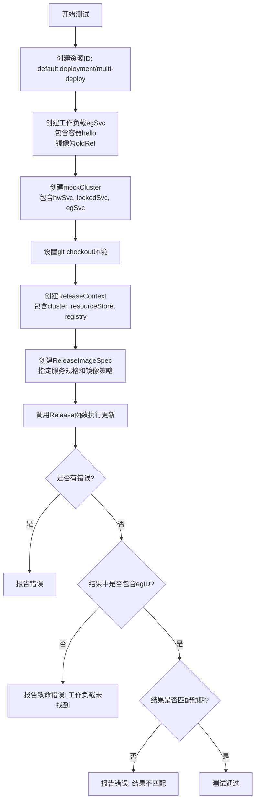

#### 带注释源码

```go
// Test_UpdateMultidoc 测试多文档YAML文件的更新功能
// 该测试验证当Kubernetes资源清单包含多个YAML文档时，
// 能够正确识别和更新指定工作负载的容器镜像
func Test_UpdateMultidoc(t *testing.T) {
	// 1. 创建要测试的工作负载资源ID
	// 格式: namespace:kind/name
	egID := resource.MustParseID("default:deployment/multi-deploy")
	
	// 2. 创建工作负载对象，包含容器信息
	// 该工作负载模拟集群中运行的多文档部署
	egSvc := cluster.Workload{
		ID: egID,
		Containers: cluster.ContainersOrExcuse{
			Containers: []resource.Container{
				{
					Name:  "hello",           // 容器名称
					Image: oldRef,            // 当前使用的镜像引用
				},
			},
		},
	}

	// 3. 创建mock集群客户端
	// 模拟包含三个工作负载的集群状态:
	// - hwSvc: helloworld服务
	// - lockedSvc: 锁定状态的服务
	// - egSvc: 要测试的多文档服务
	mCluster := mockCluster(hwSvc, lockedSvc, egSvc)
	
	// 4. 设置git仓库checkout环境
	// 用于模拟Git仓库中的资源清单文件
	checkout, cleanup := setup(t)
	defer cleanup() // 确保测试结束后清理资源
	
	// 5. 创建发布上下文ReleaseContext
	// 包含执行发布所需的所有依赖组件
	rc := &ReleaseContext{
		cluster:       mCluster,                              // 集群客户端
		resourceStore: NewManifestStoreOrFail(t, mockManifests, checkout), // 资源清单存储
		registry:      mockRegistry,                           // 镜像仓库客户端
	}
	
	// 6. 构建发布规范
	// 指定要更新的目标服务、镜像策略和发布类型
	spec := update.ReleaseImageSpec{
		ServiceSpecs: []update.ResourceSpec{"default:deployment/multi-deploy"}, // 目标服务规格
		ImageSpec:    update.ImageSpecLatest,                                   // 使用最新镜像
		Kind:         update.ReleaseKindExecute,                                 // 执行型发布
	}
	
	// 7. 执行发布操作
	// 调用Release函数进行实际的镜像更新
	results, err := Release(context.Background(), rc, spec, log.NewNopLogger())
	if err != nil {
		t.Error(err) // 如果发布过程出错，记录错误但继续执行
	}
	
	// 8. 验证结果
	// 检查指定工作负载的更新结果是否存在
	workloadResult, ok := results[egID]
	if !ok {
		t.Fatal("workload not found after update") // 工作负载未找到则终止测试
	}
	
	// 9. 深度比较预期结果与实际结果
	// 验证容器镜像是否正确更新为目标镜像
	if !reflect.DeepEqual(update.WorkloadResult{
		Status: update.ReleaseStatusSuccess, // 更新成功状态
		PerContainer: []update.ContainerUpdate{{
			Container: "hello",   // 容器名称
			Current:   oldRef,    // 更新前的镜像
			Target:    newHwRef,  // 更新后的镜像
		}},
	}, workloadResult) {
		// 结果不匹配时输出详细的错误信息
		t.Errorf("did not get expected workload result (see test code), got %#v", workloadResult)
	}
}
```


### `Test_UpdateList`

该测试函数用于测试资源列表（List kind）的更新，验证Flux能够正确处理和更新Kubernetes的List类型资源。

参数：

- `t`：`testing.T`，Go标准测试框架的测试实例指针，用于报告测试失败和日志输出

返回值：无（Go测试函数签名）

#### 流程图

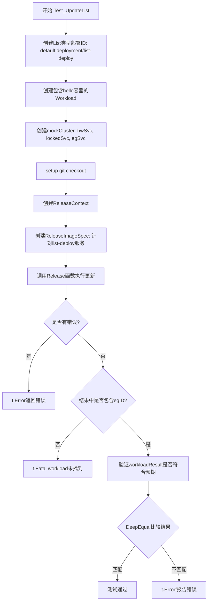

#### 带注释源码

```go
// Test_UpdateList 测试资源列表（List kind）的更新功能
// 验证Flux能够正确更新Kubernetes List类型的资源
func Test_UpdateList(t *testing.T) {
	// 1. 创建List类型部署的资源ID
	egID := resource.MustParseID("default:deployment/list-deploy")
	
	// 2. 创建测试用的Workload，包含一个hello容器，使用旧镜像
	egSvc := cluster.Workload{
		ID: egID,
		Containers: cluster.ContainersOrExcuse{
			Containers: []resource.Container{
				{
					Name:  "hello",
					Image: oldRef, // 使用预定义的旧镜像引用
				},
			},
		},
	}

	// 3. 创建mock集群，包含hwSvc、lockedSvc和egSvc三个工作负载
	// 注意：testSvc不在集群中，但在代码仓库中存在
	mCluster := mockCluster(hwSvc, lockedSvc, egSvc)
	
	// 4. 设置git仓库checkout，用于读取集群资源定义
	checkout, cleanup := setup(t)
	defer cleanup() // 确保测试后清理资源
	
	// 5. 创建ReleaseContext，包含集群客户端、资源存储和注册表
	rc := &ReleaseContext{
		cluster:       mCluster,
		resourceStore: NewManifestStoreOrFail(t, mockManifests, checkout),
		registry:      mockRegistry,
	}
	
	// 6. 创建发布镜像规范，指定要更新的服务和镜像
	spec := update.ReleaseImageSpec{
		ServiceSpecs: []update.ResourceSpec{"default:deployment/list-deploy"}, // 指定List类型部署
		ImageSpec:    update.ImageSpecLatest,                                   // 使用最新镜像
		Kind:         update.ReleaseKindExecute,                                 // 执行发布
	}
	
	// 7. 调用Release函数执行实际的镜像更新
	results, err := Release(context.Background(), rc, spec, log.NewNopLogger())
	
	// 8. 检查是否发生错误
	if err != nil {
		t.Error(err)
	}
	
	// 9. 从结果中获取指定工作负载的更新结果
	workloadResult, ok := results[egID]
	
	// 10. 验证工作负载是否存在于结果中
	if !ok {
		t.Fatal("workload not found after update")
	}
	
	// 11. 使用DeepEqual验证结果是否符合预期
	// 预期：更新成功，容器镜像从旧版本更新到新版本
	if !reflect.DeepEqual(update.WorkloadResult{
		Status: update.ReleaseStatusSuccess,
		PerContainer: []update.ContainerUpdate{{
			Container: "hello",
			Current:   oldRef,
			Target:    newHwRef, // 预期更新到新镜像
		}},
	}, workloadResult) {
		// 12. 如果结果不匹配，报告测试失败
		t.Errorf("did not get expected workload result (see test code), got %#v", workloadResult)
	}
}
```


### `Test_UpdateContainers`

该测试函数验证直接更新容器列表的详细逻辑，涵盖多个边界情况，包括多容器更新、容器标签不匹配、容器未找到、无变化、锁定工作负载以及强制更新锁定工作负载等场景。

参数：
- `t`：`*testing.T`，Go 测试框架的测试实例指针，用于报告测试状态和错误

返回值：无（`void`），Go 测试函数不返回值，通过 `t` 参数报告测试结果

#### 流程图

```mermaid
flowchart TD
    A[开始 Test_UpdateContainers] --> B[创建 mockCluster 包含 hwSvc 和 lockedSvc]
    B --> C[设置 Git checkout 和 ReleaseContext]
    C --> D{遍历测试用例表}
    D --> E[提取测试用例信息: 名称/工作负载ID/容器更新规范/Force标志]
    E --> F{遍历 SkipMismatches (true/false)}
    F --> G[构建 ReleaseContainersSpec]
    G --> H[调用 Release 函数执行更新]
    H --> I{检查错误是否匹配预期}
    I -->|是| J{检查预期结果是否为空}
    J -->|否| K[验证结果和提交信息]
    J -->|是| L[继续下一个测试用例]
    I -->|否| M[报告测试失败]
    K --> L
    F --> N[下一个 SkipMismatches 值]
    D --> O[结束测试]
```

#### 带注释源码

```go
// Test_UpdateContainers 测试直接更新容器列表的详细逻辑
// 包含 Tag 不匹配、容器未找到等边界情况
func Test_UpdateContainers(t *testing.T) {
    // 1. 创建 mock 集群，包含两个工作负载：hwSvc (helloworld) 和 lockedSvc (locked-service)
    mCluster := mockCluster(hwSvc, lockedSvc)
    
    // 2. 设置 Git 仓库 checkout，用于读取和修改配置文件
    checkout, cleanup := setup(t)
    defer cleanup() // 确保测试结束后清理资源
    
    // 3. 准备测试上下文和 ReleaseContext
    ctx := context.Background()
    rc := &ReleaseContext{
        cluster:       mCluster,
        resourceStore: NewManifestStoreOrFail(t, mockManifests, checkout),
        registry:      mockRegistry,
    }
    
    // 4. 定义内部结构体 expected，用于封装测试预期结果
    type expected struct {
        Err    error           // 预期返回的错误
        Result update.WorkloadResult // 预期的工作负载更新结果
        Commit string          // 预期的提交信息
    }
    
    // 5. 定义测试用例表，涵盖多种场景
    for _, tst := range []struct {
        Name       string                           // 测试用例名称
        WorkloadID resource.ID                      // 要更新的工作负载 ID
        Spec       []update.ContainerUpdate         // 容器更新规范列表
        Force      bool                             // 是否强制更新锁定的工作负载

        SkipMismatches map[bool]expected // Key: 是否跳过不匹配, Value: 预期结果
    }{
        // 测试用例 1: 多容器更新
        {
            Name:       "multiple containers",
            WorkloadID: hwSvcID,
            Spec: []update.ContainerUpdate{
                {
                    Container: helloContainer,
                    Current:   oldRef,
                    Target:    newHwRef,
                },
                {
                    Container: sidecarContainer,
                    Current:   sidecarRef,
                    Target:    newSidecarRef,
                },
            },
            SkipMismatches: map[bool]expected{
                true: {
                    Result: update.WorkloadResult{
                        Status: update.ReleaseStatusSuccess,
                        PerContainer: []update.ContainerUpdate{{
                            Container: helloContainer,
                            Current:   oldRef,
                            Target:    newHwRef,
                        }, {
                            Container: sidecarContainer,
                            Current:   sidecarRef,
                            Target:    newSidecarRef,
                        }},
                    },
                    Commit: "Update image refs in default:deployment/helloworld\n\ndefault:deployment/helloworld\n- quay.io/weaveworks/helloworld:master-a000002\n- weaveworks/sidecar:master-a000002\n",
                },
                false: {
                    Result: update.WorkloadResult{
                        Status: update.ReleaseStatusSuccess,
                        PerContainer: []update.ContainerUpdate{{
                            Container: helloContainer,
                            Current:   oldRef,
                            Target:    newHwRef,
                        }, {
                            Container: sidecarContainer,
                            Current:   sidecarRef,
                            Target:    newSidecarRef,
                        }},
                    },
                    Commit: "Update image refs in default:deployment/helloworld\n\ndefault:deployment/helloworld\n- quay.io/weaveworks/helloworld:master-a000002\n- weaveworks/sidecar:master-a000002\n",
                },
            },
        },
        
        // 测试用例 2: 容器标签不匹配
        // 当前镜像与规范中指定的镜像不一致
        {
            Name:       "container tag mismatch",
            WorkloadID: hwSvcID,
            Spec: []update.ContainerUpdate{
                {
                    Container: helloContainer,
                    Current:   newHwRef, // 故意设置为不匹配的值
                    Target:    oldRef,
                },
                {
                    Container: sidecarContainer,
                    Current:   sidecarRef,
                    Target:    newSidecarRef,
                },
            },
            SkipMismatches: map[bool]expected{
                true: {
                    // SkipMismatches=true 时，跳过不匹配的容器，只更新其他容器
                    Result: update.WorkloadResult{
                        Status: update.ReleaseStatusSuccess,
                        Error:  fmt.Sprintf(update.ContainerTagMismatch, helloContainer),
                        PerContainer: []update.ContainerUpdate{
                            {
                                Container: sidecarContainer,
                                Current:   sidecarRef,
                                Target:    newSidecarRef,
                            },
                        },
                    },
                    Commit: "Update image refs in default:deployment/helloworld\n\ndefault:deployment/helloworld\n- weaveworks/sidecar:master-a000002\n",
                },
                false: {
                    // SkipMismatches=false 时，任何不匹配都会导致错误
                    Err: errors.New("cannot satisfy specs"),
                },
            },
        },
        
        // 测试用例 3: 容器未找到
        // 尝试更新一个不存在于工作负载中的容器
        {
            Name:       "container not found",
            WorkloadID: hwSvcID,
            Spec: []update.ContainerUpdate{
                {
                    Container: helloContainer,
                    Current:   oldRef,
                    Target:    newHwRef,
                },
                {
                    Container: "foo", // 不存在的容器
                    Current:   oldRef,
                    Target:    newHwRef,
                },
            },
            SkipMismatches: map[bool]expected{
                true:  {Err: errors.New("cannot satisfy specs")},
                false: {Err: errors.New("cannot satisfy specs")},
            },
        },
        
        // 测试用例 4: 无变化
        // 目标镜像与当前镜像相同
        {
            Name:       "no changes",
            WorkloadID: hwSvcID,
            Spec: []update.ContainerUpdate{
                {
                    Container: helloContainer,
                    Current:   oldRef,
                    Target:    oldRef, // 目标与当前相同
                },
            },
            SkipMismatches: map[bool]expected{
                true:  {Err: errors.New("no changes found")},
                false: {Err: errors.New("no changes found")},
            },
        },
        
        // 测试用例 5: 锁定的工作负载
        // 尝试更新被锁定的服务，不允许更新
        {
            Name:       "locked workload",
            WorkloadID: lockedSvcID,
            Spec: []update.ContainerUpdate{
                {
                    Container: lockedContainer,
                    Current:   oldLockedRef,
                    Target:    newLockedRef,
                },
            },
            SkipMismatches: map[bool]expected{
                true:  {Err: errors.New("no changes found")},
                false: {Err: errors.New("no changes found")},
            },
        },
        
        // 测试用例 6: 强制更新锁定的工作负载
        // 使用 --force 标志绕过锁定检查
        {
            Name:       "locked workload with --force",
            WorkloadID: lockedSvcID,
            Force:      true, // 启用强制更新
            Spec: []update.ContainerUpdate{
                {
                    Container: lockedContainer,
                    Current:   oldLockedRef,
                    Target:    newLockedRef,
                },
            },
            SkipMismatches: map[bool]expected{
                true: {
                    Result: update.WorkloadResult{
                        Status: update.ReleaseStatusSuccess,
                        PerContainer: []update.ContainerUpdate{
                            {
                                Container: lockedContainer,
                                Current:   oldLockedRef,
                                Target:    newLockedRef,
                            },
                        },
                    },
                    Commit: "Update image refs in default:deployment/locked-service\n\ndefault:deployment/locked-service\n- quay.io/weaveworks/locked-service:2\n",
                },
                false: {
                    Result: update.WorkloadResult{
                        Status: update.ReleaseStatusSuccess,
                        PerContainer: []update.ContainerUpdate{
                            {
                                Container: lockedContainer,
                                Current:   oldLockedRef,
                                Target:    newLockedRef,
                            },
                        },
                    },
                    Commit: "Update image refs in default:deployment/locked-service\n\ndefault:deployment/locked-service\n- quay.io/weaveworks/locked-service:2\n",
                },
            },
        },
    } {
        // 6. 构建 ReleaseContainersSpec
        specs := update.ReleaseContainersSpec{
            ContainerSpecs: map[resource.ID][]update.ContainerUpdate{tst.WorkloadID: tst.Spec},
            Kind:           update.ReleaseKindExecute,
        }

        // 7. 遍历 SkipMismatches 的两个值 (true/false)
        for ignoreMismatches, expected := range tst.SkipMismatches {
            // 构建测试名称，区分是否跳过不匹配
            name := tst.Name
            if ignoreMismatches {
                name += " (SkipMismatches)"
            }
            
            // 8. 运行测试子用例
            t.Run(name, func(t *testing.T) {
                specs.SkipMismatches = ignoreMismatches
                specs.Force = tst.Force

                // 9. 调用 Release 函数执行容器更新
                results, err := Release(ctx, rc, specs, log.NewNopLogger())

                // 10. 验证错误是否匹配预期
                assert.Equal(t, expected.Err, err)
                
                // 11. 如果没有预期错误，进一步验证结果和提交信息
                if expected.Err == nil {
                    assert.Equal(t, expected.Result, results[tst.WorkloadID])
                    assert.Equal(t, expected.Commit, specs.CommitMessage(results))
                }
            })
        }
    }
}
```


### `testRelease`

执行 Release 并断言结果是否符合预期

参数：

- `t`：`*testing.T`，Go测试框架的测试对象，用于执行断言
- `rc`：`*ReleaseContext`，发布上下文，包含集群客户端、资源存储和镜像注册表
- `spec`：`update.ReleaseImageSpec`，发布镜像的规格说明，包含服务规格、镜像规格、发布类型等
- `expected`：`update.Result`，预期的发布结果，包含每个工作负载的结果映射

返回值：无显式返回值（`void`），通过 `*testing.T` 的断言方法报告错误

#### 流程图

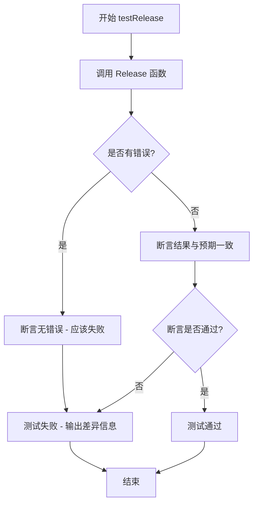

#### 带注释源码

```go
// testRelease 是一个测试辅助函数，用于执行 Release 并断言结果是否符合预期
// 参数:
//   - t: *testing.T - Go测试框架的测试对象
//   - rc: *ReleaseContext - 发布上下文，包含集群、资源存储和注册表
//   - spec: update.ReleaseImageSpec - 发布镜像的规格说明
//   - expected: update.Result - 预期的发布结果
func testRelease(t *testing.T, rc *ReleaseContext, spec update.ReleaseImageSpec, expected update.Result) {
	// 调用 Release 函数执行实际的发布操作
	// 参数: context.Background() - 背景上下文
	//       rc - 发布上下文
	//       spec - 发布规格
	//       log.NewNopLogger() - 无操作日志记录器（丢弃日志）
	results, err := Release(context.Background(), rc, spec, log.NewNopLogger())
	
	// 断言 Release 执行过程中没有发生错误
	assert.NoError(t, err)
	
	// 断言实际结果与预期结果完全一致
	assert.Equal(t, expected, results)
}
```

#### 说明

该函数是 Flux 项目中发布功能的核心测试辅助函数，主要功能包括：

1. **执行发布操作**：调用 `Release` 函数根据提供的规格说明执行镜像发布
2. **错误验证**：使用 `assert.NoError` 验证发布过程无错误
3. **结果验证**：使用 `assert.Equal` 验证实际发布的结果与预期结果完全匹配

该函数被多个测试用例（如 `Test_InitContainer`、`Test_FilterLogic`、`Test_Force_lockedWorkload` 等）复用，用于验证不同场景下 Release 功能的正确性。


### `Test_BadRelease`

测试使用错误的 Manifests 实现时是否能通过校验并返回错误，验证错误实现的 manifests 会导致发布失败。

参数：

- `t`：`testing.T`，Go测试框架中的测试指针，用于报告测试失败

返回值：无返回值（Go测试函数）

#### 流程图

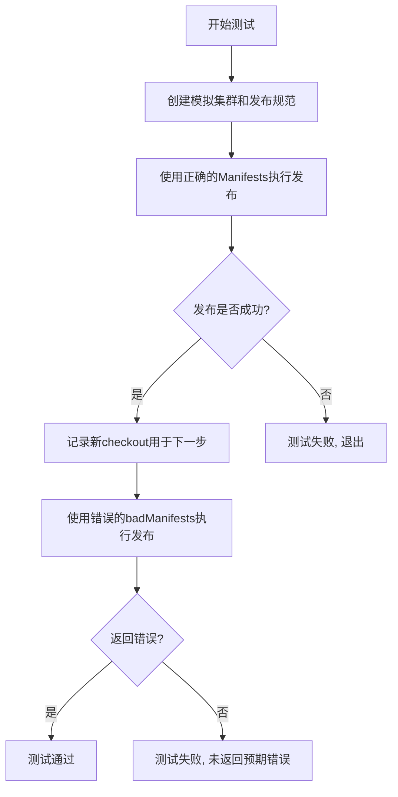

#### 带注释源码

```go
// Test_BadRelease 测试使用错误的 Manifests 实现时是否能通过校验并返回错误
func Test_BadRelease(t *testing.T) {
	// 创建模拟集群，只包含 hwSvc 工作负载
	mCluster := mockCluster(hwSvc)
	
	// 定义发布规范：更新所有工作负载到 newHwRef 镜像
	spec := update.ReleaseImageSpec{
		ServiceSpecs: []update.ResourceSpec{update.ResourceSpecAll},
		ImageSpec:    update.ImageSpecFromRef(newHwRef),
		Kind:         update.ReleaseKindExecute,
		Excludes:     []resource.ID{},
	}
	
	// 第一次测试：使用正确的 manifests
	checkout1, cleanup1 := setup(t)
	defer cleanup1()

	// 创建正确的 manifests 实例
	manifests := kubernetes.NewManifests(kubernetes.ConstNamespacer("default"), log.NewLogfmtLogger(os.Stdout))
	ctx := context.Background()
	
	// 构建发布上下文
	rc := &ReleaseContext{
		cluster:       mCluster,
		resourceStore: NewManifestStoreOrFail(t, manifests, checkout1),
		registry:      mockRegistry,
	}
	
	// 执行发布，应该成功
	_, err := Release(ctx, rc, spec, log.NewNopLogger())
	if err != nil {
		t.Fatal("release with 'good' manifests should succeed, but errored:", err)
	}

	// 第二次测试：使用错误的 manifests (badManifests)
	checkout2, cleanup2 := setup(t)
	defer cleanup2()

	// 使用错误的 manifests 实现替换
	rc = &ReleaseContext{
		cluster:       mCluster,
		resourceStore: NewManifestStoreOrFail(t, &badManifests{manifests}, checkout2),
		registry:      mockRegistry,
	}
	
	// 执行发布，应该返回错误（验证失败）
	_, err = Release(ctx, rc, spec, log.NewNopLogger())
	if err == nil {
		t.Fatal("did not return an error, but was expected to fail verification")
	}
}
```

### `badManifests` 类型

一个错误的 Manifests 实现，用于测试验证失败场景。

#### 源码

```go
// badManifests 是一个错误的 manifests 实现，其 SetWorkloadContainerImage 方法
// 不做任何实际的镜像更新，因此会导致验证失败
type badManifests struct {
	manifests.Manifests
}

// SetWorkloadContainerImage 错误实现：直接返回原定义，不做任何修改
// 这会导致发布时的镜像校验失败，因为预期镜像没有实际更新到定义中
func (m *badManifests) SetWorkloadContainerImage(def []byte, id resource.ID, container string, image image.Ref) ([]byte, error) {
	return def, nil
}
```


### `expected.Result`

该方法用于合并 `Specific`（显式指定的工作负载结果）和 `Else`（未显式指定的工作负载的默认结果），生成完整的期望结果集。在测试中用于构建预期的发布结果，以便与实际发布结果进行比较验证。

参数：
- 该方法为值接收者方法，无显式参数。使用接收者 `x expected` 访问结构体字段。

返回值：`update.Result`，返回合并后的完整结果映射，键为 `resource.ID`，值为 `update.WorkloadResult`。

#### 流程图

```mermaid
flowchart TD
    A[开始: 调用 x.Result()] --> B[result = x.Specific]
    B --> C[遍历 gittest.Workloads 所有工作负载ID]
    C --> D{当前ID是否在result中?}
    D -->|是| E[跳过, 不做任何处理]
    D -->|否| F[result[id] = x.Else]
    E --> G{是否还有更多ID?}
    F --> G
    G -->|是| C
    G -->|否| H[返回result]
```

#### 带注释源码

```go
// Result returns the expected result taking into account what is
// specified with Specific and what is elided with Else
func (x expected) Result() update.Result {
    // 1. 从 Specific（显式指定的结果）开始构建结果集
	result := x.Specific
    
    // 2. 遍历所有已知的工作负载ID（来自测试数据）
	for _, id := range gittest.Workloads() {
        // 3. 对于未在 Specific 中显式指定的工作负载
		if _, ok := result[id]; !ok {
            // 4. 使用 Else（默认结果）填充
			result[id] = x.Else
		}
	}
    // 5. 返回完整的期望结果集
	return result
}
```


### `badManifests.SetWorkloadContainerImage`

该方法是一个错误实现，总是返回原始的 manifest 定义而不做任何修改，用于测试校验逻辑能否检测到无效的 manifest 更新。

参数：

- `def`：`[]byte`，原始的 manifest 定义字节数组
- `id`：`resource.ID`，资源的唯一标识符
- `container`：`string`，要更新镜像的容器名称
- `image`：`image.Ref`，新的镜像引用

返回值：`([]byte, error)`，返回原始的 manifest 定义字节数组和 nil 错误（模拟了一个不做任何修改的错误实现）

#### 流程图

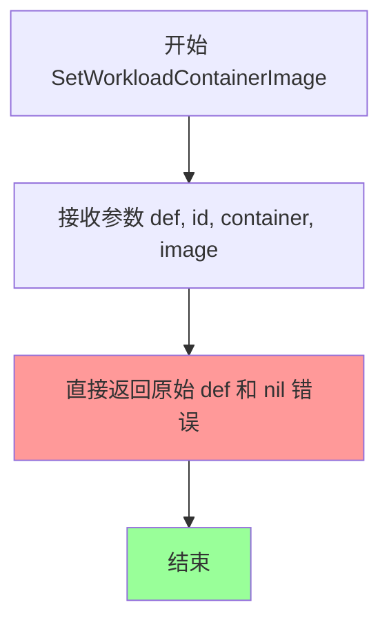

#### 带注释源码

```go
// SetWorkloadContainerImage 是 badManifests 结构体的方法
// 它实现了 manifests.Manifests 接口的 SetWorkloadContainerImage 方法
// 该实现是一个错误的模拟：它总是返回原始的 manifest 定义，不做任何修改
// 设计目的是用于测试校验逻辑是否能检测到无效的 manifest 更新
func (m *badManifests) SetWorkloadContainerImage(def []byte, id resource.ID, container string, image image.Ref) ([]byte, error) {
    // 直接返回原始的 def 字节数组，不做任何修改
    // 正确实现应该根据 id、container 和 image 参数修改 def 中的镜像引用
    return def, nil
}
```

## 关键组件


### ReleaseContext

发布上下文，包含集群客户端、资源清单存储和镜像注册表，用于协调整个发布流程。

### Release 函数

核心发布逻辑函数，接收发布规范（ReleaseImageSpec 或 ReleaseContainersSpec），遍历目标工作负载，计算容器镜像更新，验证并提交清单变更。

### 镜像过滤与选择策略

支持 `ImageSpecLatest`（最新镜像）、`ImageSpecFromRef`（指定镜像）以及 semver 版本匹配，用于确定每个容器的目标镜像。

### 工作负载过滤与排除

通过 ServiceSpecs 和 Excludes 列表控制哪些工作负载参与更新，支持 "all" 通配符和特定资源 ID 指定。

### 容器镜像不匹配处理

当集群中容器的当前镜像与预期不符时，根据 SkipMismatches 标志决定是跳过该容器还是返回错误。

### 锁定工作负载机制

通过 Locked 状态阻止工作负载自动更新，支持 Force 标志覆盖锁定，但仅限单工作负载指定时有效。

### 多文档资源处理

支持更新 Kubernetes 多文档 YAML 文件（multidoc）和资源列表（list），正确识别和修改每个文档中的镜像引用。

### 镜像版本比较

使用 semver 语义版本比较和创建时间判断镜像新旧，支持 "latest" 标签的特殊处理。

### 清单验证与回滚

通过 Manifests 接口的 SetWorkloadContainerImage 方法更新清单，验证更新后的资源能否正确反映镜像变更。

## 问题及建议


### 已知问题

- **全局变量污染风险**：大量测试数据定义为全局变量（如 `hwSvc`, `lockedSvc`, `mockRegistry` 等），可能导致测试之间的隐式依赖和状态污染
- **错误忽略**：多处使用 `_, _ = image.ParseRef(...)` 和 `_, _ = update.ParseResourceSpec(...)` 忽略错误处理，隐藏潜在的运行时问题
- **测试文件过大**：单一测试文件超过 1000 行，包含多个测试函数和大量重复模式，影响可维护性
- **重复代码模式**：`ReleaseContext` 创建逻辑在多个测试中重复出现，`mockCluster` 包装逻辑也多次重复
- **缺少资源清理验证**：`defer cleanup()` 调用后未检查清理是否成功，可能导致资源泄漏被忽略
- **硬编码测试数据**：镜像标签、容器名称等测试数据硬编码在代码中，缺乏统一管理

### 优化建议

- 将全局变量改为测试辅助函数或 `setup()` 函数返回的局部变量，确保测试隔离
- 对所有 `ParseRef` 和 `ParseResourceSpec` 调用进行错误检查，或使用 `MustParseRef`/`MustParseResourceSpec` 明确表明不可失败
- 将测试文件拆分为多个文件，按功能（如 InitContainer 测试、FilterLogic 测试、Force 测试等）分类
- 提取 `NewReleaseContext` 辅助函数，减少 `ReleaseContext` 创建的重复代码
- 为每个测试添加资源清理验证，确保 `cleanup()` 执行成功
- 考虑使用测试表驱动模式统一管理测试数据和预期结果，进一步减少代码冗余

## 其它


### 设计目标与约束

本代码的设计目标是验证Flux CD系统中容器镜像发布（Release）功能的正确性，包括：
1. 支持对指定服务或所有服务进行镜像更新
2. 支持强制更新被锁定的workload
3. 支持容器标签过滤和semver版本匹配
4. 支持多文档和列表形式的Kubernetes资源更新
5. 正确处理镜像已存在、镜像不存在、镜像过时等边界情况

约束条件：
- 仅支持Kubernetes集群环境
- 依赖Git仓库存储Manifest配置
- 依赖Registry存储镜像元数据
- 测试必须在有Git环境的机器上运行

### 错误处理与异常设计

代码中的错误处理主要体现在以下几个方面：
1. **WorkloadResult状态机**：通过`ReleaseStatusIgnored`、`ReleaseStatusSkipped`、`ReleaseStatusSuccess`等状态区分不同处理结果
2. **错误类型**：
   - `update.NotIncluded`：未包含在发布范围内
   - `update.NotInRepo`：不在Git仓库中
   - `update.NotAccessibleInCluster`：集群中不可访问
   - `update.Locked`：workload被锁定
   - `update.DifferentImage`：镜像不匹配
   - `update.DoesNotUseImage`：不使用指定镜像
   - `update.ImageUpToDate`：镜像已是最新
   - `update.Excluded`：被排除
   - `update.ContainerTagMismatch`：容器标签不匹配
3. **验证失败**：`badManifests`用于测试更新验证失败场景

### 数据流与状态机

主要状态流转：
1. **初始化阶段**：创建`ReleaseContext`，包含cluster、resourceStore、registry
2. **筛选阶段**：根据ServiceSpecs和Excludes筛选目标workloads
3. **镜像解析阶段**：从registry获取最新镜像或指定镜像
4. **过滤阶段**：根据容器镜像标签模式进行过滤（semver等）
5. **更新阶段**：对每个容器生成ContainerUpdate
6. **验证阶段**：调用manifests.SetWorkloadContainerImage更新并验证
7. **提交阶段**：生成Git提交信息

关键状态：
- `ignoredNotIncluded`：未包含
- `ignoredNotInRepo`：不在仓库
- `ignoredNotInCluster`：不在集群
- `skippedLocked`：被锁定跳过
- `skippedNotInCluster`：集群中不存在
- `skippedNotInRepo`：仓库中不存在

### 外部依赖与接口契约

主要外部依赖：
1. **cluster.Cluster接口**：提供`AllWorkloadsFunc`和`SomeWorkloadsFunc`获取集群中的workloads
2. **manifests.Store接口**：提供资源存储和更新能力
3. **manifests.Manifests接口**：提供`SetWorkloadContainerImage`方法更新容器镜像
4. **registry.Registry接口**：提供镜像信息查询
5. **git.Checkout**：提供Git仓库操作能力

接口契约：
- `Release(ctx, rc, spec, logger)`：主入口函数，接受ReleaseImageSpec或ReleaseContainersSpec
- `ReleaseContext`：包含cluster、resourceStore、registry三个核心组件
- `update.ReleaseImageSpec`：发布镜像的规格定义
- `update.Result`：返回结果映射，key为resource.ID，value为WorkloadResult

### 性能考虑

当前测试代码主要关注功能正确性，性能方面未做特殊优化：
1. 使用mock避免真实集群和Registry调用
2. 镜像信息预先加载到mockRegistry中
3. 未实现缓存机制，重复测试会重新加载

### 安全性考虑

代码中的安全相关设计：
1. **Force标志**：绕过锁定检查，允许强制更新被锁定的workload
2. **Excludes**：允许排除特定workload不被更新
3. **SkipMismatches**：允许跳过容器镜像不匹配检查

### 测试覆盖率

测试覆盖的场景：
1. `Test_InitContainer`：初始化容器更新
2. `Test_FilterLogic`：各种过滤逻辑（包含、排除、镜像匹配、全部覆盖等）
3. `Test_Force_lockedWorkload`：强制更新锁定workload
4. `Test_Force_filteredContainer`：强制更新时过滤容器
5. `Test_ImageStatus`：镜像状态检测（不存在、已是最新）
6. `Test_UpdateMultidoc`：多文档资源更新
7. `Test_UpdateList`：列表资源更新
8. `Test_UpdateContainers`：容器更新详细测试（多容器、标签不匹配、未找到、无变化、锁定）
9. `Test_BadRelease`：更新验证失败测试

### 配置管理

测试中的配置通过代码硬编码：
1. 镜像标签：master-a000001、master-a000002、3.0.0等
2. 命名空间：default
3. 资源类型：deployment、daemonset
4. 容器名称：greeter、sidecar、locked-service、test-service

### 版本兼容性

代码使用Go 1.11+的模块系统，依赖版本通过go.mod管理：
- github.com/go-kit/kit：日志库
- github.com/stretchr/testify：测试断言库
- github.com/fluxcd/flux：核心项目库

### 监控与可观测性

测试代码主要使用Go标准库testing框架，通过assert进行断言验证：
1. 使用`log.NewLogfmtLogger(os.Stdout)`输出日志
2. 使用`log.NewNopLogger()`禁用部分日志输出
3. 测试结果通过t.Error和t.Fatal报告失败

### 故障恢复

代码中未实现显式的故障恢复机制：
1. 使用defer确保cleanup函数执行
2. 测试使用独立的git checkout，测试间互不影响
3. mock对象确保外部依赖故障不影响测试

### 扩展性设计

代码设计支持以下扩展：
1. 支持自定义Manifests实现（通过接口）
2. 支持自定义Cluster实现（通过接口）
3. 支持自定义Registry实现（通过接口）
4. 支持多种ReleaseKind（Execute、Plan等）
5. 支持自定义ImageSpec解析逻辑

    