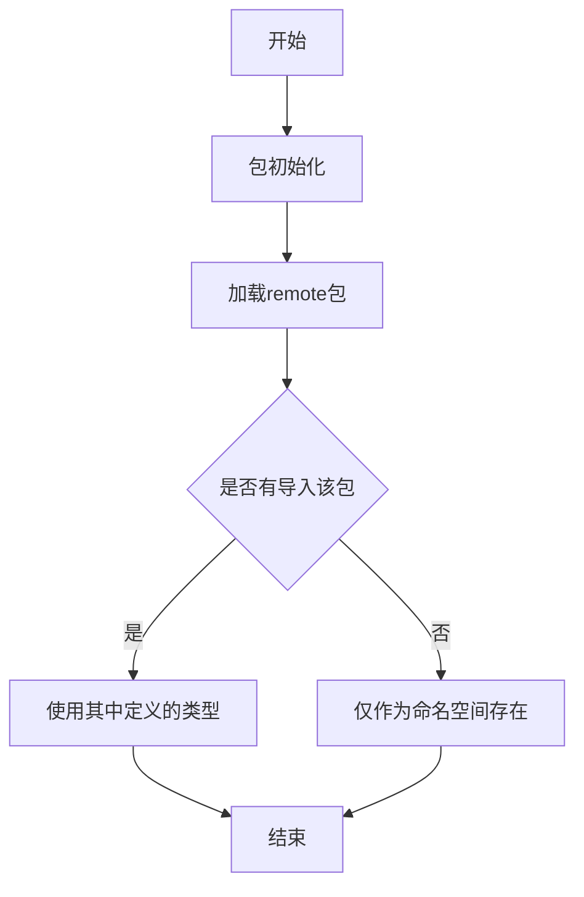

# `flux\pkg\remote\doc.go` 详细设计文档

这是一个Go语言包，用于定义守护进程(daemon)与上游服务(upstream service)之间通信协议的 类型定义。该包当前为占位符状态，仅包含包声明和注释，计划未来可迁移至weaveworks/flux-adapter项目。

## 整体流程



## 类结构

```
remote (包根)
```

## 全局变量及字段


    

## 全局函数及方法


## 关键组件


### 一段话描述

该代码定义了一个名为 `remote` 的 Go 包，用于声明守护进程（daemon）与上游服务之间的通信协议类型，代码目前仅有包声明和迁移注释，尚未实现任何实际功能。

### 文件的整体运行流程

该代码文件仅包含包声明和注释，不包含任何可执行代码，因此不存在运行流程。

### 类的详细信息

该代码不包含任何类定义。

### 全局变量和全局函数

该代码不包含任何全局变量或全局函数。

### 关键组件信息

### 远程协议类型（Remote Protocol Types）

用于定义守护进程与上游服务之间通信的数据结构和接口契约，是远程通信的基础抽象层。

### 包迁移候选（Package Migration Candidate）

代码注释表明该包计划迁移至 weaveworks/flux-adapter 项目，是代码库中待重构的组件。

### 潜在的技术债务或优化空间

### 1. 功能实现缺失

该包仅有包声明和注释，缺少实际的协议类型定义、数据结构、接口等核心功能实现，当前无法提供任何实际的远程通信能力。

### 2. 依赖关系不明确

注释提到 `--connect` 参数和 fluxd 的关联，但代码中未体现与 fluxd 的具体依赖关系或接口契约。

### 3. 文档不完整

缺少包的详细使用说明、API 文档和协议规范说明。

### 4. 重构计划不明确

虽然注释提到可迁移至 weaveworks/flux-adapter，但具体的迁移时间表和前置条件尚未明确。

### 其它项目

#### 设计目标与约束

- **设计目标**：为守护进程与上游服务之间的通信提供类型定义支持
- **约束条件**：注释暗示需在放弃 `--connect` 功能后才能迁移，或提前从目标仓库导入

#### 错误处理与异常设计

当前代码未实现任何错误处理机制。

#### 数据流与状态机

当前代码不涉及任何数据流或状态机设计。

#### 外部依赖与接口契约

当前代码不包含任何外部依赖或接口定义。


## 问题及建议


### 已知问题

-   **空包实现**: 该package只包含注释，没有任何实际的类型、接口或函数定义，与注释描述的"协议类型"功能不匹配
-   **遗留代码标识**: 注释明确指出这是一个临时占位包，用于未来迁移到 weaveworks/flux-adapter，属于技术债务
-   **功能缺失**: 包文档声明了协议类型的存在，但代码中未实现任何实际内容，无法提供预期的功能
-   **依赖耦合**: 代码注释暗示与 fluxd 的 `--connect` 功能存在耦合，需要解耦后才能完成迁移

### 优化建议

-   **补充实现或移除**: 根据实际需求，要么补充 remote 包中应包含的协议类型定义，要么完全移除这个空包
-   **加快迁移进度**: 既然已有明确的迁移目标（weaveworks/flux-adapter），应评估并推进迁移工作，消除技术债务
-   **解耦 fluxd 依赖**: 消除 `--connect` 功能耦合，使包可以独立演进和迁移
- **完善文档**: 如果保留该包，应添加更详细的文档说明当前状态和后续计划，避免其他开发者困惑


## 其它


### 设计目标与约束

暂无。当前代码仅包含包注释，未实现任何功能。

### 错误处理与异常设计

暂无。代码中未定义任何会产生错误或异常的情况。

### 数据流与状态机

暂无。该代码为空的Go包，不包含任何数据流或状态机逻辑。

### 外部依赖与接口契约

当前包为remote包，根据代码注释，该包的预期用途是定义daemon和上游服务之间的协议类型。代码注释提到该包可以移动到weaveworks/flux-adapter，表明存在潜在的外部依赖或迁移计划。

### 版本兼容性

暂无版本信息。

### 配置管理

暂无配置相关代码。

### 安全性设计

暂无安全相关实现。

### 性能优化

暂无性能相关实现。

### 测试覆盖范围

暂无测试代码。

### 部署架构

根据代码注释，该包涉及daemon和upstream service之间的通信协议，属于分布式系统架构的一部分。

### 扩展性与未来计划

根据代码注释，该包计划在未来移动到weaveworks/flux-adapter仓库，表明存在架构重构的计划。


    