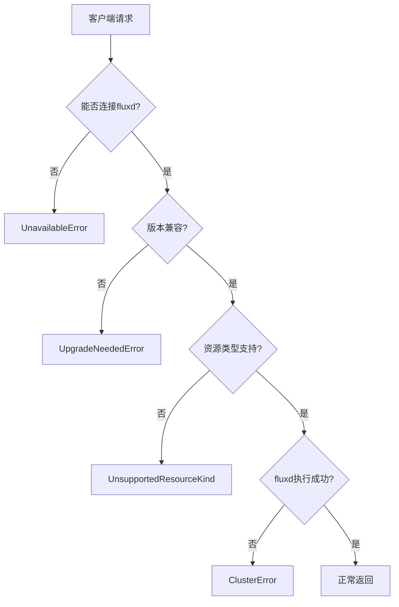
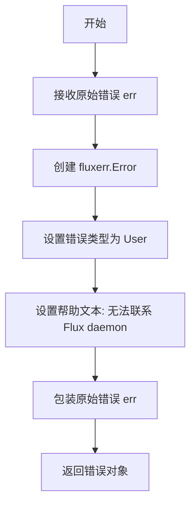
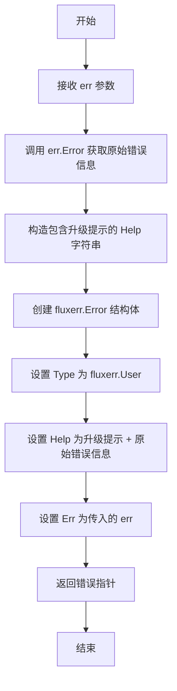
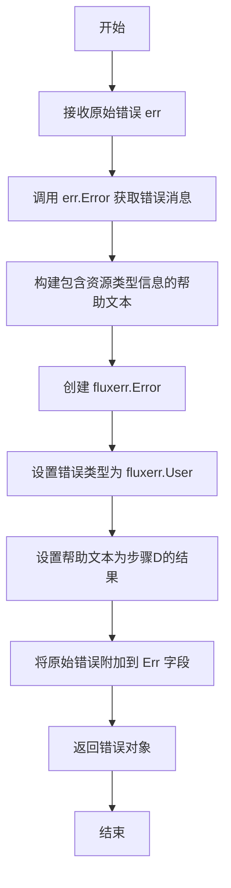
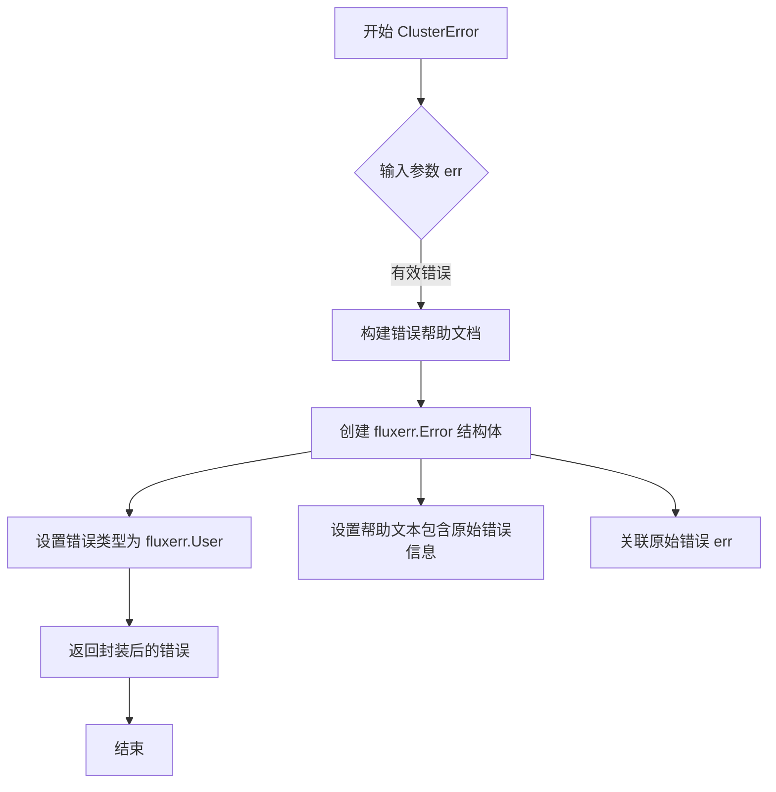
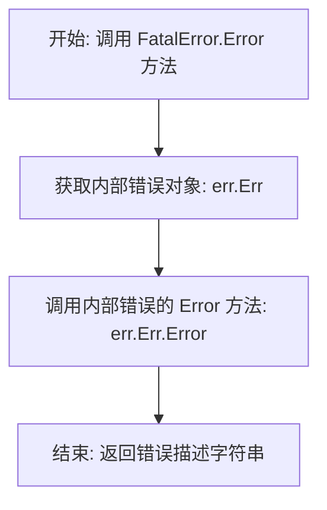

# `flux\pkg\remote\errors.go` 详细设计文档

该文件是Flux CD工具链中的远程错误处理模块，定义了多种针对Flux守护进程(fluxd)通信失败、版本不兼容、资源类型不支持等场景的错误生成函数，帮助客户端程序进行精准的错误诊断与用户提示。

## 整体流程



## 类结构

```
remote包 (错误处理模块)
├── UnavailableError 函数
├── UpgradeNeededError 函数
├── UnsupportedResourceKind 函数
├── ClusterError 函数
└── FatalError 结构体
```

## 全局变量及字段


### `UnavailableError`
    
创建无法连接Flux daemon的错误

类型：`func(err error) error`
    


### `UpgradeNeededError`
    
创建Flux daemon版本过旧需要升级的错误

类型：`func(err error) error`
    


### `UnsupportedResourceKind`
    
创建不支持的Kubernetes资源类型的错误

类型：`func(err error) error`
    


### `ClusterError`
    
创建Flux daemon返回错误的错误

类型：`func(err error) error`
    


### `FatalError`
    
用于表示服务器已断开连接的致命错误结构体

类型：`struct`
    


### `FatalError.Err`
    
存储原始错误信息

类型：`error`
    
    

## 全局函数及方法


### `UnavailableError`

该函数用于创建一个包含用户友好错误信息的 Flux 错误对象，当无法连接到集群中运行的 Flux daemon (fluxd) 时返回此错误，帮助用户诊断连接问题。

参数：

- `err`：`error`，原始的错误信息，用于包装到错误结构中

返回值：`error`，返回构造好的 `fluxerr.Error` 错误对象

#### 流程图



#### 带注释源码

```go
// UnavailableError 创建一个错误，表示无法连接到 Flux daemon
// 参数 err 是原始的底层错误，会被包装在返回的错误中
// 返回一个 fluxerr.Error，其类型为 User，用于向用户展示友好的错误信息
func UnavailableError(err error) error {
    // 返回一个包含用户友好帮助文本的错误对象
    return &fluxerr.Error{
        // 设置错误类型为用户错误，便于区分系统错误和用户操作错误
        Type: fluxerr.User,
        // Help 字段包含详细的错误描述和解决步骤
        Help: `Cannot contact Flux daemon

To service this request, we need to ask the agent running in your
cluster (fluxd) for some information. But we can't connect to it at
present.

This may be because it's not running at all, is temporarily
disconnected or has been firewalled.

If you are sure Flux is running, you can simply wait a few seconds
and try the operation again.

Otherwise, please consult the installation instructions in our
documentation:

    https://fluxcd.io/legacy/flux/get-started/

If you are still stuck, please log an issue:

    https://github.com/fluxcd/flux/issues

`,
        // Err 字段包装原始错误，保留错误链以便调试
        Err: err,
    }
}
```


### `UpgradeNeededError`

该函数用于创建一个用户级别的错误对象，表示当前运行的 Flux daemon 版本过旧，无法理解或处理请求，需要用户升级 Flux 到最新版本。

参数：

- `err`：`error`，原始错误信息，用于嵌入到返回的错误中，提供更详细的上下文

返回值：`error`，返回一个指向 `fluxerr.Error` 结构体的指针，错误类型为 `fluxerr.User`，帮助信息中包含升级提示

#### 流程图



#### 带注释源码

```go
// UpgradeNeededError 创建一个表示Flux守护进程需要升级的错误
// 参数 err 是原始错误，用于提供更详细的上下文信息
// 返回一个用户级别的错误，提示用户需要升级Flux版本
func UpgradeNeededError(err error) error {
    // 返回一个fluxerr.Error指针，包含用户友好的错误信息
    return &fluxerr.Error{
        Type: fluxerr.User, // 错误类型为用户错误
        Help: `Your Flux daemon needs to be upgraded

    ` + err.Error() + `

To service this request, we need to ask the agent running in your
cluster (fluxd) to perform an operation on our behalf, but the
version you have running is too old to understand the request.

Please install the latest version of Flux and try again.

`,           // 帮助信息包含升级说明
        Err: err, // 将原始错误嵌入到fluxerr.Error中
    }
}
```


### UnsupportedResourceKind

该函数用于创建一个包含用户友好提示的错误信息，当用户尝试使用 Flux 不支持的 Kubernetes 资源类型（如 Service）时调用。它将原始错误包装成 Flux 特定的错误类型，提供关于支持的资源类型和升级指南的信息。

参数：

- `err`：`error`，导致此错误的原始错误，用于提取错误消息内容

返回值：`error`，返回一个包含用户友好帮助文本的 fluxerr.Error 错误对象

#### 流程图



#### 带注释源码

```go
// UnsupportedResourceKind 创建一个错误，用于提示用户不支持的资源类型
// 参数 err 是导致此错误的原始错误
// 返回一个包含用户友好提示的 fluxerr.Error 错误对象
func UnsupportedResourceKind(err error) error {
    // 创建并返回一个包含用户级别错误的 fluxerr.Error 结构
    return &fluxerr.Error{
        // 设置错误类型为用户错误，便于区分系统错误和用户操作错误
        Type: fluxerr.User,
        
        // Help 字段包含详细的帮助文本，说明：
        // 1. 当前 agent 支持的 pod controller 类型
        // 2. 如何查看新版本支持情况
        // 3. 不支持 Service 发布的说明
        Help: err.Error() + `

The version of the agent running in your cluster (fluxd) can release updates to
the following kinds of pod controller: Deployments, DaemonSets, StatefulSets
and CronJobs. When new kinds are added to Kubernetes, we try to support them as
quickly as possible - check here to see if a new version of Flux is available:

	https://github.com/fluxcd/flux/releases

Releasing by Service is not supported - if you're using an old version of
fluxctl that accepts the '--service' argument you will need to get a new one
that matches your agent.
`,
        // 将原始错误附加到 Err 字段，保留错误链以便调试
        Err: err,
    }
}
```


### `ClusterError`

该函数用于将底层Flux守护进程（fluxd）返回的错误封装成用户级别的错误，帮助用户理解错误来源并提供相应的故障排除指引。

参数：

- `err`：`error`，原始的错误信息，通常来自Flux守护进程

返回值：`error`，返回一个包含用户友好错误提示的`fluxerr.Error`类型的错误

#### 流程图



#### 带注释源码

```go
// ClusterError 创建一个用户级别的错误，用于包装来自 Flux daemon (fluxd) 的错误
// 参数 err 是从 fluxd 返回的原始错误
// 返回一个包含用户友好错误提示的 fluxerr.Error
func ClusterError(err error) error {
    // 返回一个 fluxerr.Error 结构体，包含错误类型、帮助信息和原始错误
    return &fluxerr.Error{
        // 设置错误类型为用户错误 (User)
        Type: fluxerr.User,
        // 构建用户友好的帮助文本，包含错误说明和故障排除指引
        Help: `Error from Flux daemon

The Flux daemon (fluxd) reported this error:

    ` + err.Error() + `

which indicates that it is running, but cannot complete the request.

Thus may be because the request wasn't valid; e.g., you asked for
something in a namespace that doesn't exist.

Otherwise, it is likely to be an ongoing problem until fluxd is
updated and/or redeployed. For help, please consult the installation
instructions:

    https://fluxcd.io/legacy/flux/get-started/

If you are still stuck, please log an issue:

    https://github.com/fluxcd/flux/issues

`,
        // 将原始错误关联到新的错误结构中
        Err: err,
    }
}
```


### `FatalError.Error`

该方法实现了 Go 语言内置的 `error` 接口，用于返回 `FatalError` 结构体中所包装的底层错误的字符串描述信息。

参数：

- （无）

返回值：`string`，返回底层错误 `err.Err` 的描述信息。

#### 流程图



#### 带注释源码

```go
// Error 是实现 error 接口的方法。
// 它返回被包装的底层错误 (err.Err) 的字符串表示。
func (err FatalError) Error() string {
	return err.Err.Error()
}
```

## 关键组件


### 错误处理函数组

该代码文件定义了一组用于生成特定类型用户友好的Flux错误的辅助函数，这些函数封装了来自fluxcd/flux错误包的Error类型，提供了清晰的错误消息和用户指导。

### UnavailableError 函数

UnavailableError函数用于创建表示无法连接到Flux守护进程(fluxd)的错误。当客户端无法与集群中运行的Flux代理通信时返回此错误，包含关于可能原因（未运行、临时断开连接、防火墙问题）的解释以及相关文档链接。

### UpgradeNeededError 函数

UpgradeNeededError函数用于创建表示Flux守护进程版本过旧、不支持当前请求的错误。当客户端请求的操作需要更新版本的Flux代理时返回此错误，并提示用户安装最新版本。

### UnsupportedResourceKind 函数

UnsupportedResourceKind函数用于创建表示不支持的资源类型的错误。当用户尝试使用Flux不支持的Kubernetes资源类型（如Service）时返回此错误，列出Flux支持的控制器的类型。

### ClusterError 函数

ClusterError函数用于创建从Flux守护进程返回的通用错误。当守护进程可以连接但无法完成请求时返回此错误，可能由于请求无效（如请求不存在的命名空间）或守护进程需要更新。

### FatalError 结构体

FatalError是一个自定义错误类型，用于包装需要指示服务器已死亡且已断开的错误。该结构体实现了error接口的Error()方法，返回底层错误的消息。

### fluxerr.Error 依赖

该代码依赖于github.com/fluxcd/flux/pkg/errors包中的Error类型，这是Flux项目的标准错误处理机制，提供了错误类型分类（User类型）和错误帮助文档功能。


## 问题及建议


### 已知问题

- **缺少nil检查**：所有错误创建函数（UnavailableError、UpgradeNeededError等）没有对传入的err参数进行nil检查，如果传入nil可能导致潜在的panic
- **FatalError未实现Unwrap方法**：Go 1.13+的错误包装规范要求实现Unwrap() error方法，以便正确进行错误链追踪和errors.Is/errors.As的使用
- **错误消息硬编码**：所有Help字符串都是硬编码的Go字符串常量，没有考虑国际化(i18n)或外部配置化的可能性
- **重复代码模式**：所有错误创建函数都遵循相同的结构（创建fluxerr.Error并设置Type、Help、Err字段），存在明显的代码重复
- **缺乏文档注释**：函数和FatalError结构体缺少Go文档注释（doc comments），影响代码可读性和维护性
- **可能的过期链接**：错误消息中包含的文档URL指向"legacy"版本，可能需要更新或验证有效性

### 优化建议

- **添加nil检查**：在每个错误创建函数入口添加err == nil的检查，或使用可选参数模式
- **实现Unwrap方法**：为FatalError添加`func (err FatalError) Unwrap() error { return err.Err }`方法
- **提取通用错误构建逻辑**：创建一个内部辅助函数来减少重复代码
- **添加文档注释**：为每个导出函数和类型添加标准的Go文档注释
- **考虑错误类型枚举**：引入更细粒度的错误类型，而不是所有错误都使用fluxerr.User
- **添加单元测试**：为错误创建函数编写测试用例，验证错误属性和消息内容

## 其它


### 设计目标与约束

本模块的设计目标是统一处理Flux分布式系统中与远程服务（fluxd daemon）通信失败时的错误场景，为用户提供清晰的错误提示信息和操作指导。约束包括：依赖fluxerr包提供基础错误结构，所有错误类型均为用户错误（User error），错误信息需要包含故障排查指导链接。

### 错误处理与异常设计

本模块采用错误工厂模式，通过4个预定义的错误创建函数返回标准化的fluxerr.Error实例。所有错误都将Type设置为fluxerr.User，表示这些是用户需要了解并可能需要采取行动的错误。FatalError结构体实现了error接口，用于标识需要终止连接的严重错误。错误信息包含详细的故障排查步骤和文档链接。

### 外部依赖与接口契约

本模块依赖github.com/fluxcd/flux/pkg/errors包中的fluxerr.Error结构体和User错误类型常量。外部调用方通过调用UnavailableError、UpgradeNeededError、UnsupportedResourceKind、ClusterError四个函数或创建FatalError实例来生成错误。返回值为error接口类型，可被标准错误处理机制捕获。

### 安全性考虑

错误信息中包含的链接均为官方文档链接（fluxcd.io和github.com），不存在敏感信息泄露风险。错误堆栈信息通过err字段传递，不在用户面向的错误Help中直接暴露内部实现细节。

### 性能考量

本模块为纯错误处理模块，无性能敏感操作。错误创建函数均为轻量级结构体组装，无复杂计算或IO操作。

### 可维护性与扩展性

当前设计通过fluxerr.Error的Help字段支持多语言错误信息扩展。如需添加新的错误类型，可参照现有4个函数的模式新增。错误码定义在fluxerr包中，便于集中管理。

### 测试策略

建议为每个错误创建函数编写单元测试，验证返回的fluxerr.Error实例的Type、Help和Err字段是否正确设置。FatalError需要测试Error()方法的返回值是否正确。

### 版本兼容性

当前代码未使用任何Go版本特定的特性，兼容Go 1.x标准。fluxerr包的版本需要与Flux主版本保持一致。

    