# `flux\pkg\remote\logging.go` 详细设计文档

这是一个错误日志记录服务器装饰器（Decorator），通过包装api.Server接口的实现，在所有方法调用出错时自动记录错误日志，同时将请求转发给被包装的服务器执行实际业务逻辑。

## 整体流程

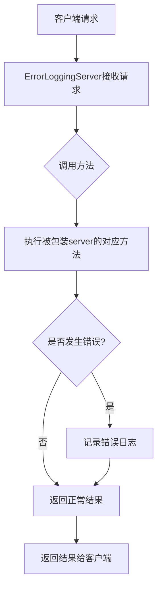

## 类结构

```
api.Server (接口)
└── ErrorLoggingServer (实现类/装饰器)
    ├── server: api.Server (被装饰的服务器)
    └── logger: log.Logger (日志记录器)
```

## 全局变量及字段


### `ErrorLoggingServer`
    
ErrorLoggingServer实现了api.Server接口的编译时断言

类型：`api.Server`
    


### `ErrorLoggingServer.server`
    
被装饰的服务器实例

类型：`api.Server`
    


### `ErrorLoggingServer.logger`
    
日志记录器

类型：`log.Logger`
    
    

## 全局函数及方法


### `NewErrorLoggingServer`

这是 `ErrorLoggingServer` 类的构造函数，用于创建一个包装了底层 API Server 的错误日志记录代理服务器。该函数通过装饰器模式为所有 API 方法添加自动错误日志记录功能，使得任何传入底层服务器的请求在发生错误时都会被记录下来。

#### 参数

- `s`：`api.Server`，被包装的底层 API 服务器实例，负责处理实际的业务逻辑
- `l`：`log.Logger`，日志记录器实例，用于输出错误日志信息

#### 流程图

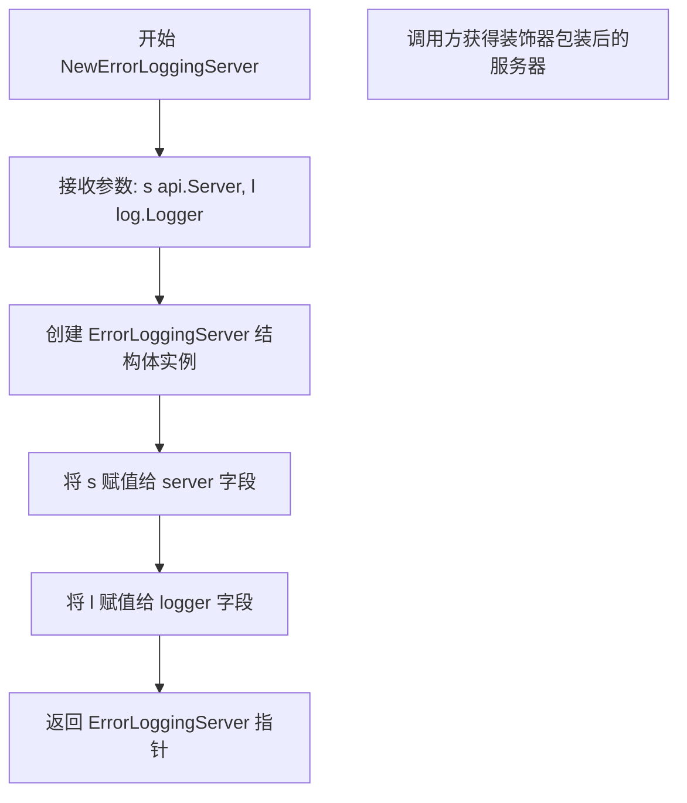

#### 带注释源码

```go
// NewErrorLoggingServer 是 ErrorLoggingServer 的构造函数
// 参数 s: api.Server 接口实现，被包装的底层服务器
// 参数 l: log.Logger 接口实现，用于记录错误的日志记录器
// 返回值: *ErrorLoggingServer，返回一个包装了错误日志功能的服务器代理
func NewErrorLoggingServer(s api.Server, l log.Logger) *ErrorLoggingServer {
    // 创建一个新的 ErrorLoggingServer 实例
    // server 字段存储被包装的原始服务器实例
    // logger 字段存储用于记录错误的日志记录器
    return &ErrorLoggingServer{s, l}
}
```


### `NewErrorLoggingServer`

这是一个构造函数，用于创建并返回一个 `ErrorLoggingServer` 实例，该实例作为装饰器包装了 `api.Server` 接口，提供了错误日志记录功能。

参数：

- `s`：`api.Server`，被包装的 Flux API 服务器实例，用于处理实际的业务逻辑
- `l`：`log.Logger`，日志记录器，用于输出错误日志

返回值：`*ErrorLoggingServer`，返回新创建的 `ErrorLoggingServer` 实例

#### 流程图

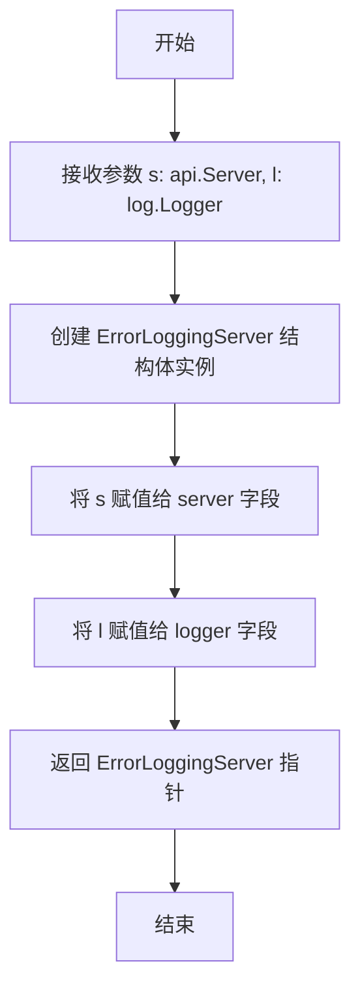

#### 带注释源码

```go
// NewErrorLoggingServer 是 ErrorLoggingServer 的构造函数
// 参数 s 是被装饰的底层 api.Server 实现，用于处理实际的 API 请求
// 参数 l 是日志记录器，用于记录方法调用过程中的错误信息
// 返回值是一个包装了错误日志功能的 ErrorLoggingServer 指针
func NewErrorLoggingServer(s api.Server, l log.Logger) *ErrorLoggingServer {
    // 创建一个新的 ErrorLoggingServer 实例，并将传入的 server 和 logger 初始化
    // 这里使用了结构体字面量语法，同时初始化两个字段
    return &ErrorLoggingServer{s, l}
}
```


### `ErrorLoggingServer.Export`

该方法实现了 `api.Server` 接口的 `Export` 方法，作为装饰器（Decorator）封装了底层服务器调用。它在内部服务执行返回后，若发生错误，则通过日志记录器记录错误信息（隐藏了可能包含大量数据的配置内容），而正常情况下直接将结果透传给调用者。

参数：

- `ctx`：`context.Context`，上下文对象，用于传递截止时间、取消信号以及请求级别的值。

返回值：

- `config`：`[]byte`，导出配置的内容字节切片，若成功则包含数据，失败则可能为空。
- `err`：`error`，执行过程中产生的错误。如果底层服务调用成功，则该值为 `nil`。

#### 流程图

```mermaid
flowchart TD
    A[调用 Export 方法] --> B[执行内部服务调用 p.server.Export(ctx)]
    B --> C{err != nil?}
    C -- Yes --> D[记录日志: method=Export, error=err]
    C -- No --> E[直接返回结果]
    D --> E
```

#### 带注释源码

```go
func (p *ErrorLoggingServer) Export(ctx context.Context) (config []byte, err error) {
	// 使用 defer 延迟执行错误日志记录逻辑
	// 当函数即将返回时（无论是正常返回还是 panic），都会执行此匿名函数
	defer func() {
		// 仅当发生错误时才记录日志
		if err != nil {
			// 省略 config 字段，因为配置数据可能非常大
			// 仅记录方法名和错误信息
			p.logger.Log("method", "Export", "error", err)
		}
	}()
	
	// 调用被包装的服务器对象的 Export 方法，并返回其结果
	return p.server.Export(ctx)
}
```


### `ErrorLoggingServer.ListServices`

该方法是 `ErrorLoggingServer` 类型的错误日志记录包装器方法，通过 defer 机制捕获底层服务调用返回的错误并进行日志记录，同时将请求委托给内部封装的 `api.Server` 实例执行实际的列表服务操作。

**参数：**

- `ctx`：`context.Context`，Go 语言的上下文对象，用于传递请求范围的取消信号、截止时间以及请求级别的值
- `maybeNamespace`：`string`，可选的命名空间字符串，用于过滤指定命名空间下的服务列表，若为空则表示返回所有命名空间的服务

**返回值：**

- `[]v6.ControllerStatus`：控制器状态的切片，包含每个服务的状态信息
- `err error`：执行过程中的错误信息，若成功则为 nil

#### 流程图

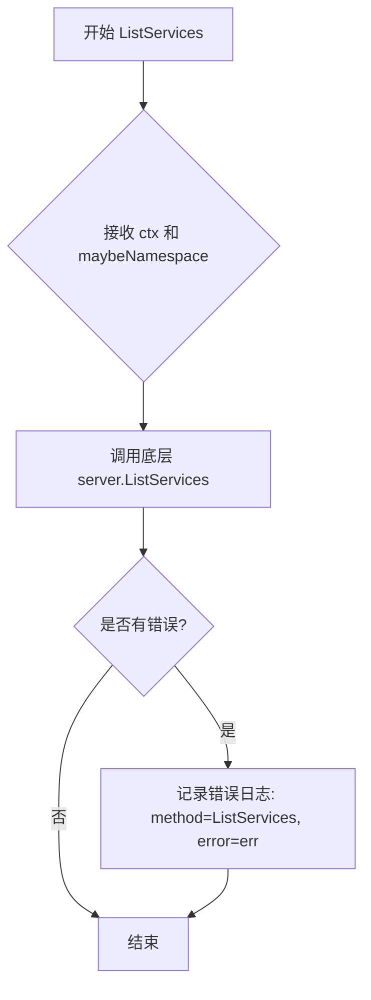

#### 带注释源码

```go
// ListServices 是 ErrorLoggingServer 类型的错误日志记录包装器方法
// 参数 ctx 用于传递上下文信息，maybeNamespace 用于指定可选的命名空间过滤
// 返回控制器状态切片和错误信息
func (p *ErrorLoggingServer) ListServices(ctx context.Context, maybeNamespace string) (_ []v6.ControllerStatus, err error) {
	// 使用 defer 延迟执行匿名函数，用于在方法返回前捕获并记录错误
	defer func() {
		// 仅当存在错误时进行日志记录，避免无错误时的冗余日志
		if err != nil {
			// 记录方法名和错误信息，便于问题追踪和调试
			p.logger.Log("method", "ListServices", "error", err)
		}
	}()
	// 委托给内部封装的 server 实例执行实际的 ListServices 业务逻辑
	return p.server.ListServices(ctx, maybeNamespace)
}
```


### ErrorLoggingServer.ListServicesWithOptions

该方法是 ErrorLoggingServer 结构体的成员方法，实现了带选项列出服务的功能。它通过装饰器模式为底层 Server 的 ListServicesWithOptions 方法添加错误日志记录能力。当底层方法返回错误时，会自动记录方法名和错误信息到日志中。

参数：

- `ctx`：`context.Context`，上下文对象，用于传递请求范围的截止日期、取消信号和其他请求范围的值
- `opts`：`v11.ListServicesOptions`，列出服务的选项参数，包含筛选、排序等配置

返回值：`([]v6.ControllerStatus, error)`，第一个返回值是服务控制器状态列表，第二个返回值是错误对象。如果发生错误，返回的切片可能为空或部分有效。

#### 流程图

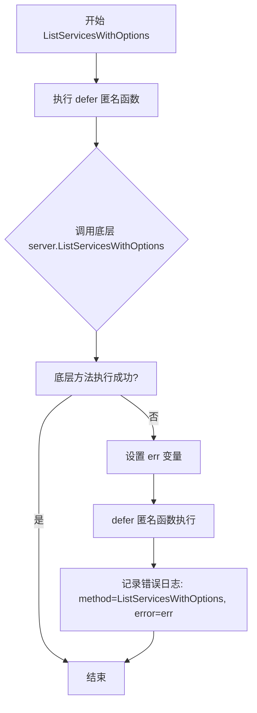

#### 带注释源码

```go
// ListServicesWithOptions 带选项列出服务
// 参数 ctx: 上下文对象，用于传递请求范围的截止日期、取消信号等
// 参数 opts: 列出服务的选项参数，包含筛选、排序等配置
// 返回值: ([]v6.ControllerStatus, error) - 服务控制器状态列表和错误对象
func (p *ErrorLoggingServer) ListServicesWithOptions(ctx context.Context, opts v11.ListServicesOptions) (_ []v6.ControllerStatus, err error) {
    // 使用 defer 延迟执行匿名函数，用于错误处理
    defer func() {
        // 如果底层方法返回了错误，则记录错误日志
        if err != nil {
            // 记录方法名和错误信息，省略可能较大的配置数据
            p.logger.Log("method", "ListServicesWithOptions", "error", err)
        }
    }()
    // 调用底层 server 的 ListServicesWithOptions 方法，并传递参数
    return p.server.ListServicesWithOptions(ctx, opts)
}
```


### ErrorLoggingServer.ListImages

该方法是 ErrorLoggingServer 类型的成员函数，用于列出镜像。它是一个错误日志装饰器模式实现，通过 defer 延迟函数捕获并记录底层服务器调用返回的错误，同时将实际业务逻辑委托给内部封装的 api.Server 实例执行。

参数：

- `ctx`：`context.Context`，请求上下文，用于传递超时、取消等控制信息
- `spec`：`update.ResourceSpec`，资源规格定义，用于指定需要列出镜像的资源条件

返回值：`([]v6.ImageStatus, error)`，返回镜像状态列表和可能的错误。如果发生错误，错误会被记录到日志中。

#### 流程图

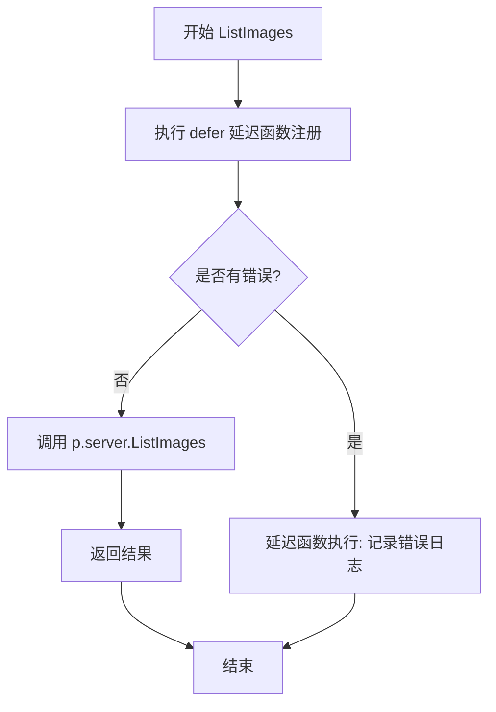

#### 带注释源码

```go
// ListImages 列出与给定资源规格匹配的镜像
// 它是一个装饰器方法，会捕获底层服务调用产生的错误并记录日志
func (p *ErrorLoggingServer) ListImages(ctx context.Context, spec update.ResourceSpec) (_ []v6.ImageStatus, err error) {
	// defer 延迟函数：在方法返回前执行，用于错误捕获和日志记录
	defer func() {
		// 如果返回的错误不为 nil，则记录错误日志
		if err != nil {
			// 记录方法名和错误信息，config 信息被省略因为可能很大
			p.logger.Log("method", "ListImages", "error", err)
		}
	}()
	// 委托给内部封装的 server 实例执行实际的 ListImages 业务逻辑
	return p.server.ListImages(ctx, spec)
}
```


### `ErrorLoggingServer.ListImagesWithOptions`

该方法是 ErrorLoggingServer 类型的成员方法，用于带选项列出镜像。它通过 defer 机制捕获可能的错误并使用日志记录器记录，然后委托给底层 server 的同名方法执行实际业务逻辑。

参数：

- `ctx`：`context.Context`，Go 标准库的上下文，用于传递请求上下文、控制超时和取消
- `opts`：`v10.ListImagesOptions`，列出镜像时的可选过滤条件和参数配置

返回值：`[]v6.ImageStatus, error`，第一个返回值是镜像状态列表，第二个返回值是执行过程中可能发生的错误

#### 流程图

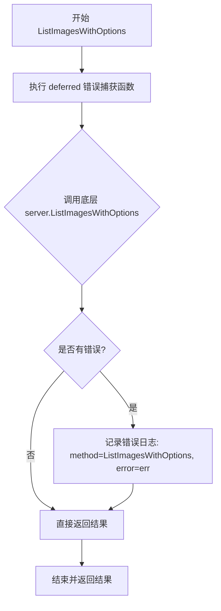

#### 带注释源码

```go
// ListImagesWithOptions 带选项列出镜像
// 参数 ctx 用于控制请求生命周期，opts 包含过滤和分页等选项
// 返回镜像状态列表和可能的错误
func (p *ErrorLoggingServer) ListImagesWithOptions(ctx context.Context, opts v10.ListImagesOptions) (_ []v6.ImageStatus, err error) {
    // defer 确保方法返回前执行错误日志记录
    defer func() {
        // 仅在发生错误时记录日志，避免正常流程的日志干扰
        if err != nil {
            // 记录方法名和错误信息，便于问题追踪
            p.logger.Log("method", "ListImagesWithOptions", "error", err)
        }
    }()
    // 委托给底层 server 执行实际业务逻辑
    return p.server.ListImagesWithOptions(ctx, opts)
}
```


### ErrorLoggingServer.JobStatus

获取指定任务的状态，如果发生错误则记录错误日志。

参数：

- `ctx`：`context.Context`，上下文对象，用于传递请求范围的值和取消信号
- `jobID`：`job.ID`，任务ID，标识要查询的具体任务

返回值：`job.Status, error`，返回任务状态和错误信息（如果有错误）

#### 流程图

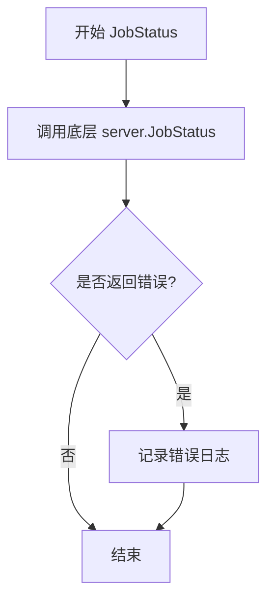

#### 带注释源码

```go
// JobStatus 获取指定任务的状态
// 如果发生错误则记录错误日志
func (p *ErrorLoggingServer) JobStatus(ctx context.Context, jobID job.ID) (_ job.Status, err error) {
	// 使用 defer 捕获函数返回时的错误并进行日志记录
	defer func() {
		if err != nil {
			// 记录方法名和错误信息
			p.logger.Log("method", "JobStatus", "error", err)
		}
	}()
	// 委托给底层 server 处理实际的 JobStatus 逻辑
	return p.server.JobStatus(ctx, jobID)
}
```


### `ErrorLoggingServer.SyncStatus`

获取指定引用的同步状态，如果发生错误则记录错误日志。该方法是一个装饰器方法，包装了底层 `api.Server` 接口的 `SyncStatus` 方法，添加了统一的错误日志处理功能。

参数：

- `ctx`：`context.Context`，上下文对象，用于传递请求作用域的值、取消信号和超时控制
- `ref`：`string`，同步状态的引用（如 Git 仓库的分支或提交哈希）

返回值：`([]string, error)`，返回同步状态的字符串切片和可能的错误。如果发生错误，错误会被记录到日志中。

#### 流程图

```mermaid
flowchart TD
    A[开始 SyncStatus] --> B{调用底层 server.SyncStatus}
    B -->|成功| C[返回 []string 和 nil]
    B -->|失败| D[捕获错误]
    D --> E[记录错误日志: method=SyncStatus, error=err]
    E --> F[返回空切片和错误]
    
    style D fill:#ffcccc
    style E fill:#ffffcc
```

#### 带注释源码

```go
// SyncStatus 获取指定引用的同步状态
// 参数 ctx 用于传递上下文信息，ref 是同步状态的引用
// 返回同步状态的字符串切片和错误信息
func (p *ErrorLoggingServer) SyncStatus(ctx context.Context, ref string) (_ []string, err error) {
    // 使用 defer 延迟执行，在函数返回前执行错误处理逻辑
    defer func() {
        // 如果方法执行过程中发生错误，则记录错误日志
        if err != nil {
            p.logger.Log("method", "SyncStatus", "error", err)
        }
    }()
    
    // 委托给底层服务器执行实际的同步状态获取逻辑
    return p.server.SyncStatus(ctx, ref)
}
```


### `ErrorLoggingServer.UpdateManifests`

该方法通过装饰器模式包装底层 API 服务器实现，在执行清单更新操作时捕获错误并记录日志，同时将请求委托给内部服务器处理。

参数：

- `ctx`：`context.Context`，上下文对象，用于传递请求作用域的取消信号、超时和元数据
- `u`：`update.Spec`，更新规范，定义要执行的清单更新操作类型和目标资源

返回值：`job.ID`，作业 ID，表示已创建或排队的更新任务；`err error`，错误对象，如果更新失败则返回错误信息

#### 流程图

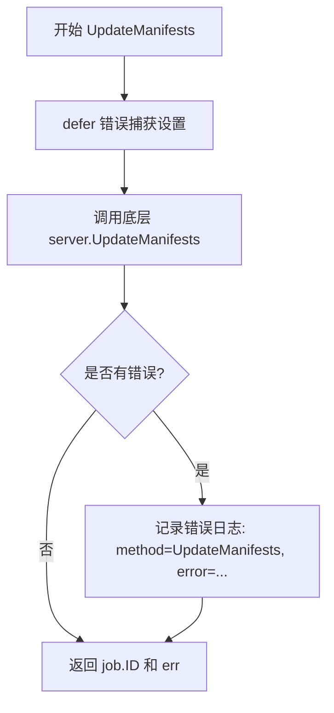

#### 带注释源码

```go
// UpdateManifests 处理清单更新请求
// 通过装饰器模式在底层服务器执行前设置错误日志捕获
func (p *ErrorLoggingServer) UpdateManifests(ctx context.Context, u update.Spec) (_ job.ID, err error) {
	// defer 匿名函数用于捕获方法执行过程中的 panic 和错误
	defer func() {
		if err != nil {
			// 发生错误时记录日志，包含方法名和错误信息
			p.logger.Log("method", "UpdateManifests", "error", err)
		}
	}()
	// 将请求委托给底层被包装的服务器实例执行实际业务逻辑
	return p.server.UpdateManifests(ctx, u)
}
```


### `ErrorLoggingServer.GitRepoConfig`

获取Git仓库配置，并通过错误日志记录器在发生错误时记录错误信息。

参数：

- `ctx`：`context.Context`，请求的上下文对象，用于控制请求的生命周期和取消
- `regenerate`：`bool`，是否强制重新生成Git配置

返回值：`v6.GitConfig, error`，返回Git仓库配置对象和可能发生的错误；如果发生错误，错误信息会被记录到日志中

#### 流程图

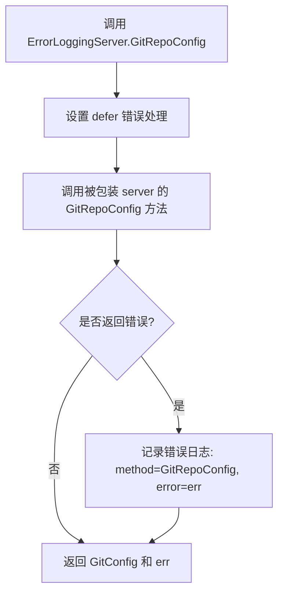

#### 带注释源码

```go
// GitRepoConfig 获取Git仓库配置，并通过错误日志记录器在发生错误时记录错误信息
// 参数 ctx 为上下文对象，用于控制请求生命周期
// 参数 regenerate 为布尔值，指示是否强制重新生成配置
// 返回 v6.GitConfig 类型的Git配置对象和 error 类型的错误
func (p *ErrorLoggingServer) GitRepoConfig(ctx context.Context, regenerate bool) (_ v6.GitConfig, err error) {
	// defer 关键字确保在函数返回前执行匿名函数，用于错误捕获和日志记录
	defer func() {
		// 如果存在错误，则记录错误日志
		// 使用 p.logger.Log 方法记录方法名和错误信息
		if err != nil {
			p.logger.Log("method", "GitRepoConfig", "error", err)
		}
	}()
	// 调用被包装的 server 对象的 GitRepoConfig 方法
	// 这是装饰器模式的核心：委托给实际的服务实现
	return p.server.GitRepoConfig(ctx, regenerate)
}
```


### `ErrorLoggingServer.Ping`

该方法是 ErrorLoggingServer 类型的 Ping 方法实现，作为 API Server 的包装器，添加了错误日志记录功能。当底层服务调用返回错误时，会通过日志记录方法名和错误信息。

参数：

- `ctx`：`context.Context`，用于控制请求的取消和超时

返回值：`error`，如果底层服务调用失败则返回错误，否则返回 nil

#### 流程图

```mermaid
flowchart TD
    A[开始] --> B[调用 p.server.Ping(ctx)]
    B --> C{是否有错误?}
    C -->|是| D[记录错误日志: method=Ping, error=err]
    C -->|否| E[返回 nil]
    D --> E
    E[结束]
```

#### 带注释源码

```go
// Ping 是 ErrorLoggingServer 的健康检查方法
// 它包装了底层 api.Server 的 Ping 方法，并添加错误日志记录功能
func (p *ErrorLoggingServer) Ping(ctx context.Context) (err error) {
    // 使用 defer 在函数返回前执行错误处理逻辑
    defer func() {
        // 如果底层调用返回了错误，则记录日志
        if err != nil {
            p.logger.Log("method", "Ping", "error", err)
        }
    }()
    // 调用底层服务器的 Ping 方法进行健康检查
    return p.server.Ping(ctx)
}
```


### `ErrorLoggingServer.Version`

获取当前 Flux 服务的版本信息，如果发生错误则记录错误日志。

参数：

- `ctx`：`context.Context`，用于控制请求的超时和取消

返回值：

- `v`：`string`，返回服务器的版本信息字符串
- `err`：`error`，如果获取版本过程中发生错误，则返回错误信息；否则返回 nil

#### 流程图

```mermaid
flowchart TD
    A[开始 Version 方法] --> B[调用 p.server.Version(ctx)]
    B --> C{是否返回错误?}
    C -->|是| D[记录错误日志和版本信息]
    C -->|否| E[返回版本字符串和 nil 错误]
    D --> F[返回版本字符串和错误]
    E --> F
```

#### 带注释源码

```go
// Version 获取服务器的版本信息
// 参数 ctx 用于控制请求的生命周期（超时、取消等）
// 返回值 v 为版本字符串，err 为可能出现的错误
func (p *ErrorLoggingServer) Version(ctx context.Context) (v string, err error) {
	// 使用 defer 延迟执行错误日志记录
	defer func() {
		// 仅在发生错误时记录日志
		if err != nil {
			// 记录方法名、错误信息以及版本信息（即使出错也可能获取到部分版本信息）
			p.logger.Log("method", "Version", "error", err, "version", v)
		}
	}()
	// 委托给被包装的 server 实例执行实际的 Version 操作
	return p.server.Version(ctx)
}
```


### ErrorLoggingServer.NotifyChange

通知配置变更，当配置发生改变时调用此方法记录变更信息。

参数：

- `ctx`：`context.Context`，上下文对象，用于控制请求的生命周期和取消操作
- `change`：`v9.Change`，配置变更对象，包含变更的详细信息

返回值：`error`，如果方法执行成功则返回 nil，否则返回错误信息

#### 流程图

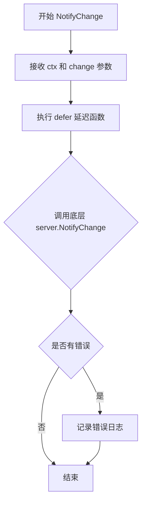

#### 带注释源码

```go
// NotifyChange 通知配置变更
// 当配置发生改变时调用此方法记录变更信息
// 参数:
//   - ctx: 上下文对象,用于控制请求的生命周期和取消操作
//   - change: 配置变更对象,包含变更的详细信息
//
// 返回值:
//   - error: 如果方法执行成功则返回 nil,否则返回错误信息
func (p *ErrorLoggingServer) NotifyChange(ctx context.Context, change v9.Change) (err error) {
	// defer 延迟执行,在函数返回前捕获错误并记录日志
	defer func() {
		if err != nil {
			// 如果发生错误,使用 logger 记录错误信息
			// 记录方法名 "NotifyChange" 和错误详情
			p.logger.Log("method", "NotifyChange", "error", err)
		}
	}()
	// 调用底层 server 的 NotifyChange 方法处理实际业务逻辑
	return p.server.NotifyChange(ctx, change)
}
```

## 关键组件


### ErrorLoggingServer（错误日志服务器）

一个装饰器模式的实现，通过包装 api.Server 接口为所有 API 方法添加错误日志记录功能，使得在不影响业务逻辑的情况下能够追踪和监控调用失败的情况。

### api.Server 接口

定义了一组 Fluxcd 系统的核心 API 方法，包括 Export、ListServices、ListImages、JobStatus、SyncStatus、UpdateManifests、GitRepoConfig、Ping、Version 和 NotifyChange 等，ErrorLoggingServer 实现了该接口的所有方法。

### defer 错误处理模式

每个 API 方法都使用 defer 配合匿名函数捕获错误，并在发生错误时通过 logger 记录方法名和错误信息，实现统一的错误日志输出规范。

### NewErrorLoggingServer 构造函数

接受一个 api.Server 实例和一个 log.Logger 实例，返回一个包装后的 ErrorLoggingServer 指针，用于创建具备错误日志能力的代理服务器。

### 方法委托模式

所有 API 方法都通过委托调用 p.server 的对应方法，将原始服务器的结果直接返回，ErrorLoggingServer 仅负责错误拦截和日志记录，不执行业务逻辑。


## 问题及建议


### 已知问题

-   **大量重复代码模式**：所有方法都使用几乎相同的 defer/if err != nil 结构进行错误日志记录，导致代码冗余，维护成本高，任何日志格式变更都需要修改所有方法
-   **缺少 Panic 恢复机制**：如果底层 server 方法发生 panic，ErrorLoggingServer 没有使用 defer/recover 进行保护，可能导致整个服务崩溃
-   **日志记录可能失败**：直接调用 p.logger.Log() 而没有检查日志记录是否成功，日志系统本身出错时会被忽略
-   **上下文传播不完整**：虽然接收 context.Context 参数，但未对 context 进行任何处理（如检查是否已取消、是否超时）
- **无法追踪调用链**：日志中缺少 trace ID 或 correlation ID，无法在分布式系统中追踪完整调用链
- **无重试机制**：对底层 server 调用失败时没有重试逻辑
- **版本兼容性风险**：代码导入了 v6、v9、v10、v11 多个版本的 API，未来版本演进时需要手动同步更新

### 优化建议

-   **使用代码生成或动态代理**：考虑使用 Go 的 proxy 模式或代码生成工具（如 go.generate）来自动生成错误日志包装逻辑，消除重复代码
-   **添加 Panic 恢复**：在每个方法中添加 defer func() { if r := recover(); r != nil { ... } }() 保护
-   **统一日志格式**：定义统一的日志键值对结构，确保所有方法记录相同类型的上下文信息（如 method、error、duration）
-   **增强上下文处理**：在方法开始时检查 ctx.Done()，或添加请求超时日志
-   **添加调用链追踪**：从 context 中提取或生成 trace ID 并记录到日志中
-   **封装日志记录器**：创建日志包装器，统一处理日志记录失败的情况


## 其它


### 设计目标与约束

设计目标：为api.Server接口提供错误日志记录能力的装饰器实现，通过透明包装方式为所有API调用提供统一的错误日志记录功能，而不修改底层服务器的实现。

设计约束：
1. 必须实现api.Server接口以保持兼容性
2. 错误日志记录不应影响原有方法的行为和返回值
3. 日志记录应包含方法名和错误信息，但避免记录可能较大的配置数据
4. 依赖go-kit的log.Logger接口进行日志记录

### 错误处理与异常设计

错误处理策略：
- 使用defer/recover模式在每个方法中捕获错误
- 错误日志记录在defer函数中执行，确保即使方法panic也会记录错误
- 仅在错误发生时记录日志，避免正常请求的日志噪音
- 对于Export方法，特意省略配置内容以避免大量日志输出

异常设计：
- 保留原始错误，仅添加日志包装，不修改错误类型或值
- 所有方法遵循相同的错误处理模式，保证行为一致性

### 外部依赖与接口契约

外部依赖：
- github.com/go-kit/kit/log：日志记录接口
- github.com/fluxcd/flux/pkg/api：Server接口定义
- github.com/fluxcd/flux/pkg/api/v6/v9/v10/v11：各版本API类型
- github.com/fluxcd/flux/pkg/job：Job相关类型
- github.com/fluxcd/flux/pkg/update：更新相关类型

接口契约：
- 实现了api.Server接口的所有方法
- 构造函数NewErrorLoggingServer接受api.Server和log.Logger两个参数
- 所有方法签名与api.Server接口定义完全一致

### 性能考虑

性能特点：
- 装饰器模式引入的额外开销极小，仅在错误发生时才有日志记录开销
- 使用defer而非显式错误检查，编译器优化可保证性能
- 无额外锁或同步操作，单次调用性能接近直接调用底层服务器

### 安全性考虑

安全措施：
- 不记录敏感的配置内容（Export方法的特殊处理）
- 日志仅记录错误信息，不包含请求/响应的完整数据
- 依赖注入方式获取logger，避免内部状态泄露

### 线程安全/并发考虑

并发特性：
- 本身不持有可变状态，所有操作委托给底层api.Server
- 线程安全性取决于底层api.Server的实现
- logger的线程安全性由注入的log.Logger实现保证

### 单元测试策略

测试建议：
- 应测试每个方法的错误日志记录是否正确触发
- 验证底层服务器错误能够正确传播
- 验证正常调用时不会记录日志
- 使用mock对象模拟api.Server和log.Logger进行测试

### 监控与可观测性

可观测性：
- 通过日志提供错误监控能力
- 日志包含方法名，可用于统计各方法的错误率
- 建议在生产环境中聚合"method"和"error"字段进行监控告警

### 版本兼容性

兼容性说明：
- 支持多个API版本（v6, v9, v10, v11）的类型
- 作为装饰器，与具体API版本实现解耦
- 未来API版本更新时需确保接口方法兼容

### 资源管理

资源管理：
- 不直接管理资源，依赖底层server的资源生命周期
- logger作为外部依赖由调用方管理
- 无连接池、缓存等需要显式释放的资源

### 日志策略

日志记录原则：
- 仅在错误发生时记录日志
- 日志格式统一：包含method、error字段
- Version方法额外记录version字段
- Export方法特殊处理，不记录可能较大的config字段

### 配置管理

配置方式：
- 通过构造函数注入依赖，不使用全局配置
- logger的具体实现可配置
- 底层server的实现可配置

    