# `flux\pkg\remote\metrics.go` 详细设计文档

这是一个Flux CD的远程API服务器仪表化包装器，通过装饰器模式为api.Server接口的每个方法添加Prometheus监控指标，记录每个API调用的请求时长和成功率。

## 整体流程

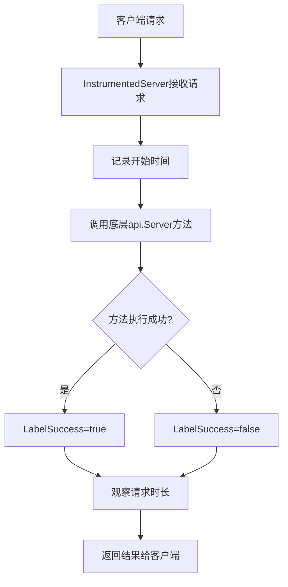

## 类结构

```
api.Server (外部接口)
└── instrumentedServer (仪表化包装器)
```

## 全局变量及字段


### `requestDuration`
    
Prometheus histogram指标，用于记录Flux平台请求持续时间（秒）

类型：`prometheus.Histogram`
    


### `instrumentedServer.s`
    
被仪器化的内部API Server实例，用于代理所有API调用

类型：`api.Server`
    
    

## 全局函数及方法


### `Instrument`

该函数是一个构造函数，用于创建一个 instrumentedServer 实例，将传入的 api.Server 包装为带有 Prometheus 指标监控功能的代理服务器。通过装饰器模式，为所有 API 方法添加了请求耗时统计能力。

参数：

- `s`：`api.Server`，被包装的原始 Flux API 服务器实例

返回值：`*instrumentedServer`，包装了原始服务器并添加了指标监控功能的装饰器实例

#### 流程图

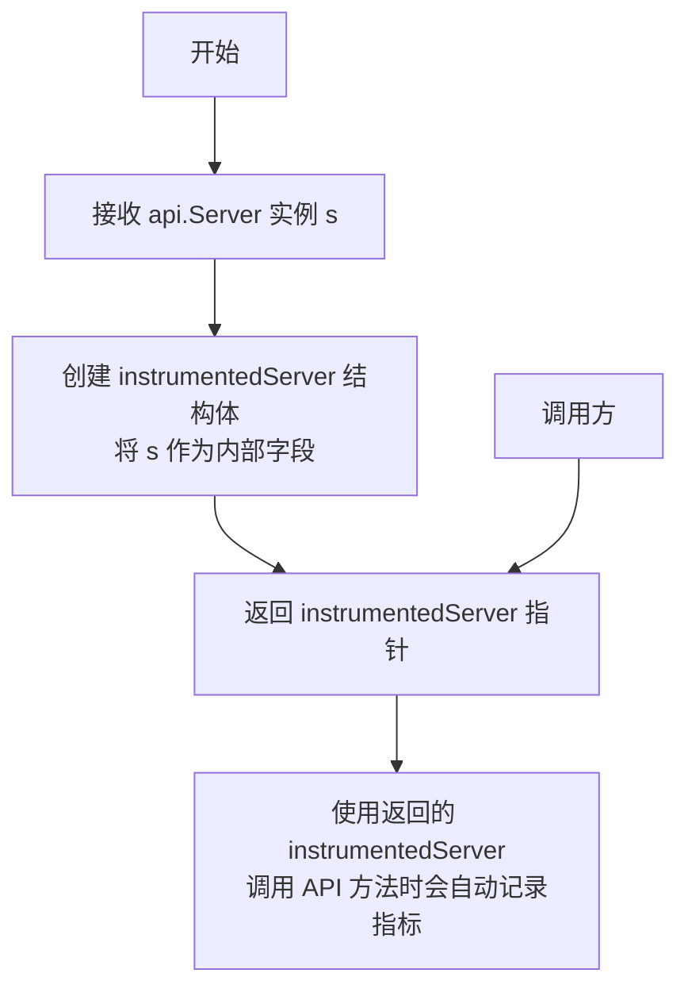

#### 带注释源码

```go
// Instrument 是一个装饰器工厂函数，用于为 api.Server 添加 Prometheus 指标监控能力
// 参数 s: 原始的 Flux API 服务器实现了 api.Server 接口
// 返回: 带有请求耗时指标记录的包装服务器实例
func Instrument(s api.Server) *instrumentedServer {
    // 创建 instrumentedServer 结构体实例，将原始服务器封装在内部
    // instrumentedServer 实现了 api.Server 接口，可以替代原始服务器使用
    return &instrumentedServer{s}
}
```


### `Instrument`

`Instrument` 是一个工厂函数（Factory Function），用于创建一个装饰了 Prometheus 指标监控功能的 `instrumentedServer` 实例。它接受一个实现了 `api.Server` 接口的原始服务器对象，并返回一个包装后的服务器实例，使得所有 API 调用都会自动记录请求耗时和成功/失败状态的指标。

参数：

-  `s`：`api.Server`，被装饰的原始 Flux API 服务器实例，包含了所有业务逻辑实现

返回值：`*instrumentedServer`，返回包装了指标监控功能的 instrumentedServer 指针

#### 流程图

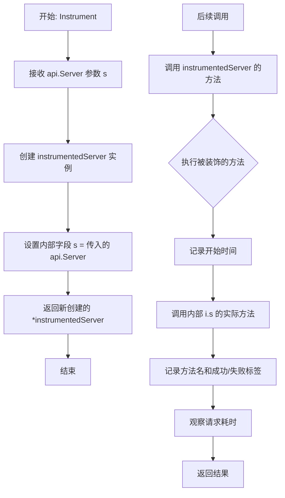

#### 带注释源码

```go
// Instrument 是一个工厂函数，用于为 api.Server 装饰 Prometheus 指标监控功能
// 参数 s 是被装饰的原始服务器实例，实现了 api.Server 接口
// 返回值是一个 *instrumentedServer，它包装了原始服务器并添加了指标收集能力
func Instrument(s api.Server) *instrumentedServer {
    // 创建一个新的 instrumentedServer 实例
    // 内部持有原始的 api.Server 实例 s
    // 所有对返回实例的方法调用都会经过指标监控包装
    return &instrumentedServer{s}
}
```

#### 相关结构信息

**全局变量：**

- `requestDuration`：`prometheus.Histogram`，用于记录 API 请求耗时的 Prometheus 直方图指标

**类型定义：**

- `instrumentedServer`：实现了 `api.Server` 接口的装饰器结构体，内部持有被装饰的 `api.Server` 实例

**设计模式：** 装饰器模式（Decorator Pattern），在不修改原始服务器代码的情况下为其添加横切关注点（指标监控）


### `instrumentedServer.Export`

该方法是一个装饰器模式实现，通过拦截对底层 API Server 的 `Export` 调用来添加 Prometheus 指标收集功能。它在调用原始方法前后记录请求持续时间，并将结果（包括成功或失败）以直方图形式暴露给监控系统。

参数：

- `ctx`：`context.Context`，上下文对象，用于传递请求范围的取消信号、截止时间以及其他请求元数据

返回值：`config []byte, err error`，返回导出的配置字节数组以及可能发生的错误

#### 流程图

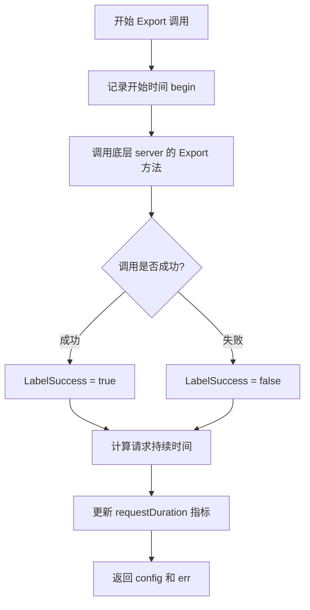

#### 带注释源码

```go
// Export 是 instrumentedServer 的方法，它包装了底层 server 的 Export 方法
// 并添加了 Prometheus 指标收集功能
func (i *instrumentedServer) Export(ctx context.Context) (config []byte, err error) {
    // defer 语句确保在函数返回前执行指标记录逻辑
    // 无论方法是正常返回还是发生 panic，都会记录指标
    defer func(begin time.Time) {
        // 使用 requestDuration 直方图记录请求持续时间
        // 添加两个标签：方法名和成功与否
        requestDuration.With(
            fluxmetrics.LabelMethod, "Export",                          // 标签：方法名为 Export
            fluxmetrics.LabelSuccess, fmt.Sprint(err == nil),          // 标签：是否成功（err 为 nil 表示成功）
        ).Observe(time.Since(begin).Seconds())                        // 记录从开始到现在的秒数
    }(time.Now())                                                      // 传入当前时间作为 begin 参数
    
    // 调用底层被装饰的 server 的 Export 方法
    // 这里使用了委托模式，将请求转发给真实的业务逻辑处理
    return i.s.Export(ctx)
}
```


### `instrumentedServer.ListServices`

这是一个装饰器模式的方法，用于为 `ListServices` 服务添加 Prometheus 指标监控功能。该方法在调用底层服务方法前后记录请求持续时间，并将方法执行的成功或失败状态作为指标标签记录下来，以便于监控系统收集性能指标数据。

参数：

- `ctx`：`context.Context`，上下文对象，用于传递请求范围内的取消信号和截止时间
- `namespace`：`string`，命名空间，用于过滤需要列出服务的作用域

返回值：

- `[]v6.ControllerStatus`：服务列表（控制器状态列表）
- `error`：错误对象，如果发生错误则返回非空错误

#### 流程图

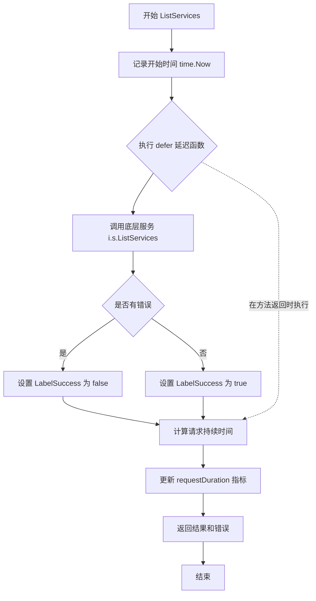

#### 带注释源码

```go
// ListServices 返回指定命名空间下的所有服务列表
// 该方法是装饰器模式的一部分，为底层服务添加了Prometheus指标监控
func (i *instrumentedServer) ListServices(ctx context.Context, namespace string) (_ []v6.ControllerStatus, err error) {
	// 使用 defer 延迟执行指标记录函数
	// 在方法返回时记录请求的持续时间
	defer func(begin time.Time) {
		// 使用 Prometheus 直方图指标记录请求耗时
		requestDuration.With(
			fluxmetrics.LabelMethod, "ListServices",           // 标记方法名为 "ListServices"
			fluxmetrics.LabelSuccess, fmt.Sprint(err == nil),   // 标记请求是否成功 (true/false)
		).Observe(time.Since(begin).Seconds())                  // 记录从开始到现在的秒数
	}(time.Now()) // 记录方法开始执行的时间
	
	// 委托给底层真实的服务对象执行实际的 ListServices 逻辑
	return i.s.ListServices(ctx, namespace)
}
```


### `instrumentedServer.ListServicesWithOptions`

该方法是 `instrumentedServer` 类的成员函数，作为装饰器模式实现，对 `api.Server` 接口的 `ListServicesWithOptions` 方法进行包装，在调用底层服务前后自动记录请求耗时和成功状态的 Prometheus 指标，用于监控和可观测性。

参数：

- `ctx`：`context.Context`，上下文对象，用于传递请求范围内的取消信号和元数据
- `opts`：`v11.ListServicesOptions`，查询选项，包含命名空间、标签筛选器等过滤条件

返回值：`([]v6.ControllerStatus, error)`，返回符合条件的 ControllerStatus 切片以及可能的错误信息

#### 流程图

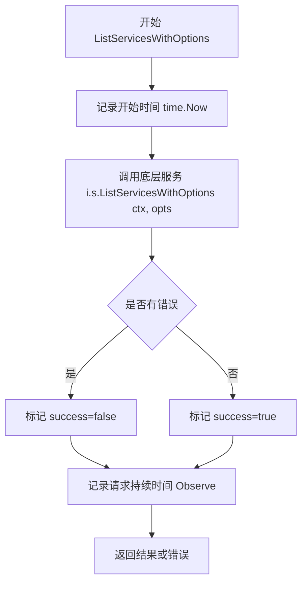

#### 带注释源码

```go
// ListServicesWithOptions 使用给定的选项查询并返回符合条件的服务列表
// 该方法作为装饰器，包装底层Server实现以添加监控能力
func (i *instrumentedServer) ListServicesWithOptions(ctx context.Context, opts v11.ListServicesOptions) 
    // 返回值：服务控制器状态切片和可能发生的错误
    (_ []v6.ControllerStatus, err error) {
    
    // 使用 defer 在函数返回前执行指标记录逻辑
    // 捕获函数开始时间用于计算耗时
    defer func(begin time.Time) {
        // 构建 Prometheus 指标标签
        requestDuration.With(
            fluxmetrics.LabelMethod, "ListServicesWithOptions",       // 方法名标签
            fluxmetrics.LabelSuccess, fmt.Sprint(err == nil),         // 成功与否标签
        ).Observe(time.Since(begin).Seconds())                        // 记录请求耗时秒数
    }(time.Now())                                                      // 立即执行传入 time.Now() 绑定 begin 参数
    
    // 委托给底层被包装的 Server 实例执行实际业务逻辑
    return i.s.ListServicesWithOptions(ctx, opts)
}
```


### `instrumentedServer.ListImages`

该方法是 `instrumentedServer` 类型的 `ListImages` 方法，用于列出符合指定资源规范的镜像。它通过装饰器模式为底层 `api.Server` 的 `ListImages` 方法添加了 Prometheus 指标监控功能，记录请求的处理时间和成功与否。

参数：

- `ctx`：`context.Context`，上下文对象，用于传递请求范围内的取消信号和截止时间
- `spec`：`update.ResourceSpec`，资源规范，指定要列出哪些镜像

返回值：`[]v6.ImageStatus, error`，第一个返回值是镜像状态列表，第二个返回值是错误对象

#### 流程图

```mermaid
flowchart TD
    A[开始 ListImages] --> B[记录开始时间 time.Now]
    B --> C[调用底层服务器 i.s.ListImages 方法]
    C --> D{调用是否有错误}
    D -->|是| E[success = "false"]
    D -->|否| F[success = "true"]
    E --> G[使用 requestDuration 记录请求耗时]
    F --> G
    G --> H[返回镜像状态列表和错误]
```

#### 带注释源码

```go
// ListImages 返回符合指定资源规范的镜像列表，并记录请求指标
// 参数 ctx 用于控制请求生命周期，spec 定义了要查询的镜像资源
func (i *instrumentedServer) ListImages(ctx context.Context, spec update.ResourceSpec) (_ []v6.ImageStatus, err error) {
	// 使用 defer 在方法返回前记录请求耗时
	defer func(begin time.Time) {
		// 构建 Prometheus 指标标签：方法名为 ListImages，成功状态根据 err 是否为 nil
		requestDuration.With(
			fluxmetrics.LabelMethod, "ListImages",
			fluxmetrics.LabelSuccess, fmt.Sprint(err == nil),
		).Observe(time.Since(begin).Seconds()) // 记录从请求开始到现在的耗时秒数
	}(time.Now()) // 记录方法开始执行的时间点
	
	// 委托给底层被装饰的 Server 实例执行实际的 ListImages 逻辑
	return i.s.ListImages(ctx, spec)
}
```


### `instrumentedServer.ListImagesWithOptions`

这是一个在 `instrumentedServer` 类中的方法，采用装饰器模式，对底层的 `api.Server` 实现进行包装，通过 Prometheus 指标监控 `ListImagesWithOptions` 方法的请求 duration 和成功率。

参数：

- `ctx`：`context.Context`，用于传递请求上下文信息，控制请求的生命周期和取消
- `opts`：`v10.ListImagesOptions`，列出镜像时可配置的选项参数

返回值：

- `[]v6.ImageStatus`：镜像状态列表，包含各个镜像的状态信息
- `error`：执行过程中可能发生的错误，如果成功则为 nil

#### 流程图

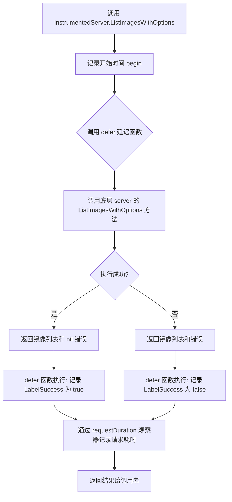

#### 带注释源码

```go
// ListImagesWithOptions 通过装饰器模式包装底层的 Server 实现，
// 在调用前后添加 Prometheus 指标收集，用于监控请求性能和质量。
// 参数 ctx 用于传递上下文信息，opts 包含列出镜像的选项配置。
// 返回镜像状态列表和可能的错误信息。
func (i *instrumentedServer) ListImagesWithOptions(ctx context.Context, opts v10.ListImagesOptions) (_ []v6.ImageStatus, err error) {
    // defer 延迟执行，确保在方法返回前记录请求耗时指标
    defer func(begin time.Time) {
        // 使用 Prometheus Histogram 记录请求耗时
        // 指标包含方法名标签和成功与否标签
        requestDuration.With(
            fluxmetrics.LabelMethod, "ListImagesWithOptions",       // 方法名标签
            fluxmetrics.LabelSuccess, fmt.Sprint(err == nil),      // 成功与否标签（true/false）
        ).Observe(time.Since(begin).Seconds())                     // 记录从请求开始到当前的秒数
    }(time.Now()) // 立即执行，捕获当前时间作为开始时间

    // 委托给底层真实的 Server 实例执行实际的 ListImagesWithOptions 逻辑
    return i.s.ListImagesWithOptions(ctx, opts)
}
```


### `instrumentedServer.UpdateManifests`

该方法是一个装饰器方法，为 `api.Server` 接口的 `UpdateManifests` 方法添加了 Prometheus 指标监控功能。通过在方法执行前后记录请求持续时间，能够追踪更新清单操作的性能表现和成功与否。

参数：

- `ctx`：`context.Context`，Go 语言的上下文对象，用于传递截止时间、取消信号等
- `spec`：`update.Spec`，表示要执行的更新规范，包含了需要更新的资源及其配置信息

返回值：

- `job.ID`：作业的唯一标识符，用于后续查询该更新任务的状态
- `error`：如果更新操作失败，则返回相应的错误信息

#### 流程图

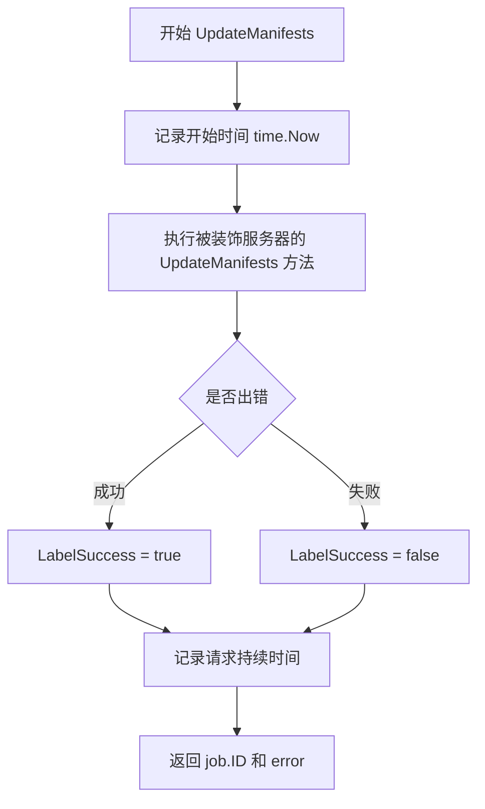

#### 带注释源码

```go
// UpdateManifests 更新清单的方法，带有指标监控功能
// 参数 ctx 用于传递上下文信息，spec 定义了更新的具体规范
// 返回 job.ID 表示创建的更新任务ID，error 表示操作结果
func (i *instrumentedServer) UpdateManifests(ctx context.Context, spec update.Spec) (_ job.ID, err error) {
	// 使用 defer 确保在方法返回前执行指标记录操作
	defer func(begin time.Time) {
		// 记录请求持续时间到 Prometheus 直方图
		// 包含方法名和成功与否的标签
		requestDuration.With(
			fluxmetrics.LabelMethod, "UpdateManifests",          // 方法名标签
			fluxmetrics.LabelSuccess, fmt.Sprint(err == nil),   // 成功与否标签
		).Observe(time.Since(begin).Seconds())                  // 观察请求耗时秒数
	}(time.Now()) // 记录方法开始执行的时间
	
	// 调用被装饰的原始服务器的 UpdateManifests 方法
	return i.s.UpdateManifests(ctx, spec)
}
```


### `instrumentedServer.JobStatus`

该方法是 `instrumentedServer` 类型的成员方法，作为装饰器模式实现，为 `api.Server` 接口的 `JobStatus` 方法添加了 Prometheus 指标监控功能。通过在方法执行前后记录请求持续时间，能够实时监控 Flux 平台对作业状态查询的性能表现。

参数：

- `ctx`：`context.Context`，用于传递上下文信息，例如超时、取消信号等
- `id`：`job.ID`，要查询状态的作业唯一标识符

返回值：

- `_ job.Status`：作业的当前状态信息，包括状态、进度、错误等
- `err error`：执行过程中发生的错误，若成功则为 `nil`

#### 流程图

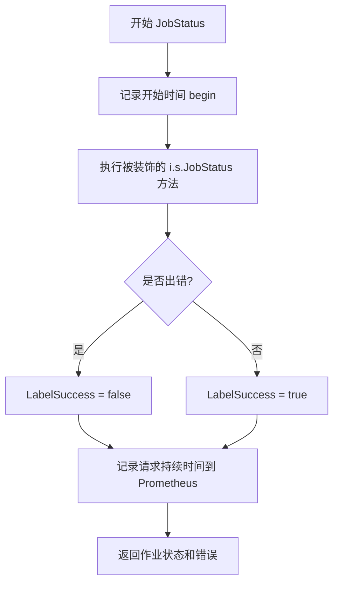

#### 带注释源码

```go
// JobStatus 获取指定作业的当前状态，并记录请求指标
// ctx: 上下文对象，用于控制请求超时和取消
// id: 要查询状态的作业ID
// 返回: job.Status 作业状态信息, error 错误信息
func (i *instrumentedServer) JobStatus(ctx context.Context, id job.ID) (_ job.Status, err error) {
    // 使用 defer 在方法返回前执行指标记录
    defer func(begin time.Time) {
        // 通过 Prometheus 指标记录请求信息
        requestDuration.With(
            fluxmetrics.LabelMethod, "JobStatus",           // 指标方法名
            fluxmetrics.LabelSuccess, fmt.Sprint(err == nil), // 指标成功与否标签
        ).Observe(time.Since(begin).Seconds())              // 记录请求耗时秒数
    }(time.Now()) // 记录方法开始执行的时间
    
    // 委托给被包装的 Server 实例执行实际的业务逻辑
    return i.s.JobStatus(ctx, id)
}
```


### `instrumentedServer.SyncStatus`

该方法是 Flux CD 远程 API 的装饰器实现，通过拦截 `api.Server` 接口的 `SyncStatus` 方法，在调用前后记录请求持续时间的 Prometheus 指标，实现对同步状态查询操作的监控与可观测性。

参数：

- `ctx`：`context.Context`，Go 语言的上下文对象，用于传递请求范围的截止日期、取消信号和其他请求范围的值
- `cursor`：`string`，分页游标字符串，用于定位或过滤同步状态的起始位置

返回值：`([]string, error)`，返回同步状态的字符串切片和可能的错误。成功时返回同步状态列表，失败时返回 nil 和错误对象。

#### 流程图

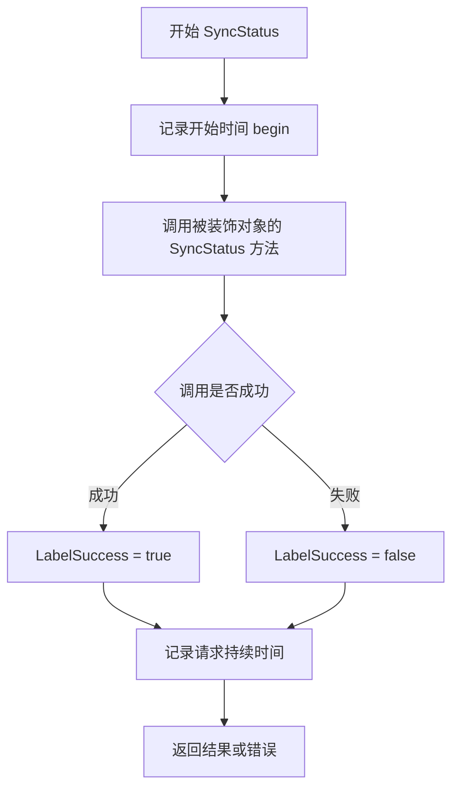

#### 带注释源码

```go
// SyncStatus 查询当前仓库的同步状态
// 它是一个装饰器方法，在调用底层真实 Server 的 SyncStatus 之前记录开始时间，
// 在调用之后计算请求持续时间并将其作为 Prometheus 直方图指标记录下来
func (i *instrumentedServer) SyncStatus(ctx context.Context, cursor string) (_ []string, err error) {
	// 使用 defer 延迟执行，确保无论方法正常返回还是异常退出，都会记录指标
	defer func(begin time.Time) {
		// 使用 Prometheus 的 Histogram 指标记录请求持续时间
		requestDuration.With(
			fluxmetrics.LabelMethod, "SyncStatus",          // 指标标签：方法名
			fluxmetrics.LabelSuccess, fmt.Sprint(err == nil), // 指标标签：是否成功
		).Observe(time.Since(begin).Seconds()) // 观察从请求开始到现在的持续时间（秒）
	}(time.Now()) // 立即执行 defer，捕获当前时间作为开始时间
	
	// 委托给被包装的 api.Server 实例执行实际的业务逻辑
	return i.s.SyncStatus(ctx, cursor)
}
```


### `instrumentedServer.GitRepoConfig`

这是一个封装方法，用于为 GitRepoConfig 方法添加 Prometheus 指标监控功能。它通过 defer 机制在方法执行前后记录请求持续时间，并将方法名和成功与否作为标签添加到 Prometheus Histogram 指标中，最后委托给内部 server 实例执行实际的 Git 仓库配置获取逻辑。

参数：

- `ctx`：`context.Context`，上下文参数，用于传递请求范围内的取消信号和超时控制
- `regenerate`：`bool`，是否强制重新生成 Git 仓库配置

返回值：`v6.GitConfig, error`，返回 Git 仓库配置对象以及可能的错误信息

#### 流程图

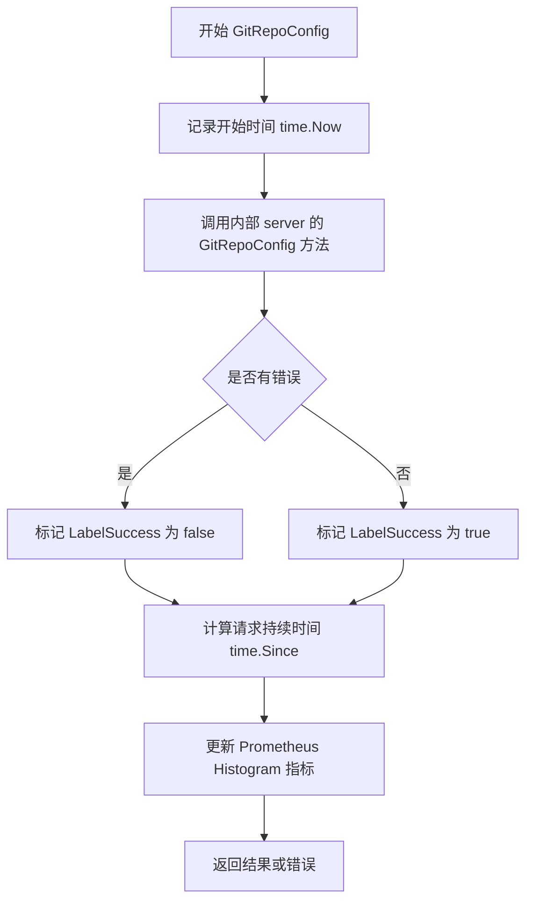

#### 带注释源码

```go
// GitRepoConfig 获取 Git 仓库配置
// 参数 ctx 为上下文对象，regenerate 表示是否强制重新生成配置
// 返回 v6.GitConfig 类型的配置对象和 error 类型的错误信息
func (i *instrumentedServer) GitRepoConfig(ctx context.Context, regenerate bool) (_ v6.GitConfig, err error) {
	// 使用 defer 延迟执行指标记录，确保在方法返回前执行
	defer func(begin time.Time) {
		// 记录请求持续时间到 Prometheus Histogram 指标
		// 包含方法名和成功与否两个标签
		requestDuration.With(
			fluxmetrics.LabelMethod, "GitRepoConfig",           // 标签：方法名
			fluxmetrics.LabelSuccess, fmt.Sprint(err == nil), // 标签：是否成功
		).Observe(time.Since(begin).Seconds()) // 观察请求耗时（秒）
	}(time.Now()) // 记录方法开始执行的时间
	
	// 委托给内部封装的 server 实例执行实际的业务逻辑
	return i.s.GitRepoConfig(ctx, regenerate)
}
```


### `instrumentedServer.Ping`

该方法是对底层 `api.Server` 的 `Ping` 方法的仪表化封装，通过 Prometheus 监控框架记录请求耗时和成功率指标，用于监控 Flux 平台的健康检查调用性能。

参数：

- `ctx`：`context.Context`，请求的上下文，用于传递取消信号和超时控制

返回值：`error`，底层服务器返回的错误（如果有），如果成功则返回 nil

#### 流程图

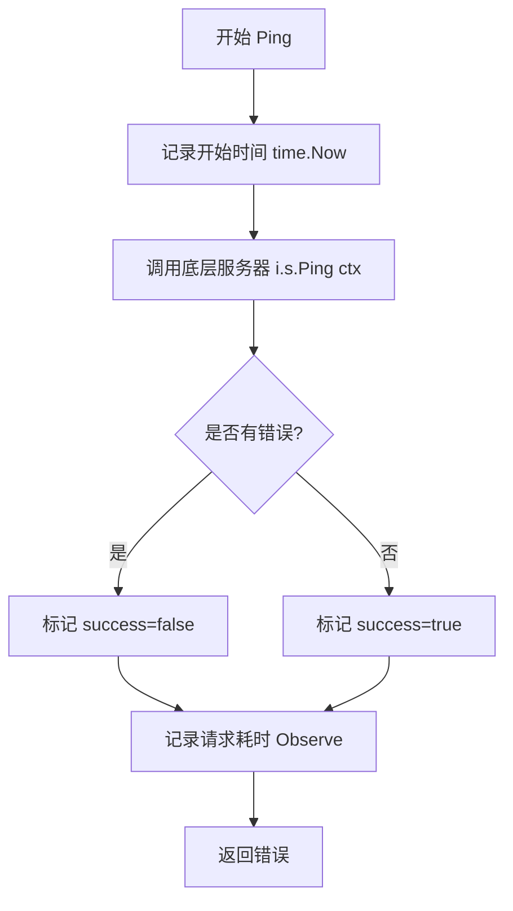

#### 带注释源码

```go
// Ping 方法执行底层的 Ping 调用并记录请求指标
// 参数 ctx: 上下文对象，用于控制请求生命周期
// 返回值: 错误信息，如果底层调用成功则返回 nil
func (i *instrumentedServer) Ping(ctx context.Context) (err error) {
    // defer 确保在方法返回前执行指标记录逻辑
    defer func(begin time.Time) {
        // 使用 Prometheus Histogram 记录请求耗时
        // 包含两个标签: 方法名 "Ping" 和成功与否
        requestDuration.With(
            fluxmetrics.LabelMethod, "Ping",              // 标签: 方法名
            fluxmetrics.LabelSuccess, fmt.Sprint(err == nil), // 标签: 是否成功
        ).Observe(time.Since(begin).Seconds())           // 记录耗时秒数
    }(time.Now()) // 记录方法调用开始的时刻

    // 委托给底层真实服务器执行实际的 Ping 健康检查
    return i.s.Ping(ctx)
}
```


### `instrumentedServer.Version`

该方法是对 `api.Server` 接口中 `Version` 方法的装饰器包装，通过 Prometheus Histogram 指标记录请求耗时和成功状态，用于监控平台的版本查询性能。

参数：

- `ctx`：`context.Context`，请求的上下文，用于传递超时、取消等控制信息

返回值：`(string, error)`，返回版本字符串（如 "v1.0.0"）和可能的错误信息

#### 流程图

```mermaid
flowchart TD
    A[开始 Version 方法] --> B[记录开始时间 begin = time.Now]
    B --> C[调用被包装服务器方法 i.s.Version(ctx)]
    C --> D{是否有错误?}
    D -->|是| E[标记成功标签为 false]
    D -->|否| F[标记成功标签为 true]
    E --> G[记录请求耗时 Observe]
    F --> G
    G --> H[返回版本字符串和错误]
    H --> I[结束]
    
    style A fill:#e1f5fe
    style G fill:#fff3e0
    style I fill:#e8f5e9
```

#### 带注释源码

```go
// Version 返回当前平台的版本信息
// 该方法通过装饰器模式包装了 api.Server 的 Version 方法
// 添加了 Prometheus 指标监控以追踪请求性能和成功率
func (i *instrumentedServer) Version(ctx context.Context) (v string, err error) {
	// defer 确保在方法返回前执行指标记录逻辑
	defer func(begin time.Time) {
		// 使用 Prometheus Histogram 记录请求耗时
		// 指标包含两个标签：
		//   - LabelMethod: "Version" 方法名
		//   - LabelSuccess: 错误是否为 nil（"true" 或 "false"）
		requestDuration.With(
			fluxmetrics.LabelMethod, "Version",           // 方法名标签
			fluxmetrics.LabelSuccess, fmt.Sprint(err == nil), // 成功与否标签
		).Observe(time.Since(begin).Seconds()) // 观察从开始到现在的耗时秒数
	}(time.Now()) // 立即执行，获取当前时间作为 begin
	
	// 委托给被包装的服务器实例执行实际的 Version 逻辑
	return i.s.Version(ctx)
}
```


### `instrumentedServer.NotifyChange`

该方法是一个包装器方法，用于为底层的 `api.Server` 实现添加Prometheus指标监控功能。它在调用实际的 `NotifyChange` 方法前后记录请求耗时和成功与否的指标，从而实现对 Flux 服务端点调用的可观测性。

参数：

- `ctx`：`context.Context`，请求的上下文，用于传递超时、取消等控制信息
- `change`：`v9.Change`，变更通知对象，包含需要通知的变更详情

返回值：`error`，如果底层服务调用返回错误则返回该错误，否则返回 nil

#### 流程图

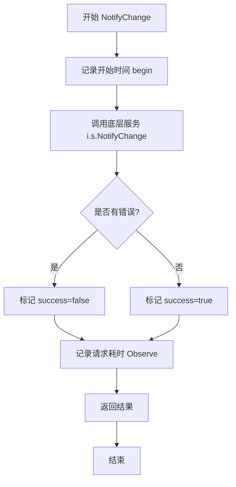

#### 带注释源码

```go
// NotifyChange 是 instrumentedServer 的方法，用于在调用底层服务的 NotifyChange 方法时
// 记录请求耗时和成功状态的 Prometheus 指标
func (i *instrumentedServer) NotifyChange(ctx context.Context, change v9.Change) (err error) {
    // 使用 defer 确保在方法返回时执行指标记录，无论方法是正常返回还是发生错误
    defer func(begin time.Time) {
        // 通过 requestDuration 直方图记录请求耗时
        // 使用两个标签：方法名为 "NotifyChange"，成功状态根据 err 是否为空确定
        requestDuration.With(
            fluxmetrics.LabelMethod, "NotifyChange",        // 标签：方法名
            fluxmetrics.LabelSuccess, fmt.Sprint(err == nil), // 标签：是否成功（true/false）
        ).Observe(time.Since(begin).Seconds()) // 记录从方法开始到当前的耗时秒数
    }(time.Now()) // 记录方法开始时的时间

    // 调用底层 api.Server 实现的 NotifyChange 方法
    // 这是实际的业务逻辑处理，instrumentedServer 只是在其周围添加监控
    return i.s.NotifyChange(ctx, change)
}
```

## 关键组件


### instrumentedServer 结构体

一个仪表化服务器结构体，实现了 api.Server 接口，对所有 API 方法进行请求耗时监控。它内部包装了一个真实的 api.Server 实例，通过装饰器模式为其添加 Prometheus 指标收集功能。

### requestDuration 全局变量

Prometheus 直方图指标，用于记录 Flux 平台的请求持续时间（以秒为单位）。该指标包含方法名和成功与否两个标签，用于细粒度监控各 API 方法的性能表现。

### Instrument 函数

工厂函数，用于创建仪表化的服务器实例。它接收一个 api.Server 接口实现作为参数，返回一个 *instrumentedServer 实例，使得原有的服务器自动具备监控能力。

### API 方法包装器

代码中包含了 12 个 API 方法的仪表化包装器：Export、ListServices、ListServicesWithOptions、ListImages、ListImagesWithOptions、UpdateManifests、JobStatus、SyncStatus、GitRepoConfig、Ping、Version、NotifyChange。每个方法都通过 defer 延迟执行的方式，在方法返回前记录请求耗时到 Prometheus 指标中，实现无侵入式的性能监控。

### defer 监控模式

每个 API 方法都使用相同的监控模式：通过 defer 关键字在方法返回时记录请求开始时间到结束时间的差值，使用 requestDuration 指标的 Observe 方法记录耗时，同时通过 LabelMethod 和 LabelSuccess 标签标记方法名和成功状态。

## 问题及建议


### 已知问题

- **严重的代码重复**：每个方法都包含完全相同的 defer 逻辑（记录 requestDuration），仅 labelMethod 不同，导致约 120 行重复代码，维护性差。
- **缺少输入验证**：Instrument 函数未检查传入的 api.Server 参数是否为 nil，可能导致运行时空指针异常。
- **版本混用问题**：代码中同时导入了 v6、v9、v10、v11 四个版本的 API，这种多版本混用增加了代码复杂度且不利于长期维护。
- **指标标签基数风险**：LabelMethod 使用字符串方法名作为标签值，当 API 方法增多时会导致高基数（high cardinality）问题，影响 Prometheus 性能。
- **缺乏错误上下文**：仅使用 err == nil 判断成功/失败，未记录错误类型或错误码，调试时难以追溯具体失败原因。

### 优化建议

- **提取公共仪器化逻辑**：创建一个辅助方法接受方法名和错误参数，统一处理 defer 逻辑，例如：`func (i *instrumentedServer) instrument(ctx context.Context, method string, errPtr *error)`。
- **添加参数校验**：在 Instrument 函数中添加 `if s == nil { return nil }` 或使用 panic/日志警告。
- **统一 API 版本**：评估是否可统一使用单一最新版本（v11），减少多版本维护成本。
- **增强错误标签**：将 LabelSuccess 改为更详细的错误标签，如错误类型或错误码，便于问题排查。
- **考虑使用 Go Kit 完整特性**：可结合 go-kit 的 middleware 模式（如 go-kit/kit/endpoint.Middleware）实现更优雅的仪器化。
- **添加超时和上下文处理**：在仪器化逻辑中检查 ctx 是否已取消或超时，可提前终止记录。

## 其它


### 设计目标与约束

本代码采用装饰器模式（Decorator Pattern），在不修改原有 api.Server 实现的前提下，为 Flux 平台的远程 API 服务添加统一的 Prometheus 指标监控能力。设计目标包括：1）透明化地记录所有 API 方法的请求耗时和成功率；2）保持与被包装 Server 的接口完全兼容；3）遵循 Go 语言惯用的装饰器模式实现风格。约束条件包括：依赖 go-kit/metrics 和 prometheus client 库、必须在有 Prometheus 采集环境才能发挥作用、指标采集本身会带来轻微的性能开销。

### 错误处理与异常设计

本模块本身不进行复杂的错误处理逻辑，主要通过装饰器将底层 Server 的错误透明传递。错误处理遵循以下原则：1）所有方法的错误通过 defer 闭包捕获并记录到指标中，使用 `fmt.Sprint(err == nil)` 将错误转换为成功/失败的标签值；2）不吞没任何底层返回的错误，错误最终仍会返回给调用者；3）指标记录失败（如 Prometheus 客户端内部错误）不会影响主业务逻辑的执行。异常情况主要包括：context 超时取消、底层 Server  panic 导致的不可恢复错误（未做 recover 保护）。

### 数据流与状态机

数据流遵循经典的装饰器模式：调用方 → instrumentedServer（指标记录） → 原始 api.Server（业务处理） → 返回结果。状态机方面，本模块为无状态设计，所有方法都是请求-响应模式，不维护内部状态。唯一的状态是包装的原始 Server 实例 s，该实例由构造函数 Instrument 在初始化时注入，生命周期与 instrumentedServer 相同。

### 外部依赖与接口契约

主要外部依赖包括：1）github.com/go-kit/kit/metrics/prometheus - Prometheus 指标定义和收集；2）github.com/prometheus/client_golang/prometheus - Prometheus Go 客户端库；3）github.com/fluxcd/flux/pkg/api - 核心 Server 接口定义；4）各版本 API 包（v6、v9、v10、v11）- 提供各种数据类型和选项结构。接口契约：instrumentedServer 必须完全实现 api.Server 接口的所有方法，当前通过 `var _ api.Server = &instrumentedServer{}` 进行编译时接口完整性检查。

### 并发与线程安全性

本模块是并发安全的：1）指标记录使用 Prometheus 客户端库，该库内部实现了线程安全的计数器和高向图操作；2）instrumentedServer 本身不包含可变状态，所有方法都是幂等的；3）被包装的 api.Server 实例 s 的并发安全性由其自身实现决定，instrumentedServer 不会引入额外的线程安全问题。

### 测试策略

建议的测试策略包括：1）单元测试 - 验证每个包装方法的参数传递正确性和错误透传能力，可使用 mock Server 进行测试；2）集成测试 - 验证 Prometheus 指标能够正确采集和暴露；3）接口兼容性测试 - 确保在 api.Server 接口新增方法时，instrumentedServer 必须同步更新实现。测试覆盖重点应放在指标标签的正确性（方法名、成功状态）和时间观察的正确性上。

### 性能考虑与优化空间

当前实现存在轻微的性能开销：1）每个请求都会创建 defer 闭包和 time.Now() 调用；2）指标标签的字符串拼接（使用 fmt.Sprint）会带来少量分配。优化方向：1）对于极端高性能场景，可考虑使用 sync.Pool 复用计时器；2）预先定义方法名常量避免运行时字符串创建；3）在高并发场景下，指标记录可考虑异步非阻塞方式（当前为同步）。但考虑到 API 调用的本身耗时，指标开销通常可忽略。

### 安全考虑

本模块不涉及敏感数据处理，安全考量相对较少：1）指标数据会暴露方法调用频率和耗时信息，需注意这些信息是否可被未授权访问；2）如果底层 Server 涉及认证信息，需确保 instrumentedServer 不会意外记录敏感参数到日志或指标中；3）当前实现仅记录方法名和成功/失败状态，不记录请求参数和返回值的详细内容，符合最小化敏感信息暴露原则。

### 版本兼容性

本模块依赖于 flux 的多个 API 版本（v6、v9、v10、v11），需要关注：1）当 flux 升级 API 版本时，可能需要更新 import 的包路径；2）api.Server 接口可能会在未来版本中增加新方法，instrumentedServer 需要同步实现否则会导致编译错误；3）Prometheus 指标名称采用 "flux_platform_request_duration_seconds" 格式，更改可能影响历史仪表盘和告警规则，建议在版本更新时保持指标名称稳定性。


    