# `flux\pkg\remote\mock.go` 详细设计文档

这是一个用于测试Flux CD API服务器实现的MockServer模拟对象，提供了完整的API方法模拟和测试电池函数，用于验证各种传输层对API服务器的封装是否正确保留参数和返回值。

## 整体流程

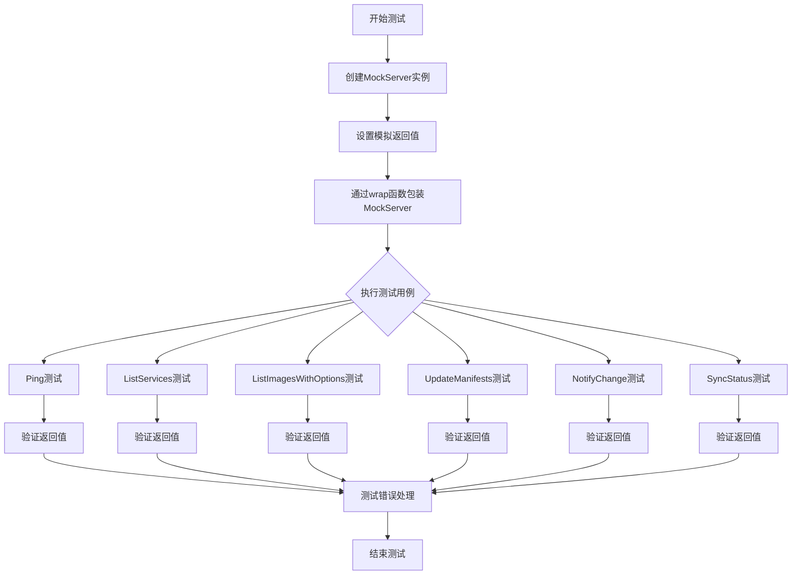

## 类结构

```
api.Server (接口)
└── MockServer (实现结构体)
```

## 全局变量及字段


### `_`
    
接口断言变量，用于确保MockServer实现了api.Server接口

类型：`api.Server`
    


### `MockServer.PingError`
    
Ping方法的错误返回，用于模拟ping失败场景

类型：`error`
    


### `MockServer.VersionAnswer`
    
Version方法的版本号返回值

类型：`string`
    


### `MockServer.VersionError`
    
Version方法的错误返回，用于模拟获取版本失败场景

类型：`error`
    


### `MockServer.ExportAnswer`
    
Export方法的导出数据返回值

类型：`[]byte`
    


### `MockServer.ExportError`
    
Export方法的错误返回，用于模拟导出失败场景

类型：`error`
    


### `MockServer.ListServicesAnswer`
    
ListServices方法的服务列表返回值

类型：`[]v6.ControllerStatus`
    


### `MockServer.ListServicesError`
    
ListServices方法的错误返回，用于模拟查询服务失败场景

类型：`error`
    


### `MockServer.ListImagesAnswer`
    
ListImages方法的镜像列表返回值

类型：`[]v6.ImageStatus`
    


### `MockServer.ListImagesError`
    
ListImages方法的错误返回，用于模拟查询镜像失败场景

类型：`error`
    


### `MockServer.UpdateManifestsArgTest`
    
用于验证UpdateManifests方法参数的测试函数

类型：`func(update.Spec) error`
    


### `MockServer.UpdateManifestsAnswer`
    
UpdateManifests方法的作业ID返回值

类型：`job.ID`
    


### `MockServer.UpdateManifestsError`
    
UpdateManifests方法的错误返回，用于模拟更新清单失败场景

类型：`error`
    


### `MockServer.NotifyChangeError`
    
NotifyChange方法的错误返回，用于模拟通知变更失败场景

类型：`error`
    


### `MockServer.SyncStatusAnswer`
    
SyncStatus方法的同步状态返回值，包含提交哈希列表

类型：`[]string`
    


### `MockServer.SyncStatusError`
    
SyncStatus方法的错误返回，用于模拟获取同步状态失败场景

类型：`error`
    


### `MockServer.JobStatusAnswer`
    
JobStatus方法的作业状态返回值

类型：`job.Status`
    


### `MockServer.JobStatusError`
    
JobStatus方法的错误返回，用于模拟查询作业状态失败场景

类型：`error`
    


### `MockServer.GitRepoConfigAnswer`
    
GitRepoConfig方法的Git仓库配置返回值

类型：`v6.GitConfig`
    


### `MockServer.GitRepoConfigError`
    
GitRepoConfig方法的错误返回，用于模拟获取Git配置失败场景

类型：`error`
    
    

## 全局函数及方法


### `ServerTestBattery`

该函数是一个测试电池（test battery），用于全面测试 API Server 的各种方法。它通过创建一个 MockServer 并使用 wrap 函数将其包装成不同传输层（HTTP、gRPC 等）的客户端，然后依次测试 Ping、ListServices、ListImages、UpdateManifests、NotifyChange 和 SyncStatus 等方法，验证参数和返回值在不同传输层间是否保持完整。

参数：

- `t`：`testing.T`，Go 测试框架的测试对象，用于报告测试失败
- `wrap`：`func(mock api.Server) api.Server`，包装函数，用于将 MockServer 包装成不同传输层的 Server 实现（如 HTTP、gRPC 等）

返回值：无返回值（`void`），通过 `t.Error` 和 `t.Fatal` 报告测试结果

#### 流程图

```mermaid
flowchart TD
    A[开始 ServerTestBattery] --> B[设置测试数据: namespace, serviceID, services]
    C[设置时间戳 now] --> D[创建 imageID]
    D --> E[构建 serviceAnswer: []v6.ControllerStatus]
    E --> F[构建 imagesAnswer: []v6.ImageStatus]
    F --> G[构建 syncStatusAnswer: []string]
    G --> H[构建 updateSpec 和 checkUpdateSpec 验证函数]
    H --> I[创建 MockServer 实例并初始化字段]
    I --> J[创建 context.Context]
    J --> K[调用 wrap(mock) 创建 client]
    
    K --> L[测试 client.Ping]
    L --> M{是否有错误?}
    M -->|是| N[t.Fatal 报告错误]
    M -->|否| O[测试 client.ListServices]
    
    O --> P[验证 ListServices 返回值]
    P --> Q[设置 ListServicesError]
    Q --> R{是否返回错误?}
    R -->|否| S[t.Error 报告错误]
    R -->|是| T[测试 client.ListImagesWithOptions]
    
    T --> U[验证 ListImagesWithOptions 返回值]
    U --> V[设置 ListImagesError]
    V --> W{是否返回错误?}
    W -->|否| X[t.Error 报告错误]
    W -->|是| Y[测试 client.UpdateManifests]
    
    Y --> Z[验证 UpdateManifests 返回值]
    Z --> AA[设置 UpdateManifestsError]
    AA --> AB{是否返回错误?}
    AB -->|否| AC[t.Error 报告错误]
    AB -->|是| AD[测试 client.NotifyChange]
    
    AD --> AE[测试 client.SyncStatus]
    AE --> AF[验证 SyncStatus 返回值]
    AF --> AG[结束测试]
    
    N --> AG
    S --> AG
    X --> AG
    AC --> AG
```

#### 带注释源码

```go
// ServerTestBattery 是一个全面的测试套件，用于验证 API Server 实现
// 参数:
//   - t: testing.T 测试框架对象
//   - wrap: 包装函数，用于将 MockServer 转换为不同传输层的 Server 实现
func ServerTestBattery(t *testing.T, wrap func(mock api.Server) api.Server) {
	// ==================== 1. 测试数据准备 ====================
	// 定义测试用的命名空间
	namespace := "the-space-of-names"
	// 解析服务 ID（格式：namespace/service）
	serviceID := resource.MustParseID(namespace + "/service")
	// 构建服务 ID 列表
	serviceList := []resource.ID{serviceID}
	// 创建 resource.IDSet 集合并添加服务列表
	services := resource.IDSet{}
	services.Add(serviceList)

	// 获取当前 UTC 时间，用于测试 image 创建时间
	now := time.Now().UTC()

	// 解析镜像引用字符串为 image.ID
	imageID, _ := image.ParseRef("quay.io/example.com/frob:v0.4.5")
	// 构建模拟的服务列表响应（ControllerStatus）
	serviceAnswer := []v6.ControllerStatus{
		v6.ControllerStatus{
			ID:     resource.MustParseID("foobar/hello"),
			Status: "ok",
			Containers: []v6.Container{
				v6.Container{
					Name: "frobnicator",
					Current: image.Info{
						ID:        imageID,
						CreatedAt: now,
					},
				},
			},
		},
		v6.ControllerStatus{}, // 空 ControllerStatus
	}

	// 构建模拟的镜像列表响应（ImageStatus）
	imagesAnswer := []v6.ImageStatus{
		v6.ImageStatus{
			ID: resource.MustParseID("barfoo/yello"),
			Containers: []v6.Container{
				{
					Name: "flubnicator",
					Current: image.Info{
						ID: imageID,
					},
				},
			},
		},
	}

	// 构建模拟的同步状态响应（commit 列表）
	syncStatusAnswer := []string{
		"commit 1",
		"commit 2",
		"commit 3",
	}

	// 构建更新规范（UpdateSpec），用于测试 UpdateManifests
	updateSpec := update.Spec{
		Type: update.Images,
		Spec: update.ReleaseImageSpec{
			ServiceSpecs: []update.ResourceSpec{
				update.ResourceSpecAll, // 表示所有服务
			},
			ImageSpec: update.ImageSpecLatest, // 最新镜像
		},
	}
	// 验证函数：检查 UpdateManifests 参数是否与预期一致
	checkUpdateSpec := func(s update.Spec) error {
		if !reflect.DeepEqual(updateSpec, s) {
			return errors.New("expected != actual")
		}
		return nil
	}

	// ==================== 2. 创建 MockServer ====================
	// 初始化 MockServer，设置预设的响应值
	mock := &MockServer{
		ListServicesAnswer:     serviceAnswer,
		ListImagesAnswer:       imagesAnswer,
		UpdateManifestsArgTest: checkUpdateSpec, // 设置参数验证函数
		UpdateManifestsAnswer:  job.ID(guid.New()), // 生成新的 job ID
		SyncStatusAnswer:       syncStatusAnswer,
	}

	// 创建空的 Go context
	ctx := context.Background()

	// ==================== 3. 使用 wrap 函数包装 MockServer ====================
	// 将 MockServer 转换为客户端（可能是 HTTP、gRPC 等不同传输层）
	client := wrap(mock)

	// ==================== 4. 测试 Ping 方法 ====================
	if err := client.Ping(ctx); err != nil {
		t.Fatal(err) // 测试失败，终止测试
	}

	// ==================== 5. 测试 ListServices 方法 ====================
	// 正常情况测试
	ss, err := client.ListServices(ctx, namespace)
	if err != nil {
		t.Error(err)
	}
	// 验证返回值是否与 MockServer 预设值一致
	if !reflect.DeepEqual(ss, mock.ListServicesAnswer) {
		t.Error(fmt.Errorf("expected:\n%#v\ngot:\n%#v", mock.ListServicesAnswer, ss))
	}

	// 错误情况测试：设置 MockServer 返回错误
	mock.ListServicesError = fmt.Errorf("list services query failure")
	ss, err = client.ListServices(ctx, namespace)
	if err == nil {
		t.Error("expected error from ListServices, got nil") // 期望返回错误，但实际没有
	}

	// ==================== 6. 测试 ListImagesWithOptions 方法 ====================
	// 正常情况测试
	ims, err := client.ListImagesWithOptions(ctx, v10.ListImagesOptions{
		Spec: update.ResourceSpecAll,
	})
	if err != nil {
		t.Error(err)
	}
	// 验证返回值
	if !reflect.DeepEqual(ims, mock.ListImagesAnswer) {
		t.Error(fmt.Errorf("expected:\n%#v\ngot:\n%#v", mock.ListImagesAnswer, ims))
	}

	// 错误情况测试
	mock.ListImagesError = fmt.Errorf("list images error")
	if _, err = client.ListImagesWithOptions(ctx, v10.ListImagesOptions{
		Spec: update.ResourceSpecAll,
	}); err == nil {
		t.Error("expected error from ListImages, got nil")
	}

	// ==================== 7. 测试 UpdateManifests 方法 ====================
	// 直接测试 MockServer，验证参数是否正确传递
	jobid, err := mock.UpdateManifests(ctx, updateSpec)
	if err != nil {
		t.Error(err)
	}
	// 验证返回值
	if jobid != mock.UpdateManifestsAnswer {
		t.Error(fmt.Errorf("expected %q, got %q", mock.UpdateManifestsAnswer, jobid))
	}

	// 错误情况测试
	mock.UpdateManifestsError = fmt.Errorf("update manifests error")
	if _, err = client.UpdateManifests(ctx, updateSpec); err == nil {
		t.Error("expected error from UpdateManifests, got nil")
	}

	// ==================== 8. 测试 NotifyChange 方法 ====================
	// 构建 Change 通知对象（Git 变更类型）
	change := v9.Change{Kind: v9.GitChange, Source: v9.GitUpdate{URL: "git@example.com:foo/bar"}}
	if err := client.NotifyChange(ctx, change); err != nil {
		t.Error(err)
	}

	// ==================== 9. 测试 SyncStatus 方法 ====================
	syncSt, err := client.SyncStatus(ctx, "HEAD")
	if err != nil {
		t.Error(err)
	}
	// 验证返回值
	if !reflect.DeepEqual(mock.SyncStatusAnswer, syncSt) {
		t.Errorf("expected: %#v\ngot: %#v", mock.SyncStatusAnswer, syncSt)
	}
	// 测试完成（没有显式返回值，通过 t.Error/t.Fatal 报告结果）
}
```


### `MockServer.Ping`

该方法用于模拟服务器的 Ping 操作，通过返回预设的 `PingError` 来模拟服务器的健康检查结果。

参数：

- `ctx`：`context.Context`，上下文对象，用于控制请求的生命周期、超时和取消

返回值：`error`，返回 `MockServer` 结构体中预设的 `PingError`，若为 `nil` 则表示 Ping 成功

#### 流程图

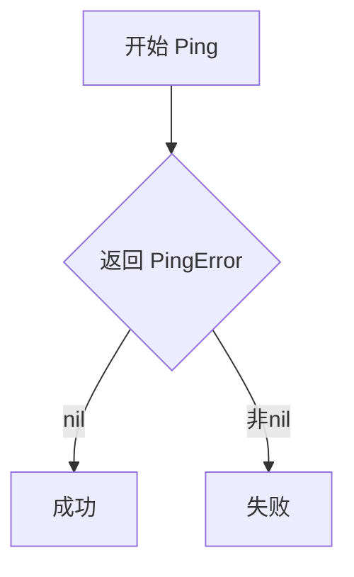

#### 带注释源码

```go
// Ping 模拟服务器的 Ping 操作，用于测试目的
// 参数 ctx 是上下文对象，用于控制请求的超时和取消
// 返回值 error：如果 PingError 为 nil 表示成功，否则返回预设的错误
func (p *MockServer) Ping(ctx context.Context) error {
	return p.PingError
}
```


### `MockServer.Version`

获取模拟服务器的版本信息，根据预先设置的 VersionAnswer 和 VersionError 返回版本字符串或错误。

参数：

- `ctx`：`context.Context`，调用上下文，用于传递请求级别的取消信号和超时信息

返回值：`string, error`，返回模拟的版本字符串和可能发生的错误

#### 流程图

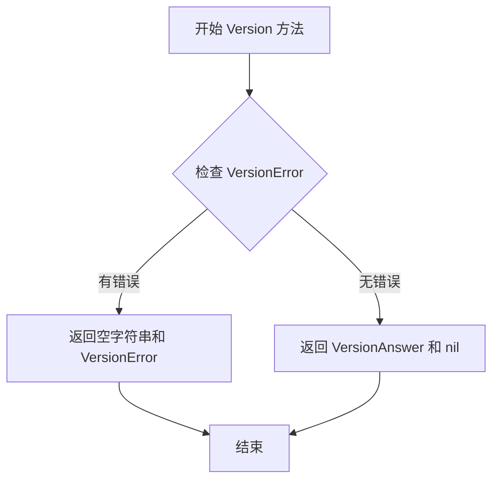

#### 带注释源码

```go
// Version 返回模拟服务器的版本信息
// 参数 ctx 用于传递上下文信息（如取消信号、超时等）
// 返回值：
//   - string: 模拟服务器配置的版本号
//   - error: 如果设置了 VersionError，则返回该错误；否则返回 nil
func (p *MockServer) Version(ctx context.Context) (string, error) {
	// 直接返回预先设置的 VersionAnswer 和 VersionError
	// 这允许测试用例灵活地控制返回值和错误状态
	return p.VersionAnswer, p.VersionError
}
```


### `MockServer.Export`

该方法是 MockServer 结构体的成员方法，用于模拟 API Server 的导出功能，返回预设的导出数据或错误。

参数：

- `ctx`：`context.Context`，上下文信息，用于传递请求级别的取消信号和截止时间

返回值：`([]byte, error)`，返回导出的字节数组数据以及可能的错误信息

#### 流程图

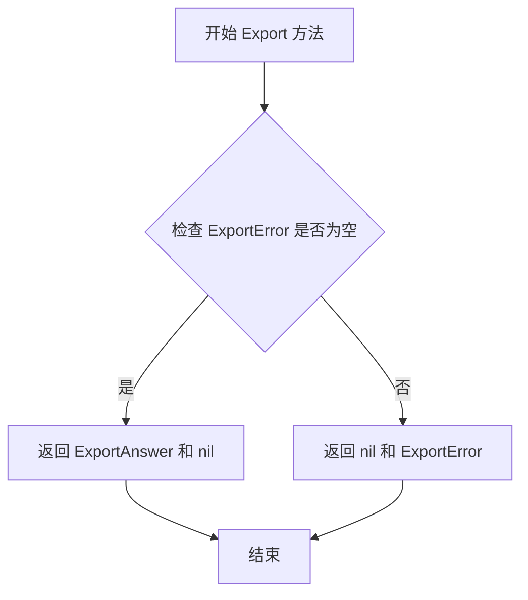

#### 带注释源码

```go
// Export 模拟 API Server 的导出功能
// 参数 ctx 用于传递上下文信息
// 返回导出数据的字节数组和可能的错误
func (p *MockServer) Export(ctx context.Context) ([]byte, error) {
    // 直接返回 MockServer 实例中预设的导出答案和错误
    // 调用方可在测试前通过设置这些字段来控制方法行为
    return p.ExportAnswer, p.ExportError
}
```


### `MockServer.ListServices`

该方法是 `MockServer` 结构体的成员方法，用于模拟 API 服务器的 `ListServices` 功能。它接收上下文和命名空间作为参数，并返回预设的控制器状态列表和可能的错误，适用于测试环境。

#### 参数

- `ctx`：`context.Context`，Go 语言的上下文对象，用于传递截止时间、取消信号以及请求范围内的值
- `ns`：`string`，命名空间名称，用于指定要查询的服务所属的命名空间

#### 返回值

- `[]v6.ControllerStatus`：控制器状态切片，包含命名空间内所有控制器的状态信息
- `error`：执行过程中产生的错误，若无错误则为 `nil`

#### 流程图

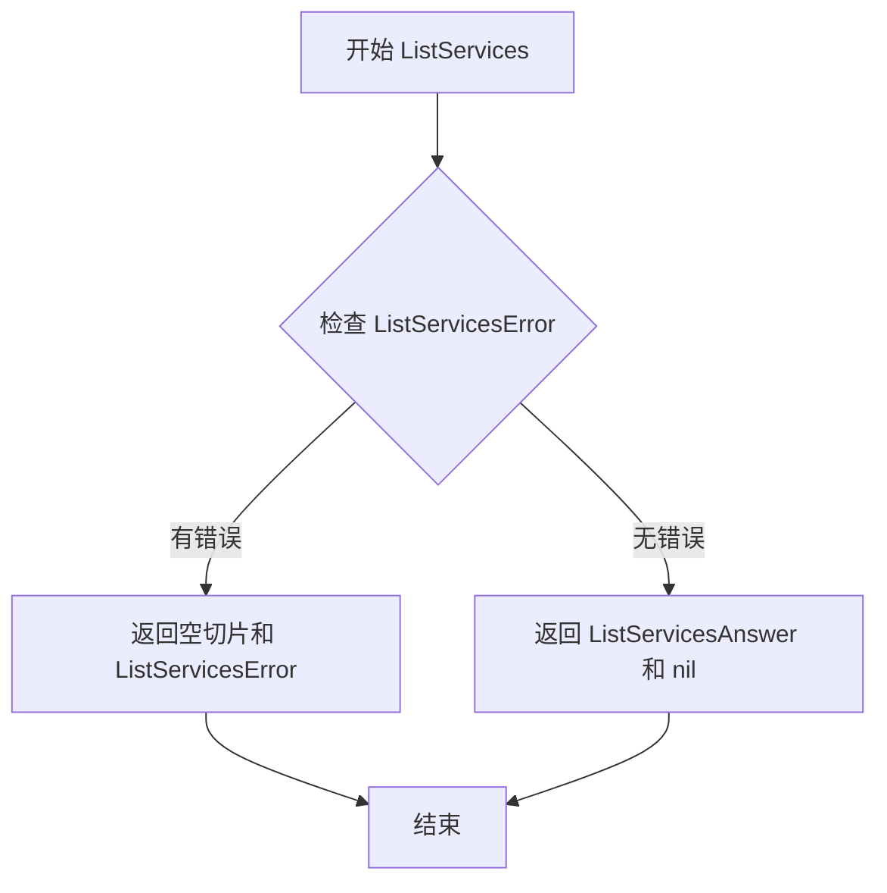

#### 带注释源码

```go
// ListServices 是 MockServer 结构体的方法，用于模拟 API 的 ListServices 接口
// 参数 ctx 为 Go 标准库的上下文，用于超时控制和取消操作
// 参数 ns 为字符串类型，表示要查询的命名空间
func (p *MockServer) ListServices(ctx context.Context, ns string) ([]v6.ControllerStatus, error) {
	// 直接返回 MockServer 实例上预设的答案和错误
	// ListServicesAnswer 预先配置好的控制器状态列表
	// ListServicesError 预先配置好的错误，用于测试错误处理场景
	return p.ListServicesAnswer, p.ListServicesError
}
```


### `MockServer.ListServicesWithOptions`

该方法是 `MockServer` 结构体实现的 API 接口方法，用于模拟返回服务列表的功能。方法接受上下文和查询选项作为参数（但实际未使用），直接返回预先在 `MockServer` 中设置的 `ListServicesAnswer` 和 `ListServicesError`，实现对 `ListServicesWithOptions` 接口调用的模拟。

参数：

- 第一个参数（匿名）：`context.Context`，上下文对象，用于传递请求上下文（代码中未使用）
- 第二个参数（匿名）：`v11.ListServicesOptions`，查询选项，用于过滤服务列表（代码中未使用）

返回值：

- `[]v6.ControllerStatus`，服务控制器状态列表
- `error`，可能的错误信息

#### 流程图

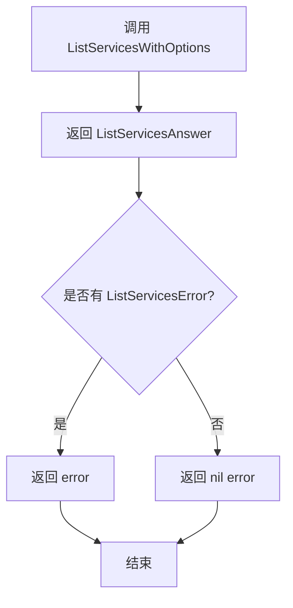

#### 带注释源码

```go
// ListServicesWithOptions 是 MockServer 实现的 API 接口方法
// 用于模拟返回服务列表的功能，忽略传入的上下文和选项参数
func (p *MockServer) ListServicesWithOptions(context.Context, v11.ListServicesOptions) ([]v6.ControllerStatus, error) {
    // 直接返回 MockServer 中预先设置的 ListServicesAnswer（服务列表答案）
    // 和 ListServicesError（可能的错误）
    // 参数 context.Context 和 v11.ListServicesOptions 被忽略（未使用）
    return p.ListServicesAnswer, p.ListServicesError
}
```


### `MockServer.ListImages`

该方法是 MockServer 结构体的模拟实现，用于在测试场景中模拟 API 服务器的 ListImages 功能，直接返回预配置的镜像状态列表和错误信息，简化单元测试流程。

参数：

- 第一个参数（未命名）：`context.Context`，Go 语言的上下文对象，用于传递取消信号和截止时间
- 第二个参数（未命名）：`update.ResourceSpec`，资源规格，指定要查询的镜像资源

返回值：

- `[]v6.ImageStatus`，镜像状态列表，包含镜像的 ID、容器信息等
- `error`，错误信息，当 ListImagesError 不为 nil 时返回该错误

#### 流程图

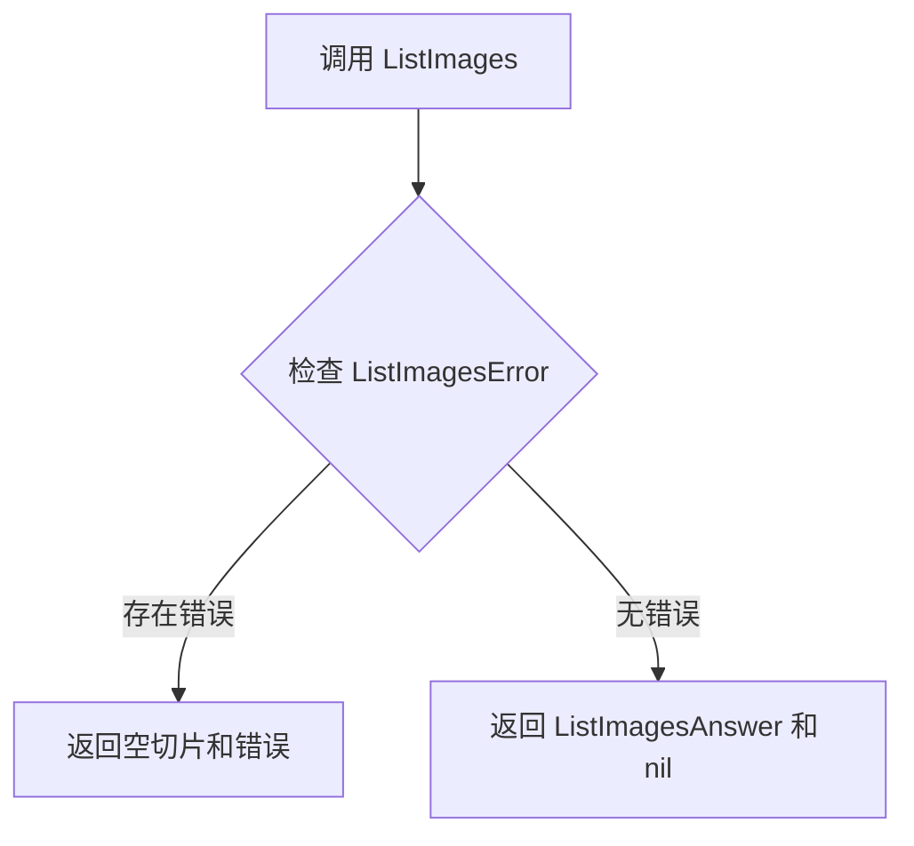

#### 带注释源码

```go
// ListImages 是 MockServer 实现的 API 方法，用于模拟列出镜像信息
// 参数 ctx 为上下文对象，spec 为资源规格（此处未使用）
// 返回预定义的镜像状态列表和可能的错误
func (p *MockServer) ListImages(context.Context, update.ResourceSpec) ([]v6.ImageStatus, error) {
    // 直接返回 MockServer 实例中预设的答案和错误
    // 这种模式允许测试用例灵活控制返回值和错误状态
    return p.ListImagesAnswer, p.ListImagesError
}
```

#### 关键组件信息

| 组件名称 | 描述 |
|---------|------|
| `MockServer` | 模拟 API 服务器结构体，用于测试目的 |
| `ListImagesAnswer` | 预设的镜像状态列表返回值 |
| `ListImagesError` | 预设的模拟错误 |
| `v6.ImageStatus` | 镜像状态的数据结构定义 |

#### 潜在的技术债务或优化空间

1. **参数未使用**：第二个参数 `update.ResourceSpec` 在方法体中完全未使用，这可能导致调用者误解该参数的用途
2. **重复实现**：代码中存在 `ListImages` 和 `ListImagesWithOptions` 两个类似方法，功能几乎完全相同，可能存在代码重复
3. **缺少文档注释**：方法缺少详细的文档说明，对于测试维护者来说可能不够友好

#### 其它项目

**设计目标与约束**：
- 该方法是 `api.Server` 接口的实现，用于支持依赖注入方式的单元测试
- 设计遵循了 Go 语言的接口实现模式，通过 `var _ api.Server = &MockServer{}` 编译时检查接口实现

**错误处理与异常设计**：
- 错误通过预设的 `ListImagesError` 字段传递，而非动态生成
- 调用方需要显式检查返回值中的 error 是否为 nil

**数据流与状态机**：
- 数据流为：测试代码设置 MockServer 字段 → 调用客户端方法 → 客户端通过 RPC 调用 MockServer 方法 → 返回预设值
- 状态完全由测试代码控制，不涉及状态机


### `MockServer.ListImagesWithOptions`

该方法是 `MockServer` 结构体的模拟方法，用于在单元测试中模拟 API 服务器的 `ListImagesWithOptions` 功能，直接返回预先配置的 `ListImagesAnswer` 和 `ListImagesError`，无需真实的业务逻辑处理。

参数：

- `ctx`：`context.Context`，请求的上下文信息
- `opts`：`v10.ListImagesOptions`，查询图像的选项配置

返回值：`([]v6.ImageStatus, error)`，返回图像状态列表和可能出现的错误

#### 流程图

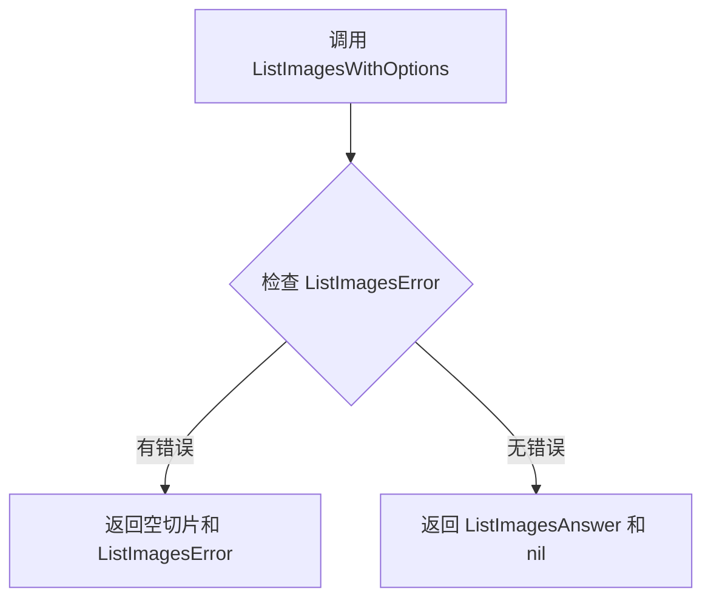

#### 带注释源码

```go
// ListImagesWithOptions 是 MockServer 实现的 API 接口方法
// 用于在测试中模拟返回图像列表的查询结果
// 参数 ctx 为上下文对象，opts 为包含查询条件的选项结构
// 返回值为图像状态切片和错误信息
func (p *MockServer) ListImagesWithOptions(ctx context.Context, opts v10.ListImagesOptions) ([]v6.ImageStatus, error) {
	// 直接返回 MockServer 中预配置的答案和错误
	// 模拟真实的 API 行为而不执行实际逻辑
	return p.ListImagesAnswer, p.ListImagesError
}
```


### `MockServer.UpdateManifests`

该方法是 MockServer 结构体的核心方法之一，用于模拟远程 Flux API 的 UpdateManifests 功能。它接收一个更新规范（update.Spec）作为参数，执行可选的参数验证回调，最终返回预设的任务 ID 或预设的错误。这一方法主要服务于单元测试场景，允许测试代码完全控制模拟服务器的返回值和行为，而无需真实的 GitOps 控制器交互。

**参数：**

- `ctx`：`context.Context`，用于传递上下文信息，如取消信号、超时控制等，通常由调用方传入
- `s`：`update.Spec`，表示一次完整的更新规范，包含了更新类型（如镜像更新）以及具体的更新内容（如目标服务列表、目标镜像等）

**返回值：**

- `job.ID`：返回执行更新操作后生成的任务 ID，用于后续查询任务状态；如果发生错误则返回空 ID
- `error`：如果模拟服务器配置了错误（`UpdateManifestsError`），或者参数验证回调（`UpdateManifestsArgTest`）返回了错误，则返回该错误；否则返回 nil

#### 流程图

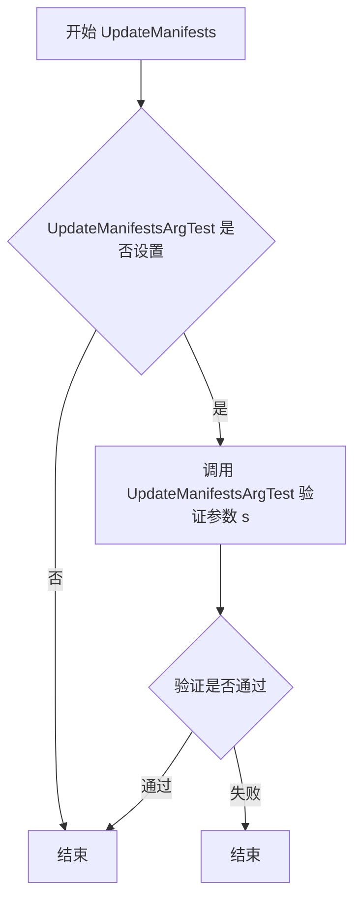

#### 带注释源码

```go
// UpdateManifests 模拟远程服务器的清单更新操作
// ctx: 上下文对象，用于传递超时、取消等控制信息
// s: 更新规范对象，定义了具体的更新内容（镜像、服务等）
func (p *MockServer) UpdateManifests(ctx context.Context, s update.Spec) (job.ID, error) {
    // 检查是否设置了参数验证回调函数
    // 这个回调允许测试代码在方法内部验证传入的 update.Spec 是否符合预期
    if p.UpdateManifestsArgTest != nil {
        // 调用验证回调，传入实际的更新规范 s
        if err := p.UpdateManifestsArgTest(s); err != nil {
            // 如果验证失败，立即返回空任务 ID 和验证错误
            // 这里的错误来自测试代码自定义的验证逻辑
            return job.ID(""), err
        }
    }
    // 验证通过（或未设置验证回调），返回预设的返回值
    // UpdateManifestsAnswer: 模拟服务器预先配置好的任务 ID
    // UpdateManifestsError: 模拟服务器预先配置好的错误（通常为 nil，表示成功）
    return p.UpdateManifestsAnswer, p.UpdateManifestsError
}
```


### `MockServer.NotifyChange`

该方法是一个模拟服务器的实现，用于模拟远程 API 服务器的变更通知功能。它接收一个上下文对象和一个变更对象，并返回预设的错误信息（如果有）。

参数：

- `ctx`：`context.Context`，Go 语言的上下文对象，用于传递请求的截止时间、取消信号等
- `change`：`v9.Change`，要通知的变更对象，包含变更的类型和详细信息

返回值：`error`，如果 `NotifyChangeError` 字段不为 `nil`，则返回该错误；否则返回 `nil`

#### 流程图

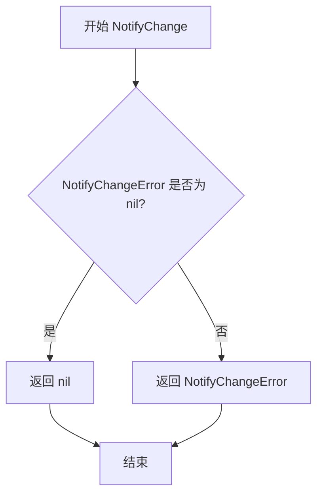

#### 带注释源码

```go
// NotifyChange 模拟服务器处理变更通知的方法
// 参数 ctx 为 Go 标准库的 context，用于控制超时和取消
// 参数 change 为 v9 版本的 Change 对象，表示要通知的变更
// 返回 error 类型，如果设置了 NotifyChangeError 则返回该错误，否则返回 nil
func (p *MockServer) NotifyChange(ctx context.Context, change v9.Change) error {
	return p.NotifyChangeError  // 直接返回预设的错误值，用于测试场景模拟
}
```


### `MockServer.SyncStatus`

该方法用于模拟Flux CD集群的同步状态查询功能，返回指定Git提交引用的同步状态列表，主要用于测试目的。

参数：

- `ctx`：`context.Context`，上下文对象，用于传递请求级别的取消信号和超时信息
- `ref`：`string`，Git提交引用（如"HEAD"、分支名或提交哈希），用于查询特定的同步状态

返回值：

- `[]string`，返回与指定Git引用关联的同步状态列表（如提交哈希列表）
- `error`，如果查询过程中发生错误，则返回相应的错误对象；否则返回nil

#### 流程图

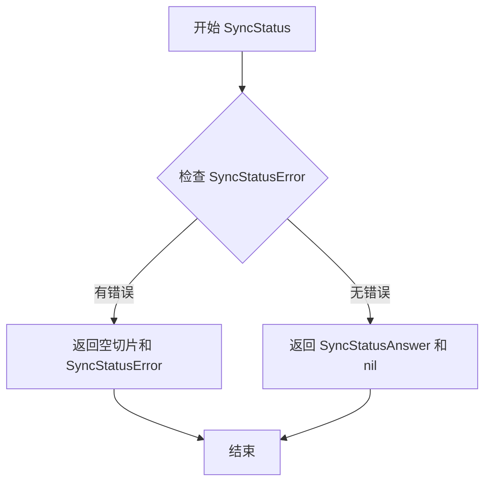

#### 带注释源码

```go
// SyncStatus 返回模拟服务器的同步状态
// 参数 ctx 用于上下文传播，ref 是 Git 引用（如 "HEAD"）
// 返回同步状态切片和可能的错误
func (p *MockServer) SyncStatus(context.Context, string) ([]string, error) {
	// 直接返回 MockServer 结构体中预设的同步状态答案和错误
	// SyncStatusAnswer 存储模拟的同步状态列表（如 ["commit 1", "commit 2", "commit 3"]）
	// SyncStatusError 用于模拟查询失败的情况
	return p.SyncStatusAnswer, p.SyncStatusError
}
```


### `MockServer.JobStatus`

该方法是 MockServer 结构体的成员方法，用于模拟 API 服务器获取指定作业（Job）状态的功能。它直接返回预设的 JobStatusAnswer 和 JobStatusError，用于测试场景中验证调用方对作业状态的处理逻辑。

参数：

- 第一个参数（隐式接收者）：`*MockServer`，指向 MockServer 实例的指针
- 第一个显式参数：`context.Context`，上下文对象，用于传递请求上下文和取消信号（参数名省略，仅保留类型）
- 第二个显式参数：`job.ID`，作业的唯一标识符，用于指定要查询状态的作业（参数名省略，仅保留类型）

返回值：

- `job.Status`：作业的状态信息，由 MockServer 的 JobStatusAnswer 字段提供
- `error`：可能发生的错误，由 MockServer 的 JobStatusError 字段提供

#### 流程图

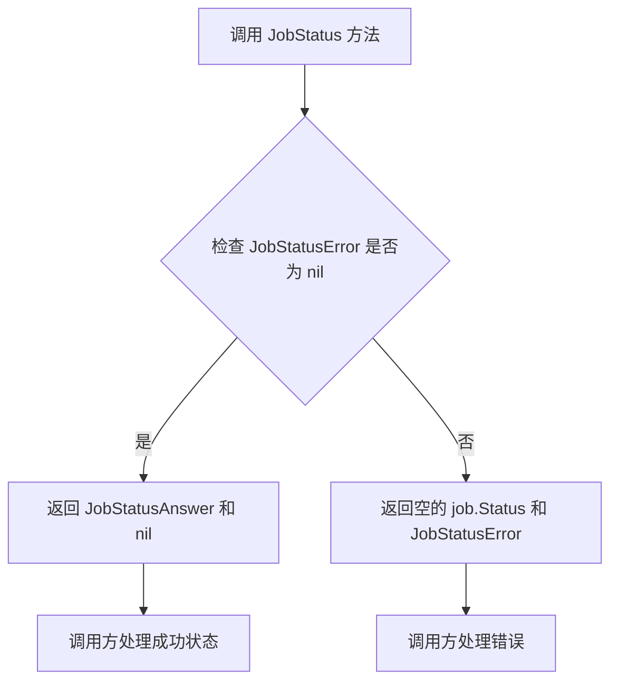

#### 带注释源码

```go
// JobStatus 获取指定作业的状态信息
// 参数 ctx: 上下文对象，用于控制请求生命周期
// 参数 job.ID: 作业的唯一标识符（参数名在函数签名中省略）
// 返回值: job.Status 作业状态, error 可能的错误
func (p *MockServer) JobStatus(context.Context, job.ID) (job.Status, error) {
    // 直接返回 MockServer 结构体中预设的答案和错误
    // 用于测试场景下模拟真实 API 服务器的响应行为
    return p.JobStatusAnswer, p.JobStatusError
}
```


### `MockServer.GitRepoConfig`

获取 Git 仓库配置信息，用于测试场景下模拟 Git 仓库配置的返回。

参数：

- `ctx`：`context.Context`，请求的上下文，用于传递超时、取消等控制信息
- `regenerate`：`bool`，是否强制重新生成 Git 仓库配置

返回值：`v6.GitConfig, error`，返回 Git 仓库配置对象以及可能出现的错误信息

#### 流程图

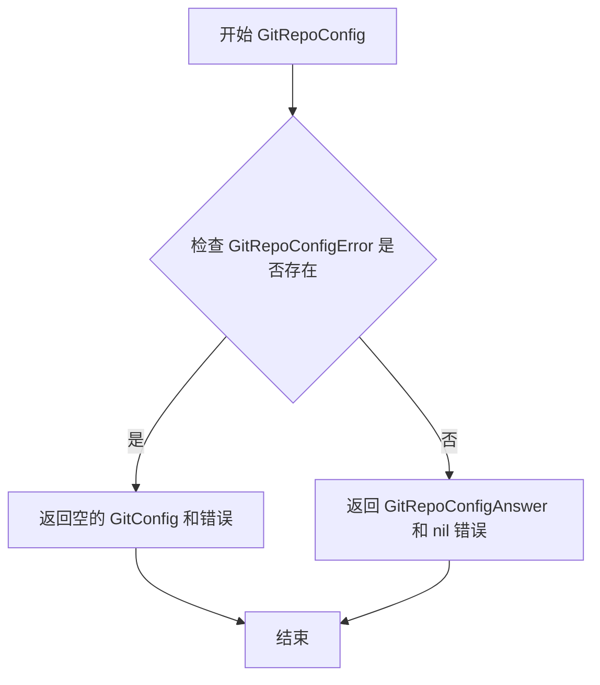

#### 带注释源码

```go
// GitRepoConfig 获取 Git 仓库配置
// ctx: 上下文对象，用于控制请求的生命周期
// regenerate: 布尔值，指示是否需要重新生成配置
func (p *MockServer) GitRepoConfig(ctx context.Context, regenerate bool) (v6.GitConfig, error) {
	// 直接返回 MockServer 中预设的 GitRepoConfigAnswer 和 GitRepoConfigError
	// 如果 GitRepoConfigError 不为 nil，则返回错误信息
	// 这种设计允许测试用例灵活控制返回值和错误场景
	return p.GitRepoConfigAnswer, p.GitRepoConfigError
}
```

## 关键组件


### MockServer 结构体

模拟服务器实现，用于测试 fluxcd API Server 的各种传输层实现。包含多个可配置的字段，用于模拟不同 API 方法的返回值和错误。

### ServerTestBattery 函数

测试电池函数，用于验证 API Server 实现是否正确处理参数和返回答案。通过包装 mock 服务器并执行一系列测试用例来确保传输层正确传递数据。

### Ping 方法

模拟 API 的 Ping 方法，用于测试服务器连通性。返回可配置的 PingError。

### Version 方法

模拟 API 的 Version 方法，返回服务器版本信息。包含 VersionAnswer 和 VersionError 字段用于测试。

### Export 方法

模拟 API 的 Export 方法，返回导出的配置数据。包含 ExportAnswer 和 ExportError 字段。

### ListServices / ListServicesWithOptions 方法

列出命名空间中的服务控制器状态。返回 v6.ControllerStatus 切片，包含服务 ID、状态和容器信息。

### ListImages / ListImagesWithOptions 方法

列出镜像状态信息，根据 ResourceSpec 筛选。返回 v6.ImageStatus 切片，包含镜像 ID 和容器信息。

### UpdateManifests 方法

模拟更新清单的操作，支持自定义参数验证函数 UpdateManifestsArgTest。返回 job.ID 用于后续状态查询。

### NotifyChange 方法

通知配置变更事件，接收 v9.Change 参数。

### SyncStatus 方法

获取 Git 仓库同步状态，返回提交哈希列表。

### JobStatus 方法

查询更新任务的状态，返回 job.Status。

### GitRepoConfig 方法

获取 Git 仓库配置信息，可选择是否重新生成。

## 问题及建议


### 已知问题

-   **结构体缺乏文档注释**: `MockServer` 结构体没有任何文档注释，不符合 Go 语言的命名规范（godoc）。
-   **未使用的参数**: 多个方法（如 `NotifyChange`、`SyncStatus`、`JobStatus`、`GitRepoConfig`）的参数被声明但未在方法体内使用，虽然这在 mock 中是常见做法，但会影响代码可读性。
-   **版本特定的 API 导入**: 代码同时导入了 `v6`、`v9`、`v10`、`v11` 四个版本的 API 包，表明该 mock 需要支持多个 API 版本，这增加了维护复杂度和版本兼容性风险。
-   **代码重复**: `ListServices` 和 `ListServicesWithOptions` 返回完全相同的结果，`ListImages` 和 `ListImagesWithOptions` 亦是如此，造成代码冗余。
-   **空结构体实例化**: `v6.ControllerStatus{}` 创建了一个空结构体实例并添加到返回列表中，这种做法语义不明确，容易造成混淆。
-   **魔法值**: 测试数据中存在硬编码的字符串如 `"commit 1"`、`"the-space-of-names"` 等，缺乏常量定义，可读性和可维护性较差。
- **变量遮蔽**: `serviceList := []resource.ID{serviceID}` 声明了一个变量，但其值并未被直接使用，后续通过 `services.Add(serviceList)` 重新构造，逻辑略显冗余。

### 优化建议

-   为 `MockServer` 添加详细的文档注释，说明其用途和设计意图。
-   将测试相关的魔法值提取为包级别的常量或配置变量，提高可维护性。
-   考虑将 `ListServices` / `ListImages` 的基础实现与 `WithOptions` 版本合并，通过内部逻辑区分或使用组合方式减少代码重复。
-   移除未使用的方法参数（下划线 `_` 开头）或添加注释说明为何保留这些参数以保持 API 兼容性。
-   明确空 `ControllerStatus` 的用途，或替换为更具意义的测试数据。
-   评估是否真的需要支持这么多 API 版本，逐步统一到最新版本以降低维护成本。

## 其它


### 设计目标与约束

该代码的设计目标是提供一个MockServer实现，用于测试fluxcd/flux项目中的API.Server接口。MockServer模拟了远程服务器的各种行为，使测试能够在不依赖真实远程服务的情况下进行。设计约束包括：必须实现api.Server接口的所有方法；测试函数ServerTestBattery设计为通用的包装测试，可用于测试各种传输层实现。

### 错误处理与异常设计

MockServer采用预设错误字段的方式处理异常情况。每个可能失败的方法都对应的Error字段（如PingError、VersionError、ExportError等），当设置这些字段时，方法返回相应的错误。这种设计允许测试用例精确控制每个方法的错误行为，便于验证客户端在各种错误场景下的处理逻辑。UpdateManifests方法还支持通过UpdateManifestsArgTest函数对输入参数进行验证。

### 数据流与状态机

数据流主要体现在ServerTestBattery函数中：测试首先创建MockServer并设置预设的答案和错误，然后通过wrap函数包装成client，client调用各方法后与预设答案进行比对。状态机方面，MockServer本身不维护复杂状态，所有数据都是预先配置好的静态值，测试过程是确定性的。

### 外部依赖与接口契约

MockServer依赖多个外部包：github.com/fluxcd/flux/pkg/api（核心接口）、v6/v9/v10/v11版本的API、guid、image、job、resource、update等包。MockServer通过var _ api.Server = &MockServer{}编译时断言确保实现api.Server接口。ServerTestBattery函数接收一个wrap函数参数，该函数签名為func(mock api.Server) api.Server，用于将MockServer包装成不同传输层的客户端进行测试。

### 安全性考虑

当前代码为测试代码，不涉及直接的安全问题。但在生产使用时需注意：MockServer返回的数据（如GitRepoConfigAnswer）可能包含敏感信息，测试中应避免使用真实凭证。NotifyChange方法接收v9.Change参数，需要验证输入的合法性。

### 性能考虑

MockServer设计为纯内存操作，性能开销极低。ServerTestBattery测试执行时间主要取决于wrap函数的实现。测试中使用的time.Now().UTC()在每次运行时会产生不同时间戳，但由于使用reflect.DeepEqual比较预设值与返回值，测试仍能正确验证。

### 测试策略

采用黑盒测试策略，ServerTestBattery验证API契约的正确性而非实现细节。测试覆盖了正常流程和错误流程：正常流程验证参数传递和返回值正确性；错误流程通过设置Error字段验证错误传播。测试使用reflect.DeepEqual进行深度比较，确保数据结构完全一致。

### 并发考虑

当前代码未实现并发控制机制。在实际使用中，如果多个goroutine共享同一个MockServer实例并修改其字段，可能导致竞态条件。建议测试用例为每个并发场景创建独立的MockServer实例，或在使用前进行适当同步。

### 资源管理

MockServer本身不管理外部资源，所有数据存储在内存中。ServerTestBattery测试函数使用context.Background()创建上下文，测试完成后资源自动释放。测试中创建的imageID、serviceAnswer等对象均为临时对象，由GC回收。

### 可观测性

代码未包含日志或指标收集功能。作为测试辅助代码，当前设计合理。若需增强可观测性，可在MockServer方法中添加日志记录，追踪方法调用顺序和参数。

### 版本兼容性

MockServer实现了多个API版本的接口方法（v6、v9、v10、v11），体现了向后兼容性的考虑。ListServicesWithOptions和ListImagesWithOptions方法分别对应新版本API。测试代码直接引用具体版本号，表明与fluxcd/flux项目的特定版本绑定。

### 配置管理

MockServer的配置通过结构体字段直接赋值实现，属于静态配置方式。测试用例中通过mock := &MockServer{...}一次性设置所有配置项。这种方式简单直观，适合测试场景，但不适合需要动态调整配置的运行时环境。

    