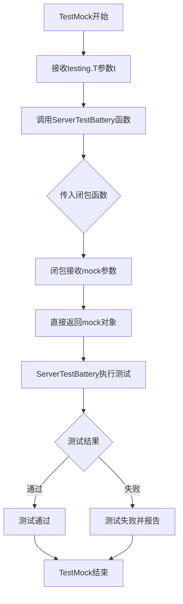

# `flux\pkg\remote\mock_test.go` 详细设计文档

这是一个用于测试 Flux CD 项目中 remote 包 mock 实现的测试文件，通过调用 ServerTestBattery 测试函数验证 api.Server 接口的 mock 对象是否正确实现了预期功能。

## 整体流程

```mermaid
graph TD
    A[开始测试 TestMock] --> B[调用 ServerTestBattery]
B --> C[传入匿名函数 func(mock api.Server) api.Server]
C --> D[匿名函数直接返回 mock 对象]
D --> E[验证 mock 对象是否满足 api.Server 接口]
E --> F[测试通过或失败]
```

## 类结构

```
无类层次结构
该文件为 Go 测试文件，仅包含测试函数
依赖: api.Server (接口，由 github.com/fluxcd/flux/pkg/api 提供)
```

## 全局变量及字段


### `t`
    
测试框架提供的测试对象，用于报告测试失败和日志输出

类型：`*testing.T`
    


### `mock`
    
模拟的API服务器对象，用于测试

类型：`api.Server`
    


### `ServerTestBattery`
    
测试电池函数，用于执行一系列服务器相关的测试（定义位置未知）

类型：`function`
    


    

## 全局函数及方法


### `TestMock`

该测试函数用于验证mock对象是否正确实现了`api.Server`接口，通过调用`ServerTestBattery`测试电池来确认mock的工作状态。

参数：

- `t`：`testing.T`，Go语言标准库的测试框架指针，用于报告测试失败和日志输出

返回值：无（`void`），该函数为测试函数，不返回任何值

#### 流程图



#### 带注释源码

```go
// 包声明：remote包
package remote

// 导入依赖
import (
    "testing"                      // Go标准库测试框架

    "github.com/fluxcd/flux/pkg/api"  // Flux项目的API接口包
)

// 测试函数：TestMock
// 用途：仅用于测试mock对象是否正常工作
// 参数：t *testing.T - Go测试框架提供的测试控制结构
func TestMock(t *testing.T) {
    // 调用ServerTestBattery测试电池
    // 第一个参数：测试控制指针t
    // 第二个参数：匿名闭包函数
    //   - 接收mock对象（类型为api.Server接口）
    //   - 直接返回该mock对象，不做任何处理
    // 这个测试的意图是验证mock对象本身可以被正确传递和使用
    ServerTestBattery(t, func(mock api.Server) api.Server { 
        return mock 
    })
}
```

#### 备注说明

- **设计目标**：此测试函数采用轻量级设计，仅验证mock对象可以正常流转
- **依赖项**：依赖`ServerTestBattery`函数（定义在同包或导入包中）和`api.Server`接口
- **潜在优化空间**：当前测试较为基础，可考虑增加对mock对象具体行为的验证，如调用mock方法并检查返回值
- **接口契约**：mock对象必须实现`api.Server`接口定义的所有方法

## 关键组件


### TestMock 测试函数

TestMock是remote包中的单元测试函数，用于验证mock对象是否正确实现了api.Server接口。该函数调用ServerTestBattery测试电池，传入一个返回mock对象的闭包，确保mock实现满足Server接口的契约。

### ServerTestBattery 全局测试函数

ServerTestBattery是remote包中的全局测试辅助函数，负责执行一组针对api.Server接口实现的测试。该函数接收一个闭包参数，该闭包返回api.Server类型的mock对象，用于隔离测试目标。

### api.Server 接口

api.Server是flux项目定义的服务器接口，定义了一组必须实现的API方法。TestMock测试的目标是验证mock对象是否正确实现了该接口的所有方法，确保与真实服务器实现的行为一致。


## 问题及建议


### 已知问题

-   **测试函数命名缺乏描述性**：函数名`TestMock`过于笼统，未能清晰表达测试的具体意图和验证内容
-   **测试逻辑形同虚设**：测试体仅返回传入的mock参数，完全没有执行任何实际的断言或验证，测试价值极低
-   **缺少测试覆盖**：未对`api.Server`接口的任何方法进行实际测试，无法验证mock实现的正确性
-   **匿名函数设计冗余**：直接返回输入参数的匿名函数是一种"passthrough"模式，在此处没有实际作用
-   **无错误处理机制**：测试代码中未包含任何错误检查或异常情况处理
-   **缺乏注释文档**：代码缺少注释说明测试目的、`ServerTestBattery`的作用以及预期行为

### 优化建议

-   **重命名测试函数**：使用更具描述性的名称，如`TestMockServerImplementsServerInterface`或`TestMockServerBasicFunctionality`
-   **添加实际测试逻辑**：在测试中调用mock对象的方法并进行断言，验证其行为符合预期
-   **扩展测试覆盖**：针对`api.Server`接口的各个方法编写具体的测试用例
-   **添加注释**：在测试函数前添加文档注释，说明测试目的、输入输出和预期结果
-   **考虑删除冗余测试**：如果`ServerTestBattery`已经包含了完整的测试逻辑，这个测试可能是不必要的
-   **引入表驱动测试**：如果需要测试多种mock场景，可考虑使用表驱动测试提高代码复用性


## 其它


### 设计目标与约束

该测试文件的核心目标是验证remote包中的mock实现是否正确履行了其职责。设计约束包括：必须依赖fluxcd/flux/pkg/api包中的Server接口定义，测试必须在Go测试框架下运行，测试函数必须遵循Go测试命名规范（以Test开头）。

### 错误处理与异常设计

测试中的错误处理主要通过Go的testing.T类型完成。当ServerTestBattery或mock对象执行失败时，应调用t.Error()或t.Fatalf()报告错误。异常情况包括：api.Server接口实现不完整、mock对象返回错误、测试超时等。测试应确保每个失败场景都能清晰定位问题。

### 数据流与状态机

数据流从测试入口TestMock开始，通过闭包函数传递给ServerTestBattery，ServerTestBattery内部会创建mock实例并执行测试逻辑。状态机方面，测试本身不涉及复杂状态管理，主要状态转换发生在ServerTestBattery内部对mock对象的调用过程中。

### 外部依赖与接口契约

主要外部依赖包括：1) Go testing标准库 - 提供测试框架；2) github.com/fluxcd/flux/pkg/api.Server接口 - 定义了mock需要实现的接口契约。api.Server接口的具体方法（如Notify、Sync等）由ServerTestBattery测试电池决定，mock必须实现这些方法才能通过测试。

### 性能考虑

由于该测试文件仅包含基础的mock功能验证，性能开销主要来自ServerTestBattery的测试用例数量。建议单个测试函数执行时间控制在毫秒级以内，避免使用time.Sleep等阻塞操作。

### 并发考虑

Go测试默认串行执行，但ServerTestBattery内部可能包含并发测试场景。若存在并发测试，需要确保mock对象是线程安全的（使用sync.Mutex或atomic操作保护共享状态）。

### 配置要求

测试配置主要通过Go测试框架的标准机制实现，如使用环境变量控制测试行为、通过-build Tags限制测试平台等。无需额外的配置文件。

### 命名规范

测试函数遵循Go标准：函数名以Test开头，后续为被测试对象名称（大写开头），如TestMock表示测试mock功能。包名为remote，与被测试代码所在包一致。

### 注释和文档要求

测试文件头部应包含版权和功能说明注释。每个测试函数前应有文档注释描述测试目的。由于该文件依赖ServerTestBattery的外部定义，注释中应注明依赖关系的来源。

### 测试覆盖范围

当前TestMock函数覆盖范围有限，仅验证mock对象能否正确返回。建议扩展测试覆盖：1) 验证mock对象实现了api.Server接口的所有方法；2) 测试mock的返回值是否符合预期；3) 测试mock的错误处理能力。


    