# `flux\pkg\remote\rpc\baseclient.go` 详细设计文档

这是 Flux CD 项目中的一个 RPC 基础客户端存根实现，baseClient 结构体实现了 api.Server 接口的所有方法，但每个方法都返回 UpgradeNeededError，表明这是一个需要升级才能使用的基类实现，用于版本兼容性和接口规范定义。

## 整体流程

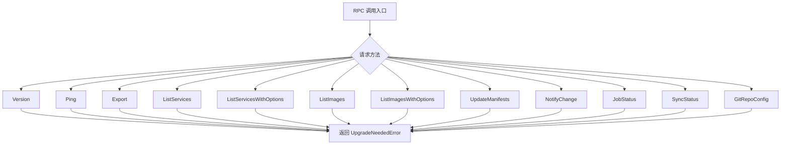

## 类结构

```
api.Server (接口)
└── baseClient (结构体实现)
    ├── Version(context.Context) (string, error)
    ├── Ping(context.Context) error
    ├── Export(context.Context) ([]byte, error)
    ├── ListServices(context.Context, string) ([]v6.ControllerStatus, error)
    ├── ListServicesWithOptions(context.Context, v11.ListServicesOptions) ([]v6.ControllerStatus, error)
    ├── ListImages(context.Context, update.ResourceSpec) ([]v6.ImageStatus, error)
    ├── ListImagesWithOptions(context.Context, v10.ListImagesOptions) ([]v6.ImageStatus, error)
    ├── UpdateManifests(context.Context, update.Spec) (job.ID, error)
    ├── NotifyChange(context.Context, v9.Change) error
    ├── JobStatus(context.Context, job.ID) (job.Status, error)
    ├── SyncStatus(context.Context, string) ([]string, error)
    └── GitRepoConfig(context.Context, bool) (v6.GitConfig, error)
```

## 全局变量及字段


### `_`
    
空接口变量，用于编译时断言baseClient实现了api.Server接口

类型：`api.Server`
    


    

## 全局函数及方法


### `baseClient.Version`

该方法是 `baseClient` 类的成员方法，用于获取 Flux 系统的版本信息。由于该方法在基础客户端中未实现，它会返回一个特定的升级错误，提示调用方需要升级到更高版本的 API。

参数：

- `ctx`：`context.Context`，上下文对象，用于传递请求范围内的取消信号、超时截止日期以及请求级别的元数据

返回值：`string, error`，返回版本字符串（实际为空）和错误对象。当调用此方法时，总是返回 `remote.UpgradeNeededError` 类型的错误，表明需要升级客户端版本。

#### 流程图

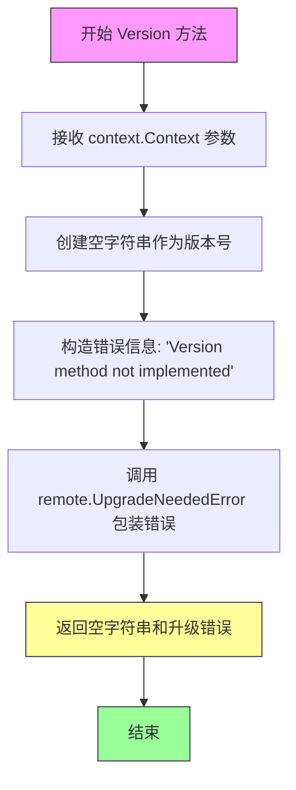

#### 带注释源码

```go
// Version 返回当前 Flux 客户端的版本信息
// 由于 baseClient 是基础实现类，该方法未实际实现版本获取逻辑
// 参数 ctx: 上下文对象，用于控制请求的生命周期
// 返回值: 版本字符串（空）和错误对象（提示需要升级）
func (bc baseClient) Version(context.Context) (string, error) {
	// 返回空字符串作为版本号占位符
	// 并返回 UpgradeNeededError 错误，告知调用方需要升级 API 版本
	return "", remote.UpgradeNeededError(errors.New("Version method not implemented"))
}
```


### `baseClient.Ping`

该方法是一个 RPC 客户端的空实现，用于响应 Ping 请求。当被调用时，它会返回一个升级needed错误，表明该方法尚未实现，需要客户端升级以支持此功能。

参数：

- `ctx`：`context.Context`，调用上下文，用于传递取消信号和截止时间

返回值：`error`，返回 `remote.UpgradeNeededError`，表示需要升级客户端版本

#### 流程图

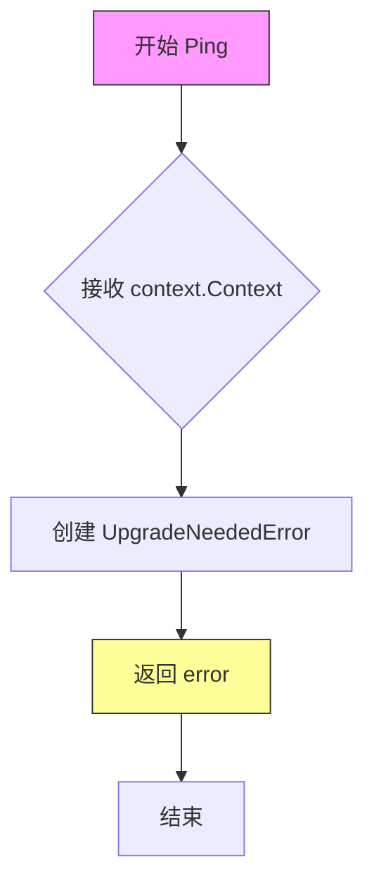

#### 带注释源码

```go
// Ping 方法是 baseClient 实现的 api.Server 接口的一部分
// 用于响应远程客户端的 Ping 请求
func (bc baseClient) Ping(context.Context) error {
	// 返回 UpgradeNeededError 错误，表示该方法未实现
	// 提示调用方需要升级客户端版本以获得完整功能
	return remote.UpgradeNeededError(errors.New("Ping method not implemented"))
}
```


### `baseClient.Export`

该方法是 `baseClient` 类的导出功能方法，用于从 Flux CD 系统中导出配置或资源清单。当前实现未完成功能逻辑，直接返回 `UpgradeNeededError` 错误，提示需要升级客户端以支持此方法。

参数：

- `ctx`：`context.Context`，上下文对象，用于传递请求截止时间、取消信号等

返回值：`([]byte, error)`，第一个返回值是导出的字节数组数据，第二个返回值是操作过程中发生的错误信息

#### 流程图

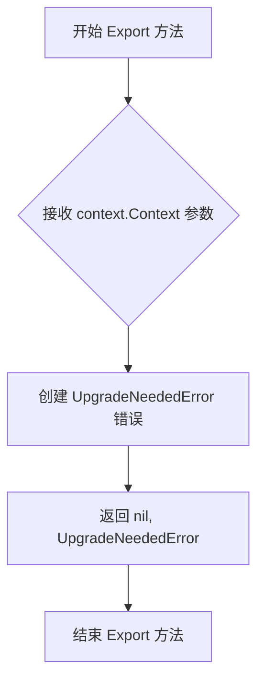

#### 带注释源码

```go
// Export 方法用于导出 Flux CD 系统中的资源配置清单
// 参数 ctx 用于控制请求超时和取消操作
// 返回 ([]byte, error): 
//   - 第一个返回值是导出的配置数据字节数组
//   - 第二个返回值是错误信息，当前版本返回 UpgradeNeededError
func (bc baseClient) Export(context.Context) ([]byte, error) {
    // 返回 nil 数据和升级需求错误
    // 错误信息明确提示该方法在当前版本中未实现
    return nil, remote.UpgradeNeededError(errors.New("Export method not implemented"))
}
```


### `baseClient.ListServices`

该方法是 `baseClient` 类的占位实现，用于列出服务。它接收上下文和命名空间字符串参数，但尚未实现具体功能，目前返回升级需要错误。

参数：

-  (第一个参数无名称)：`context.Context`，Go 方法接收者隐含的上下文参数
-  (第二个参数无名称)：`string`，命名空间标识符

返回值：`([]v6.ControllerStatus, error)`，返回控制器状态切片和错误信息。当前实现返回 `nil` 和升级需要错误。

#### 流程图

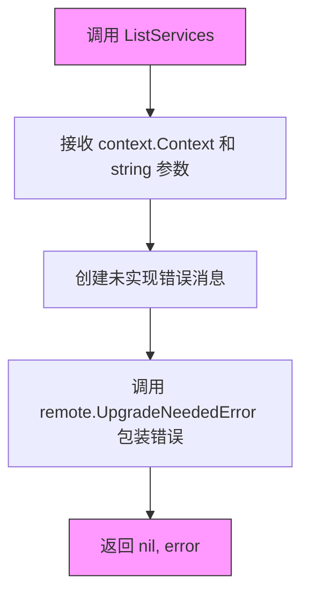

#### 带注释源码

```go
// ListServices 是 baseClient 类型的方法，实现 api.Server 接口
// 该方法用于列出指定命名空间中的所有服务及其状态
// 参数 ctx 提供请求的上下文信息
// 参数 namespace 指定要查询的命名空间
// 返回 []v6.ControllerStatus 包含每个控制器的状态信息
// 返回 error 表示操作过程中的错误
func (bc baseClient) ListServices(context.Context, string) ([]v6.ControllerStatus, error) {
    // 当前版本未实现该方法，返回升级需要错误
    // 提示调用方需要升级客户端以支持此功能
    return nil, remote.UpgradeNeededError(errors.New("ListServices method not implemented"))
}
```


### `baseClient.ListServicesWithOptions`

该方法是 `baseClient` 结构体实现了 `api.Server` 接口的一部分，用于列出服务及其选项。当前实现返回 `UpgradeNeededError`，表明该方法尚未完成实现，需要升级远程协议版本。

参数：

- `ctx`：`context.Context`，Go 标准库的上下文，用于传递超时、取消信号等请求级别的数据
- `opts`：`v11.ListServicesOptions`，v11 版本 API 的服务列表查询选项，包含筛选、排序、分页等配置

返回值：`([]v6.ControllerStatus, error)`，第一个返回值是 v6 版本 API 的控制器状态切片，第二个返回值是标准错误接口

#### 流程图

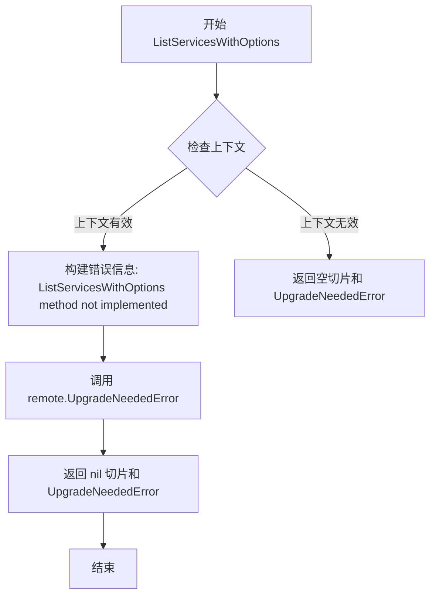

#### 带注释源码

```go
// ListServicesWithOptions 返回满足给定选项的服务列表
// 参数 ctx 用于控制请求生命周期，opts 包含查询过滤条件
// 当前返回 UpgradeNeededError 表示该功能尚未在远程端实现
func (bc baseClient) ListServicesWithOptions(context.Context, v11.ListServicesOptions) ([]v6.ControllerStatus, error) {
    // 返回空切片和升级错误，提示调用方需要升级远程协议版本
    return nil, remote.UpgradeNeededError(errors.New("ListServicesWithOptions method not implemented"))
}
```


### `baseClient.ListImages`

该方法是一个未实现的占位符方法，用于在 RPC 客户端中列出镜像资源。当调用此方法时，会返回 `UpgradeNeededError` 错误，表明需要升级到支持该功能的版本。

参数：

- 第一个参数（隐式）：`context.Context`，Go 语言标准库的上下文对象，用于传递取消信号和超时信息
- 第二个参数：`update.ResourceSpec`，镜像资源规格，指定要列出镜像的目标资源

返回值：

- `[]v6.ImageStatus`，镜像状态切片，包含镜像的详细信息（如镜像标签、Digest 等）
- `error`，错误信息，如果方法未实现或调用失败则返回相应的错误

#### 流程图

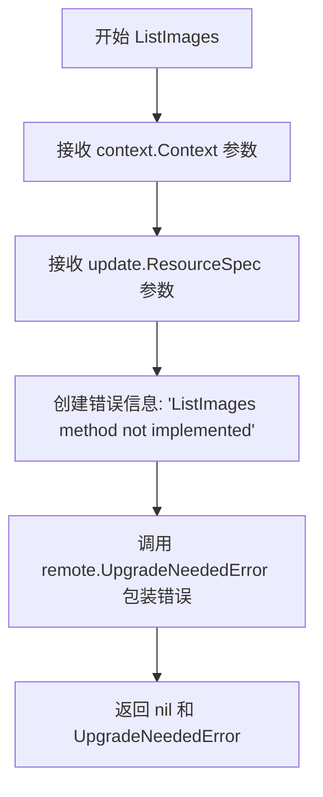

#### 带注释源码

```go
// ListImages 列出指定资源的镜像列表
// 参数说明：
//   - 第一个参数 ctx: 上下文对象，用于控制请求的生命周期
//   - 第二个参数 spec: 资源规格，指定要查询镜像的资源
//
// 返回值：
//   - []v6.ImageStatus: 镜像状态列表
//   - error: 错误信息，当方法未实现时返回 UpgradeNeededError
func (bc baseClient) ListImages(context.Context, update.ResourceSpec) ([]v6.ImageStatus, error) {
    // 返回空切片和升级需要的错误
    // 该方法目前未实现，调用方需要升级到支持此功能的版本
    return nil, remote.UpgradeNeededError(errors.New("ListImages method not implemented"))
}
```


### `baseClient.ListImagesWithOptions`

该方法是 `baseClient` 类的未实现方法，用于列出符合指定选项的容器镜像。由于远程升级未实现，调用此方法会返回升级需要的错误提示。

参数：

- `ctx`：`context.Context`，请求的上下文，用于控制超时和取消
- `opts`：`v10.ListImagesOptions`，列出镜像的查询选项，包含命名空间、服务名等过滤条件

返回值：`([]v6.ImageStatus, error)`，返回镜像状态列表和可能出现的错误。当前实现始终返回 `remote.UpgradeNeededError` 错误，表示该方法需要客户端升级才能使用。

#### 流程图

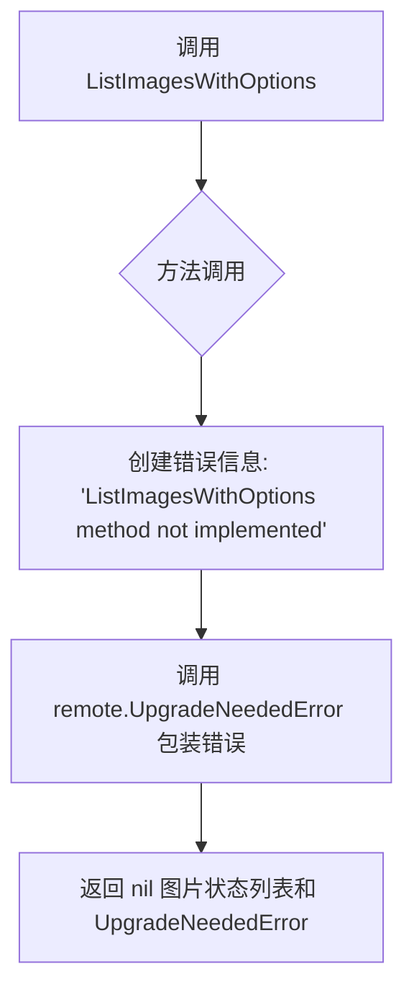

#### 带注释源码

```go
// ListImagesWithOptions 返回符合指定选项的镜像列表
// 参数 ctx 为上下文对象，opts 为查询选项
// 返回镜像状态切片和错误信息，当前总是返回升级需要错误
func (bc baseClient) ListImagesWithOptions(ctx context.Context, opts v10.ListImagesOptions) ([]v6.ImageStatus, error) {
    // 初始化空的镜像状态切片
    var imageStatuses []v6.ImageStatus
    
    // 返回升级需要错误，表明该 RPC 方法在服务器端未实现
    // 客户端需要升级到支持此方法的版本
    return imageStatuses, remote.UpgradeNeededError(errors.New("ListImagesWithOptions method not implemented"))
}
```


### `baseClient.UpdateManifests`

该方法是一个 RPC 服务的存根实现，用于处理客户端的清单更新请求。目前该方法尚未完成具体功能实现，仅返回升级需要的错误提示，表明调用方需要使用更高版本的 API。

参数：

- `ctx`：`context.Context`，请求的上下文对象，用于传递取消信号和截止时间等
- `spec`：`update.Spec`，更新操作的规格参数，包含需要更新的资源定义和策略

返回值：`job.ID`，返回已初始化的空作业 ID（实际未使用）；`error`，返回错误信息，提示需要升级客户端

#### 流程图

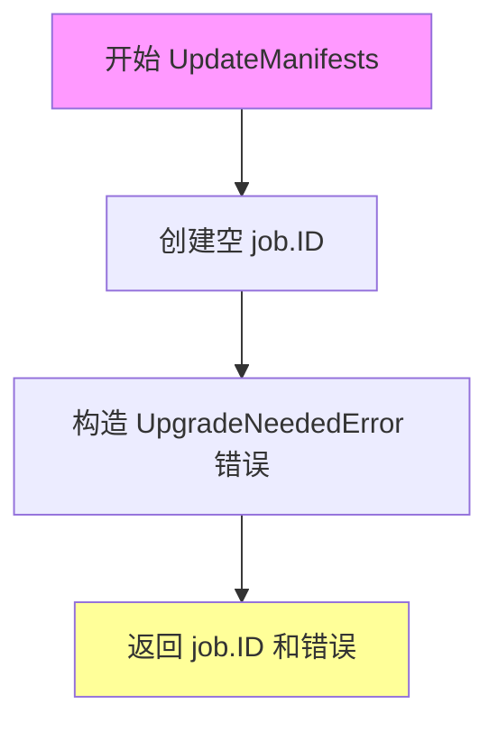

#### 带注释源码

```go
// UpdateManifests 处理清单更新请求的 RPC 方法
// 参数 ctx 为上下文对象，用于控制请求生命周期
// 参数 spec 为更新规格，定义需要执行的更新操作
func (bc baseClient) UpdateManifests(ctx context.Context, spec update.Spec) (job.ID, error) {
	// 声明一个空的 job.ID 变量
	// 实际上该返回值没有实际意义，因为方法直接返回错误
	var id job.ID
	
	// 返回升级需要的错误，提示客户端需要使用更高版本的 API
	// 这是因为该方法目前没有实现具体的更新逻辑
	return id, remote.UpgradeNeededError(errors.New("UpdateManifests method not implemented"))
}
```


### `baseClient.NotifyChange`

该方法用于通知客户端配置变更，但当前实现返回升级需要错误，表示该方法尚未实现，需要升级客户端版本。

参数：

-  `ctx`：`context.Context`，上下文对象，用于传递请求范围内的取消信号和超时信息
-  `change`：`v9.Change`，待通知的变更对象，包含配置变更的详细信息

返回值：`error`，如果方法未实现，返回升级需要错误

#### 流程图

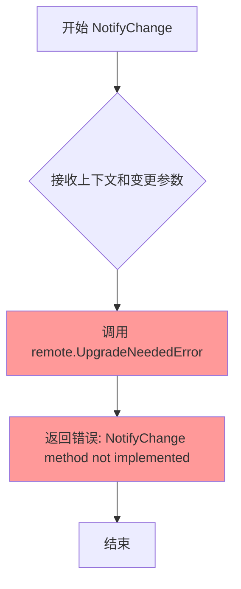

#### 带注释源码

```go
// NotifyChange 通知配置变更
// 参数:
//   - ctx: 上下文对象,用于控制请求超时和取消
//   - change: v9.Change 类型,表示需要通知的变更内容
//
// 返回值:
//   - error: 由于方法未实现,总是返回升级需要错误
func (bc baseClient) NotifyChange(context.Context, v9.Change) error {
    // 该方法目前未实现,返回升级需要错误以提示客户端需要升级
    return remote.UpgradeNeededError(errors.New("NotifyChange method not implemented"))
}
```


### `baseClient.JobStatus`

查询指定作业的当前执行状态，但该方法当前未实现，总是返回升级需要错误，提示客户端需要升级以支持此功能。

参数：

- `ctx`：`context.Context`，上下文对象，用于控制请求的生命周期和传递取消信号
- `id`：`job.ID`，作业的唯一标识符，用于指定要查询状态的作业

返回值：`job.Status`，作业的当前状态信息；`error`，如果方法未实现或发生错误则返回升级需要错误

#### 流程图

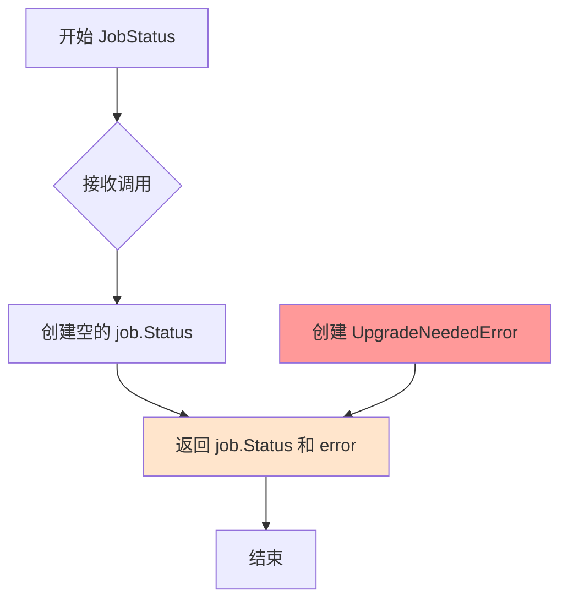

#### 带注释源码

```go
// JobStatus 查询指定作业的当前状态
// 参数 ctx 是上下文对象，用于控制请求的生命周期和传递取消信号
// 参数 id 是作业的唯一标识符，用于指定要查询状态的作业
// 返回 job.Status 类型的作业状态对象
// 返回 error 类型的错误，如果方法未实现则返回 UpgradeNeededError
func (bc baseClient) JobStatus(context.Context, job.ID) (job.Status, error) {
	// 返回空的作业状态对象和升级需要错误
	// 表示该方法需要客户端升级到更高版本才能使用
	return job.Status{}, remote.UpgradeNeededError(errors.New("JobStatus method not implemented"))
}
```


### `baseClient.SyncStatus`

该方法用于获取指定资源或命名空间的同步状态，但由于当前实现未完成，调用时会返回升级需要的错误提示，提示客户端需要升级到更高版本的API才能使用此功能。

参数：

- 第一个参数（隐式）：`context.Context`，Go语言的上下文对象，用于传递请求截止时间、取消信号等
- 第二个参数：`string`，表示需要查询同步状态的资源标识符（可能是命名空间、服务名或工作负载标识）

返回值：

- `[]string`，返回同步状态的字符串数组，可能包含多个状态的描述信息
- `error`，如果方法未实现或调用失败，返回远程升级需要错误

#### 流程图

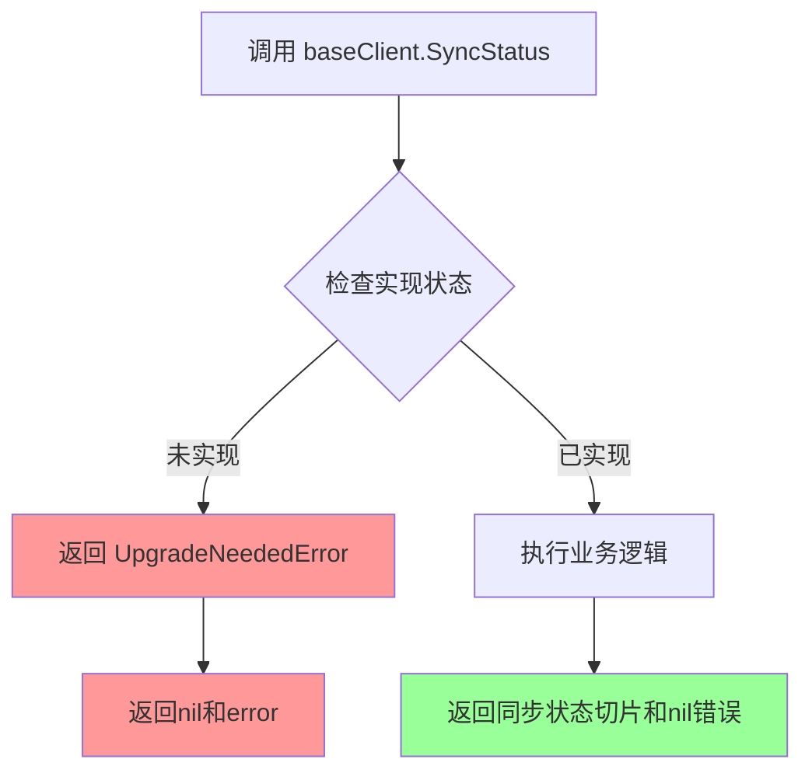

#### 带注释源码

```go
// SyncStatus 方法用于获取资源同步状态
// 参数 ctx 是Go标准的上下文对象，用于控制请求生命周期
// 参数 str 是目标资源的标识符（命名空间或服务名称）
// 返回值为字符串切片和错误对象
func (bc baseClient) SyncStatus(context.Context, string) ([]string, error) {
	// 返回nil切片和升级需要错误，提示客户端需要升级API版本
	return nil, remote.UpgradeNeededError(errors.New("SyncStatus method not implemented"))
}
```


### `baseClient.GitRepoConfig`

该方法用于获取Git仓库配置信息，但目前尚未实现，总是返回升级Needed错误，提示需要升级客户端版本以支持此功能。

参数：

- 第一个参数：`context.Context`，Go语言的上下文对象，用于传递取消信号和截止时间
- 第二个参数：`bool`（参数名称未在代码中指定），可能是用于控制是否返回敏感配置信息的布尔标志

返回值：

- `v6.GitConfig`，包含Git仓库配置的GitConfig结构体
- `error`，执行过程中的错误信息

#### 流程图

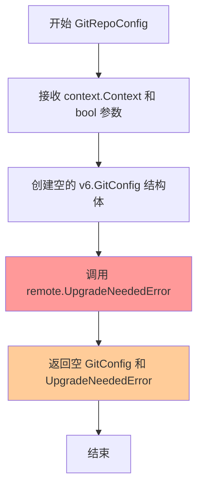

#### 带注释源码

```go
// GitRepoConfig 方法用于获取Git仓库配置信息
// 参数 ctx 是Go标准的上下文对象，用于超时控制和取消操作
// 参数 bool 类型，在代码中未命名，根据方法名推断可能用于控制是否返回敏感信息（如SSH密钥）
// 返回 v6.GitConfig 类型的Git配置对象和 error 类型的错误信息
func (bc baseClient) GitRepoConfig(context.Context, bool) (v6.GitConfig, error) {
	// 创建一个空的GitConfig结构体作为返回值
	// 该方法尚未实现，总是返回升级错误
	return v6.GitConfig{}, remote.UpgradeNeededError(errors.New("GitRepoConfig method not implemented"))
}
```

## 关键组件


### baseClient 结构体

一个空的基类结构体，实现了 api.Server 接口，用于提供 RPC 客户端的基础实现，所有方法均返回升级需要的错误。

### Version 方法

返回空的版本字符串和升级需要错误，表明该方法尚未实现，需要客户端升级。

### Ping 方法

返回升级需要错误，用于检测客户端与服务端通信能力，当前版本不支持。

### Export 方法

返回 nil 和升级需要错误，用于导出当前系统状态，当前版本未实现。

### ListServices 方法

返回空的服务列表和升级需要错误，用于列出所有服务及其控制器状态。

### ListServicesWithOptions 方法

返回空的服务列表和升级需要错误，支持通过选项参数列出服务，增强了 ListServices 功能。

### ListImages 方法

返回空的镜像状态列表和升级需要错误，用于列出指定资源的镜像信息。

### ListImagesWithOptions 方法

返回空的镜像状态列表和升级需要错误，支持通过选项参数列出镜像，增强了 ListImages 功能。

### UpdateManifests 方法

返回空的任务 ID 和升级需要错误，用于执行清单更新操作。

### NotifyChange 方法

返回升级需要错误，用于通知配置变更事件。

### JobStatus 方法

返回空的任务状态和升级需要错误，用于查询指定任务的执行状态。

### SyncStatus 方法

返回空的同步状态列表和升级需要错误，用于查询 Git 仓库同步状态。

### GitRepoConfig 方法

返回空的 Git 配置和升级需要错误，用于获取 Git 仓库配置信息。

### remote.UpgradeNeededError 错误类型

特定的错误类型，用于表示客户端需要升级才能使用某个功能，是整个 RPC 客户端错误处理的核心机制。

### API 版本支持

代码导入了 v6、v9、v10、v11 四个版本的 API 包，表明系统支持多个 API 版本并具有版本兼容性考虑。


## 问题及建议


### 已知问题

-   **所有方法均为空实现**：baseClient 结构体的所有方法都返回 UpgradeNeededError，实际上不提供任何功能，仅作为满足 api.Server 接口的占位符实现。
-   **硬编码的错误消息**：每个方法都使用硬编码的错误字符串（如 "Version method not implemented"），导致代码重复且难以维护。
-   **返回值与错误的组合不一致**：部分方法（如 UpdateManifests、JobStatus、GitRepoConfig）在返回错误的同时也返回零值，可能导致调用者误用返回值。
-   **缺乏日志记录**：没有任何日志或追踪机制，无法诊断何时以及如何调用了这些未实现的方法。
-   **API 版本依赖混乱**：代码中混用了 v6、v9、v10、v11 多个版本的类型，缺乏明确的版本管理策略。
-   **缺少单元测试**：作为接口实现类，没有任何测试代码覆盖。

### 优化建议

-   **实现统一错误处理模板**：创建一个辅助方法统一生成 UpgradeNeededError，减少代码重复，例如：`func (bc baseClient) notImplemented(methodName string) error { return remote.UpgradeNeededError(errors.New(methodName + " method not implemented")) }`
-   **添加结构化日志**：在每个方法入口添加日志记录，便于调试和监控未实现方法的调用情况。
-   **返回明确的无错误值或使用 pointer**：对于必须返回零值的方法，考虑返回 nil 错误或使用指针类型明确区分"未实现"和"成功返回空结果"的场景。
-   **考虑使用代码生成**：由于接口方法众多且变更频繁，可考虑使用 Go 的代码生成工具自动生成存根实现。
-   **添加方法文档注释**：为每个方法添加清晰的注释说明其用途和当前实现状态。
-   **建立版本映射机制**：梳理并文档化各 API 版本方法的对应关系，便于后续版本演进时的维护。


## 其它


### 设计目标与约束

该代码定义了一个基础的RPC客户端基类`baseClient`，用于实现`api.Server`接口的所有方法。其核心设计目标是提供一个统一的错误处理机制，当客户端版本不支持某个API方法时，返回`UpgradeNeededError`错误，提示调用方需要升级客户端版本。该设计遵循了向后兼容性和版本升级指导的原则，通过统一的错误返回机制简化了版本不兼容的处理流程。

### 错误处理与异常设计

该代码采用统一的错误处理模式：所有API方法均返回`remote.UpgradeNeededError`错误，该错误类型表示客户端需要升级才能使用对应的功能。错误信息包含具体未实现的方法名称，便于调用方诊断问题。这种设计将版本不兼容错误进行标准化处理，避免了为每个方法单独定义错误处理逻辑。调用方可以通过检查错误类型来决定是否提示用户升级客户端。

### 外部依赖与接口契约

该代码依赖以下外部包和接口：
- `github.com/fluxcd/flux/pkg/api`：定义`Server`接口
- `github.com/fluxcd/flux/pkg/api/v6`、`v9`、`v10`、`v11`：不同版本的API定义
- `github.com/fluxcd/flux/pkg/job`：任务相关类型
- `github.com/fluxcd/flux/pkg/update`：更新相关类型
- `github.com/fluxcd/flux/pkg/remote`：远程通信错误定义
- `github.com/pkg/errors`：错误包装工具

`baseClient`实现了`api.Server`接口的全部方法，遵循接口契约，每个方法都接受`context.Context`作为第一个参数并返回相应的结果或错误。

### 版本兼容性设计

该代码体现了Flux项目的API版本兼容性策略：通过在基础客户端中统一返回升级错误，确保任何新增或未实现的API方法都能得到正确的错误处理。这种设计允许项目在引入新API版本时，无需修改已存在的客户端代码，只需在具体实现类中覆盖需要支持的方法即可。

### 测试策略建议

由于该代码的所有方法都返回统一的错误，建议编写单元测试验证：
- 每个方法都正确返回`remote.UpgradeNeededError`类型
- 错误信息包含对应方法名称
- `baseClient`实现了`api.Server`接口（通过空接口检查`var _ api.Server = baseClient{}`）

### 性能考虑

该代码本身不涉及复杂的业务逻辑或资源密集型操作，性能开销主要来自于错误对象的创建。由于所有方法都返回预定义的错误类型，可以考虑缓存错误对象以减少重复创建的开销，但这对于当前使用场景可能并非关键优化点。

### 安全考虑

该代码不涉及敏感数据处理或认证授权逻辑，安全考虑主要集中在错误信息的泄露问题上。当前实现通过errors.New创建错误消息，建议在生产环境中确保错误信息不会泄露敏感的版本或系统信息。


    