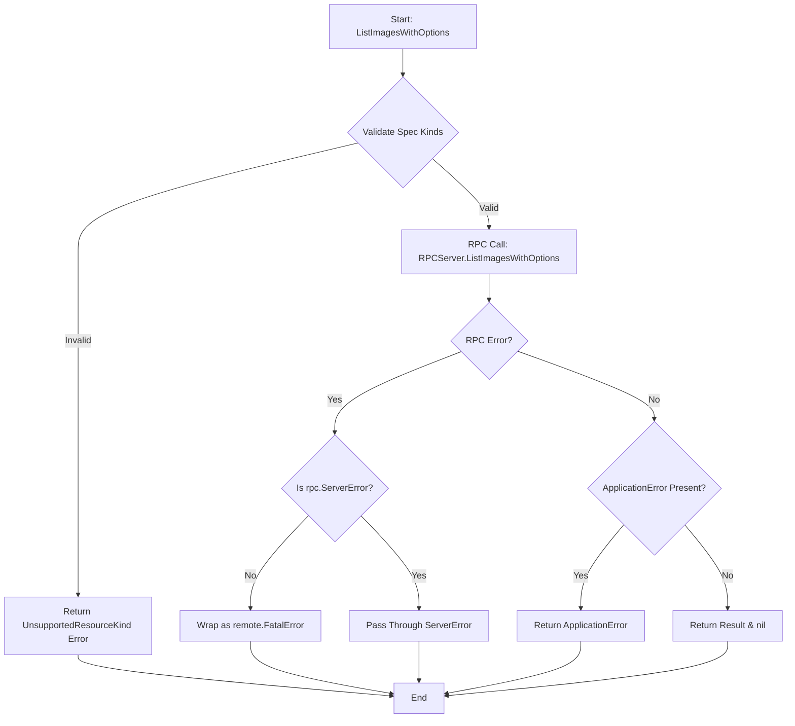
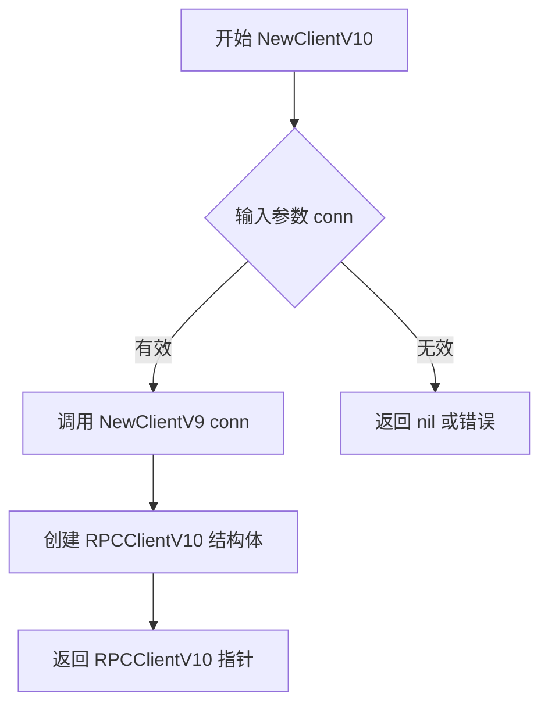
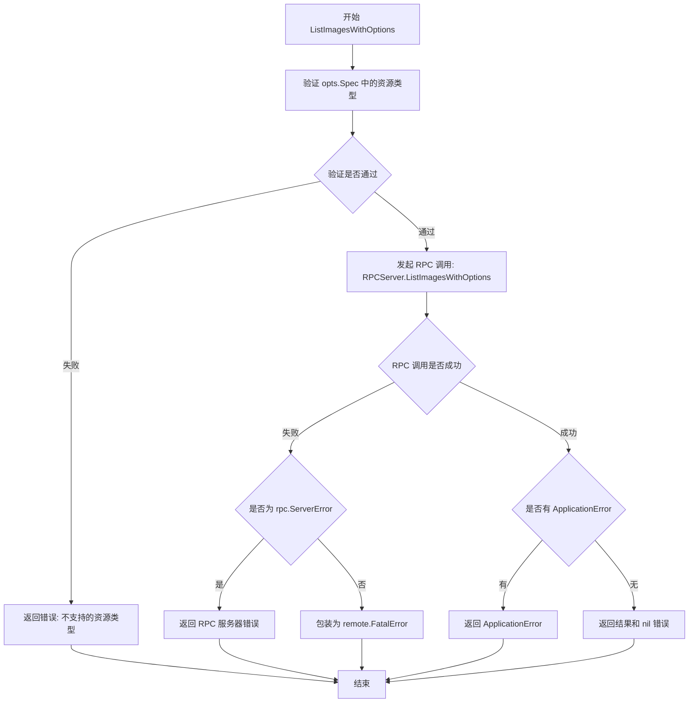
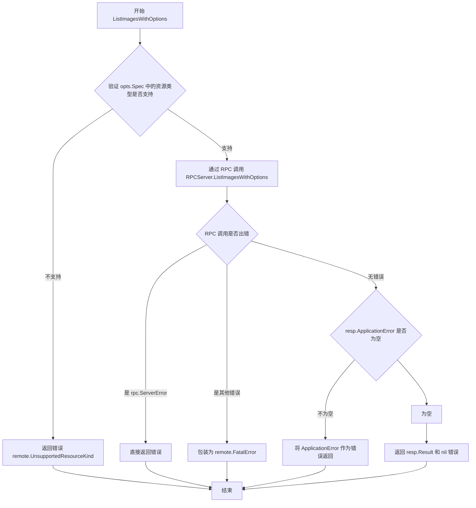
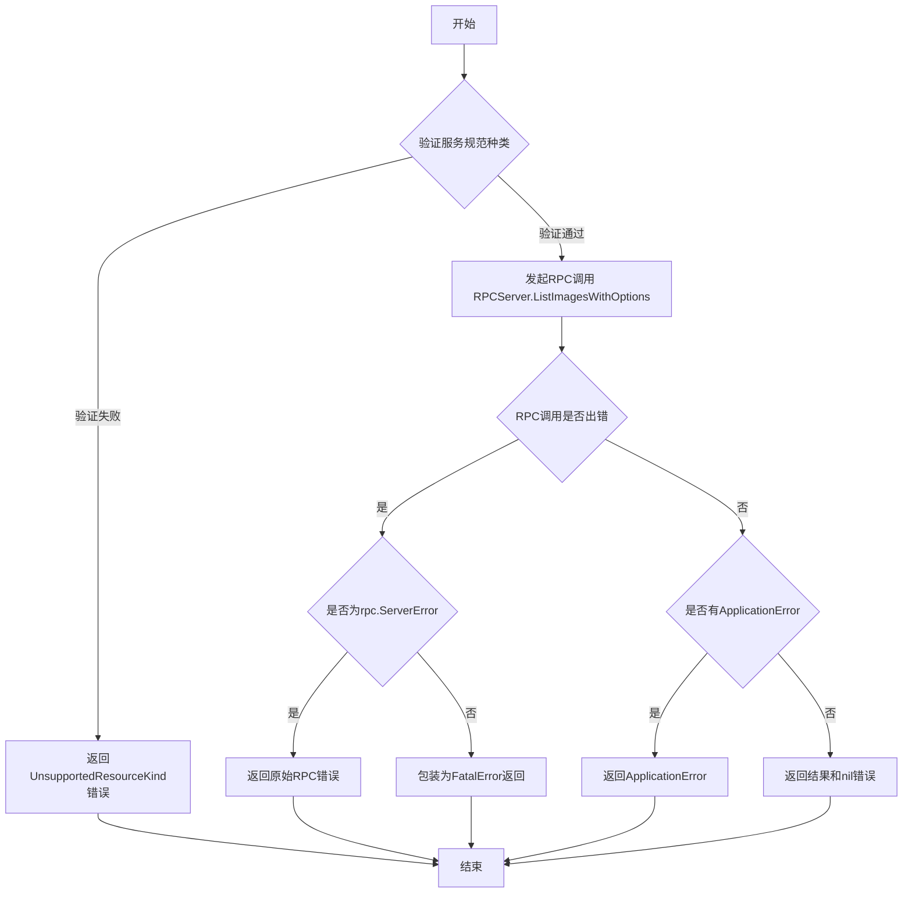
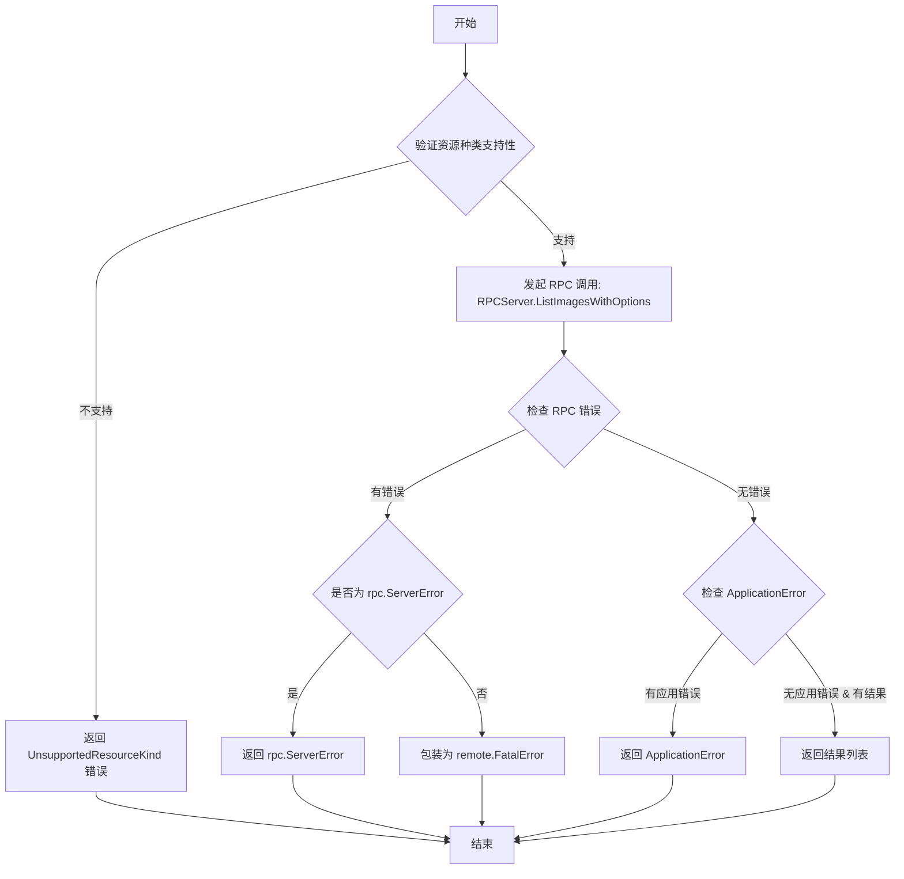
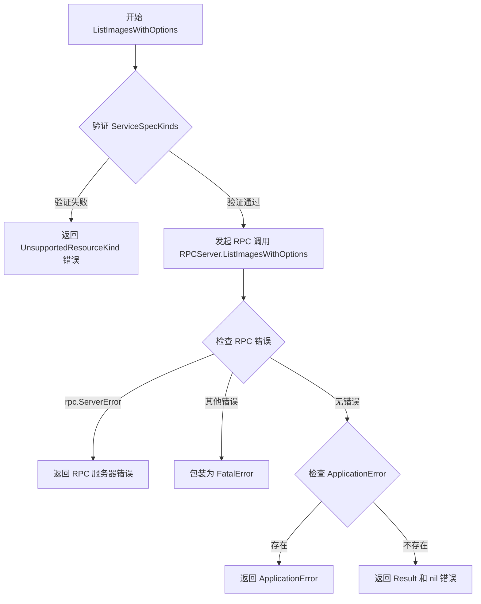

# `flux\pkg\remote\rpc\clientV10.go` 详细设计文档

RPCClientV10 是 Flux 项目中基于 RPC 协议的客户端实现，继承自 V9 版本，用于与远程守护进程通信，并实现了 ListImagesWithOptions 方法以支持带选项的镜像列表查询。

## 整体流程



## 类结构

```
RPCClientV10 (结构体)
└── 嵌入: *RPCClientV9 (继承父类方法)
clientV10 (接口)
├── v10.Server
└── v10.Upstream
```

## 全局变量及字段


### `_`
    
编译时接口实现检查，确保 RPCClientV10 实现了 clientV10 接口

类型：`clientV10`
    


### `RPCClientV10.*RPCClientV9`
    
嵌入的RPCClientV9客户端，提供V9版本的RPC方法实现

类型：`*RPCClientV9`
    
    

## 全局函数及方法


### `NewClientV10`

这是 RPC 客户端 V10 版本的构造函数，用于创建一个新的 RPC 客户端实例。该构造函数接收一个 `io.ReadWriteCloser` 作为底层通信连接，并内部调用 `NewClientV9` 来初始化嵌入的 V9 客户端，从而实现版本继承。

参数：

- `conn`：`io.ReadWriteCloser`，网络通信的读写关闭接口，用于 RPC 消息的传输

返回值：`*RPCClientV10`，返回新创建的 RPC 客户端 V10 实例指针

#### 流程图



#### 带注释源码

```go
// NewClientV10 creates a new rpc-backed implementation of the server.
// 这是 RPCClientV10 的构造函数，用于创建一个新的 RPC 客户端 V10 实例
// 参数 conn 是用于网络通信的读写关闭接口
// 返回值为 RPCClientV10 的指针
func NewClientV10(conn io.ReadWriteCloser) *RPCClientV10 {
    // 调用 NewClientV9 创建底层客户端，并嵌入到 RPCClientV10 中
    // 利用 Go 语言的嵌入机制实现版本继承
    return &RPCClientV10{NewClientV9(conn)}
}
```


### `RPCClientV10.ListImagesWithOptions`

该方法是 RPC 客户端 V10 版本的核心方法，用于封装对远程守护进程的 RPC 调用，通过传入上下文和查询选项参数，获取符合条件的镜像状态列表，并处理可能出现的资源类型不支持错误、RPC 调用错误和应用层错误。

参数：

- `ctx`：`context.Context`，上下文对象，用于传递请求范围的值、取消信号和截止时间
- `opts`：`v10.ListImagesOptions`，查询条件选项，包含需要查询的资源规范（Spec）和相关配置

返回值：`([]v6.ImageStatus, error)`，返回镜像状态切片和错误信息。如果成功，返回符合条件的镜像状态列表；如果发生错误（如资源类型不支持、RPC 调用失败或应用层返回错误），则返回相应的错误对象。

#### 流程图



#### 带注释源码

```go
// ListImagesWithOptions 是 RPC 客户端 V10 版本的方法，
// 用于通过 RPC 调用远程服务器获取符合指定选项的镜像列表
func (p *RPCClientV10) ListImagesWithOptions(ctx context.Context, opts v10.ListImagesOptions) ([]v6.ImageStatus, error) {
    // 定义响应结构体，用于接收 RPC 返回的数据
    var resp ListImagesResponse
    
    // 第一步：验证传入的选项中的资源规范是否包含支持的 kinds
    // 如果验证失败，返回错误并标记为不支持的资源类型
    if err := requireServiceSpecKinds(opts.Spec, supportedKindsV8); err != nil {
        return resp.Result, remote.UnsupportedResourceKind(err)
    }

    // 第二步：发起 RPC 远程过程调用
    // 调用远程 RPCServer 的 ListImagesWithOptions 方法，传入选项参数
    err := p.client.Call("RPCServer.ListImagesWithOptions", opts, &resp)
    
    // 第三步：处理 RPC 调用可能出现的错误
    if err != nil {
        // 检查错误类型是否为 rpc.ServerError（RPC 服务器返回的应用级错误）
        // 如果不是 rpc.ServerError 且错误不为空，则认为是底层通信错误
        if _, ok := err.(rpc.ServerError); !ok && err != nil {
            // 将底层错误包装为.FatalError，表示这是致命错误
            err = remote.FatalError{err}
        }
    } else if resp.ApplicationError != nil {
        // 如果 RPC 调用成功但返回了 ApplicationError（应用层错误）
        // 将应用层错误直接赋值给 err
        err = resp.ApplicationError
    }
    
    // 第四步：返回结果（镜像状态列表）和可能存在的错误
    return resp.Result, err
}
```


### `RPCClientV10.ListImagesWithOptions`

该方法是 RPCClientV10 类型的成员方法，通过 RPC 协议远程调用服务端的 `ListImagesWithOptions` 方法，首先验证传入的选项规范是否支持指定的资源类型，然后执行远程调用并处理 RPC 错误或应用层错误，最终返回镜像状态列表和可能出现的错误。

**参数：**

- `ctx`：`context.Context`，用于控制请求的截止时间和取消操作
- `opts`：`v10.ListImagesOptions`，包含查询镜像列表所需的选项规范

**返回值：**`([]v6.ImageStatus, error)`，返回镜像状态切片和可能的错误信息

#### 流程图



#### 带注释源码

```go
// ListImagesWithOptions 是 RPCClientV10 的方法，通过 RPC 远程调用获取镜像列表
// 参数 ctx 用于传递上下文（如超时、取消信号），opts 包含查询选项（包含规范和资源类型）
// 返回镜像状态切片和错误信息
func (p *RPCClientV10) ListImagesWithOptions(ctx context.Context, opts v10.ListImagesOptions) ([]v6.ImageStatus, error) {
    // 定义响应结构体，用于接收 RPC 调用返回的结果
    var resp ListImagesResponse
    
    // 验证 opts.Spec 中指定的资源类型是否在支持的版本列表中
    // supportedKindsV8 是该客户端版本支持的资源类型集合
    if err := requireServiceSpecKinds(opts.Spec, supportedKindsV8); err != nil {
        // 如果验证失败，返回空结果和资源类型不支持的错误
        return resp.Result, remote.UnsupportedResourceKind(err)
    }

    // 通过 RPC 客户端调用远程服务端的 ListImagesWithOptions 方法
    // 第一个参数是服务端的方法名，第二个是请求参数，第三个是响应接收变量
    err := p.client.Call("RPCServer.ListImagesWithOptions", opts, &resp)
    
    // 处理 RPC 调用过程中可能出现的错误
    if err != nil {
        // 判断错误是否是 RPC 服务端错误
        if _, ok := err.(rpc.ServerError); !ok && err != nil {
            // 如果不是 RPC 服务端错误，则将其包装为致命错误
            err = remote.FatalError{err}
        }
    } else if resp.ApplicationError != nil {
        // 如果 RPC 调用成功但服务端返回了应用层错误，则使用该错误
        err = resp.ApplicationError
    }
    
    // 返回查询结果和可能存在的错误
    return resp.Result, err
}
```


### `RPCClientV10.ListImagesWithOptions`

该方法是RPCClientV10类（实现v10.Server和v10.Upstream接口）的核心方法，通过RPC协议调用远程守护进程的ListImagesWithOptions方法，支持传递选项参数来获取镜像列表信息。

参数：

- `ctx`：`context.Context`，请求的上下文，用于控制请求的生命周期和传递元数据
- `opts`：`v10.ListImagesOptions`，查询镜像的选项参数，包含要查询的规范和服务种类等信息

返回值：`([]v6.ImageStatus, error)`，返回镜像状态列表和可能出现的错误。如果成功，返回镜像状态切片；如果失败，返回错误信息。

#### 流程图



#### 带注释源码

```go
// ListImagesWithOptions 是RPCClientV10结构体的方法，实现通过RPC调用远程守护进程的ListImagesWithOptions接口
// 参数ctx用于传递上下文信息，opts包含查询选项（如服务规范等）
// 返回镜像状态切片和可能出现的错误
func (p *RPCClientV10) ListImagesWithOptions(ctx context.Context, opts v10.ListImagesOptions) ([]v6.ImageStatus, error) {
	// 定义响应结构体，用于接收RPC调用的返回值
	var resp ListImagesResponse
	
	// 验证opts中的服务规范是否包含支持的资源种类
	// supportedKindsV8定义了V8版本支持的资源种类
	// 如果验证失败，返回错误并标记为不支持的资源种类
	if err := requireServiceSpecKinds(opts.Spec, supportedKindsV8); err != nil {
		return resp.Result, remote.UnsupportedResourceKind(err)
	}

	// 使用RPC客户端发起同步调用
	// 方法名为"RPCServer.ListImagesWithOptions"，传入opts参数，响应写入resp
	err := p.client.Call("RPCServer.ListImagesWithOptions", opts, &resp)
	
	// 处理RPC调用可能出现的错误
	if err != nil {
		// 检查错误是否是rpc.ServerError类型
		// 如果不是，则认为是严重错误（可能是网络问题等），包装为FatalError
		if _, ok := err.(rpc.ServerError); !ok && err != nil {
			err = remote.FatalError{err}
		}
	} else if resp.ApplicationError != nil {
		// 如果RPC调用成功但返回了应用层错误，则使用该应用层错误
		err = resp.ApplicationError
	}
	
	// 返回结果（镜像状态列表）和可能的错误
	return resp.Result, err
}
```


### `RPCClientV10.ListImagesWithOptions`

该方法实现了 `v10.Upstream` 接口中的 RPC 客户端调用逻辑，通过 RPC 协议从远程守护进程获取带有特定选项的镜像列表。它首先验证资源种类的支持性，然后发起 RPC 调用并处理可能的错误。

参数：

- `ctx`：`context.Context`，用于传递上下文信息如超时、取消信号
- `opts`：`v10.ListImagesOptions`，包含查询规范和过滤选项

返回值：`[]v6.ImageStatus`，镜像状态列表；`error`，调用过程中的错误信息

#### 流程图



#### 带注释源码

```go
// ListImagesWithOptions 是 RPCClientV10 实现了 v10.Upstream 接口的核心方法。
// 它接受一个上下文和一个 ListImagesOptions 结构体，返回镜像状态列表或错误。
func (p *RPCClientV10) ListImagesWithOptions(ctx context.Context, opts v10.ListImagesOptions) ([]v6.ImageStatus, error) {
	// 初始化响应对象，用于接收 RPC 调用返回的数据
	var resp ListImagesResponse

	// 验证提供的资源规范是否包含支持的种类（supportedKindsV8）
	// 如果不支持，则返回一个特定错误，提示不支持的资源种类
	if err := requireServiceSpecKinds(opts.Spec, supportedKindsV8); err != nil {
		return resp.Result, remote.UnsupportedResourceKind(err)
	}

	// 使用 RPC 客户端调用远程服务器上的方法
	// 第一个参数是方法名，第二个是请求参数，第三个是响应指针
	err := p.client.Call("RPCServer.ListImagesWithOptions", opts, &resp)
	if err != nil {
		// 如果发生 RPC 错误，检查错误类型
		// 如果不是 rpc.ServerError（服务器返回的应用级错误），则将其视为致命错误
		if _, ok := err.(rpc.ServerError); !ok && err != nil {
			err = remote.FatalError{err}
		}
	} else if resp.ApplicationError != nil {
		// 如果 RPC 调用成功但返回了应用级错误，则使用该错误
		err = resp.ApplicationError
	}
	// 返回结果列表和可能存在的错误
	return resp.Result, err
}
```

## 关键组件


### 一段话描述

RPCClientV10 是 Flux 项目中基于 RPC 协议实现的远程客户端版本，继承自 RPCClientV9，通过嵌入方式组合前版本功能，并新增支持带选项参数的 ListImagesWithOptions 方法，用于与远程 Flux daemon 通信以获取容器镜像列表信息。

### 文件的整体运行流程

1. **初始化阶段**：NewClientV10 函数接收 io.ReadWriteCloser 参数，创建 RPCClientV10 实例并调用 NewClientV9 初始化底层 RPC 客户端
2. **接口验证阶段**：通过 var _ clientV10 = &RPCClientV10{} 编译时检查确保 RPCClientV10 实现了 v10.Server 和 v10.Upstream 接口
3. **方法调用阶段**：ListImagesWithOptions 方法接收 context.Context 和 v10.ListImagesOptions 参数
4. **验证阶段**：使用 requireServiceSpecKinds 验证请求的 Spec 是否包含支持的资源种类
5. **RPC 调用阶段**：通过 p.client.Call 发起远程 RPC 调用 "RPCServer.ListImagesWithOptions"
6. **错误处理阶段**：检查 rpc.ServerError 和 ApplicationError，转换为远程错误类型返回

### 类的详细信息

#### RPCClientV10 类

**类字段：**

| 名称 | 类型 | 描述 |
|------|------|------|
| *RPCClientV9 | *RPCClientV9 | 嵌入的 RPCClientV9 客户端，提供基础 RPC 通信功能 |

**类方法：**

| 名称 | 参数 | 参数类型 | 参数描述 | 返回值类型 | 返回值描述 |
|------|------|----------|----------|------------|------------|
| NewClientV10 | conn | io.ReadWriteCloser | RPC 连接接口，支持读写和关闭 | *RPCClientV10 | 返回新创建的 RPCClientV10 实例 |
| ListImagesWithOptions | ctx, opts | context.Context, v10.ListImagesOptions | 上下文和列表镜像选项配置 | ([]v6.ImageStatus, error) | 返回镜像状态列表和可能发生的错误 |

**ListImagesWithOptions 方法 Mermaid 流程图：**



**带注释源码：**

```go
// ListImagesWithOptions 调用远程 RPC 服务器的 ListImagesWithOptions 方法
// 参数 ctx 用于传递上下文信息如超时、取消信号等
// 参数 opts 包含查询镜像列表的选项配置
// 返回 []v6.ImageStatus 表示镜像状态列表，error 表示可能的错误
func (p *RPCClientV10) ListImagesWithOptions(ctx context.Context, opts v10.ListImagesOptions) ([]v6.ImageStatus, error) {
    var resp ListImagesResponse  // 存储 RPC 响应
    
    // 验证请求的 Spec 是否包含支持的资源种类
    if err := requireServiceSpecKinds(opts.Spec, supportedKindsV8); err != nil {
        return resp.Result, remote.UnsupportedResourceKind(err)
    }

    // 发起 RPC 远程调用
    err := p.client.Call("RPCServer.ListImagesWithOptions", opts, &resp)
    if err != nil {
        // 检查是否为 RPC 服务器错误，不是则包装为 FatalError
        if _, ok := err.(rpc.ServerError); !ok && err != nil {
            err = remote.FatalError{err}
        }
    } else if resp.ApplicationError != nil {
        // 检查应用层返回的错误
        err = resp.ApplicationError
    }
    return resp.Result, err
}
```

### 关键组件信息

### RPC 客户端架构

基于 RPC 协议的远程通信客户端实现，支持版本演进和功能扩展

### 嵌入组合模式

通过嵌入 RPCClientV9 实现代码复用和版本向后兼容

### 选项参数支持

新增 ListImagesWithOptions 方法支持通过选项结构体传递查询参数，提高 API 灵活性和扩展性

### 错误转换机制

将 RPC 层错误转换为远程特定错误类型，包括 rpc.ServerError、FatalError 和 UnsupportedResourceKind

### 服务种类验证

在发起远程调用前验证资源种类是否受支持，确保请求合法性

### 潜在的技术债务或优化空间

### 错误处理冗余

当前错误处理包含多层 if-else 嵌套，可考虑提取为独立错误处理函数提高可读性

### 验证逻辑硬编码

supportedKindsV8 硬编码在验证逻辑中，缺乏灵活性配置

### 接口定义外部依赖

直接依赖 v10.Server 和 v10.Upstream 接口，缺乏依赖注入机制，单元测试困难

### 响应结构复用

ListImagesResponse 结构定义未在当前文件中展示，可能存在与其他版本重复定义

### 缺乏重试机制

RPC 调用失败时直接返回错误，未实现重试逻辑

### 其它项目

### 设计目标与约束

- 目标：提供基于 RPC 的远程 Flux API 客户端实现，支持版本 v10
- 约束：必须实现 v10.Server 和 v10.Upstream 接口，保持与远程 RPC 服务器协议兼容

### 错误处理与异常设计

- 使用 rpc.ServerError 区分 RPC 协议层错误和应用层错误
- 使用 remote.FatalError 包装致命性错误
- 使用 remote.UnsupportedResourceKind 标识不支持的资源类型

### 数据流与状态机

- 数据流：客户端 → RPC 调用 → 远程服务器 → 响应解析 → 返回结果
- 无状态设计：RPCClientV10 为无状态客户端，每次调用独立

### 外部依赖与接口契约

- 依赖：github.com/fluxcd/flux/pkg/api/v10 (API 接口定义)
- 依赖：github.com/fluxcd/flux/pkg/api/v6 (ImageStatus 类型)
- 依赖：github.com/fluxcd/flux/pkg/remote (远程错误类型定义)
- 依赖：net/rpc (Go 标准 RPC 库)
- 依赖：io (IO 接口定义)


## 问题及建议


### 已知问题

-   **Context未传递给RPC调用**：虽然方法接收了`ctx`参数，但在调用`p.client.Call`时并未使用context，无法实现超时控制或取消请求
-   **冗余的错误检查**：在`if _, ok := err.(rpc.ServerError); !ok && err != nil`中，`err != nil`的检查是冗余的，因为如果`err`为nil，类型断言会直接返回false
-   **未使用的响应字段**：`ListImagesResponse`结构体的字段`ApplicationError`被使用，但`resp.Result`在函数返回时可能未正确初始化，如果发生错误，其值可能为零值而非有意义的错误信息
-   **版本继承不清晰**：`RPCClientV10`嵌入了`RPCClientV9`，但没有显式说明哪些方法是从V9继承的，代码可读性较差
-   **缺少接口实现验证**：虽然有`var _ clientV10 = &RPCClientV10{}`进行编译时接口检查，但没有对所有必要方法进行验证

### 优化建议

-   **传递Context到RPC调用**：修改RPC调用以支持context，实现请求超时和取消功能，例如使用`p.client.CallContext(ctx, ...)`
-   **简化错误检查逻辑**：将错误检查改为`if err != nil { if _, ok := err.(rpc.ServerError); !ok { ... } }`
-   **显式初始化响应**：在方法开始时明确初始化响应结构体，确保返回值的一致性
-   **添加方法注释**：为继承自V9的方法添加注释说明其来源，提高代码可维护性
-   **添加日志和追踪**：在关键路径添加日志记录，便于调试和问题排查
-   **考虑使用更现代的RPC框架**：当前使用`net/rpc`，可以考虑使用gRPC等更现代的方案以获得更好的性能和特性支持

## 其它


### 设计目标与约束

本RPC客户端设计目标是为Fluxcd Flux提供基于JSON-RPC的远程通信能力，支持与远程守护进程进行交互。约束条件包括：必须实现v10.Server和v10.Upstream接口，必须继承RPCClientV9的所有功能，必须支持服务规范种类验证。

### 错误处理与异常设计

错误处理采用分层设计：rpc.ServerError用于RPC层错误，remote.FatalError用于致命错误，remote.UnsupportedResourceKind用于不支持的资源类型错误。ApplicationError用于应用层错误传递。错误通过resp.ApplicationError字段回传，并在调用端进行类型断言处理。

### 数据流与状态机

客户端通过io.ReadWriteCloser建立持久连接，调用流程为：构造请求opts → p.client.Call("RPCServer.ListImagesWithOptions", opts, &resp) → 解析响应Result和Error。状态转换依赖底层RPC连接的可用性，连接断开将导致RPC调用失败。

### 外部依赖与接口契约

外部依赖包括：context.Context用于超时和取消控制，io.ReadWriteCloser用于网络连接，net/rpc用于RPC框架，v10和v6 API包定义数据结构，remote包提供错误类型定义。接口契约要求实现v10.Server的ListImagesWithOptions方法和v10.Upstream相关方法。

### 并发和线程安全性

RPCClientV10本身不保存可变状态，线程安全由底层net/rpc客户端保证。但ctx参数的使用需要注意：ctx应该在上层调用处管理，避免传递已取消的context。

### 配置参数

主要配置参数为conn（io.ReadWriteCloser），在NewClientV10时注入。opts参数在每次调用时传入，包含v10.ListImagesOptions类型的请求选项。

### 版本演进历史

从RPCClientV9继承而来，V10版本主要新增ListImagesWithOptions方法，该方法接受options结构体作为首个参数，支持更灵活的查询选项。

### 性能考虑

RPC调用为同步阻塞操作，未实现连接池或请求复用。每次调用都会进行一次网络往返，高频调用场景可能需要考虑连接复用优化。

    