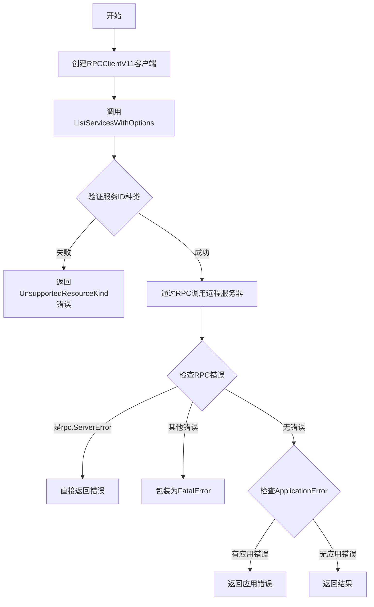
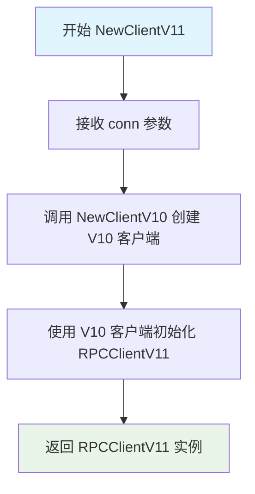
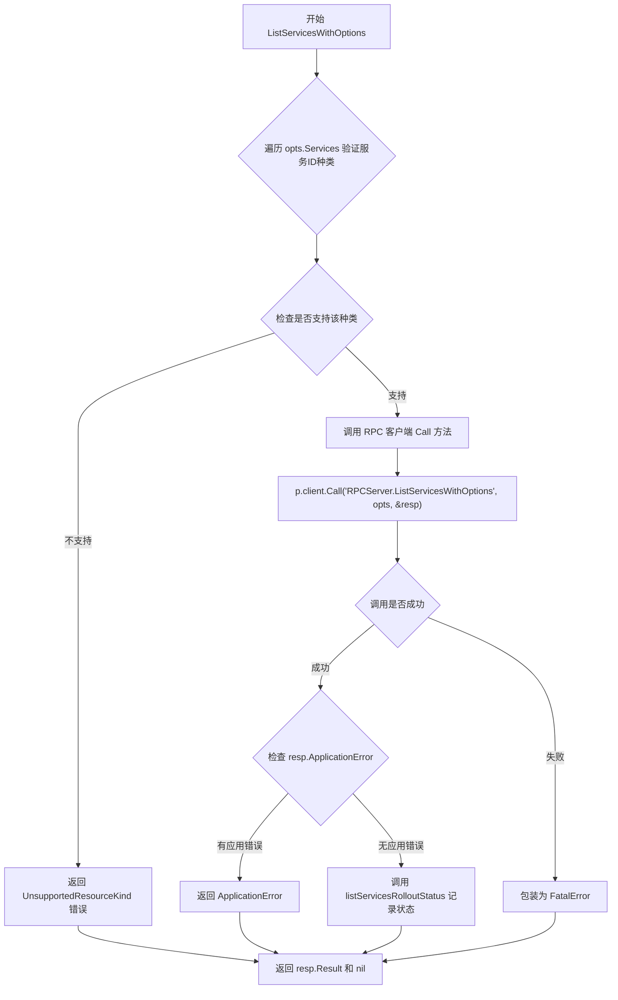
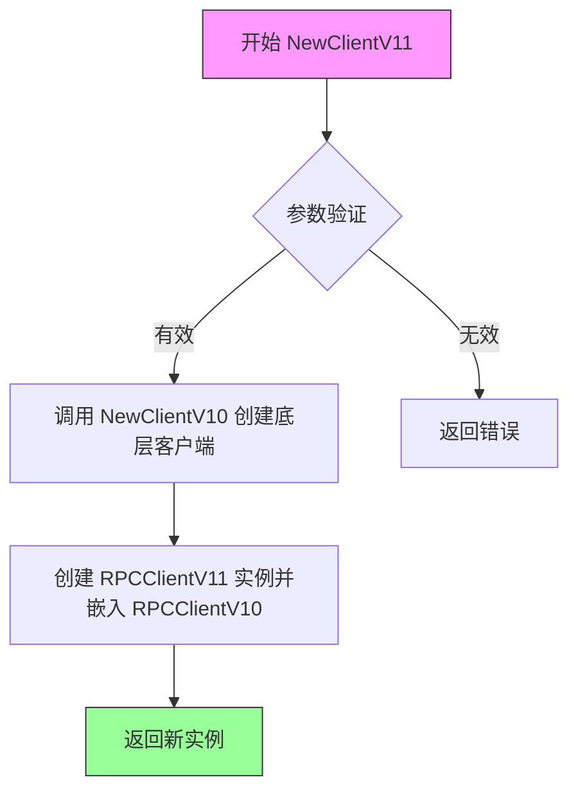
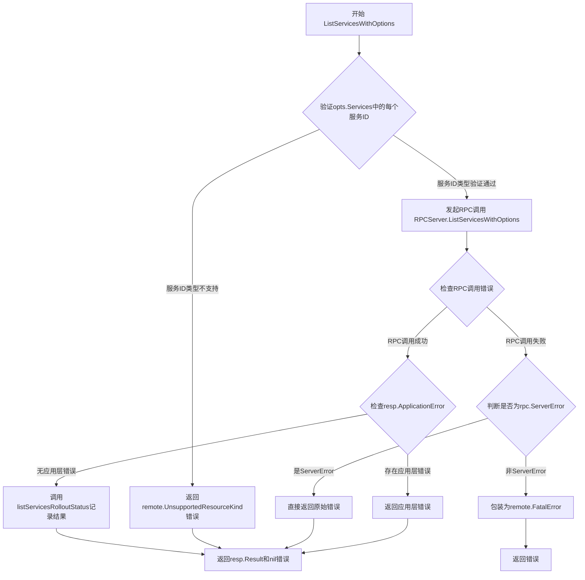

# `flux\pkg\remote\rpc\clientV11.go` 详细设计文档

RPC客户端V11版本实现，用于与远程FluxCD守护进程通信，支持通过选项结构体获取服务列表，继承自V10版本并实现了V11服务器接口

## 整体流程



## 类结构

```
RPCClient (基类)
└── RPCClientV10
    └── RPCClientV11 (当前类)
```

## 全局变量及字段


### `_`
    
空白标识符，用于编译时接口检查，确保 RPCClientV11 实现了 clientV11 接口

类型：`blank identifier`
    


### `RPCClientV11.RPCClientV10`
    
继承的RPC客户端基类，提供基础的RPC通信能力

类型：`*RPCClientV10`
    
    

## 全局函数及方法


### `NewClientV11`

创建 V11 版本的 RPC 客户端实例，通过组合 V10 客户端来实现版本兼容，支持 V11 版本的 API 方法。

参数：

- `conn`：`io.ReadWriteCloser`，用于 RPC 通信的读写关闭器连接

返回值：`*RPCClientV11`，返回新创建的 V11 RPC 客户端实例

#### 流程图



#### 带注释源码

```go
// NewClientV11 creates a new rpc-backed implementation of the server.
// 该函数创建 V11 版本的 RPC 客户端，利用组合模式嵌入 V10 客户端，
// 从而复用 V10 的功能并扩展 V11 特有的方法（如 ListServicesWithOptions）
func NewClientV11(conn io.ReadWriteCloser) *RPCClientV11 {
	// 先创建 V10 客户端实例，传入连接参数
	// 然后将其嵌入到 V11 客户端中，实现版本继承
	return &RPCClientV11{NewClientV10(conn)}
}
```

---

### 关联类信息

#### `RPCClientV11` 类

**描述**：V11 版本的 RPC 客户端实现，通过嵌入 V10 客户端实现版本兼容，并扩展支持 options 参数的 API 方法。

**字段**：

- `*RPCClientV10`：嵌入的 V10 客户端，提供基础 RPC 通信能力

**方法**：

| 方法名 | 功能描述 |
|--------|----------|
| `NewClientV11` | 构造函数，创建 V11 客户端实例 |
| `ListServicesWithOptions` | 支持选项参数的服务列表查询方法 |

#### 全局变量/接口

- `clientV11`：接口类型，定义 V11 服务器必须实现的接口
- `RPCClientV11`：结构体类型，V11 RPC 客户端实现

---

### 关键组件信息

| 组件名称 | 一句话描述 |
|----------|------------|
| `RPCClientV11` | V11 版本的 RPC 客户端，使用组合模式继承 V10 功能 |
| `RPCClientV10` | V10 版本的 RPC 客户端，提供基础 RPC 通信能力 |
| `v11.Server` | V11 版本的服务器接口定义 |
| `io.ReadWriteCloser` | Go 标准库接口，组合了读写和关闭功能 |

---

### 技术债务与优化空间

1. **版本继承方式**：使用结构体嵌入而非接口抽象，若 V11 需要重写 V10 的方法，可能导致方法覆盖问题
2. **错误处理一致性**：`ListServicesWithOptions` 中的错误处理逻辑可以抽象为通用方法，避免重复代码
3. **验证逻辑前置**：对 `opts.Services` 的验证在循环中每次都执行，可考虑提前验证或优化验证时机

---

### 其他项目

#### 设计目标与约束

- **目标**：提供 V11 版本的 RPC 客户端，支持带选项参数的高级 API 方法
- **约束**：必须保持与 V10 客户端的向后兼容，通过嵌入方式实现代码复用

#### 错误处理与异常设计

- RPC 调用错误通过 `rpc.ServerError` 类型判断是否为服务器端错误
- 非 RPC 错误包装为 `remote.FatalError` 以区分错误类型
- 应用层错误通过 `resp.ApplicationError` 传递

#### 外部依赖与接口契约

- 依赖 `io.ReadWriteCloser` 接口进行底层通信
- 依赖 `v11.ListServicesOptions` 定义服务查询选项
- 依赖 `v6.ControllerStatus` 返回控制器状态列表
- 依赖 `remote` 包处理远程错误和资源类型验证


### `RPCClientV11.ListServicesWithOptions`

该方法是 RPC 客户端 V11 版本的核心查询方法，通过远程过程调用（RPC）获取带有指定选项的服务列表。它首先验证服务ID种类是否支持，然后调用 RPC 服务器的 `ListServicesWithOptions` 方法，处理响应结果并返回控制器状态列表或错误信息。

参数：

- `ctx`：`context.Context`，用于传递上下文信息，控制请求的取消、超时等
- `opts`：`v11.ListServicesOptions`，包含查询选项的结构体，内部包含需要查询的服务列表（Services 字段）等

返回值：

- `[]v6.ControllerStatus`，服务控制器状态列表，包含各服务的状态信息
- `error`，执行过程中可能发生的错误，包括 RPC 调用失败、应用错误、资源种类不支持等

#### 流程图



#### 带注释源码

```go
// ListServicesWithOptions 是 RPCClientV11 类型的成员方法
// 功能：查询带有选项的服务列表，返回控制器状态列表
// 参数：
//   - ctx: context.Context，控制请求的上下文，可用于超时控制和取消
//   - opts: v11.ListServicesOptions，包含查询选项的结构体，内部有 Services 字段指定要查询的服务
//
// 返回值：
//   - []v6.ControllerStatus: 服务控制器状态列表
//   - error: 错误信息，可能来自RPC调用、服务验证失败等
func (p *RPCClientV11) ListServicesWithOptions(ctx context.Context, opts v11.ListServicesOptions) ([]v6.ControllerStatus, error) {
    // 定义响应结构体，用于接收RPC调用的返回值
    var resp ListServicesResponse
    
    // 遍历选项中的所有服务，验证每个服务的ID种类是否被支持
    // supportedKindsV8 是预定义的SupportedKinds集合
    for _, svc := range opts.Services {
        // requireServiceIDKinds 验证服务ID是否符合支持的种类
        // 如果验证失败，返回UnsupportedResourceKind错误
        if err := requireServiceIDKinds(svc, supportedKindsV8); err != nil {
            return resp.Result, remote.UnsupportedResourceKind(err)
        }
    }

    // 通过RPC客户端调用远程服务器的 ListServicesWithOptions 方法
    // 第一个参数是RPC服务器端的方法名
    // 第二个参数是传递给服务器的选项opts
    // 第三个参数是接收响应的指针
    err := p.client.Call("RPCServer.ListServicesWithOptions", opts, &resp)
    
    // 调用辅助函数记录服务列表的 rollout 状态
    // 这是一个内部监控/日志功能
    listServicesRolloutStatus(resp.Result)
    
    // 处理RPC调用可能出现的错误
    if err != nil {
        // 检查错误是否是rpc.ServerError类型
        // 如果不是RPC服务器错误，则包装为FatalError
        if _, ok := err.(rpc.ServerError); !ok && err != nil {
            err = remote.FatalError{err}
        }
    } else if resp.ApplicationError != nil {
        // 如果RPC调用成功但返回了应用层错误
        // 将应用错误作为返回值
        err = resp.ApplicationError
    }
    
    // 返回结果列表和可能的错误
    return resp.Result, err
}
```


### `RPCClientV11.NewClientV11`

该函数是`RPCClientV11`类型的构造函数，用于创建一个新的RPC客户端实例。它接收一个`io.ReadWriteCloser`作为连接参数，内部通过调用`NewClientV10`来初始化嵌入的`RPCClientV10`结构，从而继承v10版本的所有功能，并扩展支持v11版本的API方法（如`ListServicesWithOptions`）。

参数：

- `conn`：`io.ReadWriteCloser`，用于RPC通信的读写关闭接口，提供网络连接能力

返回值：`*RPCClientV11`，返回新创建的RPC客户端实例指针

#### 流程图



#### 带注释源码

```go
// NewClientV11 creates a new rpc-backed implementation of the server.
// 该函数是RPCClientV11的构造函数，创建一个新的RPC客户端实例
// 参数conn是用于RPC通信的读写关闭接口
// 返回值是一个指向RPCClientV11的指针，该结构体嵌入了RPCClientV10以继承v10版本的所有功能
func NewClientV11(conn io.ReadWriteCloser) *RPCClientV11 {
    // 调用NewClientV10创建底层客户端，并将结果作为RPCClientV11的嵌入字段
    // 这样RPCClientV11就自动获得了RPCClientV10的所有方法和功能
    return &RPCClientV11{NewClientV10(conn)}
}
```

#### 相关类信息

**RPCClientV11 结构体**

- 字段：
  - `*RPCClientV10`：嵌入的v10版本客户端，继承其所有RPC调用能力

- 方法：
  - `NewClientV11(conn io.ReadWriteCloser) *RPCClientV11`：构造函数，初始化客户端
  - `ListServicesWithOptions(ctx context.Context, opts v11.ListServicesOptions) ([]v6.ControllerStatus, error)`：v11版本新增的方法，支持带选项的列表服务查询

#### 关键组件信息

| 组件名称 | 描述 |
|---------|------|
| `RPCClientV10` | 嵌入的底层RPC客户端，提供v10版本的API实现 |
| `io.ReadWriteCloser` | 标准库接口，封装网络连接的读写和关闭操作 |
| `clientV11` 接口 | 定义v11版本服务端接口规范 |

#### 潜在技术债务与优化空间

1. **版本继承设计**：当前通过结构体嵌入方式实现版本升级，这种方式虽然简单但可能导致版本耦合过深，建议考虑使用接口组合或策略模式解耦
2. **错误处理一致性**：`NewClientV11`未对`conn`参数进行有效性校验，可能导致后续调用时出现隐蔽错误
3. **缺少连接池管理**：当前实现每次调用都创建新客户端，未提供连接复用机制，在高并发场景下性能可能受限

#### 其他设计考量

- **设计目标**：提供向后兼容的RPC客户端实现，支持v11版本新增的选项式API
- **约束条件**：依赖`io.ReadWriteCloser`接口实现，必须保证传入的连接可用
- **错误处理**：构造函数本身不返回错误，但依赖方应在使用前确保连接有效
- **外部依赖**：
  - `github.com/fluxcd/flux/pkg/api/v11`：v11版本API定义
  - `github.com/fluxcd/flux/pkg/api/v6`：v6版本数据类型
  - `github.com/fluxcd/flux/pkg/remote`：远程通信错误定义


### `RPCClientV11.ListServicesWithOptions`

该方法是RPCClientV11类型的成员方法，用于通过RPC协议从远程守护进程获取服务列表信息，支持通过选项参数进行灵活配置，并返回各控制器的状态信息。

参数：

- `ctx`：`context.Context`，上下文对象，用于传递请求范围内的取消信号和截止时间
- `opts`：`v11.ListServicesOptions`，列出服务的选项配置，包含服务ID列表等筛选条件

返回值：

- `[]v6.ControllerStatus`，服务控制器状态列表，包含各服务的运行状态信息
- `error`，执行过程中的错误信息，可能包括不支持的资源类型错误、RPC调用错误、应用层错误等

#### 流程图



#### 带注释源码

```go
// ListServicesWithOptions 通过RPC调用获取服务列表，支持选项配置
// 参数：
//   - ctx: 上下文对象，用于控制请求生命周期
//   - opts: 列出服务的选项配置，包含服务筛选条件等
//
// 返回值：
//   - []v6.ControllerStatus: 服务控制器状态列表
//   - error: 执行过程中的错误信息
func (p *RPCClientV11) ListServicesWithOptions(ctx context.Context, opts v11.ListServicesOptions) ([]v6.ControllerStatus, error) {
	var resp ListServicesResponse // 用于存储RPC响应结果

	// 验证opts.Services中每个服务ID的资源类型是否支持
	for _, svc := range opts.Services {
		if err := requireServiceIDKinds(svc, supportedKindsV8); err != nil {
			// 如果服务ID类型不支持，返回特定错误类型remote.UnsupportedResourceKind
			return resp.Result, remote.UnsupportedResourceKind(err)
		}
	}

	// 通过RPC客户端调用远程服务器的ListServicesWithOptions方法
	err := p.client.Call("RPCServer.ListServicesWithOptions", opts, &resp)

	// 记录服务列表的部署状态信息
	listServicesRolloutStatus(resp.Result)

	// 错误处理逻辑
	if err != nil {
		// 检查错误类型，如果是rpc.ServerError则直接返回
		if _, ok := err.(rpc.ServerError); !ok && err != nil {
			// 非ServerError类型的错误包装为FatalError
			err = remote.FatalError{err}
		}
	} else if resp.ApplicationError != nil {
		// RPC调用成功但应用层返回了错误
		err = resp.ApplicationError
	}

	// 返回服务列表结果和错误信息
	return resp.Result, err
}
```

## 关键组件


### RPCClientV11 结构体

RPC客户端实现，继承自RPCClientV10，用于与远程守护进程通信。版本V11引入了接受选项结构体作为第一个参数的方法。

### clientV11 接口

定义了V11版本的服务器接口，用于确保RPCClientV11实现了v11.Server的所有方法。

### NewClientV11 构造函数

创建新的RPC客户端实例，接收io.ReadWriteCloser参数并返回RPCClientV11指针。

### ListServicesWithOptions 方法

核心业务方法，接受context.Context和v11.ListServicesOptions参数，返回[]v6.ControllerStatus和error。实现了带选项的服务列表查询功能，包含服务ID种类验证、RPC调用、错误处理和状态汇总。

### requireServiceIDKinds 辅助函数

验证服务ID是否符合支持的种类（supportedKindsV8），用于输入参数校验。

### listServicesRollupStatus 辅助函数

处理响应结果，汇总服务部署状态信息。

### remote.UnsupportedResourceKind 错误

反量化支持，当遇到不支持的资源种类时返回特定错误类型。

### v11.ListServicesOptions 参数结构

量化策略的体现，将多个查询选项封装为结构体，支持灵活的查询参数配置。

### RPC 调用封装

通过p.client.Call方法实现远程过程调用，将请求发送到RPCServer.ListServicesWithOptions端点。


## 问题及建议


### 已知问题

- **错误处理顺序问题**：`listServicesRollupStatus`函数在错误检查之前调用，即使发生错误也会执行该函数，导致可能的副作用或资源浪费
- **Context参数未使用**：虽然方法接收`ctx context.Context`参数，但在RPC调用中未使用，无法实现超时控制和取消功能
- **类型断言冗余**：代码先检查`rpc.ServerError`类型，再检查`err != nil`，而第一个条件已经包含了非空检查
- **循环冗余**：在for循环中对每个service进行`requireServiceIDKinds`检查，但由于这些检查都是相同的逻辑，可以提取到循环外部或合并
- **缺少日志记录**：整个方法没有任何日志记录，调试和追踪问题困难
- **接口实现不完整**：通过`var _ clientV11 = &RPCClientV11{}`进行编译时接口检查，但未明确展示所有v11.Server方法的实现

### 优化建议

- **调整错误处理顺序**：将`listServicesRollupStatus`调用移至错误检查之后，确保只在成功时执行
- **使用Context**：在RPC调用中使用ctx参数，例如`p.client.CallContext(ctx, "RPCServer.ListServicesWithOptions", opts, &resp)`
- **简化类型断言**：可以合并条件或使用类型switch处理多种错误类型
- **添加日志记录**：在关键路径添加日志，便于调试和监控
- **合并验证逻辑**：将service种类验证合并为一个批量检查，减少循环开销
- **添加重试机制**：考虑为RPC调用添加重试逻辑，提高远程通信的可靠性


## 其它


### 设计目标与约束

设计目标：提供基于RPC的客户端实现，支持与远程Flux守护进程通信，实现分布式Flux系统的远程方法调用能力。

约束条件：
- 必须实现v11.Server接口
- 依赖于io.ReadWriteCloser接口进行网络通信
- 必须保持与之前版本(RPCClientV10)的向后兼容性
- 遵循Flux项目的RPC通信协议

### 错误处理与异常设计

错误处理策略：
- 使用remote.FatalError包装非rpc.ServerError类型的错误
- 直接传递ApplicationError类型的应用层错误
- 通过requireServiceIDKinds验证服务ID种类，不符合时返回remote.UnsupportedResourceKind错误
- 使用rpc.ServerError区分RPC层错误和应用层错误

异常情况：
- 网络连接断开导致的通信失败
- 不支持的资源类型错误
- 服务端返回的应用层错误(ApplicationError)

### 数据流与状态机

数据流：
1. 客户端调用ListServicesWithOptions方法
2. 验证输入的Services选项中的服务ID种类
3. 通过RPC调用远程服务器的RPCServer.ListServicesWithOptions方法
4. 接收远程响应(ListServicesResponse)
5. 处理响应结果，包括错误处理和状态记录
6. 返回结果和错误

状态转换：
- 初始状态 -> 验证状态 -> RPC调用状态 -> 响应处理状态 -> 完成状态

### 外部依赖与接口契约

外部依赖：
- context.Context：用于传递上下文信息
- io.ReadWriteCloser：网络连接接口
- net/rpc：Go标准库的RPC框架
- github.com/fluxcd/flux/pkg/api/v11：v11 API接口定义
- github.com/fluxcd/flux/pkg/api/v6：v6 API类型定义
- github.com/fluxcd/flux/pkg/remote：远程通信错误类型定义

接口契约：
- 必须实现v11.Server接口的ListServicesWithOptions方法
- 必须满足clientV11接口(这是v11.Server的别名)
- NewClientV11工厂函数接受io.ReadWriteCloser参数并返回*RPCClientV11

### 性能考虑

性能优化点：
- 批量验证服务ID种类（在循环中预先验证）
- 减少不必要的内存分配
- 错误早期返回机制

性能约束：
- 网络通信延迟受限于RPC调用
- 服务端处理能力影响响应时间

### 安全性考虑

安全措施：
- 通过remote.FatalError区分致命错误和应用错误
- 资源类型验证防止不支持的资源操作
- 错误信息过滤，防止敏感信息泄露

安全约束：
- 依赖RPC层的安全性（传输层加密、认证等）
- 需要外部保证网络通信安全

### 测试策略

单元测试：
- 测试ListServicesWithOptions方法的参数验证逻辑
- 测试各种错误场景的处理
- 测试RPC调用失败时的错误转换

集成测试：
- 测试与RPCServer的通信
- 测试完整的请求-响应流程

### 部署和运维考虑

部署要求：
- 需要部署配套的RPCServer
- 网络可达性要求
- 版本匹配要求（V11客户端需要V11服务端）

运维考虑：
- 错误日志记录
- 监控RPC调用成功率和响应时间
- 连接状态管理

### 版本兼容性

版本策略：
- 继承RPCClientV10的所有功能
- 新增ListServicesWithOptions方法
- 保持向后兼容，不影响现有V10客户端的使用

兼容性矩阵：
- V11客户端需要V11或更高版本的服务端
- V10服务端可能不支持V11特有的方法调用

### 配置文件和参数

配置参数：
- 连接参数（通过io.ReadWriteCloser传递）
- 支持的Kinds种类（supportedKindsV8）

运行时配置：
- ListServicesOptions：包含Services列表等选项

### 日志和监控

日志记录：
- RPC调用错误记录
- 应用错误记录
- 关键操作步骤记录

监控指标：
- RPC调用成功率
- 错误类型分布
- 响应时间

### 资源管理

资源管理：
- 连接生命周期管理（由调用方负责）
- 响应对象内存管理
- 错误对象复用

资源清理：
- 依赖io.ReadWriteCloser的Close方法进行资源释放
- 不需要额外的资源清理逻辑

    