# `flux\pkg\remote\rpc\clientV6.go` 详细设计文档

RPC客户端实现，提供与远程Flux守护进程(fluxd)通信的接口，用于在集群中执行服务同步、镜像更新、任务状态查询等操作

## 整体流程

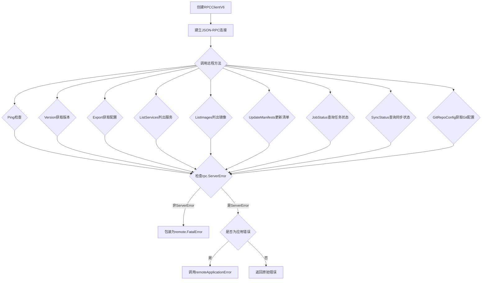

## 类结构

```
RPCClientV6 (RPC客户端实现)
├── baseClient (嵌入的基础客户端)
└── *rpc.Client (JSON-RPC客户端)
```

## 全局变量及字段


### `supportedKindsV6`
    
支持的服务类型列表，仅包含service，用于验证API请求中的资源类型

类型：`[]string`
    


### `RPCClientV6.*baseClient`
    
嵌入的基础客户端，包含RPC通信的通用功能和方法

类型：`*baseClient`
    


### `RPCClientV6.*rpc.Client`
    
实际的RPC客户端实例，负责与远程RPC服务器建立连接和通信

类型：`*rpc.Client`
    
    

## 全局函数及方法


### `NewClientV6`

该函数用于创建一个基于 RPC 的客户端实现，通过传入的 I/O 读写closer建立与远程fluxd守护进程的JSON-RPC连接，并返回封装好的RPCClientV6客户端实例。

参数：

- `conn`：`io.ReadWriteCloser`，用于与远程RPC服务器通信的读写closer接口

返回值：`*RPCClientV6`，返回新创建的RPC客户端实例，用于与fluxd守护进程进行RPC通信

#### 流程图

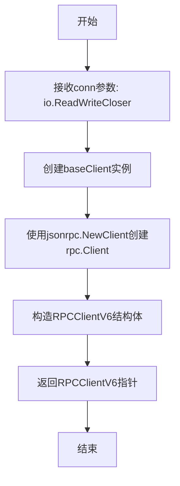

#### 带注释源码

```go
// NewClient creates a new rpc-backed implementation of the server.
// 该函数用于创建一个新的基于RPC的服务器实现客户端
// 参数conn: io.ReadWriteCloser类型，用于RPC通信的底层连接
// 返回值: *RPCClientV6类型，返回封装好的RPC客户端实例
func NewClientV6(conn io.ReadWriteCloser) *RPCClientV6 {
	// 创建一个RPCClientV6实例，包含baseClient和jsonrpc客户端
	// baseClient可能包含公共的客户端逻辑
	// jsonrpc.NewClient将conn包装成JSON-RPC客户端
	return &RPCClientV6{&baseClient{}, jsonrpc.NewClient(conn)}
}
```


### `remoteApplicationError`

该函数是一个全局错误转换函数，用于将远程 RPC 调用返回的普通错误封装为用户友好的应用错误（fluxerr.Error），添加更详细的错误描述信息，帮助用户理解错误来源。

参数：

- `err`：`error`，从远程 RPC 调用返回的原始错误

返回值：`error`，封装后的应用错误（`*fluxerr.Error`），包含错误类型、原始错误和用户友好的帮助信息

#### 流程图

```mermaid
flowchart TD
    A[开始: 接收原始错误 err] --> B{错误是否为空}
    B -->|是| C[返回 nil]
    B -->|否| D[创建 fluxerr.Error 结构体]
    D --> E[设置 Type 为 fluxerr.User]
    E --> F[设置 Err 为原始错误 err]
    F --> G[设置 Help 文本<br/>包含错误来源说明和 err.Error()]
    G --> H[返回封装后的错误]
```

#### 带注释源码

```go
// remoteApplicationError 将远程 RPC 调用返回的错误转换为用户友好的应用错误
// 注意：v6 版本不会返回正确的应用错误结构体，因此任何非致命错误都会被
// 转换为应用错误，以便向用户提供有意义的错误信息
func remoteApplicationError(err error) error {
    // 创建一个新的 fluxerr.Error 结构体，包含以下信息：
    // - Type: 设置为 User 类型，表示这是用户需要知道的错误
    // - Err: 原始错误对象
    // - Help: 格式化的帮助文本，说明错误来自集群中运行的 fluxd daemon
    return &fluxerr.Error{
        Type: fluxerr.User,  // 错误类型为用户错误
        Err:  err,           // 保留原始错误
        Help: `Error from daemon

The daemon (fluxd, running in your cluster) reported this error when
attempting to fulfil your request:

    ` + err.Error() + `
`, // 包含原始错误信息作为帮助文本
    }
}
```


### `RPCClientV6.Ping`

该方法用于检测远程 RPC 服务器是否可用，通过向远程服务发送 Ping 请求并根据响应判断连接状态，是客户端保活和连接健康检查的基础方法。

参数：

- `ctx`：`context.Context`，用于传递上下文信息（如超时控制、取消信号等），确保请求可以在必要时被取消或超时

返回值：`error`，如果远程服务器不可达或返回错误，则返回相应的错误信息；否则返回 nil 表示服务器可用

#### 流程图

```mermaid
flowchart TD
    A[开始 Ping] --> B[调用 p.client.Call RPCServer.Ping]
    B --> C{err 是否为空?}
    C -->|是| D[返回 nil]
    C -->|否| E{err 是否为 rpc.ServerError?}
    E -->|是| F[返回 err]
    E -->|否| G[返回 remote.FatalError{err}]
    D --> H[结束]
    F --> H
    G --> H
```

#### 带注释源码

```go
// Ping is used to check if the remote server is available.
// Ping 方法用于检查远程服务器是否可用
func (p *RPCClientV6) Ping(ctx context.Context) error {
	// 调用远程 RPC 方法 "RPCServer.Ping"，传入空结构体，接收 nil 响应
	// 使用 jsonrpc 客户端向服务器发送 Ping 请求
	err := p.client.Call("RPCServer.Ping", struct{}{}, nil)
	
	// 检查错误类型：
	// 如果错误不是 rpc.ServerError 类型（即为底层网络错误），则包装为 FatalError
	// rpc.ServerError 表示服务器端返回的应用级错误，这种错误可以直接返回给调用者
	if _, ok := err.(rpc.ServerError); !ok && err != nil {
		return remote.FatalError{err}
	}
	
	// 如果没有错误，或者错误类型为 rpc.ServerError，直接返回原错误
	return err
}
```


### `RPCClientV6.Version`

该方法用于检查远程服务器的版本号，通过 RPC 调用远程的 `RPCServer.Version` 方法。如果远程服务器不支持 Version 方法（旧版本 fluxd），则优雅地返回 "unknown"，而不是直接报错。

参数：

- `ctx`：`context.Context`，用于传递上下文信息（如超时、取消信号等）

返回值：`string, error`：返回远程服务器的版本号（字符串），如果远程服务器不支持该方法则返回 "unknown"；如果调用过程中发生致命错误，则返回 `remote.FatalError` 类型的错误。

#### 流程图

```mermaid
flowchart TD
    A[开始 Version 方法] --> B[调用 p.client.Call RPCServer.Version]
    B --> C{是否有错误?}
    C -->|是 且 不是 rpc.ServerError| D[返回 空字符串, remote.FatalError{err}]
    C -->|是 且 错误信息为 "rpc: can't find method RPCServer.Version"| E[返回 "unknown", nil]
    C -->|否| F[返回 version, err]
    D --> G[结束]
    E --> G
    F --> G
```

#### 带注释源码

```go
// Version is used to check the version of the remote server.
// 用于检查远程服务器的版本号
func (p *RPCClientV6) Version(ctx context.Context) (string, error) {
    // 定义一个字符串变量用于接收返回的版本号
	var version string
    // 通过 RPC 调用远程服务器的 Version 方法
    // 第一个参数是方法名，第二个是请求参数（空结构体），第三个是接收响应结果的指针
	err := p.client.Call("RPCServer.Version", struct{}{}, &version)
    // 检查错误：如果不是 rpc.ServerError 类型的错误，且确实有错误发生
	if _, ok := err.(rpc.ServerError); !ok && err != nil {
        // 这是一个致命错误，返回空字符串和 remote.FatalError
		return "", remote.FatalError{err}
	} else if err != nil && err.Error() == "rpc: can't find method RPCServer.Version" {
		// "Version" is not supported by this version of fluxd (it is old). Fail
		// gracefully.
        // 如果错误是因为远程服务器不支持 Version 方法（旧版本的 fluxd），
        // 则优雅地返回 "unknown" 版本号，而不是报错
		return "unknown", nil
	}
    // 正常返回版本号和可能的错误
	return version, err
}
```


### `RPCClientV6.Export`

该函数是 RPC 客户端 V6 版本的导出方法，用于通过 RPC 协议从远程 Flux daemon 获取集群特定格式的服务配置数据。它封装了底层的 RPC 调用逻辑，并提供统一的错误处理机制，将远程错误转换为应用层错误。

参数：

- `ctx`：`context.Context`，用于传递上下文信息（如超时、取消信号等），确保 RPC 调用可被控制和追踪

返回值：

- `[]byte`：返回获取到的服务配置字节数组，如果发生错误则为 `nil`
- `error`：如果 RPC 调用成功则返回 `nil`，否则返回错误（可能是远程致命错误或应用层错误）

#### 流程图

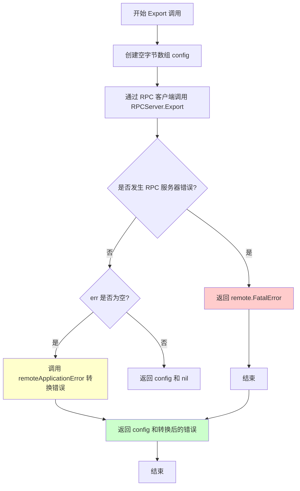

#### 带注释源码

```go
// Export is used to get service configuration in cluster-specific format
// Export 方法用于获取集群特定格式的服务配置
func (p *RPCClientV6) Export(ctx context.Context) ([]byte, error) {
	// 声明一个空字节数组用于接收返回的配置数据
	var config []byte
	
	// 使用 RPC 客户端调用远程服务器的 Export 方法
	// 参数1: RPC 服务器端的方法名 "RPCServer.Export"
	// 参数2: 请求参数，此处为空结构体 struct{}{}
	// 参数3: 指向接收返回值的变量的指针
	err := p.client.Call("RPCServer.Export", struct{}{}, &config)
	
	// 检查错误是否为 RPC 服务器错误
	// 如果不是 rpc.ServerError 类型且错误不为空，说明是底层通信错误
	if _, ok := err.(rpc.ServerError); !ok && err != nil {
		// 将底层错误包装为远程致命错误并返回
		return nil, remote.FatalError{err}
	}
	
	// 如果存在错误（但不是致命错误），将其转换为应用层错误
	if err != nil {
		err = remoteApplicationError(err)
	}
	
	// 返回配置数据和可能的应用层错误
	return config, err
}
```


### `RPCClientV6.ListServices`

该方法通过 RPC 调用远程服务器，查询指定命名空间下的所有服务（Controller）列表，并将返回的服务状态转换为 `[]v6.ControllerStatus` 切片返回，同时处理各类 RPC 错误，将其转换为适合客户端理解的错误类型。

**参数：**

- `ctx`：`context.Context`，用于传递上下文信息（如超时、取消信号）
- `namespace`：`string`，要查询的服务命名空间

**返回值：**

- `[]v6.ControllerStatus`：服务控制器状态列表
- `error`：执行过程中的错误信息，可能为 `remote.FatalError`、`fluxerr.Error` 或 RPC 框架错误

#### 流程图

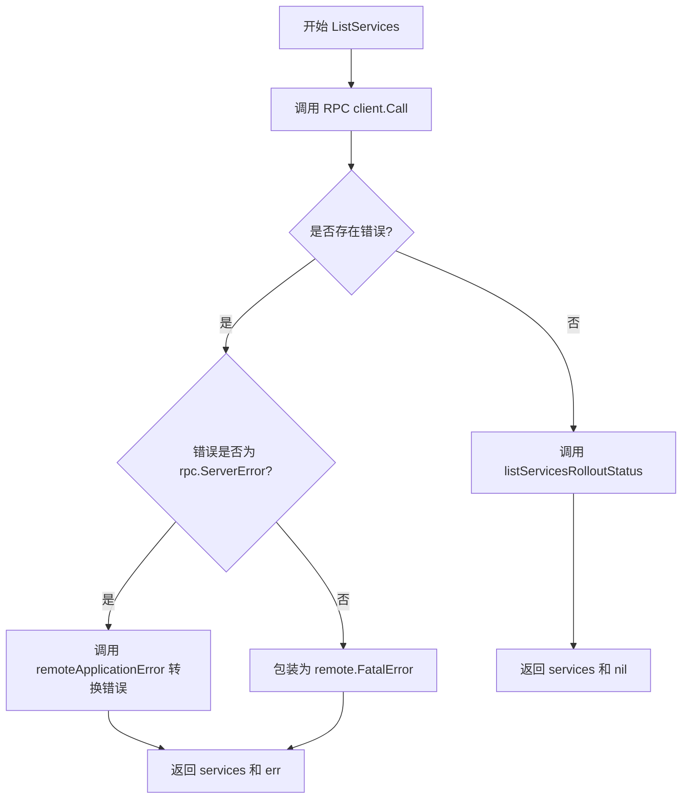

#### 带注释源码

```go
// ListServices 查询指定命名空间下的所有服务
// 参数：
//   - ctx: 上下文对象，用于控制请求超时和取消
//   - namespace: 目标命名空间
// 返回值：
//   - []v6.ControllerStatus: 服务状态列表
//   - error: 错误信息
func (p *RPCClientV6) ListServices(ctx context.Context, namespace string) ([]v6.ControllerStatus, error) {
	// 用于接收 RPC 返回的服务列表
	var services []v6.ControllerStatus
	
	// 通过 RPC 调用远程服务器的 ListServices 方法
	// 传入 namespace 作为请求参数，结果写入 services 指针
	err := p.client.Call("RPCServer.ListServices", namespace, &services)
	
	// 处理服务列表的滚动发布状态（辅助函数）
	listServicesRolloutStatus(services)
	
	// 错误处理：检查是否为 RPC 服务器错误
	// 如果不是 rpc.ServerError 类型且存在错误，说明是底层通信错误
	if _, ok := err.(rpc.ServerError); !ok && err != nil {
		// 将底层错误包装为 FatalError，表示连接层面的严重错误
		return nil, remote.FatalError{err}
	}
	
	// 如果存在错误（且是 rpc.ServerError），转换为应用层错误
	if err != nil {
		// 将 RPC 服务器返回的错误转换为用户友好的应用错误
		err = remoteApplicationError(err)
	}
	
	// 返回服务列表和错误信息
	return services, err
}
```


### `RPCClientV6.ListServicesWithOptions`

该方法是一个RPC客户端封装，用于通过JSON-RPC协议从远程Flux守护进程获取满足特定选项条件的Kubernetes控制器（如Service）状态列表，并支持过滤特定资源类型。

**参数：**

- `ctx`：`context.Context`，用于传递上下文信息（如超时、取消信号等）
- `opts`：`v11.ListServicesOptions`，包含查询过滤选项（如命名空间、标签选择器等）

**返回值：** `([]v6.ControllerStatus, error)`，返回符合选项条件的控制器状态列表切片；若发生错误则返回错误信息，其中RPC连接错误会被包装为`remote.FatalError`，应用层错误会被包装为`fluxerr.Error`。

#### 流程图

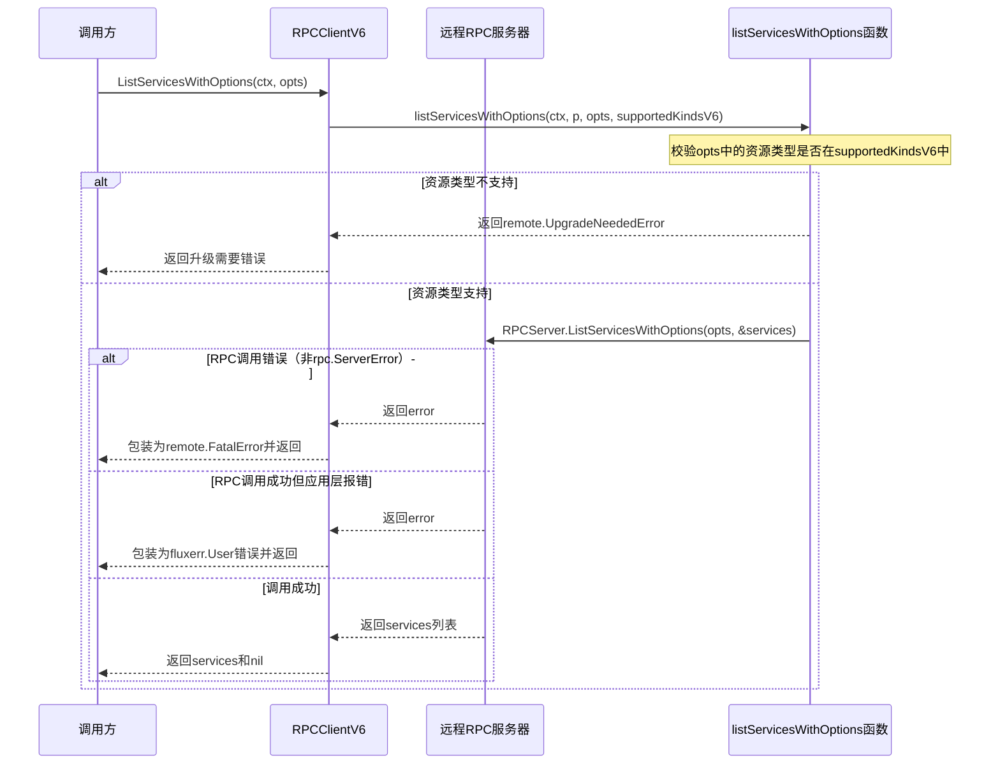

#### 带注释源码

```go
// ListServicesWithOptions 获取满足特定选项的服务列表
// ctx: 上下文对象，用于控制请求超时和取消
// opts: v11版本的ListServicesOptions，包含查询过滤条件
// 返回: 符合条件的服务状态列表和可能的错误
func (p *RPCClientV6) ListServicesWithOptions(ctx context.Context, opts v11.ListServicesOptions) ([]v6.ControllerStatus, error) {
	// 调用辅助函数listServicesWithOptions进行实际处理
	// 传入上下文、RPCClientV6实例本身、选项参数以及支持的资源类型列表
	// supportedKindsV6定义了该客户端支持的资源类型（此处为"service"）
	return listServicesWithOptions(ctx, p, opts, supportedKindsV6)
}
```


### `RPCClientV6.ListImages`

该方法用于通过RPC调用远程守护进程（fluxd）列出指定资源的镜像信息。首先验证资源规格是否包含支持的种类（service），若不支持则返回升级需要错误；若支持，则发起RPC调用获取镜像状态列表，并对可能的错误进行适当的转换处理。

参数：

- `ctx`：`context.Context`，上下文对象，用于传递请求范围内的取消信号和截止时间
- `spec`：`update.ResourceSpec`，资源规格，指定需要列出镜像的资源

返回值：`([]v6.ImageStatus, error)`，返回镜像状态列表和可能的错误；若成功则返回镜像状态切片，若失败则返回错误信息（可能是升级需要错误、致命错误或应用错误）

#### 流程图

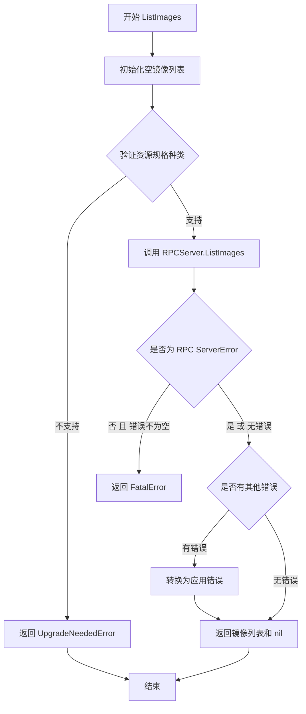

#### 带注释源码

```go
// ListImages 获取指定资源的镜像信息列表
// 参数：
//   - ctx: 上下文对象，用于控制请求生命周期
//   - spec: 资源规格，指定要查询的资源
//
// 返回值：
//   - []v6.ImageStatus: 镜像状态列表
//   - error: 如果发生错误，返回相应错误；成功时返回 nil
func (p *RPCClientV6) ListImages(ctx context.Context, spec update.ResourceSpec) ([]v6.ImageStatus, error) {
	// 1. 初始化返回变量，默认为空切片
	var images []v6.ImageStatus

	// 2. 验证资源规格是否包含支持的种类（V6版本仅支持 "service"）
	if err := requireServiceSpecKinds(spec, supportedKindsV6); err != nil {
		// 如果种类不支持，返回升级需要错误，提示客户端需要升级
		return images, remote.UpgradeNeededError(err)
	}

	// 3. 通过RPC调用远程服务器的 ListImages 方法
	err := p.client.Call("RPCServer.ListImages", spec, &images)

	// 4. 检查错误类型
	// 如果不是 RPC 服务器错误且存在错误，则为致命错误（如网络问题）
	if _, ok := err.(rpc.ServerError); !ok && err != nil {
		return nil, remote.FatalError{err}
	}

	// 5. 如果存在错误（非致命），转换为应用级别错误并返回
	if err != nil {
		err = remoteApplicationError(err)
	}

	// 6. 返回镜像列表和错误信息
	return images, err
}
```


### `RPCClientV6.ListImagesWithOptions`

该方法是 RPC 客户端用于获取容器镜像列表的核心方法，通过调用内部函数 `listImagesWithOptions` 实现远程 RPC 调用，返回指定选项筛选后的镜像状态列表。

参数：

- `ctx`：`context.Context`，用于控制请求的生命周期和取消操作
- `opts`：`v10.ListImagesOptions`，查询选项，包含要列出哪些镜像的配置信息（如命名空间、资源规格等）

返回值：`([]v6.ImageStatus, error)`，返回镜像状态列表和可能的错误信息。成功时返回镜像状态切片，失败时返回错误详情。

#### 流程图

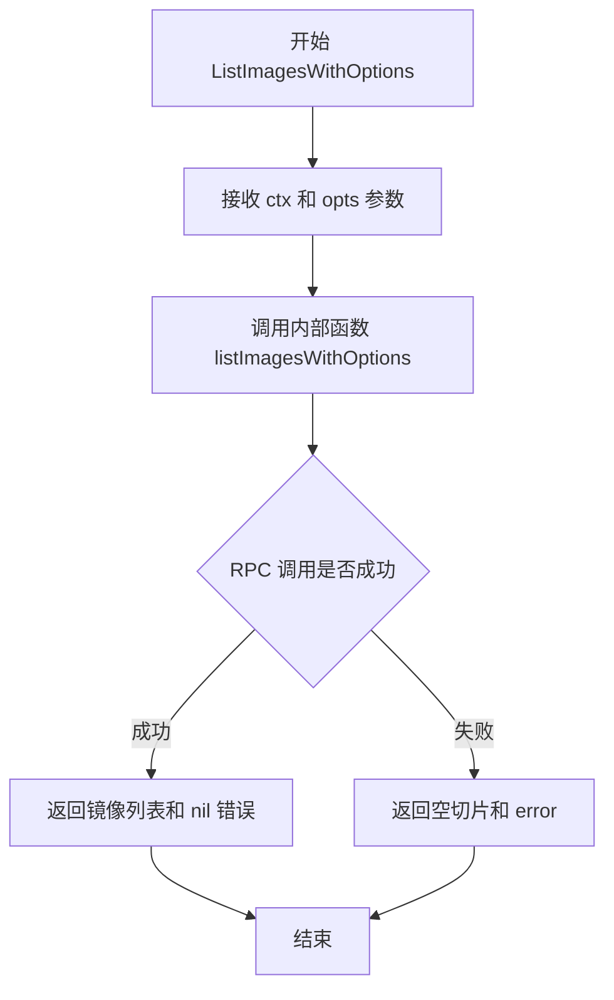

#### 带注释源码

```go
// ListImagesWithOptions 是 RPC 客户端获取镜像列表的方法
// 参数 ctx 用于传递上下文信息（如超时、取消等）
// 参数 opts 是 v10 版本的 ListImagesOptions，包含查询选项
// 返回 []v6.ImageStatus 镜像状态列表和 error 错误信息
func (p *RPCClientV6) ListImagesWithOptions(ctx context.Context, opts v10.ListImagesOptions) ([]v6.ImageStatus, error) {
    // 委托给内部函数 listImagesWithOptions 处理实际的 RPC 调用逻辑
    // 这里使用了依赖倒置，将具体实现分离到独立函数中
    return listImagesWithOptions(ctx, p, opts)
}
```


### `RPCClientV6.UpdateManifests`

该方法用于通过 RPC 调用远程 fluxd 守护进程的 `UpdateManifests` 接口，以更新集群中的资源清单。它接受一个更新规范（update.Spec），返回对应的作业 ID（job.ID）用于后续状态查询。

参数：

- `ctx`：`context.Context`，上下文对象，用于传递请求截止时间、取消信号等
- `u`：`update.Spec`，更新规范，描述需要在集群中执行的更新操作（如升级镜像、修改配置等）

返回值：`job.ID`，返回远程守护进程创建的作业唯一标识符，可用于后续查询作业执行状态；`error`，如果调用过程中发生错误（包括非致命错误和致命连接错误），则返回对应的错误对象

#### 流程图

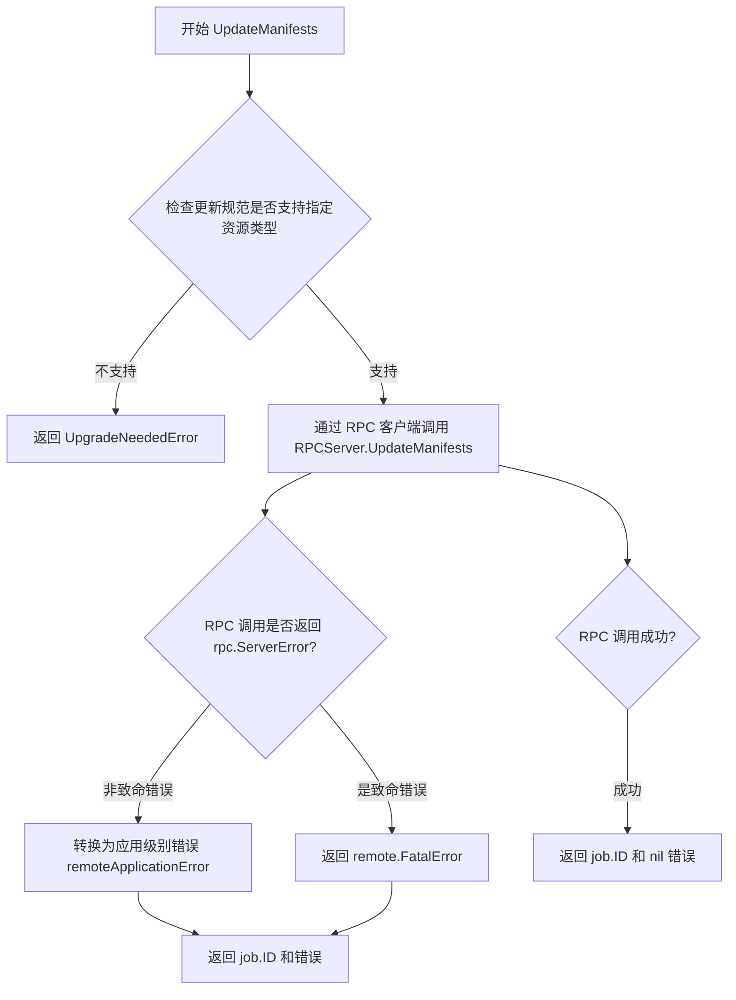

#### 带注释源码

```go
// UpdateManifests 通过 RPC 调用远程守护进程执行清单更新
// 参数 ctx 用于控制请求生命周期，u 为更新规范
// 返回 job.ID 用于后续查询任务状态，以及可能出现的错误
func (p *RPCClientV6) UpdateManifests(ctx context.Context, u update.Spec) (job.ID, error) {
	var result job.ID // 用于存储远程返回的作业 ID

	// 检查更新规范中指定的资源类型是否被当前客户端版本支持
	// supportedKindsV6 定义了 v6 版本支持的资源类型（目前仅为 "service"）
	// 如果不支持，返回升级需要错误，提示客户端需要使用更新版本的 fluxctl
	if err := requireSpecKinds(u, supportedKindsV6); err != nil {
		return result, remote.UpgradeNeededError(err)
	}

	// 通过 JSON-RPC 调用远程 RPCServer 的 UpdateManifests 方法
	// 参数 u (update.Spec) 被发送到服务器，结果存储在 result (job.ID) 中
	err := p.client.Call("RPCServer.UpdateManifests", u, &result)

	// 检查返回的错误是否为 rpc.ServerError 类型
	// 如果不是 rpc.ServerError 且错误不为空，说明是底层通信错误（如网络中断）
	// 这种情况下包装为 FatalError，表示连接层面的严重问题
	if _, ok := err.(rpc.ServerError); !ok && err != nil {
		return result, remote.FatalError{err}
	}

	// 如果返回了应用层错误（非FatalError），将其转换为更友好的用户错误格式
	// remoteApplicationError 会将错误包装为 fluxerr.Error，提供更详细的帮助信息
	if err != nil {
		err = remoteApplicationError(err)
	}

	// 返回作业 ID 和可能存在的错误
	// 调用方可以使用返回的 job.ID 调用 JobStatus 方法查询任务执行状态
	return result, err
}
```


### `RPCClientV6.SyncNotify`

通知远程 RPC 服务器执行同步操作，用于触发 Fluxd 守护进程执行配置同步。

参数：

- `ctx`：`context.Context`，用于传递上下文信息（如超时、取消信号等）

返回值：`error`，如果同步通知成功返回 nil，否则返回错误（可能是远程FatalError或应用层错误）

#### 流程图

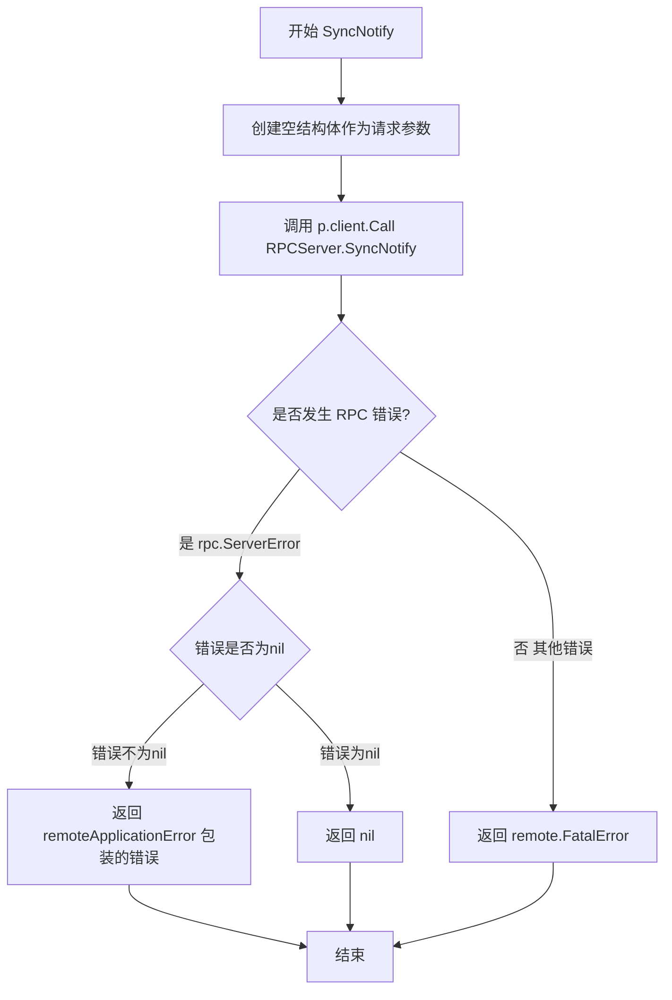

#### 带注释源码

```go
// SyncNotify 通知远程服务器执行同步操作
func (p *RPCClientV6) SyncNotify(ctx context.Context) error {
	// 定义一个空结构体作为 RPC 调用的请求参数
	var result struct{}
	
	// 通过 RPC 客户端调用远程服务器的 SyncNotify 方法
	// 参数1: 方法名 "RPCServer.SyncNotify"
	// 参数2: 请求参数 (空结构体)
	// 参数3: 接收响应的指针
	err := p.client.Call("RPCServer.SyncNotify", struct{}{}, &result)
	
	// 检查错误是否为 rpc.ServerError 类型
	// 如果不是 rpc.ServerError 且 err 不为 nil，说明是连接级别的致命错误
	if _, ok := err.(rpc.ServerError); !ok && err != nil {
		// 将底层错误包装为 FatalError 并返回
		return remote.FatalError{err}
	}
	
	// 如果存在应用层错误，将其转换为用户友好的应用错误
	if err != nil {
		err = remoteApplicationError(err)
	}
	
	// 返回最终处理后的错误 (成功时为 nil)
	return err
}
```


### `RPCClientV6.JobStatus`

该方法用于从远程 RPC 服务器获取指定作业（Job）的当前状态信息。它通过 RPC 调用将作业 ID 发送给服务器，并接收返回的作业状态对象，同时进行错误处理以区分致命错误和应用层错误。

参数：

- `ctx`：`context.Context`，用于控制请求的取消、超时等上下文信息
- `jobID`：`job.ID`，要查询状态的作业唯一标识符

返回值：

- `job.Status`：远程服务器返回的作业状态对象
- `error`：如果发生错误，返回相应的错误对象；可能为远程致命错误（`remote.FatalError`）或应用层错误（通过 `remoteApplicationError` 包装）

#### 流程图

```mermaid
flowchart TD
    A[开始 JobStatus] --> B[创建 result 变量]
    B --> C{调用 RPC}
    C --> D[p.client.Call 'RPCServer.JobStatus']
    D --> E{检查错误类型}
    E -->|rpc.ServerError| F{err != nil}
    E -->|非 rpc.ServerError| G[返回 remote.FatalError]
    F -->|是| H[调用 remoteApplicationError]
    F -->|否| I[返回 result]
    H --> J[返回 result 和 err]
    I --> J
    G --> K[返回 job.Status{} 和 FatalError]
    K --> L[结束]
```

#### 带注释源码

```go
// JobStatus retrieves the status of a specific job from the remote RPC server.
// It takes a context for cancellation/timeout control and a job ID to identify
// which job's status to retrieve.
// Parameters:
//   - ctx: context.Context for request lifecycle management
//   - jobID: job.ID identifier of the job to query
//
// Returns:
//   - job.Status: the current status of the requested job
//   - error: nil on success, remote.FatalError for connection issues,
//            or application-level error wrapped by remoteApplicationError
func (p *RPCClientV6) JobStatus(ctx context.Context, jobID job.ID) (job.Status, error) {
	// Allocate a variable to hold the result from the RPC call
	var result job.Status

	// Make the RPC call to the remote server
	// Method: "RPCServer.JobStatus"
	// Input: jobID (the job identifier)
	// Output: &result (pointer to receive the job status)
	err := p.client.Call("RPCServer.JobStatus", jobID, &result)

	// Check if the error is NOT an rpc.ServerError (which is an application error)
	// and err is not nil (some other error occurred)
	// If so, it's a fatal connection/error that should be wrapped in remote.FatalError
	if _, ok := err.(rpc.ServerError); !ok && err != nil {
		// Return empty status and wrap the error as fatal
		return job.Status{}, remote.FatalError{err}
	}

	// If there IS an error (and it's an rpc.ServerError, i.e., application error)
	// wrap it with remoteApplicationError to provide better context
	if err != nil {
		err = remoteApplicationError(err)
	}

	// Return the result (job status) and any error that occurred
	return result, err
}
```


### `RPCClientV6.SyncStatus`

该方法用于通过 RPC 调用远程 fluxd 服务，获取指定 Git 引用（ref）的同步状态。它向 RPC 服务器发送同步状态查询请求，并返回包含同步状态的字符串切片。

参数：

- `ctx`：`context.Context`，上下文参数，用于传递请求的上下文信息、取消信号和超时控制
- `ref`：`string`，Git 引用（如分支名或标签名），用于指定要查询同步状态的特定引用

返回值：`([]string, error)`，返回同步状态的字符串切片以及可能的错误。如果成功，返回包含同步状态信息的字符串数组；如果发生错误，返回错误信息。

#### 流程图

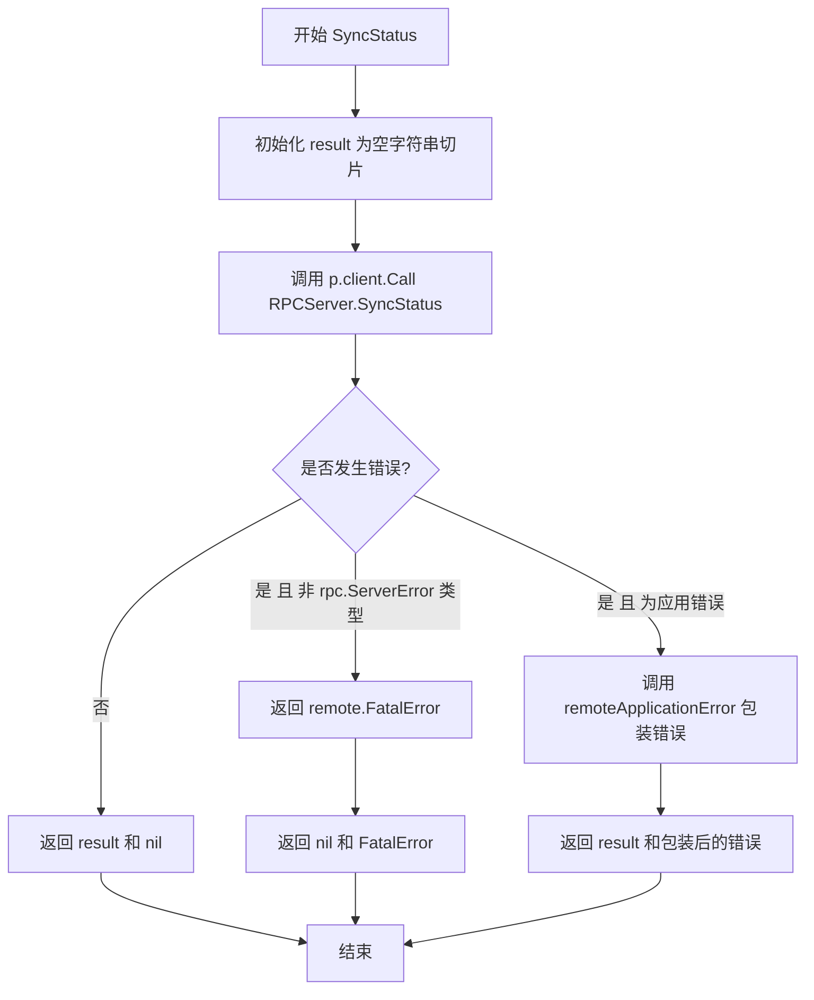

#### 带注释源码

```go
// SyncStatus 用于获取指定 Git 引用的同步状态
// 参数 ctx 用于控制请求生命周期，ref 是 Git 引用（如分支或标签）
func (p *RPCClientV6) SyncStatus(ctx context.Context, ref string) ([]string, error) {
	// 初始化结果变量为空字符串切片，用于接收 RPC 返回的同步状态
	var result []string
	
	// 通过 RPC 客户端调用远程服务器的 SyncStatus 方法
	// 参数 ref 为 Git 引用，结果存储在 result 指针中
	err := p.client.Call("RPCServer.SyncStatus", ref, &result)
	
	// 检查错误：如果不是 rpc.ServerError 类型且错误不为空，
	// 说明是连接等致命错误，需要包装为 remote.FatalError
	if _, ok := err.(rpc.ServerError); !ok && err != nil {
		return nil, remote.FatalError{err}
	}
	
	// 如果是应用层错误（非致命），将其转换为用户友好的应用错误
	if err != nil {
		err = remoteApplicationError(err)
	}
	
	// 返回同步状态结果和可能的错误
	return result, err
}
```


### `RPCClientV6.GitRepoConfig`

该方法通过 RPC 协议从远程 Flux daemon 获取 Git 仓库配置信息，支持可选的配置重新生成功能。

参数：

- `ctx`：`context.Context`，上下文对象，用于传递截止时间、取消信号等请求范围内的数据
- `regenerate`：`bool`，是否重新生成 Git 仓库配置的标志位

返回值：`v6.GitConfig`，Git 仓库配置结构体，包含仓库的 URL、分支、配置路径等信息；`error`，操作过程中的错误信息

#### 流程图

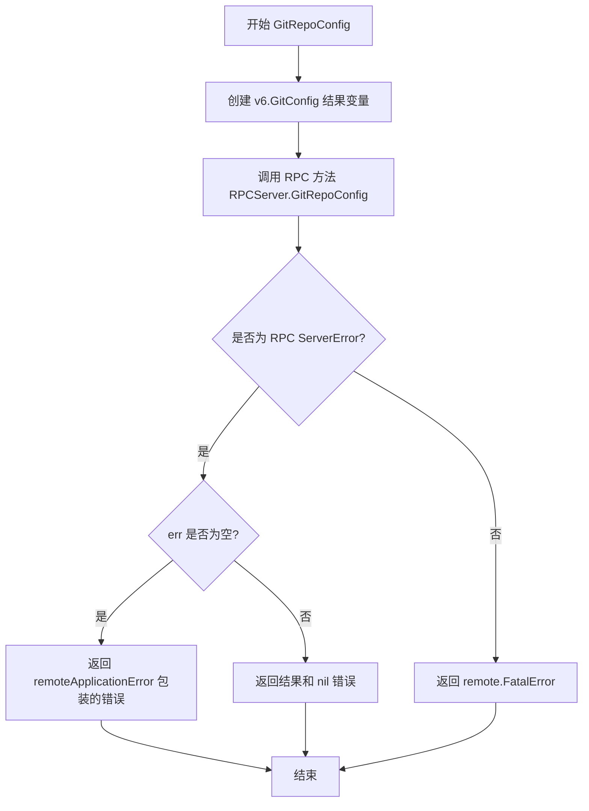

#### 带注释源码

```go
// GitRepoConfig 获取 Git 仓库配置信息
// 参数 ctx 用于控制请求生命周期，regenerate 表示是否需要重新生成配置
func (p *RPCClientV6) GitRepoConfig(ctx context.Context, regenerate bool) (v6.GitConfig, error) {
	// 声明一个 v6.GitConfig 类型的变量用于接收返回结果
	var result v6.GitConfig
	
	// 通过 RPC 客户端调用远程服务器的 GitRepoConfig 方法
	// 传入 regenerate 参数，结果写入 result 变量
	err := p.client.Call("RPCServer.GitRepoConfig", regenerate, &result)
	
	// 检查错误类型：如果不是 rpc.ServerError 且 err 不为空，
	// 说明是底层通信错误，返回远程致命错误
	if _, ok := err.(rpc.ServerError); !ok && err != nil {
		return v6.GitConfig{}, remote.FatalError{err}
	}
	
	// 如果存在错误但不是致命错误，将其转换为应用级别的错误返回
	if err != nil {
		err = remoteApplicationError(err)
	}
	
	// 返回配置结果和错误信息
	return result, err
}
```

## 关键组件


### RPCClientV6结构体

RPC客户端实现，用于与Flux CD远程守护进程(fluxd)通信，实现v6版本的API接口。

### clientV6接口

定义了客户端需要实现的v6.Server和v6.Upstream接口的组合。

### remoteApplicationError函数

错误转换函数，将远程守护进程返回的错误转换为用户友好的应用错误，包含错误类型、错误信息和帮助文本。

### supportedKindsV6变量

支持的资源类型列表，仅包含"service"类型，用于验证操作的目标资源类型。

### NewClientV6函数

RPC客户端构造函数，接收io.ReadWriteCloser参数创建并返回新的RPCClientV6实例。

### Ping方法

用于检查远程RPC服务器是否可用，通过调用"RPCServer.Ping"方法验证连接状态。

### Version方法

用于获取远程服务器的版本号，支持降级处理旧版本fluxd（若不支持Version方法则返回"unknown"）。

### Export方法

用于获取集群特定格式的服务配置，返回[]byte类型的配置数据。

### ListServices方法

列出指定命名空间下的所有服务(ControllerStatus)，并包含服务推出状态的rollout处理。

### ListServicesWithOptions方法

带选项的列表服务实现，调用listServicesWithOptions辅助函数并传入支持的资源类型。

### ListImages方法

列出指定资源规范的镜像信息，首先验证资源类型是否支持（仅service），然后获取镜像状态。

### ListImagesWithOptions方法

带选项的列表镜像实现，调用listImagesWithOptions辅助函数处理。

### UpdateManifests方法

更新集群中的清单资源，接收update.Spec参数并返回job.ID用于后续状态查询，同样验证资源类型支持。

### SyncNotify方法

通知远程服务器执行Git仓库同步操作，不返回具体结果。

### JobStatus方法

查询指定作业ID的当前状态，返回job.Status结构包含作业执行详情。

### SyncStatus方法

查询指定Git引用的同步状态，返回同步失败的资源列表。

### GitRepoConfig方法

获取或生成Git仓库配置，支持regenerate参数控制是否重新生成配置。

## 问题及建议


### 已知问题

- **上下文（Context）未实际使用**：所有方法接收 `ctx context.Context` 参数，但在实际的 `p.client.Call()` 调用中从未使用，导致无法通过 context 取消请求或传递超时控制。
- **脆弱的版本检测逻辑**：`Version()` 方法通过字符串匹配 `"rpc: can't find method RPCServer.Version"` 判断是否为旧版本，这种硬编码字符串比较极易因 RPC 库版本变化而失效。
- **重复的错误处理代码**：每个方法都包含几乎相同的错误处理模式（检查 `rpc.ServerError`、包装 `remote.FatalError`、转换为应用错误），导致大量代码重复，违反 DRY 原则。
- **类型断言缺乏健壮性**：多处使用 `err.(rpc.ServerError)` 进行类型断言，未进行 ok 检查或仅部分检查，可能导致潜在的 panic 风险。
- **缺乏日志和可观测性**：代码中没有任何日志记录机制，无法追踪 RPC 调用的请求/响应或失败原因，生产环境中难以排查问题。
- **无请求超时控制**：RPC 调用缺乏超时设置，可能导致客户端在服务端无响应时无限期阻塞。
- **接口定义冗余**：`clientV6` 接口同时嵌入 `v6.Server` 和 `v6.Upstream`，但实现类中部分方法未明确体现这种职责分离。

### 优化建议

- **实现 context 超时传递**：修改所有 RPC 调用，使用 `p.client.CallContext(ctx, ...)` 替代 `p.client.Call(...)`，确保 context 传播生效。
- **改进版本检测机制**：通过版本协商协议或 heartbeat 机制检测服务端版本，而非依赖错误消息字符串匹配。
- **抽象错误处理逻辑**：提取通用错误处理函数（如 `handleRPCError(err error) error`），减少重复代码。
- **添加日志中间件**：在 RPC 调用前后添加日志记录，支持结构化日志以便于监控和问题排查。
- **配置化超时参数**：为 RPC 客户端添加可配置的调用超时参数，并通过选项模式（Options Pattern）传递给客户端。
- **增强单元测试覆盖**：为错误处理路径、版本降级场景添加更多单元测试，确保异常分支的健壮性。

## 其它


### 设计目标与约束

本代码的设计目标是提供一个基于RPC的远程客户端实现，用于与Flux守护进程(fluxd)进行跨网络通信，实现v6版本的API接口。约束包括：仅支持"service"类型的资源、不支持旧版本Flux守护进程的Version方法、需要网络连接等。

### 错误处理与异常设计

代码采用三层错误处理机制：第一层是rpc.ServerError，表示远程服务器返回的应用级错误，通过remoteApplicationError转换为用户友好的错误信息；第二层是remote.FatalError，表示通信过程中的致命错误（如网络问题），直接返回；第三层是remote.UpgradeNeededError，当客户端请求的功能不被远程服务器支持时触发，提示用户需要升级。

### 数据流与状态机

客户端通过JSON-RPC协议与远程服务器通信，数据流为：本地调用→RPC客户端.Call()→序列化请求→网络传输→远程服务器→反序列化响应→返回结果。状态机主要涉及连接状态管理，由底层的rpc.Client维护，客户端方法根据返回的错误类型判断连接状态。

### 外部依赖与接口契约

依赖包括：flux/pkg/api/v6和v11（API接口定义）、flux/pkg/errors（错误类型定义）、flux/pkg/job（任务ID和状态）、flux/pkg/remote（远程错误定义）、flux/pkg/update（更新规范）。接口契约方面，实现了clientV6接口（包含v6.Server和v6.Upstream），NewClientV6接收io.ReadWriteCloser参数返回RPCClientV6指针。

### 并发与线程安全性

RPCClientV6本身不维护可变状态，线程安全主要依赖于底层的rpc.Client，后者通过goroutine处理并发请求。每个方法调用都携带context.Context参数，用于取消和超时控制。

### 版本兼容性

代码支持与旧版本Flux守护进程兼容，当远程服务器不支持Version方法时，返回"unknown"版本号而非错误。通过supportedKindsV6限制支持的资源类型，确保与不支持新功能的旧版本通信时给出明确提示。

### 潜在技术债务与优化空间

当前实现缺少连接池管理和重试机制，RPC调用失败后直接返回错误。错误处理中存在重复代码模式，可以提取公共方法。此外，可以考虑添加请求超时默认值、连接健康检查等增强功能。


    