# `flux\pkg\remote\rpc\clientV7.go` 详细设计文档

这是 Flux CD 项目中的 RPC 客户端 V7 实现，提供与远程守护进程通信的 RPC 后端实现，支持服务配置导出、服务列表、镜像列表、清单更新、同步通知等核心功能，是 V6 版本的增强版，用于正确传输错误数据。

## 整体流程

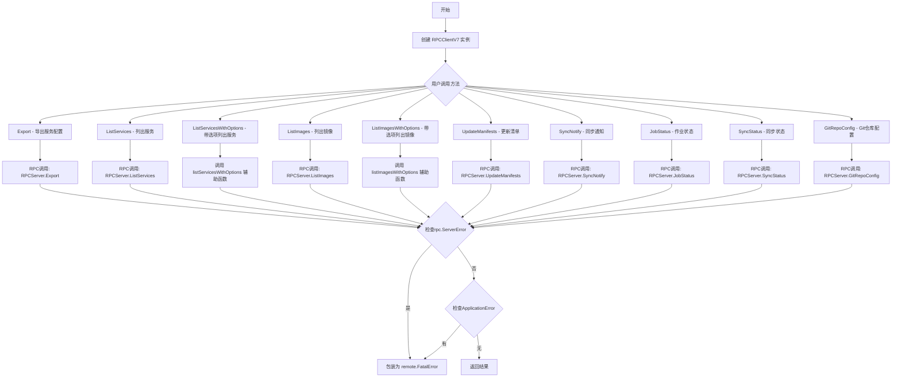

## 类结构

```
RPCClient (基类)
├── RPCClientV6
│   ├── RPCClientV7 (当前文件)
```

## 全局变量及字段


### `supportedKindsV7`
    
V7版本支持的资源类型列表，当前仅支持 service 类型

类型：`[]string`
    


### `RPCClientV7.*RPCClientV6`
    
嵌入的V6版本RPC客户端，继承基础RPC通信能力

类型：`*RPCClientV6`
    


### `SyncNotifyResponse.ApplicationError`
    
应用级别的错误，用于返回RPC调用过程中的业务错误

类型：`*fluxerr.Error`
    
    

## 全局函数及方法


### `NewClientV7`

创建一个RPC客户端实例（版本7），用于与远程Flux守护进程通信。该函数是工厂方法，通过传入的读写关闭器建立RPC连接，并返回一个封装好的V7版本客户端。

参数：

- `conn`：`io.ReadWriteCloser`，用于RPC通信的读写关闭器（通常为网络连接）

返回值：`*RPCClientV7`，返回新创建的RPCClientV7客户端实例

#### 流程图

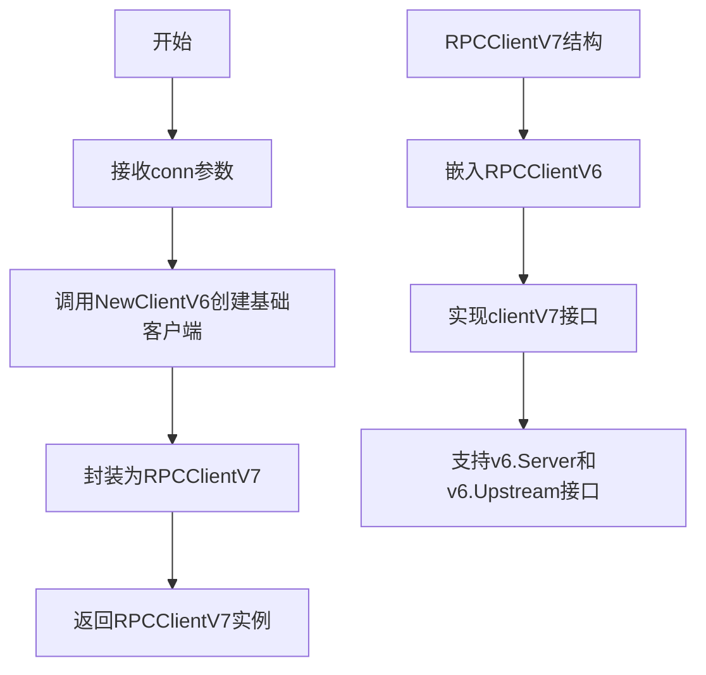

#### 带注释源码

```go
// NewClientV7 创建一个新的rpc-backed实现的服务端
// 参数conn是用于RPC通信的读写关闭器（通常为网络连接）
// 返回RPCClientV7客户端实例，用于与远程Flux守护进程交互
func NewClientV7(conn io.ReadWriteCloser) *RPCClientV7 {
    // 创建RPCClientV7实例，内部通过NewClientV6创建基础客户端
    // RPCClientV7继承自RPCClientV6，但使用不同的数据解码方式处理错误
    return &RPCClientV7{NewClientV6(conn)}
}
```


### `RPCClientV7.Export`

该方法用于获取集群特定格式的服务配置，通过 RPC 协议调用远程服务端的 Export 方法，并返回配置字节数组和可能的错误。

参数：

- `ctx`：`context.Context`，上下文参数，用于控制请求的生命周期和取消操作

返回值：

- `[]byte`：返回集群特定格式的服务配置数据
- `error`：返回执行过程中的错误信息，如果没有错误则返回 nil

#### 流程图

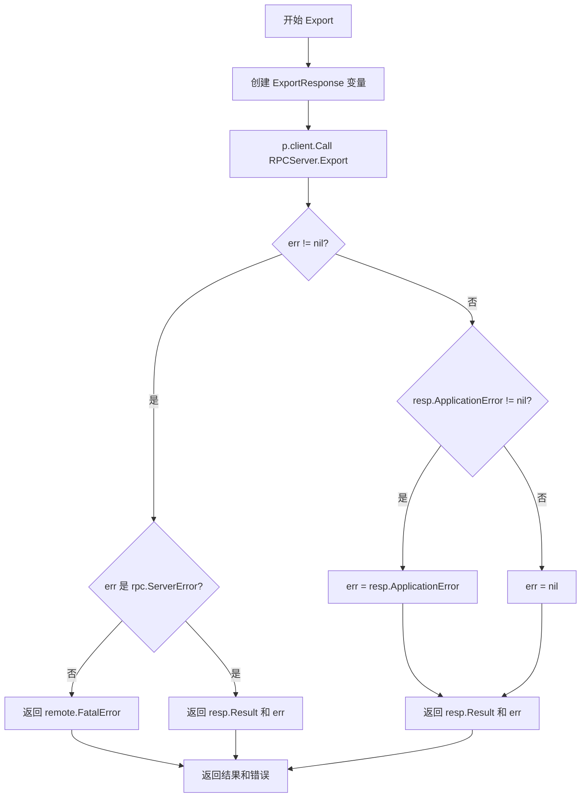

#### 带注释源码

```go
// Export is used to get service configuration in cluster-specific format
// Export 方法用于获取集群特定格式的服务配置
func (p *RPCClientV7) Export(ctx context.Context) ([]byte, error) {
    // 声明一个 ExportResponse 类型的响应变量
    var resp ExportResponse
    
    // 通过 RPC 客户端调用远程服务器的 Export 方法
    // 传入空结构体作为请求参数，响应写入 resp 变量
    err := p.client.Call("RPCServer.Export", struct{}{}, &resp)
    
    // 检查 RPC 调用是否返回错误
    if err != nil {
        // 判断错误是否为 rpc.ServerError 类型
        // 如果不是 rpc.ServerError 且存在错误，则包装为致命错误
        if _, ok := err.(rpc.ServerError); !ok && err != nil {
            // 返回当前结果和远程致命错误
            return resp.Result, remote.FatalError{err}
        }
        // 若是 rpc.ServerError，直接返回结果和错误
        return resp.Result, err
    }
    
    // 处理应用级别的错误（ApplicationError）
    // 如果存在应用错误，则将其设置为返回的错误
    err = resp.ApplicationError
    
    // 返回服务配置结果和错误信息
    return resp.Result, err
}
```


### `RPCClientV7.ListServices`

该方法通过 RPC 协议远程调用服务端的 ListServices 功能，传入上下文和命名空间参数，获取指定命名空间下的所有 Controller 状态列表，并处理可能的应用错误或 RPC 错误。

参数：

- `ctx`：`context.Context`，调用上下文，用于传递超时、取消等控制信息
- `namespace`：`string`，目标命名空间，用于过滤要查询的服务

返回值：`([]v6.ControllerStatus, error)`，返回控制器状态列表和可能发生的错误。成功时返回 `[]v6.ControllerStatus` 类型的切片，失败时返回错误信息。

#### 流程图

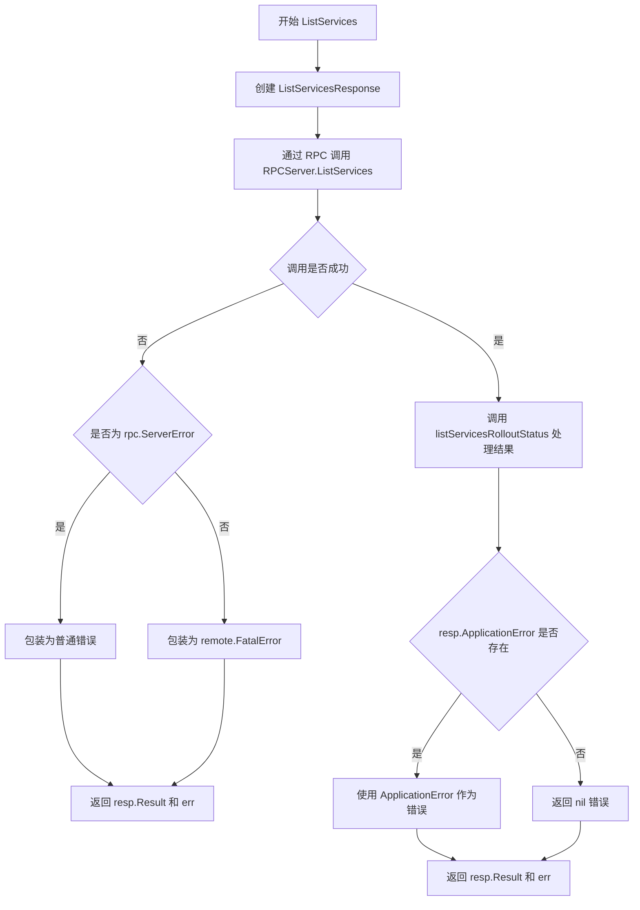

#### 带注释源码

```go
// ListServices 获取指定命名空间下的所有服务（Controller）状态
// 参数 ctx 为上下文对象，namespace 为目标命名空间
// 返回控制器状态切片和错误信息
func (p *RPCClientV7) ListServices(ctx context.Context, namespace string) ([]v6.ControllerStatus, error) {
	// 1. 声明响应结构体，用于接收 RPC 返回的数据
	var resp ListServicesResponse
	
	// 2. 执行 RPC 远程调用
	//    - 方法名: "RPCServer.ListServices"
	//    - 请求参数: namespace (命名空间)
	//    - 响应载体: &resp (指针传递以接收返回值)
	err := p.client.Call("RPCServer.ListServices", namespace, &resp)
	
	// 3. 调用辅助函数处理结果的展开状态（side effect）
	listServicesRollupStatus(resp.Result)
	
	// 4. 错误处理：检查 RPC 调用层错误
	if err != nil {
		// 判断是否为 rpc.ServerError 类型
		if _, ok := err.(rpc.ServerError); !ok && err != nil {
			// 非服务端错误包装为 FatalError（连接级严重错误）
			return resp.Result, remote.FatalError{err}
		}
		// 返回原始错误
		return resp.Result, err
	} else if resp.ApplicationError != nil {
		// 5. 处理应用层错误（业务逻辑错误）
		err = resp.ApplicationError
	}
	
	// 6. 返回结果和错误
	return resp.Result, err
}
```


### `RPCClientV7.ListServicesWithOptions`

该方法是 RPC 客户端 V7 版本中用于获取服务列表的接口，通过调用内部的 `listServicesWithOptions` 通用函数，结合 V7 支持的控制器类型（目前仅支持 "service"），返回集群中符合条件的控制器状态列表。

**参数：**

- `ctx`：`context.Context`，用于传递上下文信息，如超时、取消信号等
- `opts`：`v11.ListServicesOptions`，服务列表查询选项，包含命名空间、标签筛选等配置

**返回值：**`([]v6.ControllerStatus, error)`，返回控制器状态切片和可能发生的错误

#### 流程图

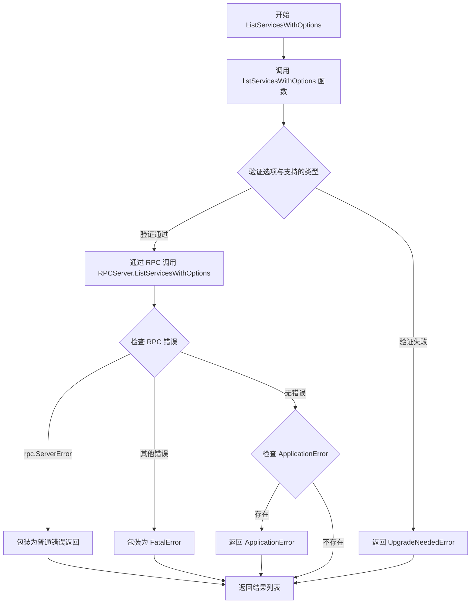

#### 带注释源码

```go
// ListServicesWithOptions 获取支持选项的服务列表
// ctx: 上下文对象，用于控制请求生命周期
// opts: v11.ListServicesOptions 类型的查询选项，包含筛选条件等
// 返回: []v6.ControllerStatus - 控制器状态列表，error - 执行过程中的错误信息
func (p *RPCClientV7) ListServicesWithOptions(ctx context.Context, opts v11.ListServicesOptions) ([]v6.ControllerStatus, error) {
    // 调用通用的 listServicesWithOptions 辅助函数
    // 传入上下文、客户端实例、选项以及 V7 版本支持的控制器类型列表
    return listServicesWithOptions(ctx, p, opts, supportedKindsV7)
}
```


### `RPCClientV7.ListImages`

该方法是 RPC 客户端 V7 版本中用于列出指定资源镜像状态的接口。它首先验证资源规范是否包含支持的种类（仅支持 "service"），然后通过 RPC 调用远程服务器获取镜像信息，并处理可能的错误情况。

参数：

- `ctx`：`context.Context`，调用上下文，用于传递超时、取消等请求级别的控制信息
- `spec`：`update.ResourceSpec`，资源规范，指定需要查询镜像的集群资源

返回值：`([]v6.ImageStatus, error)`，返回镜像状态切片和错误信息。镜像状态切片包含资源的当前镜像信息，错误可能来自网络调用、应用层错误或升级需求错误

#### 流程图

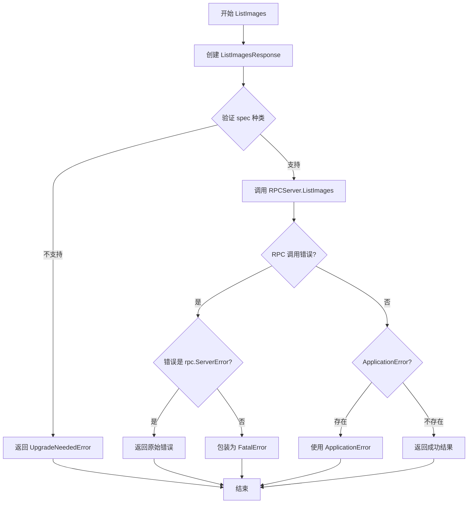

#### 带注释源码

```go
// ListImages 获取指定资源的镜像列表
// 参数：
//   - ctx: 上下文对象，用于控制请求生命周期
//   - spec: 资源规范，定义需要查询的资源
//
// 返回值：
//   - []v6.ImageStatus: 镜像状态列表
//   - error: 执行过程中的错误信息
func (p *RPCClientV7) ListImages(ctx context.Context, spec update.ResourceSpec) ([]v6.ImageStatus, error) {
	var resp ListImagesResponse
	
	// 验证资源规范是否包含支持的种类
	// V7版本仅支持 "service" 类型的资源
	if err := requireServiceSpecKinds(spec, supportedKindsV7); err != nil {
		// 如果种类不支持，返回升级需要错误
		return resp.Result, remote.UpgradeNeededError(err)
	}

	// 通过 RPC 调用远程服务器的 ListImages 方法
	err := p.client.Call("RPCServer.ListImages", spec, &resp)
	
	// 错误处理逻辑
	if err != nil {
		// 检查错误是否为 RPC 服务器错误
		if _, ok := err.(rpc.ServerError); !ok && err != nil {
			// 非服务器错误包装为致命错误
			err = remote.FatalError{err}
		}
	} else if resp.ApplicationError != nil {
		// 处理应用层返回的错误
		err = resp.ApplicationError
	}
	
	// 返回结果和可能的错误
	return resp.Result, err
}
```


### `RPCClientV7.ListImagesWithOptions`

该方法是 RPC 客户端 V7 版本中用于获取镜像列表的核心方法，通过委托调用全局函数 `listImagesWithOptions` 来执行实际的 RPC 通信逻辑，返回指定选项下的镜像状态列表及可能的错误信息。

参数：

- `ctx`：`context.Context`，上下文参数，用于传递取消信号、超时控制等请求级别的元数据
- `opts`：`v10.ListImagesOptions`，列出镜像的选项参数，包含过滤条件、分页信息等配置

返回值：`[]v6.ImageStatus, error`，返回镜像状态切片和错误信息；如果成功则返回镜像列表，失败则返回错误

#### 流程图

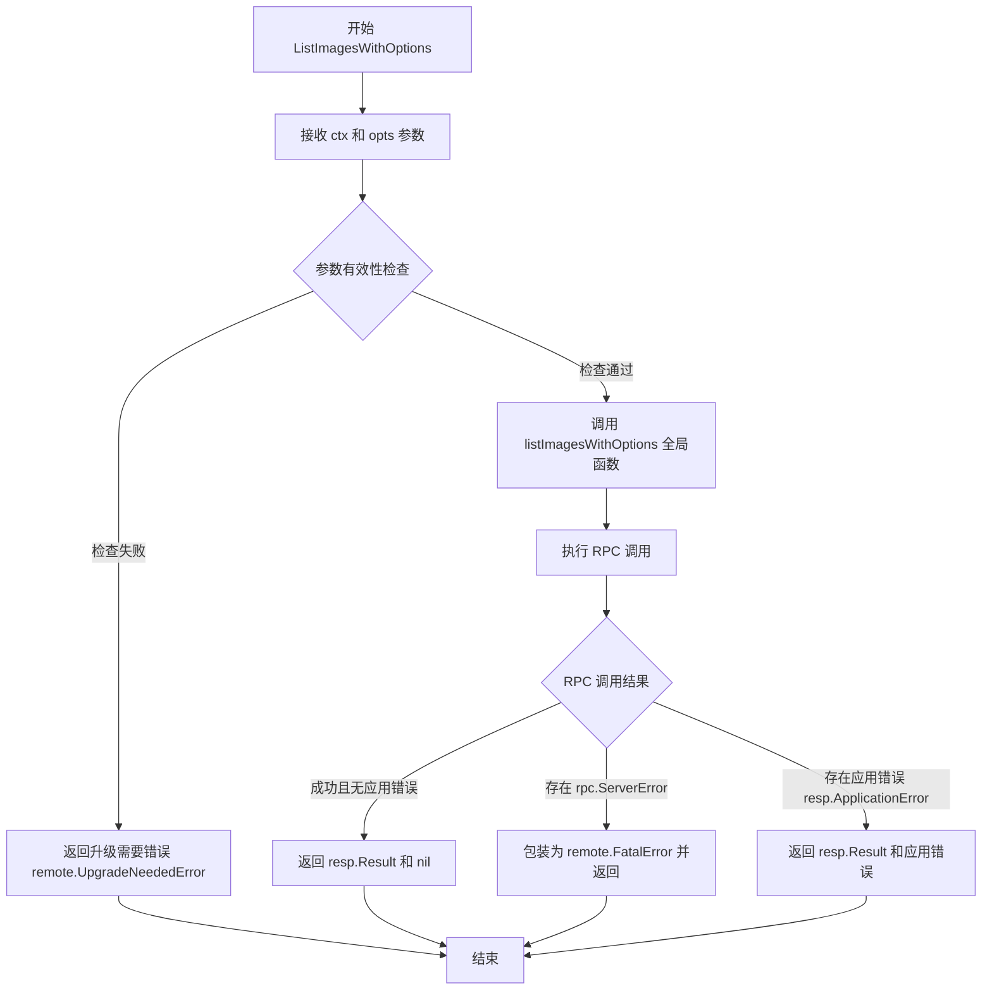

#### 带注释源码

```go
// ListImagesWithOptions 用于根据指定的选项参数获取镜像列表
// ctx: 上下文对象，用于控制请求生命周期和传递取消信号
// opts: v10.ListImagesOptions 类型，包含查询镜像时的过滤和分页选项
// 返回: []v6.ImageStatus 镜像状态列表和 error 错误对象
func (p *RPCClientV7) ListImagesWithOptions(ctx context.Context, opts v10.ListImagesOptions) ([]v6.ImageStatus, error) {
	// 委托给全局函数 listImagesWithOptions 执行实际逻辑
	// p 作为 RPCClientV7 指针被传递给底层函数用于发起 RPC 调用
	return listImagesWithOptions(ctx, p, opts)
}
```


### `RPCClientV7.UpdateManifests`

该方法是一个 RPC 客户端方法，用于通过远程过程调用向 RPC 服务器发送清单更新请求。它接收一个更新规范（update.Spec），验证支持的资源类型，然后调用服务器端的 `UpdateManifests` 方法，返回一个作业 ID 用于后续状态跟踪，并处理各类错误包括应用程序错误和 RPC 错误。

#### 参数

- `ctx`：`context.Context`，上下文对象，用于传递请求范围内的取消、截止日期和请求范围值
- `u`：`update.Spec`，更新规范，指定要执行的更新操作（如同步、释放等）

#### 返回值

- `job.ID`：作业标识符，用于后续查询更新状态
- `error`：错误信息，可能来自 RPC 调用失败、应用程序错误或需要升级的错误

#### 流程图

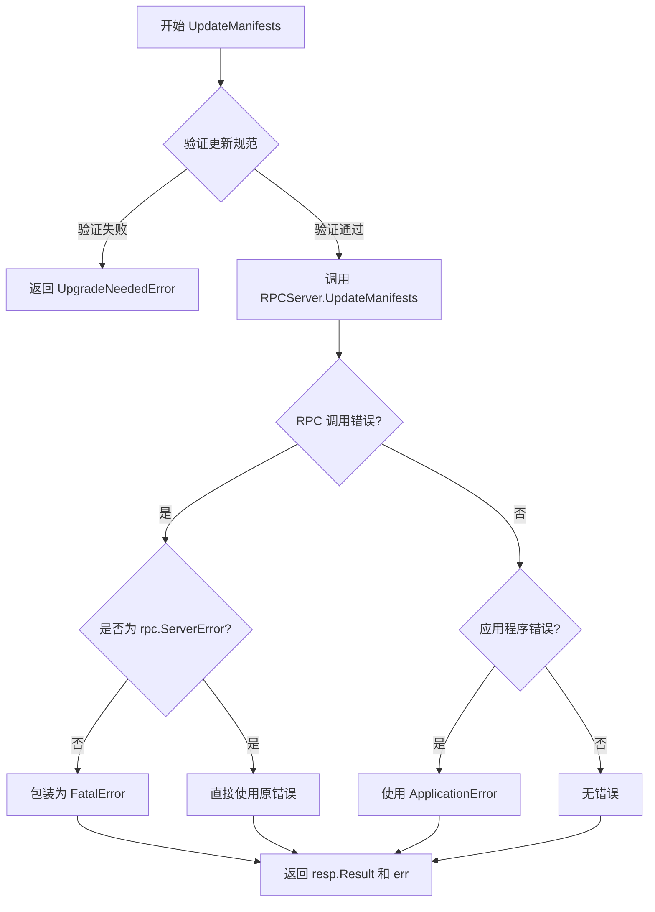

#### 带注释源码

```go
// UpdateManifests 通过 RPC 客户端向服务器发送清单更新请求
// 参数 ctx: 上下文，用于控制请求生命周期
// 参数 u: 更新规范，定义要执行的更新操作
// 返回 job.ID: 服务器分配的作业 ID，用于后续状态查询
// 返回 error: 调用过程中的错误信息
func (p *RPCClientV7) UpdateManifests(ctx context.Context, u update.Spec) (job.ID, error) {
    // 定义响应结构体，用于接收 RPC 服务器返回的结果
	var resp UpdateManifestsResponse
	
    // 第一步：验证更新规范中指定的资源类型是否被当前客户端版本支持
    // supportedKindsV7 定义为 []string{"service"}，只支持 service 类型的资源
	if err := requireSpecKinds(u, supportedKindsV7); err != nil {
        // 如果验证失败，返回升级需要错误，提示客户端需要升级版本
		return resp.Result, remote.UpgradeNeededError(err)
	}
	
    // 第二步：执行 RPC 远程过程调用
    // 调用服务器端的 RPCServer.UpdateManifests 方法，传入更新规范 u
	err := p.client.Call("RPCServer.UpdateManifests", u, &resp)
	
    // 第三步：处理 RPC 调用可能发生的错误
	if err != nil {
        // 检查错误是否为 rpc.ServerError 类型
        // rpc.ServerError 是服务器端返回的应用层错误
		if _, ok := err.(rpc.ServerError); !ok && err != nil {
            // 如果不是服务器错误且确实存在错误，将其包装为致命错误
            // 致命错误通常表示网络层或通信层的严重问题
			err = remote.FatalError{err}
		}
	} else if resp.ApplicationError != nil {
        // 如果 RPC 调用成功但服务器返回了应用层错误
        // 将应用层错误赋值给 err
		err = resp.ApplicationError
	}
	
    // 第四步：返回作业 ID 和错误信息
    // resp.Result 是服务器返回的 job.ID，用于后续查询更新状态
	return resp.Result, err
}
```


### `RPCClientV7.SyncNotify`

该方法用于通知 RPC 服务器执行同步操作，是 Flux 项目中远程过程调用客户端的实现，通过 RPC 协议与远程守护进程通信以触发配置同步。

参数：

- `ctx`：`context.Context`，上下文对象，用于传递请求截止时间、取消信号等上下文信息

返回值：`error`，如果调用过程中发生错误则返回错误信息，否则返回 nil

#### 流程图

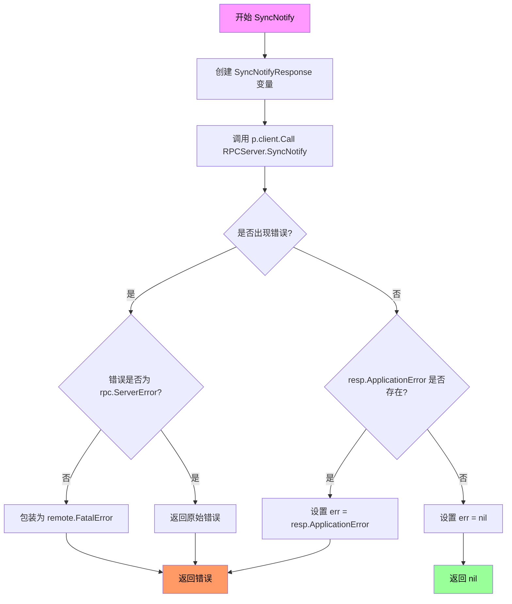

#### 带注释源码

```go
// SyncNotify 通知 RPC 服务器执行同步操作
// 参数 ctx 用于控制请求的生命周期和超时
func (p *RPCClientV7) SyncNotify(ctx context.Context) error {
	// 定义响应结构体，用于接收服务器返回的数据
	var resp SyncNotifyResponse
	
	// 通过 RPC 调用远程服务器的 SyncNotify 方法
	// 第一个参数是方法名，第二个是请求参数（空结构体），第三个是响应目标
	err := p.client.Call("RPCServer.SyncNotify", struct{}{}, &resp)
	
	// 错误处理分支
	if err != nil {
		// 检查错误类型，如果不是 rpc.ServerError 类型且确实有错误
		if _, ok := err.(rpc.ServerError); !ok && err != nil {
			// 将非 RPC 服务器错误包装为致命错误
			err = remote.FatalError{err}
		}
	} else if resp.ApplicationError != nil {
		// 如果 RPC 调用成功但应用层返回了错误
		// 将应用层错误赋值给 err
		err = resp.ApplicationError
	}
	
	// 返回最终错误（可能为 nil 或具体错误）
	return err
}
```


### RPCClientV7.JobStatus

该方法通过 RPC 协议向远程 RPC 服务器查询指定 Job 的执行状态，并返回 Job 的状态信息或错误。

参数：

- `ctx`：`context.Context`，用于传递上下文信息，控制请求的取消和超时
- `jobID`：`job.ID`，要查询状态的 Job 唯一标识符

返回值：`job.Status`，返回 Job 的执行状态信息；`error`，如果查询失败则返回错误信息

#### 流程图

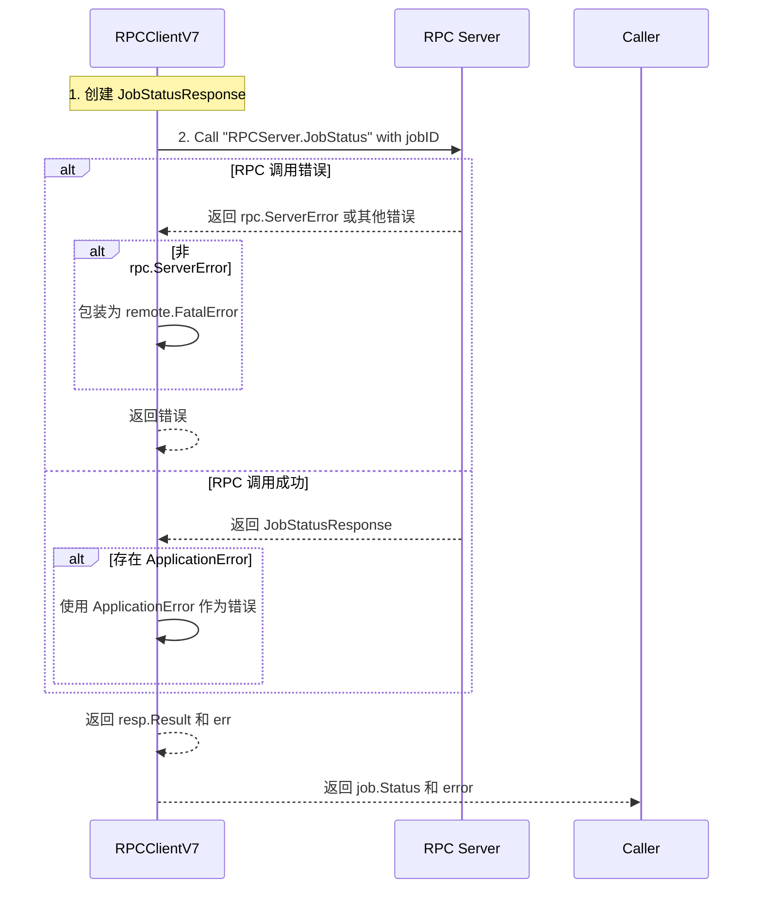

#### 带注释源码

```go
// JobStatus queries the status of a specific job from the remote RPC server.
// It takes a context for cancellation and timeout control, and a jobID to identify
// the job whose status is being queried.
// Returns job.Status containing the job's current state and any error encountered.
func (p *RPCClientV7) JobStatus(ctx context.Context, jobID job.ID) (job.Status, error) {
	// Declare a response object to hold the JobStatusResponse from the RPC server
	var resp JobStatusResponse
	
	// Make an RPC call to the server method "RPCServer.JobStatus"
	// Parameters: jobID as the request, &resp as the response receiver
	err := p.client.Call("RPCServer.JobStatus", jobID, &resp)
	
	// Error handling for RPC call
	if err != nil {
		// Check if the error is NOT an rpc.ServerError
		// If it's a different error, wrap it in remote.FatalError
		if _, ok := err.(rpc.ServerError); !ok && err != nil {
			err = remote.FatalError{err}
		}
		// Return early with the error (result may be nil/zero value)
	} else if resp.ApplicationError != nil {
		// If RPC call succeeded but there's an application-level error,
		// use the ApplicationError as the error to return
		err = resp.ApplicationError
	}
	
	// Return the job status result and any error (nil if successful)
	return resp.Result, err
}
```


### `RPCClientV7.SyncStatus`

该方法用于获取指定Git引用的同步状态，通过RPC调用远程服务并返回同步状态的字符串数组。

参数：

- `ctx`：`context.Context`，Go语言上下文，用于控制请求的超时、取消等行为
- `ref`：`string`，Git引用，用于指定要查询同步状态的仓库引用（如分支名、标签名或commit SHA）

返回值：`[]string, error`，返回同步状态的字符串数组和可能发生的错误

#### 流程图

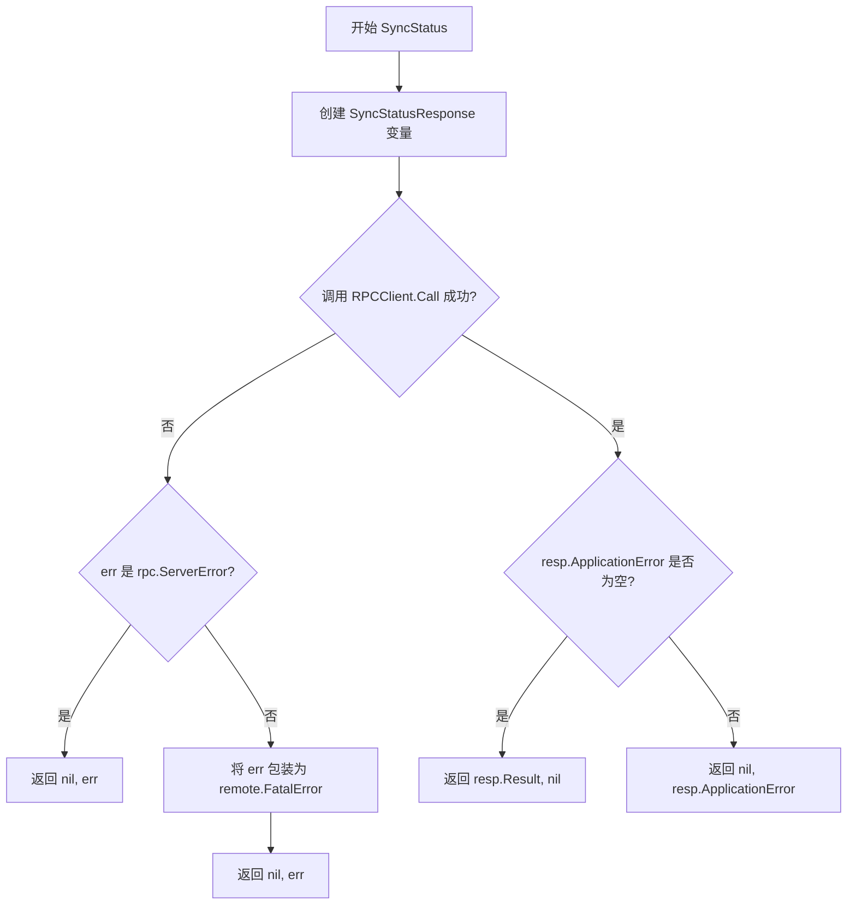

#### 带注释源码

```go
// SyncStatus 获取指定Git引用的同步状态
// 参数 ctx: 上下文对象，用于控制超时和取消
// 参数 ref: Git引用字符串，如分支名、标签名或commit ID
// 返回值: 同步状态字符串数组和错误信息
func (p *RPCClientV7) SyncStatus(ctx context.Context, ref string) ([]string, error) {
	// 创建响应结构体变量，用于接收RPC调用的返回值
	var resp SyncStatusResponse
	
	// 通过RPC调用远程服务器的SyncStatus方法
	// 传入ref作为请求参数，响应结果写入resp
	err := p.client.Call("RPCServer.SyncStatus", ref, &resp)
	
	// 检查RPC调用过程中是否发生错误
	if err != nil {
		// 判断错误是否为rpc.ServerError类型
		if _, ok := err.(rpc.ServerError); !ok && err != nil {
			// 如果不是ServerError，则转换为远程致命错误
			err = remote.FatalError{err}
		}
	} else if resp.ApplicationError != nil {
		// 如果RPC调用成功但应用层返回了错误
		err = resp.ApplicationError
	}
	
	// 返回同步状态结果和错误信息
	return resp.Result, err
}
```


### `RPCClientV7.GitRepoConfig`

该方法用于通过 RPC 调用远程服务，获取或重新生成 Git 仓库配置信息。它接收一个布尔参数决定是否重新生成配置，并通过 RPC 客户端与远程服务器通信，返回 `v6.GitConfig` 类型的配置对象或错误信息。

参数：

- `ctx`：`context.Context`，用于传递上下文信息，如超时、取消信号等
- `regenerate`：`bool`，指示是否需要重新生成 Git 仓库配置

返回值：`v6.GitConfig, error`，返回 Git 仓库配置对象和可能发生的错误

#### 流程图

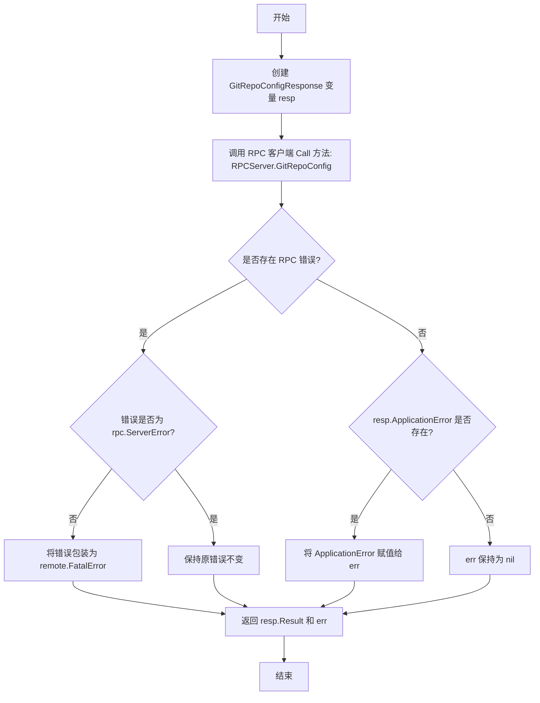

#### 带注释源码

```go
// GitRepoConfig 获取或重新生成 Git 仓库配置
// 参数 ctx: 上下文对象，用于控制请求生命周期
// 参数 regenerate: 是否重新生成配置
// 返回: GitConfig 配置对象和可能的错误
func (p *RPCClientV7) GitRepoConfig(ctx context.Context, regenerate bool) (v6.GitConfig, error) {
	// 创建响应结构体，用于接收 RPC 返回的数据
	var resp GitRepoConfigResponse

	// 通过 RPC 调用远程服务器的 GitRepoConfig 方法
	// 传入 regenerate 参数获取或刷新配置
	err := p.client.Call("RPCServer.GitRepoConfig", regenerate, &resp)

	// 处理 RPC 调用过程中可能发生的错误
	if err != nil {
		// 检查错误类型，如果不是 rpc.ServerError 类型
		// 则说明是底层通信错误，需要包装为致命错误
		if _, ok := err.(rpc.ServerError); !ok && err != nil {
			err = remote.FatalError{err}
		}
		// 返回当前结果和错误，无论是否为致命错误
		return resp.Result, err
	}

	// 处理应用层错误（ApplicationError）
	// 这类错误由远程服务器业务逻辑返回
	if resp.ApplicationError != nil {
		err = resp.ApplicationError
	}

	// 返回最终的 Git 配置和错误信息
	return resp.Result, err
}
```

## 关键组件


### RPCClientV7

RPC客户端结构体，继承自RPCClientV6，用于与远程Flux守护进程进行RPC通信，实现v6.Server和v6.Upstream接口，是Flux CD系统中用于远程操作的核心客户端组件。

### Export

导出服务配置方法，通过RPC调用获取集群特定格式的服务配置信息，返回字节切片和错误信息，用于获取 Flux 管理的资源定义。

### ListServices

列出服务方法，调用RPCServer.ListServices获取指定命名空间下的所有控制器状态，支持通过listServicesRolloutStatus处理结果，返回ControllerStatus切片。

### ListServicesWithOptions

带选项列出服务方法，支持通过v11.ListServicesOptions参数过滤和定制服务列表，委托给listServicesWithOptions辅助函数处理。

### ListImages

列出镜像方法，根据update.ResourceSpec规范获取相关镜像状态，首先验证资源类型是否支持（仅支持"service"），然后调用RPCServer.ListImages获取镜像信息。

### ListImagesWithOptions

带选项列出镜像方法，支持通过v10.ListImagesOptions参数过滤镜像列表，委托给listImagesWithOptions辅助函数处理。

### UpdateManifests

更新清单方法，调用RPCServer.UpdateManifests执行资源更新操作，接收update.Spec规范作为参数，返回job.ID用于后续状态查询，需要验证支持的资源类型。

### SyncNotify

同步通知方法，触发Flux守护进程重新同步仓库配置，无需参数，用于通知远程端点刷新其当前状态。

### JobStatus

作业状态查询方法，根据job.ID查询之前提交的操作的执行状态，返回job.Status用于判断作业完成情况或失败原因。

### SyncStatus

同步状态查询方法，根据Git引用查询当前同步状态，返回字符串切片表示已同步的资源列表。

### GitRepoConfig

Git仓库配置方法，获取或 regenerate Git 仓库配置信息，regenerate参数决定是否强制重新生成配置，返回v6.GitConfig结构体。

### supportedKindsV7

支持的资源类型列表，定义RPCClientV7支持的Kinds，目前仅支持"service"类型，用于API版本验证和升级检查。


## 问题及建议


### 已知问题

- **重复的错误处理模式**：多个方法（Export、ListServices、ListImages、UpdateManifests、SyncNotify、JobStatus、SyncStatus、GitRepoConfig）中的错误处理逻辑几乎完全相同，包括检查rpc.ServerError、转换为remote.FatalError、检查ApplicationError等，导致代码冗余。
- **未使用的导入**：`io`包被导入但在代码中未被直接使用（conn通过参数传入，不需要io包）。
- **未使用的函数调用**：在ListServices方法中调用了`listServicesRolloutStatus(resp.Result)`，但未使用其返回值，可能是遗留代码或调试代码。
- **上下文(ctx)未传递**：虽然所有方法都接收context.Context参数，但在实际的RPC调用中并未使用ctx，可能导致无法传播超时和取消信号。
- **SyncNotifyResponse结构体作用域过大**：定义在方法外部但在文件中只有SyncNotify方法使用，可以移到方法内部以限制作用域。
- **类型断言模式重复**：多处使用`if _, ok := err.(rpc.ServerError); !ok && err != nil`模式，可以提取为辅助函数。
- **API版本混用**：代码同时依赖v6、v10、v11多个版本的API类型，可能增加维护复杂度。

### 优化建议

- **提取通用错误处理函数**：创建一个辅助函数来处理rpc.ServerError的转换和ApplicationError的检查，减少重复代码。
- **清理未使用的导入**：移除未使用的"io"包导入。
- **移除或修复未使用的函数调用**：检查listServicesRolloutStatus的调用是否有意图，如果没有则移除。
- **传递上下文到RPC调用**：使用ctx设置RPC调用的超时和截止时间，例如使用rpc.Client.CallContext（如果可用）或在客户端层面处理。
- **重构响应结构体**：将SyncNotifyResponse移到SyncNotify方法内部，减少包级别的作用域污染。
- **创建错误处理辅助函数**：将重复的类型断言模式提取为辅助函数。
- **考虑统一API版本**：评估是否可以统一使用某个API版本，减少版本兼容性的维护负担。

## 其它


### 设计目标与约束

本文档描述的RPCClientV7是Flux CD项目中用于与远程守护进程通信的RPC客户端实现。设计目标包括：1）提供版本7的RPC客户端，继承RPCClientV6的基本功能并修复错误传输问题；2）实现v6.Server和v6.Upstream接口以保持兼容性；3）仅支持"service"类型的资源操作；4）通过Go的net/rpc框架与RPCServer进行通信。约束条件包括：必须依赖v6、v10、v11版本的API包；错误处理需要区分rpc.ServerError和FatalError；所有方法必须接受context.Context参数以支持超时和取消。

### 错误处理与异常设计

RPCClientV7采用统一的错误处理模式。对于每个RPC调用，错误处理遵循以下规则：首先检查rpc.Client.Call返回的错误，如果是rpc.ServerError则直接返回，否则包装为remote.FatalError；然后检查响应中的ApplicationError字段，如果存在则使用该错误。remote.FatalError用于表示需要终止连接的严重错误，而普通错误则可能是业务逻辑错误或临时性错误。当遇到不支持的kinds时，会返回remote.UpgradeNeededError，提示客户端需要升级。

### 数据流与状态机

RPCClientV7本身是无状态的，每个方法调用都是独立的请求-响应模式。数据流如下：客户端方法接收参数 → 构造RPC请求 → 通过p.client.Call发送 → 接收响应 → 处理错误 → 返回结果。状态转换主要发生在RPCServer端，客户端通过JobStatus方法查询异步操作的状态。ListServices方法内部会调用listServicesRolloutStatus处理结果。

### 外部依赖与接口契约

RPCClientV7依赖以下外部包：github.com/fluxcd/flux/pkg/api/v6提供Server和Upstream接口定义以及ControllerStatus、GitConfig等类型；github.com/fluxcd/flux/pkg/api/v10提供ListImagesOptions类型；github.com/fluxcd/flux/pkg/api/v11提供ListServicesOptions类型；github.com/fluxcd/flux/pkg/errors提供Error类型用于应用错误；github.com/fluxcd/flux/pkg/job提供job.ID和job.Status类型；github.com/fluxcd/flux/pkg/remote提供FatalError和UpgradeNeededError类型；github.com/fluxcd/flux/pkg/update提供ResourceSpec和update.Spec类型。RPCServer端需要实现RPCServer.Export、RPCServer.ListServices、RPCServer.ListImages、RPCServer.UpdateManifests、RPCServer.SyncNotify、RPCServer.JobStatus、RPCServer.SyncStatus、RPCServer.GitRepoConfig等方法。

### 性能考虑与优化空间

当前实现每次RPC调用都会创建新的请求-响应结构体，对于高频调用可能存在GC压力。优化方向包括：1）考虑使用对象池复用Response结构体；2）对于ListServices和ListImages等批量操作，可以考虑添加批量接口减少网络往返；3）当前错误检查逻辑存在重复代码，可以提取公共的错误处理函数；4）context的使用可以更细致，为不同操作设置不同的超时时间。

### 并发安全性

RPCClientV7本身不维护状态，其并发安全性取决于底层rpc.Client的线程安全性。Go的net/rpc.Client是并发安全的，可以在多个goroutine中同时使用。但由于每个方法都独立创建Response结构体，不存在内部状态的竞态条件。需要注意的是，在并发调用时，remote.FatalError的处理可能导致连接被关闭，需要在外层进行适当的重试机制设计。

### 版本兼容性

RPCClientV7继承自RPCClientV6，通过嵌入*RPCClientV6实现代码复用。版本演进策略是通过改变Response结构体的解码方式来正确传输错误数据。supportedKindsV7目前仅支持"service"，这是API层面的约束。客户端需要检查传入的spec或opts是否匹配支持的kinds，不匹配时返回UpgradeNeededError。

### 日志与可观测性

当前代码没有包含日志记录机制。建议添加：1）RPC调用前后的事件日志；2）错误发生时的详细上下文信息；3）性能指标如调用耗时；4）连接状态变化日志。可以通过注入logger或在context中传递trace ID来实现更精细的可观测性。

### 测试策略

建议包含以下测试：1）单元测试验证每个方法在正常和异常情况下的行为；2）模拟RPCServer进行集成测试；3）错误类型验证测试，确认不同错误场景返回正确的错误类型；4）并发安全性测试；5）版本兼容性测试，验证与RPCServerV7的交互。

### 配置与初始化

NewClientV7接收io.ReadWriteCloser作为连接参数，这是典型的工厂方法模式。连接的生命周期管理由调用方负责。Response结构体（ExportResponse、ListServicesResponse等）定义在同包的其他文件中，这些结构体包含Result字段存储实际返回数据，ApplicationError字段存储应用层错误。


    