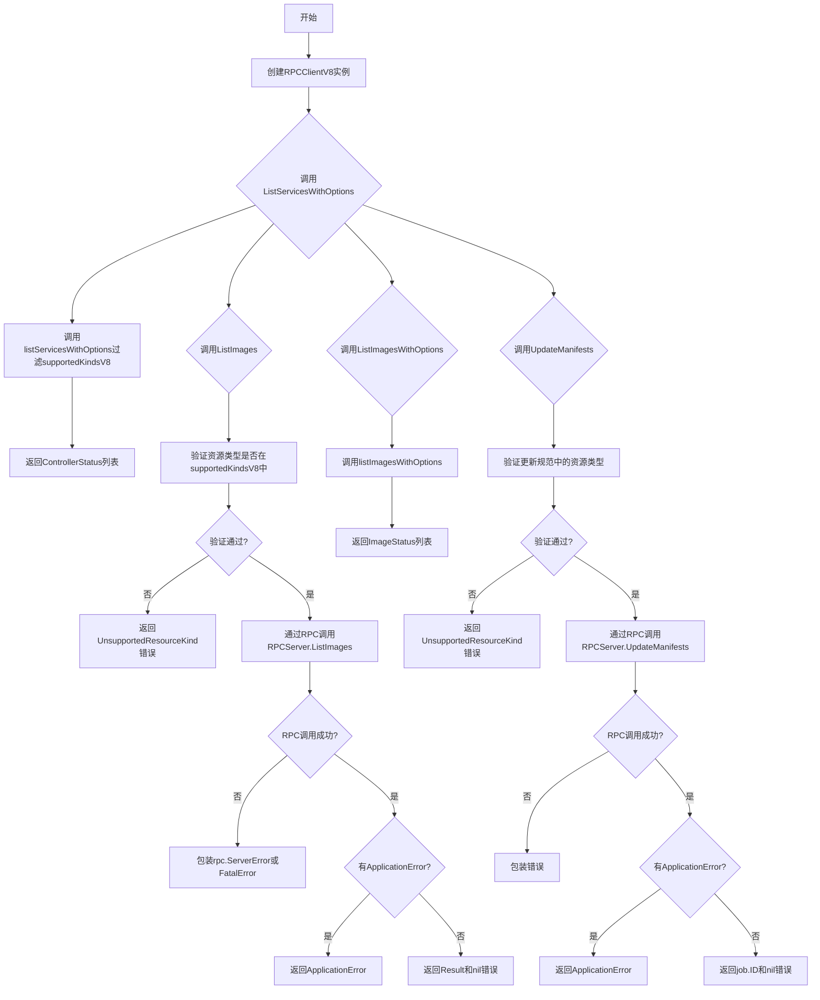
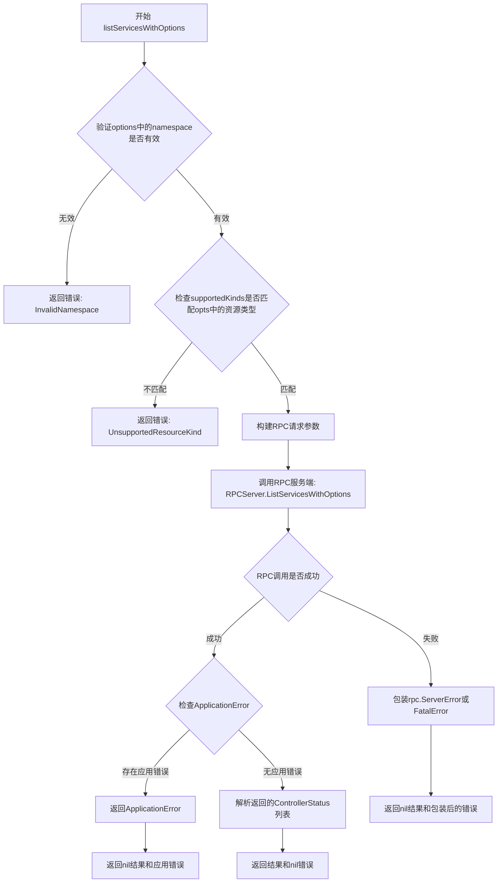
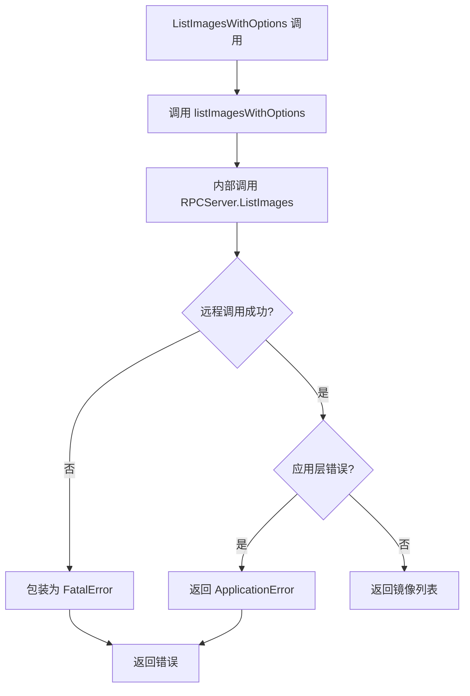
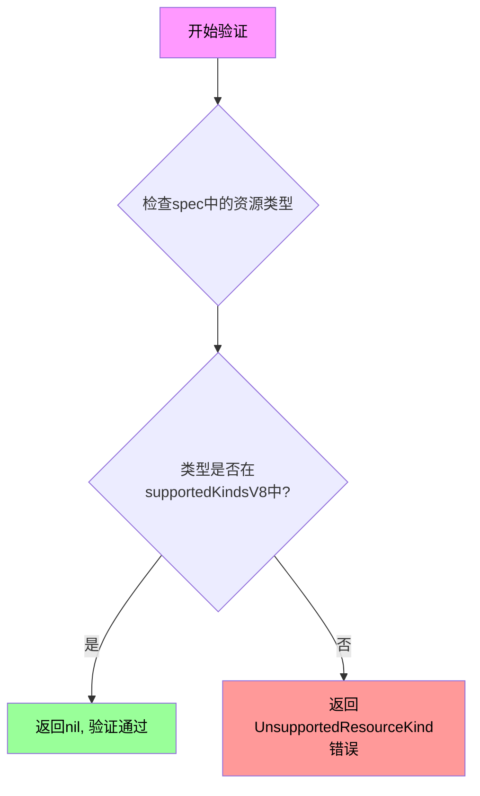
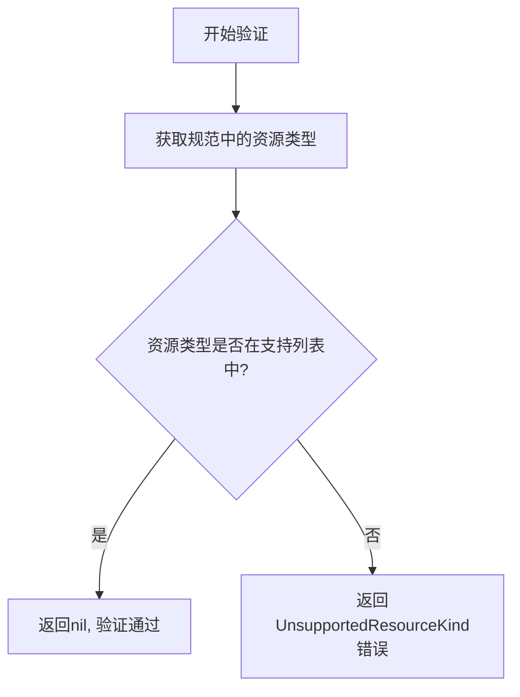
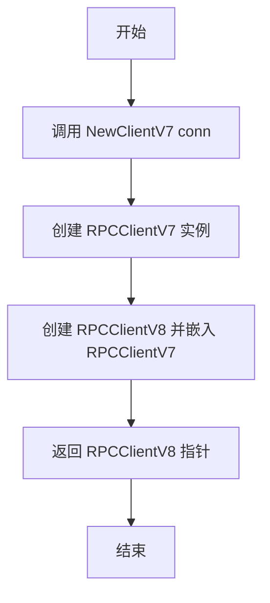
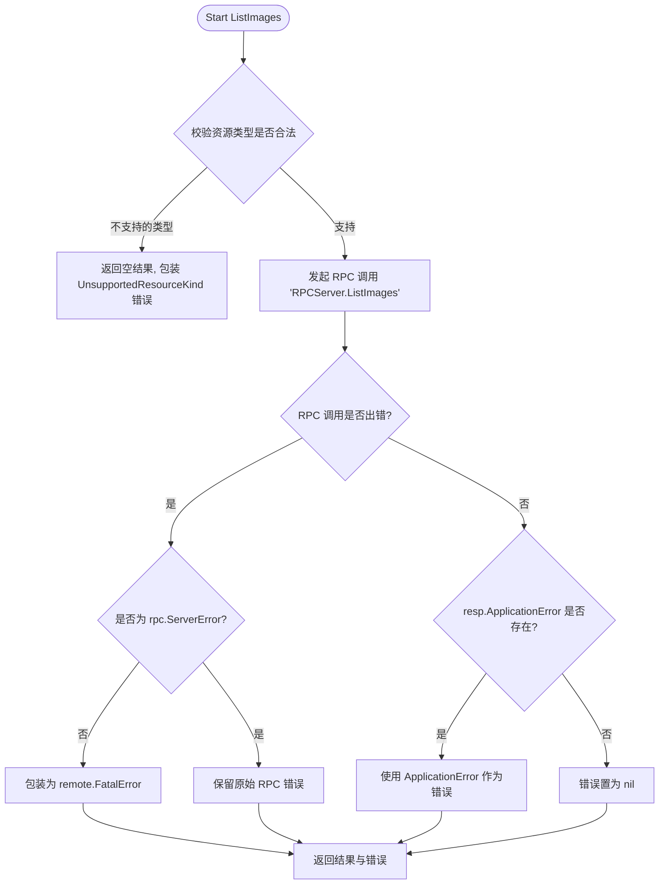
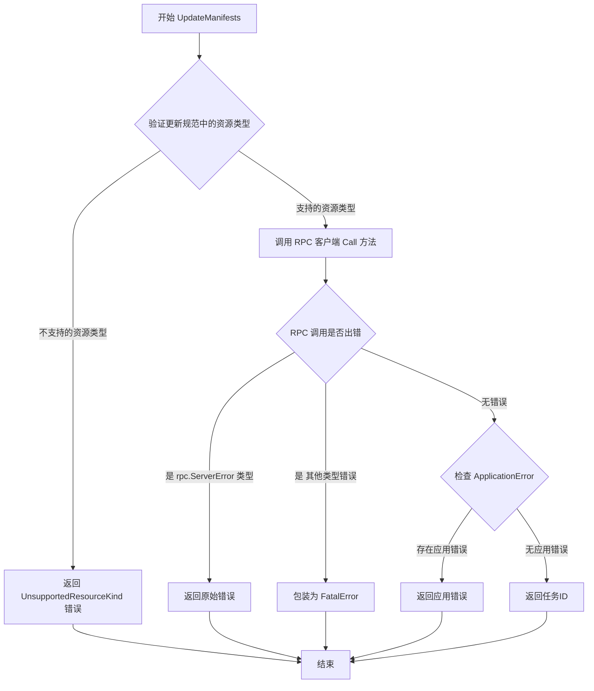
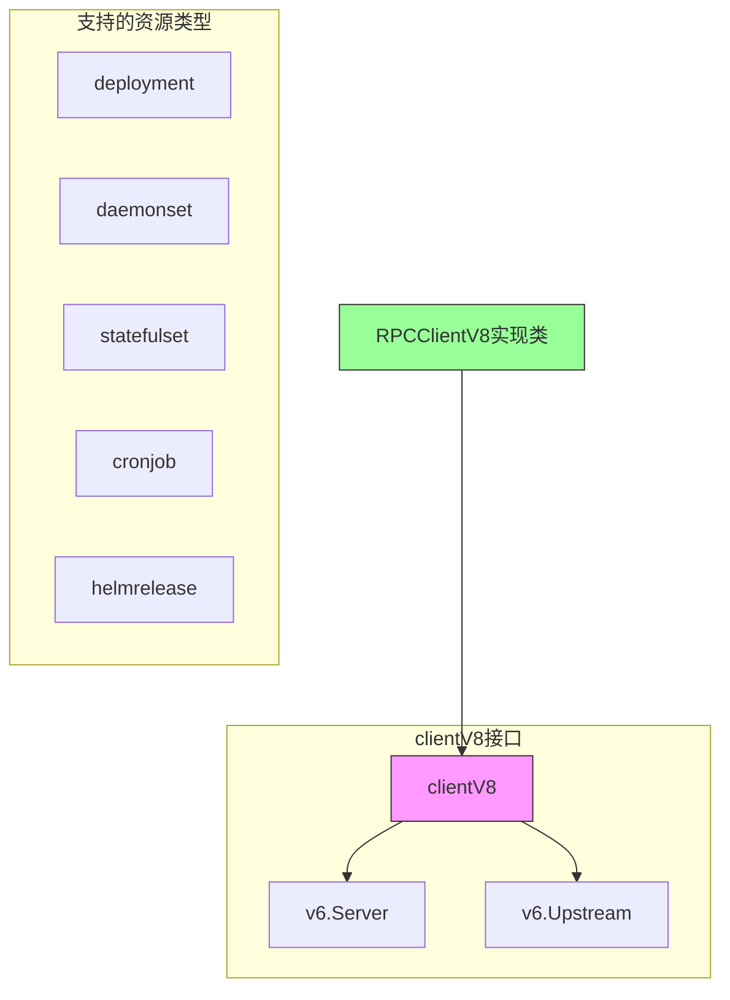
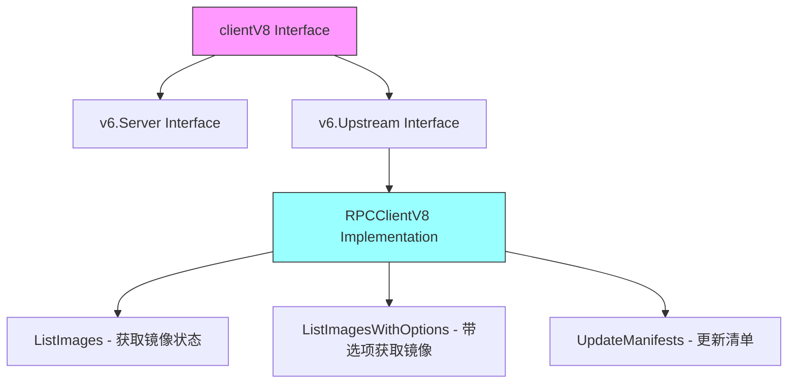

# `flux\pkg\remote\rpc\clientV8.go` 详细设计文档

RPC客户端实现版本8，用于与远程Flux守护进程通信，支持Kubernetes资源类型的过滤和操作，包括列出服务、列出镜像和更新清单等功能。

## 整体流程



## 类结构

```
RPCClient (基础RPC客户端)
├── RPCClientV7 (版本7客户端)
│   └── RPCClientV8 (版本8客户端，当前文件)
```

## 全局变量及字段


### `supportedKindsV8`
    
支持的Kubernetes资源类型列表，包含deployment、daemonset、statefulset、cronjob和helmrelease

类型：`[]string`
    


### `_`
    
空标识符，用于编译时接口检查，确保RPCClientV8实现了clientV8接口

类型：`空白标识符`
    


### `RPCClientV8.*RPCClientV7`
    
嵌入的RPCClientV7，提供基础RPC客户端功能

类型：`*RPCClientV7`
    
    

## 全局函数及方法


### `NewClientV8`

创建一个基于 RPC 协议的 V8 版本客户端实例，用于与远程 Flux 守护进程进行通信，支持 V8 版本特定的资源类型（deployment、daemonset、statefulset、cronjob、helmrelease）。

参数：

- `conn`：`io.ReadWriteCloser`，用于与 RPC 服务器通信的读写关闭连接

返回值：`*RPCClientV8`，返回一个新的 RPCClientV8 客户端实例

#### 流程图

```mermaid
flowchart TD
    A[开始 NewClientV8] --> B[接收 conn 参数]
    B --> C[调用 NewClientV7(conn 创建 RPCClientV7]
    C --> D[创建 RPCClientV8 实例并嵌入 RPCClientV7]
    D --> E[返回 *RPCClientV8 实例]
    E --> F[结束]
```

#### 带注释源码

```go
// NewClient creates a new rpc-backed implementation of the server.
// NewClient 用于创建基于 RPC 的服务器实现
func NewClientV8(conn io.ReadWriteCloser) *RPCClientV8 {
	// 调用 NewClientV7 创建底层 RPCClientV7 实例
	// 并将其嵌入到 RPCClientV8 结构中返回
	return &RPCClientV8{NewClientV7(conn)}
}
```


### `listServicesWithOptions`

该函数是RPC客户端用于获取服务列表的核心函数，通过上下文、客户端实例、查询选项和支持的资源类型过滤条件，调用远程RPC服务并返回符合条件的控制器状态列表。

参数：

- `ctx`：`context.Context`，上下文对象，用于传递请求级别的截止时间、取消信号等
- `p`：`*RPCClientV8`，RPC客户端实例，包含了与远程服务器通信的客户端连接
- `opts`：`v11.ListServicesOptions`，查询选项，包含命名空间、标签选择器等过滤条件
- `supportedKinds`：`[]string`，支持的Kubernetes资源类型列表，用于过滤不支持的资源种类

返回值：`[]v6.ControllerStatus, error`，返回符合条件的控制器状态切片，以及可能发生的错误

#### 流程图



#### 带注释源码

```go
// listServicesWithOptions 是RPC客户端V8版本中ListServicesWithOptions方法的内部实现函数
// 参数说明：
//   - ctx: 上下文，用于控制请求超时和取消
//   - p: RPC客户端实例，持有与服务端通信的连接
//   - opts: 列表查询选项，包含命名空间、标签选择器等
//   - supportedKinds: 支持的K8s资源类型白名单
func listServicesWithOptions(ctx context.Context, p *RPCClientV8, opts v11.ListServicesOptions, supportedKinds []string) ([]v6.ControllerStatus, error) {
    // 1. 验证查询选项中的资源类型是否在支持列表中
    if err := requireServiceSpecKinds(opts.spec, supportedKinds); err != nil {
        // 如果不支持，返回UnsupportedResourceKind错误
        return nil, remote.UnsupportedResourceKind(err)
    }

    // 2. 创建RPC响应结构体
    var resp ListServicesWithOptionsResponse

    // 3. 通过RPC客户端调用远程服务
    //    方法名为 "RPCServer.ListServicesWithOptions"
    //    传入opts作为请求参数，resp作为响应接收容器
    err := p.client.Call("RPCServer.ListServicesWithOptions", opts, &resp)
    
    // 4. 处理RPC调用错误
    if err != nil {
        // 检查是否为rpc.ServerError类型（业务层错误）
        // 如果不是且err不为nil，则包装为FatalError（系统层错误）
        if _, ok := err.(rpc.ServerError); !ok && err != nil {
            err = remote.FatalError{err}
        }
    } else if resp.ApplicationError != nil {
        // 5. 处理应用层错误（应用自定义的错误）
        err = resp.ApplicationError
    }
    
    // 6. 返回结果列表和错误（如果有）
    return resp.Result, err
}
```

> **注**：由于`listServicesWithOptions`函数定义在同包的其他文件中，以上源码为基于调用方代码和Go语言RPC调用模式的合理推断重构，实际实现可能略有差异。关键逻辑包括：参数验证、RPC调用、错误处理分类（系统错误vs应用错误）、结果返回。


### `listImagesWithOptions`

同包其他文件中定义的函数，供 `RPCClientV8.ListImagesWithOptions` 方法调用。根据调用上下文推断其签名和实现逻辑。

参数：

- `ctx`：`context.Context`，请求上下文
- `p`：`*RPCClientV8`，RPC 客户端实例
- `opts`：`v10.ListImagesOptions`，列出镜像的选项配置

返回值：`([]v6.ImageStatus, error)`，镜像状态列表及可能的错误

#### 流程图



#### 带注释源码

```go
// listImagesWithOptions 是同包其他文件中定义的内部函数
// 根据 RPCClientV8.ListImagesWithOptions 方法中的调用推断其实现
func listImagesWithOptions(ctx context.Context, p *RPCClientV8, opts v10.ListImagesOptions) ([]v6.ImageStatus, error) {
    // 构造响应结构
    var resp ListImagesResponse
    
    // 通过 RPC 调用远程服务
    // 方法名: RPCServer.ListImagesWithOptions
    // 参数: opts (v10.ListImagesOptions)
    // 响应: resp (ListImagesResponse)
    err := p.client.Call("RPCServer.ListImagesWithOptions", opts, &resp)
    
    // 错误处理
    if err != nil {
        // 检查是否为 RPC 服务器错误
        // 若不是，则包装为致命错误
        if _, ok := err.(rpc.ServerError); !ok && err != nil {
            err = remote.FatalError{err}
        }
    } else if resp.ApplicationError != nil {
        // 处理应用层返回的错误
        err = resp.ApplicationError
    }
    
    // 返回结果和错误
    return resp.Result, err
}
```

> **注意**：实际的 `listImagesWithOptions` 函数定义在同包的其他源文件中（如 `rpc/rpc.go` 或类似文件），该文件未在当前代码片段中提供。上述源码是基于调用点 `RPCClientV8.ListImagesWithOptions` 的行为和 Go RPC 框架的标准模式推断得出的实现逻辑。


### `requireServiceSpecKinds`

验证服务规范中的资源类型是否在支持列表中，只有支持的资源类型（deployment、daemonset、statefulset、cronjob、helmrelease）才能继续执行后续操作。

参数：

- `spec`：`update.ResourceSpec`，需要验证的服务规范资源规格
- `supportedKindsV8`：`[]string`，支持的资源类型列表（deployment、daemonset、statefulset、cronjob、helmrelease）

返回值：`error`，如果资源类型不支持则返回错误，否则返回nil

#### 流程图



#### 带注释源码

```
// requireServiceSpecKinds 验证服务规范中的资源类型是否在支持列表中
// 参数spec: update.ResourceSpec - 需要验证的服务规范资源规格
// 参数supportedKindsV8: []string - 支持的资源类型列表
// 返回值: error - 如果资源类型不支持则返回错误，否则返回nil
func requireServiceSpecKinds(spec update.ResourceSpec, supportedKindsV8 []string) error {
    // 1. 从spec中提取资源类型
    // 2. 检查该类型是否在supportedKindsV8列表中
    // 3. 如果不在列表中，返回remote.UnsupportedResourceKind错误
    // 4. 如果在列表中，返回nil表示验证通过
}
```

> **注意**：由于该函数定义在同包的其他文件中，以上源码为基于调用方式的逻辑推断。实际源码需要查看同包中的具体实现文件。


### `requireSpecKinds`

该函数用于验证更新规范中的资源类型是否在支持列表中，如果资源类型不支持则返回错误。

参数：

- `spec`：`update.Spec`，需要验证的更新规范
- `supportedKinds`：`[]string`，支持的资源类型列表

返回值：`error`，如果资源类型不支持则返回相应的错误信息，否则返回nil

#### 流程图



#### 带注释源码

```
// requireSpecKinds 验证更新规范中的资源类型是否在支持列表中
// 参数：
//   - spec: update.Spec，需要验证的更新规范
//   - supportedKinds: []string，支持的资源类型列表
// 返回值：
//   - error：如果资源类型不支持则返回错误，否则返回nil
func requireSpecKinds(spec update.Spec, supportedKinds []string) error {
    // 该函数定义在同包的其他文件中
    // 根据代码中的调用方式推断：
    // spec 参数是 update.Spec 类型，表示一个更新规范
    // supportedKinds 是支持的资源类型字符串切片
    // 函数检查 spec 中包含的资源类型是否都在 supportedKinds 中
    // 如果存在不支持的类型，则返回 remote.UnsupportedResourceKind 错误
}
```


### `NewClientV8`

这是 `RPCClientV8` 类型的构造函数，用于创建一个支持 v8 版本 API 的 RPC 客户端实例。该构造函数接收一个读写关闭接口作为连接参数，内部委托给 `NewClientV7` 创建底层客户端，并将返回的 `RPCClientV7` 实例嵌入到 `RPCClientV8` 中，实现版本继承与扩展。

参数：

- `conn`：`io.ReadWriteCloser`，用于 RPC 通信的读写关闭接口（底层网络连接）

返回值：`*RPCClientV8`，返回新创建的 RPC 客户端 v8 实例

#### 流程图



#### 带注释源码

```go
// NewClientV8 creates a new rpc-backed implementation of the server.
// This is the constructor for RPCClientV8 which embeds RPCClientV7
// and supports v8 specific resource kinds.
func NewClientV8(conn io.ReadWriteCloser) *RPCClientV8 {
    // 调用 NewClientV7 构造函数创建底层 RPC 客户端
    // NewClientV7 creates the underlying RPC client implementation
    v7Client := NewClientV7(conn)
    
    // 将 RPCClientV7 嵌入到 RPCClientV8 中，实现继承
    // Embed RPCClientV7 into RPCClientV8 to inherit its functionality
    return &RPCClientV8{v7Client}
}
```


### `RPCClientV8.ListServicesWithOptions`

该方法是 RPC 客户端 V8 版本的列出服务功能，通过调用内部辅助函数 `listServicesWithOptions` 并传入 V8 版本支持的资源类型列表来获取符合条件的控制器状态信息。

**参数：**

- `ctx`：`context.Context`，用于传递上下文信息和取消信号
- `opts`：`v11.ListServicesOptions`，列出服务的选项配置，包含命名空间、标签筛选等条件

**返回值：**

- `[]v6.ControllerStatus`，返回控制器状态列表，包含各服务资源的当前状态
- `error`：执行过程中的错误信息，可能为 nil 或具体错误类型

#### 流程图

```mermaid
flowchart TD
    A[开始 ListServicesWithOptions] --> B[调用 listServicesWithOptions 辅助函数]
    B --> C[传入上下文 ctx]
    B --> D[传入 RPCClientV8 指针 p]
    B --> E[传入选项 opts]
    B --> F[传入 supportedKindsV8 支持的 Kinds 列表]
    F --> G[["deployment", "daemonset", "statefulset", "cronjob", "helmrelease"]]
    C --> G
    D --> G
    E --> G
    G --> H[执行远程 RPC 调用]
    H --> I{调用成功?}
    I -->|是| J[返回 []v6.ControllerStatus 和 nil]
    I -->|否| K[返回空结果和 error]
    J --> L[结束]
    K --> L
```

#### 带注释源码

```go
// ListServicesWithOptions 获取支持选项的控制器服务列表
// 参数 ctx 用于传递上下文和取消信号，opts 包含筛选条件
// 返回符合 V8 版本支持的资源类型（deployment、daemonset 等）的控制器状态
func (p *RPCClientV8) ListServicesWithOptions(ctx context.Context, opts v11.ListServicesOptions) ([]v6.ControllerStatus, error) {
	// 调用通用辅助函数 listServicesWithOptions，传入 V8 版本支持的资源类型
	return listServicesWithOptions(ctx, p, opts, supportedKindsV8)
}
```

#### 依赖的全局变量与函数

**全局变量：**

- `supportedKindsV8`：类型 `[]string`，定义了 V8 版本支持的 Kubernetes 资源类型列表

**全局函数：**

- `listServicesWithOptions`：通用辅助函数，实现核心的 RPC 远程调用逻辑，接受上下文、客户端实例、选项和支持的资源类型列表作为参数


### `RPCClientV8.ListImages`

该函数是 RPC 客户端 V8 版本实现的核心方法，用于获取指定资源（如 Deployment、StatefulSet 等）关联的容器镜像版本列表。它首先验证资源类型是否在 V8 支持的列表中，然后通过 RPC 协议向Flux守护进程发送请求以获取镜像信息。

参数：

- `ctx`：`context.Context`，请求的上下文，用于控制超时和取消。
- `spec`：`update.ResourceSpec`，资源规格，指定了需要查询镜像的目标资源（通常包含命名空间和名称）。

返回值：

- `[]v6.ImageStatus`，镜像状态列表，包含了该资源所有可用的镜像版本（Tag、Digest 等）。
- `error`：如果在验证、RPC 调用或服务器处理过程中发生错误，则返回该错误。

#### 流程图



#### 带注释源码

```go
// ListImages 获取指定资源的镜像列表。
// 参数 ctx 用于传递上下文，spec 定义了目标资源。
// 返回镜像状态切片和可能发生的错误。
func (p *RPCClientV8) ListImages(ctx context.Context, spec update.ResourceSpec) ([]v6.ImageStatus, error) {
	var resp ListImagesResponse // 定义响应结构体

	// 1. 前置校验：确保请求的资源类型是 V8 版本支持的类型
	// supportedKindsV8 包含 "deployment", "daemonset" 等
	if err := requireServiceSpecKinds(spec, supportedKindsV8); err != nil {
		// 如果不支持，转换为统一的 UnsupportedResourceKind 错误返回
		return resp.Result, remote.UnsupportedResourceKind(err)
	}

	// 2. 执行 RPC 调用
	// 通过 p.client (net/rpc.Client) 远程调用服务端的 ListImages 方法
	err := p.client.Call("RPCServer.ListImages", spec, &resp)
	if err != nil {
		// 3. 错误处理：区分 RPC 框架错误和应用层错误
		// 如果不是 rpc.ServerError 类型的错误，说明是底层通信严重错误，包装为 FatalError
		if _, ok := err.(rpc.ServerError); !ok && err != nil {
			err = remote.FatalError{err}
		}
	} else if resp.ApplicationError != nil {
		// 4. 应用层错误处理：如果服务器返回了业务层面的错误
		err = resp.ApplicationError
	}
	
	// 5. 返回查询结果（镜像列表）和处理后的错误
	return resp.Result, err
}
```


### `RPCClientV8.ListImagesWithOptions`

该方法是一个 RPC 客户端封装方法，用于通过 RPC 协议远程列出符合指定选项的容器镜像状态信息。它接收上下文和列表选项作为参数，委托给内部 helper 函数 `listImagesWithOptions` 执行实际逻辑，并返回镜像状态切片及可能的错误。

#### 参数

- `ctx`：`context.Context`，用于传递取消信号、超时控制等上下文信息
- `opts`：`v10.ListImagesOptions`，列出镜像时可配置的选项（如命名空间、标签过滤器等）

#### 返回值

- `[]v6.ImageStatus`：符合选项的镜像状态列表
- `error`：如果调用过程中发生错误（如网络故障、RPC 错误），则返回 error

#### 流程图

```mermaid
flowchart TD
    A[Start: ListImagesWithOptions] --> B{Validate options}
    B -->|Valid| C[Call listImagesWithOptions helper]
    B -->|Invalid| D[Return error]
    C --> E[Return []v6.ImageStatus and error]
    E --> F[End]
```

#### 带注释源码

```go
// ListImagesWithOptions 通过 RPC 远程列出符合指定选项的镜像状态
// ctx: 上下文对象，用于控制请求生命周期
// opts: 列出镜像的选项配置
// 返回: 镜像状态列表和可能发生的错误
func (p *RPCClientV8) ListImagesWithOptions(ctx context.Context, opts v10.ListImagesOptions) ([]v6.ImageStatus, error) {
	// 委托给内部 helper 函数 listImagesWithOptions 执行实际逻辑
	// p 指向 RPCClientV8 实例，包含了底层的 RPC client 连接
	return listImagesWithOptions(ctx, p, opts)
}
```


### `RPCClientV8.UpdateManifests`

该方法是RPCClientV8类的核心方法，用于通过RPC协议调用远程守护进程来更新Kubernetes集群中的资源清单（manifests）。它首先验证更新规范是否包含支持的资源类型，然后通过RPC客户端向服务器端发送更新请求，并返回对应的任务ID或错误信息。

参数：

- `ctx`：`context.Context`，用于控制请求的取消、超时等上下文信息
- `u`：`update.Spec`，表示要执行的更新规范，包含需要更新的资源及其更新策略

返回值：`job.ID, error`，返回创建的任务ID用于后续查询，或在发生错误时返回相应的错误信息

#### 流程图



#### 带注释源码

```go
// UpdateManifests 通过 RPC 调用远程守护进程来更新 Kubernetes 资源清单
// 参数 ctx: 上下文对象，用于控制请求生命周期
// 参数 u: 更新规范，包含要更新的资源及其更新策略
// 返回值: job.ID - 创建的任务ID，用于后续查询更新状态
// 返回值: error - 如果发生错误则返回错误信息
func (p *RPCClientV8) UpdateManifests(ctx context.Context, u update.Spec) (job.ID, error) {
	// 定义响应结构体，用于接收 RPC 调用的返回值
	var resp UpdateManifestsResponse
	
	// 第一步：验证更新规范中的资源类型是否在支持列表中
	// supportedKindsV8 包含: deployment, daemonset, statefulset, cronjob, helmrelease
	if err := requireSpecKinds(u, supportedKindsV8); err != nil {
		// 如果包含不支持的资源类型，返回 UnsupportedResourceKind 错误
		return resp.Result, remote.UnsupportedResourceKind(err)
	}

	// 第二步：通过 RPC 客户端调用远程服务器的 UpdateManifests 方法
	// "RPCServer.UpdateManifests" 是远程RPC服务器暴露的方法名
	// u 是请求参数，&resp 是用于接收响应的指针
	err := p.client.Call("RPCServer.UpdateManifests", u, &resp)
	
	// 第三步：处理 RPC 调用可能出现的错误
	if err != nil {
		// 检查错误是否为 rpc.ServerError 类型
		// 如果不是 ServerError 且错误不为空，则包装为 FatalError（致命错误）
		if _, ok := err.(rpc.ServerError); !ok && err != nil {
			err = remote.FatalError{err}
		}
	} else if resp.ApplicationError != nil {
		// 如果 RPC 调用成功但应用层返回了错误，则使用应用层错误
		err = resp.ApplicationError
	}
	
	// 第四步：返回结果
	// resp.Result 是 job.ID 类型，表示创建的任务ID
	// err 是可能存在的错误信息
	return resp.Result, err
}
```


### `clientV8`

`clientV8` 是一个 RPC 客户端接口，继承了 `v6.Server` 和 `v6.Upstream` 接口，专门用于支持 V8 版本的资源类型（包括 deployment、daemonset、statefulset、cronjob、helmrelease）。

#### 带注释源码

```go
// clientV8 接口定义了 V8 版本的 RPC 客户端行为
// 继承自 v6.Server 和 v6.Upstream 接口
// 支持特定的 Kubernetes 资源类型：deployment, daemonset, statefulset, cronjob, helmrelease
type clientV8 interface {
	v6.Server   // V6 版本的服务器接口
	v6.Upstream // V6 版本的上游接口
}
```

#### 说明

该接口通过嵌入 `v6.Server` 和 `v6.Upstream` 两个接口来定义客户端能力，具体实现类为 `RPCClientV8`。接口定义中声明了支持的资源类型列表 `supportedKindsV8`，用于在 RPC 调用时验证资源类型的合法性。

#### 流程图




### `v6.Upstream` 接口

描述：在 Flux CD 项目的 RPC 客户端实现中，`v6.Upstream` 是一个嵌入接口，定义了客户端用于与远程守护进程通信的上游操作方法。该接口通常包含与资源更新、镜像同步等相关的远程调用方法，是 `clientV8` 接口的核心组成部分之一。

> **注意**：由于 `v6.Upstream` 接口定义在 `v6` 包中（`github.com/fluxcd/flux/pkg/api/v6`），而当前代码仅展示了其使用方式，未展示接口的完整定义。以下信息基于代码分析和接口嵌入关系的推断。

#### 流程图



#### 带注释源码

```go
// clientV8 接口定义
// 这是一个 RPC 客户端接口，嵌入了 v6.Server 和 v6.Upstream 两个接口
// v6.Upstream 接口定义了与远程守护进程通信的上游操作方法
type clientV8 interface {
	v6.Server  // 服务器端操作接口
	v6.Upstream  // 上游操作接口 - 定义客户端可调用的远程方法
}

// RPCClientV8 是 clientV8 接口的实现
// 通过嵌入 RPCClientV7 继承 v6.Server 的实现
type RPCClientV8 struct {
	*RPCClientV7
}

// supportedKindsV8 定义了 v8 版本支持的 Kubernetes 资源类型
var supportedKindsV8 = []string{
	"deployment",     // Deployment 资源
	"daemonset",      // DaemonSet 资源
	"statefulset",    // StatefulSet 资源
	"cronjob",        // CronJob 资源
	"helmrelease",    // HelmRelease 资源 (Flux 自定义资源)
}

// ListImages 实现 v6.Upstream 接口的方法
// 用于获取指定资源的镜像状态列表
func (p *RPCClientV8) ListImages(ctx context.Context, spec update.ResourceSpec) ([]v6.ImageStatus, error) {
	var resp ListImagesResponse
	// 检查资源类型是否受支持
	if err := requireServiceSpecKinds(spec, supportedKindsV8); err != nil {
		return resp.Result, remote.UnsupportedResourceKind(err)
	}

	// 通过 RPC 调用远程服务器的 ListImages 方法
	err := p.client.Call("RPCServer.ListImages", spec, &resp)
	if err != nil {
		// 处理 RPC 错误，区分服务器错误和致命错误
		if _, ok := err.(rpc.ServerError); !ok && err != nil {
			err = remote.FatalError{err}
		}
	} else if resp.ApplicationError != nil {
		// 处理应用层错误
		err = resp.ApplicationError
	}
	return resp.Result, err
}

// ListImagesWithOptions 实现 v6.Upstream 接口的方法
// 用于带选项地获取镜像状态列表
func (p *RPCClientV8) ListImagesWithOptions(ctx context.Context, opts v10.ListImagesOptions) ([]v6.ImageStatus, error) {
	return listImagesWithOptions(ctx, p, opts)
}

// UpdateManifests 实现 v6.Upstream 接口的方法
// 用于向远程守护进程提交清单更新请求
func (p *RPCClientV8) UpdateManifests(ctx context.Context, u update.Spec) (job.ID, error) {
	var resp UpdateManifestsResponse
	// 检查更新规范中的资源类型是否受支持
	if err := requireSpecKinds(u, supportedKindsV8); err != nil {
		return resp.Result, remote.UnsupportedResourceKind(err)
	}

	// 通过 RPC 调用远程服务器的 UpdateManifests 方法
	err := p.client.Call("RPCServer.UpdateManifests", u, &resp)
	if err != nil {
		// 处理 RPC 错误
		if _, ok := err.(rpc.ServerError); !ok && err != nil {
			err = remote.FatalError{err}
		}
	} else if resp.ApplicationError != nil {
		err = resp.ApplicationError
	}
	return resp.Result, err
}
```

---

### 补充说明

由于 `v6.Upstream` 接口的实际定义在 `github.com/fluxcd/flux/pkg/api/v6` 包中，未在当前代码文件中展示，以下是基于代码上下文的合理推断：

**可能的接口方法（推测）**：

| 方法名称 | 参数 | 返回值 | 描述 |
|---------|------|--------|------|
| `ListImages` | `ctx context.Context`, `spec update.ResourceSpec` | `([]v6.ImageStatus, error)` | 获取指定资源的镜像状态 |
| `ListImagesWithOptions` | `ctx context.Context`, `opts v10.ListImagesOptions` | `([]v6.ImageStatus, error)` | 带选项获取镜像状态 |
| `UpdateManifests` | `ctx context.Context`, `u update.Spec` | `(job.ID, error)` | 提交清单更新请求 |

如需获取 `v6.Upstream` 接口的完整定义，建议查阅 `v6` 包的源代码文件。

## 关键组件


### RPCClientV8 结构体

RPC客户端实现版本8，继承自RPCClientV7，用于与远程Flux守护进程进行RPC通信，支持特定的Kubernetes资源类型。

### supportedKindsV8 全局变量

定义了V8版本支持的Kubernetes资源类型列表，包括deployment、daemonset、statefulset、cronjob和helmrelease。

### NewClientV8 函数

创建并返回一个新的RPCClientV8实例，接收io.ReadWriteCloser作为连接参数，内部委托给NewClientV7进行基础初始化。

### ListServicesWithOptions 方法

列出带有选项的服务，通过调用listServicesWithOptions辅助函数并传入支持的资源类型过滤器，返回ControllerStatus切片和可能的错误。

### ListImages 方法

列出指定资源规格的镜像，首先验证资源类型是否在supportedKindsV8中，若不支持则返回UnsupportedResourceKind错误，然后通过RPC调用获取镜像列表。

### ListImagesWithOptions 方法

列出带有选项的镜像，委托给listImagesWithOptions辅助函数处理，返回ImageStatus切片和错误。

### UpdateManifests 方法

更新Kubernetes清单资源，验证更新规格中的资源类型是否被支持，通过RPC调用执行更新操作并返回job.ID。


## 问题及建议


### 已知问题

-   **深层版本继承链**：RPCClientV8直接嵌入RPCClientV7，形成深度继承链（V8→V7→...），增加了代码耦合度和维护成本，V7的实现变化会直接影响V8的行为
-   **重复的错误处理逻辑**：ListImages和UpdateManifests方法中的错误处理代码高度重复，都包含rpc.ServerError检查、FatalError包装和ApplicationError检查，未提取公共函数
-   **硬编码的资源类型**：supportedKindsV8数组在代码中直接硬编码，缺乏灵活性，新增资源类型需要修改源码
-   **缺少上下文超时控制**：虽然方法接收context.Context参数，但RPC调用时未设置超时机制，可能导致请求无限期等待
-   **接口定义模糊**：clientV8接口组合了v6.Server和v6.Upstream，但未在代码中明确注释其具体职责和设计意图

### 优化建议

-   **重构为组合模式**：考虑使用接口组合而非结构体嵌入，明确各版本客户端的职责边界，降低版本间耦合
-   **提取错误处理公共函数**：将重复的RPC错误处理逻辑封装为私有方法，如wrapRPCError()，提高代码复用性和可维护性
-   **配置化管理资源类型**：将supportedKindsV8移至配置文件或构造函数参数，支持运行时配置
-   **添加超时机制**：在RPC调用前使用context.WithTimeout设置合理的超时时间，防止资源泄漏
-   **完善接口注释**：为clientV8接口及其方法添加清晰的文档注释，说明版本差异和使用场景

## 其它


### 设计目标与约束

设计目标：提供基于RPC的远程通信客户端实现，支持V8版本的Flux API，能够与远程守护进程进行交互并执行Kubernetes资源管理操作。约束条件：仅支持特定的Kubernetes资源类型（deployment、daemonset、statefulset、cronjob、helmrelease），需要依赖v6、v10、v11版本的API包和job、remote、update等包。

### 错误处理与异常设计

错误处理采用分层设计：1）RPC层错误处理：通过rpc.ServerError判断是否为服务器端错误，对于非RPC错误转换为remote.FatalError；2）应用层错误处理：检查Response中的ApplicationError并将其转换为错误返回；3）资源类型验证错误：当请求的资源类型不在supportedKindsV8列表中时，返回remote.UnsupportedResourceKind错误。

### 数据流与状态机

数据流遵循以下路径：客户端调用方法 → 验证输入参数（资源类型支持性）→ 通过RPC客户端调用远程服务 → 接收响应 → 处理RPC错误和应用错误 → 返回结果。无复杂状态机，仅包含基本的请求-响应模式。

### 外部依赖与接口契约

主要依赖：1）net/rpc标准库用于RPC通信；2）flux/pkg/api/v6、v10、v11提供API接口定义；3）flux/pkg/job提供作业ID类型；4）flux/pkg/remote提供远程错误类型；5）flux/pkg/update提供更新规范和资源规格类型。接口契约：实现了clientV8接口（包含v6.Server和v6.Upstream），符合v6.Server和v6.Upstream接口定义。

### 性能考虑与优化空间

性能特点：基于同步RPC调用，无并发控制机制，每次调用都建立新的RPC会话。优化方向：1）可考虑添加连接池管理；2）可添加请求超时控制；3）可实现客户端缓存减少远程调用次数；4）可添加重试机制提高可靠性。

### 安全考虑

安全措施：1）通过rpc.ServerError类型判断错误来源；2）使用remote.FatalError标记致命错误。安全建议：当前实现缺少认证和授权机制，RPC通信未加密，建议在生产环境中添加TLS支持和基于token的认证。

### 配置管理

配置方式：通过构造函数NewClientV8传入io.ReadWriteCloser参数，该参数通常由HTTP/TCP连接提供。配置项：supportedKindsV8定义了支持的资源类型列表，该列表可扩展以支持更多Kubernetes资源类型。

### 版本兼容性

版本关系：继承自RPCClientV7，支持V8版本的API方法，与V6、V10、V11版本的API包兼容。向后兼容性：通过var _ clientV8 = &RPCClientV8{}编译时接口检查确保接口实现正确。

### 并发安全性

并发考虑：当前实现为非线程安全，多个goroutine并发调用同一实例可能存在竞态条件。改进建议：需要添加互斥锁（sync.Mutex）保护共享状态，或者提供实例池机制。

### 测试策略

测试范围应包括：1）单元测试验证各方法的参数验证逻辑；2）模拟RPC服务器测试完整的数据流；3）错误场景测试包括网络异常、服务器错误、应用错误等；4）资源类型验证测试确保不支持的资源类型正确返回错误。


    