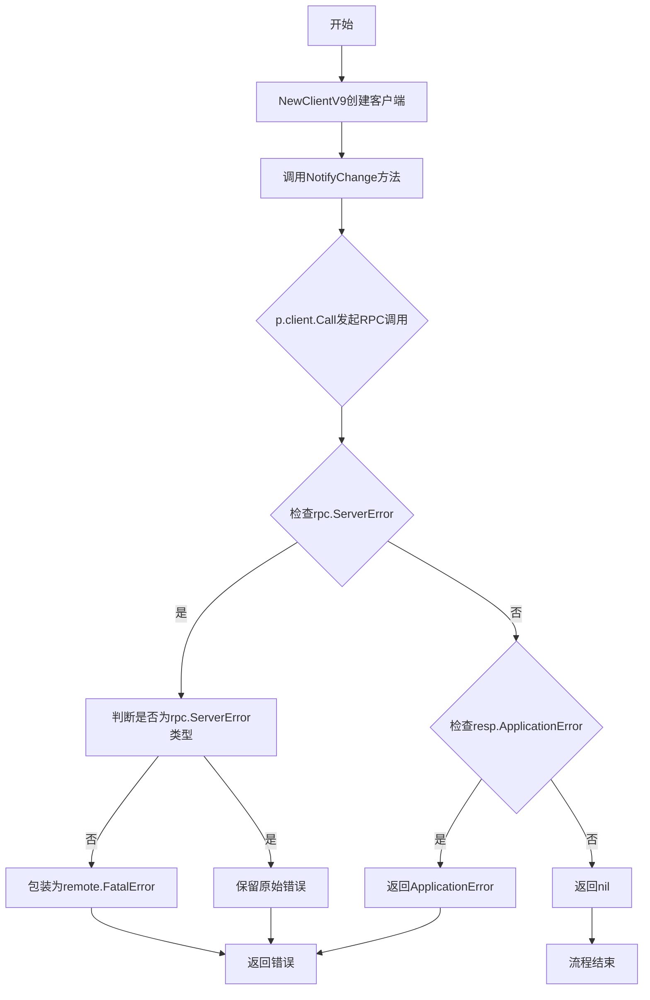
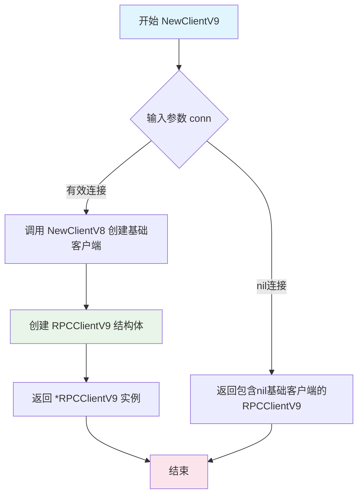
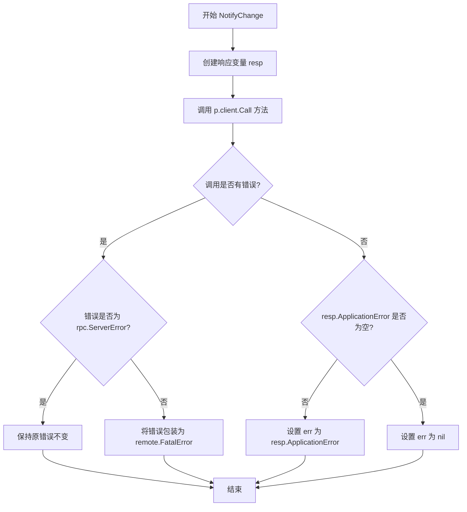

# `flux\pkg\remote\rpc\clientV9.go` 详细设计文档

Flux CD v9版本的RPC客户端实现，通过嵌入RPCClientV8并实现v9.Server和v9.Upstream接口，提供与RPC服务器通信的能力，其中NotifyChange方法用于将配置变更通知给远程服务器，并处理各类错误响应

## 整体流程



## 类结构

```
RPCClientV9
└── RPCClientV8 (嵌入)
```

## 全局变量及字段


### `_`
    
空接口变量，用于编译时检查 RPCClientV9 是否实现了 clientV9 接口

类型：`clientV9`
    


### `RPCClientV9.RPCClientV8`
    
嵌入类型，提供client字段和基础RPC调用能力

类型：`*RPCClientV8`
    
    

## 全局函数及方法


### NewClientV9

NewClientV9是一个构造函数，用于创建RPCClientV9客户端实例。该函数接收一个io.ReadWriteCloser类型的网络连接参数，创建一个集成RPCClientV8功能的RPCClientV9客户端，实现了v9.Server和v9.Upstream接口。

参数：

- `conn`：`io.ReadWriteCloser`，网络连接接口，提供Read、Write和Close方法，用于RPC通信

返回值：`*RPCClientV9`，返回新创建的RPC客户端V9实例，包含继承自RPCClientV8的客户端功能

#### 流程图



#### 带注释源码

```go
// NewClientV9 构造函数，创建并返回一个RPCClientV9客户端实例
// 参数 conn: io.ReadWriteCloser 网络连接，用于RPC通信
// 返回值: *RPCClientV9 客户端实例
func NewClientV9(conn io.ReadWriteCloser) *RPCClientV9 {
    // 调用 NewClientV8 创建基础客户端，然后包装为 RPCClientV9
    // RPCClientV9 继承 RPCClientV8 的所有功能
    return &RPCClientV9{NewClientV8(conn)}
}
```


### `RPCClientV9.NotifyChange`

该方法是一个RPC客户端方法，通过gRPC风格的远程过程调用将本地发生的变更通知给远程RPC服务器，并处理可能的应用层错误或RPC层错误。

参数：

- `ctx`：`context.Context`，上下文对象，用于传递超时、取消等控制信息
- `c`：`v9.Change`，要通知给服务器的变更内容，包含变更的详细信息

返回值：`error`，如果调用成功返回nil，否则返回相应的错误（可能是RPC层错误或应用层错误）

#### 流程图



#### 带注释源码

```go
// NotifyChange 通知远程RPC服务器发生了变更
// 参数 ctx 用于控制超时和取消，c 包含要通知的变更内容
func (p *RPCClientV9) NotifyChange(ctx context.Context, c v9.Change) error {
	// 定义响应变量，用于接收服务器返回的结果
	var resp NotifyChangeResponse
	
	// 通过RPC客户端调用远程方法 "RPCServer.NotifyChange"
	// 传入变更内容 c，并接收响应到 resp
	err := p.client.Call("RPCServer.NotifyChange", c, &resp)
	
	// 检查是否有RPC层错误
	if err != nil {
		// 判断错误是否为 rpc.ServerError 类型
		// 如果不是 rpc.ServerError 且确实有错误，则将其包装为远程致命错误
		if _, ok := err.(rpc.ServerError); !ok && err != nil {
			err = remote.FatalError{err}
		}
	} else if resp.ApplicationError != nil {
		// 如果没有RPC错误，但响应中包含应用层错误
		// 则将应用层错误设置为返回的错误
		err = resp.ApplicationError
	}
	
	// 返回错误（如果有）
	return err
}
```

## 关键组件


### RPCClientV9 结构体

RPC客户端实现，继承自RPCClientV8，用于与RPC服务器通信，实现了v9.Server和v9.Upstream接口，提供通知变更的远程过程调用功能。

### NewClientV9 函数

构造函数，创建并返回新的RPCClientV9实例，接受io.ReadWriteCloser参数作为连接通道。

### NotifyChange 方法

向RPC服务器发送变更通知，处理远程调用错误，将rpc.ServerError转换为FatalError，并返回应用层错误。

### RPCClientV8 父类

继承的父类结构体，提供基础的RPC客户端功能。

### clientV9 接口

定义了RPC客户端需要实现的v9.Server和v9.Upstream两个接口契约。

### 远程错误处理机制

通过remote.FatalError封装非rpc.ServerError类型的错误，提供统一的错误处理方式。


## 问题及建议


### 已知问题

- 错误处理逻辑冗余：代码中`if _, ok := err.(rpc.ServerError); !ok && err != nil`的判断条件存在逻辑缺陷，当err为nil时条件为false，但仍会进入外层if块后续的else if分支，且`!ok && err != nil`的判断可以简化为`err != nil && !ok`
- Context未实际使用：方法签名接收了`context.Context`参数，但在RPC调用时未利用它设置超时或取消机制，导致context参数形同虚设
- 缺少重试机制：RPC调用可能因网络波动失败，当前实现没有重试逻辑，不符合分布式系统的容错设计原则
- 响应类型定义缺失：代码引用了`NotifyChangeResponse`类型，但该类型未在此文件中定义，可能存在隐藏的依赖
- 接口实现不完整：声明实现了`clientV9`接口（含v9.Server和v9.Upstream），但仅看到了NotifyChange方法实现，其他方法实现未展示

### 优化建议

- 利用context设置RPC调用超时：在`p.client.Call`中使用context控制调用超时，例如使用`p.client.CallContext(ctx, "RPCServer.NotifyChange", c, &resp)`替代现有调用
- 简化错误处理逻辑：移除冗余的类型断言检查，直接使用`resp.ApplicationError`判断应用层错误
- 添加重试机制：引入指数退避算法的重试逻辑，处理临时性网络故障
- 补充接口实现注释：明确标注接口方法的实现状态，确保接口完整性
- 统一错误包装：使用统一的错误包装方式，如定义专门的错误转换函数，提高错误可追溯性

## 其它


### 设计目标与约束

设计目标：实现Fluxcd v9版本的RPC客户端，提供与远程RPC服务器通信的能力，主要用于通知变更事件。约束：必须实现v9.Server和v9.Upstream接口，继承RPCClientV8的所有功能，通过net/rpc库进行远程过程调用。

### 错误处理与异常设计

错误处理策略采用分层处理机制：首先检查RPC调用是否返回rpc.ServerError类型的错误；若不是ServerError且存在错误，则使用remote.FatalError包装原始错误；若返回了ApplicationError，则直接返回该应用层错误。NotifyChange方法返回error类型，任何RPC调用失败或应用层错误都会向上传播。

### 数据流与状态机

数据流路径：客户端创建RPCClientV9实例 → 调用NotifyChange方法 → 传入context和Change对象 → 通过p.client.Call发起RPC调用 → 服务器端处理 → 返回NotifyChangeResponse → 错误处理 → 返回error。无状态机设计，RPCClientV9为无状态客户端，每次调用独立。

### 外部依赖与接口契约

外部依赖包括：context包提供上下文传播、io.ReadWriteCloser提供连接接口、net/rpc包提供RPC通信能力、github.com/fluxcd/flux/pkg/api/v9提供v9接口定义、github.com/fluxcd/flux/pkg/remote提供远程错误类型定义。接口契约：RPCClientV9必须实现clientV9接口（v9.Server和v9.Upstream），NewClientV9接收io.ReadWriteCloser返回*RPCClientV9指针。

### 并发安全性分析

RPCClientV9本身不包含并发不安全的字段，但p.client（继承自RPCClientV8）的并发调用安全性依赖于底层net/rpc.Client的线程安全性。Go的net/rpc.Client设计为协程安全，可并发调用，但需注意连接的生命周期管理。

### 版本演进与兼容性

RPCClientV9继承自RPCClientV8，采用组合模式实现版本迭代。新版本客户端向后兼容旧版本服务器的能力取决于RPCServer端是否支持旧方法。设计遵循Fluxcd API版本演进规范，v9接口可能在v8基础上扩展了新方法或调整了方法签名。

### 性能考虑与资源管理

性能特点：每次NotifyChange调用都会创建一次RPC请求，存在网络延迟开销。资源管理：io.ReadWriteCloser连接由调用方管理，RPCClientV9不负责连接关闭。优化建议：考虑使用连接池或长连接复用减少频繁建立连接的开销。

### 测试策略建议

应包含以下测试用例：正常流程测试（模拟服务器返回成功响应）、RPC错误测试（模拟rpc.ServerError）、应用层错误测试（模拟ApplicationError非空）、上下文取消测试（验证ctx取消时的行为）、并发调用测试（验证多协程并发安全性）。


    