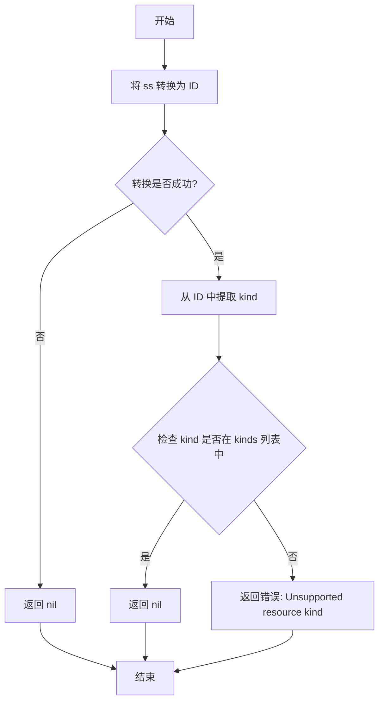
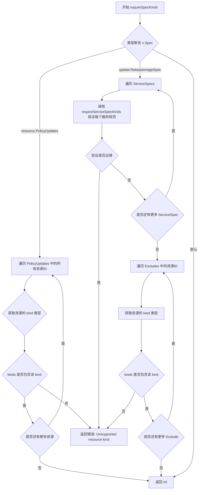
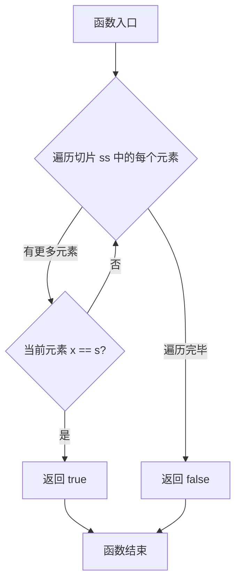
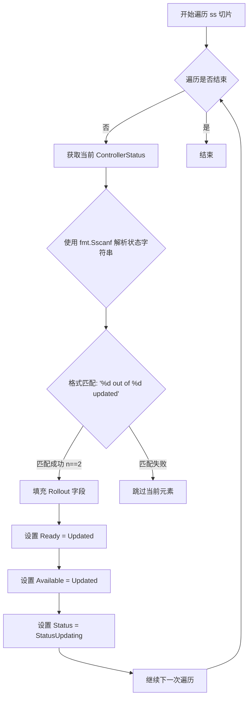
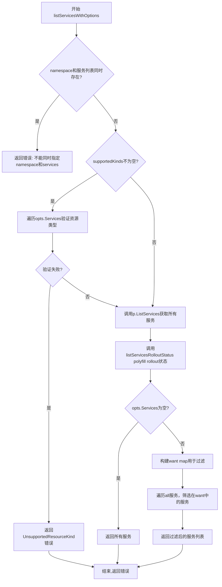
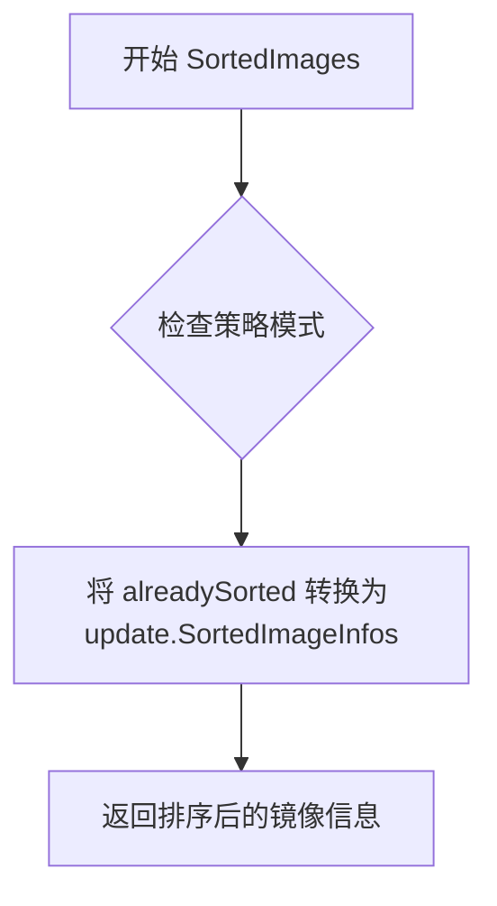
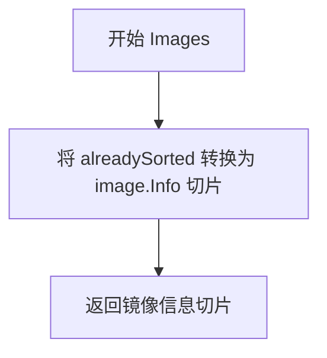

# `flux\pkg\remote\rpc\compat.go` 详细设计文档

Flux CD的RPC层实现，提供服务列表和镜像列表的API适配功能，包含多个API版本(v6/v10/v11)之间的兼容性和polyfill处理，支持资源类型过滤、命名空间和服务过滤、容器字段填充以及滚动状态信息的兼容处理。

## 整体流程

```mermaid
graph TD
A[开始] --> B[接收客户端请求]
B --> C{调用哪个方法?}
C -->|ListServices| D[listServicesWithOptions]
C -->|ListImages| E[listImagesWithOptions]
D --> F[验证namespace和services参数]
F --> G{有supportedKinds过滤?}
G -->|是 --> H[requireServiceIDKinds验证每个服务ID]
G -->|否 --> I[调用底层ListServices获取所有服务]
H --> I
I --> J[调用listServicesRolloutStatus填充滚动状态]
J --> K{opts.Services是否为空?}
K -->|是 --> L[返回所有服务]
K -->|否 --> M[过滤出需要的服务]
M --> N[返回过滤后的服务列表]
E --> O[调用client.ListImages获取镜像状态]
O --> P{获取服务列表构建policyMap}
P --> Q[遍历镜像容器填充policy信息]
Q --> R[调用v6.NewContainer创建新容器]
R --> S[返回处理后的镜像状态列表]
N --> T[结束]
S --> T
```

## 类结构

```
rpc (包)
├── 接口定义
│   ├── listServicesWithoutOptionsClient
│   └── listImagesWithoutOptionsClient
├── 类型定义
│   └── alreadySorted
└── 全局函数
    ├── requireServiceSpecKinds
    ├── requireServiceIDKinds
    ├── requireSpecKinds
    ├── contains
    ├── listServicesRolloutStatus
    ├── listServicesWithOptions
    └── listImagesWithOptions
```

## 全局变量及字段


    

## 全局函数及方法


### `requireServiceSpecKinds`

该函数用于验证给定的服务资源规格（ResourceSpec）是否属于支持的资源类型（Kind）。它通过提取资源规格中的 ID，解析出资源类型，并与允许的类型列表进行比对，从而确保操作仅针对符合要求的资源类型执行。

参数：

- `ss`：`update.ResourceSpec`，待验证的服务资源规格对象
- `kinds`：`[]string`，允许支持的资源类型列表

返回值：`error`，如果资源类型不支持则返回具体错误信息，否则返回 nil

#### 流程图



#### 带注释源码

```go
// requireServiceSpecKinds 验证服务资源规格是否属于支持的类型
// 参数 ss: update.ResourceSpec - 待验证的服务资源规格
// 参数 kinds: []string - 支持的资源类型列表
// 返回值: error - 如果不支持则返回错误
func requireServiceSpecKinds(ss update.ResourceSpec, kinds []string) error {
	// 尝试将 ResourceSpec 转换为资源 ID
	id, err := ss.AsID()
	if err != nil {
		// 注意：这里存在潜在逻辑缺陷 - 转换失败时返回 nil 而非错误
		// 可能导致验证被跳过，产生安全隐患
		return nil
	}

	// 从资源 ID 中提取组件信息，获取资源类型（Kind）
	_, kind, _ := id.Components()
	
	// 检查提取的 kind 是否在允许的类型列表中
	if !contains(kinds, kind) {
		// 类型不匹配时返回格式化的错误信息
		return fmt.Errorf("Unsupported resource kind: %s", kind)
	}

	// 验证通过，返回 nil
	return nil
}
```


### `requireServiceIDKinds`

验证给定的资源 ID 是否属于支持的类型。该函数从资源 ID 中提取 kind 组件，并检查它是否出现在允许的 kinds 列表中，如果不支持则返回错误。

参数：

- `id`：`resource.ID`，要验证的资源标识符
- `kinds`：`[]string`，支持的资源类型列表

返回值：`error`，如果资源 kind 不在支持列表中则返回错误，否则返回 nil

#### 流程图

```mermaid
flowchart TD
    A[开始 requireServiceIDKinds] --> B[提取资源ID的kind组件]
    B --> C{kind是否在kinds列表中?}
    C -->|是| D[返回nil]
    C -->|否| E[返回错误: Unsupported resource kind: {kind}]
    D --> F[结束]
    E --> F
```

#### 带注释源码

```go
// requireServiceIDKinds 验证资源ID的kind是否在支持列表中
// 参数:
//   - id: resource.ID - 资源的唯一标识符
//   - kinds: []string - 支持的资源kind列表
//
// 返回值:
//   - error: 如果kind不支持则返回错误,否则返回nil
func requireServiceIDKinds(id resource.ID, kinds []string) error {
	// 从资源ID中提取组件,获取kind部分
	// Components() 返回 (namespace, kind, name)
	_, kind, _ := id.Components()
	
	// 检查提取的kind是否在允许的kinds列表中
	if !contains(kinds, kind) {
		// 如果不支持,返回格式化的错误信息
		return fmt.Errorf("Unsupported resource kind: %s", kind)
	}
	
	// kind在支持列表中,验证通过
	return nil
}
```


### `requireSpecKinds`

该函数用于验证给定的更新规范（update.Spec）中引用的所有资源类型是否都在支持的资源类型列表中。它通过类型断言解析规范的具体类型，分别处理 `PolicyUpdates` 和 `ReleaseImageSpec` 两种情况，遍历其中包含的资源ID或服务规范，调用辅助函数或直接检查组件类型，若存在不支持的资源类型则返回相应的错误信息。

参数：

-  `s`：`update.Spec`，需要验证的更新规范对象，包含具体的更新规格数据
-  `kinds`：`[]string`，支持的资源类型列表，用于过滤和验证

返回值：`error`，如果验证过程中发现任何不支持的资源类型则返回包含类型信息的错误，否则返回 nil

#### 流程图



#### 带注释源码

```go
// requireSpecKinds 验证更新规范中引用的所有资源类型是否在支持列表中
func requireSpecKinds(s update.Spec, kinds []string) error {
	// 使用类型断言获取 Spec 的实际类型
	switch s := s.Spec.(type) {
	// 处理策略更新类型的规范
	case resource.PolicyUpdates:
		// 遍历所有要更新的资源ID
		for id, _ := range s {
			// 从资源ID中提取 kind 组件（名称空间被忽略）
			_, kind, _ := id.Components()
			// 检查该 kind 是否在支持的资源类型列表中
			if !contains(kinds, kind) {
				// 不支持则返回格式化的错误信息
				return fmt.Errorf("Unsupported resource kind: %s", kind)
			}
		}
	// 处理镜像发布类型的规范
	case update.ReleaseImageSpec:
		// 遍历所有服务规范
		for _, ss := range s.ServiceSpecs {
			// 调用专门的函数验证服务规范
			if err := requireServiceSpecKinds(ss, kinds); err != nil {
				return err
			}
		}
		// 遍历所有要排除的资源ID
		for _, id := range s.Excludes {
			// 同样提取 kind 并验证
			_, kind, _ := id.Components()
			if !contains(kinds, kind) {
				return fmt.Errorf("Unsupported resource kind: %s", kind)
			}
		}
	}
	// 如果所有验证都通过，返回 nil（无错误）
	return nil
}
```


### `contains`

这是一个简单的辅助函数，用于检查给定的字符串切片中是否包含指定的字符串。

参数：

- `ss`：`[]string`，要进行搜索的字符串切片
- `s`：`string`，要查找的字符串

返回值：`bool`，如果切片中包含该字符串返回 `true`，否则返回 `false`

#### 流程图



#### 带注释源码

```go
// contains 检查字符串切片 ss 中是否包含字符串 s
// 参数:
//   - ss: []string, 要搜索的字符串切片
//   - s: string, 要查找的字符串
//
// 返回值:
//   - bool: 如果找到返回 true, 否则返回 false
func contains(ss []string, s string) bool {
    // 遍历字符串切片中的每个元素
    for _, x := range ss {
        // 如果找到匹配的字符串,立即返回 true
        if x == s {
            return true
        }
    }
    // 遍历完毕未找到匹配的字符串,返回 false
    return false
}
```


### `listServicesRolloutStatus`

该函数是一个填充程序（polyfill），用于处理旧版本 daemon 汇报的服务状态信息。它从状态字符串中解析出 "X out of N updated" 格式的更新进度，并将这些信息填充到 ControllerStatus 的 Rollout 字段中，同时处理向后兼容性。

参数：

- `ss`：`[]v6.ControllerStatus`，服务控制器状态列表，用于遍历并填充 rollout 状态信息

返回值：无返回值（`void`），直接修改传入的切片内容

#### 流程图



#### 带注释源码

```go
// listServicesRolloutStatus polyfills the rollout status.
// listServicesRolloutStatus 函数用于填充 rollout 状态信息
// 兼容旧版本 daemon 的状态格式
func listServicesRolloutStatus(ss []v6.ControllerStatus) {
    // 遍历所有服务状态
    for i := range ss {
        // Polyfill for daemons that list pod information in status ('X out of N updated')
        // 尝试从状态字符串中解析更新进度，格式如 "3 out of 5 updated"
        // 如果解析成功（n == 2），说明是旧版本 daemon 的格式
        if n, _ := fmt.Sscanf(ss[i].Status, "%d out of %d updated", &ss[i].Rollout.Updated, &ss[i].Rollout.Desired); n == 2 {
            // Daemons on an earlier version determined the workload to be ready if updated == desired.
            //
            // Technically, 'updated' does *not* yet mean these pods are ready and accepting traffic. There
            // can still be outdated pods that serve requests. The new way of determining the end of a rollout
            // is to make sure the desired count equals to the number of 'available' pods and zero outdated
            // pods. To make older daemons reach a "rollout is finished" state we set 'available', 'ready',
            // and 'updated' all to the same count.
            // 旧版本 daemon 认为 updated == desired 时 workload 就绪
            // 实际上 'updated' 并不代表 pods 已就绪并接收流量
            // 新版本通过 'available' pods 数量和零 outdated pods 来判断 rollout 结束
            // 为兼容旧版本，将 available、ready、updated 都设置为相同值
            ss[i].Rollout.Ready = ss[i].Rollout.Updated
            ss[i].Rollout.Available = ss[i].Rollout.Updated
            // 更新状态为更新中
            ss[i].Status = cluster.StatusUpdating
        }
    }
}
```


### `listServicesWithOptions`

该函数是v11 API中`ListServicesWithOptions`的polyfill实现，通过先获取所有服务后再过滤不想要的资源来实现类似功能。它处理了命名空间和服务ID的过滤，并包含一个rollout状态的polyfill逻辑。

参数：

- `ctx`：`context.Context`，用于传播取消信号和截止时间
- `p`：`listServicesWithoutOptionsClient`，用于列出服务的客户端接口
- `opts`：`v11.ListServicesOptions`，包含命名空间和服务ID过滤选项
- `supportedKinds`：`[]string`，支持验证的资源类型列表

返回值：

- `[]v6.ControllerStatus`，过滤后的控制器状态列表
- `error`：执行过程中的错误信息

#### 流程图



#### 带注释源码

```go
// listServicesWithOptions polyfills the ListServiceWithOptions()
// introduced in v11 by removing unwanted resources after fetching
// all the services.
// 该函数是v11 API中ListServiceWithOptions的polyfill实现
// 通过先获取所有服务后再过滤来实现类似功能
func listServicesWithOptions(ctx context.Context, p listServicesWithoutOptionsClient, opts v11.ListServicesOptions, supportedKinds []string) ([]v6.ControllerStatus, error) {
	// 验证：不能同时指定namespace和services参数
	// 如果同时指定，会返回错误，因为这会导致混淆
	if opts.Namespace != "" && len(opts.Services) > 0 {
		return nil, errors.New("cannot filter by 'namespace' and 'services' at the same time")
	}
	
	// 如果指定了supportedKinds，则验证请求的服务ID是否符合支持的类型
	// 这是一个安全检查，确保客户端请求的资源类型是允许的
	if len(supportedKinds) > 0 {
		for _, svc := range opts.Services {
			if err := requireServiceIDKinds(svc, supportedKinds); err != nil {
				// 将错误转换为远程不支持资源类型的错误
				return nil, remote.UnsupportedResourceKind(err)
			}
		}
	}

	// 调用底层客户端获取服务列表，使用指定的namespace（空字符串表示全部namespace）
	all, err := p.ListServices(ctx, opts.Namespace)
	
	// 对获取到的服务进行rollout状态polyfill处理
	// 这是为了兼容旧版本的daemon，它们使用不同的格式报告rollout状态
	listServicesRolloutStatus(all)
	
	// 如果获取服务失败，直接返回错误
	if err != nil {
		return nil, err
	}
	
	// 如果没有指定具体的服务名称过滤条件，返回所有服务
	if len(opts.Services) == 0 {
		return all, nil
	}

	// Polyfill the service IDs filter
	// 构建一个map用于快速查找需要保留的服务ID
	want := map[resource.ID]struct{}{}
	for _, svc := range opts.Services {
		want[svc] = struct{}{}
	}
	
	// 遍历所有服务，只保留在want map中的服务
	var controllers []v6.ControllerStatus
	for _, svc := range all {
		if _, ok := want[svc.ID]; ok {
			controllers = append(controllers, svc)
		}
	}
	
	// 返回过滤后的服务列表
	return controllers, nil
}
```


### `listImagesWithOptions`

该函数是一个用于填充（polyfill）v10 版本的 `ListImagesWithOptions` 功能的辅助函数。它通过同时调用 `ListImages` 和 `ListServices` 两个接口，获取镜像状态信息，然后根据服务策略填充容器字段，最终返回完整的镜像状态列表。

#### 参数

- `ctx`：`context.Context`，用于传递上下文信息和取消信号
- `client`：`listImagesWithoutOptionsClient`（接口类型），用于调度 `.ListImages()` 和 `.ListServices()` 方法的客户端接口
- `opts`：`v10.ListImagesOptions`，列出镜像的选项配置，包含资源规范和容器字段覆盖信息

#### 返回值

- `[]v6.ImageStatus`，返回镜像状态列表
- `error`：执行过程中发生的错误

#### 流程图

```mermaid
flowchart TD
    A[开始 listImagesWithOptions] --> B[调用 client.ListImages]
    B --> C{是否有错误}
    C -->|是| D[返回错误]
    C -->|否| E{检查 opts.Spec 是否为 ResourceSpecAll}
    E -->|否| F[从 Spec 提取 ResourceID]
    F --> G[从 ResourceID 提取 namespace ns]
    E -->|是| H[ns = 空字符串]
    G --> I[调用 client.ListServices]
    H --> I
    I --> J{是否有错误}
    J -->|是| K[返回错误]
    J -->|否| L[构建 policyMap: service.ID -> service.Policies]
    L --> M[遍历 statuses 中的每个 status]
    M --> N{遍历每个 status 的 Containers}
    N -->|是| O[从 policyMap 获取 policies]
    O --> P[计算 tagPattern]
    P --> Q[调用 v6.NewContainer 创建新容器]
    Q --> R[更新 statuses[i].Containers[j]]
    R --> N
    N -->|否| S{是否还有更多 status}
    S -->|是| M
    S -->|否| T[返回 statuses 和 nil]
    D --> T
    K --> T
```

#### 带注释源码

```go
// listImagesWithOptions 是由 ListImagesWithOptions 调用的辅助函数，
// 用于使用接口来调度 .ListImages() 和 .ListServices() 到正确的 API 版本。
// 这是一个 polyfill 函数，用于在不支持 ListImagesWithOptions 的版本中提供该功能。
func listImagesWithOptions(ctx context.Context, client listImagesWithoutOptionsClient, opts v10.ListImagesOptions) ([]v6.ImageStatus, error) {
	// 第一步：调用客户端的 ListImages 方法获取镜像状态
	statuses, err := client.ListImages(ctx, opts.Spec)
	if err != nil {
		// 如果获取镜像状态失败，直接返回错误
		return statuses, err
	}

	// 第二步：确定需要查询服务的 namespace
	var ns string
	if opts.Spec != update.ResourceSpecAll {
		// 如果不是查询所有资源，则从资源规范中提取 ID
		resourceID, err := opts.Spec.AsID()
		if err != nil {
			return statuses, err
		}
		// 从资源 ID 中解析出 namespace
		ns, _, _ = resourceID.Components()
	}

	// 第三步：调用客户端的 ListServices 方法获取服务信息（用于获取策略）
	services, err := client.ListServices(ctx, ns)
	if err != nil {
		return statuses, err
	}

	// 第四步：构建策略映射表，key 为资源 ID，value 为该服务的策略映射
	policyMap := map[resource.ID]map[string]string{}
	for _, service := range services {
		policyMap[service.ID] = service.Policies
	}

	// 第五步：polyfill 容器字段（v10 版本需要从策略中获取 tag pattern 等信息）
	for i, status := range statuses {
		for j, container := range status.Containers {
			var p policy.Set
			// 从 policyMap 中获取当前服务相关的策略
			if policies, ok := policyMap[status.ID]; ok {
				p = policy.Set{}
				// 将字符串类型的策略键转换为 policy.Policy 类型
				for k, v := range policies {
					p[policy.Policy(k)] = v
				}
			}
			// 根据策略和容器名称获取标签匹配模式
			tagPattern := policy.GetTagPattern(p, container.Name)
			// 使用 v6.NewContainer 创建新容器（应用策略后的结果）
			// 这里使用 alreadySorted 来适配 v6 的接口，因为容器已有排序信息
			newContainer, err := v6.NewContainer(
				container.Name,
				alreadySorted(container.Available), // 将已排序的镜像信息转换为 v6 兼容格式
				container.Current,                 // 当前使用的镜像
				tagPattern,                         // 标签匹配模式
				opts.OverrideContainerFields,      // 用户指定的容器字段覆盖值
			)
			if err != nil {
				return statuses, err
			}
			// 更新状态列表中的容器信息
			statuses[i].Containers[j] = newContainer
		}
	}

	// 第六步：返回处理完成的镜像状态列表
	return statuses, nil
}
```


### `alreadySorted.Images`

该方法将 `alreadySorted` 类型（实质上是 `update.SortedImageInfos` 的别名）转换为 `[]image.Info` 切片，实现了图像信息列表的获取功能。

参数：

- （无参数）

返回值：`[]image.Info`，返回包含图像信息的切片

#### 流程图

```mermaid
flowchart TD
    A[开始: 调用 Images 方法] --> B{接收 alreadySorted 类型实例}
    B --> C[将 alreadySorted 转换为 []image.Info]
    C --> D[返回转换后的切片]
    D --> E[结束]
    
    style A fill:#f9f,stroke:#333
    style D fill:#9f9,stroke:#333
    style E fill:#9f9,stroke:#333
```

#### 带注释源码

```go
// alreadySorted 是 update.SortedImageInfos 的类型别名
type alreadySorted update.SortedImageInfos

// Images 是 alreadySorted 类型的方法，实现图像信息列表的获取
// 参数：无
// 返回值：[]image.Info - 图像信息切片
func (infos alreadySorted) Images() []image.Info {
	// 将 alreadySorted 类型转换为 []image.Info 并返回
	// 这里利用了 Go 语言的类型别名特性
	// alreadySorted 本质上是 update.SortedImageInfos
	// 而 update.SortedImageInfos 底层与 []image.Info 兼容
	return []image.Info(infos)
}
```


### `alreadySorted.SortedImages`

该方法是类型 `alreadySorted`（即 `update.SortedImageInfos` 的别名）的方法，用于返回已排序的镜像信息列表。由于镜像信息已经是排序状态，该方法直接返回自身，忽略传入的策略模式参数。

参数：

- `_`：`policy.Pattern`，策略模式参数（当前未使用，因为数据已排序）

返回值：`update.SortedImageInfos`，返回已排序的镜像信息列表

#### 流程图



#### 带注释源码

```go
// SortedImages 返回已排序的镜像信息
// 参数 _ policy.Pattern: 策略模式参数，当前未使用（数据已排序）
// 返回值: update.SortedImageInfos 类型的已排序镜像信息
func (infos alreadySorted) SortedImages(_ policy.Pattern) update.SortedImageInfos {
    // 直接返回 infos，因为 alreadySorted 本质上就是 update.SortedImageInfos
    // _ 参数被忽略，因为镜像信息已经是排序状态
    return update.SortedImageInfos(infos)
}
```

---

### `alreadySorted.Images`

该方法是类型 `alreadySorted` 的方法，用于将已排序的镜像信息转换为通用的镜像信息切片。

参数：无

返回值：`[]image.Info`，返回镜像信息切片

#### 流程图



#### 带注释源码

```go
// Images 返回镜像信息切片
// 参数: 无
// 返回值: []image.Info 镜像信息切片
func (infos alreadySorted) Images() []image.Info {
    // 将 alreadySorted (本质是 update.SortedImageInfos) 转换为 []image.Info
    return []image.Info(infos)
}
```

## 关键组件


### API版本适配层

该代码作为RPC层，在Fluxcd Flux项目中实现不同API版本(v6, v10, v11)之间的向后兼容性适配，通过polyfill模式为旧版本API补充新版本才有的字段和功能，主要处理服务列表查询和镜像列表查询的场景。

### 资源种类验证组件

包含requireServiceSpecKinds、requireServiceIDKinds和requireSpecKinds三个函数，用于验证资源ID或服务规范是否属于支持的种类列表，返回UnsupportedResourceKind错误。

### 服务列表Polyfill组件

listServicesWithOptions函数为不支持ListServicesWithOptions的旧版API提供填充实现，支持按namespace和services过滤，并在获取所有服务后进行客户端侧筛选，同时调用listServicesRolloutStatus为旧版守护进程补充rollout状态信息。

### Rollout状态填充组件

listServicesRolloutStatus函数通过解析Status字符串格式"X out of N updated"来填充Updated字段，并将Ready和Available设置为与Updated相同的值，将Status设置为StatusUpdating以模拟新版本的行为。

### 镜像列表适配组件

listImagesWithOptions函数处理v10和v6版本之间的差异，从服务中获取策略信息并填充容器字段，使用alreadySorted类型转换来满足接口要求，调用v6.NewContainer创建新容器对象。

### 已排序镜像包装器

alreadySorted类型实现了image.Infos和update.SortedImageInfos接口，作为类型适配器允许在v6和v10之间传递已排序的镜像信息。

### 辅助函数

contains函数提供基础的字符串切片查找功能，用于验证资源种类是否在支持列表中。


## 问题及建议


### 已知问题

- **错误处理不一致**：`requireServiceSpecKinds` 函数中，当 `ss.AsID()` 返回错误时直接返回 `nil`，这可能导致调用者无法区分"无错误"和"确实没有错误"的情况，应该返回原始错误或一个明确的错误。
- **接口重复定义**：`listServicesWithoutOptionsClient` 和 `listImagesWithoutOptionsClient` 两个接口定义了相同的 `ListServices` 方法，违反了 DRY 原则，可考虑提取公共接口。
- **类型断言风险**：在 `requireSpecKinds` 中使用类型 switch 进行断言，如果新增其他 `Spec` 类型分支未被处理，函数会静默返回 `nil` 而不报错，可能导致意外行为。
- **魔法字符串**：`"%d out of %d updated"` 格式化字符串在代码中硬编码，若格式变化需多处修改。
- **缺少日志记录**：整个代码中没有任何日志输出，调试时难以追踪问题，特别是在 polyfill 逻辑中。
- **接口暴露过多细节**：`listImagesWithoutOptionsClient` 接口方法参数直接使用具体类型 `update.ResourceSpec`，而非更抽象的类型，限制了扩展性。

### 优化建议

- 统一错误处理语义，确保所有验证函数在失败时返回有意义的错误信息。
- 提取公共接口 `ListServices` 方法到一个基础接口中，通过组合方式复用。
- 为 `requireSpecKinds` 添加默认分支，返回 `nil` 或一个明确的 "unsupported spec type" 错误，避免静默忽略未知类型。
- 将 `listServicesRolloutStatus` 中的格式化字符串提取为常量或配置。
- 在关键路径添加结构化日志，特别是错误分支和 polyfill 逻辑。
- 考虑使用更抽象的类型定义接口方法参数，提高代码的可测试性和可扩展性。
- 为 `contains` 函数考虑使用 Go 1.21 引入的 `slices.Contains` 或 `maps` 包进行简化。

## 其它


### 设计目标与约束

本代码的设计目标是解决Flux CD在API版本演进过程中的向后兼容性问题，通过polyfill（填充）机制使得旧版本客户端能够使用新版本引入的功能，同时支持对资源类型（Kind）进行过滤和验证。主要约束包括：1) 仅支持Service类型的资源；2) 不能同时使用namespace和services进行过滤；3) 依赖v6作为底层数据模型；4) 需要处理不同版本daemons的rollout status格式差异。

### 错误处理与异常设计

代码采用以下错误处理策略：1) 使用errors.New()创建简单错误消息，如"cannot filter by 'namespace' and 'services' at the same time"；2) 使用fmt.Errorf()创建带格式化参数的错误，用于Unsupported resource kind场景；3) 调用remote.UnsupportedResourceKind()封装资源类型不支持的错误；4) 错误在调用链中直接返回，不做吞没处理；5) 所有可能返回错误的函数都遵循Go惯例，将error作为最后一个返回值。

### 数据流与状态机

listServicesRolloutStatus函数实现了状态机逻辑，将旧版daemon的状态格式转换为统一的状态。当解析到"X out of Y updated"格式时，会触发状态转换：将Status设置为cluster.StatusUpdating，同时将Rollout的Updated、Ready、Available字段设置为相同的值。这模拟了新版daemon报告完整rollout信息的行为。状态流转路径为：原始Status字符串 -> 解析成功 -> cluster.StatusUpdating，同时更新Rollout结构体中的三个计数字段。

### 外部依赖与接口契约

本代码依赖以下外部包：github.com/fluxcd/flux/pkg/api/v10提供v10版本的ListImagesOptions；github.com/fluxcd/flux/pkg/api/v11提供v11版本的ListServicesOptions；github.com/fluxcd/flux/pkg/cluster提供cluster.StatusUpdating常量和ControllerStatus结构体；github.com/fluxcd/flux/pkg/image提供image.Info类型；github.com/fluxcd/flux/pkg/policy提供policy.Set、policy.Pattern等策略相关类型；github.com/fluxcd/flux/pkg/remote提供remote.UnsupportedResourceKind函数；github.com/fluxcd/flux/pkg/resource提供resource.ID类型；github.com/fluxcd/flux/pkg/update提供更新相关的类型定义。代码定义了listServicesWithoutOptionsClient和listImagesWithoutOptionsClient两个接口，规定了调用方必须实现的方法列表。

### 版本支持策略

当前代码支持v6、v10、v11三个API版本。v6是基础版本，提供核心的ControllerStatus和ImageStatus数据结构；v10引入了ListImagesOptions和OverrideContainerFields功能；v11引入了ListServicesOptions用于按namespace或services过滤。版本演进采用增量polyfill方式，新版本特性通过在旧版本上添加兼容层来实现，无需修改客户端代码。

### API演进方式

代码采用函数式polyfill模式处理API差异：listServicesWithOptions函数为v11的ListServicesWithOptions提供v6兼容实现，通过opts.Services过滤结果；listImagesWithOptions函数为v10的ListImagesWithOptions提供数据转换，将底层v6数据适配为v10格式；listServicesRolloutStatus函数处理不同版本daemon的status格式差异，统一转换为新格式。

### 配置管理

supportedKinds参数通过requireServiceIDKinds和requireSpecKinds函数生效，用于限制可操作的资源类型。opts参数（v10.ListImagesOptions和v11.ListServicesOptions）允许调用者指定过滤条件。want变量用于建立ID到布尔值的映射，实现O(1)查找效率。

### 性能考虑与优化空间

代码已包含部分优化：want map使用预分配方式存储待过滤的服务ID；listImagesWithOptions复用了alreadySorted类型避免数据转换。潜在优化方向包括：1) 为large namespace场景添加分页支持；2) 缓存policyMap避免重复构建；3) 使用sync.Pool复用ControllerStatus切片。

### 并发安全

当前代码不涉及并发写入，所有操作均在单一goroutine中完成。listServicesRolloutStatus函数直接修改传入的切片元素，如果调用方并发调用需要自行加锁。listImagesWithOptions中的policyMap构建过程不是线程安全的。

### 测试策略建议

应覆盖以下测试场景：1) 多种rollout status字符串格式的解析；2) namespace和services同时使用的错误场景；3) supportedKinds过滤不存在的kind；4) 空services列表返回全部服务；5) listImagesWithOptions中policyMap为空的边界情况；6) alreadySorted类型的方法调用链完整性。

### 关键组件交互关系

requireSpecKinds是入口校验函数，根据Spec类型（PolicyUpdates或ReleaseImageSpec）分发到不同的校验逻辑；listServicesWithOptions调用listServicesRolloutStatus进行状态转换；listImagesWithOptions依赖listImagesWithoutOptionsClient接口的两个方法，通过policyMap建立services和policies的关联；v6.NewContainer是数据构造的核心函数，负责组装ContainerStatus。

    