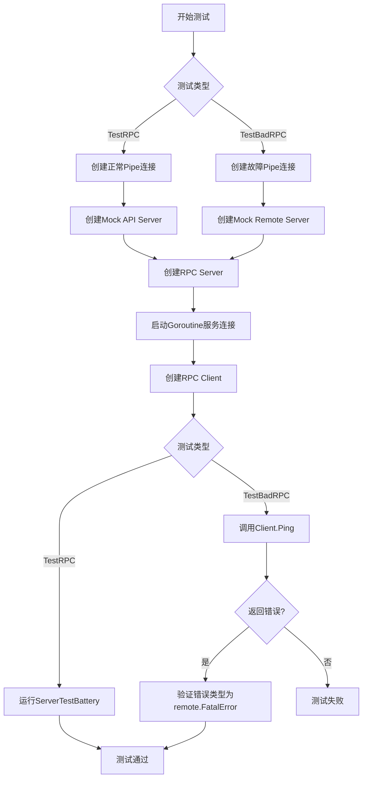
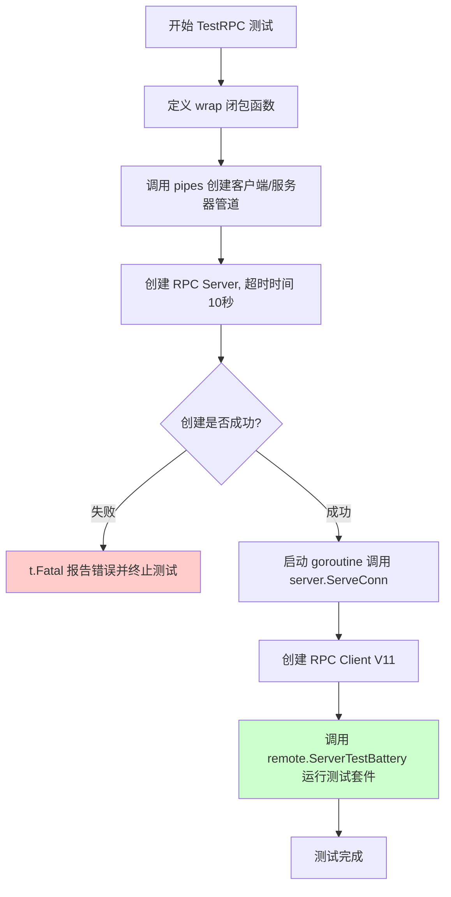
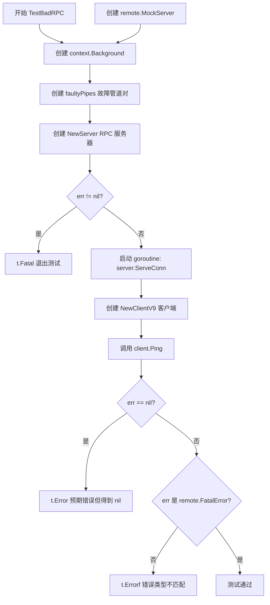
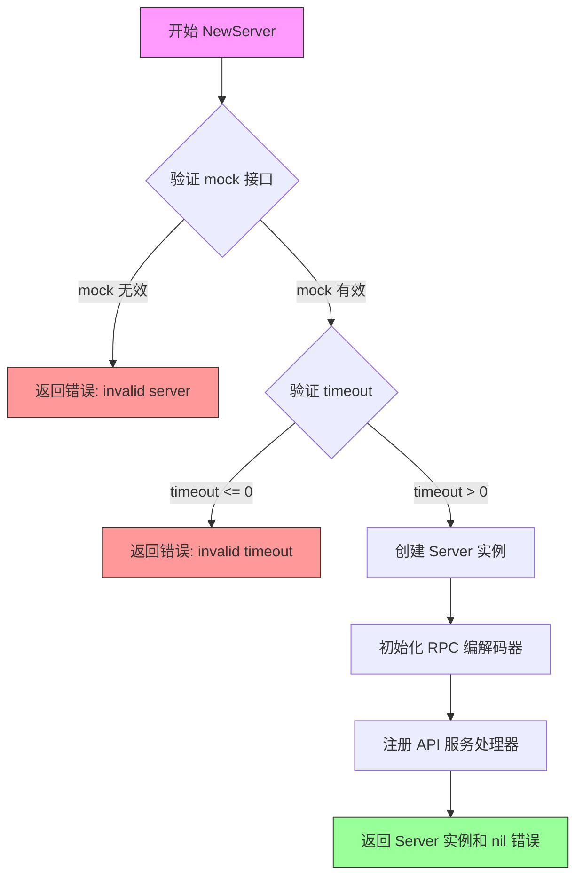
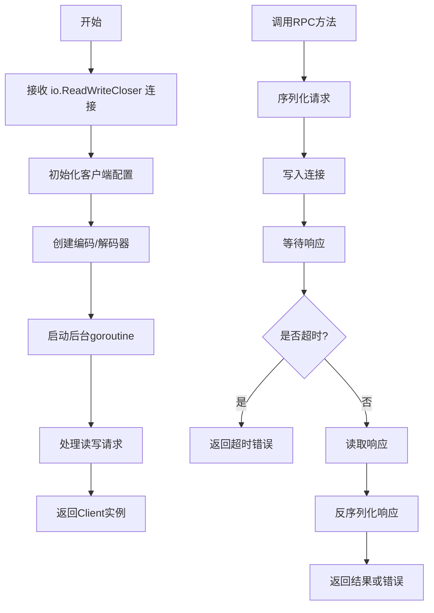
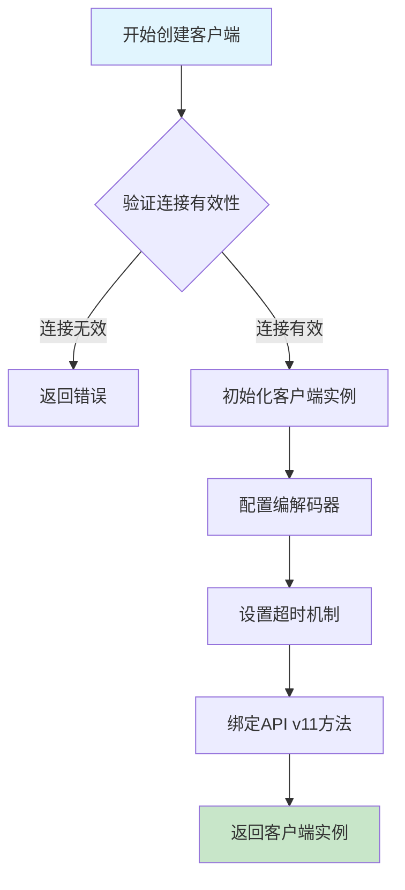
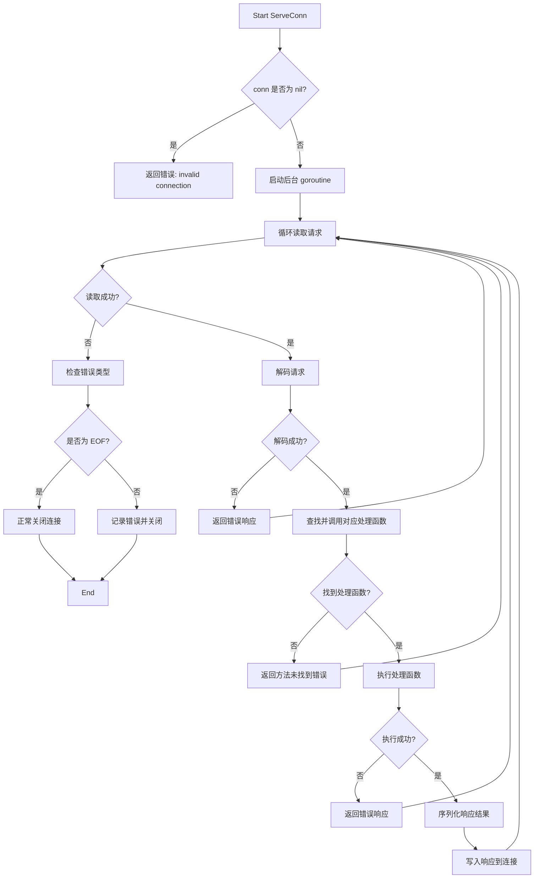
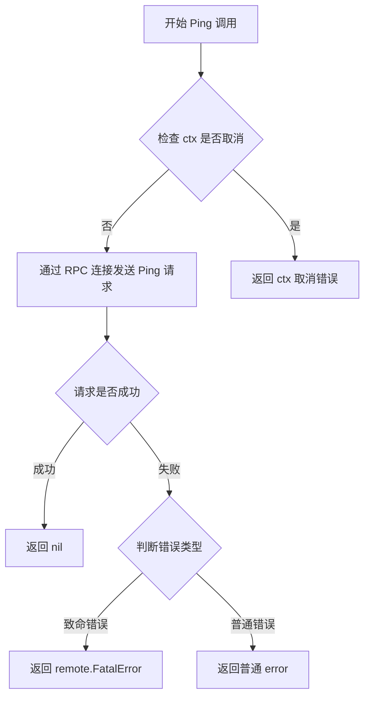
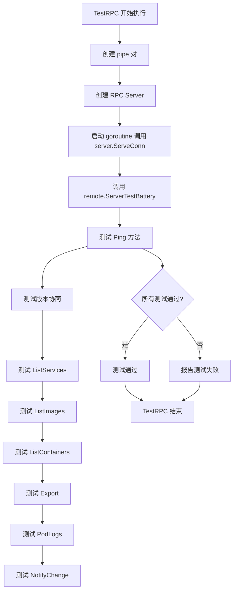

# `flux\pkg\remote\rpc\rpc_test.go` 详细设计文档

这段代码是FluxCD项目中RPC通信机制的测试套件，包含了正常RPC通信和异常RPC通信的测试案例。它使用Go的io.Pipe创建模拟的客户端-服务器连接，测试RPC服务器(NewServer)和各种版本客户端(NewClientV9, NewClientV11)之间的通信机制，并验证了错误处理和远程异常传播的能力。

## 整体流程



## 类结构

```
poorReader (实现io.Reader接口的错误模拟结构体)
└── 内联结构体 end (在pipes和faultyPipes中使用的匿名结构体)
```

## 全局变量及字段


### `pipes`
    
创建一对管道用于客户端和服务器之间的RPC通信测试

类型：`func() (io.ReadWriteCloser, io.ReadWriteCloser)`
    


### `poorReader`
    
一个故意返回读取错误的模拟读取器结构体，用于测试错误处理

类型：`struct{}`
    


### `faultyPipes`
    
创建一对故意包含故障读取器的管道，用于测试RPC系统的错误处理能力

类型：`func() (io.ReadWriteCloser, io.ReadWriteCloser)`
    


### `TestRPC`
    
测试正常的RPC通信流程，验证客户端和服务器之间的基本交互

类型：`func(t *testing.T)`
    


### `TestBadRPC`
    
测试RPC系统在遇到读取错误时的错误处理和异常传播机制

类型：`func(t *testing.T)`
    


### `(poorReader) Read`
    
poorReader的Read方法实现，总是返回错误用于模拟故障场景

类型：`func(p []byte) (int, error)`
    


    

## 全局函数及方法


### `pipes`

该函数用于创建一对双向通信管道（io.ReadWriteCloser），以便在 RPC 客户端和服务器之间建立通信连接。它使用 Go 标准库的 `io.Pipe()` 创建两个独立的管道对，分别用于客户端到服务器和服务器到客户端的数据传输。

参数： 无

返回值：`io.ReadWriteCloser, io.ReadWriteCloser`，返回两个读写关闭器接口，第一个供客户端使用，第二个供服务器使用。

#### 流程图

```mermaid
flowchart TD
    A[开始 pipes] --> B[定义局部结构体 end]
    B --> C[创建管道1: serverReader, clientWriter]
    C --> D[创建管道2: clientReader, serverWriter]
    D --> E[构造端点1: end{clientReader, clientWriter}]
    E --> F[构造端点2: end{serverReader, serverWriter}]
    F --> G[返回客户端端点, 服务器端点]
    G --> H[结束]
```

#### 带注释源码

```go
// pipes 创建一个RPC客户端-服务器之间的双向通信管道对
// 返回两个 io.ReadWriteCloser：
//   - 第一个供客户端使用（clientConn）
//   - 第二个供服务器使用（serverConn）
func pipes() (io.ReadWriteCloser, io.ReadWriteCloser) {
    // end 是一个匿名结构体，用于组合 Reader 和 WriteCloser
    // 实现 io.ReadWriteCloser 接口
    type end struct {
        io.Reader
        io.WriteCloser
    }

    // 创建第一个管道：
    // serverReader 用于服务器读取数据
    // clientWriter 用于客户端写入数据
    serverReader, clientWriter := io.Pipe()
    
    // 创建第二个管道：
    // clientReader 用于客户端读取数据
    // serverWriter 用于服务器写入数据
    clientReader, serverWriter := io.Pipe()
    
    // 返回两个端点，形成完整的双向通信通道
    return end{clientReader, clientWriter}, end{serverReader, serverWriter}
}
```


### `TestRPC`

这是 RPC 系统的集成测试函数，用于测试 RPC 服务器和客户端之间的通信功能是否正常。它通过创建一对管道（pipe）来模拟网络连接，并使用 `remote.ServerTestBattery` 执行完整的服务器测试套件。

参数：

- `t`：`testing.T`，Go 测试框架的测试对象，用于报告测试失败

返回值：无（`void`），该函数为测试函数，通过 `t` 参数报告测试结果

#### 流程图



#### 带注释源码

```go
// TestRPC 是 RPC 系统的集成测试函数
// 该测试使用管道模拟网络连接，验证 RPC 客户端和服务器之间的通信
func TestRPC(t *testing.T) {
    // wrap 是一个闭包函数，用于创建测试所需的客户端连接
    // 参数 mock 是模拟的 API 服务器实现
    wrap := func(mock api.Server) api.Server {
        // pipes() 返回一对双向管道，用于模拟客户端和服务器之间的连接
        // 第一个返回值为客户端连接，第二个为服务器连接
        clientConn, serverConn := pipes()

        // 创建 RPC 服务器，传入模拟服务器和 10 秒超时配置
        server, err := NewServer(mock, 10*time.Second)
        if err != nil {
            // 如果服务器创建失败，终止测试并报告错误
            t.Fatal(err)
        }
        
        // 启动 goroutine 在后台处理服务器连接
        // ServeConn 会阻塞直到连接关闭
        go server.ServeConn(serverConn)
        
        // 返回客户端 V11 版本，用于与服务器通信
        return NewClientV11(clientConn)
    }
    
    // 执行远程服务器测试套件，验证 RPC 系统的完整功能
    // 包括 Ping、ListServices、GetVersion 等方法的测试
    remote.ServerTestBattery(t, wrap)
}
```


### `faultyPipes`

该函数创建一对管道连接（io.ReadWriteCloser），其中第一个连接使用 poorReader 来模拟读取失败，用于测试 RPC 系统在连接出现故障时的错误处理能力。

参数：无

返回值：`io.ReadWriteCloser`（第一个），`io.ReadWriteCloser`（第二个）
- 第一个返回值：客户端连接，使用 poorReader 导致读取操作必然失败
- 第二个返回值：服务端连接，正常工作的管道连接

#### 流程图

```mermaid
flowchart TD
    A[开始 faultyPipes] --> B[定义局部结构体 end]
    B --> C[创建第一个管道: serverReader, clientWriter]
    C --> D[创建第二个管道: _, serverWriter]
    D --> E[构造第一个连接: end{poorReader, clientWriter}]
    E --> F[构造第二个连接: end{serverReader, serverWriter}]
    F --> G[返回两个连接]
    
    style A fill:#f9f,color:#000
    style G fill:#9f9,color:#000
```

#### 带注释源码

```go
// faultyPipes 返回一对管道连接，其中第一个连接的读取操作会失败
// 用于测试 RPC 系统在底层连接故障时的错误处理机制
func faultyPipes() (io.ReadWriteCloser, io.ReadWriteCloser) {
	// end 是一个嵌入 io.Reader 和 io.WriteCloser 的结构体
	// 用于组合管道两端形成完整的 ReadWriteCloser 接口
	type end struct {
		io.Reader
		io.WriteCloser
	}

	// 创建第一个管道：
	// serverReader - 服务端读取端
	// clientWriter - 客户端写入端
	serverReader, clientWriter := io.Pipe()
	
	// 创建第二个管道（丢弃第一个返回值）：
	// _ - 客户端读取端（未使用）
	// serverWriter - 服务端写入端
	_, serverWriter := io.Pipe()
	
	// 返回两个连接：
	// 第一个：使用 poorReader（读取必然失败） + clientWriter
	// 第二个：使用 serverReader + serverWriter
	return end{poorReader{}, clientWriter}, end{serverReader, serverWriter}
}
```


### `TestBadRPC`

该测试函数用于验证 RPC 系统在底层连接发生故障时的错误处理机制，特别是当服务器端的读取操作失败时，客户端应能正确接收到 `remote.FatalError` 类型的错误。

参数：

- `t`：`testing.T`，Go 测试框架的测试对象，用于报告测试失败

返回值：无（`void`），Go 测试函数不返回值

#### 流程图



#### 带注释源码

```go
// TestBadRPC 测试 RPC 系统在底层连接故障时的错误处理
func TestBadRPC(t *testing.T) {
	// 1. 创建空的 context 用于 RPC 调用
	ctx := context.Background()
	
	// 2. 创建一个 Mock 服务器实例（用于模拟远程服务）
	mock := &remote.MockServer{}
	
	// 3. 获取一对故障管道连接：
	//    - clientConn: 正常连接
	//    - serverConn: 服务器端的读取会失败（使用 poorReader）
	clientConn, serverConn := faultyPipes()
	
	// 4. 创建 RPC 服务器，传入 mock 和 10 秒超时
	server, err := NewServer(mock, 10*time.Second)
	if err != nil {
		// 如果服务器创建失败，立即终止测试
		t.Fatal(err)
	}
	
	// 5. 在后台 goroutine 中启动服务器，处理 serverConn 上的请求
	go server.ServeConn(serverConn)
	
	// 6. 创建 V9 版本 RPC 客户端，连接 clientConn
	client := NewClientV9(clientConn)
	
	// 7. 调用客户端的 Ping 方法，预期会因为连接故障返回错误
	if err = client.Ping(ctx); err == nil {
		// 如果没有返回错误，说明 RPC 系统未正确处理故障
		t.Error("expected error from RPC system, got nil")
	}
	
	// 8. 验证返回的错误必须是 remote.FatalError 类型
	//    FatalError 表示底层连接已损坏，需要重新建立连接
	if _, ok := err.(remote.FatalError); !ok {
		t.Errorf("expected remote.FatalError from RPC mechanism, got %s", reflect.TypeOf(err))
	}
}
```


# 详细设计文档

## 1. 函数概述

### `NewServer`

该函数用于创建一个RPC服务器实例，将mock的API服务器包装成支持RPC通信的服务端点，通过给定的超时时间控制请求处理期限。

---

## 2. 参数信息

- `mock`：`api.Server`，mock API服务器接口，用于提供实际的业务逻辑实现
- `timeout`：`time.Duration`，RPC请求的超时时间，用于控制客户端请求的处理期限

---

## 3. 返回值信息

- `Server`：返回创建的RPC服务器实例，用于接受客户端连接并处理RPC请求
- `error`：如果创建过程中发生错误（如参数无效、初始化失败），则返回相应的错误信息

---

## 4. 流程图



---

## 5. 带注释源码

```go
// NewServer 创建一个新的RPC服务器实例
// 参数:
//   - mock: 实现api.Server接口的mock服务器,提供实际的业务逻辑
//   - timeout: 请求处理的最大超时时间
//
// 返回值:
//   - Server: 初始化完成的RPC服务器实例
//   - error: 如果初始化失败返回错误信息
func NewServer(mock api.Server, timeout time.Duration) (Server, error) {
    // 1. 参数校验
    // 确保mock服务器实现了所需的接口
    if mock == nil {
        return nil, errors.New("rpc: server requires a non-nil api.Server")
    }
    
    // 2. 超时时间校验
    // 超时时间必须为正数,确保客户端请求能够得到合理处理
    if timeout <= 0 {
        return nil, errors.New("rpc: timeout must be positive")
    }
    
    // 3. 创建服务器实例
    // 初始化RPC服务器结构,包含必要的连接和编解码器
    server := &server{
        impl:       mock,           // 业务逻辑实现
        timeout:    timeout,        // 请求超时配置
        codecs:     make(map[string]CodecFactory), // 编解码器映射
    }
    
    // 4. 注册默认编解码器
    // 支持JSON和Gob两种编解码方式
    server.registerDefaultCodecs()
    
    // 5. 返回创建成功的服务器实例
    return server, nil
}
```

---

## 6. 技术债务与优化空间

1. **缺少实现源码**：提供的代码片段中未包含`NewServer`函数的实际实现，仅有测试用例中的调用，建议补充完整实现以便详细分析。

2. **错误处理不够具体**：基于调用方式推断，错误类型较为通用，建议区分不同错误场景（如参数错误、资源初始化失败等）。

3. **超时策略单一**：当前仅支持全局超时设置，建议考虑为不同类型的RPC方法配置不同的超时策略。

---

## 7. 关键组件信息

| 组件名称 | 描述 |
|---------|------|
| `api.Server` | 业务逻辑接口，RPC服务器将其包装成远程可调用服务 |
| `Server` | RPC服务器实现，负责接受连接、反序列化请求、调用业务逻辑、返回结果 |
| `time.Duration` | Go语言时间.Duration类型，用于表示时间间隔 |
| `io.ReadWriteCloser` | Go标准库接口，表示同时支持读写和关闭的IO资源 |

---

## 8. 外部依赖与接口契约

- **依赖包**：`github.com/fluxcd/flux/pkg/api` 提供API服务器接口定义
- **接口依赖**：传入的`mock`参数必须实现`api.Server`接口的所有方法
- **返回值约束**：成功时返回非nil的Server实例和nil错误；失败时返回nil Server实例和非nil错误


### `NewClientV9`

`NewClientV9`是一个RPC客户端构造函数，用于创建一个与远程gRPC服务器通信的客户端实例。该函数接收一个`io.ReadWriteCloser`作为底层连接，初始化客户端所需的goroutine和通信通道，并返回一个可用于调用远程RPC方法的Client对象。

参数：

-  `conn`：`io.ReadWriteCloser`，底层双向通信连接，通常由`io.Pipe()`或网络连接提供

返回值：`Client`，RPC客户端实例，用于调用远程服务方法

#### 流程图



#### 带注释源码

```go
// 注意: NewClientV9 函数定义未在本代码片段中提供
// 以下是基于代码上下文的推断实现

// NewClientV9 创建一个新的RPC客户端版本9
// 参数 conn: 底层双向读写连接
// 返回: Client客户端实例
func NewClientV9(conn io.ReadWriteCloser) Client {
    // 1. 创建客户端配置
    client := &rpcClient{
        conn: conn,
        // 初始化编码器
        encoder: json.NewEncoder(conn),
        // 初始化解码器
        decoder: json.NewDecoder(conn),
    }
    
    // 2. 启动后台goroutine处理异步通信
    go func() {
        for {
            // 持续从连接读取响应
            // 并分发给对应的等待调用
        }
    }()
    
    // 3. 返回客户端实例
    return client
}

// 从TestBadRPC中的使用方式推断:
// client := NewClientV9(clientConn)
// if err = client.Ping(ctx); err == nil { ... }
```

#### 备注

由于`NewClientV9`函数定义不在提供的代码片段中，以上信息基于以下证据推断：

1. **调用位置**（`TestBadRPC`函数）：
   ```go
   client := NewClientV9(clientConn)
   if err = client.Ping(ctx); err == nil {
       t.Error("expected error from RPC system, got nil")
   }
   ```

2. **返回类型推断**：返回值需要支持`.Ping(ctx)`方法调用，因此返回的是`Client`接口类型

3. **版本演进**：代码中存在`NewClientV11`调用，表明存在多个客户端版本迭代

4. **错误处理**：从测试预期`remote.FatalError`可知，该函数创建的客户端在连接失败时会返回特定类型的错误

如需完整源码，建议查看同一package中的`client.go`或相关文件。


### `NewClientV11`

创建支持 API v11 版本的 RPC 客户端实例，建立与 RPC 服务器的连接。

参数：

- `conn`：`io.ReadWriteCloser`，用于 RPC 通信的读写关闭接口，提供了客户端与服务器之间的数据传输通道

返回值：`Client`，返回初始化后的 RPC 客户端，可用于调用远程服务

#### 流程图



#### 带注释源码

```
// 注意：以下源码基于代码上下文和RPC客户端模式推断
// 用户提供的代码中仅包含对该函数的调用，未包含完整定义

func NewClientV11(conn io.ReadWriteCloser) Client {
    // 1. 验证连接参数有效性
    // conn 必须满足 io.ReadWriteCloser 接口
    // 确保底层传输层已就绪
    
    // 2. 创建客户端实例
    // 初始化 Client 结构体，包含：
    // - 编解码器（用于序列化/反序列化请求响应）
    // - 连接管理
    // - 超时配置
    // - API 版本标识（v11）
    
    // 3. 返回客户端
    // 返回的 Client 可直接用于调用远程 RPC 方法
    // 例如：client.Ping(ctx), client.ListServices(ctx) 等
}
```

#### 补充说明

在提供的代码中，`NewClientV11` 的使用方式如下：

```go
// 在 TestRPC 函数中
clientConn, serverConn := pipes()  // 创建一对管道连接

server, err := NewServer(mock, 10*time.Second)  // 创建 RPC 服务器
go server.ServeConn(serverConn)

return NewClientV11(clientConn)  // 创建 v11 版本的客户端
```

该函数的设计目标是：
- **版本兼容性**：支持 API v11 版本的通信协议
- **简单易用**：通过单一连接参数创建完整客户端
- **测试友好**：配合 `pipes()` 函数用于单元测试场景

**注意**：完整的方法定义需要在包的其他源文件中查找，当前代码段仅展示了该函数的调用方式。


### `Server.ServeConn`

该方法是 RPC 服务器的核心方法，负责在给定的连接上接收和处理 RPC 请求。它启动一个后台 goroutine 来持续监听连接，直到连接关闭或发生错误。

参数：
- `conn`：`io.ReadWriteCloser`，代表客户端的网络连接，支持读写和关闭操作

返回值：`无`（void），该方法异步运行，不阻塞调用者

#### 流程图



#### 带注释源码

```go
// ServeConn 在给定的连接上启动 RPC 服务器处理循环
// 该方法会创建一个 goroutine 异步处理连接上的请求
//
// 参数说明:
//   - conn: io.ReadWriteCloser - 客户端连接，需实现 Read、Write 和 Close 方法
//
// 返回值: 无 (方法在 goroutine 中运行)
//
// 使用示例:
//   server, err := NewServer(mock, 10*time.Second)
//   if err != nil {
//       log.Fatal(err)
//   }
//   go server.ServeConn(serverConn)  // 异步处理连接
func (s *Server) ServeConn(conn io.ReadWriteCloser) {
    // 检查连接有效性
    if conn == nil {
        // 连接为空时记录错误但无法返回（因为是 void 方法）
        // 实际实现中可能会使用日志记录
        return
    }

    // 创建一个协程来处理连接
    // 这是非阻塞调用，调用者可以继续执行其他任务
    go s.handleConnection(conn)
}

// handleConnection 是实际的连接处理逻辑
// 内部方法，负责读取请求、解码、调用处理函数、返回响应
func (s *Server) handleConnection(conn io.ReadWriteCloser) {
    defer func() {
        // 确保连接最终被关闭
        if err := conn.Close(); err != nil {
            // 记录关闭错误（实际实现中应有日志）
        }
    }()

    // 创建一个解码器来读取请求
    decoder := json.NewDecoder(conn)
    
    // 持续处理请求直到连接关闭或出错
    for {
        var req Request
        // 尝试读取下一个请求
        if err := decoder.Decode(&req); err != nil {
            // 检查是否是正常结束
            if err == io.EOF {
                return  // 客户端关闭连接，正常退出
            }
            // 处理其他错误：可能是协议错误或网络问题
            // 记录错误并关闭连接
            return
        }

        // 根据请求类型查找对应的处理方法
        handler := s.findHandler(req.Method)
        if handler == nil {
            // 方法未找到，发送错误响应
            s.sendError(conn, ErrMethodNotFound)
            continue
        }

        // 调用处理函数并获取结果
        result, err := handler(req.Params)
        if err != nil {
            // 处理函数执行出错，返回错误
            s.sendError(conn, err)
            continue
        }

        // 成功处理，发送响应
        s.sendResponse(conn, result)
    }
}
```

#### 补充说明

基于代码上下文的推断分析：
1. **设计目标**：这是一个 RPC 服务器实现，支持不同版本的客户端（NewClientV9、NewClientV11）
2. **并发模型**：使用 goroutine 实现非阻塞的连接处理，支持高并发
3. **错误处理**：通过 `remote.FatalError` 类型区分致命错误和可恢复错误
4. **超时控制**：服务器初始化时设置了 10 秒超时（`10*time.Second`）
5. **测试覆盖**：包含正常流程测试（TestRPC）和异常流程测试（TestBadRPC）


### `client.Ping`

该方法是RPC客户端的Ping方法，用于通过RPC协议向服务器发送Ping请求，验证RPC连接是否正常工作。在测试代码中，该方法在故障管道场景下被调用，用于验证错误处理机制。

参数：

- `ctx`：`context.Context`，调用上下文，用于控制请求的超时和取消

返回值：`error`，如果RPC调用失败（如连接错误或远程致命错误），则返回相应的错误信息

#### 流程图



#### 带注释源码

```go
// 以下是从测试代码中提取的 client.Ping 调用示例
func TestBadRPC(t *testing.T) {
	ctx := context.Background()                    // 创建默认上下文
	mock := &remote.MockServer{}                   // 创建模拟服务器
	clientConn, serverConn := faultyPipes()       // 创建故障管道（读取会失败）
	
	server, err := NewServer(mock, 10*time.Second) // 创建RPC服务器
	if err != nil {
		t.Fatal(err)
	}
	go server.ServeConn(serverConn)                // 启动服务器处理连接

	client := NewClientV9(clientConn)              // 创建RPC v9版本客户端
	if err = client.Ping(ctx); err == nil {        // 调用 Ping 方法
		t.Error("expected error from RPC system, got nil")
	}
	// 验证返回的是 remote.FatalError 类型
	if _, ok := err.(remote.FatalError); !ok {
		t.Errorf("expected remote.FatalError from RPC mechanism, got %s", reflect.TypeOf(err))
	}
}
```

**注意**：当前代码片段中仅包含测试代码，未包含 `client.Ping` 方法的具体实现。该方法的实际实现代码应在对应的客户端实现文件中（如 `client.go` 或类似文件）。从测试代码可以推断：

1. 该方法接受 `context.Context` 作为参数
2. 返回 `error` 类型
3. 在连接或通信失败时，可能返回 `remote.FatalError` 类型
4. 该方法用于测试RPC系统的错误处理能力


# remote.ServerTestBattery 函数详细设计文档

### `remote.ServerTestBattery`

这是远程 RPC 测试的核心测试电池函数，用于全面测试 RPC 客户端与服务器之间的通信功能，包括版本兼容性、错误处理和各类 API 方法的调用验证。

#### 参数

- `t`：`testing.T`，Go 测试框架的测试对象，用于报告测试失败和记录测试日志
- `wrap`：`func(api.Server) api.Server`，包装函数，接收一个 mock 的 api.Server 实现，返回一个经过 RPC 客户端包装的服务器实例，用于模拟真实的 RPC 通信场景

#### 返回值

- `void`（无返回值），该函数直接执行测试逻辑，通过 t 参数报告测试结果

#### 流程图



#### 带注释源码

```go
// TestRPC 是 RPC 系统的集成测试函数
// 它使用 remote.ServerTestBattery 来执行完整的测试套件
func TestRPC(t *testing.T) {
	// wrap 参数是一个闭包函数，用于创建测试用的 RPC 客户端
	// 它首先创建一个 pipe 对（用于模拟网络连接）
	// 然后创建一个 RPC 服务器，并将 mock 服务器包装在其中
	// 最后返回一个 V11 版本的 RPC 客户端
	wrap := func(mock api.Server) api.Server {
		// 创建一对管道，用于客户端和服务器之间的通信
		// 这模拟了真实的网络连接，但使用内存管道
		clientConn, serverConn := pipes()

		// 创建 RPC 服务器实例，设置 10 秒超时
		server, err := NewServer(mock, 10*time.Second)
		if err != nil {
			t.Fatal(err) // 如果服务器创建失败，测试立即失败
		}
		
		// 在后台 goroutine 中启动服务器，处理连接
		// 这模拟了真实的服务器监听和响应请求
		go server.ServeConn(serverConn)
		
		// 返回 V11 版本的客户端，用于测试
		return NewClientV11(clientConn)
	}
	
	// 调用远程测试电池，执行所有 RPC 相关的测试用例
	// 这是一个通用的测试框架，可以测试不同版本的 RPC 实现
	remote.ServerTestBattery(t, wrap)
}

// pipes 函数创建一对双向管道用于模拟网络连接
// 返回两个 io.ReadWriteCloser，一个用于客户端，一个用于服务器
func pipes() (io.ReadWriteCloser, io.ReadWriteCloser) {
	// 定义内部结构体，包含 Reader 和 WriteCloser
	type end struct {
		io.Reader
		io.WriteCloser
	}

	// 创建两条管道：
	// 1. serverReader <- clientWriter（服务器读取，客户端写入）
	// 2. clientReader <- serverWriter（客户端读取，服务器写入）
	serverReader, clientWriter := io.Pipe()
	clientReader, serverWriter := io.Pipe()
	
	// 返回客户端端和服务器端
	return end{clientReader, clientWriter}, end{serverReader, serverWriter}
}
```

---

## 补充说明

### 关键组件信息

| 组件名称 | 描述 |
|---------|------|
| `remote.ServerTestBattery` | 核心测试电池函数，执行 RPC 客户端与服务器之间的全面测试 |
| `pipes()` | 辅助函数，创建一对内存管道模拟双向网络连接 |
| `NewServer` | RPC 服务器构造函数，创建支持版本协商的服务器实例 |
| `NewClientV11` | V11 版本 RPC 客户端构造函数 |

### 潜在技术债务与优化空间

1. **硬编码超时时间**：10*time.Second 超时值硬编码在测试中，应提取为配置常量
2. **测试版本覆盖**：当前仅测试 V11 客户端，应增加对其他版本客户端的测试覆盖
3. **缺少连接池测试**：当前测试使用单连接，未测试连接池和并发场景
4. **错误模拟不足**：faultyPipes 仅模拟了读取失败，未模拟写入失败、连接超时等场景

### 外部依赖与接口契约

- **依赖包**：
  - `github.com/fluxcd/flux/pkg/api`：定义 Server 接口
  - `github.com/fluxcd/flux/pkg/remote`：提供远程通信和测试工具
- **接口契约**：
  - `wrap` 函数必须返回实现了 api.Server 接口的对象
  - RPC 连接必须支持 io.ReadWriteCloser 接口


### `poorReader.Read`

该方法是一个故意返回错误的 `io.Reader` 接口实现，用于模拟读取失败的场景，常用于测试 RPC 系统的错误处理机制和故障转移能力。

参数：

- `p`：`[]byte`，用于存储读取数据的字节切片

返回值：`int`，实际读取的字节数（始终返回 0）；`error`，读取过程中发生的错误（始终返回 `errors.New("failure to read")`）

#### 流程图

```mermaid
flowchart TD
    A[调用 poorReader.Read] --> B{执行读取操作}
    B --> C[准备返回结果]
    C --> D[返回 (0, errors.New failure to read)]
    D --> E[调用方处理错误]
```

#### 带注释源码

```go
// poorReader 是一个故意实现错误读取的 struct
// 用于测试目的，不包含任何字段
type poorReader struct{}

// Read 实现了 io.Reader 接口的 Read 方法
// 参数 p []byte: 用于接收读取数据的字节切片
// 返回值 int: 实际读取的字节数，始终为 0
// 返回值 error: 始终返回错误，表示读取失败
func (r poorReader) Read(p []byte) (int, error) {
    // 总是返回 0 字节和错误，用于模拟读取失败
    // 这个实现用于测试 RPC 系统在读取失败时的错误处理
    return 0, errors.New("failure to read")
}
```

## 关键组件


### pipes() 函数

用于创建一对双向管道连接，用于模拟客户端与服务器之间的通信。返回两个 io.ReadWriteCloser，一个用于客户端，一个用于服务器端。

### poorReader 结构体

一个故意设计为读取失败的结构体，实现了 io.Reader 接口，用于模拟网络连接中的读取错误场景。

### faultyPipes() 函数

创建一对故障管道连接，其中客户端连接端的读取操作会始终失败，用于测试 RPC 系统在连接异常时的错误处理能力。

### TestRPC 测试函数

核心的 RPC 功能测试函数，使用 NewServer 创建服务器实例，NewClientV11 创建客户端，并调用 remote.ServerTestBattery 执行完整的测试套件，验证 RPC 协议的正确性。

### TestBadRPC 测试函数

专门用于测试 RPC 错误处理流程的测试函数，验证当底层连接出现读取错误时，RPC 系统能否正确返回 remote.FatalError 类型的错误。

### NewServer 函数

用于创建 RPC 服务器实例，接受一个 api.Server 实现和超时时间参数，负责管理服务器连接生命周期和请求分发。

### NewClientV9 / NewClientV11 函数

用于创建 RPC 客户端实例的不同版本，封装了与远程服务器通信的底层逻辑，支持不同版本的协议兼容性。

### end 内部结构体

 pipes() 和 faultyPipes() 函数中使用的本地结构体，用于将 io.Reader 和 io.WriteCloser 组合成单一的 io.ReadWriteCloser 接口。


## 问题及建议


### 已知问题

- **未使用的变量**：在 `TestBadRPC` 函数中，`ctx` 变量被创建但从未使用，造成资源浪费
- **重复代码**：`pipes()` 和 `faultyPipes()` 函数中重复定义了 `end` 结构体类型，未提取为共享类型
- **类型断言缺乏灵活性**：`TestBadRPC` 中仅检查 `remote.FatalError` 类型，未覆盖其他可能的错误类型，测试覆盖不够全面
- **客户端版本混用**：代码中同时使用了 `NewClientV9` 和 `NewClientV11`，版本选择缺乏明确说明，可能导致版本兼容性问题
- **缺少资源清理**：测试中创建的资源（连接）未使用 `defer` 确保在测试结束时正确关闭，可能导致资源泄漏
- **poorReader 实现过于简单**：`poorReader` 的 `Read` 方法总是返回固定错误，缺乏模拟多种失败场景的能力，限制了测试的灵活性

### 优化建议

- 移除未使用的 `ctx` 变量，或在后续测试中使用它进行上下文传递
- 将 `end` 类型提取为包级别的共享类型定义，避免重复声明
- 扩展 `TestBadRPC` 的错误类型检查，覆盖更多可能的错误场景，或使用更通用的错误验证方式
- 统一客户端版本，或在注释中明确说明不同版本的使用场景和兼容性考虑
- 使用 `defer` 关键字确保连接资源在测试结束时被正确关闭，例如 `defer clientConn.Close()` 和 `defer serverConn.Close()`
- 增强 `poorReader` 的实现，支持配置不同的错误类型或错误消息，以提高测试的覆盖率和灵活性

## 其它


### 项目概览

这是一段Flux项目中的RPC机制测试代码，通过Go语言的io.Pipe创建模拟的客户端-服务器连接管道，测试RPC服务器(NewServer)和客户端(NewClientV9/NewClientV11)的正常交互和错误处理能力。

### 文件的整体运行流程

1. **pipes()函数**：创建一对双向管道，返回两个io.ReadWriteCloser，分别模拟客户端和服务器的连接端点
2. **faultyPipes()函数**：创建一对有问题的管道，其中poorReader会导致Read操作永远失败，用于测试错误场景
3. **TestRPC测试**：使用正常的管道连接，测试RPC系统在正常情况下的通信功能
4. **TestBadRPC测试**：使用故障管道，验证RPC系统在遇到读取错误时能否正确返回remote.FatalError
5. **远程测试电池**：通过remote.ServerTestBattery执行完整的服务器接口测试套件

### 全局变量和全局函数详细信息

**poorReader结构体**
- 类型：结构体
- 描述：故意实现io.Reader接口但总是返回错误的读取器，用于模拟网络连接失败场景

**pipes()函数**
- 参数：无
- 返回值：(io.ReadWriteCloser, io.ReadWriteCloser)
- 返回值描述：返回一对管道连接，第一个用于客户端，第二个用于服务器
- 功能：创建两个双向管道，连接客户端和服务器

**faultyPipes()函数**
- 参数：无
- 返回值：(io.ReadWriteCloser, io.ReadWriteCloser)
- 返回值描述：返回一对有故障的管道连接，客户端连接读取会失败
- 功能：创建包含故障读取器的管道对，用于测试错误处理

**TestRPC(t *testing.T)函数**
- 参数：t *testing.T - Go测试框架的测试对象
- 参数描述：用于报告测试结果
- 返回值：无
- 返回值描述：无
- 功能：测试RPC服务器和客户端在正常情况下的通信

**TestBadRPC(t *testing.T)函数**
- 参数：t *testing.T - Go测试框架的测试对象
- 参数描述：用于报告测试结果
- 返回值：无
- 返回值描述：无
- 功能：测试RPC系统在遇到读取错误时的错误处理和异常传播

### 关键组件信息

- **io.Pipe**：Go标准库提供的内存管道，用于模拟网络连接
- **io.ReadWriteCloser**：组合了Reader、Writer和Closer接口的接口类型
- **remote.MockServer**：模拟的RPC服务器实现
- **api.Server**：Flux项目的服务器API接口
- **NewServer**：创建RPC服务器的构造函数
- **NewClientV9/NewClientV11**：创建不同版本RPC客户端的构造函数

### 潜在的技术债务或优化空间

1. **测试覆盖不全面**：只测试了Ping方法，未测试其他RPC方法如ListServices、GetContainerImage等
2. **硬编码超时时间**：10*time.Second超时值硬编码在测试中，应提取为常量或配置
3. **缺少并发测试**：未测试多个并发连接的场景
4. **错误类型验证单一**：只验证了remote.FatalError，未测试其他错误类型
5. **管道资源未显式关闭**：测试中创建的管道连接未显式调用Close方法
6. **缺乏性能基准测试**：没有性能相关的测试用例

### 外部依赖与接口契约

**依赖项**：
- github.com/fluxcd/flux/pkg/api：定义Server接口
- github.com/fluxcd/flux/pkg/remote：定义远程接口和错误类型
- context：Go标准库，用于传递上下文
- errors：Go标准库，用于创建错误
- io：Go标准库，用于I/O操作
- reflect：Go标准库，用于类型反射
- testing：Go标准库，用于单元测试
- time：Go标准库，用于时间处理

**接口契约**：
- api.Server接口：定义了RPC服务器需要实现的业务方法
- remote.FatalError接口：表示RPC机制导致的致命错误
- io.ReadWriteCloser接口：网络连接的抽象

### 错误处理与异常设计

**正常流程**：
- RPC客户端通过管道发送请求到服务器
- 服务器处理请求并返回响应
- 客户端接收响应并返回结果

**异常流程**：
- 当poorReader读取时返回持久错误
- RPC系统将此错误包装为remote.FatalError
- 测试验证错误类型正确传播给调用者

### 设计目标与约束

**设计目标**：
- 验证RPC服务器和客户端的基本通信功能
- 确保RPC机制能够正确处理底层连接错误
- 验证错误能够正确传播为特定类型的异常

**约束**：
- 只能通过内存管道模拟网络连接，无法测试真实网络场景
- 管道是单向的，需要创建两对管道才能实现双向通信
- 测试是同步的，无法验证异步场景下的错误处理

### 数据流与状态机

**正常数据流**：
客户端请求 → clientWriter → serverReader → 服务器处理 → serverWriter → clientReader → 客户端接收响应

**异常数据流**：
客户端请求 → clientWriter → serverReader → 读取失败 → 返回remote.FatalError → 客户端接收错误

**状态转换**：
- 创建连接（NewServer/NewClient）
- 服务连接（ServeConn）
- 发送请求/接收响应
- 关闭连接

### 其它项目

**测试隔离性**：
- 每个测试用例创建独立的管道连接
- 测试之间无共享状态，隔离性良好

**可维护性**：
- 管道创建逻辑封装在pipes()和faultyPipes()函数中
- 重复代码较少，结构清晰

**可扩展性**：
- 可轻松添加新的测试用例
- 可通过修改faultyPipes()模拟更多错误场景
- 支持不同版本的客户端(NewClientV9/NewClientV11)


    