# `flux\pkg\remote\rpc\server.go` 详细设计文档

该文件实现了一个 RPC 服务器层，将 Flux 的 API.Server 接口通过 JSON-RPC 协议暴露给远程客户端，支持服务管理、镜像查询、作业状态跟踪和配置同步等核心功能的远程调用。

## 整体流程

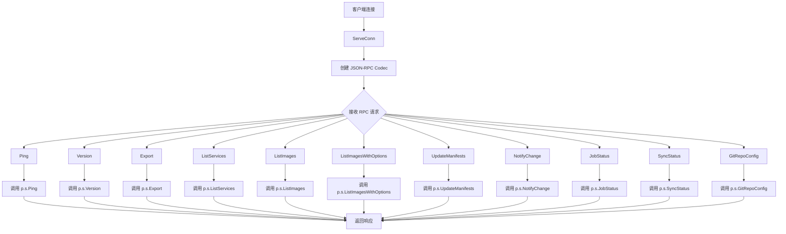

## 类结构

```
Server (RPC服务器主结构)
└── RPCServer (RPC处理程序包装器)
```

## 全局变量及字段


### `Server`
    
Encapsulates an rpc.Server to expose an API server over JSON‑RPC.

类型：`struct`
    


### `RPCServer`
    
Implements RPC service methods that delegate to an API server with a timeout.

类型：`struct`
    


### `ExportResponse`
    
Response struct for Export method containing raw result and optional application error.

类型：`struct`
    


### `ListServicesResponse`
    
Response struct for ListServices containing service statuses and optional error.

类型：`struct`
    


### `ListImagesResponse`
    
Response struct for ListImages containing image statuses and optional error.

类型：`struct`
    


### `UpdateManifestsResponse`
    
Response struct for UpdateManifests containing job ID and optional error.

类型：`struct`
    


### `NotifyChangeResponse`
    
Response struct for NotifyChange containing optional error.

类型：`struct`
    


### `JobStatusResponse`
    
Response struct for JobStatus containing job status and optional error.

类型：`struct`
    


### `SyncStatusResponse`
    
Response struct for SyncStatus containing sync state list and optional error.

类型：`struct`
    


### `GitRepoConfigResponse`
    
Response struct for GitRepoConfig containing git configuration and optional error.

类型：`struct`
    


### `Server.server`
    
Underlying rpc.Server that handles JSON‑RPC request dispatching.

类型：`*rpc.Server`
    


### `RPCServer.s`
    
Reference to the API server implementation handling business logic.

类型：`api.Server`
    


### `RPCServer.timeout`
    
Default timeout applied to each RPC call for context cancellation.

类型：`time.Duration`
    


### `ExportResponse.Result`
    
Byte slice containing the exported data.

类型：`[]byte`
    


### `ExportResponse.ApplicationError`
    
Optional application‑level error if the export failed.

类型：`*fluxerr.Error`
    


### `ListServicesResponse.Result`
    
Slice of ControllerStatus representing the status of each controller.

类型：`[]v6.ControllerStatus`
    


### `ListServicesResponse.ApplicationError`
    
Optional error indicating failure to list services.

类型：`*fluxerr.Error`
    


### `ListImagesResponse.Result`
    
Slice of ImageStatus representing the status of each image.

类型：`[]v6.ImageStatus`
    


### `ListImagesResponse.ApplicationError`
    
Optional error indicating failure to list images.

类型：`*fluxerr.Error`
    


### `UpdateManifestsResponse.Result`
    
Job ID generated by the update operation.

类型：`job.ID`
    


### `UpdateManifestsResponse.ApplicationError`
    
Optional error indicating failure to update manifests.

类型：`*fluxerr.Error`
    


### `NotifyChangeResponse.ApplicationError`
    
Optional error indicating failure to notify change.

类型：`*fluxerr.Error`
    


### `JobStatusResponse.Result`
    
Current status of the job.

类型：`job.Status`
    


### `JobStatusResponse.ApplicationError`
    
Optional error indicating failure to retrieve job status.

类型：`*fluxerr.Error`
    


### `SyncStatusResponse.Result`
    
List of synchronization statuses (e.g., commit references).

类型：`[]string`
    


### `SyncStatusResponse.ApplicationError`
    
Optional error indicating failure to retrieve sync status.

类型：`*fluxerr.Error`
    


### `GitRepoConfigResponse.Result`
    
Git repository configuration.

类型：`v6.GitConfig`
    


### `GitRepoConfigResponse.ApplicationError`
    
Optional error indicating failure to retrieve git config.

类型：`*fluxerr.Error`
    
    

## 全局函数及方法


### `NewServer`

创建一个新的RPC服务器实例，将底层API服务器封装为可通过RPC调用的服务。

参数：

- `s`：`api.Server`，底层API服务器实例，用于处理实际的业务逻辑
- `t`：`time.Duration`，请求超时时间，用于控制RPC调用的最大执行时间

返回值：`*Server, error`，返回RPC服务器实例指针，错误信息（注册失败时返回）

#### 流程图

```mermaid
flowchart TD
    A[开始 NewServer] --> B[rpc.NewServer 创建RPC服务器]
    B --> C[server.Register 注册RPCServer]
    C --> D{注册是否成功?}
    D -->|是| E[&Server{server} 包装为Server结构]
    D -->|否| F[return nil, err 返回错误]
    E --> G[return &Server{server}, nil 返回服务器实例]
    F --> G
```

#### 带注释源码

```go
// NewServer instantiates a new RPC server, handling requests on the
// conn by invoking methods on the underlying (assumed local) server.
// NewServer 实例化一个新的RPC服务器，通过在底层（假设为本地）服务器上
// 调用方法来处理连接上的请求
func NewServer(s api.Server, t time.Duration) (*Server, error) {
	// 使用 rpc.NewServer() 创建一个新的RPC服务器实例
	server := rpc.NewServer()
	
	// 将 RPCServer 结构体注册到RPC服务器中
	// RPCServer 包装了底层的 api.Server 和超时时间
	if err := server.Register(&RPCServer{s, t}); err != nil {
		// 如果注册失败，返回nil和错误信息
		return nil, err
	}
	
	// 注册成功，将 rpc.Server 包装进 Server 结构体并返回
	return &Server{server}, nil
}
```


### `NewServer`

创建一个新的RPC服务器实例，将底层API服务器封装为可通过RPC访问的服务。

参数：

- `s`：`api.Server`，底层API服务器实例，提供实际的业务逻辑处理
- `t`：`time.Duration`，RPC请求的超时时间，用于控制每个RPC调用的最大执行时间

返回值：`*Server`，返回封装后的RPC服务器实例；`error`，如果注册失败返回错误信息

#### 流程图

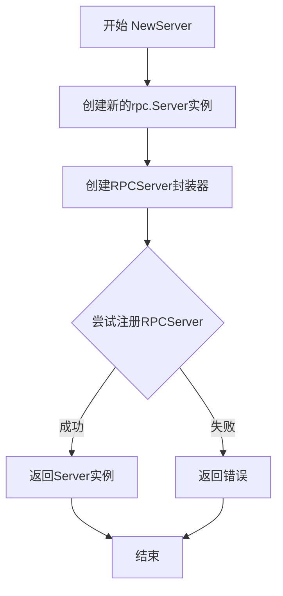

#### 带注释源码

```go
// NewServer instantiates a new RPC server, handling requests on the
// conn by invoking methods on the underlying (assumed local) server.
// NewServer 实例化一个新的RPC服务器，通过在底层（本地）服务器上
// 调用方法来处理连接上的请求
func NewServer(s api.Server, t time.Duration) (*Server, error) {
	// 使用rpc.NewServer创建一个新的RPC服务器实例
	server := rpc.NewServer()
	
	// 将传入的api.Server和超时时间封装到RPCServer结构中，
	// 并注册到rpc.Server中。如果注册失败（例如方法冲突），返回错误
	if err := server.Register(&RPCServer{s, t}); err != nil {
		return nil, err
	}
	
	// 创建并返回包含rpc.Server的Server包装实例
	return &Server{server}, nil
}
```


### Server.ServeConn

该方法是RPC服务器的核心连接处理方法，负责接收客户端的连接请求，并使用JSON-RPC编解码器为该连接提供服务，从而使客户端能够通过RPC调用服务器端API方法。

参数：
- conn：`io.ReadWriteCloser`，表示一个支持读取、写入和关闭操作的连接对象，客户端通过此连接与服务器进行通信

返回值：无（空），该方法不返回任何值，仅处理连接请求

#### 流程图

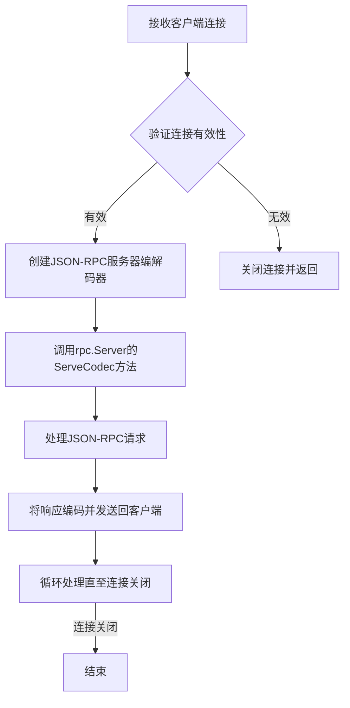

#### 带注释源码

```go
// ServeConn 接收一个连接并使用JSON-RPC协议为其提供服务
// 参数 conn 是一个实现了 io.ReadWriteCloser 接口的连接对象
// 该方法会阻塞，直到连接关闭为止
func (c *Server) ServeConn(conn io.ReadWriteCloser) {
    // 使用 jsonrpc.NewServerCodec 创建基于JSON的RPC编解码器
    // 并调用 rpc.Server 的 ServeCodec 方法来处理连接上的所有RPC请求
    c.server.ServeCodec(jsonrpc.NewServerCodec(conn))
}
```

---

## 扩展信息

### Server类详细信息

**类字段：**
- `server`：*rpc.Server，Go标准库的RPC服务器实例，负责管理RPC处理程序和连接

**类方法：**
- `ServeConn(conn io.ReadWriteCloser)`：处理客户端连接请求

### 关键组件信息

- **RPCServer**：内部封装了api.Server和超时时间，提供具体的RPC方法实现
- **jsonrpc**：使用JSON编码的RPC协议，比Gob编码更易于跨语言调用
- **Server.serveCodec**：负责编解码RPC请求和响应

### 潜在优化空间

1. **并发处理**：当前ServeConn方法为同步阻塞调用，如需支持多个并发连接，应考虑使用goroutine
2. **连接池**：可考虑实现连接池以复用资源
3. **超时控制**：ServeConn本身没有超时设置，可在连接层面添加读/写超时保护

### 设计目标与约束

- **目标**：将本地api.Server接口暴露为远程可调用的RPC服务
- **约束**：使用JSON-RPC 1.0协议进行通信
- **错误处理**：通过fluxerr.Error类型传递应用层错误，而非RPC错误


### `RPCServer.Ping`

该方法是 RPC 服务器的 Ping 接口实现，通过创建一个带超时的上下文来调用底层 API 服务器的 Ping 方法，用于检测服务是否可用。

参数：

- 第一个参数：`_`：`struct{}`，RPC 请求参数（未使用）
- 第二个参数：`_`：`struct{}`，RPC 响应参数（未使用）

返回值：`error`，如果底层服务调用成功则返回 nil，否则返回错误信息

#### 流程图

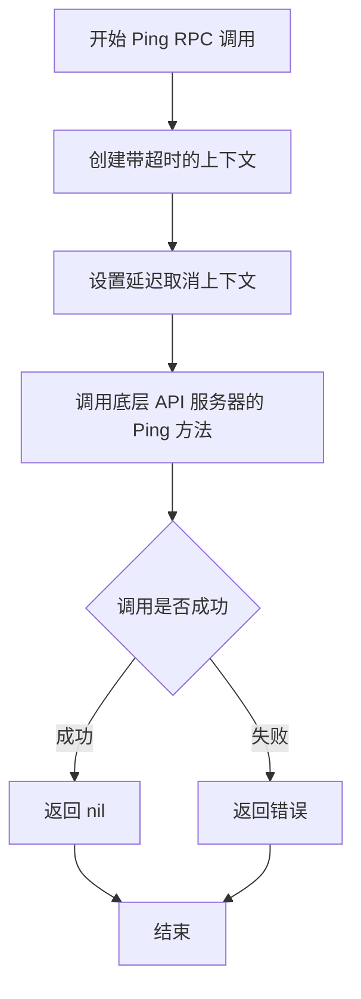

#### 带注释源码

```go
// Ping 实现 RPC 服务的 Ping 接口，用于健康检查
// 参数:
//   - 第一个参数: struct{} (RPC 请求参数，未使用占位符)
//   - 第二个参数: struct{} (RPC 响应参数，未使用占位符)
//
// 返回值:
//   - error: 如果底层服务调用成功则返回 nil，否则返回错误信息
func (p *RPCServer) Ping(_ struct{}, _ *struct{}) error {
	// 创建一个带超时的上下文，使用服务器配置的 timeout 时长
	ctx, cancel := context.WithTimeout(context.Background(), p.timeout)
	
	// 确保函数返回前取消上下文，释放资源
	defer cancel()
	
	// 调用底层 API 服务器的 Ping 方法并返回结果
	return p.s.Ping(ctx)
}
```


### `RPCServer.Version`

获取Flux API服务器的版本信息。该方法通过RPC调用底层API服务器的Version方法，并返回版本字符串。

参数：

- 第一个参数（匿名）：`struct{}`，RPC调用占位参数，未使用
- 第二个参数（resp）：`*string`，指向字符串的指针，用于返回版本信息

返回值：`error`，如果获取版本过程中发生错误，则返回错误对象；否则返回nil

#### 流程图

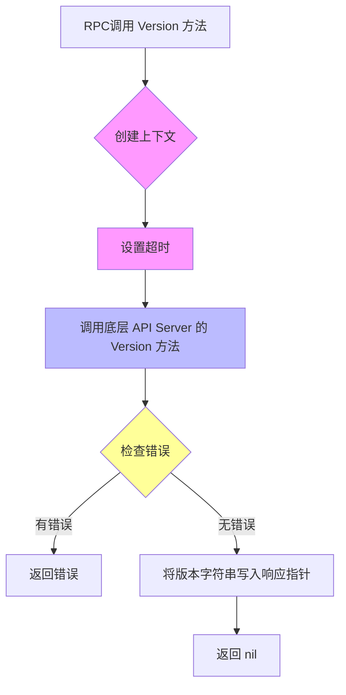

#### 带注释源码

```go
// Version 方法通过 RPC 获取底层 API 服务器的版本信息
// 参数说明：
//   - 第一个参数（struct{}）：RPC 调用的请求参数，此处未使用
//   - 第二个参数（*string）：用于返回版本字符串的指针
//
// 返回值：
//   - error：如果在获取版本过程中发生错误，则返回错误对象；否则返回 nil
func (p *RPCServer) Version(_ struct{}, resp *string) error {
	// 创建一个带有超时控制的上下文
	// 超时时间由 RPCServer 初始化时传入的 timeout 决定
	ctx, cancel := context.WithTimeout(context.Background(), p.timeout)
	
	// 确保在方法返回前取消上下文，释放相关资源
	defer cancel()
	
	// 调用底层 API Server 的 Version 方法获取版本信息
	v, err := p.s.Version(ctx)
	
	// 将获取到的版本字符串赋值给响应指针
	// 调用方可以通过该指针获取版本信息
	*resp = v
	
	// 返回调用底层方法时产生的错误
	// 如果没有错误，返回 nil
	return err
}
```


### `RPCServer.Export`

该方法是一个RPC端点，用于通过JSON-RPC协议从Flux API服务器导出集群配置数据。它创建一个带超时的上下文，调用底层API服务器的Export方法，并将结果或错误封装到ExportResponse结构体中返回给客户端。

参数：

- `_`：空结构体（RPC调用中省略的参数）
- `resp`：`*ExportResponse`，指向ExportResponse结构体的指针，用于返回导出结果或应用错误

返回值：`error`，如果执行成功返回nil，如果发生错误则返回相应的错误对象

#### 流程图

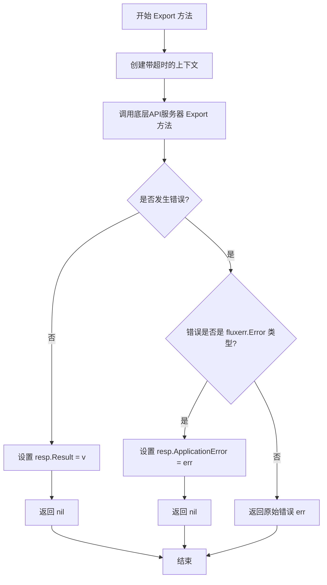

#### 带注释源码

```go
// Export 是RPCServer的导出方法，通过RPC接口暴露底层API服务器的Export功能
// 参数说明：
//   - 第一个参数为空结构体 struct{}，在JSON-RPC中表示无参数传递
//   - resp 为指向ExportResponse的指针，用于返回导出结果或应用级错误
func (p *RPCServer) Export(_ struct{}, resp *ExportResponse) error {
	// 创建一个带超时时间的上下文，用于控制底层API调用的执行时间
	// 超时时间在创建RPCServer时通过timeout字段指定
	ctx, cancel := context.WithTimeout(context.Background(), p.timeout)
	// 确保在方法返回前取消上下文，释放相关资源
	defer cancel()
	
	// 调用底层API服务器的Export方法，获取集群配置的导出数据
	// 返回值v为导出的字节数组，err为可能的错误
	v, err := p.s.Export(ctx)
	
	// 将导出的结果设置到响应结构体的Result字段
	resp.Result = v
	
	// 处理可能发生的错误
	if err != nil {
		// 使用errors.Cause获取原始错误，然后检查是否是应用级错误
		if err, ok := errors.Cause(err).(*fluxerr.Error); ok {
			// 如果是fluxerr.Error类型（应用级错误），将其封装到响应中
			// 返回nil表示RPC层面没有错误，错误信息通过ApplicationError传递
			resp.ApplicationError = err
			return nil
		}
	}
	
	// 如果是非应用级错误（通常是系统级错误），直接返回错误
	return err
}
```

#### 补充说明

**关键组件信息：**

- **ExportResponse**：包含导出结果的响应结构体，Result字段存储导出的字节数组，ApplicationError字段用于传递应用级错误
- **RPCServer**：包装api.Server的RPC服务器实现，将本地API方法通过JSON-RPC协议暴露给远程客户端
- **api.Server**：底层API服务器接口，Export方法从此获取集群配置数据

**技术债务与优化空间：**

1. 错误处理模式在多个RPC方法中重复出现，可以抽取为通用方法减少代码冗余
2. 所有RPC方法都使用相同的超时上下文创建逻辑，可以考虑封装辅助函数
3. Export方法返回[]byte，对于大型导出场景可能需要考虑流式传输或分块处理


### `RPCServer.ListServices`

该方法是 RPC 服务器的核心组件之一，负责将客户端的 `ListServices` 请求委托给底层的 `api.Server` 实现，并在超时控制下返回指定命名空间内的所有服务（Controller）状态列表，同时支持 Flux 特定的应用错误处理机制。

参数：

- `namespace`：`string`，目标命名空间，用于过滤需要列出服务的范围
- `resp`：`*ListServicesResponse`，指向响应结构的指针，用于承载返回的 `[]v6.ControllerStatus` 结果集及可能的 `ApplicationError`

返回值：`error`，如果方法执行过程中发生错误（包括超时错误和底层 API 错误），则返回对应的错误对象；如果是 Flux 应用级别的错误，则错误被封装在响应的 `ApplicationError` 字段中而方法本身返回 `nil`

#### 流程图

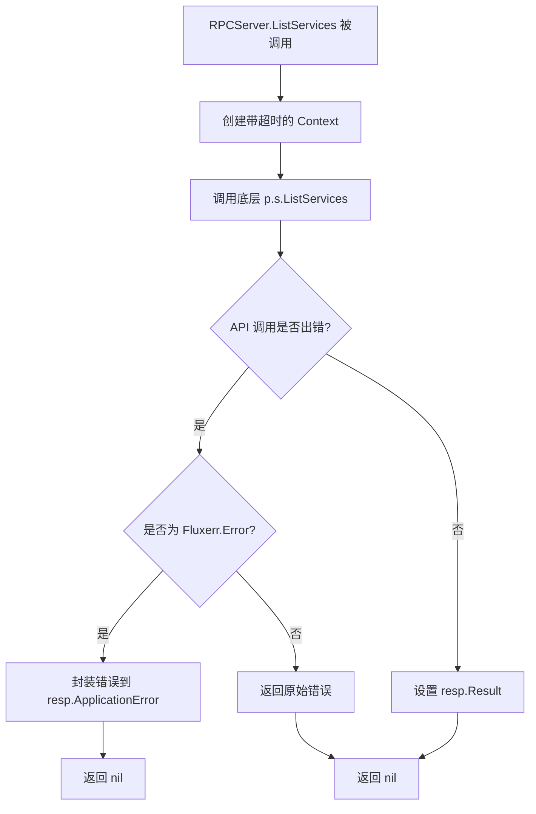

#### 带注释源码

```go
// ListServices 处理客户端的 ListServices RPC 调用
// 参数 namespace 指定目标命名空间
// 参数 resp 是响应结构指针，包含 Result 和 ApplicationError 两个字段
func (p *RPCServer) ListServices(namespace string, resp *ListServicesResponse) error {
    // 1. 创建带超时控制的上下文，用于防止底层 API 调用hang住
    ctx, cancel := context.WithTimeout(context.Background(), p.timeout)
    // 2. 确保方法返回前取消上下文，释放相关资源
    defer cancel()
    
    // 3. 调用底层 api.Server 的 ListServices 方法
    v, err := p.s.ListServices(ctx, namespace)
    
    // 4. 将成功获取的结果写入响应结构
    resp.Result = v
    
    // 5. 错误处理逻辑
    if err != nil {
        // 6. 使用 pkg/errors 提取错误根因
        if err, ok := errors.Cause(err).(*fluxerr.Error); ok {
            // 7. 如果是 Flux 应用级别错误，封装到 ApplicationError 字段
            //    这样 RPC 层可以序列化并返回给客户端，而方法本身返回 nil
            resp.ApplicationError = err
            return nil
        }
        // 8. 其他类型错误（如网络超时、权限问题等）直接向上传递
        return err
    }
    
    // 9. 成功执行，返回 nil
    return nil
}
```


### `RPCServer.ListImages`

该方法是一个 RPC 处理器，用于通过 RPC 接口获取指定资源的镜像列表信息。它接收一个资源规格作为查询条件，调用底层 API 服务器的 `ListImages` 方法，并将结果封装到响应结构体中返回给客户端，同时支持 Flux 特定的应用错误类型转换。

参数：

- `spec`：`update.ResourceSpec`，要查询镜像列表的资源规格定义
- `resp`：`*ListImagesResponse`，指向响应结构体的指针，用于返回查询结果或错误信息

返回值：`error`，如果执行过程中发生错误则返回错误信息，否则返回 nil

#### 流程图

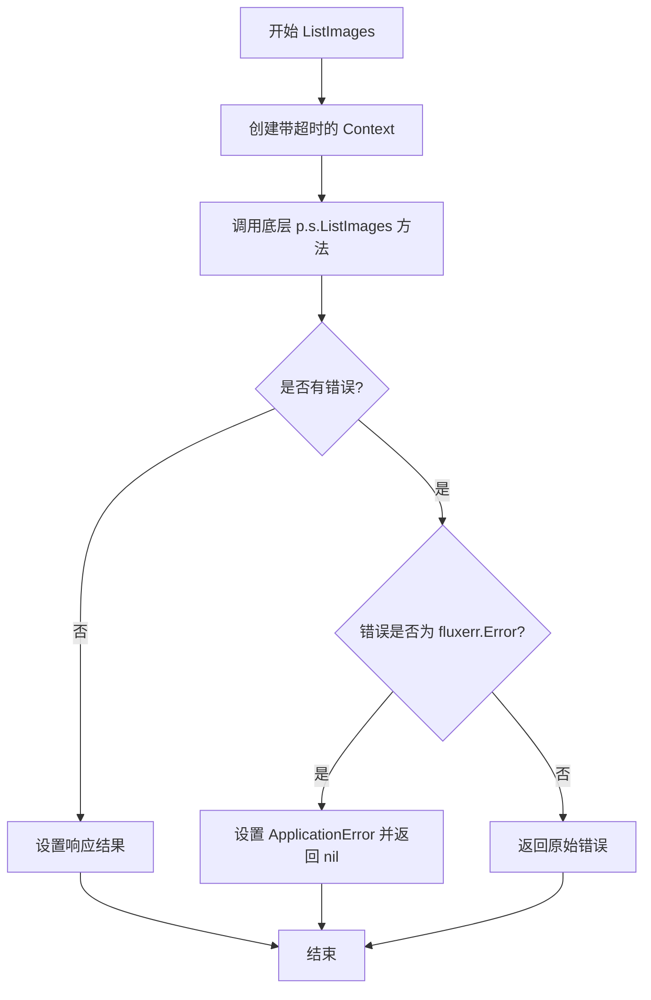

#### 带注释源码

```go
// ListImages 处理 RPC 请求，获取指定资源的镜像列表
// 参数 spec: update.ResourceSpec 类型，定义了要查询的资源
// 参数 resp: *ListImagesResponse 类型，通过该指针返回查询结果
func (p *RPCServer) ListImages(spec update.ResourceSpec, resp *ListImagesResponse) error {
	// 创建一个带有超时控制的上下文，用于整个请求的生命周期管理
	ctx, cancel := context.WithTimeout(context.Background(), p.timeout)
	// 确保在函数返回前取消上下文，释放相关资源
	defer cancel()
	
	// 调用底层 API 服务器的 ListImages 方法执行实际的业务逻辑
	v, err := p.s.ListImages(ctx, spec)
	
	// 将查询结果设置到响应结构体中
	resp.Result = v
	
	// 处理可能发生的错误
	if err != nil {
		// 使用 errors.Cause 获取原始错误类型
		// 检查是否为 Flux 特有的应用错误类型
		if err, ok := errors.Cause(err).(*fluxerr.Error); ok {
			// 如果是应用错误，设置到响应中并返回 nil（RPC 层面无错误）
			resp.ApplicationError = err
			return nil
		}
		// 非应用错误原样返回
		return err
	}
	
	// 无错误发生，正常返回
	return nil
}
```


### `RPCServer.ListImagesWithOptions`

该方法是 RPC 服务器的实现，用于将客户端的 `ListImagesWithOptions` 调用转发到底层 `api.Server` 实现，并处理返回的镜像状态列表或应用错误。它通过设置上下文超时来确保调用不会无限期挂起，并对特定的应用错误进行特殊处理。

参数：

- `opts`：`v10.ListImagesOptions`，用于指定列出镜像的选项（如命名空间、标签过滤器等）
- `resp`：`*ListImagesResponse`，指向响应结构的指针，用于返回镜像状态列表或应用错误信息

返回值：`error`，如果执行成功则返回 `nil`，如果发生底层错误则返回相应的错误信息

#### 流程图

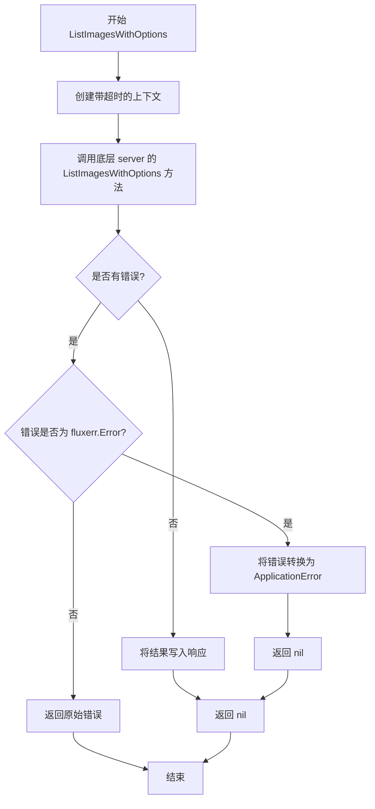

#### 带注释源码

```go
// ListImagesWithOptions 处理 ListImagesWithOptions RPC 调用，将请求转发到底层 API 服务器
// 参数：
//   - opts: v10.ListImagesOptions 类型，包含列出镜像时的选项配置
//   - resp: *ListImagesResponse 类型指针，用于返回结果或错误信息
//
// 返回值：
//   - error: 如果处理过程中出现错误则返回错误，否则返回 nil
func (p *RPCServer) ListImagesWithOptions(opts v10.ListImagesOptions, resp *ListImagesResponse) error {
	// 创建带有超时控制的上下文，防止请求无限期等待
	// 使用 RPCServer 实例的 timeout 字段作为超时时间
	ctx, cancel := context.WithTimeout(context.Background(), p.timeout)
	
	// 确保在函数返回前取消上下文，释放相关资源
	defer cancel()
	
	// 调用底层 api.Server 的 ListImagesWithOptions 方法执行实际业务逻辑
	// 传入上下文和选项参数，获取镜像状态列表或错误
	v, err := p.s.ListImagesWithOptions(ctx, opts)
	
	// 将成功获取的结果写入响应结构
	resp.Result = v
	
	// 检查是否发生错误
	if err != nil {
		// 使用 errors.Cause 获取原始错误，进行类型断言检查
		if err, ok := errors.Cause(err).(*fluxerr.Error); ok {
			// 如果是 fluxerr.Error 类型的应用错误，
			// 将其放入响应结构的 ApplicationError 字段
			// 并返回 nil，表示 RPC 调用本身成功（错误在应用层处理）
			resp.ApplicationError = err
			return nil
		}
		// 如果不是应用错误类型，则返回原始错误
		// 这通常表示底层系统级错误（如网络问题、超时等）
		return err
	}
	
	// 没有错误发生，返回 nil
	return nil
}
```


### RPCServer.UpdateManifests

该方法是 RPCServer 类型的成员方法，作为 RPC 服务端点接收客户端的更新清单请求。它将客户端传入的 update.Spec 规范通过底层 api.Server 实例执行，创建更新任务并返回对应的 job.ID，同时处理可能的应用层错误和通用错误。

参数：

- `spec`：`update.Spec`，客户端传递的更新规范，描述需要执行的更新操作（如自动化或手动同步）
- `resp`：`*UpdateManifestsResponse`，响应结构体指针，用于返回执行结果（job.ID）或应用层错误

返回值：`error`，如果执行过程中发生错误（包括超时、应用层 fluxerr.Error 或其他系统错误），则返回该错误；否则返回 nil

#### 流程图

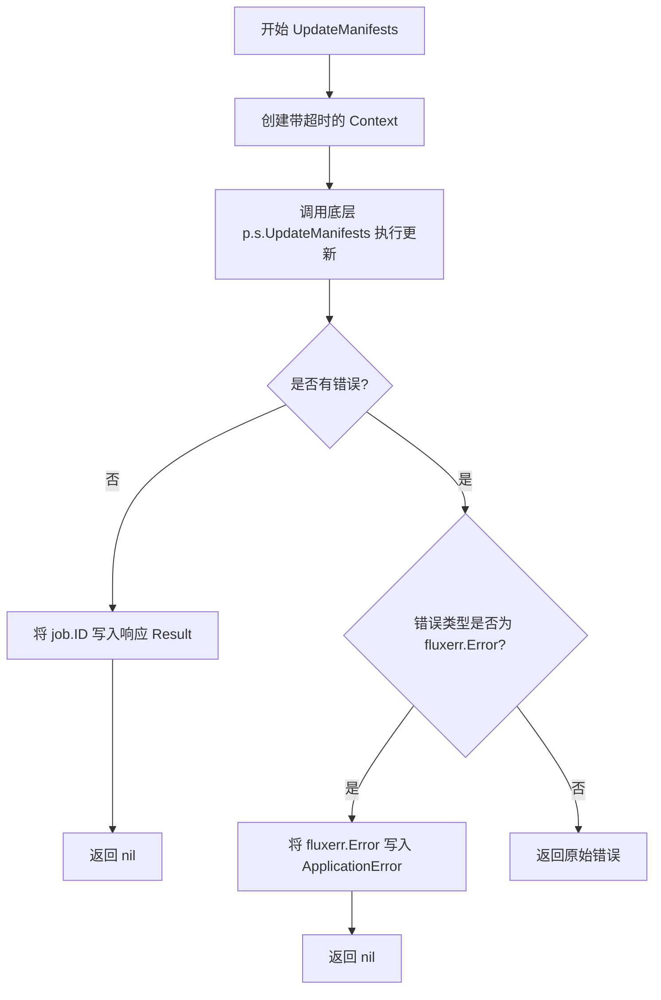

#### 带注释源码

```go
// UpdateManifests 处理客户端的更新清单请求
// 参数 spec 包含更新规范，resp 用于返回结果或错误信息
func (p *RPCServer) UpdateManifests(spec update.Spec, resp *UpdateManifestsResponse) error {
    // 创建带超时限制的上下文，防止底层操作无限阻塞
    ctx, cancel := context.WithTimeout(context.Background(), p.timeout)
    // 确保方法返回前取消上下文，释放资源
    defer cancel()
    
    // 调用底层 api.Server 的 UpdateManifests 方法执行实际更新逻辑
    v, err := p.s.UpdateManifests(ctx, spec)
    
    // 将返回的 job.ID 写入响应结构体
    resp.Result = v
    
    // 处理执行过程中产生的错误
    if err != nil {
        // 检查错误是否为应用层定义的 fluxerr.Error 类型
        if err, ok := errors.Cause(err).(*fluxerr.Error); ok {
            // 若是应用层错误，填充 ApplicationError 字段并返回 nil
            // 这样错误信息可通过 RPC 传递给客户端
            resp.ApplicationError = err
            return nil
        }
        // 非应用层错误，直接返回原始错误
        return err
    }
    
    // 执行成功，返回 nil
    return nil
}
```


### `RPCServer.NotifyChange`

该方法是一个 RPC 包装器，用于将变更通知传递给底层的 API 服务器。它接收一个 v9.Change 对象，创建一个带超时的上下文，调用底层服务的 NotifyChange 方法，并处理可能的应用程序错误。

参数：

- `c`：`v9.Change`，表示要通知的变更对象，包含变更的详细信息
- `resp`：`*NotifyChangeResponse`，指向响应结构体的指针，用于返回操作结果或应用程序错误

返回值：`error`，如果执行过程中发生错误则返回错误信息，否则返回 nil

#### 流程图

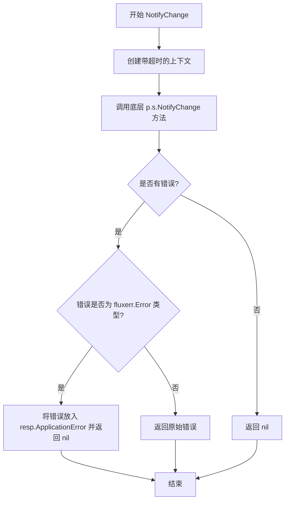

#### 带注释源码

```go
// NotifyChange 处理来自 RPC 客户端的变更通知请求
// 参数 c: v9.Change 类型，表示需要通知的变更内容
// 参数 resp: *NotifyChangeResponse 类型，用于返回处理结果或应用程序错误
func (p *RPCServer) NotifyChange(c v9.Change, resp *NotifyChangeResponse) error {
	// 创建一个带有超时限制的上下文，防止底层操作无限期阻塞
	ctx, cancel := context.WithTimeout(context.Background(), p.timeout)
	// 确保在函数返回前释放上下文资源
	defer cancel()
	
	// 调用底层 API 服务器的 NotifyChange 方法执行实际的变更通知
	err := p.s.NotifyChange(ctx, c)
	
	// 检查是否发生了错误
	if err != nil {
		// 使用 errors.Cause 获取原始错误，判断是否为 flux 特定的错误类型
		if err, ok := errors.Cause(err).(*fluxerr.Error); ok {
			// 如果是 flux 应用程序错误，将其放入响应结构体并返回 nil
			// 这样 RPC 层可以正确序列化错误信息传递给客户端
			resp.ApplicationError = err
			return nil
		}
	}
	// 如果不是 flux 特定的应用程序错误，直接返回原始错误
	return err
}
```


### `RPCServer.JobStatus`

该方法实现了 RPC 服务的 `JobStatus` 接口，用于接收客户端查询特定 Job 状态的请求。它通过创建一个带超时控制的上下文，调用内部 `api.Server` 获取 Job 的执行状态，并将结果或应用层错误封装到 RPC 响应结构体中返回。

参数：
- `jobID`：`job.ID`，要查询状态的 Job 的唯一标识符。
- `resp`：`*JobStatusResponse`，指向响应结构体的指针，用于存放查询结果或错误信息。

返回值：`error`，如果 RPC 通信过程中发生底层错误（如网络超时、序列化错误），则直接返回该错误；若请求被成功处理（无论业务结果如何），则返回 `nil`，调用方需检查响应体中的字段。

#### 流程图

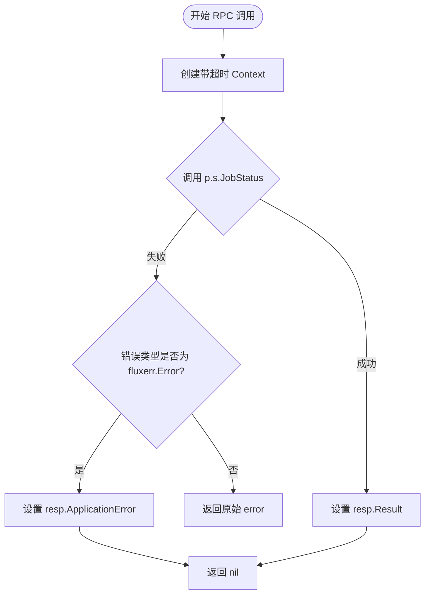

#### 带注释源码

```go
// JobStatus 是 RPCServer 上的一个方法，用于获取指定 Job 的状态。
// 参数 jobID: 要查询的 Job 的 ID。
// 参数 resp: 指向 JobStatusResponse 的指针，用于返回结果或错误。
func (p *RPCServer) JobStatus(jobID job.ID, resp *JobStatusResponse) error {
	// 1. 创建一个带有超时限制的上下文，用于控制底层 API 调用的时间
	ctx, cancel := context.WithTimeout(context.Background(), p.timeout)
	// 2. 确保在函数返回前取消上下文，释放资源
	defer cancel()
	
	// 3. 调用内部 API Server 的 JobStatus 方法获取 Job 状态
	//    v 是 job.Status 类型，err 是 error 类型
	v, err := p.s.JobStatus(ctx, jobID)
	
	// 4. 将获取到的结果赋值给响应结构体的 Result 字段
	resp.Result = v
	
	// 5. 错误处理逻辑
	if err != nil {
		// 使用 pkg/errors 检查错误的根本原因
		if err, ok := errors.Cause(err).(*fluxerr.Error); ok {
			// 如果是应用层定义的错误（fluxerr.Error），则将其放入响应体中
			// 并返回 nil，这样 RPC 不会将错误作为传输层错误处理，
			// 而是让客户端能解析响应体中的 ApplicationError
			resp.ApplicationError = err
			return nil
		}
		// 如果是底层系统错误（如网络不通），则直接向上返回
		return err
	}
	
	// 6. 操作成功，返回 nil
	return nil
}
```


### `RPCServer.SyncStatus`

该方法是 RPC 服务器的同步状态查询方法，接收一个 git 引用参数，通过底层 api.Server 获取该引用对应的同步状态，并将结果封装到响应结构体中返回，同时处理可能的业务错误。

参数：

- `ref`：`string`，要查询同步状态的 Git 引用（如分支名或标签名）
- `resp`：`*SyncStatusResponse`，指向响应结构体的指针，用于返回查询结果或应用错误

返回值：`error`，如果执行过程中发生错误则返回错误，否则返回 nil

#### 流程图

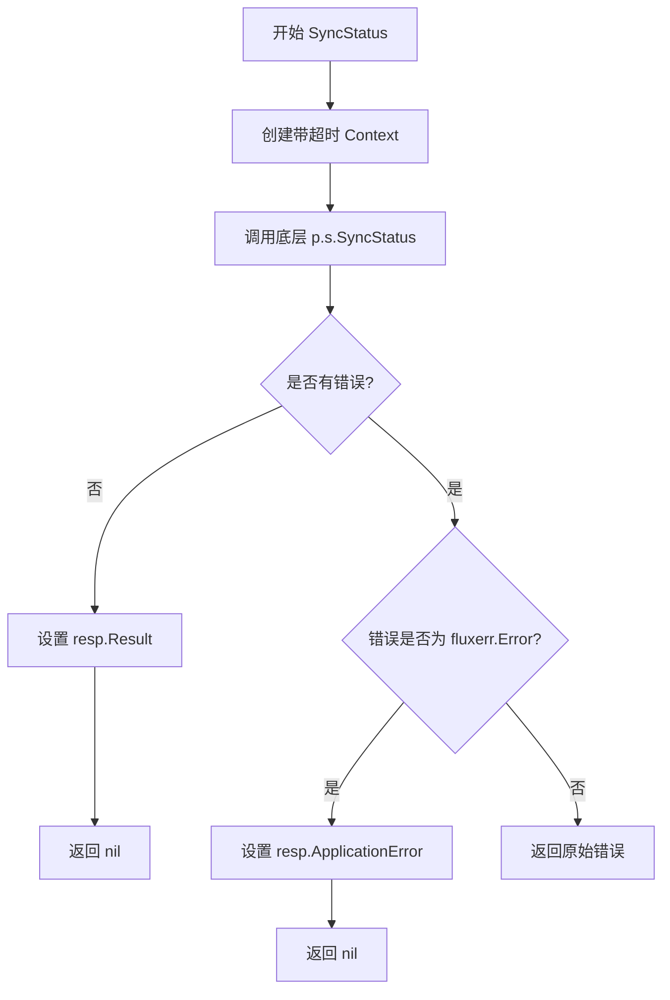

#### 带注释源码

```go
// SyncStatus 通过 RPC 接收 Git 引用，查询其同步状态
// ref: Git 引用（如 "master", "main", 或提交哈希）
// resp: 响应结构体指针，用于返回结果或错误信息
func (p *RPCServer) SyncStatus(ref string, resp *SyncStatusResponse) error {
    // 1. 创建带有超时控制的上下文
    // 使用 RPCServer 实例的 timeout 配置，防止底层调用无限阻塞
    ctx, cancel := context.WithTimeout(context.Background(), p.timeout)
    // 2. 确保函数返回前取消上下文，释放相关资源
    defer cancel()
    
    // 3. 调用底层 api.Server 的 SyncStatus 方法
    // 将 RPC 层的 ref 参数传递给业务逻辑层
    v, err := p.s.SyncStatus(ctx, ref)
    
    // 4. 将查询结果写入响应结构体
    resp.Result = v
    
    // 5. 错误处理
    // 如果发生错误，检查是否为业务层定义的 fluxerr.Error
    if err != nil {
        // 使用 errors.Cause 获取根本错误原因
        if err, ok := errors.Cause(err).(*fluxerr.Error); ok {
            // 如果是业务错误，封装到 ApplicationError 字段
            // 返回 nil 表示 RPC 层无系统错误，业务错误通过响应体传递
            resp.ApplicationError = err
            return nil
        }
        // 非业务错误（系统错误），直接向上传递
        return err
    }
    
    // 6. 无错误情况，返回 nil
    return nil
}
```


### `RPCServer.GitRepoConfig`

该方法是 RPCServer 类型的成员方法，用于通过 RPC 协议获取或重新生成 Git 仓库配置。它接收一个布尔参数 `regenerate` 决定是否重新生成配置，然后调用底层 api.Server 的 GitRepoConfig 方法，最后将结果封装到 GitRepoConfigResponse 响应结构体中返回给客户端。

参数：

- `regenerate`：`bool`，表示是否需要重新生成 Git 仓库配置，true 表示重新生成，false 表示获取现有配置
- `resp`：`*GitRepoConfigResponse`，指向响应结构体的指针，用于存放返回的 Git 配置结果和可能的应用层错误

返回值：`error`，如果执行过程中发生错误则返回错误信息，如果错误类型为 `fluxerr.Error` 则会封装在响应结构的 ApplicationError 字段中而返回 nil

#### 流程图

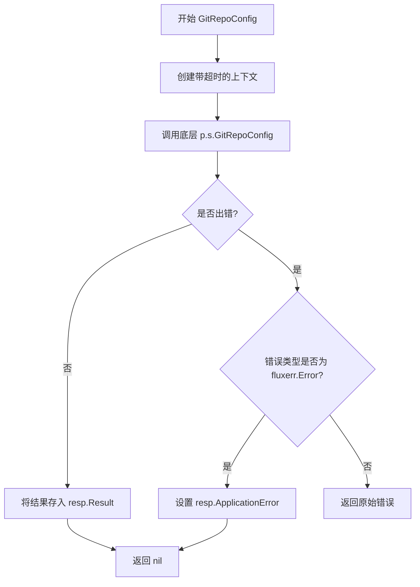

#### 带注释源码

```go
// GitRepoConfig 处理获取或重新生成 Git 仓库配置的 RPC 请求
// regenerate 参数指示是否需要重新生成配置
// resp 参数用于返回 Git 配置结果或应用层错误
func (p *RPCServer) GitRepoConfig(regenerate bool, resp *GitRepoConfigResponse) error {
	// 创建一个带有超时机制的上下文，防止请求无限期阻塞
	ctx, cancel := context.WithTimeout(context.Background(), p.timeout)
	// 确保函数返回时取消上下文，释放相关资源
	defer cancel()
	
	// 调用底层 api.Server 的 GitRepoConfig 方法获取 Git 配置
	v, err := p.s.GitRepoConfig(ctx, regenerate)
	
	// 将获取到的 Git 配置结果存入响应结构体的 Result 字段
	resp.Result = v
	
	// 检查是否发生了错误
	if err != nil {
		// 使用 errors.Cause 获取原始错误，判断是否为 Flux 自定义的应用层错误
		if err, ok := errors.Cause(err).(*fluxerr.Error); ok {
			// 如果是应用层错误，将其封装到响应结构体中
			resp.ApplicationError = err
			// 返回 nil 表示 RPC 层面执行成功，错误信息通过响应体传递
			return nil
		}
		// 如果不是应用层错误，则返回原始错误（可能是系统级错误）
		return err
	}
	
	// 无错误发生，返回 nil
	return err
}
```

## 关键组件


### Server 结构体

RPC服务器的主包装器，包含底层的rpc.Server实例，负责接收连接并分发RPC请求。

### RPCServer 结构体

实际处理RPC调用的核心结构体，封装了api.Server接口和请求超时配置，每个RPC方法都委托给内部的api.Server执行。

### NewServer 构造函数

创建并初始化RPC服务器，将本地api.Server注册为RPC服务，返回配置好的Server实例或注册错误。

### ServeConn 方法

接收客户端连接，使用JSON-RPC编解码器处理请求，实现io.ReadWriteCloser接口以支持RPC连接管理。

### Ping 方法

健康检查RPC端点，通过底层api.Server验证服务可用性，带超时保护。

### Version 方法

返回Flux API的版本信息，供客户端确定兼容性和功能支持。

### Export 方法

导出完整的集群配置状态，将结果序列化为字节数组，支持应用级错误传递。

### ListServices 方法

列出指定命名空间下的所有服务及其控制器状态，返回v6.ControllerStatus数组。

### ListImages 方法

根据资源规格查询镜像状态，支持单资源粒度的镜像列表查询。

### ListImagesWithOptions 方法

带选项的镜像列表查询，支持更丰富的过滤和排序参数，基于v10版本API。

### UpdateManifests 方法

触发配置更新操作，返回更新任务的job.ID，用于后续状态跟踪。

### NotifyChange 方法

通知Flux配置变更事件，用于外部系统触发同步流程。

### JobStatus 方法

查询指定任务的执行状态，返回job.Status供客户端轮询进度。

### SyncStatus 方法

查询Git仓库同步状态，返回引用列表表示当前同步进度。

### GitRepoConfig 方法

获取或刷新Git仓库配置，支持配置重建选项。

### 超时管理机制

每个RPC方法都使用context.WithTimeout实现请求级超时控制，防止单个请求阻塞服务端。

### 错误传播机制

使用fluxerr.Error进行应用级错误封装，通过ApplicationError字段在RPC层传递业务错误而非仅网络错误。


## 问题及建议


### 已知问题

- **错误处理模式不一致**：部分方法（如 `Export`、`ListServices` 等）在检测到 `fluxerr.Error` 时返回 `nil` 错误但设置 `ApplicationError`，而其他情况下直接返回原始错误，导致调用方难以统一处理 RPC 错误。
- **超时配置缺乏灵活性**：所有 RPC 方法共用同一个 `timeout` 值，无法针对不同操作（如 `Export` 可能耗时较长）设置差异化的超时时间，可能导致长操作被意外中断或短操作占用过多资源。
- **缺少输入参数验证**：RPC 方法直接使用传入的参数（如 `namespace`、`spec`、`jobID` 等）调用底层 API，未进行有效性校验，可能将非法输入传递到核心业务逻辑。
- **版本强耦合**：代码直接依赖 `v6`、`v9`、`v10` 版本的 API 接口，版本升级时需要同步修改此文件，增加了维护成本和升级风险。
- **无连接复用机制**：`ServeConn` 每次调用都创建新的 JSON-RPC codec，未实现连接池或会话复用，可能影响高并发场景下的性能。
- **缺少日志与监控**：代码中无任何日志记录，无法追踪 RPC 调用失败原因或进行性能监控，生产环境调试困难。
- **无优雅关闭支持**：`Server` 缺少停止方法，无法实现服务平滑关闭，可能导致进行中的请求被强制终止。

### 优化建议

- **统一错误处理策略**：建立一致的错误转换逻辑，将所有业务错误通过 `ApplicationError` 返回，RPC 层仅返回编解码错误，提高调用方错误处理的一致性。
- **支持操作级超时**：在 `RPCServer` 中为不同方法配置不同的超时时间，或允许调用方通过请求参数指定超时，满足不同业务场景需求。
- **增加参数校验**：在每个 RPC 方法入口处添加参数校验逻辑，提前拦截非法输入，返回结构化的验证错误。
- **抽象版本依赖**：通过接口抽象化 API 版本差异，采用依赖注入方式解耦具体版本实现，降低版本升级影响。
- **引入日志库**：在关键路径（方法入口、错误返回）添加日志记录，便于问题排查和性能分析。
- **实现优雅关闭**：为 `Server` 添加 `Shutdown` 方法，支持等待活跃请求完成后关闭服务。

## 其它


### 设计目标与约束

本RPC服务器的设计目标是提供一个轻量级的RPC封装层，将fluxcd/flux的API服务器（api.Server）通过JSON-RPC协议暴露给远程客户端，实现远程过程调用能力。设计约束包括：1）使用JSON-RPC作为传输协议，便于跨语言调用；2）通过全局超时机制（timeout）控制所有RPC方法的执行时间，防止资源泄漏；3）每个RPC方法内部创建带超时的context，确保请求级别的超时控制；4）错误处理采用应用级错误（fluxerr.Error）和RPC错误分离的机制，ApplicationError字段用于传递业务逻辑错误。

### 错误处理与异常设计

错误处理采用分层设计：
1. **RPC层错误**：通过Go的rpc框架返回，如方法不存在、编解码错误等
2. **业务层错误**：通过ApplicationError字段传递fluxerr.Error类型的错误，包含错误码和错误信息
3. **超时错误**：通过context.WithTimeout实现，每个方法都有独立的超时控制
错误传播链路：底层API服务返回error → 检查是否为fluxerr.Error类型 → 如果是则填充ApplicationError字段并返回nil（避免RPC层错误） → 否则直接返回原始error。异常情况包括：连接中断、超时、API服务不可用等。

### 数据流与状态机

**数据输入流**：客户端通过JSON-RPC请求 → jsonrpc.ServerCodec解码 → RPCServer方法接收参数 → 创建带超时的context → 调用底层api.Server对应方法 → 获取结果。

**数据输出流**：底层api.Server返回结果 → 填充Response结构体的Result字段 → 如果有错误则处理ApplicationError → JSON-RPC响应返回客户端。

**状态机**：RPCServer无持久状态，每个请求独立处理，状态转换由context管理（context.Background() → context.WithTimeout → context取消）。

### 外部依赖与接口契约

**外部依赖**：
- `net/rpc`：Go标准库RPC框架
- `net/rpc/jsonrpc`：JSON-RPC编解码器
- `github.com/fluxcd/flux/pkg/api`：API服务器接口定义
- `github.com/fluxcd/flux/pkg/api/v6/v9/v10`：不同版本的API定义
- `github.com/fluxcd/flux/pkg/errors`：fluxerr错误类型
- `github.com/fluxcd/flux/pkg/job`：任务相关类型
- `github.com/fluxcd/flux/pkg/update`：更新相关类型
- `github.com/pkg/errors`：错误溯源库

**接口契约**：
- api.Server接口：需要实现Ping、Version、Export、ListServices、ListImages、ListImagesWithOptions、UpdateManifests、NotifyChange、JobStatus、SyncStatus、GitRepoConfig等方法
- RPCServer方法签名遵循Go RPC规范：func (p *RPCServer) MethodName(argsType, replyType) error

### 并发与线程安全性

RPCServer本身是并发安全的，因为：
1. 每个RPC调用通过独立的goroutine处理
2. RPCServer不保存请求间的共享状态
3. api.Server接口的实现应该是线程安全的（由底层实现保证）
4. timeout字段只在初始化时设置，读操作安全
潜在的并发问题：底层api.Server的非线程安全实现可能导致竞态条件。

### 性能考虑与优化空间

当前实现的性能特征：
1. 每个请求都创建新的context和cancel函数，有一定开销
2. 错误处理中的errors.Cause遍历错误链，有一定开销
3. 响应结构体每次请求都需要分配内存

优化建议：
1. 可考虑使用sync.Pool复用Response对象减少GC压力
2. 可将timeout作为参数而非字段，允许客户端自定义超时
3. 可添加连接池或请求队列机制应对高并发场景
4. 可添加metrics监控RPC调用成功率和延迟

### 安全考量

当前安全措施：
1. 通过timeout防止长时间运行的请求消耗资源
2. 依赖底层api.Server的认证授权机制（通过context传递）

安全建议：
1. 缺少TLS支持，敏感场景需在传输层加密
2. 缺少请求大小限制，可能受到恶意大请求攻击
3. 缺少限流机制，可能受到DDoS攻击
4. 缺少身份验证和授权机制

### 测试策略建议

测试覆盖建议：
1. 单元测试：每个RPC方法的基本功能测试
2. 集成测试：与真实api.Server实现的端到端测试
3. 超时测试：验证timeout机制正确生效
4. 错误传播测试：验证各类错误正确转换为ApplicationError
5. 并发测试：验证高并发下无数据竞争
6. 边界条件测试：空参数、nil返回值、大数据量等场景

### 版本兼容性

代码引用了v6、v9、v10三个版本的API：
- v6：ControllerStatus、ImageStatus、GitConfig
- v9：Change
- v10：ListImagesOptions

这种多版本支持体现了向后兼容性设计，允许客户端使用不同版本的API功能。

    