# `flux\pkg\resource\id.go` 详细设计文档

该文件实现了一个资源标识符（Resource ID）管理系统，支持解析和操作两种格式的资源ID：旧格式（namespace/service）和新格式（namespace:kind/name），并提供了ID集合的常见操作如交集、并集、差集等。

## 整体流程

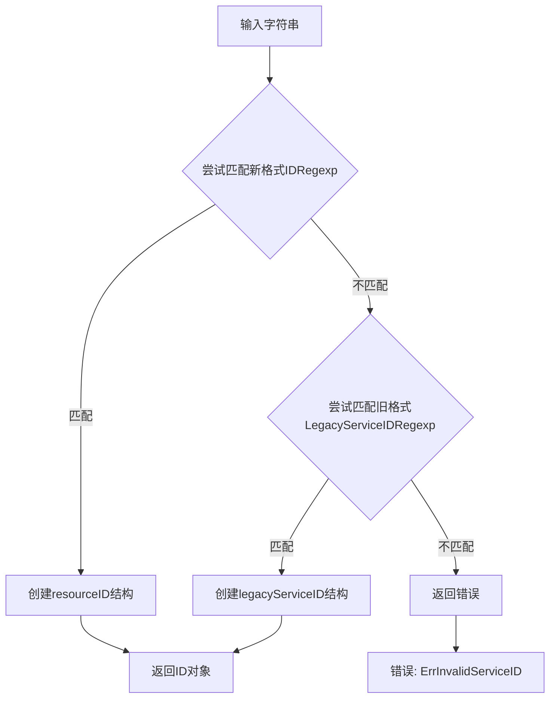

## 类结构

```
ID (外层包装类型)
├── resourceIDImpl (接口)
├── legacyServiceID (旧格式实现)
├── resourceID (新格式实现)
IDSet (map[ID]struct{} 集合类型)
IDs ([]ID 切片类型)
```

## 全局变量及字段


### `ErrInvalidServiceID`
    
Error returned when a service ID format is invalid

类型：`error`
    


### `LegacyServiceIDRegexp`
    
Regex pattern for matching legacy namespace/service format (namespace/service)

类型：`*regexp.Regexp`
    


### `IDRegexp`
    
Regex pattern for matching fully qualified namespace:kind/name format

类型：`*regexp.Regexp`
    


### `UnqualifiedIDRegexp`
    
Regex pattern for matching unqualified kind/name format without namespace

类型：`*regexp.Regexp`
    


### `ID.resourceIDImpl`
    
The underlying implementation type for ID, providing String() method

类型：`resourceIDImpl (interface)`
    


### `resourceID.namespace`
    
The namespace component in the new ID format (namespace:kind/name)

类型：`string`
    


### `resourceID.kind`
    
The kind/component type in the new ID format (namespace:kind/name)

类型：`string`
    


### `resourceID.name`
    
The name component in the new ID format (namespace:kind/name)

类型：`string`
    


### `legacyServiceID.namespace`
    
The namespace component in legacy format (namespace/service)

类型：`string`
    


### `legacyServiceID.service`
    
The service name in legacy format (namespace/service)

类型：`string`
    
    

## 全局函数及方法


### `ParseID`

该函数用于将字符串形式的资源标识符解析为结构化的 `ID` 类型，支持新的命名空间:种类/名称格式以及旧式的命名空间/服务名称格式，解析失败时返回错误。

参数：

- `s`：`string`，要解析的资源标识符字符串

返回值：`ID, error`，成功时返回包含解析后资源的 ID 对象及其底层实现，失败时返回空 ID 和包含具体错误信息的错误对象。

#### 流程图

```mermaid
flowchart TD
    A[开始 ParseID] --> B{使用 IDRegexp 匹配字符串 s}
    B -->|匹配成功| C[提取 m[1]=namespace, m[2]=kind, m[3]=name]
    C --> D[创建 resourceID{namespace, strings.ToLower(kind), name}]
    D --> E[返回 ID{resourceID}]
    B -->|匹配失败| F{使用 LegacyServiceIDRegexp 匹配}
    F -->|匹配成功| G[提取 m[1]=namespace, m[2]=service]
    G --> H[创建 legacyServiceID{namespace, service}]
    H --> E
    F -->|匹配失败| I[返回 ID{}, errors.Wrap]
    E --> J[结束]
    I --> J
```

#### 带注释源码

```go
// ParseID constructs a ID from a string representation
// if possible, returning an error value otherwise.
func ParseID(s string) (ID, error) {
	// 首先尝试使用新的命名空间:种类/名称格式进行匹配
	// 格式: (<cluster>|[a-zA-Z0-9_-]+):([a-zA-Z0-9_-]+)/([a-zA-Z0-9_.:-]+)
	if m := IDRegexp.FindStringSubmatch(s); m != nil {
		// 匹配成功，创建新的 resourceID 结构
		// m[1] 是 namespace 或 <cluster>，m[2] 是 kind，m[3] 是 name
		// kind 会被转换为小写以保持一致性
		return ID{resourceID{m[1], strings.ToLower(m[2]), m[3]}}, nil
	}
	
	// 如果新格式不匹配，尝试旧式的 namespace/service 格式
	// 格式: ([a-zA-Z0-9_-]+)/([a-zA-Z0-9_-]+)
	if m := LegacyServiceIDRegexp.FindStringSubmatch(s); m != nil {
		// 匹配成功，创建遗留的 legacyServiceID 结构
		return ID{legacyServiceID{m[1], m[2]}}, nil
	}
	
	// 两种格式都无法匹配，返回无效的错误
	return ID{}, errors.Wrap(ErrInvalidServiceID, "parsing "+s)
}
```


### `MustParseID`

该函数是 `ParseID` 的强制版本，接受一个字符串参数并尝试将其解析为资源 ID 类型。如果解析成功，返回解析后的 ID；如果解析失败，则触发 panic。这是用于确信输入格式必定正确的场景的便捷包装器。

参数：

- `s`：`string`，要解析的资源 ID 字符串表示

返回值：`ID`，解析成功后的资源 ID 类型；如果格式无效则触发 panic

#### 流程图

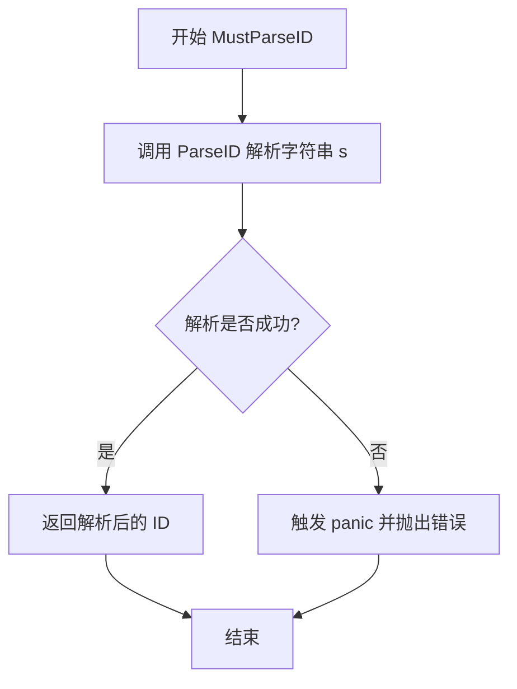

#### 带注释源码

```go
// MustParseID constructs a ID from a string representation,
// panicing if the format is invalid.
func MustParseID(s string) ID {
    // 调用 ParseID 函数尝试解析字符串 s
    id, err := ParseID(s)
    // 检查解析过程中是否产生错误
    if err != nil {
        // 如果解析失败，触发 panic 中断程序
        panic(err)
    }
    // 解析成功，返回解析后的 ID 对象
    return id
}
```


### `ParseIDOptionalNamespace`

该函数用于将字符串解析为资源 ID，支持两种格式：完全限定格式（包含命名空间、类型和名称）或非限定格式（仅包含类型和名称，需要结合提供的命名空间）。它首先尝试匹配完全限定格式，如果失败则尝试匹配非限定格式并使用提供的命名空间，若两者都失败则返回错误。

参数：

- `namespace`：`string`，当输入字符串为非限定格式时使用的命名空间
- `s`：`string`，待解析的资源 ID 字符串，支持完全限定格式 `<namespace>:<kind>/<name>` 或非限定格式 `<kind>/<name>`

返回值：`ID, error`，成功时返回解析后的资源 ID 对象，失败时返回空的 ID 和包含错误信息的 error

#### 流程图

```mermaid
flowchart TD
    A[开始 ParseIDOptionalNamespace] --> B{使用 IDRegexp 匹配字符串 s}
    B -->|匹配成功| C[提取 m[1]=namespace, m[2]=kind, m[3]=name]
    C --> D[创建 resourceID 并转换为 ID 返回]
    B -->|匹配失败| E{使用 UnqualifiedIDRegexp 匹配字符串 s}
    E -->|匹配成功| F[提取 m[1]=kind, m[2]=name]
    F --> G[使用参数 namespace 作为命名空间]
    G --> H[创建 resourceID 并转换为 ID 返回]
    E -->|匹配失败| I[返回空 ID 和错误]
    D --> J[结束]
    H --> J
    I --> J
```

#### 带注释源码

```go
// ParseIDOptionalNamespace constructs a ID from either a fully
// qualified string representation, or an unqualified kind/name representation
// and the supplied namespace.
// 解析ID可选命名空间：从完全限定的字符串表示形式或非限定的 kind/name 表示形式
// 和提供的命名空间构造 ID
func ParseIDOptionalNamespace(namespace, s string) (ID, error) {
	// 首先尝试匹配完全限定的 ID 格式
	// 格式：(<cluster>|[a-zA-Z0-9_-]+):([a-zA-Z0-9_-]+)/([a-zA-Z0-9_.:-]+)
	// 例如：default:deployment/my-app 或 <cluster>:service/my-service
	if m := IDRegexp.FindStringSubmatch(s); m != nil {
		// m[1] 是命名空间或 <cluster>，m[2] 是 kind，m[3] 是 name
		// 将 kind 转换为小写，返回包含 resourceID 实现的 ID
		return ID{resourceID{m[1], strings.ToLower(m[2]), m[3]}}, nil
	}
	
	// 如果完全限定格式匹配失败，尝试匹配非限定格式
	// 格式：([a-zA-Z0-9_-]+)/([a-zA-Z0-9_.:-]+)
	// 例如：deployment/my-app
	if m := UnqualifiedIDRegexp.FindStringSubmatch(s); m != nil {
		// m[1] 是 kind，m[2] 是 name
		// 使用传入的 namespace 参数作为命名空间，kind 转为小写
		return ID{resourceID{namespace, strings.ToLower(m[1]), m[2]}}, nil
	}
	
	// 两种格式都无法匹配，返回错误
	return ID{}, errors.Wrap(ErrInvalidServiceID, "parsing "+s)
}
```


### MakeID

构造一个由命名空间（namespace）、种类（kind）和名称（name）组成的资源 ID。

参数：

- `namespace`：`string`，命名空间组件，标识资源所属的集群或命名空间
- `kind`：`string`，种类组件，标识资源的类型（如 deployment、service 等）
- `name`：`string`，名称组件，标识资源的具体名称

返回值：`ID`，返回构造完成的资源标识符

#### 流程图

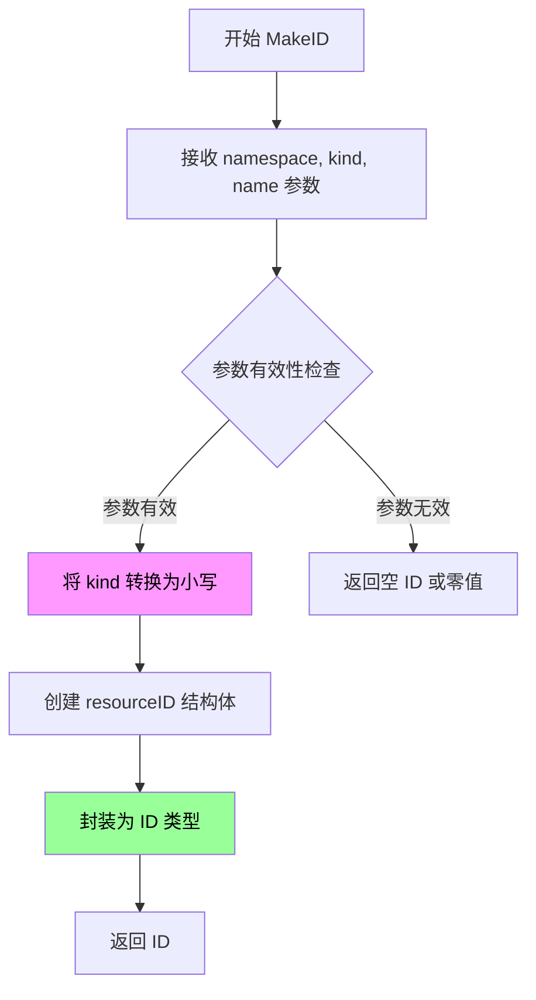

#### 带注释源码

```go
// MakeID constructs a ID from constituent components.
// MakeID 从指定的命名空间、种类和名称组件构造一个资源 ID
func MakeID(namespace, kind, name string) ID {
    // 使用 resourceID 内部结构体创建 ID 实例
    // namespace: 命名空间，保持原样
    // strings.ToLower(kind): 种类转换为小写，确保一致性
    // name: 名称，保持原样
    return ID{resourceID{namespace, strings.ToLower(kind), name}}
}
```


### `ID.String()`

该方法返回资源标识符的字符串表示形式，根据底层实现（传统格式或新版格式）返回对应的字符串格式。

参数： 无（隐式接收器）

返回值：`string`，返回资源ID的字符串表示形式，传统格式为 `<namespace>/<service>`，新版格式为 `<namespace>:<kind>/<name>`

#### 流程图

```mermaid
flowchart TD
    A[调用 ID.String()] --> B{获取 resourceIDImpl}
    B --> C[底层类型是 resourceID?]
    C -->|是| D[返回 fmt.Sprintf<br/>"%s:%s/%s"<br/>namespace, kind, name]
    C -->|否| E{底层类型是 legacyServiceID?}
    E -->|是| F[返回 fmt.Sprintf<br/>"%s/%s"<br/>namespace, service]
    E -->|否| G[panic: wrong underlying type]
    
    style D fill:#90EE90
    style F fill:#90EE90
    style G fill:#FFB6C1
```

#### 带注释源码

```go
// ID 是用于唯一标识orchestrator中资源的 opaque 类型
type ID struct {
	resourceIDImpl // 嵌入接口，具体实现由运行时赋值决定
}

// resourceIDImpl 接口定义了资源ID需要实现的String方法
type resourceIDImpl interface {
	String() string
}

// legacyServiceID 实现旧版 <namespace>/<servicename> 格式
type legacyServiceID struct {
	namespace, service string
}

// String 返回旧版格式的字符串表示
func (id legacyServiceID) String() string {
	return fmt.Sprintf("%s/%s", id.namespace, id.service)
}

// resourceID 实现新版 <namespace>:<kind>/<name> 格式
type resourceID struct {
	namespace, kind, name string
}

// String 返回新版格式的字符串表示
func (id resourceID) String() string {
	return fmt.Sprintf("%s:%s/%s", id.namespace, id.kind, id.name)
}

// 这里是 ID.String() 方法的调用过程
// 当调用 id.String() 时，由于 ID 嵌入了 resourceIDImpl 接口
// Go 会自动调用底层实际类型的 String() 方法
```


### ID.Components()

该方法用于从 ID 对象中提取其组成的三个部分：namespace（命名空间）、kind（类型）和 name（名称）。它通过类型断言来判断底层实现是新格式（resourceID）还是旧格式（legacyServiceID），并返回相应的值。如果遇到未知类型则触发 panic。

参数：

- 该方法无显式参数，但隐式接收一个 `ID` 类型的接收者（`id ID`）

返回值：`(namespace, kind, string)`，返回三个字符串，分别表示命名空间、资源类型和资源名称

#### 流程图

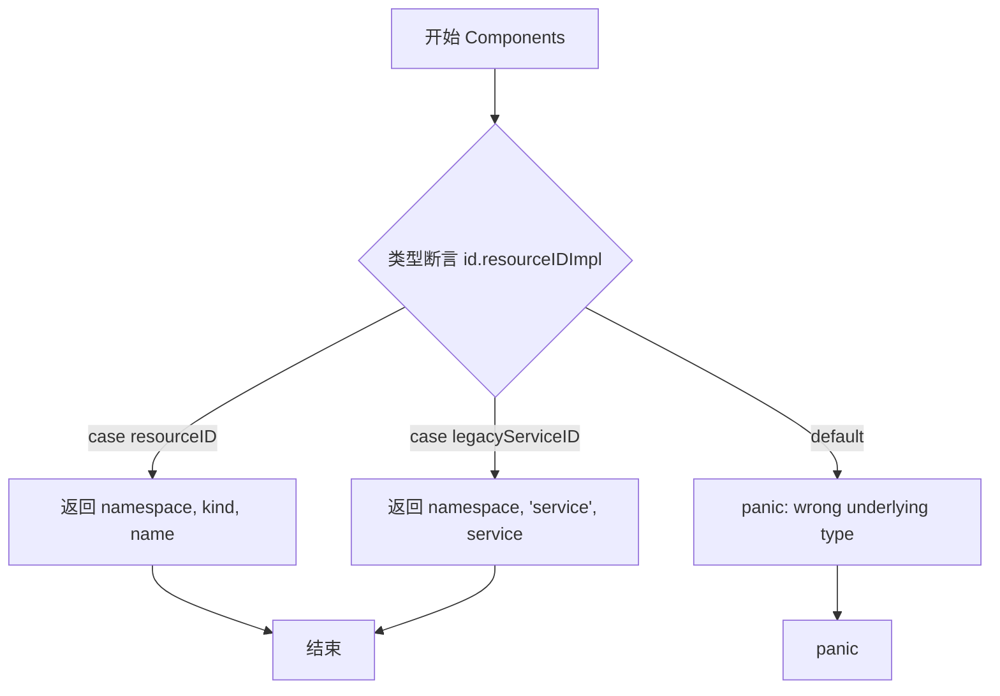

#### 带注释源码

```go
// Components returns the constituent components of a ID
// Components 方法返回 ID 的组成部分（命名空间、类型、名称）
func (id ID) Components() (namespace, kind, name string) {
    // 使用类型断言检查底层实现的具体类型
    // 使用 switch 语句进行类型分支处理
    switch impl := id.resourceIDImpl.(type) {
    // 新格式: namespace:kind/name
    case resourceID:
        // 直接返回 resourceID 结构体的三个字段
        return impl.namespace, impl.kind, impl.name
    // 旧格式: namespace/serviceName (遗留格式)
    case legacyServiceID:
        // 旧格式没有 kind 字段，固定返回 "service" 作为类型
        return impl.namespace, "service", impl.service
    // 未知类型 - 这是一个编程错误，触发 panic
    default:
        panic("wrong underlying type")
    }
}
```


### `ID.MarshalJSON`

该方法是 `ID` 类型的 JSON 序列化实现。为了保持与早期 flux 版本（其中 ID 仅是纯字符串）的向后兼容性，此方法将 `ID` 对象编码为标准的 JSON 字符串。如果 ID 的内部实现为空（例如通过字面量构造的空 ID），则返回空字符串的 JSON 表示。

**参数：**
*   （无额外参数，方法作用于 ID 实例本身）

**返回值：**
*   `[]byte`：表示 JSON 字符串的字节切片。
*   `error`：如果序列化过程中发生错误（例如在 `json.Marshal` 调用内部），则返回该错误；否则返回 `nil`。

#### 流程图

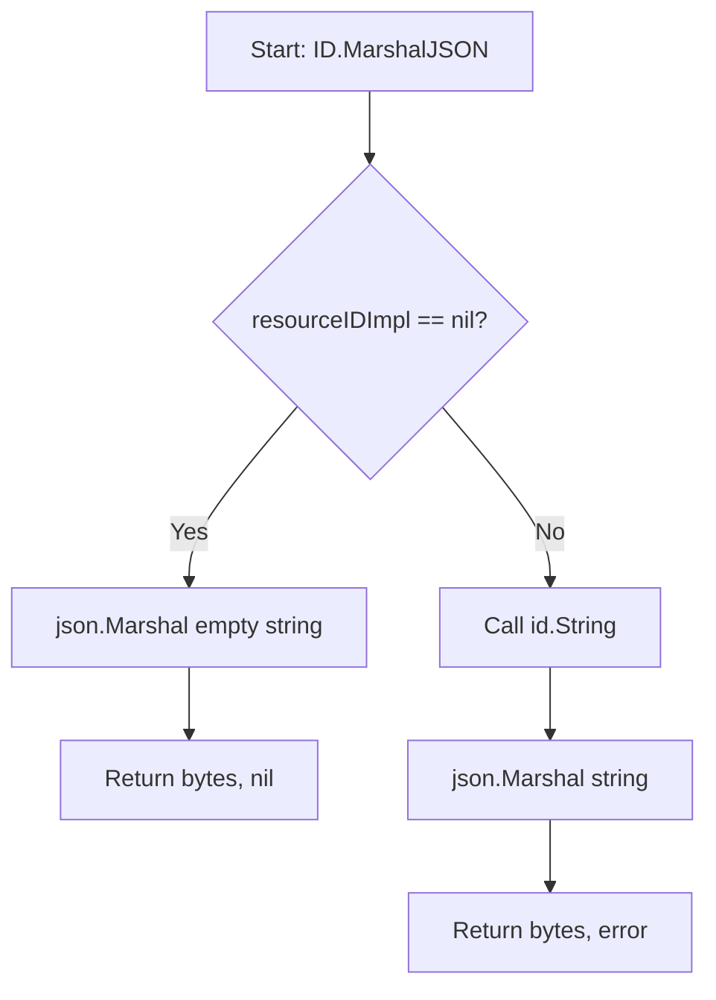

#### 带注释源码

```go
// MarshalJSON encodes a ID as a JSON string. This is
// done to maintain backwards compatibility with previous flux
// versions where the ID is a plain string.
func (id ID) MarshalJSON() ([]byte, error) {
	// 检查 ID 的底层实现是否为空。
	// 这是必需的，因为有可能通过字面量构造出空 ID (例如 ID{})，
	// 此时 resourceIDImpl 为 nil，直接调用 String() 会 panic。
	if id.resourceIDImpl == nil {
		// 返回空字符串的 JSON 形式，即两个双引号 ""
		return json.Marshal("")
	}
	// 正常情况下，获取 ID 的字符串表示，然后将其序列化为 JSON 字符串。
	// 这会生成一个包含在引号内的字符串，如 "\"namespace:kind/name\""。
	return json.Marshal(id.String())
}
```


### `ID.UnmarshalJSON`

该方法用于从JSON字符串中解码并重构`ID`类型，以保持与先前flux版本（其中ID为纯字符串）的向后兼容性。

参数：

- `data`：`[]byte`，要解析的JSON数据

返回值：`error`，如果解析失败则返回错误；成功时返回nil

#### 流程图

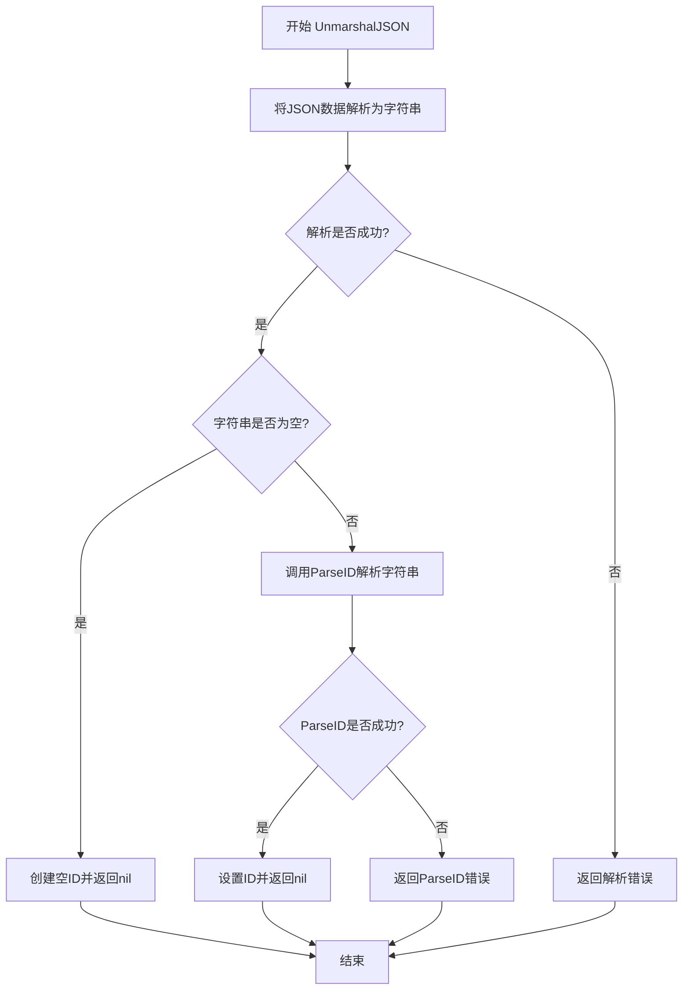

#### 带注释源码

```go
// UnmarshalJSON decodes a ID from a JSON string. This is
// done to maintain backwards compatibility with previous flux
// versions where the ID is a plain string.
// UnmarshalJSON 从JSON字符串解码ID类型，用于保持与早期flux版本的向后兼容
func (id *ID) UnmarshalJSON(data []byte) (err error) {
    // 声明一个字符串变量用于存储解析后的值
	var str string
    // 尝试将JSON数据解析为字符串
	if err := json.Unmarshal(data, &str); err != nil {
        // 如果JSON解析失败，直接返回错误
		return err
	}
    // 检查解析后的字符串是否为空
	if string(str) == "" {
        // 由于可以构造空ID字面量，需要处理这种边界情况
		*id = ID{}
		return nil
	}
    // 使用ParseID函数解析非空字符串为ID类型
	*id, err = ParseID(string(str))
    // 返回解析结果（可能为错误）
	return err
}
```


### `ID.MarshalText`

该方法实现 `encoding.TextMarshaler` 接口，将 `ID` 对象编码为纯文本字符串（字节切片），这是因为 ResourceID 有时被用作 map 的键，需要支持文本格式的序列化。

参数：
- （无显式参数，方法作用于接收者 `id`）

返回值：
- `text []byte`，编码后的文本字节切片
- `err error`，始终返回 `nil`，因为该操作不会失败

#### 流程图

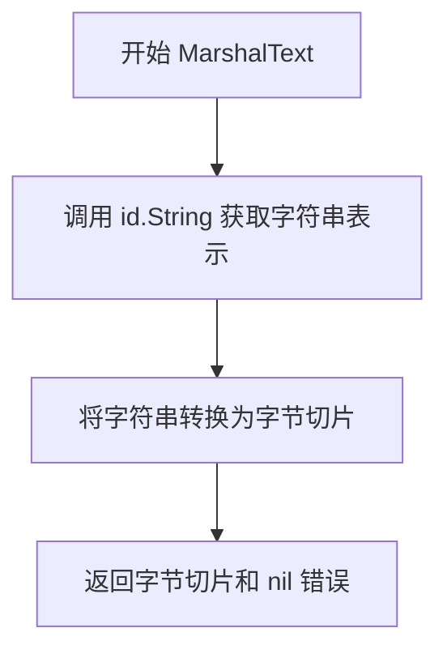

#### 带注释源码

```go
// MarshalText encodes a ID as a flat string; this is
// required because ResourceIDs are sometimes used as map keys.
// MarshalText 将 ID 编码为纯文本字符串；这是必需的，因为 ResourceID 有时用作 map 的键。
func (id ID) MarshalText() (text []byte, err error) {
    // 直接调用 ID 的 String() 方法获取其字符串表示，然后转换为字节切片返回
    // 错误始终为 nil，因为 String() 和 []byte() 转换都不会失败
    return []byte(id.String()), nil
}
```


### `ID.UnmarshalText`

该方法实现了 `encoding.TextUnmarshaler` 接口，用于从平面字符串解码 `ID` 类型。当 `ID` 被用作 map 的键时，Go 的 `encoding/json` 包会自动调用此方法进行反序列化。

参数：

- `text`：`[]byte`，待解码的文本字节数组

返回值：`error`，如果解析失败则返回错误，否则返回 `nil`

#### 流程图

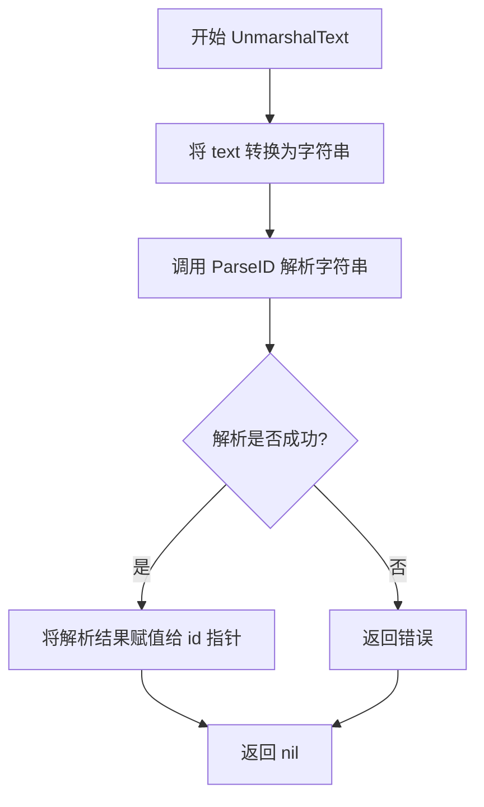

#### 带注释源码

```go
// MarshalText decodes a ID from a flat string; this is
// required because ResourceIDs are sometimes used as map keys.
func (id *ID) UnmarshalText(text []byte) error {
	// 1. 调用 ParseID 函数将字符串形式的 text 解析为 ID 类型
	//    ParseID 会尝试匹配两种格式：
	//    - 新格式: <namespace>:<kind>/<name> (例如: "default:service/myapp")
	//    - 旧格式: <namespace>/<servicename> (例如: "default/myapp")
	result, err := ParseID(string(text))
	
	// 2. 如果解析过程中发生错误（如格式不匹配），立即返回错误
	if err != nil {
		return err
	}
	
	// 3. 解析成功时，将解析得到的 ID 对象通过指针赋值给调用者
	//    这是一个指针接收者方法，因此可以修改原始 ID 对象
	*id = result
	
	// 4. 返回 nil 表示反序列化成功
	return nil
}
```


### `resourceID.String()`

该方法用于将新式 `<namespace>:<kind>/<name>` 格式的 resourceID 结构体转换为其字符串表示形式。

参数： 无（该方法不接受任何参数）

返回值：`string`，返回格式为 `namespace:kind/name` 的字符串表示

#### 流程图

```mermaid
flowchart TD
    A[开始 resourceID.String()] --> B{接收者}
    B --> C[获取 namespace]
    B --> D[获取 kind]
    B --> E[获取 name]
    C --> F[fmt.Sprintf 格式化字符串]
    D --> F
    E --> F
    F --> G[返回格式化后的字符串]
    G --> H[结束]
```

#### 带注释源码

```go
// New <namespace>:<kind>/<name> format
type resourceID struct {
	namespace, kind, name string
}

// String 方法将 resourceID 结构体转换为其字符串表示形式
// 参数：无（方法接收者）
// 返回值：string，格式为 "namespace:kind/name"
func (id resourceID) String() string {
	// 使用 fmt.Sprintf 将 namespace、kind、name 组合成标准格式
	// 格式：namespace:kind/name
	// 示例：default:deployment/my-app
	return fmt.Sprintf("%s:%s/%s", id.namespace, id.kind, id.name)
}
```


### `legacyServiceID.String()`

该方法是 `legacyServiceID` 类型的 Stringer 接口实现，用于将旧式的 `<namespace>/<servicename>` 格式的服务ID转换为标准的字符串表示形式。

参数：

- （无参数，该方法作用于结构体实例本身）

返回值：`string`，返回格式化的 namespace/service 字符串表示。

#### 流程图

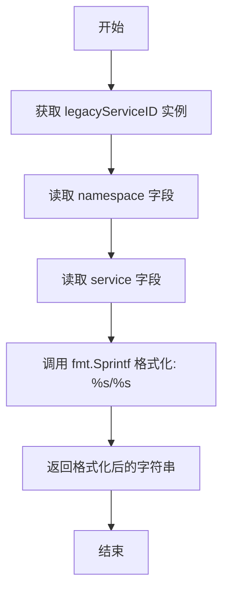

#### 带注释源码

```go
// Old-style <namespace>/<servicename> format
type legacyServiceID struct {
	namespace, service string
}

// String 是 legacyServiceID 类型的 Stringer 接口实现
// 返回格式为 "namespace/service" 的字符串表示
func (id legacyServiceID) String() string {
	// 使用 fmt.Sprintf 将 namespace 和 service 字段
	// 按照 "namespace/service" 格式进行拼接并返回
	return fmt.Sprintf("%s/%s", id.namespace, id.service)
}
```


### `IDSet.String()`

将 IDSet（资源ID集合）转换为可读的字符串表示形式，格式为 `{id1, id2, ...}`，便于日志输出和调试。

参数：  
无

返回值：`string`，返回格式化后的资源ID集合字符串，例如 `{namespace:kind/name, cluster:service/app}`。

#### 流程图

```mermaid
flowchart TD
    A[开始 String 方法] --> B[创建空字符串切片 ids]
    C[遍历 IDSet 中的每个 id] --> D[调用 id.String 获取字符串]
    D --> E[将字符串追加到 ids 切片]
    E --> C
    C --> F{遍历完成?}
    F -->|是| G[使用 strings.Join 连接 ids]
    G --> H[返回 \"{\" + 连接结果 + \"}\""]
    F -->|否| C
    H --> I[结束]
```

#### 带注释源码

```go
// String 方法将 IDSet 转换为字符串表示
// 格式: {id1, id2, id3, ...}
func (s IDSet) String() string {
    // 1. 创建空字符串切片用于收集所有ID的字符串表示
    var ids []string
    
    // 2. 遍历整个 IDSet (map[ID]struct{})
    for id := range s {
        // 3. 调用 ID 类型的 String() 方法获取其字符串形式
        //    这里会调用 resourceID 或 legacyServiceID 的 String() 方法
        ids = append(ids, id.String())
    }
    
    // 4. 使用 strings.Join 将所有ID字符串用 ", " 连接
    // 5. 用大括号包裹形成集合的标准表示
    return "{" + strings.Join(ids, ", ") + "}"
}
```


### IDSet.Add

该方法用于将一个或多个ID添加到IDSet集合中，支持批量添加操作。

参数：

- `ids`：`[]ID`，表示要添加到集合中的ID列表

返回值：无返回值（Go语言中的空返回值）

#### 流程图

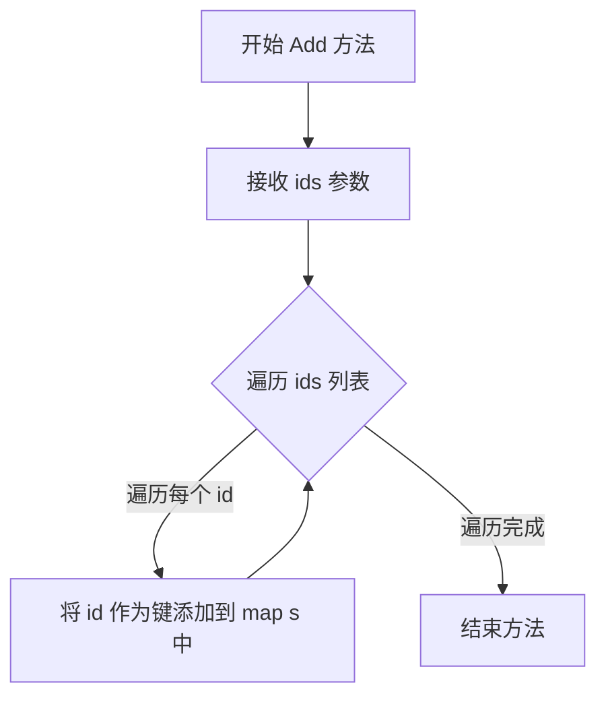

#### 带注释源码

```go
// Add 方法将一个ID列表添加到IDSet中
// 接收者s是IDSet类型（map[ID]struct{}）
// 参数ids是要添加的ID切片
func (s IDSet) Add(ids []ID) {
	// 遍历传入的IDs切片
	for _, id := range ids {
		// 将每个ID添加到map中，使用空结构体作为值
		// 这里利用了Go map的特性：重复key会自动覆盖
		s[id] = struct{}{}
	}
}
```


### `IDSet.Without()`

从当前IDSet集合中移除另一个IDSet集合中包含的所有ID，返回一个新的IDSet集合。该方法实现了集合的差集运算，支持nil和空集合的边界情况处理。

参数：

- `others`：`IDSet`，要排除的ID集合

返回值：`IDSet`，返回排除`others`集合后的新IDSet集合

#### 流程图

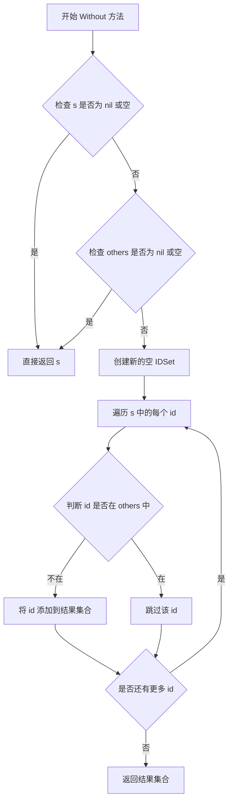

#### 带注释源码

```go
// Without 返回一个排除了 others 集合中 ID 的新集合
// 参数: others - 要排除的 ID 集合
// 返回值: 排除后的新 IDSet 集合
func (s IDSet) Without(others IDSet) IDSet {
	// 边界条件检查：如果当前集合或排除集合为空，直接返回原集合
	// 避免不必要的遍历操作，提升性能
	if s == nil || len(s) == 0 || others == nil || len(others) == 0 {
		return s
	}
	
	// 创建结果集合，用于存储需要保留的 ID
	res := IDSet{}
	
	// 遍历当前集合中的所有 ID
	for id := range s {
		// 使用 Contains 方法检查当前 ID 是否在被排除的集合中
		// 如果不在则添加到结果集合中
		if !others.Contains(id) {
			res[id] = struct{}{}
		}
	}
	
	// 返回差集运算结果
	return res
}
```

### 整体设计文档

#### 1. 代码核心功能概述

该代码定义了一个资源标识符（ID）系统，包括ID的解析、格式化和集合操作。核心功能是支持两种ID格式（旧式`namespace/service`和新式`namespace:kind/name`）的解析和相互转换，并提供IDSet集合类型用于管理多个资源标识符的集合运算。

#### 2. 关键组件信息

- **ID类型**：资源标识符的封装类型，内部通过接口实现多态支持新旧两种格式
- **IDSet类型**：`map[ID]struct{}`类型的集合封装，提供Add、Without、Contains、Intersection等集合操作
- **IDs类型**：`[]ID`切片类型，实现了sort.Interface接口用于排序
- **正则表达式**：用于解析和验证ID格式的预编译正则表达式

#### 3. 潜在技术债务与优化空间

- **Contains方法效率**：`IDSet.Contains()`和`IDs.Contains()`方法在每次调用时都会创建新的IDSet实例，造成不必要的内存分配和性能开销，建议优化为直接使用原生map查找
- **错误处理机制**：目前仅使用errors.Wrap包装错误信息，缺乏详细的错误分类和层级化的异常处理机制
- **ID格式兼容性**：新旧两种ID格式的混用可能导致未来维护困难，建议逐步废弃旧格式
- **空值处理**：多处存在对nil和空集合的特殊处理，代码逻辑分支较多，可考虑统一空值处理策略

#### 4. 其它设计要点

- **设计目标**：保持与旧版本flux的向后兼容性，同时支持Kubernetes标准的资源标识符格式
- **错误处理**：使用pkg/errors库进行错误封装，提供上下文信息
- **线程安全**：当前实现非线程安全，如需并发访问需要外部同步机制
- **外部依赖**：依赖标准库（encoding/json、regexp、sort、strings）和pkg/errors库


### IDSet.Contains

检查 IDSet 集合中是否包含指定的资源 ID。如果 IDSet 为 nil，则返回 false；否则检查 map 中是否存在对应的键。

参数：

- `id`：`ID`，要检查是否存在的资源 ID

返回值：`bool`，如果 IDSet 包含指定的 ID 则返回 true，否则返回 false

#### 流程图

```mermaid
flowchart TD
    A[开始 Contains 方法] --> B{接收 id 参数}
    B --> C{s == nil?}
    C -->|是| D[返回 false]
    C -->|否| E[尝试从 map 中获取 id]
    E --> F{_, ok := s[id]}
    F -->|ok == true| G[返回 true]
    F -->|ok == false| H[返回 false]
```

#### 带注释源码

```go
// Contains 检查 IDSet 集合中是否包含指定的资源 ID
// 参数 id: 要检查的 ID 类型值
// 返回值: 如果包含则返回 true，否则返回 false
func (s IDSet) Contains(id ID) bool {
    // 首先检查 IDSet 是否为 nil
    // 这是一个防御性检查，防止对 nil map 的访问
    if s == nil {
        return false
    }
    
    // 从 map 中尝试获取 id 对应的值
    // 使用 comma-ok 语法检查键是否存在
    // 如果键存在，ok 为 true；否则为 false
    _, ok := s[id]
    
    // 返回检查结果
    return ok
}
```


### `IDSet.Intersection`

该方法计算当前IDSet与另一个IDSet的交集，返回包含两个集合中共同元素的新的IDSet。

参数：

- `others`：`IDSet`，需要进行交集运算的目标集合

返回值：`IDSet`，返回包含交集元素的新的IDSet

#### 流程图

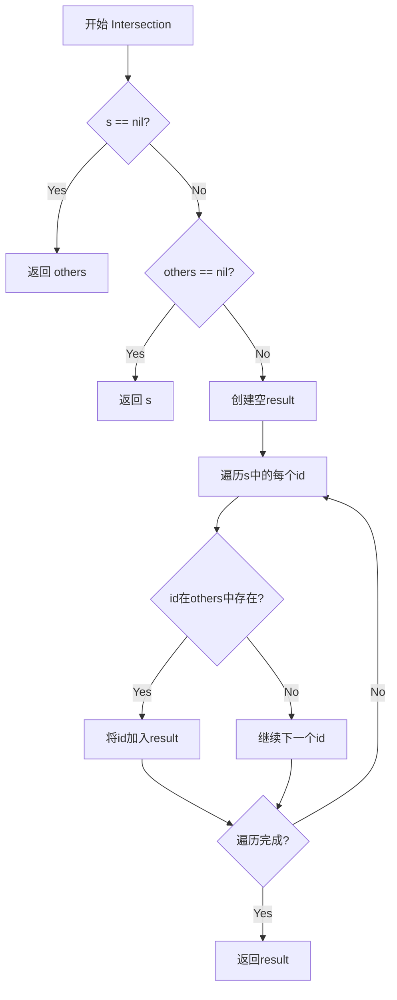

#### 带注释源码

```
// Intersection 计算两个IDSet的交集
// 如果当前集合s为nil，返回others（非nil情况下的交集等于others）
// 如果others为nil，返回s（非nil情况下的交集等于s）
// 否则返回包含共同元素的新的IDSet
func (s IDSet) Intersection(others IDSet) IDSet {
	// 如果当前集合为nil，交集结果就是others
	if s == nil {
		return others
	}
	// 如果others为nil，交集结果就是s
	if others == nil {
		return s
	}
	// 创建结果集合
	result := IDSet{}
	// 遍历当前集合的所有元素
	for id := range s {
		// 检查元素是否也存在于others中
		if _, ok := others[id]; ok {
			// 存在于两者中，加入结果集
			result[id] = struct{}{}
		}
	}
	// 返回交集结果
	return result
}
```


### `IDSet.ToSlice()`

将 IDSet（资源ID集合）转换为排序前的 IDs（资源ID切片），返回包含集合中所有元素的切片。

参数：
- （无显式参数，接收者 `s` 为 `IDSet` 类型）

返回值：`IDs`，返回一个包含 IDSet 中所有元素的切片，元素顺序未排序。

#### 流程图

```mermaid
flowchart TD
    A[开始 ToSlice] --> B[初始化 i = 0]
    B --> C[创建长度为 len(s) 的 IDs 切片 keys]
    C --> D{遍历 s 中的每个元素 k}
    D -->|是| E[将 k 赋值给 keys[i]]
    E --> F[i++]
    F --> D
    D -->|遍历完成| G[返回 keys]
    G --> H[结束]
```

#### 带注释源码

```go
// ToSlice 将 IDSet 转换为 IDs 切片
// 该方法将 map 中的所有键（ID）提取出来并返回一个切片
// 注意：返回的切片元素顺序是不确定的，因为 Go 的 map 遍历顺序是随机的
func (s IDSet) ToSlice() IDs {
    i := 0 // 初始化切片索引计数器
    // 预先分配与 IDSet 大小相同的切片容量，避免后续扩容带来的性能开销
    keys := make(IDs, len(s))
    // 遍历 IDSet（map）的所有键
    for k := range s {
        keys[i] = k // 将当前键存入切片对应位置
        i++         // 移动到下一个位置
    }
    return keys // 返回包含所有 ID 的切片
}
```

#### 额外信息

| 项目 | 描述 |
|------|------|
| **所属类型** | `IDSet`（底层类型 `map[ID]struct{}`） |
| **返回类型** | `IDs`（底层类型 `[]ID`） |
| **时间复杂度** | O(n)，其中 n 为 IDSet 中的元素数量 |
| **空间复杂度** | O(n)，需要分配与集合大小相同的切片 |
| **是否线程安全** | 否，IDSet 本身非线程安全 |
| **可排序性** | 返回后可通过 `IDs.Sort()` 方法进行排序 |


### `IDs.Len`

该方法实现了 `sort.Interface` 接口的 `Len` 方法，用于返回 IDs 切片的长度，以便进行排序操作。

参数： 无

返回值： `int`，返回 IDs 切片中元素的数量

#### 流程图

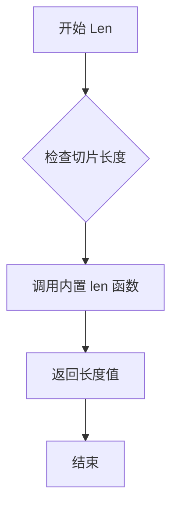

#### 带注释源码

```go
// Len 是 sort.Interface 接口的实现方法
// 返回切片中元素的数量，用于排序算法确定范围
// 参数: 无 (使用接收者 p IDs)
// 返回值: int - IDs 切片的长度
func (p IDs) Len() int { return len(p) }
```


### `IDs.Less`

该方法是 `IDs` 类型（`[]ID` 的别名）实现的 `sort.Interface` 接口方法，用于比较两个 ID 元素的字符串表示形式的大小，以支持 Go 标准库的排序功能。

#### 参数

- `i`：`int`，要比较的第一个元素的索引
- `j`：`int`，要比较的第二个元素的索引

#### 返回值

- `bool`，如果第 i 个 ID 的字符串表示小于第 j 个 ID 的字符串表示，则返回 `true`；否则返回 `false`

#### 流程图

```mermaid
graph TD
    A[开始] --> B[调用 p[i].String 获取第一个ID的字符串表示]
    B --> C[调用 p[j].String 获取第二个ID的字符串表示]
    C --> D[使用字符串比较运算符 < 比较两个字符串]
    D --> E{比较结果}
    E -->|true| F[返回 true]
    E -->|false| G[返回 false]
```

#### 带注释源码

```go
// Less 方法实现了 sort.Interface 接口的 Less 方法
// 用于比较两个 ID 元素的大小，以便进行排序
// 参数 i, j 表示要比较的两个元素在切片中的索引
// 返回值：如果 p[i] 的字符串表示小于 p[j]，返回 true
func (p IDs) Less(i, j int) bool { 
    // 通过调用 ID 类型的 String() 方法获取其字符串表示
    // 然后使用 Go 的字符串比较进行比较
    // 这确保了排序是基于 ID 的规范字符串格式进行的
    return p[i].String() < p[j].String() 
}
```

#### 相关类型信息

**类型定义：**

```go
// IDs 是 ID 类型的切片别名
type IDs []ID
```

**sort.Interface 接口实现：**

```go
// IDs 类型实现了 sort.Interface 接口的三个方法
func (p IDs) Len() int           { return len(p) }           // 返回切片长度
func (p IDs) Less(i, j int) bool { return p[i].String() < p[j].String() }  // 比较元素
func (p IDs) Swap(i, j int)      { p[i], p[j] = p[j], p[i] } // 交换元素
```

**配套方法：**

```go
// Sort 方法用于对 IDs 切片进行排序
func (p IDs) Sort() { sort.Sort(p) }
```

#### 设计说明

1. **接口实现**：该方法使得 `IDs` 类型可以使用 `sort.Sort()` 或 `sort.Ints()`（需类型转换）进行排序
2. **排序逻辑**：基于 ID 的字符串表示进行字典序排序，这与 `ParseID` 解析后的一致性格式化相关
3. **依赖关系**：依赖于 `ID` 类型的 `String()` 方法返回规范化的字符串格式


### `IDs.Swap`

交换 IDs 切片中索引 i 和 j 位置的元素，实现了 `sort.Interface` 的 `Swap` 方法，用于支持 `sort.Sort` 对 IDs 切片进行原地排序。

参数：

- `i`：`int`，第一个要交换的元素的索引
- `j`：`int`，第二个要交换的元素的索引

返回值：无（`void`），该方法直接修改调用者的底层切片，不返回任何值

#### 流程图

```mermaid
flowchart TD
    A[开始 Swap] --> B{验证索引有效性}
    B -->|索引有效| C[保存 p[i] 的值]
    C --> D[p[i] = p[j]]
    D --> E[p[j] = 临时保存的值]
    E --> F[结束 Swap]
    B -->|索引无效| G[由调用者保证索引有效]
    G --> F
```

#### 带注释源码

```go
// Swap 方法交换切片中两个指定位置的元素
// 此方法实现了 sort.Interface 接口的 Swap 方法
// 使得 sort.Sort 能够对 IDs 切片进行排序
//
// 参数:
//   - i: 第一个元素的索引
//   - j: 第二个元素的索引
func (p IDs) Swap(i, j int) {
	// 交换位置 i 和 j 的元素
	// Go 语言支持多重赋值，直接交换而不需要临时变量
	p[i], p[j] = p[j], p[i]
}
```


### `IDs.Sort()`

对 IDs 切片进行原地排序，使用 sort.Sort 方法根据 ID 的字符串表示进行升序排列。该方法实现了 sort.Interface 接口，配合 Len()、Less() 和 Swap() 方法完成排序功能。

参数：

- （无参数，该方法作用于接收者 `p IDs` 本身）

返回值：无（`void`），方法直接修改切片内容，不返回任何值。

#### 流程图

```mermaid
flowchart TD
    A[开始 Sort 方法] --> B{检查切片长度}
    B -->|长度 > 0| C[调用 sort.Sort 进行排序]
    C --> D[根据 Less 方法比较元素]
    D --> E[使用 Swap 方法交换元素]
    E --> C
    B -->|长度为 0 或 1| F[无需排序直接返回]
    F --> G[结束 Sort 方法]
```

#### 带注释源码

```go
// Sort 对 IDs 切片进行原地排序
// 该方法实现了 sort.Interface 接口，允许使用 sort.Sort 进行排序
// 排序依据是 ID 的字符串表示（通过 Less 方法定义）
func (p IDs) Sort() {
    // sort.Sort 会调用 p 的 Len()、Less() 和 Swap() 方法来完成排序
    // Less 方法比较的是 p[i].String() < p[j].String()
    sort.Sort(p)
}
```


### `IDs.Without`

该方法用于从IDs切片中移除指定的ID集合，返回过滤后的新切片。

参数：

- `others`：`IDSet`，要排除的ID集合

返回值：`IDs`，返回不包含others中ID的新切片

#### 流程图

```mermaid
flowchart TD
    A[开始] --> B[初始化空结果切片]
    B --> C{遍历ids中的每个id}
    C -->|遍历| D{检查id是否在others中}
    D -->|不在| E[将id追加到结果切片]
    D -->|在| F[跳过当前id]
    E --> C
    F --> C
    C -->|遍历完成| G[返回结果切片]
```

#### 带注释源码

```
// Without 返回一个新的IDs切片，包含所有不在others中的ID
// 参数: others - 要排除的ID集合
// 返回: 过滤后的ID切片
func (ids IDs) Without(others IDSet) (res IDs) {
    // 遍历原始IDs切片中的每个ID
    for _, id := range ids {
        // 检查当前ID是否不在排除集合中
        if !others.Contains(id) {
            // 如果不在排除集合中，则添加到结果中
            res = append(res, id)
        }
        // 如果在排除集合中，则跳过（不添加）
    }
    // 返回过滤后的结果切片
    return res
}
```


### `IDs.Contains()`

检查 IDs 切片中是否包含指定的资源 ID。由于切片不支持高效的成员检查，该方法将切片临时转换为 IDSet 后进行查找。

参数：

- `id`：`ID`，要检查是否存在的资源 ID

返回值：`bool`，如果切片中包含指定的 ID 则返回 true，否则返回 false

#### 流程图

```mermaid
flowchart TD
    A[开始 Contains] --> B{ids 为空?}
    B -->|是| C[返回 false]
    B -->|否| D[创建空 IDSet]
    D --> E[将 ids 中所有元素添加到 set]
    E --> F[调用 set.Contains id]
    F --> G{元素存在于 set?}
    G -->|是| H[返回 true]
    G -->|否| I[返回 false]
```

#### 带注释源码

```go
// Contains 检查 IDs 切片中是否包含指定的资源 ID
// 参数 id: 要检查是否存在的资源 ID
// 返回值: 如果存在返回 true，否则返回 false
func (ids IDs) Contains(id ID) bool {
	// 创建一个新的空 IDSet
	set := IDSet{}
	
	// 将当前 IDs 切片的所有元素添加到 IDSet 中
	// 转换原因是 IDSet 的 Contains 方法具有 O(1) 的查找效率
	set.Add(ids)
	
	// 调用 IDSet 的 Contains 方法进行成员检查
	return set.Contains(id)
}
```


### `IDs.Intersection`

该方法实现IDs切片与IDSet集合的交集运算，通过先将IDs切片转换为IDSet，再调用IDSet的Intersection方法完成集合交集操作。

参数：

- `others`：`IDSet`，要与之求交集的ID集合

返回值：`IDSet`，返回当前IDs与others的交集结果

#### 流程图

```mermaid
flowchart TD
    A[开始 Intersection] --> B[创建新的空IDSet]
    B --> C[将当前IDs切片添加到新创建的IDSet]
    C --> D[调用IDSet.Intersection与others求交集]
    D --> E[返回交集结果IDSet]
```

#### 带注释源码

```go
// Intersection 计算当前IDs切片与others集合的交集
// 参数: others IDSet - 要与之求交集的ID集合
// 返回: IDSet - 两个集合的交集结果
func (ids IDs) Intersection(others IDSet) IDSet {
	// 创建一个新的空IDSet用于存储转换后的集合
	set := IDSet{}
	
	// 将当前IDs切片的所有元素添加到新创建的IDSet中
	set.Add(ids)
	
	// 调用IDSet类型的Intersection方法计算交集并返回结果
	return set.Intersection(others)
}
```

## 关键组件


### 资源ID类型体系

核心类型包括外层`ID`类型、内部接口`resourceIDImpl`、旧格式`legacyServiceID`（namespace/service格式）和新格式`resourceID`（namespace:kind/name格式），通过接口实现多态支持两种ID格式的共存。

### ID解析与构造

包含多个解析函数：`ParseID`根据字符串格式自动识别并解析为新格式或旧格式ID；`MustParseID`在格式无效时panic；`ParseIDOptionalNamespace`支持可选命名空间的解析；`MakeID`直接从组件构造ID。

### 正则表达式验证

使用三个正则表达式验证ID格式：`LegacyServiceIDRegexp`验证旧格式`namespace/service`；`IDRegexp`验证新格式`namespace:kind/name`；`UnqualifiedIDRegexp`验证无命名空间的`kind/name`格式。

### IDSet集合操作

`IDSet`类型（map[ID]struct{}）提供集合操作：Add添加ID、Without返回差集、Contains检查包含、Intersection返回交集、ToSlice转换为切片。

### IDs切片类型与排序

`IDs`类型（[]ID）实现sort.Interface接口提供排序功能，并包含Without返回差集切片、Contains检查包含、Intersection返回交集等操作。

### JSON序列化兼容

`MarshalJSON`和`UnmarshalJSON`方法将ID序列化为JSON字符串，保持与旧版本flux的兼容性（之前ID为纯字符串）。

### 文本序列化支持

`MarshalText`和`UnmarshalText`方法实现TextMarshaler和TextUnmarshaler接口，支持ID作为map键时的编解码。

### Components组件提取

`Components`方法从ID中提取namespace、kind、name三个组件，根据底层实现类型返回对应值，旧格式service类型返回"service"作为kind。


## 问题及建议


### 已知问题

- **类型断言 panic 风险**: `Components()` 方法中使用类型断言 `id.resourceIDImpl.(type)`，如果不是 `resourceID` 或 `legacyServiceID` 类型，会直接 panic，缺乏安全的错误处理机制。
- **IDs 类型的性能问题**: `IDs.Contains()` 和 `IDs.Intersection()` 方法每次调用都会创建新的 `IDSet` 对象，在循环或高频调用场景下会造成不必要的内存分配和性能开销。
- **IDSet.Add 不处理 nil receiver**: 如果对 nil 的 IDSet 调用 `Add` 方法会引发 panic，缺乏 nil 安全处理。
- **IDs.ToSlice() 随机顺序**: 由于 Go map 的迭代顺序是随机的，`ToSlice()` 返回的切片顺序不确定，虽然 `IDs` 类型实现了 `Sort` 方法，但调用方需要额外调用才能排序。
- **MarshalJSON 和 UnmarshalJSON 空值处理不一致**: 空 ID 在 MarshalJSON 时返回 `""`，但 unmarshal 空字符串时会被设置为空 ID 对象，这种隐式转换可能导致意外行为。
- **MakeID 缺少输入验证**: `MakeID` 函数直接使用传入的参数构造 ID，没有验证 namespace、kind、name 是否符合正则表达式规范，可能产生无效的 ID。
- **注释错误**: `UnmarshalText` 方法上方的注释错误地写成了 "// MarshalText decodes a ID from a flat string"，应为 "// UnmarshalText decodes a ID from a flat string"。

### 优化建议

- **为 IDSet 添加 nil 安全的 Add 方法**: 在 `Add` 方法开始处检查 `s` 是否为 nil，如果是则初始化。
- **优化 IDs 类型的集合操作**: 考虑为 `IDs` 类型添加缓存机制或直接实现 `Contains` 和 `Intersection` 方法，避免每次都创建 IDSet。
- **添加 ID 验证函数**: 创建 `ValidateID` 或在 `MakeID` 中添加验证逻辑，确保生成的 ID 符合正则表达式规范。
- **修复注释错误**: 更正 `UnmarshalText` 方法上方的注释。
- **考虑使用安全的类型转换**: 在 `Components()` 方法中使用类型断言并返回错误，而不是 panic。
- **为 ToSlice 添加排序选项**: 提供 `ToSlice()` 方法的排序版本或默认返回有序切片。
- **统一空值处理语义**: 明确空 ID 的 JSON 表示形式，并在文档中说明其行为。


## 其它


### 设计目标与约束

本包的设计目标是提供一个统一且可扩展的资源标识符（Resource ID）解析和表示系统，支持Kubernetes风格的资源标识符格式，同时保持与旧版flux服务的向后兼容性。核心约束包括：标识符格式必须符合预定义的正则表达式规则；必须支持两种格式的解析（旧式namespace/service和新式namespace:kind/name）；标识符解析失败时必须返回明确的错误信息；ID类型必须支持JSON和文本序列化以满足作为map键的需求。

### 错误处理与异常设计

错误处理采用Go语言的错误返回值模式。定义了包级别的错误变量`ErrInvalidServiceID`用于标识无效的服务ID。所有解析函数（ParseID、ParseIDOptionalNamespace）在解析失败时返回该错误，并通过`errors.Wrap`添加上下文信息。MustParseID函数在解析失败时使用panic机制，适用于启动阶段确信输入必然合法的场景。IDSet的Contains方法对nil值返回false，避免空指针异常。UnmarshalJSON和UnmarshalText在解析失败时返回错误而非panic，保证反序列化过程的稳定性。

### 数据流与状态机

数据流主要分为三个阶段：输入阶段接收字符串表示的资源ID；解析阶段使用正则表达式匹配识别格式类型（IDRegexp、LegacyServiceIDRegexp、UnqualifiedIDRegexp），并构建相应的内部结构；输出阶段通过String()方法将内部结构转换为标准字符串格式。状态机转换如下：输入字符串首先尝试匹配新格式IDRegexp，若成功则创建resourceID结构；若失败则尝试旧格式LegacyServiceIDRegexp，成功则创建legacyServiceID结构；若仍失败则返回错误。ID类型通过接口resourceIDImpl支持多态行为，Components()方法根据实际类型返回对应的组件。

### 外部依赖与接口契约

外部依赖包括：标准库"encoding/json"用于JSON序列化；标准库"fmt"用于字符串格式化；标准库"regexp"用于正则表达式匹配；标准库"sort"用于ID排序；第三方库"github.com/pkg/errors"用于错误包装。接口契约方面：ID类型满足fmt.Stringer接口（String()方法）；满足encoding/json包要求的MarshalJSON和UnmarshalJSON方法；满足encoding.TextMarshaler和encoding.TextUnmarshaler接口（MarshalText和UnmarshalText方法）；IDSet类型通过map实现集合操作；IDs类型满足sort.Interface接口（Len、Less、Swap方法）以支持排序。

### 性能考虑

正则表达式在包初始化时通过regexp.MustCompile预编译，避免重复编译开销。IDSet使用map[ID]struct{}实现，查找时间复杂度为O(1)。IDs的ToSlice方法在已知集合大小的情况下预先分配切片容量，避免多次扩容。Intersection和Without操作在处理空集时直接返回原集合或空集，避免不必要的迭代。Contains方法对于IDs类型需要先转换为IDSet，时间复杂度为O(n)，但在批量查询场景下可接受。

### 安全考虑

ParseID函数对namespace和kind组件调用strings.ToLower进行小写转换，确保ID的规范化表示，防止大小写敏感的重复ID问题。正则表达式使用预编译的固定模式，不接受用户输入的正则表达式，避免正则表达式拒绝服务（ReDoS）攻击。空ID字面量在MarshalJSON中被特殊处理返回空字符串，防止序列化空指针异常。UnmarshalJSON和UnmarshalText对空字符串输入返回空ID而非错误，这是基于实际使用场景的务实选择。

### 兼容性设计

向后兼容性通过多种机制保证：支持LegacyServiceIDRegexp解析旧式namespace/service格式；MarshalJSON将ID序列化为字符串而非对象，保持与旧版本JSON格式的一致性；UnmarshalJSON接受字符串或旧格式的数字（虽然会解析失败）。ParseIDOptionalNamespace函数支持非完全限定ID与命名空间的组合，提供灵活的ID解析方式。IDs类型作为[]ID的别名，保持与标准切片类型的兼容性。

### 测试策略建议

应覆盖的测试场景包括：合法的新格式ID解析（如"cluster:deployment/myapp"、"namespace:service/myservice"）；合法的旧格式ID解析（如"namespace/service"）；非法ID格式的解析错误返回；空ID的序列化与反序列化；IDSet的各种集合操作（Add、Without、Contains、Intersection）；IDs的排序和去重；MarshalJSON/UnmarshalJSON的往返一致性；MarshalText/UnmarshalText的往返一致性；大小写规范化处理。

### 配置管理

本包无运行时配置需求。正则表达式模式作为编译时常量硬编码在包内，不支持运行时修改。如需扩展支持的ID格式，需修改源码并重新编译。ID组件的小写转换行为通过strings.ToLower硬编码，如需支持大小写敏感场景需修改代码。

### 并发安全

ID类型和IDs类型都是不可变值类型（或者在创建后不可变），并发访问是安全的。IDSet类型基于map，Go语言的map并发读写不安全，但本包中IDSet作为值类型传递和使用，如需并发修改应使用sync.Mutex保护或使用sync.Map。解析函数ParseID等是无状态函数，可以并发安全调用。

    