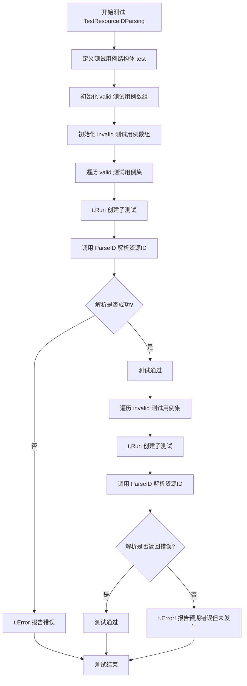
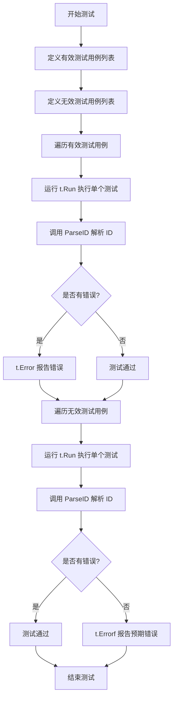

# `flux\pkg\resource\id_test.go` 详细设计文档

这是一个资源ID解析的Go语言测试文件，通过测试用例验证ParseID函数能否正确解析各种格式的资源ID（包括完整格式namespace:kind/name、遗留格式namespace/service、带点号和冒号的格式、集群范围资源等），同时能够正确拒绝无效格式（如未限定名称、命名空间中的点号、过多冒号等）。

## 整体流程



## 类结构

```
resource_test.go (测试文件)
└── TestResourceIDParsing (测试函数)
    └── test (本地结构体: 测试用例)
```

## 全局变量及字段


### `valid`
    
有效资源ID的测试用例数组，包含完整格式、遗留格式、带点号/冒号格式、集群范围资源等多种有效场景

类型：`[]test`
    


### `invalid`
    
无效资源ID的测试用例数组，包含未限定名称、命名空间含点号、过多冒号等无效场景

类型：`[]test`
    


### `test.name`
    
测试用例名称，用于描述测试场景

类型：`string`
    


### `test.id`
    
待解析的资源ID字符串

类型：`string`
    
    

## 全局函数及方法


### `TestResourceIDParsing`

测试函数，用于验证 `ParseID` 函数对有效和无效资源 ID 的解析行为。

参数：

- `t`：`testing.T`，Go 测试框架的测试对象，用于报告测试错误

返回值：无返回值

#### 流程图



#### 带注释源码

```go
// TestResourceIDParsing 测试函数，验证 ParseID 函数对有效和无效资源 ID 的解析行为
func TestResourceIDParsing(t *testing.T) {
	// 定义测试用例结构体，包含名称和 ID 字符串
	type test struct {
		name, id string
	}
	
	// 有效测试用例列表：期望 ParseID 能够成功解析
	valid := []test{
		{"full", "namespace:kind/name"},              // 完整格式：命名空间:类型/名称
		{"legacy", "namespace/service"},              // 遗留格式：命名空间/服务
		{"dots", "namespace:kind/name.with.dots"},    // 名称中包含点号
		{"colons", "namespace:kind/name:with:colons"},// 名称中包含冒号
		{"punctuation in general", "name-space:ki_nd/punc_tu:a.tion-rules"}, // 混合标点符号
		{"cluster-scope resource", "<cluster>:namespace/foo"}, // 集群作用域资源
	}
	
	// 无效测试用例列表：期望 ParseID 返回错误
	invalid := []test{
		{"unqualified", "justname"},              // 不合格：缺少命名空间和类型
		{"dots in namespace", "name.space:kind/name"}, // 命名空间中包含点号（非法）
		{"too many colons", "namespace:kind:name"},    // 冒号数量过多
	}

	// 遍历所有有效测试用例
	for _, tc := range valid {
		t.Run(tc.name, func(t *testing.T) {
			// 调用 ParseID 进行解析
			if _, err := ParseID(tc.id); err != nil {
				// 如果返回错误，测试失败
				t.Error(err)
			}
		})
	}
	
	// 遍历所有无效测试用例
	for _, tc := range invalid {
		t.Run(tc.name, func(t *testing.T) {
			// 调用 ParseID 进行解析
			if _, err := ParseID(tc.id); err == nil {
				// 如果没有返回错误，说明解析器应该报错但没有报错，测试失败
				t.Errorf("expected %q to be considered invalid", tc.id)
			}
		})
	}
}
```

## 关键组件


### 资源ID解析器 (ParseID Function)

核心功能：解析Kubernetes风格的资源标识符，支持namespace:kind/name格式，能够区分有效和无效的资源ID，并返回解析后的结构或错误。

### 测试用例定义 (Test Cases)

定义了两组测试用例：valid数组包含符合规范的资源ID格式，invalid数组包含不符合规范的格式，用于验证解析器的边界处理能力。

### 有效格式支持 (Valid Formats)

支持多种资源ID格式：完整格式(namespace:kind/name)、遗留格式(namespace/service)、带点格式、带冒号格式、带标点符号格式，以及集群作用域资源(<cluster>:namespace/foo)。

### 无效格式校验 (Invalid Input Detection)

能够正确识别并拒绝以下无效格式： unqualified（无命名空间限定）、dots in namespace（命名空间中含点）、too many colons（冒号过多）等不符合规范的输入。

### 测试运行器 (Test Runner)

使用t.Run为每个测试用例创建独立子测试，通过表驱动测试模式实现测试代码的简洁性和可维护性，能够清晰区分有效和无效输入的测试结果。


## 问题及建议


### 已知问题

-   **测试数据硬编码**：有效和无效的测试用例直接嵌入在测试函数中，数据未外部化，不利于维护和扩展
-   **缺少解析结果验证**：测试仅验证 `ParseID` 是否返回错误，未验证成功解析后返回的资源ID结构内容是否正确（如命名空间、种类、名称等字段）
-   **测试覆盖不足**：未覆盖边界情况，如空字符串、超长ID、特殊Unicode字符、空白字符等
-   **错误消息未验证**：对于无效输入，未验证返回的错误消息是否符合预期或包含有用的调试信息
-   **缺乏Table-Driven测试的典型优化**：未使用子测试名称传递完整的测试参数信息，调试时可能不够直观

### 优化建议

-   将测试数据提取为独立的测试数据文件或使用表格驱动测试的更结构化形式
-   增加对解析成功结果的断言，验证 `namespace`、`kind`、`name` 等字段的正确性
-   扩充边界条件测试用例：空字符串、仅空格、最大长度限制、非法字符等
-   验证错误类型和错误消息，确保错误信息具有诊断价值
-   考虑添加性能测试（Benchmark），验证 `ParseID` 函数在大批量解析时的性能表现
-   添加模糊测试（Fuzz Testing）以发现边缘情况


## 其它


### 设计目标与约束

本测试文件旨在验证资源ID解析功能的正确性，确保ParseID函数能够正确识别各种合法格式的资源ID，同时拒绝非法格式。设计约束包括：必须支持完整格式（namespace:kind/name）、支持遗留格式（namespace/service）、支持特殊字符（点号、下划线、连字符）、支持集群范围资源（<cluster>:namespace/foo）、必须拒绝不合法的ID格式（如未限定名称、命名空间中含点号、冒号数量过多等）。

### 错误处理与异常设计

测试采用Go标准测试框架，通过t.Error报告解析错误，通过t.Errorf报告预期之外的有效输入。ParseID函数应返回(error, result)元组，当输入非法时返回非nil error。测试覆盖两类错误场景：解析失败（返回错误）和验证失败（应该返回错误但实际返回了nil）。

### 数据流与状态机

输入数据流：测试用例字符串 → ParseID函数 → 解析结果或错误。状态转移：初始状态 → 解析命名空间 → 解析kind → 解析name → 完成或遇到非法字符 → 错误状态。

### 外部依赖与接口契约

依赖Go标准库testing包。ParseID函数签名应为：func ParseID(id string) (ResourceID, error)，其中ResourceID为自定义结构体包含Namespace、Kind、Name、Cluster等字段。接口契约要求：有效输入返回nil错误和解析后的结构体，无效输入返回非nil错误和零值结构体。

### 性能要求

当前测试未包含性能测试用例。预期ParseID函数应具有O(n)时间复杂度，n为输入字符串长度，空间复杂度O(1)。对于典型资源ID（长度<100字符），解析应在微秒级完成。

### 安全考虑

测试用例包含特殊字符测试（点号、下划线、连字符、冒号），需确保ParseID函数正确处理边界情况，防止正则表达式拒绝服务（ReDoS）攻击或缓冲区溢出。输入验证应在前端完成，避免直接处理未验证的用户输入。

### 测试覆盖率

当前测试覆盖：有效格式6种（完整格式、遗留格式、带点号、带冒号、带标点符号、集群范围资源），无效格式3种（未限定、命名空间带点号、冒号过多）。建议补充边界条件测试：空字符串、超长字符串、Unicode字符、空白字符、纯数字/纯字母等。

### 边界条件分析

需测试的边界条件包括：空字符串（应返回错误）、超长字符串（>1000字符，应有长度限制或分片处理）、仅包含冒号或斜杠的字符串、混合非法字符、Kind或Name为空的情况、命名空间为特殊关键字（如"kube-system"）等。

    