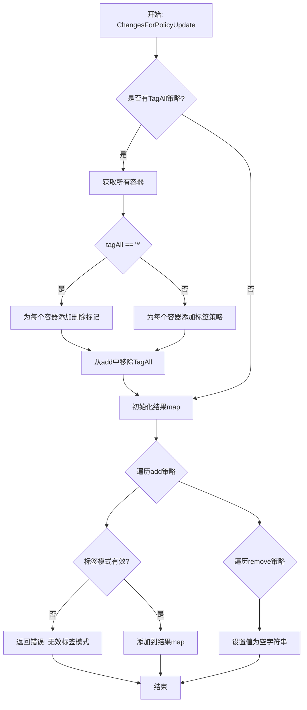
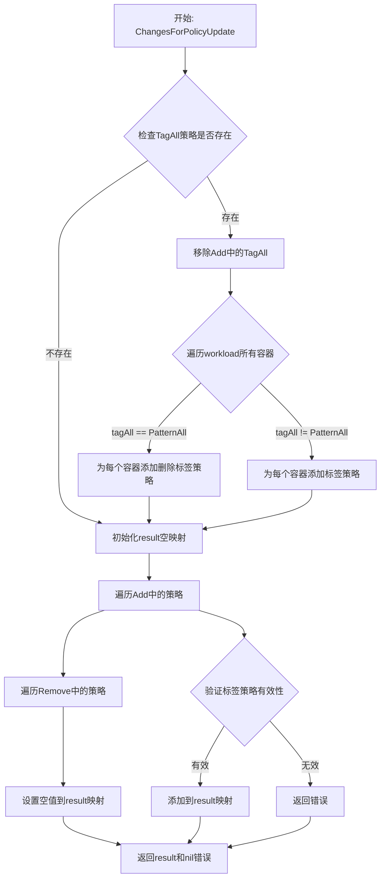

# `flux\pkg\resource\policy.go` 详细设计文档

该代码实现了 Flux CD 中的策略更新处理功能，负责将策略变更（如添加/删除标签策略）应用到工作负载上，特别处理了 TagAll 伪策略以支持批量容器标记，并验证标签模式的合法性，将删除操作转换为空值。

## 整体流程



## 类结构

```
PolicyUpdate (结构体)
├── Add: policy.Set
└── Remove: policy.Set
PolicyUpdates (map类型)
└── map[ID]PolicyUpdate
ChangesForPolicyUpdate (函数)
├── 参数: workload Workload
├── 参数: update PolicyUpdate
└── 返回: (map[string]string, error)
```

## 全局变量及字段


### `PolicyUpdates`
    
策略更新映射，按ID索引

类型：`map[ID]PolicyUpdate`
    


### `PolicyUpdate.Add`
    
要添加的策略集合

类型：`policy.Set`
    


### `PolicyUpdate.Remove`
    
要删除的策略集合

类型：`policy.Set`
    
    

## 全局函数及方法


### ChangesForPolicyUpdate

该函数是Flux CD策略更新处理的核心逻辑，负责将包含添加和删除策略的PolicyUpdate对象转换为适用于命令行参数或环境变量的键值对映射，同时处理特殊的`TagAll`策略以应用于工作负载中的所有容器。

参数：

- `workload`：`Workload`，工作负载对象，提供容器列表以展开TagAll策略
- `update`：`PolicyUpdate`，策略更新对象，包含Add和Remove两个policy.Set类型的策略集

返回值：`map[string]string, error`，返回策略名称到值的映射（删除的策略值为空字符串），若标签模式无效则返回错误

#### 流程图



#### 带注释源码

```go
// ChangesForPolicyUpdate 评估策略更新相对于工作负载的处理
// 存在此函数的原因在于Update可以包含限定策略，例如"tag all containers"；
// 为了进行实际更改，我们需要检查要应用的工作负载。
//
// 这还将策略删除转换为空值（即""），
// 以便轻松用作命令行参数或环境变量。
// 在清单中表示时，策略存在时应具有非空值，即"true"；
// 因此空值可以安全地表示删除。
func ChangesForPolicyUpdate(workload Workload, update PolicyUpdate) (map[string]string, error) {
    // 获取要添加和删除的策略集
    add, del := update.Add, update.Remove
    
    // 我们可能收到伪策略`policy.TagAll`，
    // 这意味着将此过滤器应用到所有容器。为此，我们需要知道所有的容器是什么。
    if tagAll, ok := update.Add.Get(policy.TagAll); ok {
        // 从添加集中移除TagAll，因为已经展开处理
        add = add.Without(policy.TagAll)
        // 遍历工作负载中的所有容器
        for _, container := range workload.Containers() {
            // 如果是通配符模式，则删除该容器的标签策略
            if tagAll == policy.PatternAll.String() {
                del = del.Add(policy.TagPrefix(container.Name))
            } else {
                // 否则添加该容器的标签策略
                add = add.Set(policy.TagPrefix(container.Name), tagAll)
            }
        }
    }

    // 初始化结果映射
    result := map[string]string{}
    // 处理要添加的策略
    for pol, val := range add {
        // 验证标签策略的模式有效性
        if policy.Tag(pol) && !policy.NewPattern(val).Valid() {
            return nil, fmt.Errorf("invalid tag pattern: %q", val)
        }
        // 将策略名称转换为字符串并存储值
        result[string(pol)] = val
    }
    // 处理要删除的策略，设置为空字符串
    for pol, _ := range del {
        result[string(pol)] = ""
    }
    return result, nil
}
```

### 关键组件信息

**PolicyUpdate**

- 策略更新数据结构，包含要添加和删除的策略集合

**PolicyUpdates**

- PolicyUpdate的映射类型，以资源ID为键

**Workload接口**

- 提供Containers()方法返回容器列表，用于展开TagAll策略

**policy.Set**

- 策略集合类型，支持Get、Without、Add、Set等操作

**policy.TagAll**

- 特殊伪策略标识，表示应用到所有容器

**policy.TagPrefix**

- 容器名称前缀，用于生成容器特定的标签策略键

### 潜在的技术债务或优化空间

1. **错误处理粒度**：当前对无效标签模式的错误信息可以更详细，建议包含策略名称和容器信息
2. **性能考虑**：在TagAll展开时，每次调用都会遍历所有容器，如果工作负载包含大量容器，可考虑缓存容器列表
3. **可测试性**：缺少对边界条件的单元测试，如空工作负载、同时存在Add和Remove的冲突策略等
4. **模式验证逻辑**：policy.NewPattern(val).Valid()的调用可以提前到循环外部，避免重复创建Pattern对象

### 其它项目

**设计目标与约束**

- 将策略更新转换为键值对格式以适配命令行/环境变量
- 策略删除用空字符串表示，与清单中的非空值约定区分
- TagAll策略需要访问工作负载容器信息进行展开

**错误处理与异常设计**

- 仅验证标签策略的模式有效性，其他策略类型不进行验证
- 无效模式返回格式化的错误信息，包含具体的无效值

**数据流与状态机**

- 输入：Workload对象 + PolicyUpdate对象（包含Add/Remove两个policy.Set）
- 处理流程：TagAll展开 → 策略验证 → 构建映射
- 输出：map[string]string（策略名→值，删除的策略值=""）

**外部依赖与接口契约**

- 依赖`github.com/fluxcd/flux/pkg/policy`包中的策略操作函数
- 依赖Workload接口的Containers()方法获取容器列表
- 依赖PolicyUpdate结构体的Add和Remove字段（policy.Set类型）

## 关键组件


### ChangesForPolicyUpdate 函数

核心策略更新处理函数，负责将策略更新转换为实际的键值对映射，处理TagAll伪策略并验证标签模式的有效性。

### PolicyUpdate 结构体

策略更新数据结构，包含Add和Remove两个policy.Set类型的字段，分别表示需要添加和删除的策略集合。

### TagAll 处理逻辑

特殊策略处理逻辑，当检测到policy.TagAll时，遍历工作负载的所有容器，根据是否为PatternAll来添加或删除标签前缀策略。

### 标签验证逻辑

对添加的策略进行验证，确保标签策略的值符合有效的正则表达式模式，不合法时返回错误信息。

### 策略删除转换逻辑

将策略删除操作转换为空字符串值，便于在命令行参数或环境变量中使用，同时保持策略在清单中存在非空值的约定。


## 问题及建议


### 已知问题

- **变量命名不清晰**：`pol`、`val`、`del` 等缩写命名降低了代码可读性，应使用更描述性的名称如 `policyPattern`、`value`、`removedPolicies`
- **重复代码模式**：遍历 `add` 和 `del` 两个 map 时使用相似的结构将结果写入 `result`，可提取为通用逻辑
- **类型转换重复**：`string(pol)` 转换在循环中多次出现，可提取为工具函数
- **错误处理粒度过粗**：在遍历 `add` 过程中遇到无效标签模式时直接返回错误，可能导致部分策略已处理但无法获知
- **边界条件处理缺失**：未检查 `tagAll` 是否为空字符串的情况，当 `tagAll == ""` 时的行为未定义
- **TagAll 展开逻辑与主逻辑耦合**：将 `TagAll` 策略展开为具体容器策略的逻辑嵌入在主函数中，难以独立测试和复用
- **PolicyUpdate 结构体缺少文档注释**：公共类型缺乏注释，影响 API 可理解性

### 优化建议

- 重构函数为更小的单一职责单元：提取 `expandTagAllPolicy`、`validateAndAddPolicies`、`applyDeletions` 等独立函数
- 为 `PolicyUpdate` 和 `PolicyUpdates` 类型添加完整的文档注释
- 在函数初期增加参数校验，确保 `workload` 和 `update` 非 nil
- 考虑返回更详细的错误信息，包含失败的具体策略名称
- 统一使用 `errors.Wrap` 或自定义错误类型提供更多上下文
- 提取 `toStringKey` 工具函数避免重复的类型转换


## 其它


### 设计目标与约束

该代码的核心设计目标是将策略更新（PolicyUpdate）转换为适用于工作负载的具体键值对映射，处理`TagAll`伪策略的特殊展开逻辑，并将策略删除转换为空值。约束条件包括：仅支持通过`policy.Tag`验证的标签策略，必须提供有效的工作负载容器信息，且策略值必须符合有效的模式匹配规则。

### 错误处理与异常设计

错误处理采用显式返回error的方式。函数`ChangesForPolicyUpdate`在两种情况下返回错误：1) 当标签模式验证失败时，返回包含无效模式内容的fmt.Errorf；2) 当工作负载容器获取失败时（隐式依赖）。异常场景包括：无效的标签模式字符串、工作负载对象为nil或容器列表为空。所有错误都包含上下文信息以便于调试。

### 外部依赖与接口契约

主要外部依赖包括：1) `github.com/fluxcd/flux/pkg/policy`包，提供`TagAll`、`PatternAll`、`TagPrefix`等策略常量，以及`Tag`、`NewPattern`、`Valid`等验证函数；2) 标准库`fmt`用于错误格式化。接口契约方面，调用方需提供实现`Containers()Containers`方法的工作负载对象，以及包含有效`policy.Set`类型的`PolicyUpdate`结构体。

### 数据流与状态机

数据流分为三个阶段：1) 预处理阶段，处理`TagAll`伪策略，展开为针对各容器的具体标签策略；2) 验证阶段，遍历添加的策略，对标签策略进行模式有效性验证；3) 构建结果阶段，将添加的策略映射到结果字符串映射，将删除的策略映射到空字符串。状态机表现为从输入策略集到最终结果映射的转换过程，无复杂状态管理。

### 并发安全性分析

当前实现为纯函数式设计，不涉及共享状态修改。`PolicyUpdates`和`PolicyUpdate`类型本身不包含并发访问控制，若在多协程环境下使用，需要调用方自行保证并发安全。`ChangesForPolicyUpdate`函数每次调用创建独立的局部变量`result`，无线程安全隐患。

### 边界条件与输入验证

边界条件包括：1) 空的工作负载容器列表不会导致错误，但也不会生成任何容器相关的策略；2) 空`PolicyUpdate`（add和remove均为空）返回空map而非nil；3) `tagAll`值为空字符串时的处理逻辑（会设置空的标签值）。输入验证主要依赖`policy.NewPattern(val).Valid()`的验证结果。

### 版本兼容性考虑

代码依赖于外部包`github.com/fluxcd/flux/pkg/policy`，该包的API变更可能影响功能。当前实现对`policy.TagAll`的处理假设了该策略的存在，若上游包移除此常量将导致编译失败。建议在依赖管理中锁定policy包的版本。

### 可测试性设计

函数设计具有较好的可测试性：1) 输入输出明确，易于构造测试用例；2) 纯函数形式便于单元测试；3) 错误路径可通过传入无效模式触发。建议补充针对`TagAll`展开逻辑、标签模式验证失败、空输入等场景的单元测试。

### 性能特征与优化空间

时间复杂度为O(n+m)，其中n为容器数量，m为策略数量。主要开销在于遍历容器列表和策略映射。潜在优化空间：1) 可预先计算容器名称集合以加速查找；2) 对于大量小容器的场景，可考虑缓存策略转换结果；3) 当前实现每次调用都创建新的map，若调用频繁可考虑对象池模式。

    