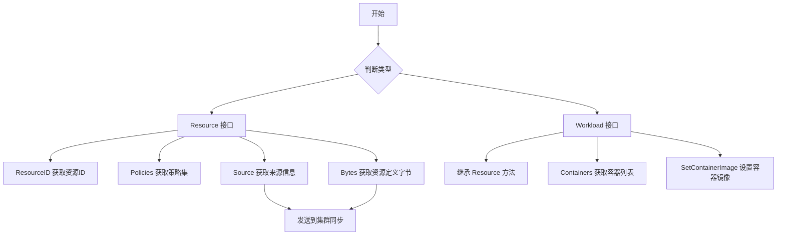
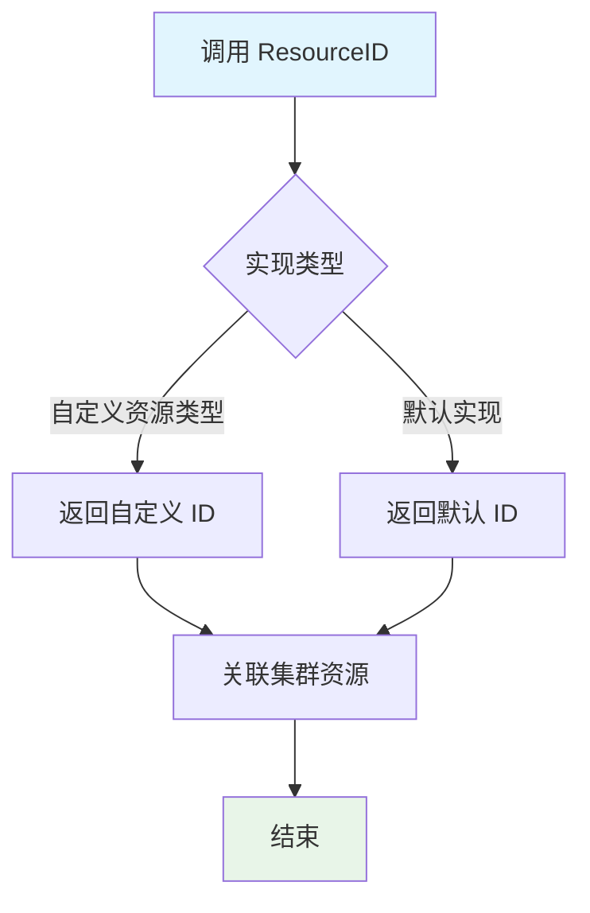
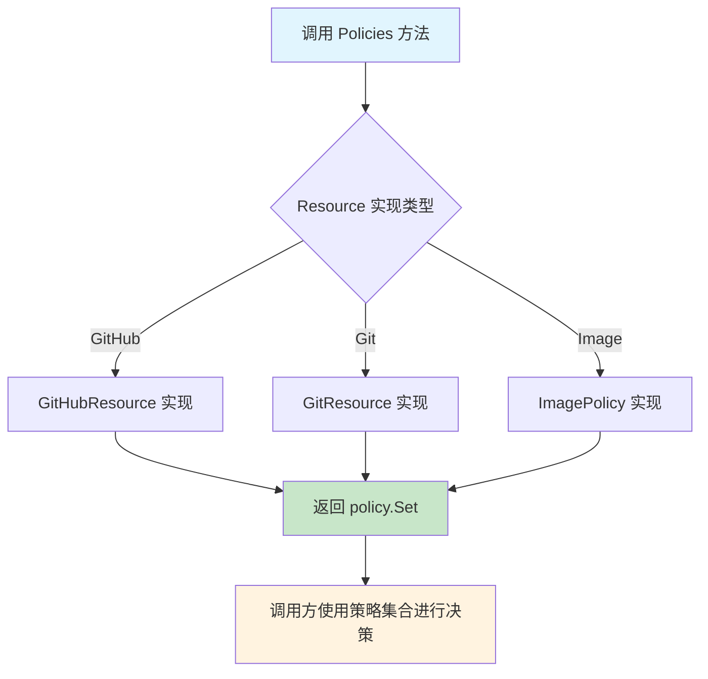
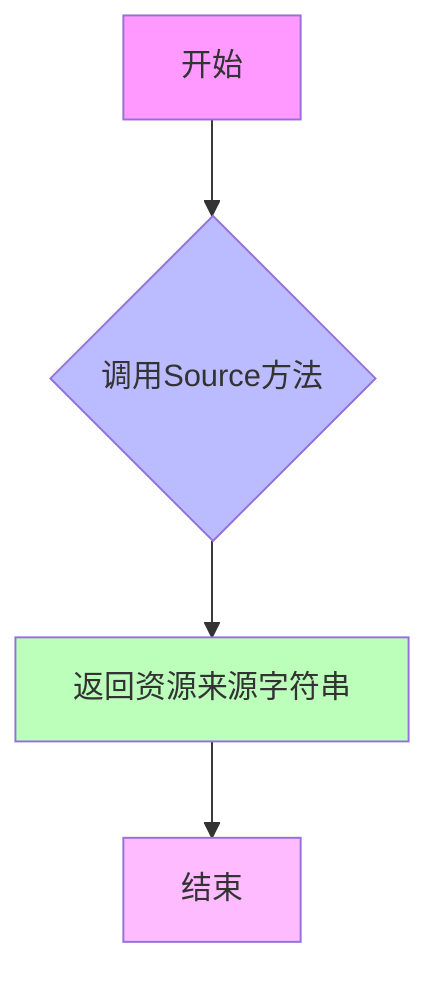
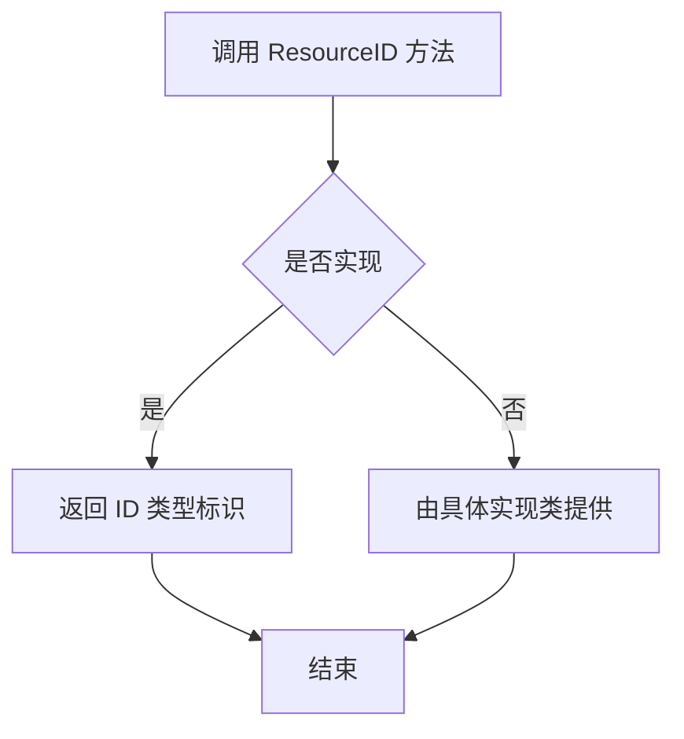
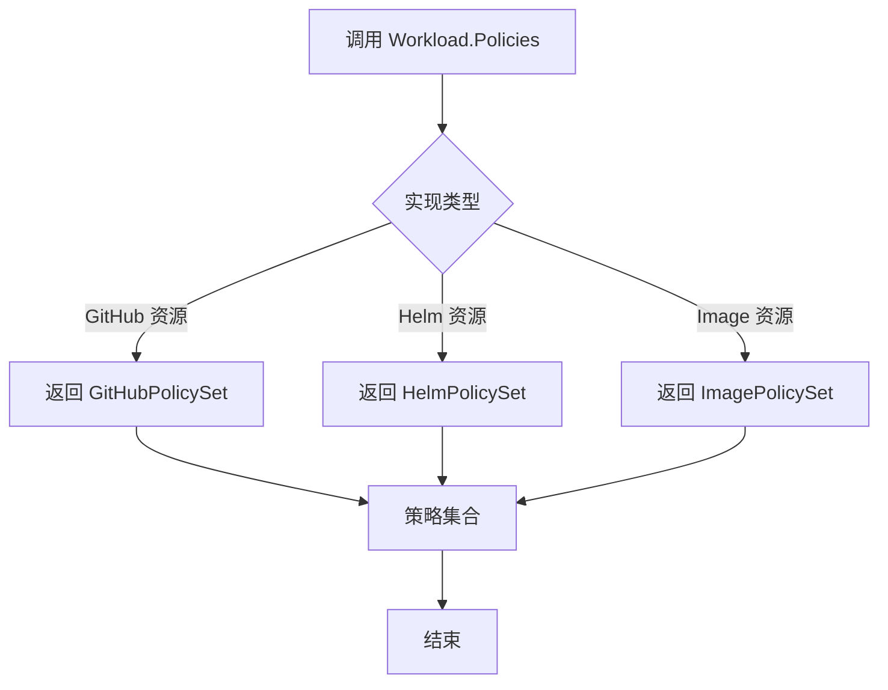
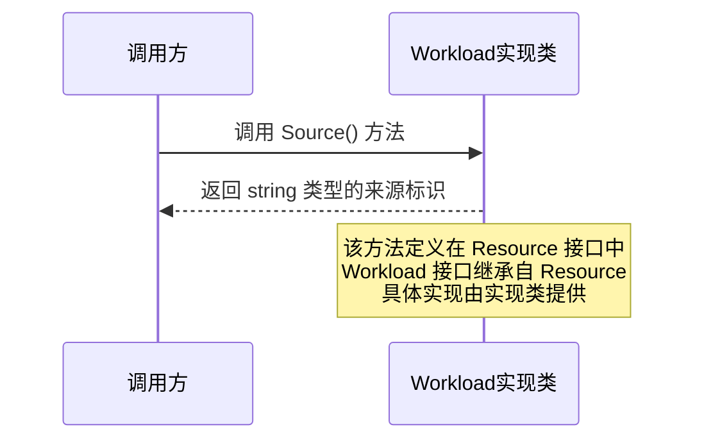
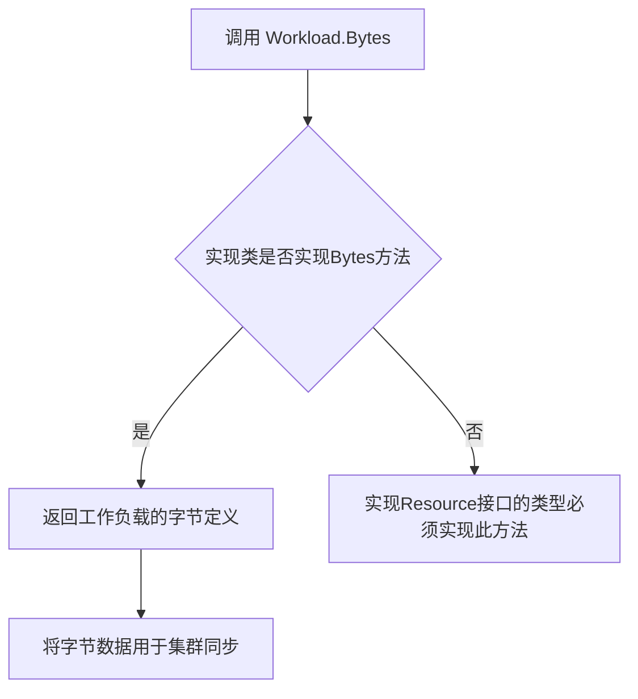
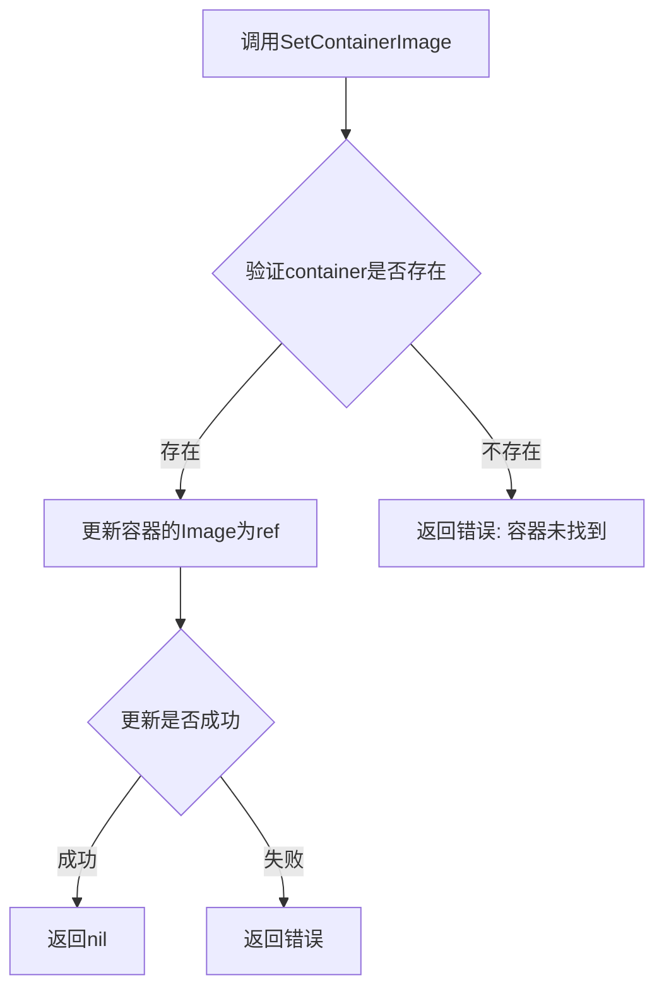

# `flux\pkg\resource\resource.go` 详细设计文档

该文件定义了 Flux CD 项目中资源和工作负载的抽象接口，包括资源标识、策略、容器镜像管理和集群同步的核心抽象，为不同类型的 Kubernetes 资源提供了统一的操作契约。

## 整体流程



## 类结构

```
Resource (接口)
└── Workload (接口，扩展 Resource)
    └── Container (结构体)
```

## 全局变量及字段


### `Container.Name`
    
容器名称

类型：`string`
    


### `Container.Image`
    
容器镜像引用

类型：`image.Ref`
    
    

## 全局函数及方法


### Resource.ResourceID

获取资源标识符，用于关联集群中的资源。

参数： 无

返回值： `ID`，资源标识符，用于在集群中关联和标识具体资源

#### 流程图



#### 带注释源码

```go
// Resource 接口定义了资源的基本行为
type Resource interface {
    // ResourceID 获取资源的唯一标识符
    // 用于在集群中关联和识别具体的资源对象
    // 返回值: ID 类型的唯一标识符
    ResourceID() ID       // name, to correlate with what's in the cluster
    
    // Policies 获取资源的策略集合
    // 包含资源的锁定、自动化、忽略等配置
    Policies() policy.Set // policy for this resource; e.g., whether it is locked, automated, ignored
    
    // Source 获取资源的来源信息
    // 返回资源定义来自何处（用于信息展示）
    Source() string       // where did this come from (informational)
    
    // Bytes 获取资源的原始定义
    // 用于同步到集群时发送资源定义
    Bytes() []byte        // the definition, for sending to cluster.Sync
}
```


### `Resource.Policies`

获取资源的策略集合，如是否锁定、自动化或忽略。该方法是 Resource 接口的抽象方法，用于返回当前资源所关联的策略配置集合。

参数：

- （无参数）

返回值：`policy.Set`，返回资源的策略集合，包含如锁定(locked)、自动化(automated)、忽略(ignored)等策略配置

#### 流程图



#### 带注释源码

```go
// Resource 接口定义了所有资源类型必须实现的抽象方法
type Resource interface {
    // ResourceID 返回资源的唯一标识符，用于与集群中的资源进行关联
    ResourceID() ID
    
    // Policies 返回当前资源的策略集合
    // 策略可以包含以下配置：
    // - locked: 资源被锁定，禁止自动同步
    // - automated: 资源启用自动化更新
    // - ignored: 资源被忽略，不进行任何处理
    // 返回的 policy.Set 是一个策略集合，可以包含多个策略配置
    Policies() policy.Set
    
    // Source 返回资源的来源信息，用于追溯资源的定义来源
    Source() string
    
    // Bytes 返回资源的原始定义数据，用于发送到集群进行同步
    Bytes() []byte
}

// policy.Set 是策略集合的类型定义
// 在 Flux CD 系统中用于管理资源的各种策略配置
type Set map[policy.ResourcePattern]policy.Set
```

#### 说明

`Policies()` 方法是 Flux CD 资源模型的核心抽象之一，它将资源的策略配置（锁定、自动化、忽略等）与资源本身解耦。这种设计允许：

1. **统一接口**：无论资源来自 GitHub、Git 仓库还是其他来源，都通过统一的 `Policies()` 方法获取策略
2. **策略驱动**：系统其他组件可以仅通过策略集合来决策如何处理资源
3. **灵活性**：不同的资源实现可以有不同的策略获取逻辑（如从注解、标签或配置文件中读取）

该方法没有参数，因为策略是内嵌在资源对象自身的数据结构中的。


### `Resource.Source`

获取资源来源信息，用于标识该资源来自哪个配置源或位置

参数：

- （无参数）

返回值：`string`，资源的来源标识（例如文件名、配置源URL等）

#### 流程图



#### 带注释源码

```go
// Resource 接口定义了所有资源类型必须实现的方法
type Resource interface {
    // ResourceID 返回资源的唯一标识符，用于与集群中的资源进行关联
    ResourceID() ID
    
    // Policies 返回该资源的策略集合，例如是否锁定、自动化或忽略
    Policies() policy.Set
    
    // Source 返回资源的来源信息
    // 这是一个字符串，表示资源来自哪里（例如文件名、配置路径等）
    // 用于信息展示和调试目的
    Source() string
    
    // Bytes 返回资源的定义内容，用于同步到集群
    Bytes() []byte
}

// 示例实现
type exampleResource struct {
    id      ID
    source  string
    bytes   []byte
}

// Source 实现 Resource 接口的 Source 方法
func (r *exampleResource) Source() string {
    // 返回资源的来源信息
    // 这通常在资源创建时设置，可以是文件名、配置源URL等
    return r.source
}
```


### Resource.Bytes

获取资源定义，用于发送到集群同步

参数：
- （无参数）

返回值：`[]byte`，资源定义的字节表示，用于发送到集群进行同步

#### 流程图

```mermaid
flowchart TD
    A[调用 Bytes] --> B{获取资源定义}
    B --> C[返回 []byte]
    C --> D[用于集群同步]
```

#### 带注释源码

```go
// Resource 接口定义了资源的基本行为
type Resource interface {
    // ResourceID 返回资源的唯一标识符，用于与集群中的资源关联
    ResourceID() ID
    
    // Policies 返回资源的策略集合，如是否锁定、自动化或忽略
    Policies() policy.Set
    
    // Source 返回资源的来源信息（用于信息展示）
    Source() string
    
    // Bytes 返回资源的定义内容，用于发送到集群进行同步
    // 返回类型为字节切片 []byte
    Bytes() []byte
}
```


### Workload.ResourceID

继承自 Resource 接口，用于获取工作负载的唯一标识符。

参数：

- 无参数

返回值：`ID`，工作负载的唯一标识符，用于与集群中的资源进行关联

#### 流程图



#### 带注释源码

```go
// Workload 接口嵌入 Resource 接口，因此继承了 ResourceID 方法
// ResourceID() ID 方法定义在 Resource 接口中
// 这里展示的是接口定义，而非具体实现
type Workload interface {
	Resource                          // 嵌入 Resource 接口，继承其方法
	Containers() []Container          // 获取容器列表
	SetContainerImage(container string, ref image.Ref) error // 设置容器镜像
}

// Resource 接口定义
type Resource interface {
	ResourceID() ID       // 获取资源ID，用于与集群中的资源关联
	Policies() policy.Set // 获取资源策略（如锁定、自动化、忽略等）
	Source() string       // 获取资源来源（信息用）
	Bytes() []byte        // 获取资源定义，用于发送给集群进行同步
}
```


### `Workload.Policies`

继承自 `Resource` 接口，用于获取工作负载的策略信息，例如工作负载是否被锁定、自动化或忽略等。

参数： 无

返回值：`policy.Set`，返回工作负载的策略集合

#### 流程图



#### 带注释源码

```go
// Workload 接口定义
// 继承自 Resource 接口，因此包含以下方法：
//   - ResourceID() ID
//   - Policies() policy.Set
//   - Source() string
//   - Bytes() []byte
type Workload interface {
    Resource  // 嵌入 Resource 接口，继承其所有方法
    
    // Containers 返回该工作负载管理的容器列表
    Containers() []Container
    
    // SetContainerImage 设置指定容器的镜像
    // 参数：
    //   - container: 容器名称
    //   - ref: 镜像引用
    // 返回值：设置成功返回 nil，否则返回错误
    SetContainerImage(container string, ref image.Ref) error
}

// Resource 接口定义
type Resource interface {
    // ResourceID 返回资源的唯一标识符
    ResourceID() ID
    
    // Policies 返回资源的策略集合
    // 例如：锁定(locked)、自动化(automated)、忽略(ignored)等策略
    Policies() policy.Set
    
    // Source 返回资源的来源信息
    Source() string
    
    // Bytes 返回资源的定义数据，用于同步到集群
    Bytes() []byte
}

// 注意：Policies() 方法是 Resource 接口的方法
// 由于 Workload 嵌入了 Resource 接口，因此 Workload 也具有 Policies() 方法
// 该方法由实现了 Workload 接口的具体类型提供实现
```


### `Workload.Source`

继承自 `Resource` 接口，获取工作负载的来源信息，用于标识该工作负载的来源（例如来自哪个仓库或配置源）。

参数： 无

返回值：`string`，工作负载的来源标识字符串

#### 流程图



#### 带注释源码

```go
// Resource 接口定义了所有资源共有的方法
type Resource interface {
    ResourceID() ID       // 获取资源ID，用于与集群中的资源关联
    Policies() policy.Set // 获取资源的策略，如是否锁定、自动化或忽略
    Source() string       // 获取资源来源（信息性）
    Bytes() []byte        // 获取资源定义，用于发送给集群的 Sync
}

// Workload 接口继承自 Resource，表示工作负载资源
type Workload interface {
    Resource  // 继承 Resource 接口的所有方法，包括 Source()
    Containers() []Container  // 获取容器列表
    // SetContainerImage 修改工作负载中指定容器的镜像
    // 不会影响底层文件或集群资源
    SetContainerImage(container string, ref image.Ref) error
}

// Source() 方法签名定义在 Resource 接口中
// Workload 继承自 Resource，因此 Workload 实例可以调用 Source() 方法
// 该方法返回工作负载的来源信息字符串
//
// 使用示例:
//   workload := getWorkload()
//   source := workload.Source()  // 返回如 "git://github.com/user/repo" 等来源信息
```


### Workload.Bytes

继承自 Resource 接口的方法，用于获取工作负载定义的字节表示，以便发送给集群进行同步操作。

参数：
- 无

返回值：`[]byte`，获取工作负载定义字节

#### 流程图



#### 带注释源码

```go
// Workload 接口定义
type Workload interface {
    Resource  // 继承Resource接口
    
    // Containers 返回工作负载中的容器列表
    Containers() []Container
    
    // SetContainerImage 变更指定容器的镜像
    // 参数:
    //   - container: 容器名称
    //   - ref: 新的镜像引用
    // 返回: 变更成功返回nil，否则返回错误
    SetContainerImage(container string, ref image.Ref) error
}

// Resource 接口定义（Workload继承自此接口）
type Resource interface {
    // ResourceID 返回资源ID，用于与集群中的资源关联
    ResourceID() ID
    
    // Policies 返回资源的策略集合，如是否锁定、自动化或忽略
    Policies() policy.Set
    
    // Source 返回资源来源信息
    Source() string
    
    // Bytes 返回资源的定义字节，用于发送给集群.Sync方法
    // 这是Workload.Bytes方法的核心实现来源
    Bytes() []byte
}
```


### Workload.Containers

获取工作负载中的容器列表，返回该工作负载所管理的所有容器对象。

参数：

- （无参数）

返回值：`[]Container`，返回工作负载中所有容器的切片，包含每个容器的名称和镜像引用。

#### 流程图

```mermaid
flowchart TD
    A[调用 Workload.Containers] --> B{实现类是否实现该方法}
    B -->|是| C[返回 []Container 切片]
    B -->|否| D[返回空切片或 panic]
    
    C --> E[遍历容器列表]
    E --> F[获取容器 Name 和 Image]
    
    style A fill:#f9f,stroke:#333
    style C fill:#9f9,stroke:#333
    style F fill:#ff9,stroke:#333
```

#### 带注释源码

```go
// Workload 接口定义了工作负载的通用抽象
// 工作负载代表一个可部署的应用单元（如 Deployment、StatefulSet 等）
type Workload interface {
	Resource // 嵌入 Resource 接口，继承资源相关方法
	
	// Containers 获取工作负载中的容器列表
	// 返回 []Container 类型，包含该工作负载下所有容器的切片
	// 每个 Container 包含 Name（容器名称）和 Image（镜像引用）
	Containers() []Container
	
	// SetContainerImage 变更指定容器的镜像
	// 参数 container: 目标容器名称
	// 参数 ref: 新的镜像引用
	// 返回 error: 如果容器不存在或变更失败则返回错误
	SetContainerImage(container string, ref image.Ref) error
}
```


### Workload.SetContainerImage

修改指定容器的镜像引用，用于在内存中更新工作负载的容器镜像配置，不会直接影响底层文件或集群资源。

参数：

- `container`：`string`，容器名称，指定需要更新镜像的容器名称
- `ref`：`image.Ref`，新的镜像引用，指向新的镜像版本

返回值：`error`，如果操作成功返回nil，如果容器不存在或其他错误则返回相应的错误信息

#### 流程图



#### 带注释源码

```go
package resource

import (
	"github.com/fluxcd/flux/pkg/image"
	"github.com/fluxcd/flux/pkg/policy"
)

// Resource 接口定义了资源的基本行为
// 用于与集群中的资源进行关联和策略管理
type Resource interface {
	ResourceID() ID       // name, to correlate with what's in the cluster
	Policies() policy.Set // policy for this resource; e.g., whether it is locked, automated, ignored
	Source() string       // where did this come from (informational)
	Bytes() []byte        // the definition, for sending to cluster.Sync
}

// Container 表示一个容器及其镜像引用
type Container struct {
	Name  string    // 容器名称
	Image image.Ref // 容器使用的镜像引用
}

// Workload 接口定义了工作负载的标准行为
// 工作负载是集群中运行的应用单元，如Deployment、DaemonSet等
type Workload interface {
	Resource // 继承Resource接口
	
	// Containers 返回工作负载中的所有容器列表
	Containers() []Container
	
	// SetContainerImage mutates this workload so that the container
	// named has the image given. This is not expected to have an
	// effect on any underlying file or cluster resource.
	// 
	// 参数:
	//   - container: 容器名称，指定需要更新镜像的容器
	//   - ref: 新的镜像引用
	//
	// 返回值:
	//   - error: 操作结果，nil表示成功，非nil表示失败原因
	//
	// 注意: 此方法仅修改内存中的工作负载对象，不会自动同步到集群
	SetContainerImage(container string, ref image.Ref) error
}
```

## 关键组件


### Resource 接口

核心资源抽象接口，定义了所有资源必须实现的通用方法，包括资源标识、策略管理、来源追踪和资源定义序列化。

### Container 结构体

容器的基本数据结构，用于表示单个容器的名称和镜像引用，是Workload的组成部分。

### Workload 接口

工作负载接口，继承Resource并扩展了容器管理功能，支持获取容器列表和动态修改容器镜像，提供了在不修改底层文件或集群资源的情况下更新镜像的能力。

### 策略系统 (policy.Set)

FluxCD的策略管理组件，用于定义资源的自动化、锁定、忽略等策略，控制资源的生命周期和行为。


## 问题及建议


### 已知问题

-   注释不完整：第7行的注释"For the minute we just care about"未完成，缺乏对代码功能的完整说明
-   接口职责不清晰：Resource接口包含多个不同职责的方法（ID、策略、源、字节定义），可能违反接口隔离原则
-   错误处理不明确：SetContainerImage方法返回error但未定义具体的错误类型，调用者无法进行细粒度的错误处理
-   缺乏验证逻辑：Container结构体没有对Name和Image字段的验证，Name可能为空或包含非法字符
-   文档缺失：缺少包级别和公开类型的文档注释
-   外部依赖耦合：直接依赖外部包`github.com/fluxcd/flux/pkg/image`和`github.com/fluxcd/flux/policy`，但未指定版本约束
-   命名不一致：方法名使用Source()但语义上可能表示"来源"或"源定义"，语义不够清晰

### 优化建议

-   完善代码注释：为包、接口、结构体和方法添加完整的文档注释
-   定义具体错误类型：创建自定义错误类型或定义错误常量，用于SetContainerImage等方法
-   添加验证方法：为Container结构体添加Validate()方法或在构造时进行校验
-   考虑拆分接口：将Resource接口按职责拆分为更小的接口，提高灵活性
-   添加构造函数：提供NewContainer等构造函数确保对象创建时的一致性
-   明确依赖版本：在go.mod中锁定外部依赖版本
-   扩展接口方法：考虑添加IsValid()等方法用于资源有效性检查


## 其它


### 设计目标与约束

本代码定义了Kubernetes资源抽象的核心接口，旨在解耦FluxCD与具体资源实现之间的关系，支持对多种工作负载类型的统一管理。设计约束包括：必须实现Resource接口以支持集群同步；Workload实现必须支持容器镜像的动态更新；所有实现需兼容Flux现有的策略和镜像引用系统。

### 错误处理与异常设计

SetContainerImage方法返回error类型用于处理以下异常场景：容器名称不存在时返回明确错误信息；镜像引用格式无效时返回解析错误；底层资源状态不一致时返回冲突错误。Resource接口的各方法理论上不应返回错误，由实现类自行保证数据一致性。

### 数据流与状态机

数据流主要分为三部分：1) 资源定义从YAML/JSON解析为Resource对象；2) Workload对象通过SetContainerImage进行镜像更新；3) Bytes()方法将内存对象序列化后发送给集群。状态机体现在Workload的容器镜像状态变化：原始状态 → SetContainerImage调用 → 更新后的镜像引用。

### 外部依赖与接口契约

外部依赖包括：github.com/fluxcd/flux/pkg/image包提供镜像引用类型；github.com/fluxcd/flux/pkg/policy包提供策略集合类型。接口契约规定：任何实现Resource的类型必须提供有效的ResourceID、Policies、Source和Bytes；任何实现Workload的类型必须支持容器枚举和镜像设置功能。

### 并发与线程安全

本代码仅定义接口，不涉及并发控制。具体实现类需要根据业务场景自行决定是否需要并发保护。通常Bytes()方法在多协程访问时需要考虑线程安全，建议实现类提供适当的同步机制或使用不可变对象。

### 性能考虑

Bytes()方法可能被频繁调用，建议实现类缓存序列化结果或采用延迟计算策略。Policies()方法在每次访问时返回policy.Set深拷贝，避免外部修改影响内部状态。Container切片在大量容器场景下需考虑内存分配优化。

### 安全考虑

Source()方法返回的来源信息需注意不暴露敏感路径或凭证信息。Bytes()方法返回的定义内容可能包含敏感配置，需确保调用方正确处理。镜像引用中的认证信息需妥善管理，不应在日志或错误信息中明文输出。

### 版本兼容性

当前接口设计保持了向后兼容性，新增方法遵循Go接口兼容原则。建议在文档中明确标注各接口方法的稳定性级别：Resource接口方法为稳定API；Workload接口的SetContainerImage方法为稳定API。

### 测试策略建议

应编写针对各接口实现的单元测试，覆盖：有效和无效的容器名称场景；各种镜像引用格式的解析；策略集合的合并和冲突处理；Bytes()序列化与反序列化的正确性验证。

### 配置说明

本代码为纯接口定义，不涉及运行时配置。实现类可能需要通过环境变量或配置文件获取集群连接信息、默认策略等配置参数，具体由实现类自行定义。

### 部署注意事项

作为FluxCD核心资源定义模块，此代码编译为库供其他包引用。部署时需确保依赖版本兼容：image包和policy包的版本需与FluxCD主版本匹配；Go版本需满足1.11模块支持要求。


    