# `flux\pkg\ssh\keygen.go` 详细设计文档

这是一个SSH密钥生成和指纹提取的Go包，提供SSH密钥对生成功能，支持自定义密钥位数、类型和格式，同时能够从私钥中提取公钥和多种哈希算法(md5/sha256)的指纹信息。

## 整体流程

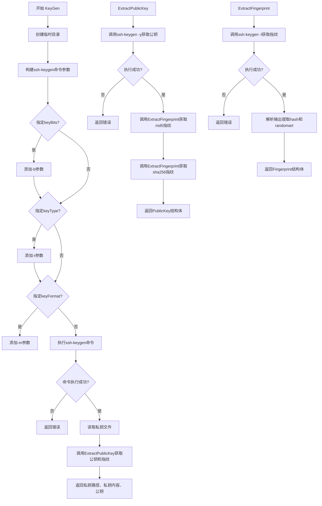

## 类结构

```
OptionalValue (接口)
├── KeyBitsValue (实现OptionalValue)
├── KeyTypeValue (实现OptionalValue)
└── KeyFormatValue (实现OptionalValue)

Fingerprint (数据结构)
PublicKey (数据结构)
```

## 全局变量及字段


### `fieldRegexp`
    
正则表达式，用于解析ssh-keygen -l输出

类型：`*regexp.Regexp`
    


### `captureCount`
    
正则表达式捕获组数量(6)

类型：`int`
    


### `KeyBitsValue.specified`
    
标记是否已指定该值

类型：`bool`
    


### `KeyBitsValue.keyBits`
    
密钥位数

类型：`uint64`
    


### `KeyTypeValue.specified`
    
标记是否已指定该值

类型：`bool`
    


### `KeyTypeValue.keyType`
    
密钥类型(rsa/dsa/ecdsa等)

类型：`string`
    


### `KeyFormatValue.specified`
    
标记是否已指定该值

类型：`bool`
    


### `KeyFormatValue.keyFormat`
    
密钥格式

类型：`string`
    


### `Fingerprint.Hash`
    
指纹哈希值

类型：`string`
    


### `Fingerprint.Randomart`
    
随机艺术图

类型：`string`
    


### `PublicKey.Key`
    
公钥内容

类型：`string`
    


### `PublicKey.Fingerprints`
    
多种哈希算法的指纹

类型：`map[string]Fingerprint`
    
    

## 全局函数及方法


### `KeyGen`

生成SSH密钥对的主函数，通过调用系统ssh-keygen工具在tmpfs临时目录中创建非加密的私钥和对应的公钥，并提取公钥的指纹信息。

参数：

- `keyBits`：`OptionalValue`，可选的密钥位数参数，用于指定密钥的比特长度（如2048、4096等）
- `keyType`：`OptionalValue`，可选的密钥类型参数，用于指定密钥算法类型（如rsa、ed25519、ecdsa等）
- `keyFormat`：`OptionalValue`，可选的密钥格式参数，用于指定密钥文件格式（如PEM、RFC4716等）
- `tmpfsPath`：`string`，tmpfs挂载点路径，用于存储生成的私钥文件（因私钥未加密，需存放在内存文件系统以提升安全性）

返回值：

- `privateKeyPath`：`string`，生成的私钥文件的绝对路径
- `privateKey`：`[]byte`，私钥文件的内容（字节数组）
- `publicKey`：`PublicKey`，包含公钥内容和多种指纹哈希（MD5、SHA256）的结构体
- `err`：`error`，执行过程中的错误信息，若成功则返回nil

#### 流程图

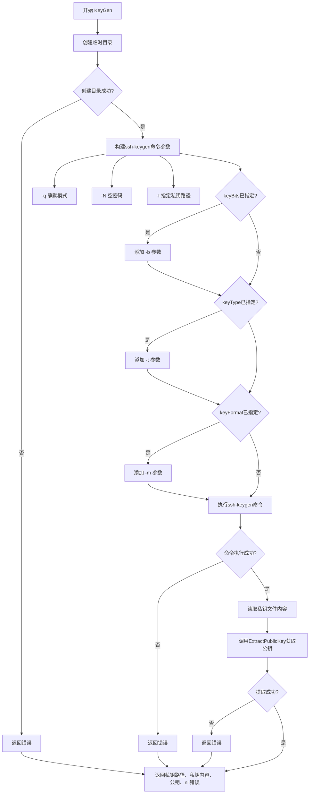

#### 带注释源码

```go
// KeyGen generates a new keypair with ssh-keygen, optionally overriding the
// default type and size. Each generated keypair is written to a new unique
// subdirectory of tmpfsPath, which should point to a tmpfs mount as the
// private key is not encrypted.
// KeyGen 生成一个新的密钥对，可选地覆盖默认类型和大小。
// 每个生成的密钥对都写入tmpfsPath的新唯一子目录，
// 该目录应指向tmpfs挂载点，因为私钥未加密。
func KeyGen(keyBits, keyType, keyFormat OptionalValue, tmpfsPath string) (privateKeyPath string, privateKey []byte, publicKey PublicKey, err error) {
	// Step 1: 在tmpfsPath下创建临时目录，目录名前缀为"..weave-keygen"
	tempDir, err := ioutil.TempDir(tmpfsPath, "..weave-keygen")
	if err != nil {
		// 如果创建失败，返回空值和错误
		return "", nil, PublicKey{}, err
	}

	// Step 2: 构造私钥文件路径（临时目录下的identity文件）
	privateKeyPath = path.Join(tempDir, "identity")

	// Step 3: 构建ssh-keygen命令的基础参数
	// -q: 静默模式，减少输出
	// -N "": 空密码，不对私钥加密
	// -f: 指定私钥输出路径
	args := []string{"-q", "-N", "", "-f", privateKeyPath}

	// Step 4: 如果用户指定了keyBits，添加-b参数
	if keyBits.Specified() {
		args = append(args, "-b", keyBits.String())
	}

	// Step 5: 如果用户指定了keyType，添加-t参数
	if keyType.Specified() {
		args = append(args, "-t", keyType.String())
	}

	// Step 6: 如果用户指定了keyFormat，添加-m参数
	if keyFormat.Specified() {
		args = append(args, "-m", keyFormat.String())
	}

	// Step 7: 执行ssh-keygen命令生成密钥对
	cmd := exec.Command("ssh-keygen", args...)
	if err := cmd.Run(); err != nil {
		// 命令执行失败，返回错误
		return "", nil, PublicKey{}, err
	}

	// Step 8: 读取生成的私钥文件内容
	privateKey, err = ioutil.ReadFile(privateKeyPath)
	if err != nil {
		return "", nil, PublicKey{}, err
	}

	// Step 9: 调用ExtractPublicKey提取公钥信息（包括指纹）
	publicKey, err = ExtractPublicKey(privateKeyPath)
	if err != nil {
		return "", nil, PublicKey{}, err
	}

	// Step 10: 返回所有结果
	return privateKeyPath, privateKey, publicKey, nil
}
```


### ExtractFingerprint

该函数通过调用系统ssh-keygen工具，提取指定私钥文件对应的公钥指纹信息（包含哈希值和随机艺术图），支持多种哈希算法（如md5、sha256）。

参数：
- `privateKeyPath`：`string`，私钥文件的路径
- `hashAlgo`：`string`，哈希算法名称（如"md5"或"sha256"）

返回值：`Fingerprint, error`，成功时返回包含哈希值和随机艺术图的Fingerprint结构体，失败时返回错误信息

#### 流程图

```mermaid
flowchart TD
    A[开始 ExtractFingerprint] --> B[构建 ssh-keygen 命令]
    B --> C[执行命令: ssh-keygen -l -v -E hashAlgo -f privateKeyPath]
    C --> D{命令执行是否成功?}
    D -->|否| E[返回空Fingerprint和错误]
    D -->|是| F[获取命令输出 output]
    F --> G[查找输出中第一个换行符位置 i]
    G --> H{是否找到换行符?}
    H -->|否| I[返回错误: could not parse fingerprint]
    H -->|是| J[使用正则表达式解析第一行]
    J --> K{正则匹配是否成功?}
    K -->|否| L[返回错误: could not parse fingerprint]
    K -->|是| M[提取 fields[3] 作为 Hash]
    M --> N[提取换行符后内容作为 Randomart]
    N --> O[构建并返回 Fingerprint 结构体]
```

#### 带注释源码

```go
// Fingerprint extracts and returns the hash and randomart of the public key
// associated with the specified private key.
func ExtractFingerprint(privateKeyPath, hashAlgo string) (Fingerprint, error) {
	// 执行 ssh-keygen 命令获取指纹信息
	// -l: 显示指纹信息
	// -v: 显示随机艺术图
	// -E: 指定哈希算法 (md5 或 sha256)
	// -f: 指定私钥文件路径
	output, err := exec.Command("ssh-keygen", "-l", "-v", "-E", hashAlgo, "-f", privateKeyPath).Output()
	if err != nil {
		// 如果命令执行失败，返回空Fingerprint和错误
		return Fingerprint{}, err
	}

	// 查找输出中第一个换行符的位置，用于分离指纹行和随机艺术图
	i := bytes.IndexByte(output, '\n')
	if i == -1 {
		// 没有找到换行符，无法解析
		return Fingerprint{}, fmt.Errorf("could not parse fingerprint")
	}

	// 使用正则表达式解析指纹行
	// 正则表达式: ^(\d+) ([^:]+):([^ ]+) (.*?) \(([^)]+)\)$
	// 匹配格式如: 256 SHA256:xxxxxxx... user@host (ED25519)
	fields := fieldRegexp.FindSubmatch(output[:i])
	if len(fields) != captureCount {
		// 正则匹配失败或字段数量不对
		return Fingerprint{}, fmt.Errorf("could not parse fingerprint")
	}

	// 返回解析出的指纹信息
	// fields[3] 是哈希值部分 (如 SHA256:xxxx 或 xx:xx:xx:...)
	return Fingerprint{
		Hash:      string(fields[3]),      // 提取哈希值
		Randomart: string(output[i+1:]),   // 提取随机艺术图(换行符后的所有内容)
	}, nil
}
```


### `ExtractPublicKey`

该函数是 SSH 密钥处理模块的核心导出方法之一。它接收一个私钥文件路径，调用本地系统的 `ssh-keygen` 工具生成对应的公钥（Public Key），并同时计算该公钥的 MD5 和 SHA256 两种哈希算法的指纹（Fingerprint），最终将结果封装进 `PublicKey` 结构体供外部使用。

参数：
- `privateKeyPath`：`string`，指定私钥文件的路径，用于 `ssh-keygen` 读取私钥并生成公钥。

返回值：
- `PublicKey`：包含公钥字符串（`Key`）及指纹映射（`Fingerprints`，包含 md5 和 sha256 两种）的结构体。
- `error`：如果执行 `ssh-keygen` 失败、文件无法读取或指纹计算失败，则返回错误。

#### 流程图

```mermaid
graph TD
    A[开始 ExtractPublicKey] --> B[执行 ssh-keygen -y -f privateKeyPath]
    B --> C{命令执行是否成功?}
    C -- 否 --> D[返回错误: 无法提取公钥]
    C -- 是 --> E[调用 ExtractFingerprint(privateKeyPath, 'md5')]
    E --> F{MD5 指纹提取成功?}
    F -- 否 --> G[返回错误]
    F -- 是 --> H[调用 ExtractFingerprint(privateKeyPath, 'sha256')]
    H --> I{SHA256 指纹提取成功?}
    I -- 否 --> J[返回错误]
    I -- 是 --> K[组装 PublicKey 对象]
    K --> L[返回 PublicKey 和 nil]
    D --> M[结束]
    G --> M
    J --> M
    L --> M
```

#### 带注释源码

```go
// ExtractPublicKey extracts and returns the public key from the specified
// private key, along with its fingerprint hashes.
// 参数: privateKeyPath string - 私钥文件的路径
// 返回值: PublicKey - 包含公钥和指纹的结构体; error - 过程中的错误
func ExtractPublicKey(privateKeyPath string) (PublicKey, error) {
	// 1. 使用 ssh-keygen -y -f <path> 从私钥提取公钥
	// CombinedOutput 既获取 stdout 也获取 stderr，方便出错时诊断
	keyBytes, err := exec.Command("ssh-keygen", "-y", "-f", privateKeyPath).CombinedOutput()
	if err != nil {
		// 如果执行失败（例如文件不存在、权限不足），返回错误
		// 将命令输出作为错误信息的一部分返回，提高可调试性
		return PublicKey{}, errors.New(string(keyBytes))
	}

	// 2. 计算 MD5 指纹
	md5Print, err := ExtractFingerprint(privateKeyPath, "md5")
	if err != nil {
		return PublicKey{}, err
	}

	// 3. 计算 SHA256 指纹
	sha256Print, err := ExtractFingerprint(privateKeyPath, "sha256")
	if err != nil {
		return PublicKey{}, err
	}

	// 4. 封装结果并返回
	// 构建包含公钥内容和双指纹的 PublicKey 结构体
	return PublicKey{
		Key: string(keyBytes), // 将公钥字节转换为字符串
		Fingerprints: map[string]Fingerprint{
			"md5":    md5Print,
			"sha256": sha256Print,
		},
	}, nil
}
```


### `OptionalValue`

`OptionalValue` 是一个扩展自 `pflag.Value` 的接口，用于表示可选的命令行参数值。该接口在嵌入 `pflag.Value` 接口的基础上，额外添加了 `Specified()` 方法，用于记忆该值是否已被用户显式设置。这使得程序能够区分“用户未提供该参数”（使用默认值）與“用户明确设置该参数”的情况。

参数：无需参数（接口定义）

返回值：无需返回值（接口定义）

#### 流程图

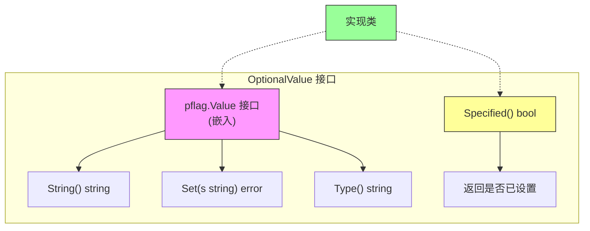

#### 带注释源码

```go
// OptionalValue is an extension of pflag.Value that remembers if it has been
// set.
//
// 该接口扩展了 spf13/pflag 包中的 Value 接口，添加了 Specified() 方法来
// 记录该值是否被用户显式指定。这在处理可选命令行参数时非常有用，可以区分
// "使用默认值"和"用户明确设置为默认值"两种情况。
//
// 实现该接口的类型需要同时实现 pflag.Value 接口的三个方法：
// - String() string: 返回值的字符串表示
// - Set(s string) error: 设置值的方法，接受字符串参数
// - Type() string: 返回值的类型描述
//
// 额外的 Specified() bool 方法用于判断该值是否已被设置。
type OptionalValue interface {
	pflag.Value  // 嵌入 pflag.Value 接口，包含 String()、Set()、Type() 三个方法
	Specified() bool  // 判断该可选值是否已被显式设置
}
```


### `OptionalValue.Specified() bool`

该方法是 `OptionalValue` 接口的核心方法，用于判断命令行参数是否已被显式设置。它通过返回一个布尔值来指示该可选值是否在命令行中被用户指定，从而允许调用者区分默认值和用户显式提供的值。

参数：该方法没有参数。

返回值：`bool`，返回 true 表示该可选值已被显式设置（指定），返回 false 表示使用默认值。

#### 流程图

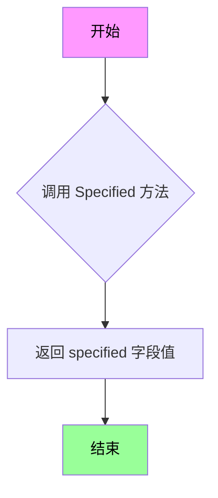

#### 带注释源码

```go
// OptionalValue 是 pflag.Value 的扩展接口，用于记住值是否已被设置。
// 它包含一个 Specified() bool 方法来判断值是否被显式指定。
type OptionalValue interface {
	pflag.Value
	Specified() bool
}

// KeyBitsValue 是一个 OptionalValue，用于指定 ssh-keygen 的 -b 参数（密钥位数）
type KeyBitsValue struct {
	specified bool  // 标记该值是否已被显式设置
	keyBits   uint64 // 密钥位数
}

// Specified 返回该值是否已被显式指定
// 返回值：bool - true 表示已指定，false 表示使用默认值
func (kbv *KeyBitsValue) Specified() bool {
	return kbv.specified
}

// KeyTypeValue 是一个 OptionalValue，用于指定 ssh-keygen 的 -t 参数（密钥类型）
type KeyTypeValue struct {
	specified bool  // 标记该值是否已被显式设置
	keyType   string // 密钥类型（如 rsa, ed25519 等）
}

// Specified 返回该值是否已被显式指定
func (ktv *KeyTypeValue) Specified() bool {
	return ktv.specified
}

// KeyFormatValue 是一个 OptionalValue，用于指定 ssh-keygen 的 -m 参数（密钥格式）
type KeyFormatValue struct {
	specified bool  // 标记该值是否已被显式设置
	keyFormat string // 密钥格式（如 PEM, RFC4716 等）
}

// Specified 返回该值是否已被显式指定
func (ktv *KeyFormatValue) Specified() bool {
	return ktv.specified
}
```


### `KeyBitsValue.String`

该方法是 `KeyBitsValue` 类型的字符串表示方法，用于将内部存储的密钥位数（uint64 类型）转换为十进制字符串格式，以满足 `pflag.Value` 接口的 `String()` 方法要求，使得该自定义类型可以在命令行标志中正确显示和输出。

参数：
- （无参数）

返回值：`string`，返回密钥位数的十进制字符串表示，用于命令行标志的默认值显示或调试输出。

#### 流程图

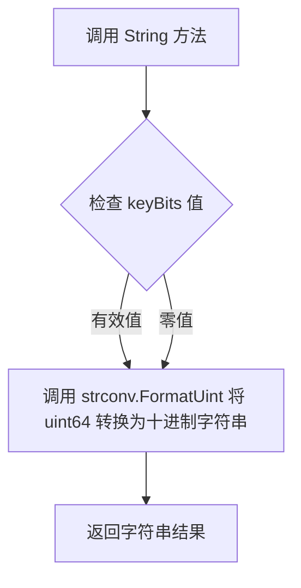

#### 带注释源码

```go
// String 是 pflag.Value 接口的实现方法
// 将 KeyBitsValue 中的 keyBits 字段（uint64）转换为十进制字符串表示
// 该方法用于在命令行帮助信息、默认值显示以及调试时展示当前值
func (kbv *KeyBitsValue) String() string {
	// 使用 strconv.FormatUint 将无符号整数转换为十进制字符串
	// 第二个参数 10 表示十进制基数
	return strconv.FormatUint(kbv.keyBits, 10)
}
```

### 完整类信息：`KeyBitsValue`

#### 类字段

| 字段名 | 类型 | 描述 |
|--------|------|------|
| `specified` | `bool` | 标记该值是否已被显式设置，用于区分默认值和用户指定值 |
| `keyBits` | `uint64` | 存储密钥长度位数，用于 ssh-keygen 的 -b 参数 |

#### 类方法

| 方法名 | 参数 | 返回值 | 描述 |
|--------|------|--------|------|
| `String()` | 无 | `string` | 返回密钥位数的十进制字符串表示 |
| `Set(s string)` | `s: string` - 要解析的字符串 | `error` | 解析字符串并设置 keyBits，同时标记 specified 为 true |
| `Type()` | 无 | `string` | 返回类型标识 "uint64" |
| `Specified()` | 无 | `bool` | 返回 specified 字段的值，表示是否已设置 |

### 关键组件信息

- **OptionalValue 接口**：扩展自 pflag.Value，添加了 Specified() 方法用于判断值是否被显式设置
- **KeyBitsValue**：实现 OptionalValue 接口，用于处理 ssh-keygen 的 -b 参数（密钥位数）
- **KeyTypeValue**：类似的实现，用于处理 -t 参数（密钥类型）
- **KeyFormatValue**：类似的实现，用于处理 -m 参数（密钥格式）

### 潜在的技术债务或优化空间

1. **错误处理不够详细**：`Set` 方法在解析失败时直接返回错误，没有提供更友好的错误信息或错误码
2. **缺少边界检查**：keyBits 为 uint64 类型，但 ssh-keygen 对密钥位数有限制（如最小 1024 位），没有在 Set 方法中进行验证
3. **文档注释不足**：缺少对 KeyBitsValue 结构体用途的包级别文档注释
4. **测试覆盖未知**：代码中未显示测试用例，无法确认边界条件是否被充分测试

### 其它项目

#### 设计目标与约束

- 实现 pflag.Value 接口以支持命令行参数解析
- 支持通过 ssh-keygen 生成指定位数的 SSH 密钥
- 必须能够区分默认值和用户显式设置的值

#### 错误处理与异常设计

- 解析失败时返回标准 error，调用者负责处理
- 无效输入（如空字符串、负数、非数字）会被 ParseUint 拒绝

#### 数据流与状态机

1. 用户通过命令行传入 -b 参数
2. pflag 库调用 KeyBitsValue.Set() 解析字符串
3. Set() 验证并设置 keyBits 和 specified 字段
4. 后续通过 String() 获取用于 ssh-keygen 命令的参数值

#### 外部依赖与接口契约

- 依赖 `strconv.ParseUint` 和 `strconv.FormatUint` 进行数值与字符串的转换
- 依赖 `github.com/spf13/pflag` 库的 Value 接口
- 必须实现 pflag.Value 的三个方法：String()、Set()、Type()


### `KeyBitsValue.Set`

设置密钥位数并标记为已指定，实现 pflag.Value 接口的 Set 方法，用于将命令行传入的字符串参数解析为无符号 64 位整数并保存到结构体中。

参数：

- `s`：`string`，待解析的字符串参数，表示密钥位数

返回值：`error`，如果字符串解析失败则返回解析错误，否则返回 nil

#### 流程图

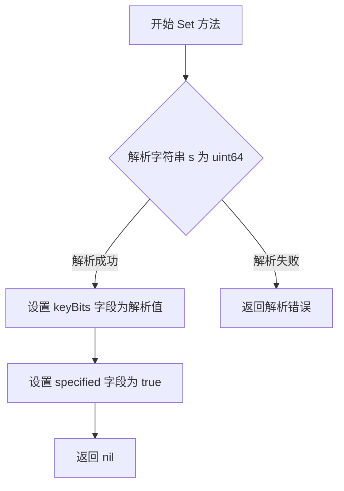

#### 带注释源码

```go
// Set 实现了 pflag.Value 接口的 Set 方法
// 功能：将传入的字符串解析为无符号 64 位整数，并标记该值已被指定
// 参数：s string - 待解析的密钥位数字符串
// 返回值：error - 解析错误或 nil
func (kbv *KeyBitsValue) Set(s string) error {
	// 使用 strconv.ParseUint 将字符串解析为无符号 64 位整数
	// 第二个参数 0 表示根据字符串前缀自动识别进制（支持 0x、0o、0b 等）
	// 第三个参数 64 表示目标类型为 64 位
	v, err := strconv.ParseUint(s, 0, 64)
	
	// 如果解析失败，直接返回错误
	if err != nil {
		return err
	}

	// 解析成功，将解析值存储到结构体字段
	kbv.keyBits = v
	
	// 标记该值已被用户指定，后续可据此判断是否使用默认值
	kbv.specified = true

	// 返回 nil 表示设置成功
	return nil
}
```

---

#### 补充信息

**所属类：`KeyBitsValue`**

| 字段 | 类型 | 描述 |
|------|------|------|
| `specified` | `bool` | 标记该值是否已被用户显式指定 |
| `keyBits` | `uint64` | 存储解析后的密钥位数 |

**接口实现**：
该方法实现了 `pflag.Value` 接口的 `Set(string) error` 方法，配合 `Specified()` 方法用于判断用户是否显式指定了该参数。

**调用场景**：
在 `KeyGen` 函数中，通过 `keyBits.Specified()` 判断用户是否指定了 `-b` 参数，如果指定则将其传递给 `ssh-keygen` 命令。


### `KeyBitsValue.Type`

该方法返回 KeyBitsValue 类型的标识字符串 "uint64"，用于 pflag 库在命令行参数处理时识别和显示该自定义类型的名称。

参数：

- 无（方法接收者为 `kbv *KeyBitsValue`）

返回值：`string`，返回类型的名称字符串 "uint64"，供 pflag 库在帮助信息和错误提示中使用。

#### 流程图

```mermaid
flowchart TD
    A[开始 Type 方法] --> B{无额外逻辑}
    B --> C[返回常量字符串 "uint64"]
    C --> D[结束]
```

#### 带注释源码

```go
// Type 返回 KeyBitsValue 的类型名称，用于 pflag 库显示帮助信息
// 该方法实现了 pflag.Value 接口
func (kbv *KeyBitsValue) Type() string {
    // 返回固定字符串 "uint64"，标识该值类型为无符号64位整数
    return "uint64"
}
```

#### 详细说明

| 项目 | 详情 |
|------|------|
| **所属类** | `KeyBitsValue` |
| **方法签名** | `func (kbv *KeyBitsValue) Type() string` |
| **接口实现** | 实现 `pflag.Value` 接口的 `Type()` 方法 |
| **调用场景** | 当 pflag 需要显示命令行参数的帮助信息或类型时调用 |
| **功能说明** | 这是一个简单的 getter 方法，返回一个常量字符串，用于标识该自定义类型的底层数据类型 |
| **线程安全性** | 线程安全（只读操作，不修改状态） |


### `KeyBitsValue.Specified()`

该方法用于返回 `KeyBitsValue` 实例是否已被显式指定值（即用户是否通过命令行参数指定了 key bits 值）。

参数：  
无参数

返回值：`bool`，返回 `true` 表示该值已被指定（通过 `-b` 参数），返回 `false` 表示使用默认值。

#### 流程图

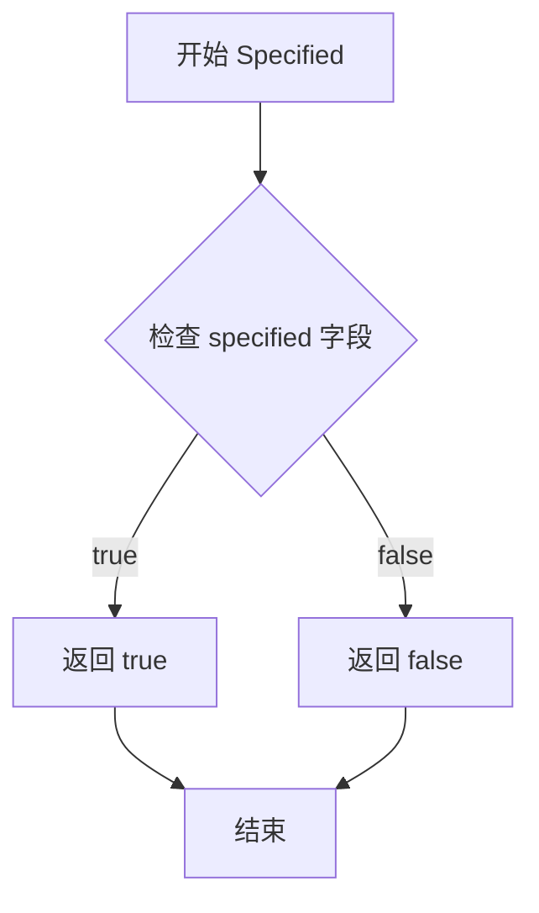

#### 带注释源码

```go
// Specified 返回 KeyBitsValue 是否已被显式指定
// 该方法实现了 OptionalValue 接口的 Specified() bool 方法
// 当用户通过命令行 -b 参数指定了 key bits 时，Set 方法会将 specified 设为 true
// 返回值：
//   - bool: 如果用户指定了值返回 true，否则返回 false
func (kbv *KeyBitsValue) Specified() bool {
	return kbv.specified  // 直接返回内部字段 specified 的值
}
```


### `KeyTypeValue.String`

该方法是`KeyTypeValue`类型的字符串表示方法，实现了Go语言的`fmt.Stringer`接口，用于返回当前存储的密钥类型字符串值。

参数： 无

返回值： `string`，返回存储在结构体中的密钥类型（keyType）字段的当前值。

#### 流程图

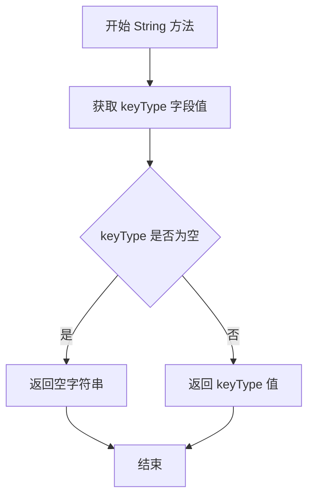

#### 带注释源码

```go
// String 返回 KeyTypeValue 的字符串表示
// 该方法实现了 fmt.Stringer 接口，允许将 KeyTypeValue 作为字符串使用
// 用于命令行参数显示和日志输出
func (ktv *KeyTypeValue) String() string {
    // 直接返回内部存储的 keyType 字段值
    // 如果 keyType 未被设置（为空），则返回空字符串
    return ktv.keyType
}
```


### `KeyTypeValue.Set`

设置密钥类型字符串，如果传入的字符串非空，则将其赋值给 keyType 字段，并标记为已指定状态。

参数：

- `s`：`string`，要设置的密钥类型字符串值

返回值：`error`，始终返回 nil（无错误），因为该方法不进行任何错误检测

#### 流程图

```mermaid
flowchart TD
    A[Start Set method] --> B{len(s) > 0?}
    B -->|Yes| C[ktv.keyType = s]
    C --> D[ktv.specified = true]
    B -->|No| E[Do nothing]
    D --> F[return nil]
    E --> F
    F --> G[End]
```

#### 带注释源码

```go
// Set 方法实现 pflag.Value 接口
// 用于将命令行传入的密钥类型参数设置到结构体中
func (ktv *KeyTypeValue) Set(s string) error {
	// 检查传入的字符串是否非空
	if len(s) > 0 {
		// 将字符串参数赋值给 keyType 字段
		ktv.keyType = s
		// 标记该参数已被指定，后续可通过 Specified() 方法查询
		ktv.specified = true
	}
	// 始终返回 nil，因为输入验证只检查非空，不产生错误
	return nil
}
```


### `KeyTypeValue.Type`

该方法是 `KeyTypeValue` 类型实现 `pflag.Value` 接口的一部分，用于返回当前值对象的类型名称，供 `pflag` 库在生成命令行帮助信息时显示参数类型使用。

参数： 无

返回值：`string`，返回类型名称字符串 "string"，用于标识这是一个字符串类型的可选值。

#### 流程图

```mermaid
flowchart TD
    A[Start Type method] --> B{Execute}
    B --> C[Return constant string "string"]
    C --> D[End]
```

#### 带注释源码

```go
// Type 方法实现了 pflag.Value 接口
// 返回值为 "string"，表示该可选值的底层类型为字符串
// pflag 库在生成 -h/--help 输出时，会调用此方法获取参数类型描述
func (ktv *KeyTypeValue) Type() string {
	return "string"
}
```


### `KeyTypeValue.Specified()`

该方法用于判断 `KeyTypeValue` 实例的 `-t` 参数是否已被用户明确指定。当用户在命令行中提供了 `-t` 参数并成功解析后，`specified` 标志会被设置为 `true`，从而允许调用方区分"用户未指定"与"用户指定了默认值"这两种情况，这在处理可选命令行参数时非常重要。

参数： 无

返回值：`bool`，返回 `specified` 字段的布尔值，表示该 KeyTypeValue 是否已被用户显式指定。

#### 流程图

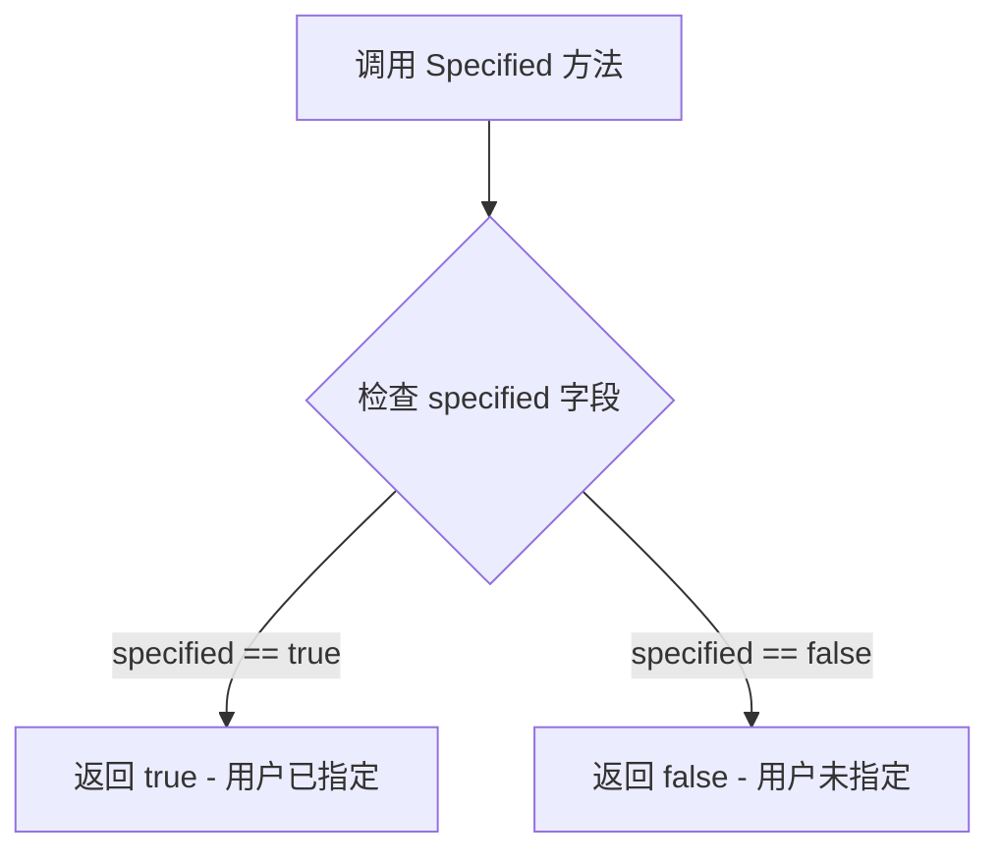

#### 带注释源码

```go
// Specified 返回该 KeyTypeValue 是否已被显式指定
// 当 Set 方法被成功调用且传入非空字符串时，specified 会被设置为 true
// 返回值: bool - true 表示已指定，false 表示未指定
func (ktv *KeyTypeValue) Specified() bool {
	return ktv.specified
}
```


### `KeyFormatValue.String()`

该方法是 `KeyFormatValue` 结构体的 `String()` 方法实现，用于实现 `fmt.Stringer` 接口，返回当前存储的密钥格式字符串。

参数：

- （无显式参数，接收者 `*KeyFormatValue` 为隐式参数）

返回值：`string`，返回密钥格式字符串

#### 流程图

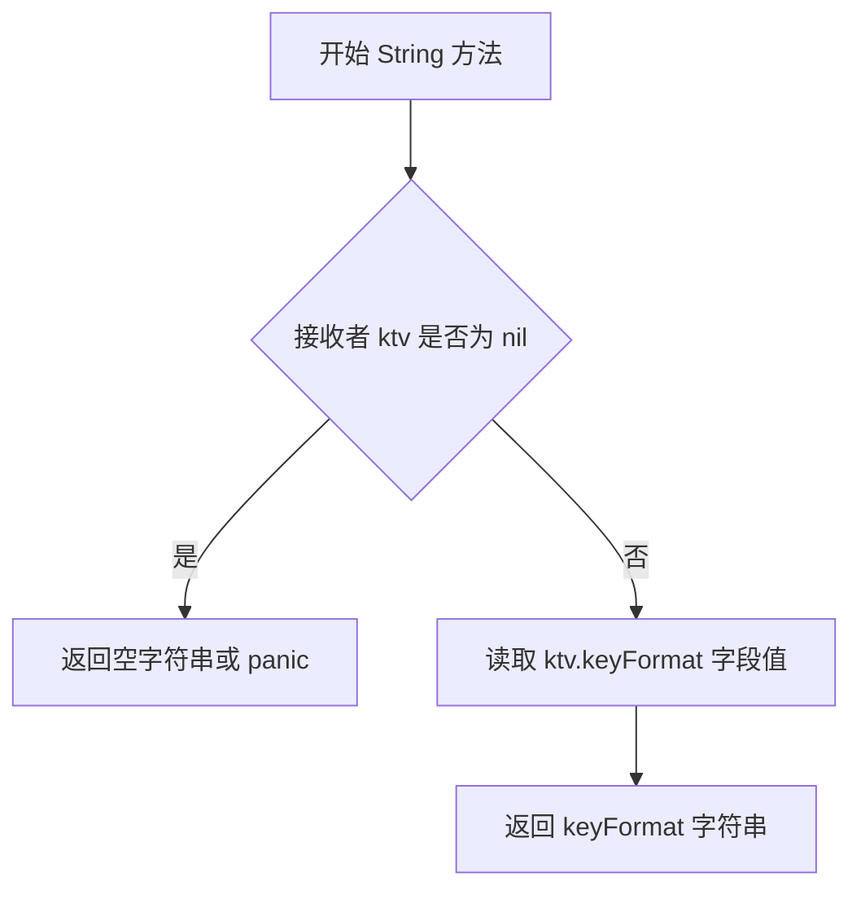

#### 带注释源码

```go
// String 是 fmt.Stringer 接口的实现
// 返回密钥格式的字符串表示形式
// 该方法在命令行参数解析、默认值显示等场景被调用
func (ktv *KeyFormatValue) String() string {
    // 直接返回内部存储的 keyFormat 字段值
    // 如果未设置过，该值为空字符串 ""
    return ktv.keyFormat
}
```


### `KeyFormatValue.Set`

设置密钥格式值，并将 `specified` 标志设置为 true，表示该参数已被明确指定。

参数：

- `s`：`string`，要设置的密钥格式值（如 "RFC4716"、"PKCS8"、"PEM"）

返回值：`error`，始终返回 nil（即使输入为空也不会返回错误）

#### 流程图

```mermaid
flowchart TD
    A[开始 Set 方法] --> B{检查 len(s) > 0}
    B -->|是| C[设置 keyFormat = s]
    C --> D[设置 specified = true]
    D --> E[返回 nil]
    B -->|否| E
```

#### 带注释源码

```go
// Set 方法实现 pflag.Value 接口，用于设置密钥格式值
// 参数 s: 要设置的密钥格式字符串（如 "RFC4716"、"PKCS8"、"PEM"）
// 返回值: 始终返回 nil，不会产生错误
func (ktv *KeyFormatValue) Set(s string) error {
	// 检查输入字符串长度是否大于 0
	if len(s) > 0 {
		// 将传入的格式字符串赋值给 keyFormat 字段
		ktv.keyFormat = s
		// 将 specified 标志设置为 true，表示该参数已被明确指定
		ktv.specified = true
	}
	// 无论输入是否为空，都返回 nil
	return nil
}
```


### `KeyFormatValue.Type`

该方法用于返回 `KeyFormatValue` 类型的字符串表示，实现 `pflag.Value` 接口的 `Type()` 方法。

参数： 无

返回值：`string`，返回 "string"，表示 KeyFormatValue 的底层类型为字符串类型。

#### 流程图

```mermaid
flowchart TD
    A[开始 Type 方法] --> B[返回字符串 "string"]
    B --> C[结束]
```

#### 带注释源码

```
// Type 返回 KeyFormatValue 的类型名称
// 实现 pflag.Value 接口的 Type() 方法
// 返回值:
//   - string: 返回 "string" 表示该值类型为字符串
func (ktv *KeyFormatValue) Type() string {
	return "string"
}
```


### `KeyFormatValue.Specified()`

该方法用于检查 `KeyFormatValue` 结构体实例是否已被显式设置值。它实现了 `OptionalValue` 接口的 `Specified()` 方法，通过返回内部布尔字段 `specified` 来告知调用者该值是否已被用户通过命令行参数指定。

参数：
- （无参数，仅接收者 `*KeyFormatValue`）

返回值：`bool`，返回 `true` 表示该值已被显式设置；返回 `false` 表示仍使用默认值。

#### 流程图

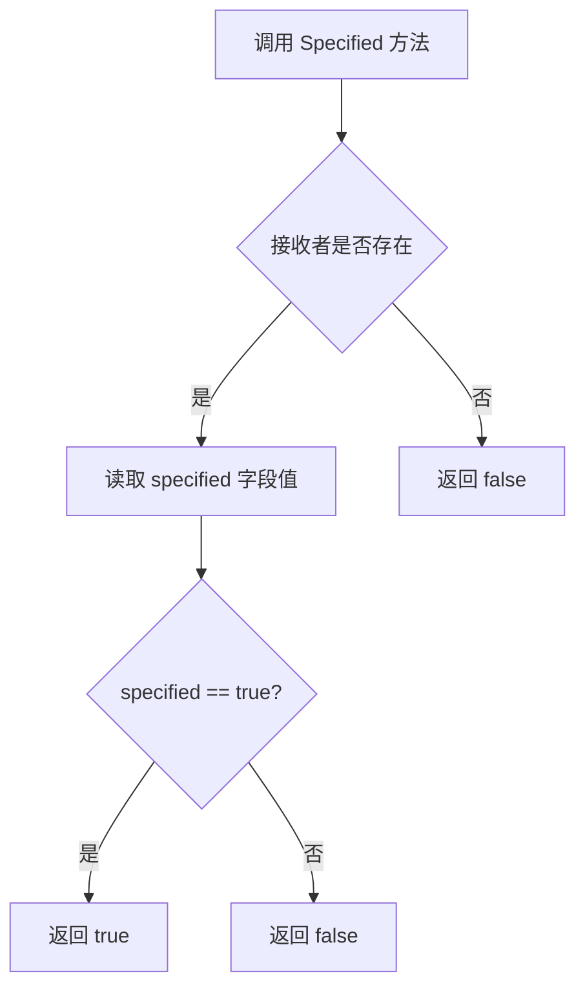

#### 带注释源码

```go
// Specified 返回是否已指定该密钥格式值
// 这是一个接口方法实现，实现了 OptionalValue 接口
// 当用户通过 -m 参数显式指定密钥格式时，Set 方法会将 specified 设为 true
// 此后调用 Specified() 将返回 true，表示该值已被用户设置
func (ktv *KeyFormatValue) Specified() bool {
	return kbv.specified  // 直接返回内部标志位，标识该值是否已被设置
}
```

## 关键组件


### OptionalValue 接口

定义了可选值的基础接口，扩展自 pflag.Value，添加了 Specified() 方法用于记录值是否被显式设置。

### KeyBitsValue 类型

实现了 OptionalValue 接口，用于表示 SSH 密钥的位数参数（-b 参数），内部维护 specified 标志和 keyBits 数值。

### KeyTypeValue 类型

实现了 OptionalValue 接口，用于表示 SSH 密钥的类型参数（-t 参数），支持 rsa、dsa、ecdsa、ed25519 等密钥类型。

### KeyFormatValue 类型

实现了 OptionalValue 接口，用于表示 SSH 密钥的格式参数（-m 参数），支持 PEM、RFC4716 等私钥格式。

### KeyGen 函数

核心密钥生成函数，调用 ssh-keygen 命令创建 SSH 密钥对，支持可选的密钥位数、类型和格式参数，将私钥写入临时目录并返回私钥路径、私钥内容、公钥及可能发生的错误。

### Fingerprint 结构体

表示 SSH 公钥指纹数据结构，包含 Hash（指纹哈希值）和 Randomart（随机艺术图）两个字段，用于存储不同哈希算法下的指纹信息。

### ExtractFingerprint 函数

通过执行 ssh-keygen 命令提取指定私钥文件的指纹信息，支持 md5、sha256 等哈希算法，使用正则表达式解析命令行输出返回 Fingerprint 结构体。

### PublicKey 结构体

表示 SSH 公钥数据结构，包含 Key（公钥字符串）和 Fingerprints（多算法指纹映射）字段，用于存储公钥及其多种哈希算法的指纹。

### ExtractPublicKey 函数

提取指定私钥文件对应的公钥，同时计算 md5 和 sha256 两种哈希算法的指纹，返回完整的 PublicKey 结构体。


## 问题及建议


### 已知问题

- **代码重复**：三个可选值类型（`KeyBitsValue`、`KeyTypeValue`、`KeyFormatValue`）结构完全相同，仅类型不同，应抽象为泛型或基础类型
- **资源清理缺失**：`KeyGen`函数创建临时目录但无明确清理机制，存在资源泄漏风险
- **外部命令依赖未验证**：代码依赖`ssh-keygen`命令但未检查其是否存在或可用
- **重复调用外部进程**：`ExtractPublicKey`函数连续两次调用`ExtractFingerprint`，每次都执行`ssh-keygen`命令，造成性能浪费
- **错误信息不明确**：多处错误返回仅返回原始错误，缺乏上下文信息（如`KeyGen`中`cmd.Run()`失败时）
- **缺少输入验证**：未验证`tmpfsPath`是否有效、是否具有正确权限等
- **全局变量线程安全**：`fieldRegexp`和`captureCount`作为全局变量，在并发场景下可能存在问题（虽然正则表达式本身不可变）
- **硬编码字符串**：错误前缀"..weave-keygen"硬编码，缺乏配置化

### 优化建议

- 将三个可选值类型合并为一个泛型结构或使用组合模式
- 添加`Cleanup`函数或实现`io.Closer`接口来管理临时目录生命周期
- 在初始化时检查`ssh-keygen`可用性或添加版本检查
- 优化`ExtractPublicKey`逻辑，合并指纹提取过程或缓存结果
- 增强错误信息，提供更详细的上下文（如命令参数、路径等）
- 添加输入参数验证逻辑
- 将可配置项提取为常量或配置结构
- 考虑添加单元测试和集成测试覆盖

## 其它


### 设计目标与约束

**设计目标**：
- 提供一个简洁的Go库用于生成SSH密钥对
- 支持自定义密钥位数、密钥类型和密钥格式
- 能够提取公钥和多种哈希算法的指纹信息
- 遵循Go语言惯用写法，使用接口抽象增强可扩展性

**设计约束**：
- 依赖外部命令ssh-keygen，必须在系统PATH中可用
- 私钥文件存储在tmpfs内存文件系统中以增强安全性
- 密钥生成参数通过OptionalValue接口支持可选指定

### 错误处理与异常设计

**错误传播机制**：
- 所有可能失败的操作都返回error类型错误
- 错误直接传递给调用者，不进行内部吞没
- 使用fmt.Errorf和errors.New创建描述性错误信息

**关键错误场景**：
- TempDir创建失败：返回ioutil.TempDir原始错误
- ssh-keygen执行失败：返回exec.Command.Run错误
- 私钥文件读取失败：返回ioutil.ReadFile错误
- 公钥提取失败：返回ssh-keygen -y命令错误
- 指纹解析失败：返回格式化错误"could not parse fingerprint"

**错误处理原则**：
- 错误发生时立即返回，不进行重试
- 组合错误时保留原始错误信息
- 使用有意义的错误描述便于调试

### 数据流与状态机

**主要数据流**：

```
输入参数(keyBits, keyType, keyFormat, tmpfsPath)
        ↓
创建临时目录(tempDir)
        ↓
构建ssh-keygen命令参数(args)
        ↓
执行ssh-keygen生成密钥对
        ↓
读取私钥文件(privateKey)
        ↓
调用ExtractPublicKey获取公钥和指纹
        ↓
返回(privateKeyPath, privateKey, publicKey, nil)
```

**状态转换**：
- 初始状态 → 目录创建成功 → 密钥生成成功 → 文件读取成功 → 提取完成 → 返回结果

### 外部依赖与接口契约

**外部依赖**：
- `github.com/spf13/pflag`：命令行标志解析库
- `ssh-keygen`：系统外部命令，必须安装且可执行

**接口契约**：

OptionalValue接口：
- `String() string`：返回值的字符串表示
- `Set(s string) error`：设置值，返回错误（如果值无效）
- `Type() string`：返回值的类型名称
- `Specified() bool`：返回是否已指定该值

KeyGen函数契约：
- 输入：keyBits(可选uint64)、keyType(可选string)、keyFormat(可选string)、tmpfsPath(必填目录路径)
- 输出：privateKeyPath(string)、privateKey([]byte)、publicKey(PublicKey)、error
- 前提条件：tmpfsPath指向可写的tmpfs挂载点

ExtractPublicKey函数契约：
- 输入：privateKeyPath(string) - 有效私钥文件路径
- 输出：PublicKey结构 - 包含Key和Fingerprints字段
- 错误：文件不存在、无权限、执行失败时返回非nil error

ExtractFingerprint函数契约：
- 输入：privateKeyPath(string)、hashAlgo(string) - 支持"md5"和"sha256"
- 输出：Fingerprint结构 - 包含Hash和Randomart字段

### 性能考虑

**性能特征**：
- 密钥生成为IO密集型操作，主要时间消耗在ssh-keygen命令执行
- 指纹提取需要两次调用ssh-keygen，存在优化空间
- 私钥读取为同步阻塞操作

**潜在优化点**：
- ExtractPublicKey中串行调用ExtractFingerprint获取md5和sha256，可考虑并行执行
- 临时文件使用后未显式清理，依赖系统GC（可通过defer os.RemoveAll优化）

### 安全性考虑

**安全特性**：
- 私钥存储在tmpfs（内存文件系统）中，防止写入磁盘
- 生成密钥时使用-N ""参数，不设置 passphrase（空密码）
- 使用唯一临时目录隔离不同会话的密钥

**安全建议**：
- 考虑添加密钥过期机制
- 建议在文档中明确说明tmpfsPath的安全要求
- 考虑添加密钥权限检查（600或400）

### 并发与线程安全

**并发分析**：
- 所有函数均为无状态函数，不共享全局可变状态
- 局部变量不跨协程共享，无并发访问问题
- 全局变量fieldRegexp为只读正则表达式，线程安全

**线程安全性**：安全用于并发场景

### 测试策略

**建议测试用例**：
- 测试KeyGen正常生成密钥对
- 测试OptionalValue的Specified()返回正确值
- 测试ExtractFingerprint正确解析md5和sha256
- 测试ExtractPublicKey正确提取公钥格式
- 测试错误处理：无效参数、文件不存在、命令执行失败
- 测试密钥文件权限正确性

### 配置说明

**配置参数**：
- keyBits：密钥位数，建议值2048或4096
- keyType：密钥类型，支持rsa、dsa、ecdsa、ed25519
- keyFormat：密钥格式，支持RFC4716、PKCS8、PEM
- tmpfsPath：tmpfs挂载点路径，必须可写

**默认值**：
- keyBits：默认由ssh-keygen选择（通常为2048）
- keyType：默认rsa
- keyFormat：默认PEM

### 使用示例

```go
// 生成默认参数密钥
keyBits := &KeyBitsValue{}
keyType := &KeyTypeValue{}
keyFormat := &KeyFormatValue{}
privateKeyPath, privateKey, publicKey, err := KeyGen(keyBits, keyType, keyFormat, "/tmp")

// 生成指定参数密钥
keyBits.Set("4096")
keyType.Set("ed25519")
keyFormat.Set("RFC4716")
privateKeyPath, privateKey, publicKey, err := KeyGen(keyBits, keyType, keyFormat, "/tmp")

// 提取已有私钥的公钥和指纹
publicKey, err := ExtractPublicKey("/path/to/private/key")
fmt.Println(publicKey.Key)
fmt.Println(publicKey.Fingerprints["md5"].Hash)
fmt.Println(publicKey.Fingerprints["sha256"].Hash)
```

    