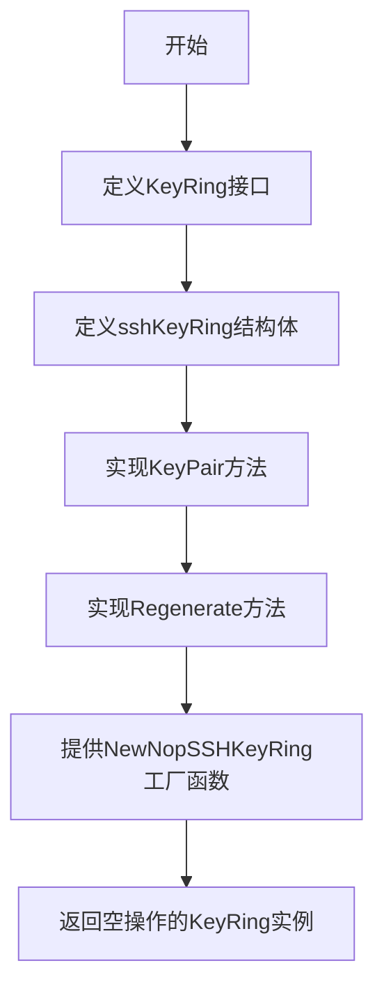
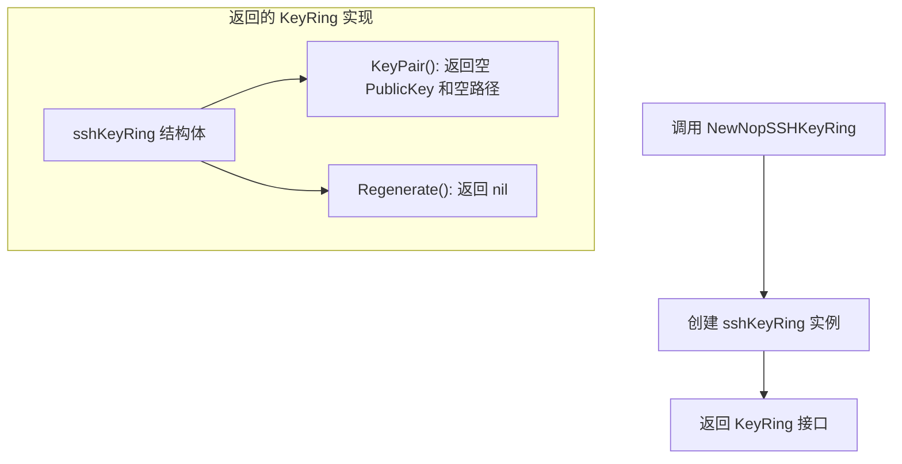
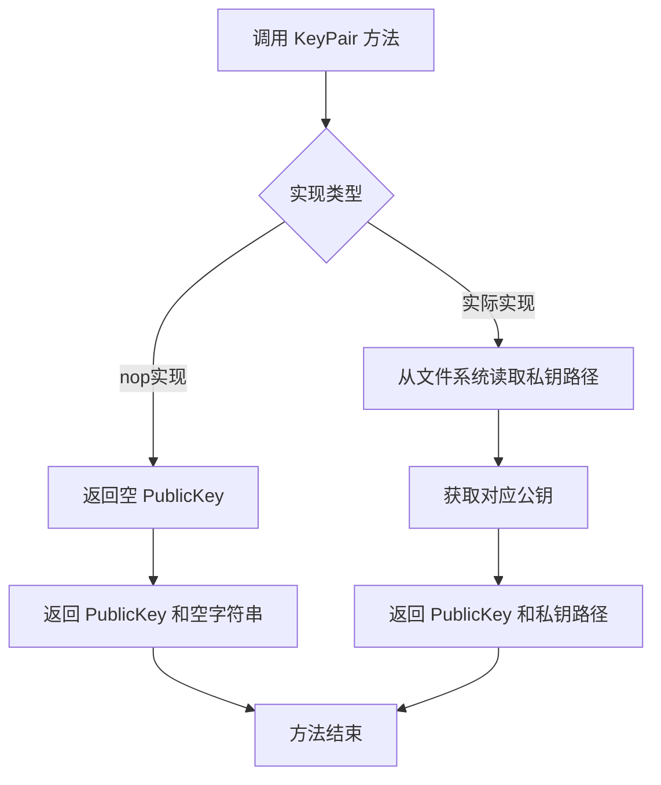
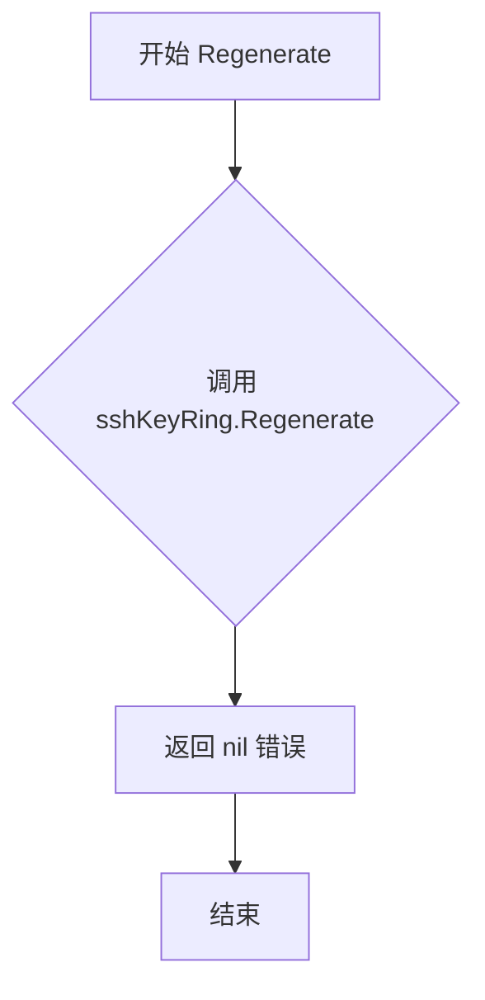
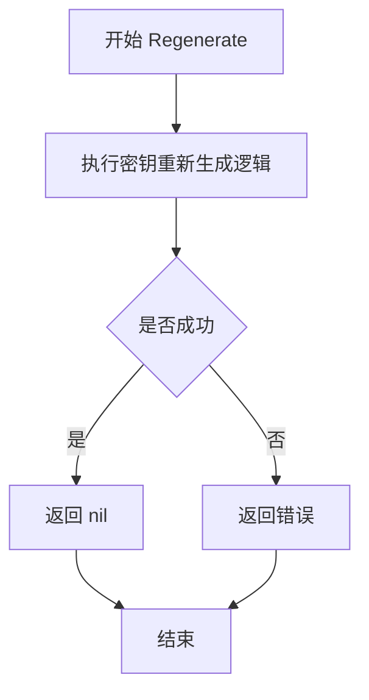

# `flux\pkg\ssh\keyring.go` 详细设计文档

该代码定义了一个SSH密钥环（KeyRing）抽象接口，用于管理SSH密钥对。公开密钥以字节形式提供访问，而私有密钥保留在文件系统上以避免内存管理问题，并提供了一个用于本地开发的无操作（noop）实现。

## 整体流程



## 类结构

```
KeyRing (接口)
└── sshKeyRing (结构体，实现KeyRing接口)
```

## 全局变量及字段


    

## 全局函数及方法


### `NewNopSSHKeyRing`

该函数返回一个不做任何操作的 SSH KeyRing 实现，用于在 Kubernetes 容器外部运行 fluxd 时的本地开发场景。

参数：

- 无参数

返回值：`KeyRing`，返回一个实现了 KeyRing 接口的空操作对象，用于本地开发时避免密钥管理问题

#### 流程图



#### 带注释源码

```go
package ssh

// KeyRing 是一个抽象接口，提供对托管 SSH 密钥对的访问
// 公有密钥以字节形式可用，私有密钥保留在文件系统上以避免内存管理问题
type KeyRing interface {
	KeyPair() (publicKey PublicKey, privateKeyPath string)
	Regenerate() error
}

// sshKeyRing 是 KeyRing 接口的私有实现结构体
// 不包含任何字段，仅提供空操作实现
type sshKeyRing struct{}

// NewNopSSHKeyRing 返回一个不做任何操作的 KeyRing
// 主要用于本地开发场景，当在 Kubernetes 容器外部运行 fluxd 时使用
func NewNopSSHKeyRing() KeyRing {
	return &sshKeyRing{}
}

// KeyPair 是 sshKeyRing 的方法，返回空的公钥和空路径
func (skr *sshKeyRing) KeyPair() (PublicKey, string) {
	return PublicKey{}, ""
}

// Regenerate 是 sshKeyRing 的方法，返回 nil 表示不需要重新生成
func (skr *sshKeyRing) Regenerate() error {
	return nil
}
```


### `KeyRing.KeyPair()`

获取当前托管的SSH密钥对，返回公钥字节形式和私钥文件路径。该方法是KeyRing接口的核心方法，用于获取SSH公钥和私钥路径，其中私钥保留在文件系统上以避免内存管理问题。

参数：

- 该方法没有参数

返回值：

- `PublicKey`：SSH公钥对象，表示密钥对的公钥部分
- `string`：私钥在文件系统上的路径字符串，用于访问私钥文件

#### 流程图



#### 带注释源码

```go
// KeyPair 返回当前托管的SSH密钥对
// 参数：无
// 返回值：
//   - publicKey: SSH公钥对象
//   - privateKeyPath: 私钥文件的路径字符串
//
// 设计说明：
// - 公钥以字节形式返回，可直接用于SSH连接
// - 私钥路径返回文件路径，保留在文件系统以避免内存中的敏感数据
// - 具体实现可能从密钥存储或文件系统中获取实际密钥
func (skr *sshKeyRing) KeyPair() (PublicKey, string) {
    // 当前实现返回空的公钥和空路径（Nop实现）
    // 实际使用时会被具体的KeyRing实现替代
    return PublicKey{}, ""
}
```

---

### 补充设计文档信息

#### 核心功能概述

该代码定义了一个SSH密钥环（KeyRing）抽象接口，用于管理SSH密钥对。公钥以字节形式提供访问，而私钥保留在文件系统上以避免内存管理问题和敏感信息泄露。提供了Nop（无操作）实现用于本地开发场景。

#### 类详细信息

**KeyRing 接口**

- **字段**：无
- **方法**：
  - `KeyPair() (PublicKey, string)` - 获取密钥对
  - `Regenerate() error` - 重新生成密钥对

**sshKeyRing 结构体**

- **字段**：无（空结构体）
- **方法**：
  - `KeyPair()` - 返回空值
  - `Regenerate()` - 返回nil

#### 关键组件信息

| 组件名称 | 一句话描述 |
|---------|-----------|
| KeyRing | SSH密钥对管理的抽象接口 |
| sshKeyRing | KeyRing接口的空实现 |
| NewNopSSHKeyRing | 工厂函数，创建用于本地开发的Nop KeyRing |

#### 潜在技术债务与优化空间

1. **空实现问题**：`sshKeyRing`的KeyPair方法返回空值，缺乏实际实现逻辑，当前仅作为占位符
2. **错误处理缺失**：KeyPair方法没有错误返回值，当密钥不存在或读取失败时无法处理
3. **接口单一**：目前仅支持Nop实现，生产环境需要提供真实的KeyRing实现
4. **文档不完整**：缺少关于密钥存储位置、格式、以及如何注入实际实现的说明

#### 其他项目

**设计目标与约束**：
- 分离公钥和私钥的处理逻辑
- 避免私钥驻留内存，降低安全风险
- 支持本地开发环境的不使用密钥场景

**外部依赖与接口契约**：
- 依赖`PublicKey`类型的定义（在同包中未显示）
- KeyRing接口的实现者需要保证：
  - KeyPair返回的privateKeyPath指向有效的私钥文件
  - 公钥与私钥配对正确
  - Regenerate能够成功重新生成密钥对


### `KeyRing.Regenerate()`

该方法是 `KeyRing` 接口的核心方法之一，用于重新生成 SSH 密钥对。在 `sshKeyRing` 的默认实现中，这是一个空操作（no-op），直接返回 `nil` 错误，表示无需重新生成。

参数：

- 该方法没有参数

返回值：`error`，如果重新生成密钥对过程中发生错误，则返回具体的错误信息；在当前实现中始终返回 `nil`

#### 流程图



#### 带注释源码

```go
// Regenerate 是 KeyRing 接口的方法，用于重新生成 SSH 密钥对
// 在 sshKeyRing 默认实现中，该方法不执行任何实际操作
// 直接返回 nil，表示重新生成成功（空操作）
func (skr *sshKeyRing) Regenerate() error {
    // 返回 nil 表示没有错误发生
    // 这是一个空实现，主要用于满足 KeyRing 接口的契约
    return nil
}
```


### `sshKeyRing.KeyPair`

该方法用于从SSH密钥环获取密钥对，返回公钥对象和私钥文件路径，遵循将私钥保留在文件系统以避免内存管理问题的设计原则。

**返回值：** `(PublicKey, string)`，返回公钥对象和私钥在文件系统中的路径

#### 流程图

```mermaid
flowchart TD
    A[调用 KeyPair 方法] --> B{创建返回值}
    B --> C[返回 PublicKey{} 和空字符串]
    C --> D[调用方接收公钥和私钥路径]
```

#### 带注释源码

```go
// KeyPair 返回与该密钥环关联的SSH密钥对
// publicKey: 公钥对象，以字节形式提供
// privateKeyPath: 私钥在文件系统中的路径，保留在文件系统以避免内存管理问题
func (skr *sshKeyRing) KeyPair() (PublicKey, string) {
    // 返回空的PublicKey和空的私钥路径
    // 这是一个NOP实现，用于本地开发场景
    return PublicKey{}, ""
}
```

#### 补充说明

| 属性 | 详情 |
|------|------|
| **所属类型** | `sshKeyRing` 结构体 |
| **接口实现** | 实现 `KeyRing` 接口 |
| **设计意图** | 作为 NOP（无操作）实现，用于在 Kubernetes 容器外运行 fluxd 时的本地开发场景 |
| **当前行为** | 返回空的公钥和空字符串，不执行实际密钥操作 |
| **技术债务** | 缺少实际密钥加载逻辑，当前仅为占位实现，无法用于生产环境 |


### `sshKeyRing.Regenerate`

该方法是 `sshKeyRing` 结构体的成员方法，用于重新生成 SSH 密钥对。当前实现为无操作（NOP）实现，返回 `nil` 错误，主要用于本地开发环境或当 fluxd 在 Kubernetes 容器外运行时作为占位符。

参数：

- （无参数）

返回值：`error`，返回重新生成密钥的结果。当前实现总是返回 `nil`，表示无错误。

#### 流程图



> **注意**：当前实现中，B 步骤为占位符逻辑，直接返回 nil。实际生产环境中此处应包含完整的密钥重新生成逻辑。

#### 带注释源码

```go
// Regenerate 尝试重新生成 SSH 密钥对
// 当前实现为 NOP（无操作），返回 nil 错误
// 用途：本地开发时不需要实际生成密钥
func (skr *sshKeyRing) Regenerate() error {
    // TODO: 实现实际的密钥重新生成逻辑
    // 当前返回 nil 表示操作成功，但不执行任何实际操作
    return nil
}
```

## 关键组件


### KeyRing 接口

SSH密钥环抽象接口，提供对托管SSH密钥对的访问。公共密钥部分以字节形式可用，私有密钥部分保留在文件系统上以避免内存管理问题。

### sshKeyRing 结构体

空实现的KeyRing结构体，不执行任何实际操作。主要用于本地开发目的，当fluxd在Kubernetes容器外部运行时使用。

### NewNopSSHKeyRing 函数

创建并返回一个不做任何操作的KeyRing实例。用于本地开发场景，当fluxd在Kubernetes容器外部运行时提供空操作实现。

### KeyPair 方法

获取当前密钥对的公共密钥和私有密钥文件路径。对于空实现，返回空的PublicKey和空字符串路径。

### Regenerate 方法

触发密钥对的重新生成。对于空实现，直接返回nil，表示无需操作。


## 问题及建议


### 已知问题

-   **空实现返回无意义数据**：`KeyPair()`返回空的`PublicKey{}`和空字符串`""`，调用方无法有效区分是真实密钥还是Nop实现，可能导致后续空指针或空值引用
-   **错误处理不明确**：`Regenerate()`对Nop实现返回`nil`，但实际上该操作在Nop模式下应该返回明确错误（如`ErrNotSupported`）以表明该操作无效
-   **日志缺失**：Nop实现完全静默执行，缺乏任何日志输出，调试时难以追踪是否使用了Nop实现
- **无状态标记**：无法判断当前KeyRing是否为Nop实现，缺乏运行时识别机制

### 优化建议

-   **添加错误常量**：定义`ErrRegenerateNotSupported`等错误常量，明确区分操作不支持的场景
-   **添加调试日志**：在Nop实现的关键方法中添加日志，便于本地开发调试
-   **增加标识方法**：添加`IsNop() bool`方法，使调用方可以运行时判断是否为Nop实现
-   **完善返回值语义**：考虑返回`nil, ""`或明确标记的错误，而非空结构体，提高调用方的可辨识性
-   **补充文档注释**：为`NewNopSSHKeyRing`添加更详细的文档，说明其在本地开发中的使用场景和限制


## 其它


### 设计目标与约束

**设计目标**：提供SSH密钥对管理的抽象接口，使公钥可访问，私钥保留在文件系统以避免内存管理问题，同时支持密钥重新生成功能。

**约束**：
- 私钥不应以字节形式暴露在内存中
- 该接口为开发环境提供NOP实现，用于本地开发场景
- 必须实现KeyRing接口以保持一致性

### 错误处理与异常设计

**Regenerate()方法**：
- 返回error类型，允许实现类在密钥生成失败时返回具体错误
- 当前NOP实现返回nil，表示无错误
- 调用方应检查返回值以处理潜在的生成失败情况

**KeyPair()方法**：
- 返回两个值：PublicKey和privateKeyPath字符串
- 当使用NOP实现时，返回空PublicKey和空字符串
- 调用方需处理可能的空值情况

### 外部依赖与接口契约

**接口契约（KeyRing）**：
- `KeyPair()`: 返回公钥和私钥文件路径
- `Regenerate()`: 重新生成密钥对，返回错误

**依赖关系**：
- 依赖同包内的`PublicKey`类型
- 接口设计为依赖注入点，便于在不同环境替换实现

### 使用场景

**生产环境**：使用真实的SSH密钥环实现，从文件系统加载/管理密钥

**开发环境**：使用`NewNopSSHKeyRing()`创建NOP实现，适用于在Kubernetes容器外运行fluxd进行本地开发

### 扩展性考虑

**可扩展点**：
- 可实现具体的SSH密钥环类型（如从指定路径加载密钥）
- 可添加密钥过期检测和自动轮换功能
- 可添加密钥指纹验证方法

**接口稳定性**：当前接口方法签名应保持稳定，以确保实现兼容性

    