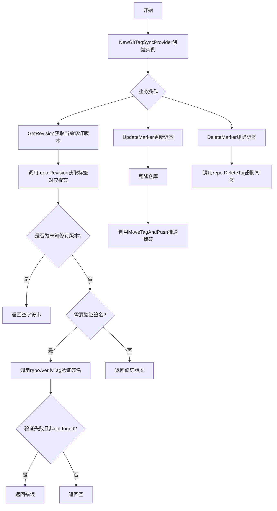
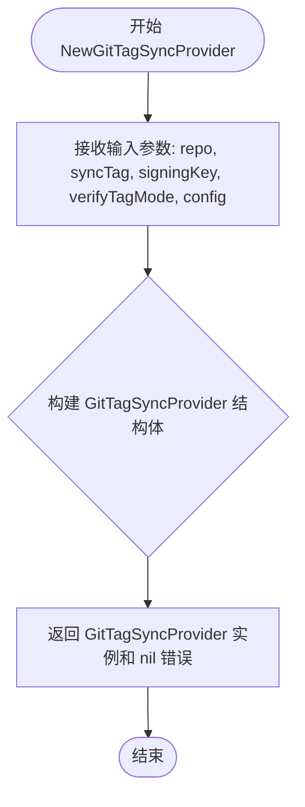
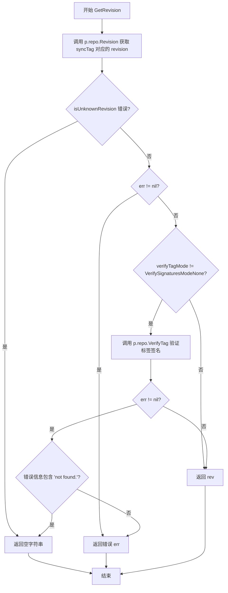
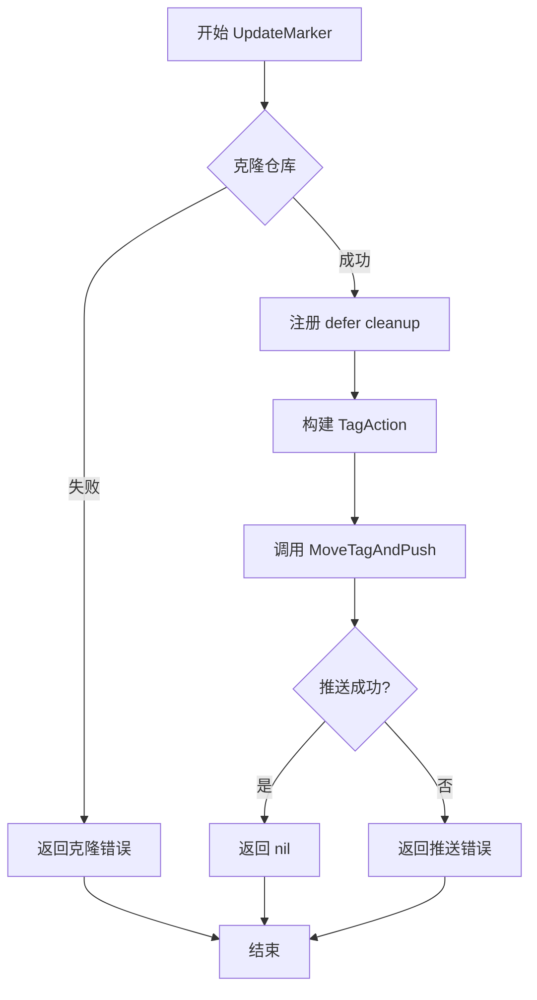
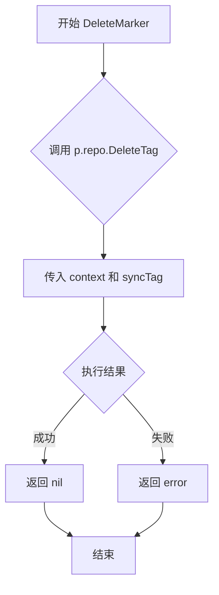

# `flux\pkg\sync\git.go` 详细设计文档

GitTagSyncProvider是一个Git标签同步提供者，通过Git标签机制跟踪fluxd已同步到的当前进度点，支持签名验证、获取当前修订版本、更新和删除同步标签等操作。

## 整体流程



## 类结构

```
GitTagSyncProvider (Git标签同步提供者)
├── 字段: repo *git.Repo
├── 字段: syncTag string
├── 字段: signingKey string
├── 字段: verifyTagMode VerifySignaturesMode
├── 字段: config git.Config
├── 方法: NewGitTagSyncProvider()
├── 方法: String()
├── 方法: GetRevision()
├── 方法: UpdateMarker()
└── 方法: DeleteMarker()
```

## 全局变量及字段


### `GitTagSyncProvider.repo`
    
Git仓库实例

类型：`*git.Repo`
    


### `GitTagSyncProvider.syncTag`
    
同步标签名称

类型：`string`
    


### `GitTagSyncProvider.signingKey`
    
GPG签名密钥

类型：`string`
    


### `GitTagSyncProvider.verifyTagMode`
    
签名验证模式

类型：`VerifySignaturesMode`
    


### `GitTagSyncProvider.config`
    
Git配置

类型：`git.Config`
    
    

## 全局函数及方法


### `isUnknownRevision`

判断给定的错误是否为"未知修订版本"错误。该函数通过检查错误消息中是否包含特定的字符串来判断错误类型，常用于 Git 操作中识别版本库中不存在指定修订版本的情况。

参数：

- `err`：`error`，需要进行判断的错误对象

返回值：`bool`，如果错误是未知修订版本错误则返回 `true`，否则返回 `false`

#### 流程图

```mermaid
flowchart TD
    A[开始: isUnknownRevision] --> B{err != nil?}
    B -->|否| C[返回 false]
    B -->|是| D{错误信息包含<br/>"unknown revision or path<br/>not in the working tree."?}
    D -->|是| E[返回 true]
    D -->|否| F{错误信息包含<br/>"bad revision"?}
    F -->|是| E
    F -->|否| C
```

#### 带注释源码

```go
// isUnknownRevision 判断错误是否为未知修订版本错误
// 通过检查错误消息中是否包含特定的 Git 错误字符串来识别
func isUnknownRevision(err error) bool {
	// 首先检查错误是否为 nil，非 nil 才继续判断
	return err != nil &&
		// 检查是否包含"未知修订版本"错误信息
		// 这是 Git 在找不到指定分支/标签时的常见错误信息
		(strings.Contains(err.Error(), "unknown revision or path not in the working tree.") ||
			// 检查是否包含"坏修订版本"错误信息
			// 这是 Git 在使用无效修订版本时的错误信息
			strings.Contains(err.Error(), "bad revision"))
}
```


### `GitTagSyncProvider.NewGitTagSyncProvider`

该函数用于实例化 `GitTagSyncProvider` 结构体，接收 Git 仓库、标签名称、签名密钥等配置参数，并返回初始化好的同步提供者实例。

参数：

-  `repo`：`*git.Repo`，Git 仓库客户端实例，负责底层 Git 操作。
-  `syncTag`：`string`，同步指针指向的 Git Tag 名称。
-  `signingKey`：`string`，用于在更新 Tag 时进行 GPG 签名的私钥 ID。
-  `verifyTagMode`：`VerifySignaturesMode`，枚举类型，指定是否验证 Tag 的 GPG 签名。
-  `config`：`git.Config`，Git 仓库的克隆和操作配置。

返回值：`GitTagSyncProvider, error`，返回初始化后的 Git 标签同步提供者实例；若创建过程中出现问题（如参数校验失败），则返回错误。当前实现中该函数总是返回 `nil` 错误。

#### 流程图



#### 带注释源码

```go
// NewGitTagSyncProvider creates a new git tag sync provider.
// 创建并返回一个新的 Git Tag 同步提供者实例。
func NewGitTagSyncProvider(
	repo *git.Repo,           // Git 仓库实例
	syncTag string,           // 同步标签名
	signingKey string,        // 签名密钥
	verifyTagMode VerifySignaturesMode, // 签名验证模式
	config git.Config,        // Git 配置
) (GitTagSyncProvider, error) {
	// 构造并返回 GitTagSyncProvider 实例
	return GitTagSyncProvider{
		repo:          repo,
		syncTag:       syncTag,
		signingKey:    signingKey,
		verifyTagMode: verifyTagMode,
		config:        config,
	}, nil
}
```


### `GitTagSyncProvider.String`

该方法用于返回 GitTagSyncProvider 的字符串表示形式，通过拼接 "tag " 前缀和同步标签（syncTag）来描述当前的同步提供者类型。

参数： 无

返回值：`string`，返回提供者的字符串表示，由 "tag " 前缀和同步标签名称组成

#### 流程图

```mermaid
flowchart TD
    A[开始 String 方法] --> B{执行返回}
    B --> C[返回 "tag " + p.syncTag]
    C --> D[结束]
```

#### 带注释源码

```go
// String 返回 GitTagSyncProvider 的字符串表示
// 方法说明：将提供者的类型描述与同步标签名称组合成可读的字符串形式
// 返回值格式："tag " + syncTag字段值（例如："tag flux-sync"）
func (p GitTagSyncProvider) String() string {
	return "tag " + p.syncTag
}
```


### `GitTagSyncProvider.GetRevision`

获取当前同步标签指向的Git提交修订版本。该方法首先通过Git仓库获取同步标签对应的提交哈希，如果启用了签名验证模式，则还会验证Git标签的GPG签名，确保同步点的可信性。

参数：

- `ctx`：`context.Context`，Go语言的上下文对象，用于传递取消信号、超时控制等请求级别的元数据

返回值：`string, error`，返回Git提交的修订版本（commit SHA）字符串，错误则返回error对象

#### 流程图



#### 带注释源码

```go
// GetRevision returns the revision of the git commit where the flux sync tag is currently positioned.
// 获取当前同步标签指向的Git提交修订版本
func (p GitTagSyncProvider) GetRevision(ctx context.Context) (string, error) {
	// 调用repo的Revision方法，根据syncTag获取对应的commit SHA
	rev, err := p.repo.Revision(ctx, p.syncTag)
	
	// 如果是未知revision错误（例如tag不存在），返回空字符串而非错误
	// 这种情况下视为尚未同步任何版本
	if isUnknownRevision(err) {
		return "", nil
	}
	
	// 如果是其他错误，直接返回错误
	if err != nil {
		return "", err
	}

	// 如果启用了签名验证模式
	if p.verifyTagMode != VerifySignaturesModeNone {
		// 验证tag的GPG签名
		if _, err := p.repo.VerifyTag(ctx, p.syncTag); err != nil {
			// 如果是tag未找到错误，不视为错误，但也不返回revision
			// 这样可以让系统继续运行直到找到有效的tag
			if strings.Contains(err.Error(), "not found.") {
				return "", nil
			}
			// 其他验证错误（如签名无效）则返回错误
			return "", err
		}
	}
	
	// 验证通过，返回revision
	return rev, nil
}
```


### `GitTagSyncProvider.UpdateMarker`

该方法将 Git 标签同步标记移动到指定的修订版本，通过克隆仓库、创建或移动标签并推送到远程仓库来完成同步状态的更新。

参数：

- `ctx`：`context.Context`，用于控制请求的生命周期、截止时间和取消信号
- `revision`：`string`，要更新到的 Git 提交修订版本（SHA 或分支名）

返回值：`error`，如果操作失败返回错误，成功时返回 nil

#### 流程图



#### 带注释源码

```go
// UpdateMarker moves the sync tag in the upstream repo.
// 该方法将同步标签移动到指定的修订版本
func (p GitTagSyncProvider) UpdateMarker(ctx context.Context, revision string) error {
	// 步骤1：克隆仓库到本地
	// 使用配置中的 git.Config 克隆仓库，返回一个 checkout 会话
	checkout, err := p.repo.Clone(ctx, p.config)
	
	// 步骤2：检查克隆是否成功
	// 如果克隆失败，立即返回错误
	if err != nil {
		return err
	}
	
	// 步骤3：注册清理函数
	// 使用 defer 确保在方法结束时清理克隆的临时文件
	defer checkout.Clean()
	
	// 步骤4：移动标签并推送
	// 构建 TagAction 结构体，包含：
	//   - Tag: 同步标签名称（如 "flux-sync"）
	//   - Revision: 要标记的修订版本
	//   - Message: 标签消息（"Sync pointer"）
	//   - SigningKey: 用于 GPG 签名的密钥
	// 然后调用 MoveTagAndPush 将标签推送到远程仓库
	return checkout.MoveTagAndPush(ctx, git.TagAction{
		Tag:        p.syncTag,       // 从 provider 获取同步标签名
		Revision:   revision,        // 调用者传入的修订版本
		Message:    "Sync pointer",  // 标签注释消息
		SigningKey: p.signingKey,    // GPG 签名密钥（可为空）
	})
}
```


### `GitTagSyncProvider.DeleteMarker`

删除用于同步的 Git 标签标记。该方法调用底层 Git 仓库的 DeleteTag 功能，移除与当前同步提供者关联的标签，从而重置同步状态。

参数：

- `ctx`：`context.Context`，用于控制请求的取消、超时等上下文信息

返回值：`error`，如果标签删除成功则返回 nil，如果删除过程中发生错误则返回相应的错误信息

#### 流程图



#### 带注释源码

```go
// DeleteMarker removes the Git Tag used for syncing.
// DeleteMarker 删除用于同步的 Git 标签
// 该方法是 GitTagSyncProvider 的成员方法，用于移除同步标签
func (p GitTagSyncProvider) DeleteMarker(ctx context.Context) error {
	// 调用底层 git.Repo 的 DeleteTag 方法删除标签
	// p.syncTag 是该同步提供者关联的标签名称
	// ctx 用于传递上下文信息（如取消信号、超时等）
	return p.repo.DeleteTag(ctx, p.syncTag)
}
```

## 关键组件


### GitTagSyncProvider

核心同步组件，负责使用Git标签跟踪Flux的同步进度，支持签名验证和标记的创建、更新、删除操作。

### 标签标记更新机制

通过Clone仓库后执行MoveTagAndPush方法，将同步标签移动到指定修订版本并推送到远程仓库。

### 修订版本获取

GetRevision方法通过repo.Revision获取当前标签指向的Git提交，同时支持可选的签名验证模式。

### 签名验证支持

支持三种验证模式（通过VerifySignaturesMode配置），在获取修订版本时可选验证标签的GPG签名。

### 错误处理与恢复

isUnknownRevision辅助函数处理未知修订版本的特殊情况，返回空字符串而非错误，使系统能够优雅处理首次同步场景。

### 潜在的技术债务与优化空间

1. **缺少上下文超时处理**：GetRevision、UpdateMarker、DeleteMarker等方法未设置操作超时，可能导致长时间挂起
2. **错误信息字符串匹配**：使用strings.Contains进行错误判断，缺乏类型安全的错误处理机制
3. **资源清理风险**：UpdateMarker中defer checkout.Clean()，但如果Clone成功而MoveTagAndPush失败，临时文件可能残留
4. **并发安全**：缺少对同一时刻多个更新操作的互斥保护
5. **日志缺失**：关键操作无日志记录，难以追踪同步问题
6. **配置验证不足**：NewGitTagSyncProvider未验证syncTag参数的有效性


## 问题及建议


### 已知问题

-   **错误判断方式脆弱**：`isUnknownRevision` 函数通过字符串包含判断错误类型（"unknown revision or path not in the working tree." 或 "bad revision"），这种基于错误消息文本匹配的方式在不同 Git 版本或本地化环境下可能失效
-   **缺少接口定义**：代码注释表明这是一个 "provider"，但未显式定义接口，导致调用方与实现方耦合度过高，单元测试时难以mock
-   **上下文取消未充分利用**：虽然方法接收 `ctx` 参数，但在实际 Git 操作（`Revision`、`VerifyTag`、`Clone`、`MoveTagAndPush`）中未显式检查 `ctx.Done()` 通道，可能导致长时间运行的 Git 命令无法及时响应取消
-   **签名密钥明文存储**：`signingKey` 字段以明文形式存储在结构体中，在日志或错误堆栈中可能被意外暴露
-   **缺乏重试机制**：`UpdateMarker` 中的 Push 操作可能因网络问题失败，没有实现重试逻辑，不符合生产环境的可靠性要求
-   **验证结果状态不明确**：`GetRevision` 中当 `verifyTagMode` 不为 `None` 时，仅在验证失败时返回错误，但在验证成功时未设置明确的标志位，调用方无法区分"未验证"和"已验证通过"两种状态

### 优化建议

-   **定义 Provider 接口**：创建 `SyncProvider` 接口，包含 `GetRevision`、`UpdateMarker`、`DeleteMarker` 等方法声明，提高代码可测试性和可替换性
-   **封装错误类型**：定义自定义错误类型（如 `UnknownRevisionError`）替代字符串匹配，或者在 Git 仓库层返回结构化错误信息
-   **增强上下文支持**：在每个 Git 操作前添加 `select` 语句检查 `ctx.Done()`，或者封装一个带超时控制的 Git 操作辅助函数
-   **敏感信息脱敏**：实现 `Stringer` 接口时避免输出 `signingKey`，考虑在结构体中只保留密钥引用而非明文
-   **添加重试与退避**：使用 `github.com/cenkalti/backoff` 或自定义重试逻辑处理 `MoveTagAndPush` 的失败场景
-   **完善验证状态返回**：修改 `GetRevision` 返回值，增加验证状态字段（如 `verified bool`），使调用方能够明确感知签名验证结果
-   **增加日志与指标**：在关键操作节点添加结构化日志和 Prometheus 指标，便于运维监控

## 其它


### 设计目标与约束

设计目标：实现一个Git标签同步提供者，通过在Git仓库中创建和移动同步标签来跟踪Flux控制器已同步的修订版本。约束：依赖外部git.Repo接口进行Git操作，支持可选的GPG签名验证，仅支持标签形式的同步标记。

### 错误处理与异常设计

错误处理策略：使用Go的错误返回机制，调用者通过检查返回值处理错误。未知修订版本错误（isUnknownRevision）被特殊处理，返回空字符串而非错误。签名验证失败时，若标签不存在则返回空字符串，其他验证错误则向上传播。克隆仓库失败、推送标签失败、删除标签失败等操作错误直接返回。

### 数据流与状态机

数据流：GetRevision方法从git.Repo获取syncTag指向的提交哈希；UpdateMarker方法执行克隆仓库、创建/移动标签、推送的完整流程；DeleteMarker方法删除syncTag。状态转换：同步标签可能处于"不存在"、"存在且已验证"、"存在但未验证"三种状态。

### 外部依赖与接口契约

外部依赖：github.com/fluxcd/flux/pkg/git包提供的git.Repo接口、git.Config结构、git.TagAction结构。接口契约：git.Repo需提供Revision、Clone、VerifyTag、DeleteTag方法；checkout对象需提供Clean和MoveTagAndPush方法。

### 并发与线程安全考虑

GitTagSyncProvider实例本身不保存可变状态，repo、syncTag等字段在初始化后不可变，故可安全并发使用。但多个协程同时调用UpdateMarker时可能导致Git操作冲突，应由调用方负责同步。

### 性能考虑

UpdateMarker每次调用都会完整克隆仓库，可能产生较大开销。建议调用方实现适当的缓存或复用机制，避免频繁克隆。

### 安全性考虑

signingKey用于GPG签名，需确保密钥安全存储。VerifySignaturesMode控制签名验证强度，生产环境应启用签名验证以确保同步点的完整性。

### 使用示例

```go
provider, err := NewGitTagSyncProvider(repo, "flux-sync", "", VerifySignaturesModeNone, config)
rev, err := provider.GetRevision(ctx)
// 使用rev进行同步状态检查
err := provider.UpdateMarker(ctx, newRev)
```

### 测试策略

应覆盖：GetRevision正常获取标签Revision、标签不存在返回空字符串、签名验证失败场景；UpdateMarker正常移动标签、克隆失败处理、推送失败处理；DeleteMarker正常删除标签。需mock git.Repo接口进行单元测试。

### 版本兼容性

依赖的git包版本需保持兼容，API变更可能导致破坏性更新。建议在go.mod中明确约束依赖版本。


    