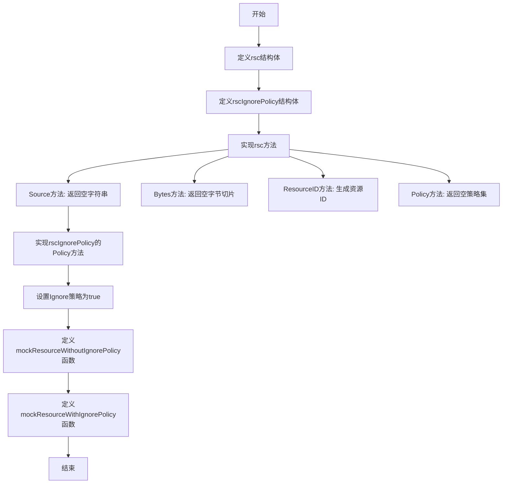
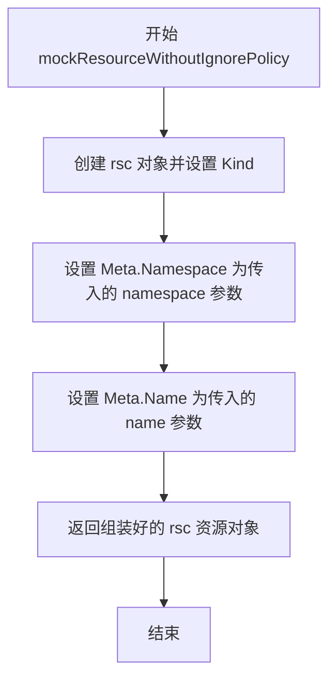
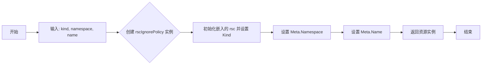
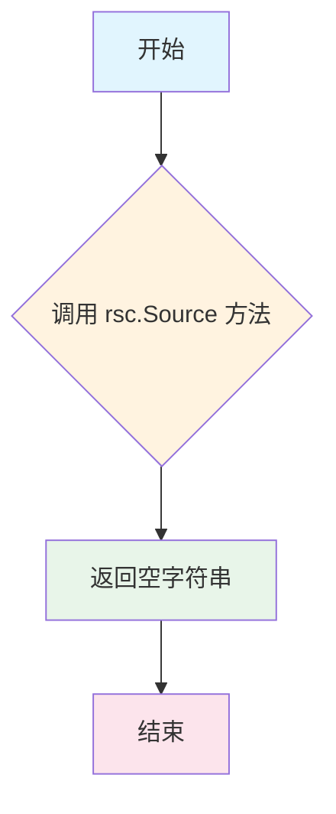
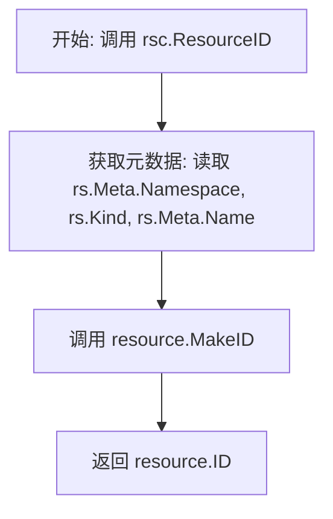
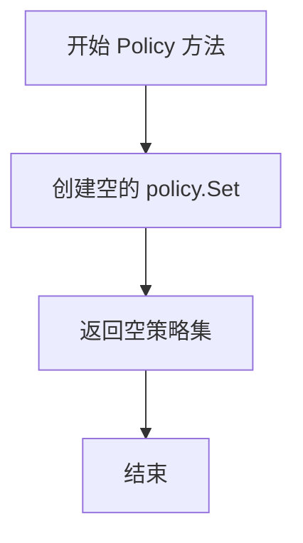
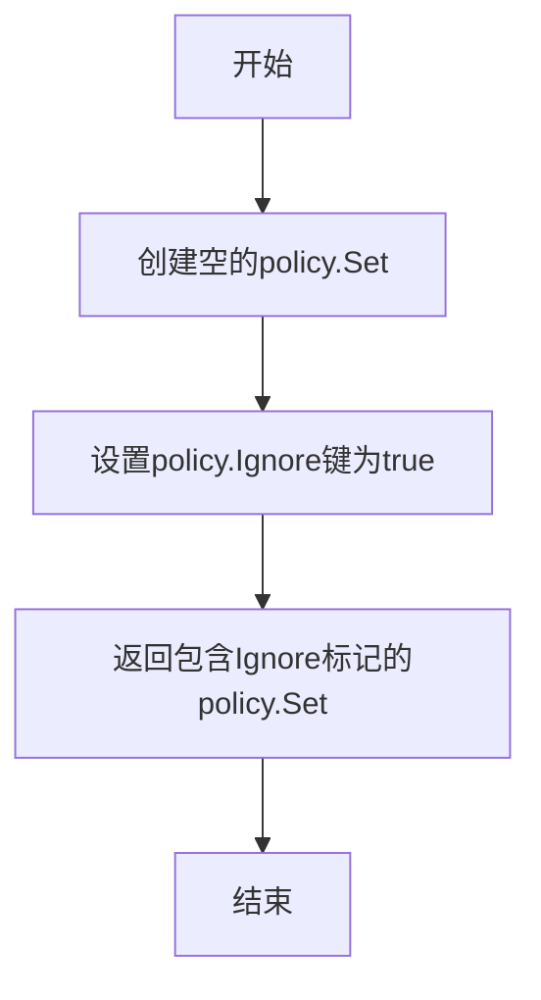

# `flux\pkg\sync\mock.go` 详细设计文档

该代码定义了一个用于Flux CD同步的资源抽象层，包含基础资源结构体rsc和带有忽略策略的资源结构体rscIgnorePolicy，提供了资源ID、策略和元数据的访问接口，以及用于测试的mock资源生成函数。

## 整体流程



## 类结构

```
rsc (资源结构体)
└── rscIgnorePolicy (带忽略策略的资源结构体，嵌入rsc)
```

## 全局变量及字段


### `mockResourceWithoutIgnorePolicy`
    
创建不带Ignore策略的模拟资源对象

类型：`func(kind, namespace, name string) rsc`
    


### `mockResourceWithIgnorePolicy`
    
创建带Ignore策略的模拟资源对象

类型：`func(kind, namespace, name string) rscIgnorePolicy`
    


### `rsc.bytes`
    
资源字节数据

类型：`[]byte`
    


### `rsc.Kind`
    
资源类型

类型：`string`
    


### `rsc.Meta`
    
元数据结构

类型：`struct`
    


### `rsc.Meta.Namespace`
    
命名空间

类型：`string`
    


### `rsc.Meta.Name`
    
资源名称

类型：`string`
    


### `rscIgnorePolicy.rsc`
    
嵌入的rsc结构体

类型：`嵌入`
    
    

## 全局函数及方法


### `mockResourceWithoutIgnorePolicy`

该函数用于创建一个不带忽略策略的模拟资源对象（rsc类型），通过接收资源类型、命名空间和名称三个参数，初始化并返回一个配置完整的模拟资源结构体实例。

参数：

- `kind`：`string`，资源的类型（Kind），如 Deployment、Service 等
- `namespace`：`string`，资源所在的命名空间
- `name`：`string`，资源的名称

返回值：`rsc`，返回不带忽略策略的模拟资源对象，其结构包含资源的元数据（Kind、Namespace、Name）

#### 流程图



#### 带注释源码

```go
// mockResourceWithoutIgnorePolicy 创建一个不带忽略策略的模拟资源
// 参数：
//   - kind: 资源的类型（如 Deployment、Service 等）
//   - namespace: 资源所在的命名空间
//   - name: 资源的名称
//
// 返回值：
//   - rsc: 不带忽略策略的模拟资源对象
func mockResourceWithoutIgnorePolicy(kind, namespace, name string) rsc {
	// 1. 创建基础 rsc 对象，仅设置 Kind 字段
	r := rsc{Kind: kind}
	
	// 2. 设置资源的命名空间信息
	r.Meta.Namespace = namespace
	
	// 3. 设置资源的名称信息
	r.Meta.Name = name
	
	// 4. 返回配置完整的模拟资源对象（无忽略策略）
	return r
}
```


### `mockResourceWithIgnorePolicy`

#### 描述
该函数用于创建一个模拟的 Kubernetes 资源对象，该对象包含特定的“忽略（Ignore）”策略。与普通的模拟资源不同，返回的 `rscIgnorePolicy` 实例在调用 `Policy()` 方法时，会返回包含 `policy.Ignore` 标记的策略集，常用于测试场景中模拟无需 Flux 同步的资源。

#### 参数

- `kind`：`string`，Kubernetes 资源的类型（例如 Deployment、Service 等）。
- `namespace`：`string`，资源所在的命名空间。
- `name`：`string`，资源的名称。

#### 返回值

- `rscIgnorePolicy`：返回一个嵌入 `rsc` 结构体的自定义类型，该类型重写了 `Policy` 方法以强制设置忽略策略。

#### 流程图



#### 带注释源码

```go
// mockResourceWithIgnorePolicy 创建一个带有忽略策略标记的模拟资源。
// 参数 kind 指定资源的类型，namespace 指定命名空间，name 指定资源名称。
// 返回的 rscIgnorePolicy 实例，其 Policy() 方法会返回包含 'policy.Ignore' 的策略集。
func mockResourceWithIgnorePolicy(kind, namespace, name string) rscIgnorePolicy {
	// 1. 创建一个 rscIgnorePolicy 实例，并在初始化时直接构造嵌入的 rsc 结构体且设置 Kind。
	ri := rscIgnorePolicy{rsc{Kind: kind}}
	
	// 2. 设置资源的元数据：命名空间。
	ri.Meta.Namespace = namespace
	
	// 3. 设置资源的元数据：名称。
	ri.Meta.Name = name
	
	// 4. 返回配置好的带有忽略策略的模拟资源。
	return ri
}
```


### `rsc.Source`

返回资源源地址，该方法为 `rsc` 结构体的成员方法，用于获取当前资源对象的源地址信息。当前实现返回空字符串，表明该资源对象未关联具体的源地址。

参数： 无（该方法为成员方法，通过接收者 `rs rsc` 访问）

返回值： `string`，返回资源的源地址字符串

#### 流程图



#### 带注释源码

```go
// Source 方法用于获取资源的源地址
// 接收者：rs rsc - rsc 结构体的实例
// 返回值：string - 资源的源地址
// 说明：当前实现返回空字符串，表示该资源未设置源地址
//       这可能是因为资源对象在创建时未指定源，或者该字段不适用于当前资源类型
func (rs rsc) Source() string {
	return ""
}
```


### `rsc.Bytes`

获取资源的原始字节数据。

参数：
- （无参数，该方法的接收者 `rs rsc` 为隐式参数）

返回值：`[]byte`，返回资源的原始字节内容（本实现中返回空切片）。

#### 流程图

```mermaid
graph TD
    A([开始]) --> B{执行 return []byte{}}
    B --> C[返回空字节切片]
    C --> D([结束])
```

#### 带注释源码

```go
// Bytes 返回资源的原始字节数据。
// 对于 rsc 结构体，其内部存储的是已解析的结构体字段（Meta, Kind），
// 而不是原始的字节内容。因此该方法返回一个空切片。
func (rs rsc) Bytes() []byte {
	return []byte{} // 返回空的字节切片
}
```


### `rsc.ResourceID`

这是一个定义在 `rsc` 结构体上的方法，用于根据资源对象中存储的元数据（命名空间、种类、名称）构造并返回资源的唯一标识符。

参数：

- `rs`：`rsc`，方法接收者（隐式参数），代表当前的资源对象实例。

返回值：`resource.ID`，返回资源的唯一标识符，通常由命名空间、种类和名称组合而成。

#### 流程图



#### 带注释源码

```go
// ResourceID 返回资源的唯一标识符
// 接收者: rs rsc
// 返回值: resource.ID
func (rs rsc) ResourceID() resource.ID {
    // 使用 resource.MakeID 根据元数据生成 ID
    // 参数: 命名空间(rs.Meta.Namespace), 种类(rs.Kind), 名称(rs.Meta.Name)
	return resource.MakeID(rs.Meta.Namespace, rs.Kind, rs.Meta.Name)
}
```


### `rsc.Policy`

获取资源策略集，返回该资源所关联的策略集合。

参数：

- 该方法无显式参数（`rs rsc` 为接收者，属于隐式参数）

返回值：`policy.Set`，返回资源的策略集合，若无特殊策略则返回空集合

#### 流程图



#### 带注释源码

```go
// Policy 返回资源的策略集
// 接收者: rs rsc - 资源对象实例
// 返回值: policy.Set - 资源的策略集合
func (rs rsc) Policy() policy.Set {
    // 初始化一个空的策略集
    p := policy.Set{}
    // 返回空的策略集，表示该资源没有特殊策略
    return p
}
```


### `rscIgnorePolicy.Policy()`

该方法用于返回包含Ignore标记的策略集，主要用于模拟资源被忽略的场景。当需要标识某个资源不应被Flux同步或处理时，可以通过此方法返回带有`policy.Ignore`键的策略集合。

参数：此方法无显式参数（仅有接收者 `ri rscIgnorePolicy`）

返回值：`policy.Set`，返回一个包含`policy.Ignore`标记的策略集合，表示该资源应被忽略

#### 流程图



#### 带注释源码

```go
// Policy 方法定义在 rscIgnorePolicy 类型上
// 返回包含Ignore标记的策略集，用于标识该资源应被忽略
func (ri rscIgnorePolicy) Policy() policy.Set {
    // 创建一个空的策略集合
    p := policy.Set{}
    // 设置Ignore策略为"true"，表示该资源被忽略
    p[policy.Ignore] = "true"
    // 返回带有Ignore标记的策略集
    return p
}
```

## 关键组件


### 核心资源结构体 (rsc)

表示Kubernetes资源的基础结构体，包含资源的字节内容、种类(Kind)和元数据(Namespace/Name)，是 Flux CD 同步流程中资源抽象的核心载体。

### 忽略策略资源结构体 (rscIgnorePolicy)

嵌入 rsc 的扩展结构体，通过重写 Policy() 方法为资源添加 Ignore 策略标记，用于标识需要被Flux忽略不同步的资源。

### 资源标识生成方法 (ResourceID)

根据资源的 Namespace、Kind 和 Name 组合生成唯一的 resource.ID，是资源在Flux系统中进行身份识别和关联的关键方法。

### 策略管理方法 (Policy)

返回资源的策略集合，rsc 返回空策略集，rscIgnorePolicy 返回包含 Ignore 策略的集合，用于控制资源的同步行为。

### 模拟资源工厂函数 (mockResourceWithoutIgnorePolicy)

用于测试目的的辅助函数，创建不包含 Ignore 策略的标准资源对象，支持动态传入 kind、namespace 和 name 参数。

### 模拟忽略策略资源工厂函数 (mockResourceWithIgnorePolicy)

用于测试目的的辅助函数，创建带有 Ignore 策略标记的资源对象，便于测试场景中模拟被忽略的资源。


## 问题及建议


### 已知问题

-   **未使用的导入**：`policy` 和 `resource` 包被导入，但在当前代码中未被实际使用（`policy.Set` 和 `resource.ID` 在方法签名中引用，但方法体未使用这些包的功能）
-   **空实现方法**：`Source()` 方法返回空字符串，`Bytes()` 方法返回空字节切片，这些方法看起来像是接口实现但实际返回无意义数据
-   **字段可见性问题**：`rsc` 结构体的 `Meta` 字段首字母大写（导出），但嵌套的 `Namespace` 和 `Name` 字段也是大写，这在 Go 中是正确的，但设计意图不明确
-   **未使用的字段**：`rsc` 结构体中的 `bytes` 字段声明但从未被使用
-   **重复代码逻辑**：`rscIgnorePolicy.Policy()` 方法与 `rsc.Policy()` 存在重复逻辑，没有利用嵌入结构体的优势进行代码复用
-   **缺失错误处理**：`ResourceID()` 方法调用 `resource.MakeID()` 可能会返回错误，但方法签名未包含错误返回值，调用方无法处理潜在的错误情况

### 优化建议

-   **移除未使用的导入**：清理未使用的 `policy` 和 `resource` 导入，或确认这些导入是否必要
-   **完善方法实现**：`Source()` 和 `Bytes()` 方法应返回实际数据，或标记为 TODO/注释说明为占位实现
-   **删除无用字段**：移除 `rsc` 结构体中未使用的 `bytes` 字段
-   **优化 Policy 方法**：在 `rscIgnorePolicy.Policy()` 中先调用 `rs.rsc.Policy()` 获取基础策略，再添加 `Ignore` 策略，避免重复逻辑
-   **添加错误处理**：修改 `ResourceID()` 方法签名包含错误返回值，或在文档中说明此方法的错误不会发生的前提条件
-   **考虑将 Mock 函数分离**：将 `mockResourceWithoutIgnorePolicy` 和 `mockResourceWithIgnorePolicy` 移至测试文件或专门的 mock 包中，保持生产代码整洁


## 其它


### 设计目标与约束

本代码的目标是创建用于测试目的的模拟Kubernetes资源对象，支持两种类型的资源：普通资源和带有忽略策略的资源。设计约束包括：必须实现fluxcd/flux包中Resource接口的特定方法，返回值需要符合预期格式，资源ID需要根据namespace、kind和name生成。

### 错误处理与异常设计

当前代码未包含显式的错误处理逻辑。潜在的错误场景包括：空字符串的namespace、kind或name可能导致无效的资源ID；Policy()方法返回空Set可能不符合调用方预期。建议添加参数校验、nil检查和适当的错误返回机制。

### 数据流与状态机

数据流主要涉及资源的创建和查询过程。mockResourceWithoutIgnorePolicy和mockResourceWithIgnorePolicy函数负责创建资源对象，其中rscIgnorePolicy嵌入了rsc结构并重写了Policy方法以添加Ignore策略。状态机不适用于此代码，因为资源对象创建后不涉及状态转换。

### 外部依赖与接口契约

外部依赖包括：github.com/fluxcd/flux/pkg/policy包提供policy.Set类型和policy.Ignore常量；github.com/fluxcd/flux/pkg/resource包提供resource.ID类型和MakeID函数。接口契约要求实现Resource接口（推测），包括Source()返回资源源、Bytes()返回资源字节内容、ResourceID()返回唯一标识符、Policy()返回策略集合。

### 性能考虑与优化空间

当前实现中Policy()方法每次调用都创建新的空Set然后添加Ignore，存在轻微的内存分配开销。可以考虑在rscIgnorePolicy初始化时直接设置Policy而非每次调用时创建。对于Bytes()和Source()方法返回空值，需要确认是否符合测试预期或需要填充模拟数据。

### 测试策略建议

建议添加单元测试验证：ResourceID是否正确组合了namespace、kind和name；Policy()方法是否正确返回期望的策略；两种mock函数创建的资源是否具有预期的属性差异；空参数和边界情况的处理。

### 代码组织与模块化

当前代码文件结构清晰但方法分散在结构体定义之后。建议将接口实现、构造函数和辅助方法分组定义。rscIgnorePolicy对rsc的嵌入方式适合继承行为，但需要注意嵌入结构的方法重写可能导致的混淆。


    