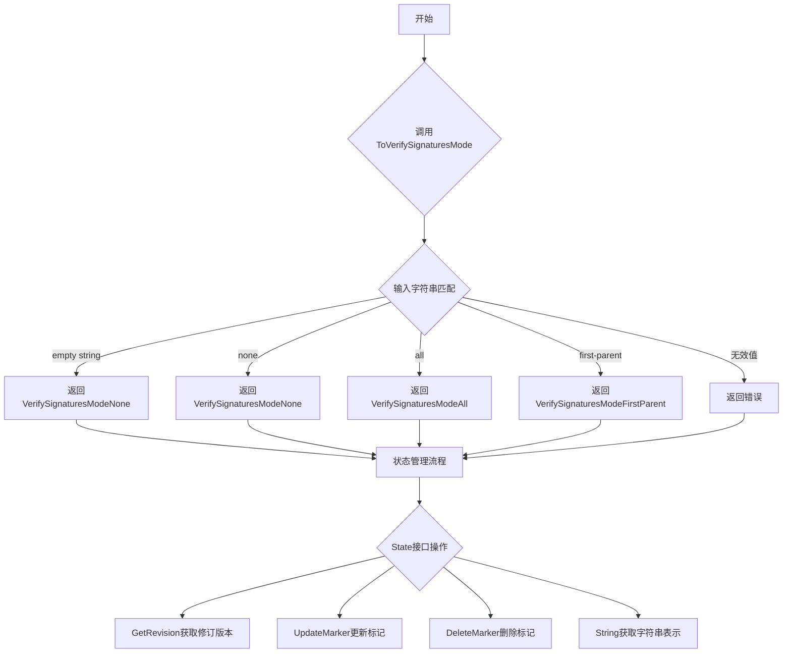
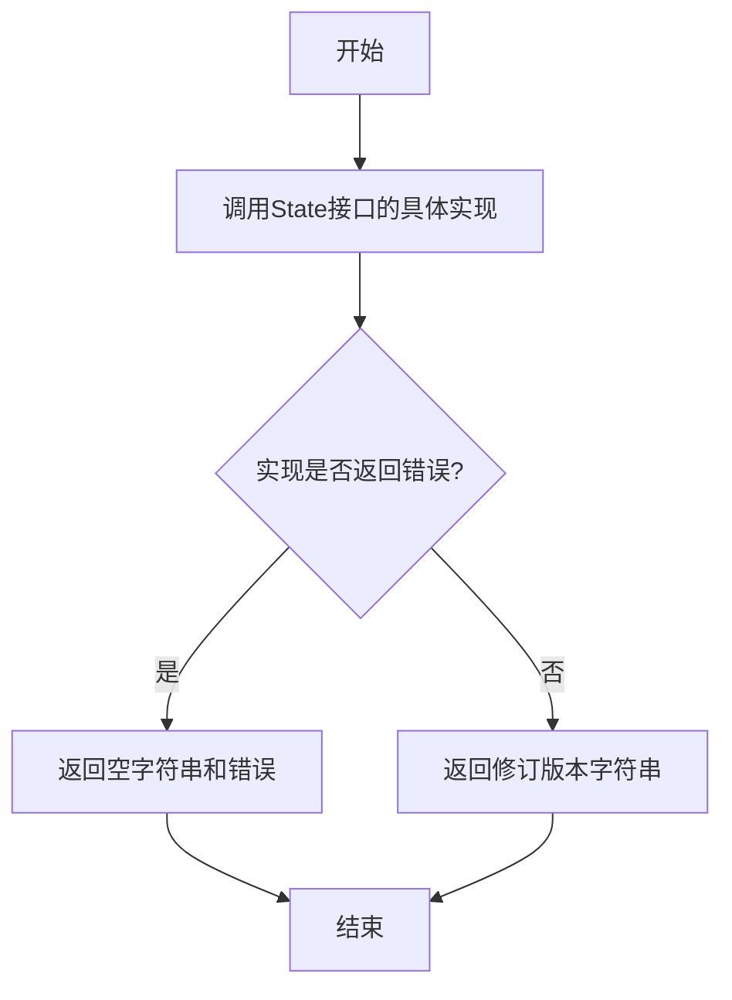
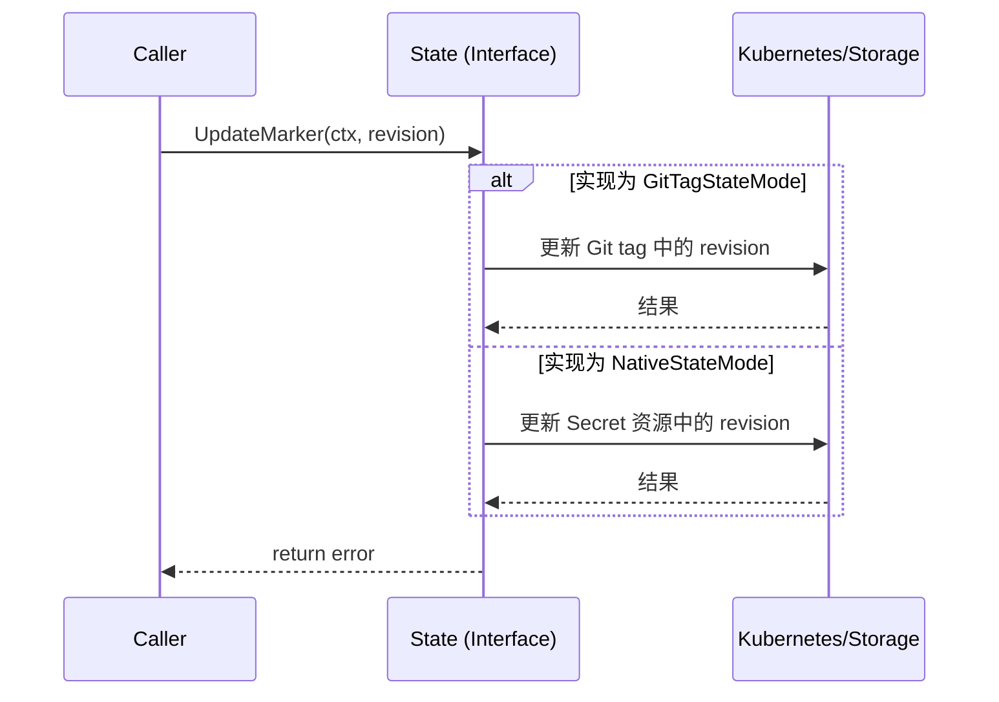
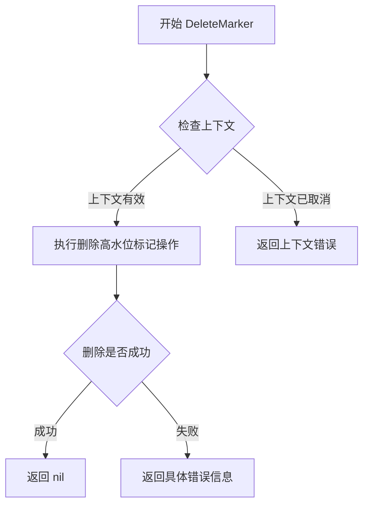
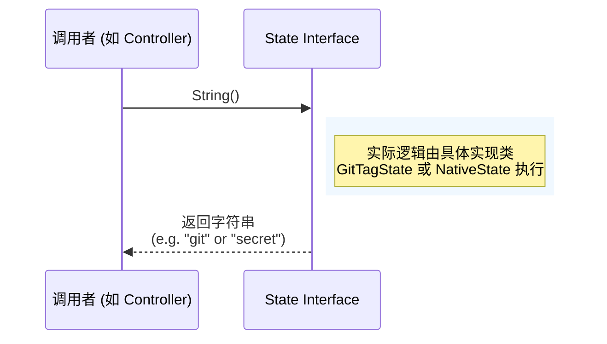

# `flux\pkg\sync\provider.go` 详细设计文档

该代码定义了一个Fluxcd的状态管理模块，提供了Git标签和Kubernetes Secret两种状态管理模式，并实现了GPG提交签名的验证策略选择功能。核心是通过State接口抽象状态存储，支持获取修订版本、更新和删除标记等操作。

## 整体流程



## 类结构

```
sync (包)
├── 常量定义
│   ├── GitTagStateMode
│   ├── NativeStateMode
│   ├── VerifySignaturesModeDefault
│   ├── VerifySignaturesModeNone
│   ├── VerifySignaturesModeAll
│   └── VerifySignaturesModeFirstParent
├── 类型定义
VerifySignaturesMode (string别名)
│   └── State (接口)
└── 函数
    └── ToVerifySignaturesMode
```

## 全局变量及字段


### `GitTagStateMode`
    
A state management mode where Flux uses a git tag for managing Flux state.

类型：`string`
    


### `NativeStateMode`
    
A state management mode where Flux uses native Kubernetes resources for managing Flux state.

类型：`string`
    


### `VerifySignaturesModeDefault`
    
Gets the default behavior when casting.

类型：`VerifySignaturesMode`
    


### `VerifySignaturesModeNone`
    
Default mode, does not verify any commits.

类型：`VerifySignaturesMode`
    


### `VerifySignaturesModeAll`
    
Considers all possible commits.

类型：`VerifySignaturesMode`
    


### `VerifySignaturesModeFirstParent`
    
Considers only commits on the chain of first parents.

类型：`VerifySignaturesMode`
    


    

## 全局函数及方法


### `ToVerifySignaturesMode`

将字符串转换为 `VerifySignaturesMode` 类型的函数，用于将用户输入的字符串映射为有效的 GPG 签名验证模式。如果输入字符串不是有效的模式，则返回错误。

参数：

-  `s`：`string`，需要转换的字符串，表示期望的签名验证模式

返回值：

-  `VerifySignaturesMode`：转换后的验证模式枚举值
-  `error`：如果输入无效则返回错误信息，否则返回 nil

#### 流程图

```mermaid
flowchart TD
    A[开始: 输入字符串 s] --> B{s == ""?}
    B -->|是| C[返回 VerifySignaturesModeNone]
    B -->|否| D{s == "none"?}
    D -->|是| E[返回 VerifySignaturesModeNone]
    D -->|否| F{s == "all"?}
    F -->|是| G[返回 VerifySignaturesModeAll]
    F -->|否| H{s == "first-parent"?}
    H -->|是| I[返回 VerifySignaturesModeFirstParent]
    H -->|否| J[返回错误: 无效的 git-verify-signatures-mode]
    C --> K[结束]
    E --> K
    G --> K
    I --> K
    J --> K
```

#### 带注释源码

```go
// ToVerifySignaturesMode converts a string to a VerifySignaturesMode
// 参数: s string - 需要转换的字符串
// 返回值: (VerifySignaturesMode, error) - 转换后的模式或错误
func ToVerifySignaturesMode(s string) (VerifySignaturesMode, error) {
    // 使用 switch 语句匹配输入字符串
    switch s {
    // 空字符串默认为不验证模式
    case VerifySignaturesModeDefault:
        return VerifySignaturesModeNone, nil
    // "none" 表示不验证任何提交
    case VerifySignaturesModeNone:
        return VerifySignaturesModeNone, nil
    // "all" 表示验证所有可能的提交
    case VerifySignaturesModeAll:
        return VerifySignaturesModeAll, nil
    // "first-parent" 只考虑主分支上的提交
    case VerifySignaturesModeFirstParent:
        return VerifySignaturesModeFirstParent, nil
    // 默认情况：输入无效，返回错误
    default:
        return VerifySignaturesModeNone, fmt.Errorf("'%s' is not a valid git-verify-signatures-mode", s)
    }
}
```


### `State.GetRevision`

获取已记录的修订版本号，如果尚未记录任何修订版本，则返回空字符串。

参数：

- `ctx`：`context.Context`，用于传递上下文信息，支持取消和超时控制

返回值：`string, error`，返回记录的修订版本字符串；若未记录则返回空字符串，同时返回可能的错误信息。

#### 流程图



#### 带注释源码

```go
// GetRevision 是 State 接口的方法，用于获取已记录的修订版本
// 如果没有记录过修订版本，应返回空字符串而不是错误
// 参数 ctx 用于传递上下文，支持取消和超时控制
// 返回值：
//   - string: 记录的修订版本，如果没有记录则为空字符串
//   - error: 获取修订版本时可能发生的错误
GetRevision(ctx context.Context) (string, error)
```


### `State.UpdateMarker`

该方法用于在状态管理中记录高性能标记（high water mark），通常用于跟踪已处理的最新修订版本。

参数：

- `ctx`：`context.Context`，上下文参数，用于控制请求的生命周期和取消操作
- `revision`：`string`，要记录的最新修订版本号（Git commit SHA 或 tag）

返回值：`error`，如果更新标记失败则返回错误信息

#### 流程图



#### 带注释源码

```go
// UpdateMarker records the high water mark
// 更新标记方法用于记录已处理的最高水位标记
// 参数:
//   - ctx: 上下文对象，用于控制请求超时和取消
//   - revision: 字符串类型，要记录的最新修订版本号
//
// 返回值:
//   - error: 如果更新失败返回错误，否则返回 nil
UpdateMarker(ctx context.Context, revision string) error
```


### `State.DeleteMarker`

该方法为 State 接口的一部分，用于删除之前记录的高水位标记（high water mark），即删除已记录的修订版本信息。

参数：

- `ctx`：`context.Context`，用于传递截止日期、取消信号以及其他请求范围内的值

返回值：`error`，如果删除高水位标记失败则返回错误，否则返回 nil

#### 流程图



#### 带注释源码

```go
// State 接口定义了状态管理的基本操作
type State interface {
	// GetRevision fetches the recorded revision, returning an empty
	// string if none has been recorded yet.
	GetRevision(ctx context.Context) (string, error)
	
	// UpdateMarker records the high water mark
	UpdateMarker(ctx context.Context, revision string) error
	
	// DeleteMarker removes the high water mark
	// 删除已记录的高水位标记（修订版本）
	// 参数 ctx: 上下文，用于控制请求的截止日期和取消信号
	// 返回值: 如果删除成功返回 nil，如果发生错误则返回具体的错误信息
	DeleteMarker(ctx context.Context) error
	
	// String returns a string representation of where the state is
	// recorded (e.g., for referring to it in logs)
	String() string
}
```

#### 备注

由于 `DeleteMarker` 是接口方法而非具体实现，上述流程图展示的是一般性的实现逻辑。实际实现（如 `GitTagStateMode` 或 `NativeStateMode` 的具体实现）需要提供真正的高水位标记删除逻辑，可能是删除 Git 标签或删除 Kubernetes Secret 资源。


### `State.String`

该方法用于获取状态存储后端的字符串标识（例如 "git" 或 "secret"），主要服务于日志记录和调试目的，以便开发人员能够直观地识别当前 Flux 状态是存储在 Git 标签中还是 Kubernetes Secret 中。

参数： 无

返回值： `string`， 返回状态存储位置的字符串描述（例如 "git" 或 "secret"），用于日志和调试信息。

#### 流程图



#### 带注释源码

```go
// String returns a string representation of where the state is
// recorded (e.g., for referring to it in logs)
String() string
```

## 关键组件


### GitTagStateMode

表示使用Git标签管理Flux状态的模式常量。

### NativeStateMode

表示使用原生Kubernetes资源（Secret）管理Flux状态的模式常量。

### VerifySignaturesMode

用于指定在Flux同步标签和Flux分支尖端之间选择要GPG验证的提交时使用的策略类型。

### ToVerifySignaturesMode

将字符串转换为VerifySignaturesMode类型的转换函数，用于验证和规范化GPG签名验证模式配置。

### State接口

定义了Flux状态管理的行为规范，提供了获取修订版本、更新高水位标记、删除标记以及获取状态存储位置字符串表示的方法。


## 问题及建议


### 已知问题

-   **命名不一致**：常量`NativeStateMode`使用值`"secret"`，但"secret"这个命名与实际含义（使用Kubernetes原生资源管理状态）不直观对应，容易造成误解
-   **默认值行为不明确**：`ToVerifySignaturesMode`函数中，`VerifySignaturesModeDefault`（空字符串）映射为`VerifySignaturesModeNone`，但常量注释"get the default behavior when casting"表述模糊，不清楚默认行为的实际含义
-   **错误信息格式问题**：错误信息`fmt.Errorf("'%s' is not a valid git-verify-signatures-mode", s)`中的单引号在Go错误日志中可能产生转义问题，建议使用反引号或调整格式
-   **State接口语义不清晰**：`UpdateMarker`方法注释为"records the high water mark"，但"marker"概念在整个代码中未被明确定义，其与`GetRevision`的关系也不明确
-   **缺失输入验证**：对于空字符串输入，`ToVerifySignaturesMode`返回`VerifySignaturesModeNone`而非错误，可能导致静默失败，增加调试难度

### 优化建议

-   将`NativeStateMode`的值从`"secret"`改为更语义化的名称，如`"native"`或`"kubernetes"`，以准确反映其功能
-   考虑使用枚举类型或明确常量组来替代字符串常量，增强类型安全性和可维护性
-   为`ToVerifySignaturesMode`函数添加更明确的输入验证逻辑，对于空字符串输入可选择返回错误或添加明确的日志警告
-   在State接口方法中添加更详细的文档，说明"revision"、"marker"等核心概念的定义及其相互关系
-   考虑添加单元测试来覆盖各种输入场景，特别是边界条件和错误路径

## 其它


### 设计目标与约束

**设计目标：**
- 提供统一的Flux状态管理抽象，支持多种状态存储后端（Git标签和Kubernetes Secret）
- 定义GPG签名验证策略，允许灵活配置提交验证方式
- 通过State接口解耦状态管理逻辑与具体实现

**约束：**
- 仅支持预定义的两种状态管理模式（git/secret）
- 签名验证模式必须为预定义的四种之一
- State接口实现需满足线程安全要求

### 错误处理与异常设计

- **ToVerifySignaturesMode函数**：当传入无效字符串时，返回VerifySignaturesModeNone并附带格式化错误信息
- **State接口方法**：各实现类需自行定义错误类型，建议遵循Go错误处理惯例
- **错误传播**：通过context.Context传递取消信号和超时控制

### 数据流与状态机

**状态转换流程：**
1. 初始化State实现（GitTag或Native模式）
2. 调用GetRevision获取当前记录的版本号
3. 业务逻辑执行后调用UpdateMarker更新高水位标记
4. 需要清理时调用DeleteMarker删除标记

**状态存储：**
- GitTagStateMode：版本信息存储为Git标签
- NativeStateMode：版本信息存储为Kubernetes Secret

### 外部依赖与接口契约

**依赖项：**
- context包：用于超时控制和取消操作
- fmt包：用于错误格式化

**接口契约（State接口）：**
- GetRevision：返回当前记录的修订版本号，若无记录返回空字符串
- UpdateMarker：接收修订版本号并存储，失败返回非nil错误
- DeleteMarker：删除存储的高水位标记，失败返回非nil错误
- String：返回状态存储位置的字符串表示，用于日志记录

### 安全性考虑

- VerifySignaturesModeNone（默认）：不验证任何提交，适合对安全性要求较低的环境
- VerifySignaturesModeAll：验证所有提交，性能开销较大
- VerifySignaturesModeFirstParent：仅验证主分支提交，平衡安全性和性能

### 版本兼容性

- 当前版本未定义版本号，建议添加版本常量以便后续兼容
- State接口添加新方法时需考虑向后兼容，建议使用结构体扩展而非修改接口

    