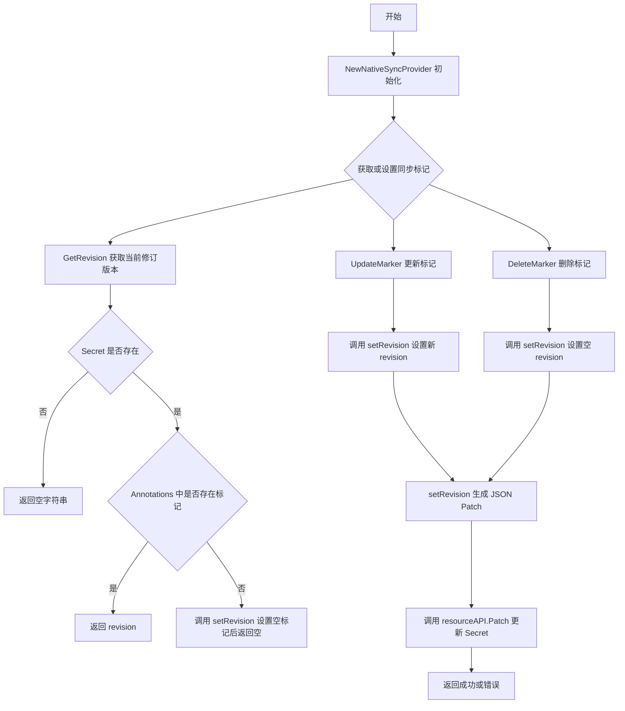
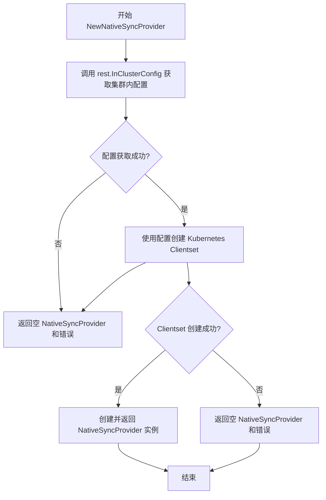
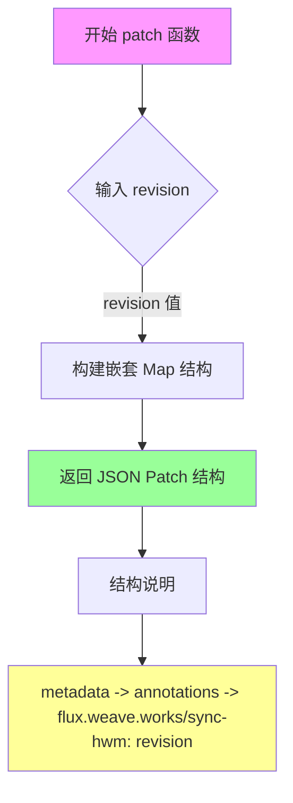
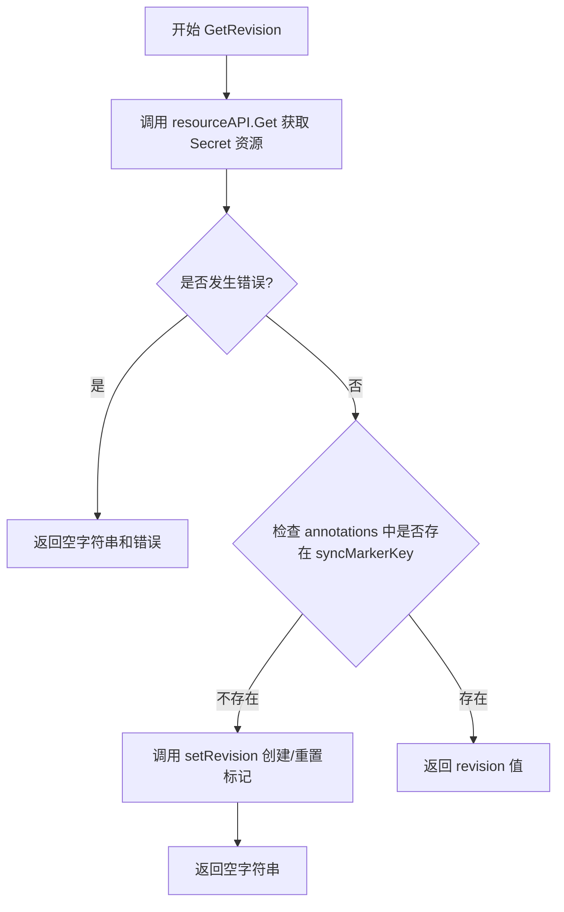
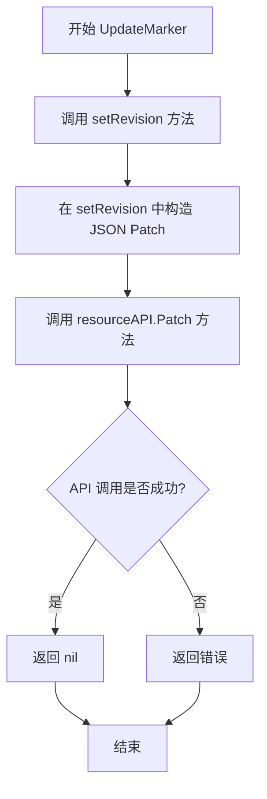
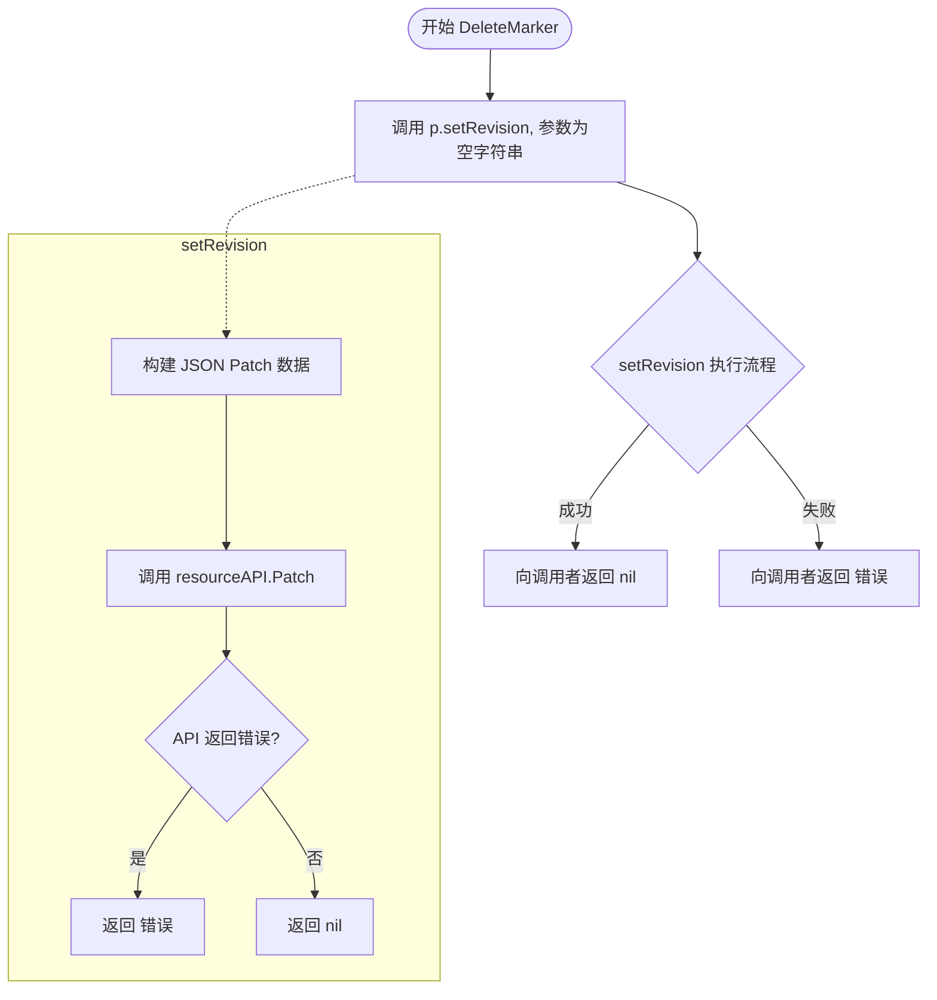
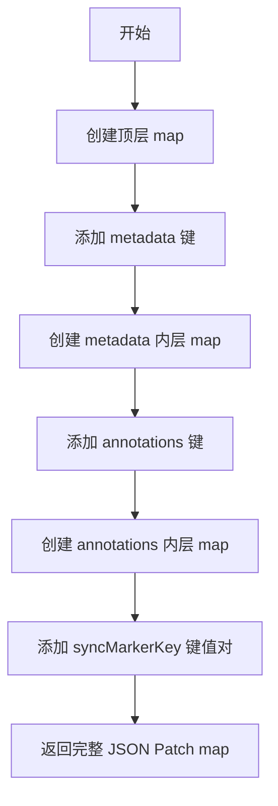

# `flux\pkg\sync\secret.go` 详细设计文档

该代码实现了一个 Kubernetes 原生的同步标记提供程序（NativeSyncProvider），用于在 Kubernetes Secret 资源中存储和管理 Flux 的同步标记（sync marker），通过 Annotations 记录 Flux 已同步到的修订版本，支持获取、更新和删除同步标记的操作。

## 整体流程



## 类结构

```
NativeSyncProvider (结构体 - Kubernetes 同步标记管理)
```

## 全局变量及字段


### `syncMarkerKey`
    
Flux 同步标记的 Annotation 键名

类型：`const string`
    


### `NativeSyncProvider.namespace`
    
Kubernetes 命名空间

类型：`string`
    


### `NativeSyncProvider.revision`
    
当前修订版本（未使用）

类型：`string`
    


### `NativeSyncProvider.resourceName`
    
Secret 资源名称

类型：`string`
    


### `NativeSyncProvider.resourceAPI`
    
Kubernetes Secrets API 接口

类型：`v1.SecretInterface`
    
    

## 全局函数及方法


### `NewNativeSyncProvider`

该函数用于创建并初始化一个 NativeSyncProvider 实例，通过获取集群内配置创建 Kubernetes 客户端集，并返回包含 Secret 资源 API 接口、命名空间和资源名称的 NativeSyncProvider 结构体实例。

参数：

- `namespace`：`string`，Kubernetes 命名空间，用于指定要操作的 Secret 资源所在的命名空间
- `resourceName`：`string`，Kubernetes Secret 资源名称，用于标识要操作的同步标记资源

返回值：`（NativeSyncProvider, error）`，成功时返回初始化完成的 NativeSyncProvider 结构体实例，失败时返回空结构和错误信息

#### 流程图



#### 带注释源码

```go
// NewNativeSyncProvider creates a new NativeSyncProvider
// NewNativeSyncProvider 用于创建并初始化一个新的 NativeSyncProvider 实例
// 参数:
//   - namespace: Kubernetes 命名空间，指定 Secret 资源所在的命名空间
//   - resourceName: Secret 资源的名称，用于存储同步标记
//
// 返回值:
//   - NativeSyncProvider: 初始化完成的结构体实例，包含资源 API 接口和元信息
//   - error: 如果获取集群配置或创建客户端失败，返回相应错误
func NewNativeSyncProvider(namespace string, resourceName string) (NativeSyncProvider, error) {
    // 尝试获取集群内运行配置
    // 这会使用服务账号的凭据自动配置客户端
    config, err := rest.InClusterConfig()
    if err != nil {
        // 配置获取失败，返回空结构体和错误
        return NativeSyncProvider{}, err
    }

    // 使用配置创建 Kubernetes 客户端集
    clientset, err := kubernetes.NewForConfig(config)
    if err != nil {
        // 客户端创建失败，返回空结构体和错误
        return NativeSyncProvider{}, err
    }

    // 返回初始化好的 NativeSyncProvider 结构体
    // 包含: Secret 资源的 API 接口、命名空间和资源名称
    return NativeSyncProvider{
        resourceAPI:  clientset.CoreV1().Secrets(namespace), // 设置 Secret 资源的 API 接口
        namespace:    namespace,                              // 设置命名空间
        resourceName: resourceName,                           // 设置资源名称
    }, nil
}
```

#### 关键组件信息

| 组件名称 | 描述 |
|---------|------|
| `NativeSyncProvider` | Kubernetes 原生同步提供者，用于管理 Flux 的同步标记（通过 Kubernetes Secret 的注解存储） |
| `rest.InClusterConfig()` | 用于获取在 Kubernetes 集群内运行时的配置信息，利用服务账号凭据 |
| `kubernetes.Clientset` | Kubernetes Go 客户端的客户端集，用于与 Kubernetes API 服务器交互 |
| `v1.SecretInterface` | Kubernetes Secret 资源的 API 接口，用于执行 Get、Patch 等操作 |
| `syncMarkerKey` | 同步标记的注解键名（`flux.weave.works/sync-hwm`），用于标识 Flux 已同步到的版本 |

#### 潜在的技术债务或优化空间

1. **缺乏配置注入机制**：当前硬编码使用 `rest.InClusterConfig()`，无法在集群外进行测试或使用自定义配置，建议通过依赖注入或选项模式提供配置接口
2. **错误处理不够详细**：返回的错误未经封装，调用方难以区分具体错误类型，建议定义自定义错误类型
3. **缺少资源验证**：在创建 Provider 时未验证 namespace 和 resourceName 的有效性，建议添加参数校验
4. **Clientset 未复用**：每次调用都创建新的 Clientset，在高频调用场景下会有性能开销，建议在调用方复用或改为单例模式

#### 其它项目

**设计目标与约束**：
- 目标：提供一种使用 Kubernetes 原生资源（Secret）存储 Flux 同步状态的方案
- 约束：仅适用于在 Kubernetes 集群内运行且拥有相应 RBAC 权限的进程

**错误处理与异常设计**：
- 使用 Go 标准的错误返回机制
- 可能的错误场景：集群内配置获取失败（未在集群内运行）、Clientset 创建失败、RBAC 权限不足
- 调用方需判断返回的 error 是否为 nil 来确认操作是否成功

**数据流与状态机**：
- NativeSyncProvider 通过 Secret 资源的 annotations 存储同步标记
- 状态转换：GetRevision 获取当前标记 → UpdateMarker 更新标记 → DeleteMarker 重置标记
- 使用 JSON Patch（StrategicMergePatchType）进行原子性更新

**外部依赖与接口契约**：
- 依赖 `k8s.io/client-go/kubernetes` 包与 Kubernetes API 服务器交互
- 依赖 `k8s.io/apimachinery/pkg` 包进行元数据操作
- 调用方需确保运行在 Kubernetes 集群内且拥有 Secret 的读写权限


### `patch`

该函数生成一个 JSON Patch 结构，用于更新 Kubernetes Secret 资源的 metadata.annotations 字段，将 syncMarkerKey ("flux.weave.works/sync-hwm") 指定的 annotation 值设置为传入的 revision 字符串。

参数：

- `revision`：`string`，要设置的同步标记修订版本值

返回值：`map[string]map[string]map[string]string`，JSON Patch 结构，用于通过 Kubernetes StrategicMergePatch 方式更新 Secret 的 annotations

#### 流程图



#### 带注释源码

```go
// patch 函数生成用于更新 Annotations 的 JSON Patch 结构
// 输入参数 revision: 要设置的同步标记修订版本值
// 返回值: 嵌套 Map 结构，映射为 Kubernetes StrategicMergePatch 格式的 JSON
func patch(revision string) map[string]map[string]map[string]string {
    // 返回一个三层嵌套的 map，结构如下：
    // {
    //   "metadata": {
    //     "annotations": {
    //       "flux.weave.works/sync-hwm": <revision值>
    //     }
    //   }
    // }
    // 此结构用于 Kubernetes Patch API 更新 Secret 的 annotations
    return map[string]map[string]map[string]string{
        "metadata": map[string]map[string]string{
            "annotations": map[string]string{
                syncMarkerKey: revision, // 使用包级常量作为 annotation key
            },
        },
    }
}
```

---

### 文档总结

#### 1. 一段话描述

`NativeSyncProvider` 是一个 Kubernetes 原生同步状态提供器，通过在指定的 Secret 资源中存储 `flux.weave.works/sync-hwm` annotation 来跟踪 Flux 的同步进度，支持获取、更新和删除同步标记的操作。

#### 2. 文件的整体运行流程

```
NewNativeSyncProvider
    │
    ├─► rest.InClusterConfig()         // 获取集群内配置
    ├─► kubernetes.NewForConfig()     // 创建客户端集
    └─► 返回 NativeSyncProvider 实例
    
运行时调用链:
    │
    ├─► GetRevision()      // 获取当前 revision
    │      └─► resourceAPI.Get() -> 检查 annotations
    │
    ├─► UpdateMarker()     // 更新 revision
    │      └─► setRevision() -> json.Marshal(patch()) -> resourceAPI.Patch()
    │
    └─► DeleteMarker()     // 删除 revision
           └─► setRevision("") -> json.Marshal(patch()) -> resourceAPI.Patch()
```

#### 3. 类的详细信息

##### 3.1 NativeSyncProvider 结构体

| 字段名称 | 类型 | 描述 |
|---------|------|------|
| namespace | string | Kubernetes 命名空间 |
| revision | string | 当前同步修订版本（未在代码中使用，仅定义） |
| resourceName | string | 存储同步标记的 Secret 资源名称 |
| resourceAPI | v1.SecretInterface | Secret 资源的 Kubernetes API 接口 |

##### 3.2 类方法

| 方法名称 | 描述 |
|---------|------|
| NewNativeSyncProvider | 构造函数，创建并返回 NativeSyncProvider 实例 |
| String | 返回格式化的字符串描述 |
| GetRevision | 获取当前存储的同步标记修订版本 |
| UpdateMarker | 更新同步标记指向的修订版本 |
| DeleteMarker | 重置/删除同步标记 |
| setRevision | 内部方法，执行实际的 PATCH 操作 |

##### 3.3 全局变量

| 变量名称 | 类型 | 描述 |
|---------|------|------|
| syncMarkerKey | const string | annotation 键名："flux.weave.works/sync-hwm" |

##### 3.4 全局函数

| 函数名称 | 描述 |
|---------|------|
| patch | 生成 JSON Patch 结构用于更新 annotations |

#### 4. 关键组件信息

| 组件名称 | 一句话描述 |
|---------|-----------|
| NativeSyncProvider | 管理 Kubernetes Secret 中同步标记的核心结构体 |
| syncMarkerKey | 用于标识 Flux 同步进度的 annotation 键常量 |
| patch | 生成 Kubernetes StrategicMergePatch 数据的辅助函数 |
| resourceAPI | Kubernetes Secret 操作的客户端接口 |

#### 5. 潜在的技术债务或优化空间

1. **硬编码的 Patch 类型**：使用 `StrategicMergePatchType`，但未提供配置选项；部分场景可能需要 JSON Patch (RFC 6902)
2. **错误处理不足**：`GetRevision` 返回空字符串时无法区分"不存在 annotation"和"annotation 值为空"
3. **资源类型限制**：目前仅支持 Secret 资源，不支持 ConfigMap 或其他资源类型
4. **缺少重试机制**：Patch 操作失败时没有重试逻辑
5. **Secret 硬编码**：未考虑用户可能需要指定不同类型的 Kubernetes 资源

#### 6. 其它项目

##### 设计目标与约束

- **设计目标**：提供一种在 Kubernetes 原生资源中持久化 Flux 同步状态的方式
- **约束**：依赖 Kubernetes In-Cluster 配置，仅限于集群内访问

##### 错误处理与异常设计

- `NewNativeSyncProvider`：配置或客户端创建失败时返回 error
- `GetRevision`：资源不存在或 annotation 缺失时返回 error
- `setRevision`：Patch 操作失败时返回 error

##### 数据流与状态机

```
状态: Initial -> Syncing -> Synced
       |
       v
  存储到 Secret annotations:
  key: "flux.weave.works/sync-hwm"
  value: "<revision>"
```

##### 外部依赖与接口契约

- **Kubernetes Client-Go**: 用于与 Kubernetes API 交互
- **Kubernetes API Machinery**: 用于类型定义 (meta_v1, types)
- **依赖的包**:
  - `k8s.io/client-go/kubernetes`
  - `k8s.io/apimachinery/pkg/apis/meta/v1`
  - `k8s.io/apimachinery/pkg/types`
  - `encoding/json`


### `NewNativeSyncProvider`

创建一个新的 `NativeSyncProvider` 实例，用于在 Kubernetes 集群中通过 Secret 资源存储和同步 flux 的同步标记（revision）。

参数：

- `namespace`：`string`，Kubernetes 命名空间，指定 Secret 资源所在的命名空间
- `resourceName`：`string`，Secret 资源的名称，用于存储同步标记

返回值：`NativeSyncProvider, error`，返回新创建的 NativeSyncProvider 实例；如果在获取集群配置或创建客户端集时发生错误，则返回错误

#### 流程图

```mermaid
flowchart TD
    A[开始 NewNativeSyncProvider] --> B[调用 rest.InClusterConfig 获取集群内配置]
    B --> C{config 获取成功?}
    C -->|否| D[返回空 NativeSyncProvider 和错误]
    C -->|是| E[kubernetes.NewForConfig 创建客户端集]
    E --> F{clientset 创建成功?}
    F -->|否| G[返回空 NativeSyncProvider 和错误]
    F -->|是| H[构造 NativeSyncProvider 结构体]
    H --> I[设置 resourceAPI 为 clientset.CoreV1().Secrets]
    I --> J[设置 namespace 和 resourceName]
    J --> K[返回 NativeSyncProvider 实例和 nil 错误]
    D --> L[结束]
    G --> L
    K --> L
```

#### 带注释源码

```go
// NewNativeSyncProvider creates a new NativeSyncProvider
// 参数：
//   - namespace: string, Kubernetes 命名空间，用于定位 Secret 资源
//   - resourceName: string, Secret 资源的名称，用于存储同步标记
// 返回值：
//   - NativeSyncProvider: 新创建的提供者实例
//   - error: 配置或客户端创建失败时返回错误
func NewNativeSyncProvider(namespace string, resourceName string) (NativeSyncProvider, error) {
	// 尝试获取 Kubernetes 集群内配置
	// 当 Pod 在 Kubernetes 集群内运行时，可通过 ServiceAccount 自动获取配置
	config, err := rest.InClusterConfig()
	if err != nil {
		// 配置获取失败，返回空结构体和错误
		return NativeSyncProvider{}, err
	}

	// 使用配置创建 Kubernetes 客户端集
	clientset, err := kubernetes.NewForConfig(config)
	if err != nil {
		// 客户端创建失败，返回空结构体和错误
		return NativeSyncProvider{}, err
	}

	// 创建并返回 NativeSyncProvider 实例
	// 初始化资源API接口、命名空间和资源名称
	return NativeSyncProvider{
		resourceAPI:  clientset.CoreV1().Secrets(namespace), // 设置 Secret 资源的 API 接口
		namespace:    namespace,                               // 存储命名空间
		resourceName: resourceName,                             // 存储资源名称
	}, nil
}
```


### NativeSyncProvider.String

该方法实现了 Go 语言的 `fmt.Stringer` 接口，用于返回 NativeSyncProvider 对象的字符串表示形式，格式为 `kubernetes {namespace}:secret/{resourceName}`，便于日志记录和调试输出。

参数：

- （无参数）

返回值：`string`，返回 Kubernetes 机密的字符串表示，格式为 `"kubernetes " + namespace + ":secret/" + resourceName`

#### 流程图

```mermaid
graph TD
    A[开始] --> B[拼接字符串]
    B --> C[返回格式: kubernetes {namespace}:secret/{resourceName}]
    C --> D[结束]
```

#### 带注释源码

```go
// String 返回 NativeSyncProvider 的字符串表示
// 实现了 fmt.Stringer 接口
// 返回格式: "kubernetes {namespace}:secret/{resourceName}"
// 例如: "kubernetes default:secret/flux-sync"
func (p NativeSyncProvider) String() string {
	// 拼接命名空间和资源名称，返回格式化字符串
	// p.namespace: Kubernetes 命名空间
	// p.resourceName: Secret 资源名称
	return "kubernetes " + p.namespace + ":secret/" + p.resourceName
}
```


### `NativeSyncProvider.GetRevision`

获取当前同步标记的修订版本（代表 Flux 已同步到的位置）。

参数：

- `ctx`：`context.Context`，Go 语言标准库的上下文对象，用于传递取消信号、超时控制等请求范围内的数据

返回值：`(string, error)`，返回当前的修订版本字符串，如果发生错误则返回错误信息

#### 流程图



#### 带注释源码

```go
// GetRevision 获取当前同步标记的修订版本
// 该方法代表 Flux 已经同步到的位置
// 参数 ctx 用于控制请求超时和取消
// 返回值：(修订版本字符串, 错误)
func (p NativeSyncProvider) GetRevision(ctx context.Context) (string, error) {
	// 通过 Kubernetes Secret API 获取名为 resourceName 的 Secret 资源
	// meta_v1.GetOptions{} 使用默认的获取选项
	resource, err := p.resourceAPI.Get(ctx, p.resourceName, meta_v1.GetOptions{})
	
	// 如果获取资源失败，直接返回空字符串和错误信息
	if err != nil {
		return "", err
	}
	
	// 从资源的 Annotations 中查找同步标记键 (syncMarkerKey = "flux.weave.works/sync-hwm")
	revision, exists := resource.Annotations[syncMarkerKey]
	
	// 如果标记不存在，说明是首次获取或标记已被删除
	// 调用 setRevision 创建空的修订标记
	if !exists {
		return "", p.setRevision(ctx, "")
	}
	
	// 标记存在，返回当前修订版本
	return revision, nil
}
```


### `NativeSyncProvider.UpdateMarker`

更新同步标记的修订版本，通过调用内部方法 `setRevision` 来修改 Kubernetes Secret 资源中的注解，从而记录 Flux 已同步到的目标版本。

参数：

- `ctx`：`context.Context`，用于请求超时控制和取消的上下文对象
- `revision`：`string`，要设置的修订版本号，表示 Flux 已同步到的目标版本

返回值：`error`，如果更新标记失败则返回错误，否则返回 nil

#### 流程图



#### 带注释源码

```
// UpdateMarker updates the revision the sync marker points to.
// 它更新同步标记指向的修订版本，通过调用内部的 setRevision 方法实现
// 参数 ctx 用于控制请求生命周期，revision 为要设置的新修订版本
func (p NativeSyncProvider) UpdateMarker(ctx context.Context, revision string) error {
	// 委托给 setRevision 方法执行实际的更新逻辑
	// 内部会创建 JSON Patch 并调用 Kubernetes API 更新 Secret 资源
	return p.setRevision(ctx, revision)
}
```

#### 相关内部方法详情

`UpdateMarker` 依赖 `setRevision` 方法完成实际工作：

```
// setRevision 是私有方法，负责构造并执行 JSON Patch 请求
// 1. 将 revision 封装为 patch 对象（包含 metadata.annotations 结构调整）
// 2. 使用 json.Marshal 将 patch 对象序列化为 JSON 格式
// 3. 调用 resourceAPI.Patch 使用 StrategicMergePatchType 策略更新 Secret
// 4. 更新注解键为 "flux.weave.works/sync-hwm" 的值为新 revision
func (p NativeSyncProvider) setRevision(ctx context.Context, revision string) error {
	jsonPatch, err := json.Marshal(patch(revision))
	if err != nil {
		return err
	}

	_, err = p.resourceAPI.Patch(
		ctx,
		p.resourceName,
		types.StrategicMergePatchType,
		jsonPatch,
		meta_v1.PatchOptions{},
	)
	return err
}
```


### `NativeSyncProvider.DeleteMarker`

该方法用于重置（即删除）当前存储在 Kubernetes Secret 中的同步标记。它通过调用内部方法 `setRevision` 并传入空字符串作为修订版本，从而清除 `flux.weave.works/sync-hwm` 注解的内容。

参数：
-  `ctx`：`context.Context`，用于控制请求的截止时间和取消信号。

返回值：`error`，如果标记清除成功则返回 `nil`，否则返回 Kubernetes API 调用过程中产生的错误。

#### 流程图



#### 带注释源码

```go
// DeleteMarker resets the state of the object.
// This method effectively deletes the sync marker by setting the revision
// to an empty string, which triggers a patch operation on the Kubernetes Secret.
func (p NativeSyncProvider) DeleteMarker(ctx context.Context) error {
	// 调用 setRevision 方法，传入空字符串以清除注解
	return p.setRevision(ctx, "")
}
```


### `NativeSyncProvider.setRevision`

该方法是一个内部私有方法，用于将指定的修订版本（revision）更新到 Kubernetes Secret 资源的注解（annotations）中。它通过构造 JSON Patch 请求并调用 Kubernetes API 的 Patch 方法来实现原子性的注解更新。

参数：

- `ctx`：`context.Context`，用于控制请求的截止时间、取消和传递请求范围内的值
- `revision`：`string`，要设置的修订版本号，通常用于标记 Flux 已同步到的位置

返回值：`error`，如果更新成功则返回 nil，如果发生错误（如 JSON 序列化失败或 Kubernetes API 调用失败）则返回相应的错误信息

#### 流程图

```mermaid
flowchart TD
    A[开始 setRevision] --> B[调用 json.Marshal patch(revision)]
    B --> C{JSON 序列化是否成功?}
    C -->|是| D[调用 p.resourceAPI.Patch]
    C -->|否| E[返回 err]
    D --> F{Patch 操作是否成功?}
    F -->|是| G[返回 nil]
    F -->|否| H[返回 err]
    
    style A fill:#f9f,stroke:#333
    style D fill:#bbf,stroke:#333
    style G fill:#bfb,stroke:#333
    style E fill:#fbb,stroke:#333
    style H fill:#fbb,stroke:#333
```

#### 带注释源码

```go
// setRevision 是一个内部私有方法，用于将修订版本更新到 Kubernetes Secret 资源的注解中
// 参数 ctx 用于控制请求的上下文，revision 是要设置的修订版本字符串
func (p NativeSyncProvider) setRevision(ctx context.Context, revision string) error {
	// 第一步：将 revision 包装成 JSON Patch 格式
	// patch(revision) 返回一个 map，用于描述要修改的 Kubernetes 资源字段
	// 这里构建的是修改 metadata.annotations 下的 syncMarkerKey 注解的 patch
	jsonPatch, err := json.Marshal(patch(revision))
	
	// 检查 JSON 序列化是否成功
	if err != nil {
		// 如果失败，直接返回错误，不继续执行
		return err
	}

	// 第二步：调用 Kubernetes API 执行 Patch 操作
	// 使用 StrategicMergePatchType 进行合并patch
	// p.resourceAPI 是 SecretInterface 类型，用于操作 namespace 下的 Secret 资源
	_, err = p.resourceAPI.Patch(
		ctx,                    // 上下文，控制请求超时和取消
		p.resourceName,         // 要修改的 Secret 资源名称
		types.StrategicMergePatchType,  // patch 类型，支持智能合并
		jsonPatch,              // 上面构建的 JSON Patch 数据
		meta_v1.PatchOptions{}, // patch 操作的可选配置
	)
	
	// 返回 patch 操作的结果
	// 如果 API 调用失败，err 会包含具体的错误信息
	// 如果成功，err 为 nil
	return err
}

// patch 是一个辅助函数，用于构建 JSON Patch 结构体
// 它创建一个嵌套的 map，描述如何修改 Secret 的 annotations
// 返回的 map 结构符合 Kubernetes JSON Patch 规范
func patch(revision string) map[string]map[string]map[string]string {
	// 构建 patch 文档：修改 metadata.annotations 下的特定键
	return map[string]map[string]map[string]string{
		"metadata": map[string]map[string]string{
			"annotations": map[string]string{
				// syncMarkerKey 是预定义的常量 "flux.weave.works/sync-hwm"
				// 用于标识 Flux 同步标记的键
				syncMarkerKey: revision,
			},
		},
	}
}
```


### `patch` (内部函数)

生成用于更新 Kubernetes Secret 资源 annotations 的 JSON Patch 地图结构，用于修改 sync marker 的修订版本。

参数：

- `revision`：`string`，需要设置的修订版本字符串

返回值：`map[string]map[string]map[string]string`，用于 JSON Patch 操作的嵌套 map 结构，包含 metadata.annotations 的更新内容

#### 流程图



#### 带注释源码

```go
// patch 函数生成一个用于 Kubernetes JSON Patch 的数据结构
// 用于更新 Secret 资源的 annotations 字段
func patch(revision string) map[string]map[string]map[string]string {
	// 返回一个三层嵌套的 map 结构：
	// 第一层：包含 metadata 键
	// 第二层：metadata 中包含 annotations 键
	// 第三层：annotations 中包含 syncMarkerKey 和对应的 revision 值
	return map[string]map[string]map[string]string{
		"metadata": map[string]map[string]string{
			"annotations": map[string]string{
				syncMarkerKey: revision, // 将 syncMarkerKey 映射到传入的 revision 值
			},
		},
	}
}
```

## 关键组件


### NativeSyncProvider 结构体

核心结构体，封装了与Kubernetes Secret交互所需的所有信息，包括命名空间、资源名称和Secret API客户端。用于在Kubernetes原生资源中存储和管理同步标记（sync marker）的状态。

### syncMarkerKey 全局常量

定义在Secret的annotations中用于标识Flux同步状态的键名（"flux.weave.works/sync-hwm"）。作为FluxCD与集群状态同步的标识符，承载当前同步到的Git commit哈希值。

### NewNativeSyncProvider 构造函数

创建NativeSyncProvider实例，初始化Kubernetes客户端连接。在集群内通过rest.InClusterConfig()获取配置，创建CoreV1的Secrets客户端，返回配置好的Provider实例或错误信息。

### GetRevision 方法

从Kubernetes Secret的annotations中获取当前同步标记（revision）。通过resourceAPI.Get获取Secret对象，查询syncMarkerKey annotation的值，若不存在则返回空字符串并调用setRevision初始化。

### UpdateMarker 方法

更新同步标记到指定revision。调用内部方法setRevision将新的revision值写入Secret的annotations中，实现同步状态的持久化。

### DeleteMarker 方法

重置同步状态，将revision设置为空字符串。调用setRevision方法将syncMarkerKey的annotation值置为空，实现标记的删除操作。

### setRevision 内部方法

核心的patch更新逻辑，使用Kubernetes的StrategicMergePatchType对Secret进行原子性更新。接收context和revision参数，构造JSON patch请求并调用resourceAPI.Patch执行更新。

### patch 辅助函数

生成用于更新Secret annotations的JSON patch结构体。返回一个嵌套map，指定metadata.annotations路径下的syncMarkerKey值为传入的revision参数。


## 问题及建议


### 已知问题

- **错误处理不完善**：GetRevision方法在annotation不存在时调用setRevision返回空字符串，但忽略了setRevision可能返回的错误，导致错误信息丢失
- **并发安全问题**：NativeSyncProvider使用值类型receiver，在多线程环境下可能存在竞态条件，缺乏同步机制保护
- **缺乏重试机制**：Kubernetes API调用（Get、Patch）没有实现重试逻辑，网络抖动或短暂故障会导致操作直接失败
- **资源验证缺失**：代码未验证Secret资源是否存在、类型是否正确，也没有处理资源被意外删除的情况
- **硬编码配置**：syncMarkerKey annotation名称硬编码在代码中，缺乏灵活性，无法适配不同部署场景
- **日志缺失**：整个代码没有任何日志记录，关键操作（获取revision、更新marker）均无日志，线上问题难以排查
- **接口设计缺失**：缺少接口定义，直接依赖具体实现NativeSyncProvider，不利于单元测试和依赖注入
- **DeleteMarker语义不清**：DeleteMarker只是将revision设为空字符串，并非真正删除资源，方法命名可能造成误解
- **上下文超时处理不足**：直接使用传入的ctx，未进行超时验证或提供默认超时机制
- **资源版本冲突风险**：使用StrategicMergePatchType进行patch操作，在资源版本冲突时缺乏重试机制

### 优化建议

- **改进错误处理**：在GetRevision中正确处理setRevision的返回值，并在关键操作处添加详细的错误日志
- **添加接口抽象**：定义SyncProvider接口，将NativeSyncProvider作为实现，便于测试和替换
- **实现重试机制**：使用client-go的wait包或自定义重试逻辑处理Kubernetes API调用失败
- **增强资源验证**：在初始化时验证Secret是否存在，操作前检查资源状态
- **配置外部化**：将annotation key、namespace等配置通过构造函数或配置文件注入
- **添加日志记录**：使用klog或zap等日志框架记录关键操作和错误信息
- **考虑使用Update替代Patch**：对于简单的annotation更新，Update可能比Patch更可靠且更容易处理版本冲突
- **添加超时控制**：为ctx设置默认超时，或在使用前检查ctx状态
- **改进方法语义**：考虑重命名DeleteMarker为ClearMarker或提供真正的删除方法，并在文档中明确其行为
- **添加指标暴露**：集成prometheus等监控工具，暴露操作成功率、耗时等指标


## 其它


### 设计目标与约束

本模块的设计目标是提供一个轻量级的同步标记管理机制，通过Kubernetes原生的Secret资源存储Flux的同步进度标记。约束条件包括：1) 必须运行在Kubernetes集群内（使用InClusterConfig）；2) 依赖CoreV1 Secrets API；3) 同步标记存储在Secret的annotations中，键名为"flux.weave.works/sync-hwm"。

### 错误处理与异常设计

错误处理采用Go标准的错误返回模式。NewNativeSyncProvider构造函数在配置加载和客户端创建失败时返回error；GetRevision在Secret不存在或annotations缺失时返回空字符串和错误；UpdateMarker和DeleteMarker通过setRevision统一处理JSON序列化错误和API调用错误。关键异常场景包括：集群连接失败、Secret资源权限不足、网络超时、并发修改冲突（通过StrategicMergePatchType部分更新解决）。

### 数据流与状态机

数据流为单向流动：外部调用GetRevision获取当前同步状态 → 查询Secret的annotations[syncMarkerKey] → 返回revision字符串。更新流程：调用UpdateMarker → 生成JSON Patch → 调用resourceAPI.Patch更新annotations。状态机包含三个状态：未初始化（Secret无标记）、已同步（包含revision值）、已重置（标记为空字符串）。DeleteMarker将状态重置为已重置。

### 外部依赖与接口契约

外部依赖包括：k8s.io/client-go/kubernetes（集群访问）、k8s.io/client-go/kubernetes/typed/core/v1（Secret API）、k8s.io/apimachinery（资源类型定义）、k8s.io/apimachinery/pkg/types（Patch类型）。接口契约方面：NativeSyncProvider无需实现特定接口，但隐含要求调用者提供有效Kubernetes集群访问权限；方法签名为(ctx context.Context)参数模式，支持超时和取消传播。

### 安全性考虑

本模块以ServiceAccount方式运行，需确保Pod具有对指定Namespace Secret资源的get和patch权限。Secret资源本身应受Kubernetes RBAC保护，防止未授权读取同步状态。JSON Patch使用StrategicMergePatchType，可防止完全覆盖metadata其他字段。

### 性能考量

每次GetRevision和UpdateMarker都产生一次API Server调用，存在网络延迟。Secret查询为GET请求，更新为PATCH请求。在高频调用场景下建议在调用方增加缓存层。Kubernetes客户端默认使用15秒超时配置。

### 并发处理

StrategicMergePatchType在Kubernetes API层面支持并发更新，但存在冲突重试需由调用方处理。当前实现未实现重试逻辑，多个控制器实例同时操作同一Secret时可能导致冲突错误。建议在生产环境中由上层协调机制（如leader election）保证单实例操作。

### 测试策略

建议包含以下测试用例：1) NewNativeSyncProvider成功创建和配置失败场景；2) GetRevision在Secret存在/不存在/无annotations等场景；3) UpdateMarker和DeleteMarker的正常流程和错误处理；4) patch函数生成的JSON结构验证。可使用fake client进行单元测试。

### 部署和配置

部署要求：1) Pod运行在目标集群内；2) ServiceAccount具有相应RBAC权限；3) 指定目标Namespace和Secret名称。配置通过NewNativeSyncProvider参数传入：namespace（字符串）和resourceName（字符串）。Secret资源需预先创建，可为空资源。

### 监控和日志

当前实现无内置日志记录。建议添加：1) GetRevision/UpdateMarker调用成功/失败的计数器指标；2) 操作耗时直方图；3) 结构化日志记录关键操作（包含namespace、resourceName、revision值）。日志级别建议在调试模式输出完整patch内容。


    